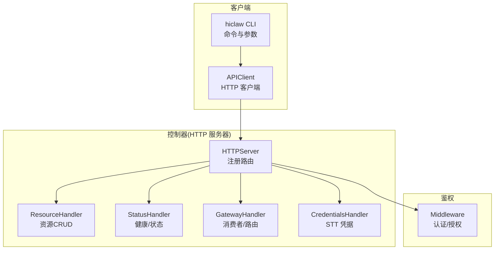
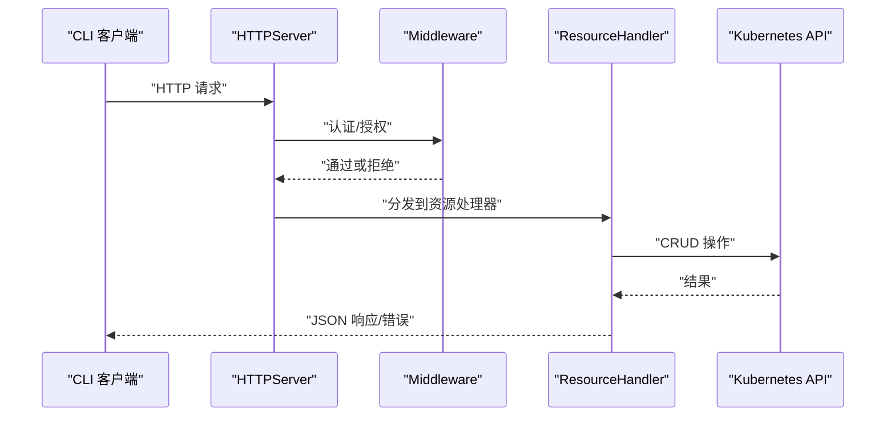
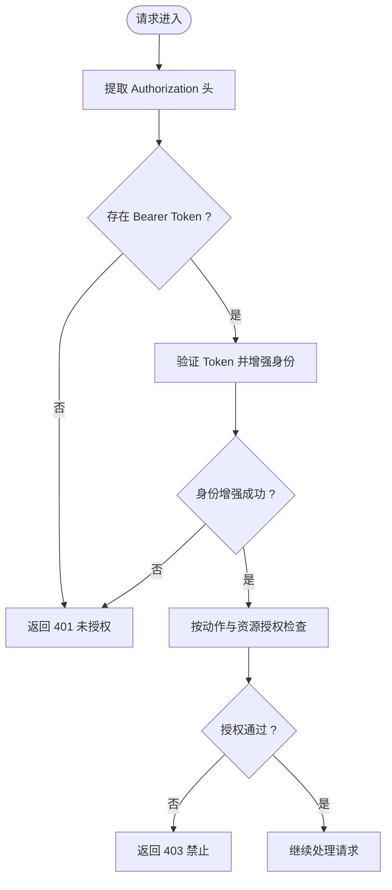
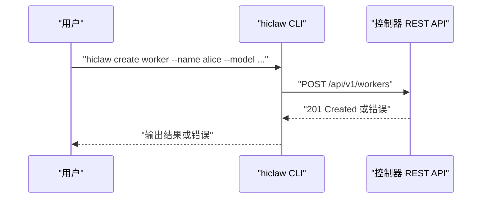
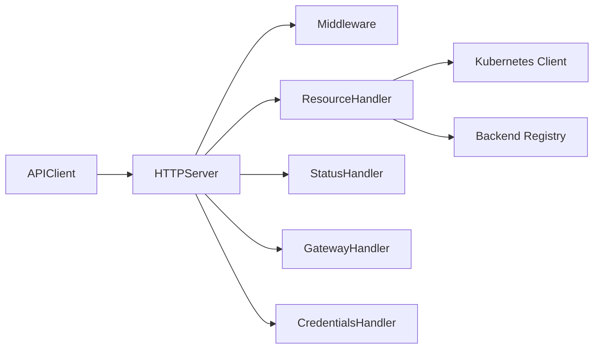

# API 参考

<cite>
**本文引用的文件**
- [hiclaw-controller/cmd/hiclaw/main.go](file://hiclaw-controller/cmd/hiclaw/main.go)
- [hiclaw-controller/cmd/hiclaw/client.go](file://hiclaw-controller/cmd/hiclaw/client.go)
- [hiclaw-controller/cmd/hiclaw/create.go](file://hiclaw-controller/cmd/hiclaw/create.go)
- [hiclaw-controller/cmd/hiclaw/update.go](file://hiclaw-controller/cmd/hiclaw/update.go)
- [hiclaw-controller/cmd/hiclaw/delete.go](file://hiclaw-controller/cmd/hiclaw/delete.go)
- [hiclaw-controller/cmd/hiclaw/worker_cmd.go](file://hiclaw-controller/cmd/hiclaw/worker_cmd.go)
- [hiclaw-controller/cmd/hiclaw/status_cmd.go](file://hiclaw-controller/cmd/hiclaw/status_cmd.go)
- [hiclaw-controller/internal/server/http.go](file://hiclaw-controller/internal/server/http.go)
- [hiclaw-controller/internal/server/resource_handler.go](file://hiclaw-controller/internal/server/resource_handler.go)
- [hiclaw-controller/internal/server/status_handler.go](file://hiclaw-controller/internal/server/status_handler.go)
- [hiclaw-controller/internal/server/gateway_handler.go](file://hiclaw-controller/internal/server/gateway_handler.go)
- [hiclaw-controller/internal/server/credentials_handler.go](file://hiclaw-controller/internal/server/credentials_handler.go)
- [hiclaw-controller/internal/httputil/response.go](file://hiclaw-controller/internal/httputil/response.go)
- [hiclaw-controller/internal/auth/middleware.go](file://hiclaw-controller/internal/auth/middleware.go)
- [hiclaw-controller/api/v1beta1/types.go](file://hiclaw-controller/api/v1beta1/types.go)
</cite>

## 目录
1. [简介](#简介)
2. [项目结构](#项目结构)
3. [核心组件](#核心组件)
4. [架构总览](#架构总览)
5. [详细组件分析](#详细组件分析)
6. [依赖分析](#依赖分析)
7. [性能考虑](#性能考虑)
8. [故障排查指南](#故障排查指南)
9. [结论](#结论)
10. [附录](#附录)

## 简介
本文件为 HiClaw 的统一 API 参考，覆盖 hiclaw-controller 提供的 REST API 与 hiclaw CLI 工具。内容包括：
- 统一 REST API：Worker、Team、Human、Manager 资源管理端点；运行时生命周期端点；网关与凭据相关端点；健康检查与状态查询端点。
- 认证与授权：基于 Bearer Token 的鉴权流程与权限矩阵。
- 错误处理与状态码：标准错误响应格式与常见错误场景。
- CLI 工具：hiclaw 命令行用法、参数与示例。
- 版本控制与兼容性：API 版本策略与兼容性说明。
- 最佳实践与性能优化：请求模式、重试策略与并发建议。

## 项目结构
HiClaw 的 API 由控制器内置 HTTP 服务器提供，CLI 客户端通过统一的 REST API 与控制器交互。关键模块如下：
- 控制器 HTTP 服务：注册资源 CRUD、生命周期、状态、网关与凭据等端点。
- 资源处理器：实现 Worker/Team/Human/Manager 的创建、读取、更新、删除与列表。
- 鉴权中间件：负责 Bearer Token 验证、身份增强与授权检查。
- 标准响应工具：统一 JSON 错误响应格式。
- CLI 客户端：封装 HTTP 请求、自动发现令牌、解析响应并输出。

图表来源
- [hiclaw-controller/internal/server/http.go:36-112](file://hiclaw-controller/internal/server/http.go#L36-L112)
- [hiclaw-controller/cmd/hiclaw/main.go:9-34](file://hiclaw-controller/cmd/hiclaw/main.go#L9-L34)
- [hiclaw-controller/cmd/hiclaw/client.go:32-94](file://hiclaw-controller/cmd/hiclaw/client.go#L32-L94)

章节来源
- [hiclaw-controller/internal/server/http.go:36-112](file://hiclaw-controller/internal/server/http.go#L36-L112)
- [hiclaw-controller/cmd/hiclaw/main.go:9-34](file://hiclaw-controller/cmd/hiclaw/main.go#L9-L34)

## 核心组件
- 统一 REST API 服务器：在指定地址启动，注册健康检查、状态查询、资源 CRUD、生命周期、网关与凭据端点。
- 资源处理器：对 Worker、Team、Human、Manager 进行声明式 CRUD，并在需要时合成团队成员视图。
- 鉴权中间件：支持 Bearer Token 认证、身份增强与基于角色的授权检查。
- 标准响应工具：统一 JSON 错误响应格式，便于客户端解析。
- CLI 客户端：封装 HTTP 请求，自动从环境变量发现令牌，支持 JSON 输出与错误解析。

章节来源
- [hiclaw-controller/internal/server/http.go:36-112](file://hiclaw-controller/internal/server/http.go#L36-L112)
- [hiclaw-controller/internal/server/resource_handler.go:22-57](file://hiclaw-controller/internal/server/resource_handler.go#L22-L57)
- [hiclaw-controller/internal/auth/middleware.go:31-118](file://hiclaw-controller/internal/auth/middleware.go#L31-L118)
- [hiclaw-controller/internal/httputil/response.go:9-26](file://hiclaw-controller/internal/httputil/response.go#L9-L26)
- [hiclaw-controller/cmd/hiclaw/client.go:32-94](file://hiclaw-controller/cmd/hiclaw/client.go#L32-L94)

## 架构总览
控制器以单一 HTTP 服务器提供统一 API，所有资源操作均通过 REST 接口完成。CLI 作为外部客户端，通过 Bearer Token 与控制器交互，实现资源的创建、更新、删除与状态查询。

图表来源
- [hiclaw-controller/internal/server/http.go:50-112](file://hiclaw-controller/internal/server/http.go#L50-L112)
- [hiclaw-controller/internal/auth/middleware.go:51-118](file://hiclaw-controller/internal/auth/middleware.go#L51-L118)
- [hiclaw-controller/internal/server/resource_handler.go:74-138](file://hiclaw-controller/internal/server/resource_handler.go#L74-L138)

## 详细组件分析

### 统一 REST API 端点清单
以下为控制器提供的统一 REST API 端点（均位于 /api/v1），按资源类型分组：

- 健康检查与状态
  - GET /healthz：健康检查，返回 200。
  - GET /api/v1/status：集群状态，返回控制器模式与资源计数。
  - GET /api/v1/version：控制器版本与运行模式。

- 资源管理（Worker/Team/Human/Manager）
  - Worker
    - POST /api/v1/workers：创建 Worker（独立）。
    - GET /api/v1/workers：列出 Worker（独立 + 团队成员聚合视图）。
    - GET /api/v1/workers/{name}：获取 Worker。
    - PUT /api/v1/workers/{name}：更新 Worker。
    - DELETE /api/v1/workers/{name}：删除 Worker。
  - Team
    - POST /api/v1/teams：创建 Team。
    - GET /api/v1/teams：列出 Team。
    - GET /api/v1/teams/{name}：获取 Team。
    - PUT /api/v1/teams/{name}：更新 Team。
    - DELETE /api/v1/teams/{name}：删除 Team。
  - Human
    - POST /api/v1/humans：创建 Human。
    - GET /api/v1/humans：列出 Human。
    - GET /api/v1/humans/{name}：获取 Human。
    - DELETE /api/v1/humans/{name}：删除 Human。
  - Manager
    - POST /api/v1/managers：创建 Manager。
    - GET /api/v1/managers：列出 Manager。
    - GET /api/v1/managers/{name}：获取 Manager。
    - PUT /api/v1/managers/{name}：更新 Manager。
    - DELETE /api/v1/managers/{name}：删除 Manager。

- 包上传
  - POST /api/v1/packages：上传包（用于 Worker/Manager 的包分发）。

- 生命周期（Imperative）
  - POST /api/v1/workers/{name}/wake：唤醒 Worker。
  - POST /api/v1/workers/{name}/sleep：让 Worker 睡眠。
  - POST /api/v1/workers/{name}/ensure-ready：确保 Worker 运行且就绪。
  - POST /api/v1/workers/{name}/ready：报告 Worker 就绪（可带心跳）。
  - GET /api/v1/workers/{name}/status：查询 Worker 运行时状态。

- 网关
  - POST /api/v1/gateway/consumers：创建消费者。
  - POST /api/v1/gateway/consumers/{id}/bind：绑定 AI 路由。
  - DELETE /api/v1/gateway/consumers/{id}：删除消费者。

- 凭据
  - POST /api/v1/credentials/sts：刷新 STS 临时凭证（自托管模式下可用）。

章节来源
- [hiclaw-controller/internal/server/http.go:42-112](file://hiclaw-controller/internal/server/http.go#L42-L112)
- [hiclaw-controller/internal/server/resource_handler.go:74-797](file://hiclaw-controller/internal/server/resource_handler.go#L74-L797)
- [hiclaw-controller/internal/server/gateway_handler.go:55-95](file://hiclaw-controller/internal/server/gateway_handler.go#L55-L95)
- [hiclaw-controller/internal/server/credentials_handler.go:23-40](file://hiclaw-controller/internal/server/credentials_handler.go#L23-L40)

### 认证与授权
- 认证方式：Bearer Token。客户端需在请求头设置 Authorization: Bearer <token>。
- 自动发现令牌：优先从环境变量 HICLAW_AUTH_TOKEN 获取；若为空则尝试读取 HICLAW_AUTH_TOKEN_FILE 指定的文件；两者都为空则为未认证模式。
- 授权策略：中间件根据动作（Action）与资源类型进行授权检查，支持按资源名与团队上下文的细粒度授权。

图表来源
- [hiclaw-controller/internal/auth/middleware.go:51-118](file://hiclaw-controller/internal/auth/middleware.go#L51-L118)
- [hiclaw-controller/cmd/hiclaw/client.go:49-65](file://hiclaw-controller/cmd/hiclaw/client.go#L49-L65)

章节来源
- [hiclaw-controller/internal/auth/middleware.go:51-118](file://hiclaw-controller/internal/auth/middleware.go#L51-L118)
- [hiclaw-controller/cmd/hiclaw/client.go:49-65](file://hiclaw-controller/cmd/hiclaw/client.go#L49-L65)

### 错误处理与状态码
- 标准错误响应：统一 JSON 结构 {"message": "..."}。
- 常见状态码：
  - 200：成功（部分端点返回 204 表示无内容）。
  - 201：创建成功。
  - 400：请求参数无效或缺失。
  - 401：未认证或令牌无效。
  - 403：无权限。
  - 404：资源不存在。
  - 409：冲突（如将 Worker 名称作为团队成员管理时）。
  - 500：服务器内部错误。
- CLI 错误：当响应非 2xx 时，客户端会解析错误消息并返回 APIError。

章节来源
- [hiclaw-controller/internal/httputil/response.go:9-26](file://hiclaw-controller/internal/httputil/response.go#L9-L26)
- [hiclaw-controller/internal/server/resource_handler.go:74-138](file://hiclaw-controller/internal/server/resource_handler.go#L74-L138)
- [hiclaw-controller/internal/server/gateway_handler.go:55-95](file://hiclaw-controller/internal/server/gateway_handler.go#L55-L95)
- [hiclaw-controller/cmd/hiclaw/client.go:110-128](file://hiclaw-controller/cmd/hiclaw/client.go#L110-L128)

### 数据模型与字段概览
- Worker/Team/Human/Manager 的 CRD 字段定义详见 v1beta1 类型文件。关键字段包括模型、运行时、镜像、身份描述、技能、MCP 服务器、暴露端口、通道策略、期望生命周期状态等。
- 聚合视图：/api/v1/workers 列表同时包含独立 Worker 与团队成员（合成响应），并附带实时后端状态。

章节来源
- [hiclaw-controller/api/v1beta1/types.go:71-145](file://hiclaw-controller/api/v1beta1/types.go#L71-L145)
- [hiclaw-controller/api/v1beta1/types.go:167-238](file://hiclaw-controller/api/v1beta1/types.go#L167-L238)
- [hiclaw-controller/api/v1beta1/types.go:339-355](file://hiclaw-controller/api/v1beta1/types.go#L339-L355)
- [hiclaw-controller/api/v1beta1/types.go:379-406](file://hiclaw-controller/api/v1beta1/types.go#L379-L406)
- [hiclaw-controller/internal/server/resource_handler.go:171-212](file://hiclaw-controller/internal/server/resource_handler.go#L171-L212)

### CLI 工具 hiclaw 参考
- 命令入口与环境变量
  - 命令：hiclaw
  - 环境变量：
    - HICLAW_CONTROLLER_URL：控制器基地址，默认 http://localhost:8090。
    - HICLAW_AUTH_TOKEN：Bearer 认证令牌。
    - HICLAW_AUTH_TOKEN_FILE：令牌文件路径（K8s 投射卷）。
- 子命令
  - create：创建 Worker/Team/Human/Manager。
  - get：获取资源详情或列表。
  - update：更新 Worker/Team/Manager。
  - delete：删除 Worker/Team/Human/Manager。
  - worker：Worker 生命周期操作（wake/sleep/ensure-ready/status/report-ready）。
  - status：集群状态查询。
  - version：控制器版本查询。
  - apply/worker：应用 YAML（高级用法，用于复杂字段如 mcpServers）。

图表来源
- [hiclaw-controller/cmd/hiclaw/main.go:9-34](file://hiclaw-controller/cmd/hiclaw/main.go#L9-L34)
- [hiclaw-controller/cmd/hiclaw/create.go:59-128](file://hiclaw-controller/cmd/hiclaw/create.go#L59-L128)
- [hiclaw-controller/cmd/hiclaw/client.go:69-94](file://hiclaw-controller/cmd/hiclaw/client.go#L69-L94)

章节来源
- [hiclaw-controller/cmd/hiclaw/main.go:9-34](file://hiclaw-controller/cmd/hiclaw/main.go#L9-L34)
- [hiclaw-controller/cmd/hiclaw/create.go:59-128](file://hiclaw-controller/cmd/hiclaw/create.go#L59-L128)
- [hiclaw-controller/cmd/hiclaw/update.go:78-84](file://hiclaw-controller/cmd/hiclaw/update.go#L78-L84)
- [hiclaw-controller/cmd/hiclaw/delete.go:65-72](file://hiclaw-controller/cmd/hiclaw/delete.go#L65-L72)
- [hiclaw-controller/cmd/hiclaw/worker_cmd.go:41-53](file://hiclaw-controller/cmd/hiclaw/worker_cmd.go#L41-L53)
- [hiclaw-controller/cmd/hiclaw/status_cmd.go:15-32](file://hiclaw-controller/cmd/hiclaw/status_cmd.go#L15-L32)

## 依赖分析
- 控制器 HTTP 服务器依赖鉴权中间件、资源处理器、状态处理器、网关处理器与凭据处理器。
- 资源处理器依赖 Kubernetes 客户端与后端注册表，用于 CRD 操作与运行时状态同步。
- CLI 客户端依赖 HTTP 客户端与令牌发现逻辑，统一处理 2xx/非 2xx 响应。

图表来源
- [hiclaw-controller/internal/server/http.go:36-112](file://hiclaw-controller/internal/server/http.go#L36-L112)
- [hiclaw-controller/internal/server/resource_handler.go:32-56](file://hiclaw-controller/internal/server/resource_handler.go#L32-L56)
- [hiclaw-controller/cmd/hiclaw/client.go:32-94](file://hiclaw-controller/cmd/hiclaw/client.go#L32-L94)

章节来源
- [hiclaw-controller/internal/server/http.go:36-112](file://hiclaw-controller/internal/server/http.go#L36-L112)
- [hiclaw-controller/internal/server/resource_handler.go:32-56](file://hiclaw-controller/internal/server/resource_handler.go#L32-L56)
- [hiclaw-controller/cmd/hiclaw/client.go:32-94](file://hiclaw-controller/cmd/hiclaw/client.go#L32-L94)

## 性能考虑
- 批量与聚合：/api/v1/workers 列表同时返回独立 Worker 与团队成员，避免客户端多次请求。
- 冲突重试：资源更新采用乐观锁重试机制，减少并发写入冲突导致的失败。
- 心跳与就绪：Worker 就绪上报支持一次性与周期性心跳，降低控制器轮询压力。
- 超时与重试：CLI 客户端默认超时时间与就绪等待策略，避免长时间阻塞。

章节来源
- [hiclaw-controller/internal/server/resource_handler.go:18-20](file://hiclaw-controller/internal/server/resource_handler.go#L18-L20)
- [hiclaw-controller/internal/server/resource_handler.go:248-304](file://hiclaw-controller/internal/server/resource_handler.go#L248-L304)
- [hiclaw-controller/cmd/hiclaw/worker_cmd.go:237-282](file://hiclaw-controller/cmd/hiclaw/worker_cmd.go#L237-L282)

## 故障排查指南
- 401 未认证：检查 HICLAW_AUTH_TOKEN 或 HICLAW_AUTH_TOKEN_FILE 是否正确设置。
- 403 禁止：确认调用者角色与目标资源是否满足授权矩阵。
- 404 资源不存在：确认资源名称与命名空间是否正确。
- 409 冲突：独立 Worker 与团队成员管理需使用对应端点（例如团队成员请使用 /api/v1/teams/{team}）。
- 500 服务器错误：查看控制器日志，关注 Kubernetes API 访问与后端状态同步。

章节来源
- [hiclaw-controller/internal/auth/middleware.go:61-110](file://hiclaw-controller/internal/auth/middleware.go#L61-L110)
- [hiclaw-controller/internal/server/resource_handler.go:85-92](file://hiclaw-controller/internal/server/resource_handler.go#L85-L92)
- [hiclaw-controller/internal/httputil/response.go:23-26](file://hiclaw-controller/internal/httputil/response.go#L23-L26)

## 结论
HiClaw 提供统一的 REST API 与 CLI 工具，覆盖 Worker/Team/Human/Manager 的全生命周期管理，并通过鉴权中间件保障访问安全。API 设计遵循声明式 CRUD 与运行时生命周期分离的原则，CLI 支持多种输出格式与错误解析，适合自动化集成与运维场景。

## 附录

### API 版本控制与兼容性
- 版本前缀：/api/v1，表示当前稳定版本。
- 兼容性策略：控制器在资源层面保持向后兼容，新增字段通常为可选；变更字段遵循 CRD 与控制器的兼容性约定。建议客户端始终以 JSON 字段名进行交互，避免依赖顺序或隐藏字段。

章节来源
- [hiclaw-controller/internal/server/http.go:50-112](file://hiclaw-controller/internal/server/http.go#L50-L112)
- [hiclaw-controller/api/v1beta1/types.go:10-13](file://hiclaw-controller/api/v1beta1/types.go#L10-L13)

### 请求与响应示例（路径引用）
- 创建 Worker
  - 请求：POST /api/v1/workers
  - 示例路径：[hiclaw-controller/cmd/hiclaw/create.go:104-106](file://hiclaw-controller/cmd/hiclaw/create.go#L104-L106)
- 更新 Worker
  - 请求：PUT /api/v1/workers/{name}
  - 示例路径：[hiclaw-controller/cmd/hiclaw/update.go:80-82](file://hiclaw-controller/cmd/hiclaw/update.go#L80-L82)
- 删除 Worker
  - 请求：DELETE /api/v1/workers/{name}
  - 示例路径：[hiclaw-controller/cmd/hiclaw/delete.go:67-69](file://hiclaw-controller/cmd/hiclaw/delete.go#L67-L69)
- Worker 就绪上报
  - 请求：POST /api/v1/workers/{name}/ready
  - 示例路径：[hiclaw-controller/cmd/hiclaw/worker_cmd.go:247-261](file://hiclaw-controller/cmd/hiclaw/worker_cmd.go#L247-L261)
- 状态查询
  - 请求：GET /api/v1/status
  - 示例路径：[hiclaw-controller/cmd/hiclaw/status_cmd.go:17-20](file://hiclaw-controller/cmd/hiclaw/status_cmd.go#L17-L20)

### 客户端实现指南
- 使用 APIClient：
  - 自动发现令牌：优先环境变量，其次令牌文件。
  - 发送请求：Do/DoJSON/DoMultipart。
  - 解析错误：非 2xx 返回 APIError，包含状态码与消息。
- CLI 使用建议：
  - 使用 -o json 输出便于自动化处理。
  - 对于复杂字段（如 mcpServers），推荐使用 apply -f YAML 的方式。

章节来源
- [hiclaw-controller/cmd/hiclaw/client.go:32-94](file://hiclaw-controller/cmd/hiclaw/client.go#L32-L94)
- [hiclaw-controller/cmd/hiclaw/main.go:16-19](file://hiclaw-controller/cmd/hiclaw/main.go#L16-L19)