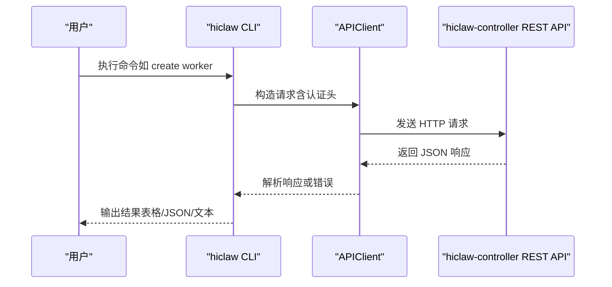
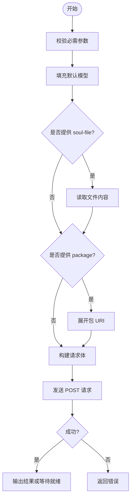
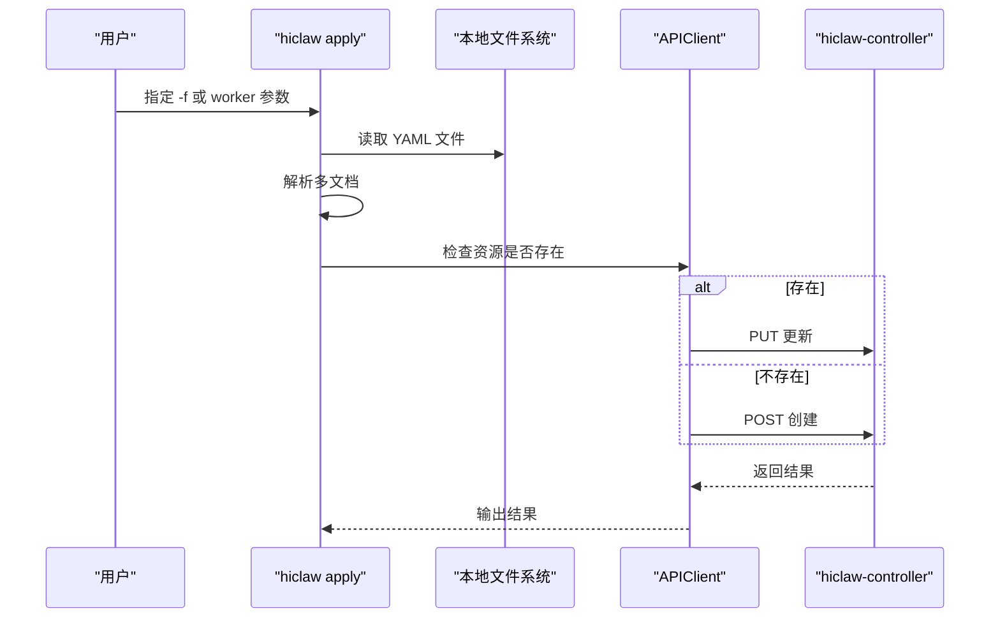
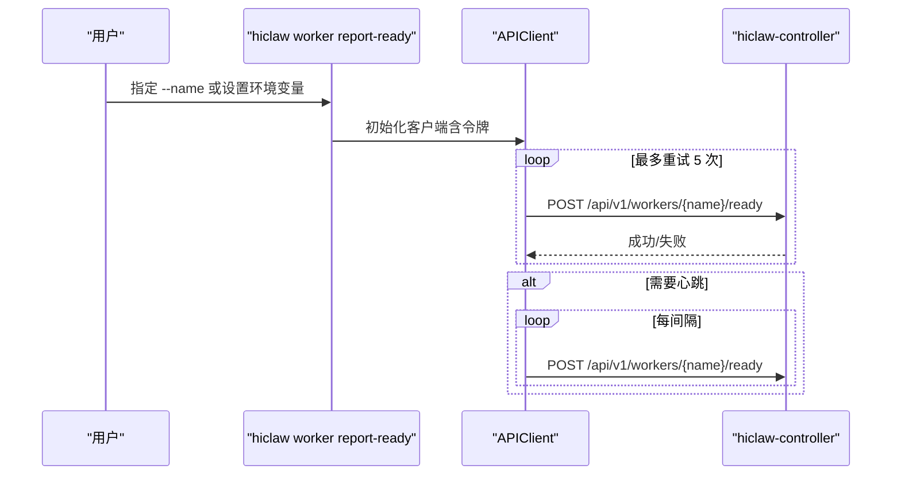
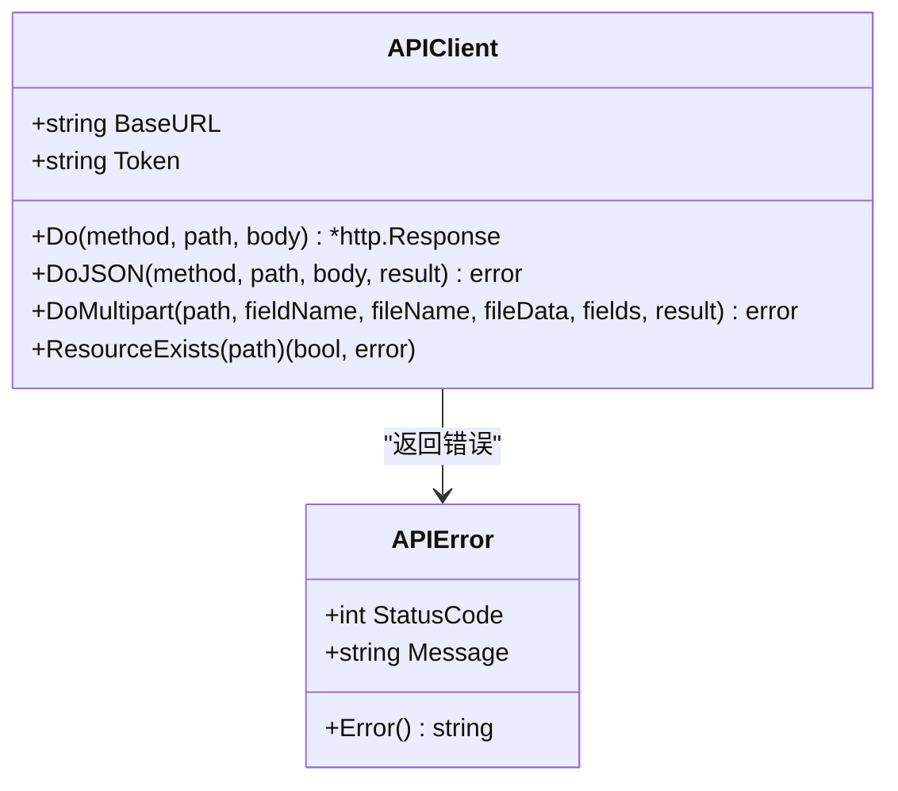

# CLI 工具

<cite>
**本文引用的文件**
- [main.go](file://hiclaw-controller/cmd/hiclaw/main.go)
- [create.go](file://hiclaw-controller/cmd/hiclaw/create.go)
- [get.go](file://hiclaw-controller/cmd/hiclaw/get.go)
- [update.go](file://hiclaw-controller/cmd/hiclaw/update.go)
- [delete.go](file://hiclaw-controller/cmd/hiclaw/delete.go)
- [apply.go](file://hiclaw-controller/cmd/hiclaw/apply.go)
- [worker_cmd.go](file://hiclaw-controller/cmd/hiclaw/worker_cmd.go)
- [status_cmd.go](file://hiclaw-controller/cmd/hiclaw/status_cmd.go)
- [output.go](file://hiclaw-controller/cmd/hiclaw/output.go)
- [client.go](file://hiclaw-controller/cmd/hiclaw/client.go)
- [quickstart.md](file://docs/quickstart.md)
- [manager-guide.md](file://docs/manager-guide.md)
- [worker-guide.md](file://docs/worker-guide.md)
- [hiclaw-apply.sh](file://install/hiclaw-apply.sh)
</cite>

## 目录
1. [简介](#简介)
2. [项目结构](#项目结构)
3. [核心组件](#核心组件)
4. [架构总览](#架构总览)
5. [详细组件分析](#详细组件分析)
6. [依赖分析](#依赖分析)
7. [性能考虑](#性能考虑)
8. [故障排除指南](#故障排除指南)
9. [结论](#结论)
10. [附录](#附录)

## 简介
hiclaw CLI 是 HiClaw 多智能体协作平台的资源管理命令行工具，通过 hiclaw-controller 提供的 REST API 实现对 Worker（工作者）、Team（团队）、Human（人类用户）、Manager（管理器）等资源的声明式与命令式管理。该工具支持创建、查询、更新、删除、应用配置、状态查看以及 Worker 生命周期控制，并提供多种输出格式与认证方式。

## 项目结构
hiclaw CLI 的核心实现位于 hiclaw-controller/cmd/hiclaw 目录中，采用 Cobra 命令框架组织命令树，按功能拆分为 create、get、update、delete、apply、worker、status 等子命令模块；同时提供通用的 HTTP 客户端封装、输出格式化与响应类型定义。

```mermaid
graph TB
Root["根命令 hiclaw<br/>环境变量: HICLAW_CONTROLLER_URL<br/>HICLAW_AUTH_TOKEN<br/>HICLAW_AUTH_TOKEN_FILE"] --> Create["create 子命令"]
Root --> Get["get 子命令"]
Root --> Update["update 子命令"]
Root --> Delete["delete 子命令"]
Root --> Apply["apply 子命令"]
Root --> Worker["worker 子命令组"]
Root --> Status["status 子命令"]
Root --> Version["version 子命令"]
Create --> CreateWorker["create worker"]
Create --> CreateTeam["create team"]
Create --> CreateHuman["create human"]
Create --> CreateManager["create manager"]
Get --> GetWorkers["get workers"]
Get --> GetTeams["get teams"]
Get --> GetHumans["get humans"]
Get --> GetManagers["get managers"]
Update --> UpdateWorker["update worker"]
Update --> UpdateTeam["update team"]
Update --> UpdateManager["update manager"]
Delete --> DeleteWorker["delete worker"]
Delete --> DeleteTeam["delete team"]
Delete --> DeleteHuman["delete human"]
Delete --> DeleteManager["delete manager"]
Apply --> ApplyFromFile["apply -f <yaml>"]
Apply --> ApplyWorker["apply worker"]
Worker --> WorkerWake["worker wake"]
Worker --> WorkerSleep["worker sleep"]
Worker --> WorkerEnsureReady["worker ensure-ready"]
Worker --> WorkerStatus["worker status"]
Worker --> WorkerReportReady["worker report-ready"]
```

**图表来源**
- [main.go:10-29](file://hiclaw-controller/cmd/hiclaw/main.go#L10-L29)
- [create.go:14-24](file://hiclaw-controller/cmd/hiclaw/create.go#L14-L24)
- [get.go:11-21](file://hiclaw-controller/cmd/hiclaw/get.go#L11-L21)
- [update.go:9-18](file://hiclaw-controller/cmd/hiclaw/update.go#L9-L18)
- [delete.go:9-19](file://hiclaw-controller/cmd/hiclaw/delete.go#L9-L19)
- [apply.go:16-39](file://hiclaw-controller/cmd/hiclaw/apply.go#L16-L39)
- [worker_cmd.go:11-22](file://hiclaw-controller/cmd/hiclaw/worker_cmd.go#L11-L22)
- [status_cmd.go:9-37](file://hiclaw-controller/cmd/hiclaw/status_cmd.go#L9-L37)

**章节来源**
- [main.go:9-35](file://hiclaw-controller/cmd/hiclaw/main.go#L9-L35)

## 核心组件
- 根命令与环境变量：设置控制器地址与认证令牌来源，注册所有子命令。
- HTTP 客户端：统一处理请求构造、认证头注入、JSON/多部分上传、资源存在性检查与错误解析。
- 输出格式化：支持表格输出与 JSON 输出，便于人读与机器解析。
- 响应类型：为 Worker、Team、Human、Manager、集群状态与版本提供结构化数据模型。

**章节来源**
- [client.go:32-65](file://hiclaw-controller/cmd/hiclaw/client.go#L32-L65)
- [output.go:11-59](file://hiclaw-controller/cmd/hiclaw/output.go#L11-L59)
- [get.go:289-366](file://hiclaw-controller/cmd/hiclaw/get.go#L289-L366)
- [status_cmd.go:71-82](file://hiclaw-controller/cmd/hiclaw/status_cmd.go#L71-L82)

## 架构总览
hiclaw CLI 通过 HTTP 客户端调用 hiclaw-controller 的 REST API，实现对资源的增删改查与状态查询。Worker 子命令组提供生命周期控制与就绪上报能力，配合控制器完成 Worker 的唤醒、休眠与状态展示。

**图表来源**
- [client.go:67-128](file://hiclaw-controller/cmd/hiclaw/client.go#L67-L128)
- [create.go:59-128](file://hiclaw-controller/cmd/hiclaw/create.go#L59-L128)
- [get.go:41-86](file://hiclaw-controller/cmd/hiclaw/get.go#L41-L86)

## 详细组件分析

### create 子命令
用于创建 Worker、Team、Human、Manager 四类资源。各子命令均提供必要的参数校验与默认值处理，并在成功后输出资源名称或等待 Worker 就绪。

- create worker
  - 必需参数：--name
  - 可选参数：--model、--runtime、--image、--identity、--soul、--soul-file、--skills、--package、--expose、--team、--role、--output、--wait-timeout、--no-wait
  - 行为：若未指定 --model，则回退到环境变量或默认模型；支持从文件读取 SOUL 内容；支持包 URI 展开；可选择立即返回或等待 Worker Ready。
  - 示例：创建 Worker 并指定运行时与暴露端口；从 ZIP 包导入配置并覆盖运行时。
  - 返回：成功时打印资源名或 JSON 结构；失败时返回错误信息。

- create team
  - 必需参数：--name、--leader-name
  - 可选参数：--leader-model、--leader-heartbeat-every、--worker-idle-timeout、--workers、--description
  - 行为：构建 leader 与 worker 列表，支持心跳与空闲超时配置。
  - 示例：创建带领导者的团队并分配初始成员。

- create human
  - 必需参数：--name、--display-name
  - 可选参数：--email、--permission-level、--accessible-teams、--accessible-workers、--note
  - 行为：创建人类用户并授予房间访问权限。

- create manager
  - 必需参数：--name、--model
  - 可选参数：--runtime、--image、--soul
  - 行为：创建管理器代理。

**图表来源**
- [create.go:59-128](file://hiclaw-controller/cmd/hiclaw/create.go#L59-L128)
- [create.go:416-430](file://hiclaw-controller/cmd/hiclaw/create.go#L416-L430)
- [create.go:443-472](file://hiclaw-controller/cmd/hiclaw/create.go#L443-L472)

**章节来源**
- [create.go:14-499](file://hiclaw-controller/cmd/hiclaw/create.go#L14-L499)

### get 子命令
用于列出或获取单个资源，支持 JSON 输出与表格输出两种模式。

- get workers
  - 参数：--team、-o/--output=json
  - 行为：支持按团队过滤；无参数时输出表格，有参数时输出 JSON。

- get teams
  - 参数：-o/--output=json
  - 行为：输出团队列表与就绪统计。

- get humans
  - 参数：-o/--output=json
  - 行为：输出人类用户列表。

- get managers
  - 参数：-o/--output=json
  - 行为：输出管理器列表。

**章节来源**
- [get.go:11-283](file://hiclaw-controller/cmd/hiclaw/get.go#L11-L283)

### update 子命令
仅更新指定字段，要求至少提供一个更新字段。

- update worker
  - 参数：--name 必需；--model、--runtime、--image、--identity、--soul、--skills、--package、--expose
  - 行为：构建增量请求体并发送 PUT。

- update team
  - 参数：--name 必需；--description、--leader-model、--leader-heartbeat-every、--worker-idle-timeout
  - 行为：支持 leader 子对象的增量更新。

- update manager
  - 参数：--name 必需；--model、--runtime、--image、--soul

**章节来源**
- [update.go:9-215](file://hiclaw-controller/cmd/hiclaw/update.go#L9-L215)

### delete 子命令
删除指定资源，要求提供资源名称。

- delete worker <name>
- delete team <name>
- delete human <name>
- delete manager <name>

**章节来源**
- [delete.go:9-73](file://hiclaw-controller/cmd/hiclaw/delete.go#L9-L73)

### apply 子命令
支持从文件或参数创建/更新资源，具备声明式管理能力。

- apply -f <yaml>
  - 行为：解析 YAML 文档，逐个资源判断是否存在并执行创建或更新；支持多文档（以分隔符分隔）。
  - 注意：YAML 中的 Kind 与 Name 必须存在。

- apply worker
  - 参数：--name 必需；--model、--zip、--runtime、--image、--identity、--soul、--soul-file、--skills、--package、--expose、--team、--role
  - 行为：支持 ZIP 包上传与解包字段提取（manifest.json），并进行创建或更新。

**图表来源**
- [apply.go:56-126](file://hiclaw-controller/cmd/hiclaw/apply.go#L56-L126)
- [apply.go:176-334](file://hiclaw-controller/cmd/hiclaw/apply.go#L176-L334)

**章节来源**
- [apply.go:16-388](file://hiclaw-controller/cmd/hiclaw/apply.go#L16-L388)

### worker 子命令组
提供 Worker 生命周期与状态管理。

- worker wake
  - 参数：--name 必需；--team 可选
  - 行为：启动停止/休眠中的 Worker。

- worker sleep
  - 参数：--name 必需；--team 可选
  - 行为：停止运行中的 Worker（保留状态）。

- worker ensure-ready
  - 参数：--name 必需；--team 可选
  - 行为：若休眠则唤醒，然后报告当前阶段。

- worker status
  - 参数：--name 或 --team 必需其一；-o/--output=json
  - 行为：单个 Worker 状态详情或团队内 Worker 运行摘要表。

- worker report-ready
  - 参数：--name 或 HICLAW_WORKER_NAME；--heartbeat；--interval
  - 行为：一次性报告就绪；可开启周期心跳；支持重试与令牌刷新。

**图表来源**
- [worker_cmd.go:237-282](file://hiclaw-controller/cmd/hiclaw/worker_cmd.go#L237-L282)

**章节来源**
- [worker_cmd.go:11-299](file://hiclaw-controller/cmd/hiclaw/worker_cmd.go#L11-L299)

### status 与 version 子命令
- status
  - 行为：获取集群状态（模式、Worker/Team/Human 数量），支持 JSON 输出。
- version
  - 行为：获取控制器版本与模式，支持 JSON 输出。

**章节来源**
- [status_cmd.go:9-82](file://hiclaw-controller/cmd/hiclaw/status_cmd.go#L9-L82)

## 依赖分析
hiclaw CLI 通过 APIClient 统一处理 HTTP 通信，支持：
- JSON 请求/响应
- 多部分上传（用于 ZIP 包）
- 认证头注入（Bearer Token）
- 资源存在性检查
- 错误解析与重试策略（针对 Worker 就绪轮询）

**图表来源**
- [client.go:15-210](file://hiclaw-controller/cmd/hiclaw/client.go#L15-L210)

**章节来源**
- [client.go:32-210](file://hiclaw-controller/cmd/hiclaw/client.go#L32-L210)

## 性能考虑
- 超时与重试：HTTP 客户端默认超时为 30 秒；Worker 就绪轮询每 2 秒一次，最多等待指定时长。
- 输出格式：JSON 输出便于自动化处理，表格输出便于人工阅读。
- 批量与声明式：apply 支持多文档与增量同步，减少重复请求次数。

[本节为通用指导，无需特定文件来源]

## 故障排除指南
- 认证问题
  - 确认环境变量 HICLAW_AUTH_TOKEN 或 HICLAW_AUTH_TOKEN_FILE 设置正确。
  - 若控制器启用鉴权，未提供令牌可能导致 401/403。
- 控制器不可达
  - 检查 HICLAW_CONTROLLER_URL 是否指向正确的控制器地址与端口。
  - 使用 status 或 version 命令验证连通性。
- Worker 就绪超时
  - 使用 --wait-timeout 调整等待时间；使用 --no-wait 立即返回。
  - 使用 worker status 查看 Worker 当前阶段与容器状态摘要。
- YAML 应用失败
  - 确保 YAML 中包含 apiVersion、kind、metadata.name。
  - 使用 -o json 查看详细错误信息。
- Worker 就绪上报失败
  - 检查 HICLAW_WORKER_NAME 环境变量；令牌可能轮换，CLI 会在重试时重新读取。

**章节来源**
- [client.go:49-65](file://hiclaw-controller/cmd/hiclaw/client.go#L49-L65)
- [create.go:149-177](file://hiclaw-controller/cmd/hiclaw/create.go#L149-L177)
- [worker_cmd.go:237-282](file://hiclaw-controller/cmd/hiclaw/worker_cmd.go#L237-L282)
- [apply.go:72-82](file://hiclaw-controller/cmd/hiclaw/apply.go#L72-L82)

## 结论
hiclaw CLI 提供了从资源创建、查询、更新、删除到 Worker 生命周期管理与集群状态监控的完整命令集。通过统一的 HTTP 客户端与灵活的输出格式，既能满足人工运维场景，也能适配自动化脚本与 CI/CD 流水线。建议结合 apply 的声明式能力与 worker 子命令组的生命周期控制，构建稳定高效的多智能体协作工作流。

[本节为总结，无需特定文件来源]

## 附录

### 命令参考与示例

- create
  - create worker
    - 语法：hiclaw create worker --name <name> [--model <model>] [--runtime <runtime>] [--image <image>] [--identity <identity>] [--soul <soul>] [--soul-file <file>] [--skills <csv>] [--package <uri>] [--expose <ports>] [--team <team>] [--role <role>] [-o json] [--wait-timeout <duration>] [--no-wait]
    - 示例：创建 Worker 并指定运行时与暴露端口；从 ZIP 包导入配置。
  - create team
    - 语法：hiclaw create team --name <name> --leader-name <leader> [--leader-model <model>] [--leader-heartbeat-every <interval>] [--worker-idle-timeout <timeout>] [--workers <csv>] [--description <desc>]
    - 示例：创建带领导者的团队并分配初始成员。
  - create human
    - 语法：hiclaw create human --name <name> --display-name <display> [--email <email>] [--permission-level <level>] [--accessible-teams <csv>] [--accessible-workers <csv>] [--note <note>]
  - create manager
    - 语法：hiclaw create manager --name <name> --model <model> [--runtime <runtime>] [--image <image>] [--soul <soul>]

- get
  - get workers [<name>] [--team <team>] [-o json]
  - get teams [<name>] [-o json]
  - get humans [<name>] [-o json]
  - get managers [<name>] [-o json]

- update
  - update worker --name <name> [--model <model>] [--runtime <runtime>] [--image <image>] [--identity <identity>] [--soul <soul>] [--skills <csv>] [--package <uri>] [--expose <ports>]
  - update team --name <name> [--description <desc>] [--leader-model <model>] [--leader-heartbeat-every <interval>] [--worker-idle-timeout <timeout>]
  - update manager --name <name> [--model <model>] [--runtime <runtime>] [--image <image>] [--soul <soul>]

- delete
  - delete worker <name>
  - delete team <name>
  - delete human <name>
  - delete manager <name>

- apply
  - apply -f <file.yaml> [多个文件]
  - apply worker --name <name> [--model <model>] [--zip <file.zip>] [--runtime <runtime>] [--image <image>] [--identity <identity>] [--soul <soul>] [--soul-file <file>] [--skills <csv>] [--package <uri>] [--expose <ports>] [--team <team>] [--role <role>]

- worker
  - worker wake --name <name> [--team <team>]
  - worker sleep --name <name> [--team <team>]
  - worker ensure-ready --name <name> [--team <team>]
  - worker status [--name <name>|--team <team>] [-o json]
  - worker report-ready [--name <name>|HICLAW_WORKER_NAME] [--heartbeat] [--interval <duration>]

- status 与 version
  - hiclaw status [-o json]
  - hiclaw version [-o json]

**章节来源**
- [create.go:14-499](file://hiclaw-controller/cmd/hiclaw/create.go#L14-L499)
- [get.go:11-283](file://hiclaw-controller/cmd/hiclaw/get.go#L11-L283)
- [update.go:9-215](file://hiclaw-controller/cmd/hiclaw/update.go#L9-L215)
- [delete.go:9-73](file://hiclaw-controller/cmd/hiclaw/delete.go#L9-L73)
- [apply.go:16-388](file://hiclaw-controller/cmd/hiclaw/apply.go#L16-L388)
- [worker_cmd.go:11-299](file://hiclaw-controller/cmd/hiclaw/worker_cmd.go#L11-L299)
- [status_cmd.go:9-82](file://hiclaw-controller/cmd/hiclaw/status_cmd.go#L9-L82)

### 实际使用场景示例
- 快速入门与安装
  - 参考快速入门指南，在控制器容器内使用 hiclaw 创建 Worker 并验证。
- 声明式资源管理
  - 使用 install/hiclaw-apply.sh 将 YAML 资源导入到 Manager 容器中，再由 hiclaw apply -f 执行。
- Worker 生命周期
  - 使用 worker ensure-ready 确保 Worker 在任务前处于运行状态；使用 worker status 查看运行摘要。

**章节来源**
- [quickstart.md:53-60](file://docs/quickstart.md#L53-L60)
- [hiclaw-apply.sh:80-85](file://install/hiclaw-apply.sh#L80-L85)
- [worker_cmd.go:108-133](file://hiclaw-controller/cmd/hiclaw/worker_cmd.go#L108-L133)