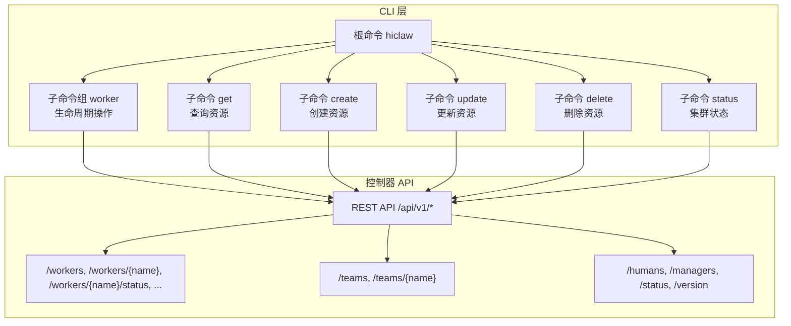
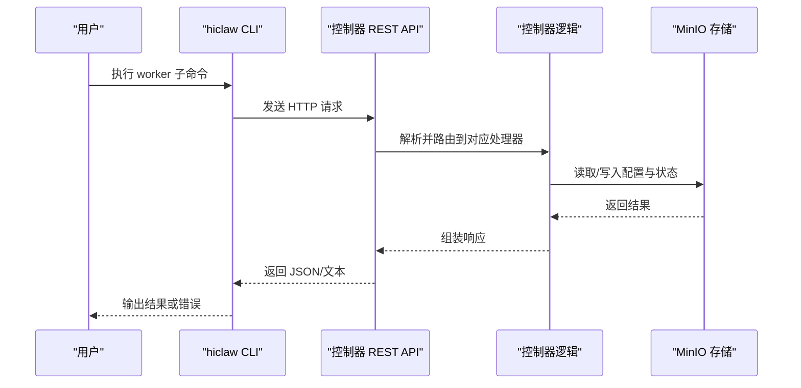
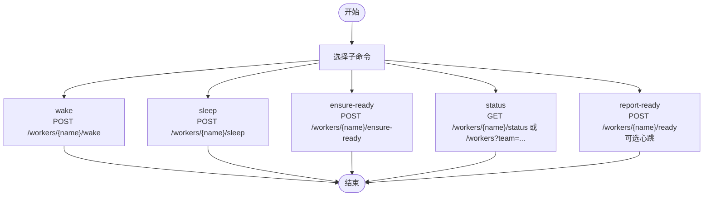
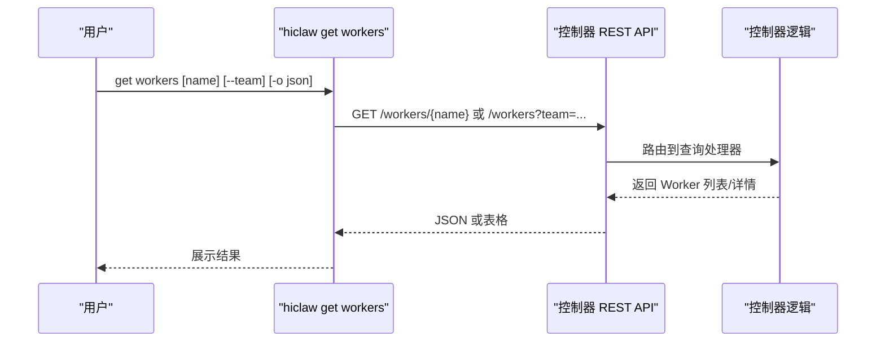
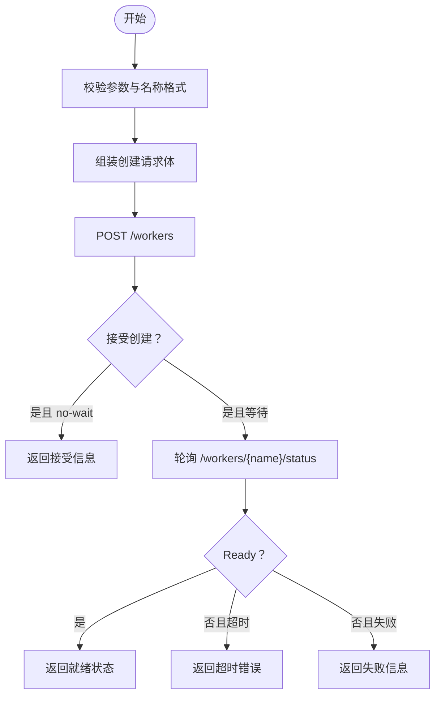
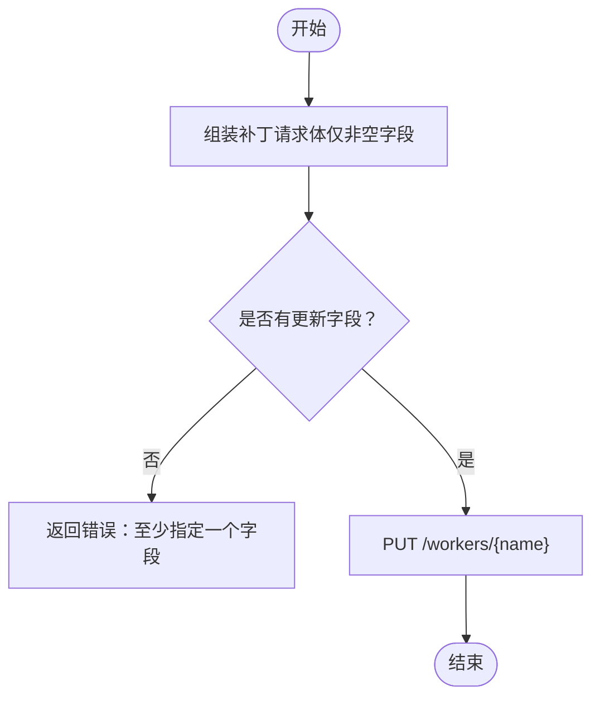
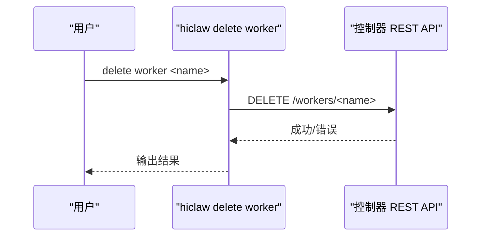

# Worker 管理命令

<cite>
**本文引用的文件**
- [hiclaw-controller/cmd/hiclaw/worker_cmd.go](file://hiclaw-controller/cmd/hiclaw/worker_cmd.go)
- [hiclaw-controller/cmd/hiclaw/main.go](file://hiclaw-controller/cmd/hiclaw/main.go)
- [hiclaw-controller/cmd/hiclaw/create.go](file://hiclaw-controller/cmd/hiclaw/create.go)
- [hiclaw-controller/cmd/hiclaw/update.go](file://hiclaw-controller/cmd/hiclaw/update.go)
- [hiclaw-controller/cmd/hiclaw/delete.go](file://hiclaw-controller/cmd/hiclaw/delete.go)
- [hiclaw-controller/cmd/hiclaw/get.go](file://hiclaw-controller/cmd/hiclaw/get.go)
- [hiclaw-controller/cmd/hiclaw/status_cmd.go](file://hiclaw-controller/cmd/hiclaw/status_cmd.go)
- [docs/zh-cn/worker-guide.md](file://docs/zh-cn/worker-guide.md)
- [docs/worker-guide.md](file://docs/worker-guide.md)
</cite>

## 目录
1. [简介](#简介)
2. [项目结构](#项目结构)
3. [核心组件](#核心组件)
4. [架构总览](#架构总览)
5. [详细组件分析](#详细组件分析)
6. [依赖分析](#依赖分析)
7. [性能考虑](#性能考虑)
8. [故障排查指南](#故障排查指南)
9. [结论](#结论)
10. [附录](#附录)

## 简介
本指南面向使用 hiclaw 的管理员与工程师，系统讲解 Worker 子命令组的完整用法与最佳实践，涵盖 Worker 生命周期管理（创建、启动、停止、重启、删除）、配置更新、状态监控、日志与故障排查、技能部署与版本控制、扩展与迁移备份等主题。文档基于 hiclaw 控制器 CLI 的 worker 子命令实现与官方文档整理而成，帮助你在不同环境中稳定地管理 Worker。

## 项目结构
hiclaw 的 Worker 管理命令位于控制器 CLI 的子命令模块中，围绕“创建/查询/更新/删除”以及“生命周期控制”两大维度组织。CLI 通过 REST API 与控制器交互，控制器再驱动底层资源（如容器、存储、网关等）完成实际操作。



图表来源
- [hiclaw-controller/cmd/hiclaw/main.go:9-35](file://hiclaw-controller/cmd/hiclaw/main.go#L9-L35)
- [hiclaw-controller/cmd/hiclaw/worker_cmd.go:11-22](file://hiclaw-controller/cmd/hiclaw/worker_cmd.go#L11-L22)
- [hiclaw-controller/cmd/hiclaw/get.go:11-21](file://hiclaw-controller/cmd/hiclaw/get.go#L11-L21)
- [hiclaw-controller/cmd/hiclaw/create.go:14-24](file://hiclaw-controller/cmd/hiclaw/create.go#L14-L24)
- [hiclaw-controller/cmd/hiclaw/update.go:9-18](file://hiclaw-controller/cmd/hiclaw/update.go#L9-L18)
- [hiclaw-controller/cmd/hiclaw/delete.go:9-19](file://hiclaw-controller/cmd/hiclaw/delete.go#L9-L19)
- [hiclaw-controller/cmd/hiclaw/status_cmd.go:9-37](file://hiclaw-controller/cmd/hiclaw/status_cmd.go#L9-L37)

章节来源
- [hiclaw-controller/cmd/hiclaw/main.go:9-35](file://hiclaw-controller/cmd/hiclaw/main.go#L9-L35)

## 核心组件
- Worker 子命令组：提供生命周期操作（唤醒、休眠、确保就绪、状态查询、报告就绪）。
- 查询命令组：支持按名称或团队过滤列出 Worker，输出表格或 JSON。
- 创建命令组：支持创建 Worker 并可选择等待就绪或立即返回。
- 更新命令组：仅更新指定字段，避免全量覆盖。
- 删除命令组：按资源类型删除。
- 集群状态命令：查看控制器模式与资源总量。

章节来源
- [hiclaw-controller/cmd/hiclaw/worker_cmd.go:11-299](file://hiclaw-controller/cmd/hiclaw/worker_cmd.go#L11-L299)
- [hiclaw-controller/cmd/hiclaw/get.go:27-92](file://hiclaw-controller/cmd/hiclaw/get.go#L27-L92)
- [hiclaw-controller/cmd/hiclaw/create.go:30-147](file://hiclaw-controller/cmd/hiclaw/create.go#L30-L147)
- [hiclaw-controller/cmd/hiclaw/update.go:24-98](file://hiclaw-controller/cmd/hiclaw/update.go#L24-L98)
- [hiclaw-controller/cmd/hiclaw/delete.go:21-73](file://hiclaw-controller/cmd/hiclaw/delete.go#L21-L73)
- [hiclaw-controller/cmd/hiclaw/status_cmd.go:9-82](file://hiclaw-controller/cmd/hiclaw/status_cmd.go#L9-L82)

## 架构总览
Worker 管理命令通过 CLI 调用控制器 REST API，控制器根据请求执行相应动作（如创建/更新/删除 Worker、查询状态、下发生命周期指令等）。Worker 的状态与配置由控制器统一维护，Worker 本身为无状态容器，配置与数据持久化在 MinIO。



图表来源
- [hiclaw-controller/cmd/hiclaw/worker_cmd.go:41-53](file://hiclaw-controller/cmd/hiclaw/worker_cmd.go#L41-L53)
- [hiclaw-controller/cmd/hiclaw/get.go:42-55](file://hiclaw-controller/cmd/hiclaw/get.go#L42-L55)
- [hiclaw-controller/cmd/hiclaw/create.go:102-128](file://hiclaw-controller/cmd/hiclaw/create.go#L102-L128)
- [hiclaw-controller/cmd/hiclaw/update.go:78-85](file://hiclaw-controller/cmd/hiclaw/update.go#L78-L85)
- [hiclaw-controller/cmd/hiclaw/delete.go:66-72](file://hiclaw-controller/cmd/hiclaw/delete.go#L66-L72)

## 详细组件分析

### Worker 子命令组（生命周期与状态）
- 子命令：wake、sleep、ensure-ready、status、report-ready
- 关键行为：
  - wake：启动已停止/休眠的 Worker 容器，保留状态。
  - sleep：停止运行中的 Worker 容器，保留状态。
  - ensure-ready：若休眠则唤醒，然后返回当前阶段。
  - status：单个 Worker 状态或团队下所有 Worker 的运行摘要表；支持 JSON 输出。
  - report-ready：向控制器报告 Worker 就绪；支持一次性或带心跳的心跳上报。



图表来源
- [hiclaw-controller/cmd/hiclaw/worker_cmd.go:28-289](file://hiclaw-controller/cmd/hiclaw/worker_cmd.go#L28-L289)

章节来源
- [hiclaw-controller/cmd/hiclaw/worker_cmd.go:28-289](file://hiclaw-controller/cmd/hiclaw/worker_cmd.go#L28-L289)

### 查询 Worker（get workers）
- 支持：
  - 按名称查询单个 Worker。
  - 不带参数列出所有 Worker，或按团队过滤。
  - 表格输出与 JSON 输出切换。
- 输出字段（表格）：NAME、PHASE、MODEL、TEAM、RUNTIME；（详情）包含 Phase、ContainerState、Image、Team、Role、Matrix 用户与房间信息等。



图表来源
- [hiclaw-controller/cmd/hiclaw/get.go:27-92](file://hiclaw-controller/cmd/hiclaw/get.go#L27-L92)

章节来源
- [hiclaw-controller/cmd/hiclaw/get.go:27-92](file://hiclaw-controller/cmd/hiclaw/get.go#L27-L92)

### 创建 Worker（create worker）
- 支持字段（部分）：name（必填）、model、runtime、image、identity、soul/soul-file、skills、package、expose、team、role、等待策略（no-wait、wait-timeout）。
- 行为：
  - 若未指定 model，默认回退到环境变量或内置默认值。
  - 支持“立即返回”或“等待就绪”两种模式。
  - 支持将 skills 作为逗号分隔列表传入，支持 expose 端口数组。
- 错误处理：对无效名称进行校验；对 package URI 进行规范化处理（支持 nacos://、http://、oss:// 或简写）。



图表来源
- [hiclaw-controller/cmd/hiclaw/create.go:30-177](file://hiclaw-controller/cmd/hiclaw/create.go#L30-L177)

章节来源
- [hiclaw-controller/cmd/hiclaw/create.go:30-177](file://hiclaw-controller/cmd/hiclaw/create.go#L30-L177)

### 更新 Worker（update worker）
- 支持字段：model、runtime、image、identity、soul、skills、package、expose。
- 行为：仅更新指定字段，避免全量覆盖；对 package URI 进行规范化处理；校验至少提供一个更新字段。



图表来源
- [hiclaw-controller/cmd/hiclaw/update.go:24-98](file://hiclaw-controller/cmd/hiclaw/update.go#L24-L98)

章节来源
- [hiclaw-controller/cmd/hiclaw/update.go:24-98](file://hiclaw-controller/cmd/hiclaw/update.go#L24-L98)

### 删除 Worker（delete worker）
- 行为：删除指定 Worker 资源；参数为资源名称。



图表来源
- [hiclaw-controller/cmd/hiclaw/delete.go:21-73](file://hiclaw-controller/cmd/hiclaw/delete.go#L21-L73)

章节来源
- [hiclaw-controller/cmd/hiclaw/delete.go:21-73](file://hiclaw-controller/cmd/hiclaw/delete.go#L21-L73)

### 集群状态与版本（status/version）
- status：显示控制器模式与 Worker/Team/Human 总数。
- version：显示控制器版本与模式。

章节来源
- [hiclaw-controller/cmd/hiclaw/status_cmd.go:9-82](file://hiclaw-controller/cmd/hiclaw/status_cmd.go#L9-L82)

## 依赖分析
- CLI 与控制器 API 的耦合度低，通过 REST 接口解耦。
- Worker 的状态与配置由控制器统一维护，Worker 本身为无状态容器，降低复杂性。
- 技能与配置通过 MinIO 同步，支持热重载与手动触发同步。

```mermaid
graph LR
CLI["CLI 命令"] --> API["REST API"]
API --> CTRL["控制器逻辑"]
CTRL --> STORE["MinIO 存储"]
CTRL --> RUNTIME["容器运行时/网关"]
STORE <- --> RUNTIME
```

图表来源
- [hiclaw-controller/cmd/hiclaw/worker_cmd.go:41-53](file://hiclaw-controller/cmd/hiclaw/worker_cmd.go#L41-L53)
- [hiclaw-controller/cmd/hiclaw/get.go:42-55](file://hiclaw-controller/cmd/hiclaw/get.go#L42-L55)
- [docs/zh-cn/worker-guide.md:137-185](file://docs/zh-cn/worker-guide.md#L137-L185)

## 性能考虑
- 状态查询与列表：建议在大规模 Worker 场景下优先使用 JSON 输出并结合外部工具处理，减少终端渲染开销。
- 等待就绪：创建时的等待策略可根据环境吞吐能力调整超时时间，避免长时间阻塞。
- 心跳上报：report-ready 的心跳间隔应与网络稳定性匹配，避免过于频繁导致额外负载。

## 故障排查指南
- Worker 无法启动
  - 检查容器日志；常见原因：配置文件未生成、命令缺失、端口未暴露。
- Worker 无法连接 Matrix
  - 从 Worker 内部验证网关端口可达；核对 openclaw.json 中的 Matrix 配置。
- Worker 无法访问 LLM
  - 使用 Worker 的密钥测试 AI 网关；401 表示密钥不一致，403 表示未授权。
- Worker 无法访问 MCP（GitHub）
  - 使用 mcporter 测试连通性；403 表示未授权。
- 重置 Worker
  - 停止并删除容器后，让 Manager 重新创建；配置与数据在 MinIO，删除容器不丢失工作内容。
- 手动同步文件
  - 在 Worker 容器内执行同步命令，立即应用最新配置与技能。

章节来源
- [docs/zh-cn/worker-guide.md:61-123](file://docs/zh-cn/worker-guide.md#L61-L123)
- [docs/zh-cn/worker-guide.md:176-185](file://docs/zh-cn/worker-guide.md#L176-L185)
- [docs/worker-guide.md:61-123](file://docs/worker-guide.md#L61-L123)
- [docs/worker-guide.md:176-185](file://docs/worker-guide.md#L176-L185)

## 结论
通过 hiclaw CLI 的 Worker 子命令组，管理员可以高效完成 Worker 的创建、更新、删除与生命周期管理，配合状态查询与报告就绪功能，形成完整的运维闭环。结合官方文档中的故障排查与同步机制，可在多环境下稳定地管理 Worker 集群。

## 附录

### Worker 子命令语法与参数速查
- worker wake
  - 用途：唤醒休眠的 Worker。
  - 参数：--name（必填）、--team（可选）。
- worker sleep
  - 用途：停止运行中的 Worker。
  - 参数：--name（必填）、--team（可选）。
- worker ensure-ready
  - 用途：若休眠则唤醒，返回当前阶段。
  - 参数：--name（必填）、--team（可选）。
- worker status
  - 用途：查询单个或团队下 Worker 的运行状态。
  - 参数：--name（二选一）、--team（二选一）、-o/--output=json。
- worker report-ready
  - 用途：报告 Worker 就绪；支持心跳。
  - 参数：--name（可选，缺省读取环境变量）、--heartbeat、--interval（需配合 heartbeat）。

章节来源
- [hiclaw-controller/cmd/hiclaw/worker_cmd.go:28-289](file://hiclaw-controller/cmd/hiclaw/worker_cmd.go#L28-L289)

### Worker 创建与更新常用场景
- 创建 Worker 并等待就绪：指定 --name 与 --model，等待控制器完成容器创建与初始化。
- 创建 Worker 后立即返回：使用 --no-wait，随后通过 get workers 或 worker status 跟踪。
- 更新模型与镜像：仅提供 --model 与 --image，避免覆盖其他字段。
- 配置暴露端口：使用 --expose 传入逗号分隔的端口列表。
- 指定技能包：使用 --package 提供 URI（支持简写与 Nacos 规范化）。

章节来源
- [hiclaw-controller/cmd/hiclaw/create.go:30-147](file://hiclaw-controller/cmd/hiclaw/create.go#L30-L147)
- [hiclaw-controller/cmd/hiclaw/update.go:24-98](file://hiclaw-controller/cmd/hiclaw/update.go#L24-L98)

### Worker 状态监控与日志查看
- 使用 get workers 或 worker status 获取运行摘要与详情。
- 使用 worker status -o json 便于自动化处理。
- 结合集群状态命令查看整体规模与模式。

章节来源
- [hiclaw-controller/cmd/hiclaw/get.go:27-92](file://hiclaw-controller/cmd/hiclaw/get.go#L27-L92)
- [hiclaw-controller/cmd/hiclaw/worker_cmd.go:139-210](file://hiclaw-controller/cmd/hiclaw/worker_cmd.go#L139-L210)
- [hiclaw-controller/cmd/hiclaw/status_cmd.go:9-37](file://hiclaw-controller/cmd/hiclaw/status_cmd.go#L9-L37)

### 配置文件管理、技能部署与版本控制最佳实践
- 配置文件与数据持久化于 MinIO，Worker 为无状态容器，便于迁移与备份。
- 使用 report-ready 的心跳机制维持健康状态，避免误判离线。
- 通过 update worker 仅更新必要字段，减少回滚风险。
- 使用 get workers 与 worker status 的 JSON 输出，配合 CI/CD 自动化巡检。
- 如需紧急恢复，可先删除容器，再让 Manager 重新创建，配置与数据仍保留在 MinIO。

章节来源
- [docs/zh-cn/worker-guide.md:124-131](file://docs/zh-cn/worker-guide.md#L124-L131)
- [docs/zh-cn/worker-guide.md:137-185](file://docs/zh-cn/worker-guide.md#L137-L185)
- [hiclaw-controller/cmd/hiclaw/update.go:74-85](file://hiclaw-controller/cmd/hiclaw/update.go#L74-L85)