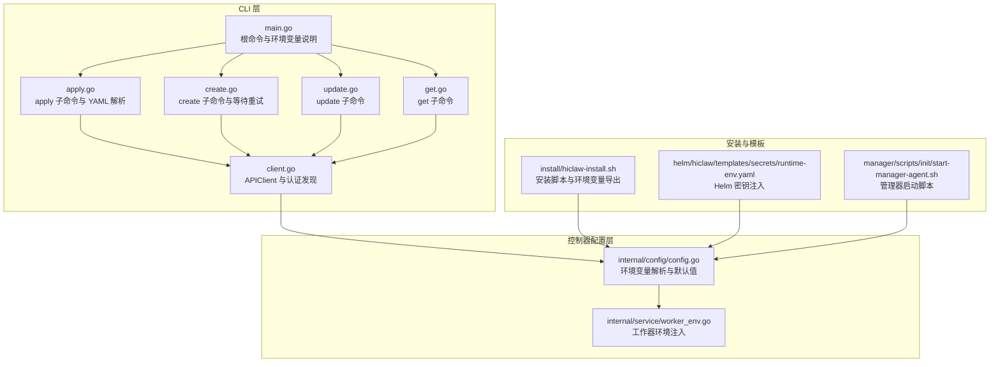
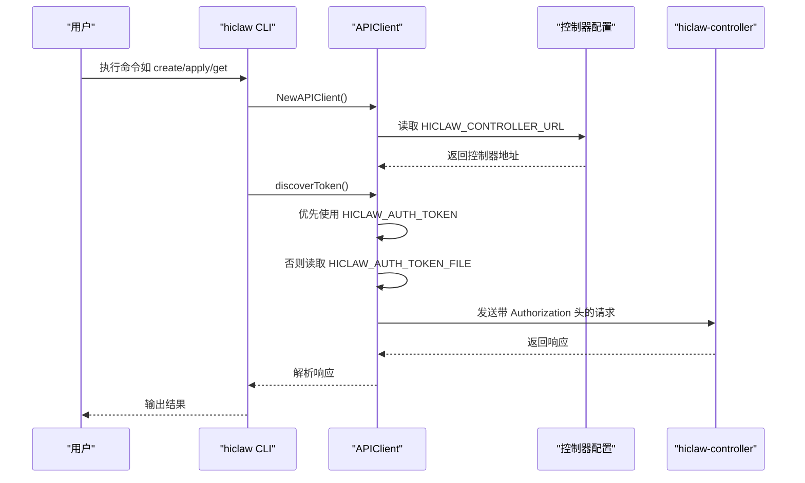
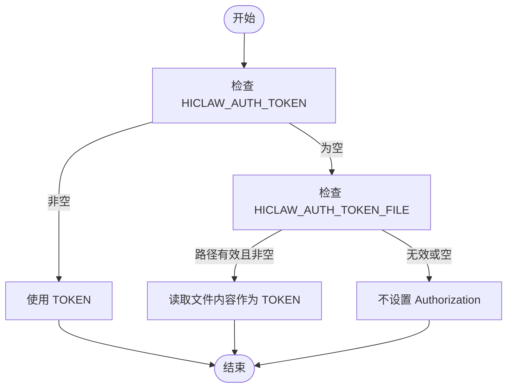
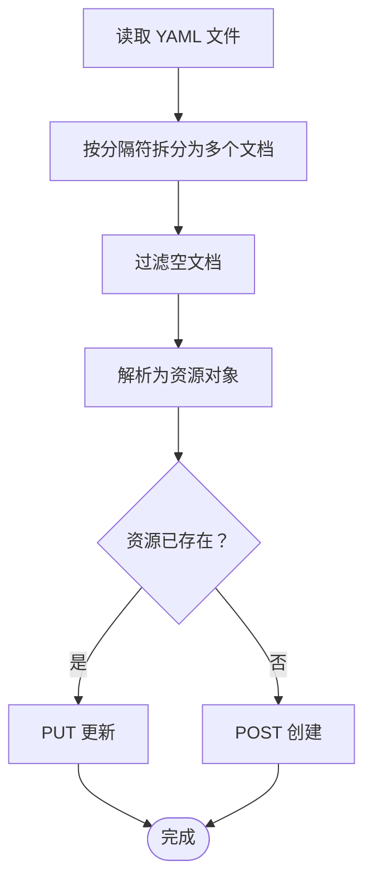
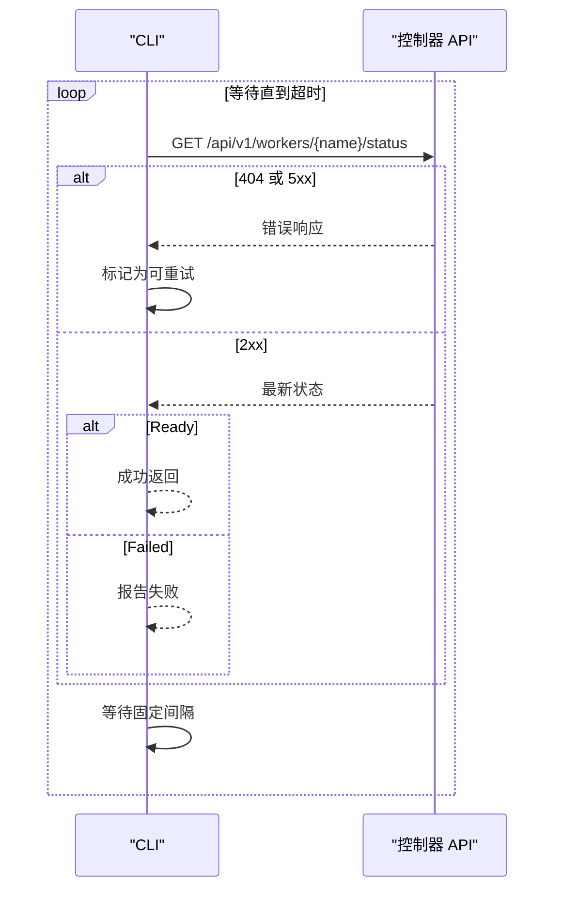
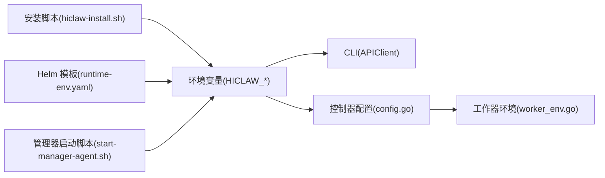

# 命令选项与配置

<cite>
**本文引用的文件**
- [hiclaw-controller/cmd/hiclaw/main.go](file://hiclaw-controller/cmd/hiclaw/main.go)
- [hiclaw-controller/cmd/hiclaw/client.go](file://hiclaw-controller/cmd/hiclaw/client.go)
- [hiclaw-controller/cmd/hiclaw/apply.go](file://hiclaw-controller/cmd/hiclaw/apply.go)
- [hiclaw-controller/cmd/hiclaw/create.go](file://hiclaw-controller/cmd/hiclaw/create.go)
- [hiclaw-controller/cmd/hiclaw/update.go](file://hiclaw-controller/cmd/hiclaw/update.go)
- [hiclaw-controller/cmd/hiclaw/get.go](file://hiclaw-controller/cmd/hiclaw/get.go)
- [hiclaw-controller/internal/config/config.go](file://hiclaw-controller/internal/config/config.go)
- [hiclaw-controller/internal/service/worker_env.go](file://hiclaw-controller/internal/service/worker_env.go)
- [install/hiclaw-install.sh](file://install/hiclaw-install.sh)
- [helm/hiclaw/templates/secrets/runtime-env.yaml](file://helm/hiclaw/templates/secrets/runtime-env.yaml)
- [manager/scripts/init/start-manager-agent.sh](file://manager/scripts/init/start-manager-agent.sh)
</cite>

## 目录
1. [简介](#简介)
2. [项目结构](#项目结构)
3. [核心组件](#核心组件)
4. [架构总览](#架构总览)
5. [详细组件分析](#详细组件分析)
6. [依赖分析](#依赖分析)
7. [性能考虑](#性能考虑)
8. [故障排查指南](#故障排查指南)
9. [结论](#结论)
10. [附录](#附录)

## 简介
本文件为 hiclaw CLI 工具的通用选项与配置参考，覆盖以下主题：
- 全局选项与环境变量：重点说明 HICLAW_CONTROLLER_URL、HICLAW_AUTH_TOKEN、HICLAW_AUTH_TOKEN_FILE 的作用与优先级
- 命令行选项的优先级与继承规则：如何在命令行参数、环境变量与默认值之间进行选择
- 配置文件格式与结构：YAML 与 JSON 的支持范围与示例路径
- 认证机制、SSL 与代理：当前实现中的行为与可配置项
- 批量操作、并行执行与错误重试：CLI 层面的等待与重试策略
- 配置模板与最佳实践：基于仓库中现有模板与安装脚本的最佳实践建议

## 项目结构
hiclaw CLI 位于控制器子项目的命令行入口目录，围绕 Cobra 构建命令树，通过 HTTP 客户端访问控制器 REST API，并在多处读取环境变量以决定运行时行为。

**图示来源**
- [hiclaw-controller/cmd/hiclaw/main.go:10-20](file://hiclaw-controller/cmd/hiclaw/main.go#L10-L20)
- [hiclaw-controller/cmd/hiclaw/client.go:32-47](file://hiclaw-controller/cmd/hiclaw/client.go#L32-L47)
- [hiclaw-controller/cmd/hiclaw/apply.go:16-39](file://hiclaw-controller/cmd/hiclaw/apply.go#L16-L39)
- [hiclaw-controller/cmd/hiclaw/create.go:14-24](file://hiclaw-controller/cmd/hiclaw/create.go#L14-L24)
- [hiclaw-controller/cmd/hiclaw/update.go:9-18](file://hiclaw-controller/cmd/hiclaw/update.go#L9-L18)
- [hiclaw-controller/cmd/hiclaw/get.go:11-21](file://hiclaw-controller/cmd/hiclaw/get.go#L11-L21)
- [hiclaw-controller/internal/config/config.go:283-324](file://hiclaw-controller/internal/config/config.go#L283-L324)
- [hiclaw-controller/internal/service/worker_env.go:116-135](file://hiclaw-controller/internal/service/worker_env.go#L116-L135)
- [install/hiclaw-install.sh:1965-1986](file://install/hiclaw-install.sh#L1965-L1986)
- [helm/hiclaw/templates/secrets/runtime-env.yaml:26-35](file://helm/hiclaw/templates/secrets/runtime-env.yaml#L26-L35)
- [manager/scripts/init/start-manager-agent.sh:648-675](file://manager/scripts/init/start-manager-agent.sh#L648-L675)

**章节来源**
- [hiclaw-controller/cmd/hiclaw/main.go:10-20](file://hiclaw-controller/cmd/hiclaw/main.go#L10-L20)
- [hiclaw-controller/cmd/hiclaw/client.go:32-47](file://hiclaw-controller/cmd/hiclaw/client.go#L32-L47)

## 核心组件
- 根命令与全局环境变量
  - 根命令在帮助信息中声明了三个关键环境变量：HICLAW_CONTROLLER_URL、HICLAW_AUTH_TOKEN、HICLAW_AUTH_TOKEN_FILE
  - 这些变量用于控制 CLI 的目标控制器地址与认证令牌来源
- HTTP 客户端与认证发现
  - APIClient 从 HICLAW_CONTROLLER_URL 读取基础 URL，默认回退到本地端口
  - 认证令牌发现顺序：HICLAW_AUTH_TOKEN → HICLAW_AUTH_TOKEN_FILE（K8s 投影卷）→ 空字符串（未认证）
- 资源操作命令
  - apply：支持从文件批量应用资源；内部解析 YAML 文档并逐个创建或更新
  - create：创建资源；支持等待 Worker 就绪与重试逻辑
  - update：按需更新指定字段
  - get：查询资源列表或详情

**章节来源**
- [hiclaw-controller/cmd/hiclaw/main.go:16-19](file://hiclaw-controller/cmd/hiclaw/main.go#L16-L19)
- [hiclaw-controller/cmd/hiclaw/client.go:32-65](file://hiclaw-controller/cmd/hiclaw/client.go#L32-L65)
- [hiclaw-controller/cmd/hiclaw/apply.go:56-86](file://hiclaw-controller/cmd/hiclaw/apply.go#L56-L86)
- [hiclaw-controller/cmd/hiclaw/create.go:149-191](file://hiclaw-controller/cmd/hiclaw/create.go#L149-L191)

## 架构总览
hiclaw CLI 通过 Cobra 命令树组织各子命令，每个子命令最终调用 APIClient 发起 HTTP 请求。认证令牌由 discoverToken 按优先级自动选择，控制器配置层负责解析环境变量并注入到工作器运行时。

**图示来源**
- [hiclaw-controller/cmd/hiclaw/client.go:32-65](file://hiclaw-controller/cmd/hiclaw/client.go#L32-L65)
- [hiclaw-controller/internal/config/config.go:283-324](file://hiclaw-controller/internal/config/config.go#L283-L324)

## 详细组件分析

### 通用选项与环境变量
- HICLAW_CONTROLLER_URL
  - 作用：CLI 连接的控制器基地址；若为空，使用默认地址
  - 位置：APIClient 初始化时读取
- HICLAW_AUTH_TOKEN
  - 作用：Bearer 认证令牌（容器注入场景）
  - 位置：discoverToken 优先使用该变量
- HICLAW_AUTH_TOKEN_FILE
  - 作用：指向包含令牌内容的文件路径（K8s 投影卷）
  - 位置：discoverToken 在 TOKEN 变量为空时读取该文件
- 其他与 CLI 行为相关的环境变量
  - HICLAW_DEFAULT_MODEL：Worker 默认模型 ID，用于 create/apply worker 时的默认值
  - HICLAW_NACOS_REGISTRY_URI：包注册表 URI，用于 expandPackageURI
  - HICLAW_LLM_PROVIDER/HICLAW_LLM_API_KEY/HICLAW_OPENAI_BASE_URL：LLM 提供商与密钥、基础 URL（安装与控制器配置中使用）

**章节来源**
- [hiclaw-controller/cmd/hiclaw/main.go:16-19](file://hiclaw-controller/cmd/hiclaw/main.go#L16-L19)
- [hiclaw-controller/cmd/hiclaw/client.go:32-47](file://hiclaw-controller/cmd/hiclaw/client.go#L32-L47)
- [hiclaw-controller/cmd/hiclaw/client.go:54-65](file://hiclaw-controller/cmd/hiclaw/client.go#L54-L65)
- [hiclaw-controller/cmd/hiclaw/create.go:425-430](file://hiclaw-controller/cmd/hiclaw/create.go#L425-L430)
- [hiclaw-controller/cmd/hiclaw/create.go:443-472](file://hiclaw-controller/cmd/hiclaw/create.go#L443-L472)
- [hiclaw-controller/internal/config/config.go:283-324](file://hiclaw-controller/internal/config/config.go#L283-L324)
- [install/hiclaw-install.sh:1965-1986](file://install/hiclaw-install.sh#L1965-L1986)

### 命令行选项优先级与继承规则
- 控制器地址
  - CLI 读取 HICLAW_CONTROLLER_URL；若为空使用默认地址
- 认证令牌
  - discoverToken 优先级：HICLAW_AUTH_TOKEN > HICLAW_AUTH_TOKEN_FILE > 空字符串
- Worker 默认模型
  - defaultWorkerModel 优先级：HICLAW_DEFAULT_MODEL > 固定默认值
- 包注册表
  - expandPackageURI 优先级：显式传入 URI > HICLAW_NACOS_REGISTRY_URI > 固定默认值
- 命令行参数与环境变量的组合
  - create/apply/update 子命令会将命令行参数与环境变量结合，仅在参数存在时写入请求体
  - 若未提供某些参数，将使用环境变量或默认值填充

**图示来源**
- [hiclaw-controller/cmd/hiclaw/client.go:54-65](file://hiclaw-controller/cmd/hiclaw/client.go#L54-L65)

**章节来源**
- [hiclaw-controller/cmd/hiclaw/client.go:32-65](file://hiclaw-controller/cmd/hiclaw/client.go#L32-L65)
- [hiclaw-controller/cmd/hiclaw/create.go:425-430](file://hiclaw-controller/cmd/hiclaw/create.go#L425-L430)
- [hiclaw-controller/cmd/hiclaw/create.go:443-472](file://hiclaw-controller/cmd/hiclaw/create.go#L443-L472)

### 配置文件格式与结构
- YAML 支持
  - apply 命令支持从文件批量应用资源，内部使用分隔符拆分多文档
  - 支持在单个文件中包含多个资源文档（以分隔符分隔），并逐个处理
- JSON 支持
  - CLI 内部以 JSON 形式与控制器交互；YAML 文件会被解析为资源对象后转换为 JSON 请求体
- 结构要点
  - 资源对象包含 apiVersion、kind、metadata.name、以及 spec 字段
  - apply 会根据是否存在同名资源决定创建或更新

**图示来源**
- [hiclaw-controller/cmd/hiclaw/apply.go:56-86](file://hiclaw-controller/cmd/hiclaw/apply.go#L56-L86)
- [hiclaw-controller/cmd/hiclaw/apply.go:128-145](file://hiclaw-controller/cmd/hiclaw/apply.go#L128-L145)

**章节来源**
- [hiclaw-controller/cmd/hiclaw/apply.go:56-86](file://hiclaw-controller/cmd/hiclaw/apply.go#L56-L86)
- [hiclaw-controller/cmd/hiclaw/apply.go:128-145](file://hiclaw-controller/cmd/hiclaw/apply.go#L128-L145)

### 认证机制、SSL 与代理
- 认证机制
  - 通过 Authorization: Bearer 头发送令牌
  - 令牌来源遵循 discoverToken 的优先级顺序
- SSL 配置
  - 当前 HTTP 客户端未显式设置 TLS 配置，使用系统默认行为
- 代理设置
  - 未在 CLI 中显式注入代理配置；如需代理，请通过系统网络或环境变量方式配置

**章节来源**
- [hiclaw-controller/cmd/hiclaw/client.go:89-91](file://hiclaw-controller/cmd/hiclaw/client.go#L89-L91)
- [hiclaw-controller/cmd/hiclaw/client.go:54-65](file://hiclaw-controller/cmd/hiclaw/client.go#L54-L65)

### 批量操作、并行执行与错误重试
- 批量操作
  - apply 命令支持一次读取多个文件，并逐个处理其中的资源文档
- 并行执行
  - CLI 层未实现并行执行；对多个文件与多文档的处理是顺序进行
- 错误重试
  - create 命令在等待 Worker 就绪时具备有限的重试逻辑：当状态查询返回 404 或 5xx 时视为可重试，并在超时前周期性轮询
  - 对于非重试类错误，直接失败并输出最后一次状态摘要

**图示来源**
- [hiclaw-controller/cmd/hiclaw/create.go:149-191](file://hiclaw-controller/cmd/hiclaw/create.go#L149-L191)

**章节来源**
- [hiclaw-controller/cmd/hiclaw/create.go:149-191](file://hiclaw-controller/cmd/hiclaw/create.go#L149-L191)

### 配置模板与最佳实践
- 安装脚本导出的关键环境变量
  - LLM 提供商、默认模型、OpenAI Base URL 等在安装阶段导出，便于后续容器使用
- Helm 密钥注入
  - 通过 Helm 模板将敏感信息注入到运行时环境变量
- 管理器启动脚本中的环境变量映射
  - 将 HICLAW_* 变量映射为具体服务所需的环境键，例如矩阵 E2EE、模型上下文窗口等

最佳实践建议
- 明确认证来源：在容器环境中优先使用 HICLAW_AUTH_TOKEN；在 Kubernetes 中可使用投影卷绑定 HICLAW_AUTH_TOKEN_FILE
- 统一模型策略：通过 HICLAW_DEFAULT_MODEL 在安装阶段统一默认模型，避免重复指定
- 包注册表：使用 HICLAW_NACOS_REGISTRY_URI 统一管理包注册表，简化 create/apply 的包引用
- 网络与安全：如需代理或自定义 SSL，请在系统层面或通过环境变量配置，确保 CLI 与控制器通信稳定

**章节来源**
- [install/hiclaw-install.sh:1965-1986](file://install/hiclaw-install.sh#L1965-L1986)
- [helm/hiclaw/templates/secrets/runtime-env.yaml:26-35](file://helm/hiclaw/templates/secrets/runtime-env.yaml#L26-L35)
- [manager/scripts/init/start-manager-agent.sh:648-675](file://manager/scripts/init/start-manager-agent.sh#L648-L675)

## 依赖分析
- CLI 与控制器配置
  - CLI 通过环境变量获取控制器地址与认证令牌
  - 控制器配置层解析环境变量并注入到工作器运行时
- CLI 与安装/模板
  - 安装脚本与 Helm 模板共同决定了运行时环境变量的初始值
  - 管理器启动脚本进一步将这些变量映射为具体服务所需

**图示来源**
- [hiclaw-controller/cmd/hiclaw/client.go:32-47](file://hiclaw-controller/cmd/hiclaw/client.go#L32-L47)
- [hiclaw-controller/internal/config/config.go:283-324](file://hiclaw-controller/internal/config/config.go#L283-L324)
- [hiclaw-controller/internal/service/worker_env.go:116-135](file://hiclaw-controller/internal/service/worker_env.go#L116-L135)
- [install/hiclaw-install.sh:1965-1986](file://install/hiclaw-install.sh#L1965-L1986)
- [helm/hiclaw/templates/secrets/runtime-env.yaml:26-35](file://helm/hiclaw/templates/secrets/runtime-env.yaml#L26-L35)
- [manager/scripts/init/start-manager-agent.sh:648-675](file://manager/scripts/init/start-manager-agent.sh#L648-L675)

**章节来源**
- [hiclaw-controller/cmd/hiclaw/client.go:32-47](file://hiclaw-controller/cmd/hiclaw/client.go#L32-L47)
- [hiclaw-controller/internal/config/config.go:283-324](file://hiclaw-controller/internal/config/config.go#L283-L324)

## 性能考虑
- 批量处理顺序化：apply 对多个文件与多文档采用顺序处理，避免并发带来的资源竞争
- 等待与重试：create 的就绪等待采用固定间隔轮询，建议在大规模部署时合理设置超时时间
- 网络与认证：尽量使用内网地址与稳定的令牌来源，减少网络抖动与认证失败导致的重试开销

## 故障排查指南
- 认证失败
  - 检查 HICLAW_AUTH_TOKEN 是否正确设置；若使用文件令牌，确认文件路径与内容
- 控制器连接失败
  - 检查 HICLAW_CONTROLLER_URL 是否可达；确认默认地址是否符合部署环境
- Worker 就绪超时
  - 使用 create 的等待参数调整超时时间；查看状态摘要以定位问题
- 包注册表解析错误
  - 检查 HICLAW_NACOS_REGISTRY_URI 格式与可用性；必要时显式传入完整 URI

**章节来源**
- [hiclaw-controller/cmd/hiclaw/client.go:54-65](file://hiclaw-controller/cmd/hiclaw/client.go#L54-L65)
- [hiclaw-controller/cmd/hiclaw/create.go:149-191](file://hiclaw-controller/cmd/hiclaw/create.go#L149-L191)
- [hiclaw-controller/cmd/hiclaw/create.go:443-472](file://hiclaw-controller/cmd/hiclaw/create.go#L443-L472)

## 结论
hiclaw CLI 通过明确的环境变量与命令行参数组合，提供了可控的资源管理能力。认证令牌的多来源支持与等待重试机制增强了在不同部署环境下的稳定性。建议在生产环境中统一使用安装脚本与 Helm 模板来初始化环境变量，并通过明确的令牌来源与网络配置保障通信可靠性。

## 附录
- 示例路径（不展示具体内容）
  - YAML 多文档示例：参见测试用例路径 [hiclaw-controller/cmd/hiclaw/main_test.go:155-201](file://hiclaw-controller/cmd/hiclaw/main_test.go#L155-L201)
  - YAML 多文档边界与空文档处理：参见测试用例路径 [hiclaw-controller/cmd/hiclaw/main_test.go:203-219](file://hiclaw-controller/cmd/hiclaw/main_test.go#L203-L219)
  - YAML 名称提取与字段保留：参见测试用例路径 [hiclaw-controller/cmd/hiclaw/main_test.go:263-286](file://hiclaw-controller/cmd/hiclaw/main_test.go#L263-L286)
  - YAML 内联字段解析：参见测试用例路径 [hiclaw-controller/cmd/hiclaw/main_test.go:312-347](file://hiclaw-controller/cmd/hiclaw/main_test.go#L312-L347)