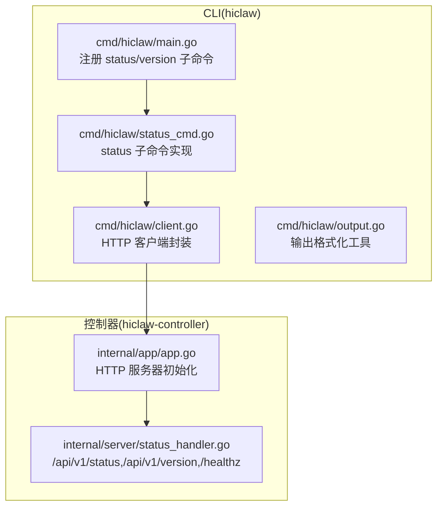
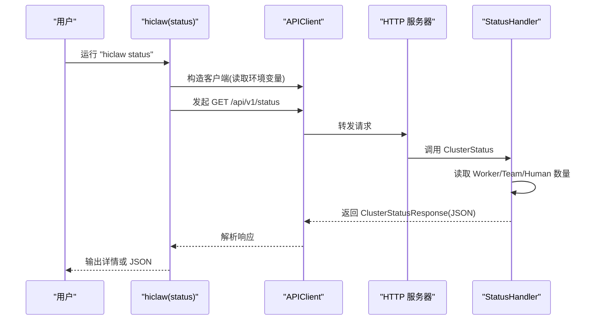
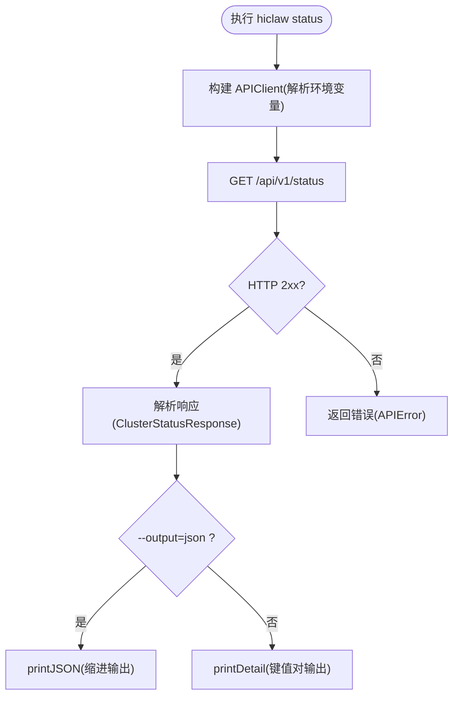
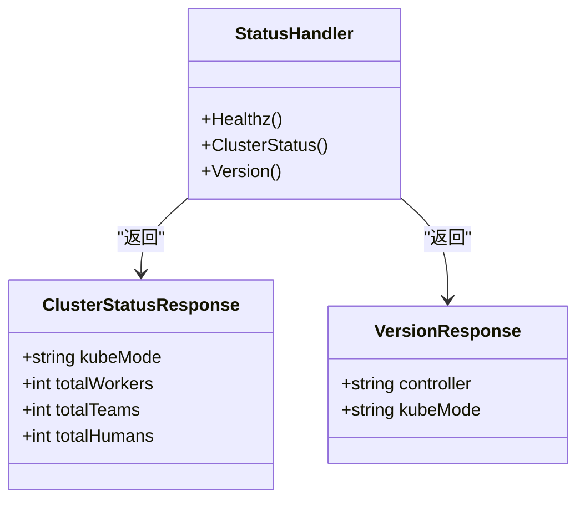
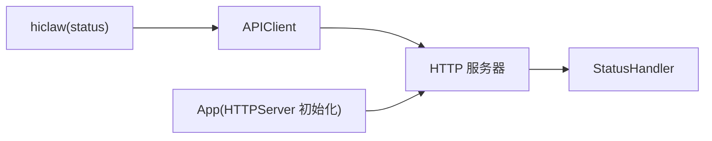

# 状态查询命令

<cite>
**本文引用的文件**
- [hiclaw-controller/cmd/hiclaw/status_cmd.go](file://hiclaw-controller/cmd/hiclaw/status_cmd.go)
- [hiclaw-controller/cmd/hiclaw/main.go](file://hiclaw-controller/cmd/hiclaw/main.go)
- [hiclaw-controller/cmd/hiclaw/client.go](file://hiclaw-controller/cmd/hiclaw/client.go)
- [hiclaw-controller/cmd/hiclaw/output.go](file://hiclaw-controller/cmd/hiclaw/output.go)
- [hiclaw-controller/internal/server/status_handler.go](file://hiclaw-controller/internal/server/status_handler.go)
- [hiclaw-controller/internal/app/app.go](file://hiclaw-controller/internal/app/app.go)
</cite>

## 目录
1. [简介](#简介)
2. [项目结构](#项目结构)
3. [核心组件](#核心组件)
4. [架构总览](#架构总览)
5. [详细组件分析](#详细组件分析)
6. [依赖分析](#依赖分析)
7. [性能考虑](#性能考虑)
8. [故障排查指南](#故障排查指南)
9. [结论](#结论)
10. [附录](#附录)

## 简介
本指南面向 hiclaw 的状态查询命令（status），帮助用户快速掌握以下内容：
- 如何使用 status 命令查询系统状态、资源状态与健康检查信息
- 输出格式与状态标识含义
- 实际使用场景：查询特定资源状态、批量状态检查、监控集成
- 状态信息解读与故障诊断技巧
- 状态缓存、过滤与格式化输出的使用建议
- 与监控系统的集成方案与自动化检查脚本思路

注意：当前 CLI 中 status 命令仅支持“集群概览”和“健康检查”两类信息；不包含按资源类型或名称进行过滤的子命令。

## 项目结构
hiclaw 的 CLI 位于 hiclaw-controller/cmd/hiclaw，状态查询通过 Cobra 子命令实现，调用控制器提供的 REST API 获取状态数据。控制器内部在 HTTP 层提供 /api/v1/status、/api/v1/version 与 /healthz 接口。

图表来源
- [hiclaw-controller/cmd/hiclaw/main.go:9-34](file://hiclaw-controller/cmd/hiclaw/main.go#L9-L34)
- [hiclaw-controller/cmd/hiclaw/status_cmd.go:9-37](file://hiclaw-controller/cmd/hiclaw/status_cmd.go#L9-L37)
- [hiclaw-controller/cmd/hiclaw/client.go:32-47](file://hiclaw-controller/cmd/hiclaw/client.go#L32-L47)
- [hiclaw-controller/internal/app/app.go:499-513](file://hiclaw-controller/internal/app/app.go#L499-L513)
- [hiclaw-controller/internal/server/status_handler.go:12-74](file://hiclaw-controller/internal/server/status_handler.go#L12-L74)

章节来源
- [hiclaw-controller/cmd/hiclaw/main.go:9-34](file://hiclaw-controller/cmd/hiclaw/main.go#L9-L34)
- [hiclaw-controller/cmd/hiclaw/status_cmd.go:9-37](file://hiclaw-controller/cmd/hiclaw/status_cmd.go#L9-L37)
- [hiclaw-controller/cmd/hiclaw/client.go:32-47](file://hiclaw-controller/cmd/hiclaw/client.go#L32-L47)
- [hiclaw-controller/internal/app/app.go:499-513](file://hiclaw-controller/internal/app/app.go#L499-L513)
- [hiclaw-controller/internal/server/status_handler.go:12-74](file://hiclaw-controller/internal/server/status_handler.go#L12-L74)

## 核心组件
- CLI 子命令：status 与 version
- HTTP 客户端：自动发现认证令牌、统一错误处理
- 输出格式化：文本详情、表格、JSON
- 控制器接口：/api/v1/status、/api/v1/version、/healthz

章节来源
- [hiclaw-controller/cmd/hiclaw/status_cmd.go:9-37](file://hiclaw-controller/cmd/hiclaw/status_cmd.go#L9-L37)
- [hiclaw-controller/cmd/hiclaw/client.go:32-47](file://hiclaw-controller/cmd/hiclaw/client.go#L32-L47)
- [hiclaw-controller/cmd/hiclaw/output.go:11-50](file://hiclaw-controller/cmd/hiclaw/output.go#L11-L50)
- [hiclaw-controller/internal/server/status_handler.go:23-74](file://hiclaw-controller/internal/server/status_handler.go#L23-L74)

## 架构总览
下图展示了从 CLI 到控制器的请求链路与返回的数据模型。

图表来源
- [hiclaw-controller/cmd/hiclaw/status_cmd.go:15-31](file://hiclaw-controller/cmd/hiclaw/status_cmd.go#L15-L31)
- [hiclaw-controller/cmd/hiclaw/client.go:96-128](file://hiclaw-controller/cmd/hiclaw/client.go#L96-L128)
- [hiclaw-controller/internal/server/status_handler.go:35-62](file://hiclaw-controller/internal/server/status_handler.go#L35-L62)

## 详细组件分析

### CLI 子命令：status
- 功能：查询集群状态（模式、Worker/Team/Human 总数）与健康检查
- 输出：
  - 默认：文本详情（键值对）
  - --output=json：输出完整 JSON
- 认证：自动从环境变量读取令牌（优先 HICLAW_AUTH_TOKEN，其次 HICLAW_AUTH_TOKEN_FILE）

图表来源
- [hiclaw-controller/cmd/hiclaw/status_cmd.go:15-31](file://hiclaw-controller/cmd/hiclaw/status_cmd.go#L15-L31)
- [hiclaw-controller/cmd/hiclaw/client.go:96-128](file://hiclaw-controller/cmd/hiclaw/client.go#L96-L128)
- [hiclaw-controller/cmd/hiclaw/output.go:27-50](file://hiclaw-controller/cmd/hiclaw/output.go#L27-L50)

章节来源
- [hiclaw-controller/cmd/hiclaw/status_cmd.go:9-37](file://hiclaw-controller/cmd/hiclaw/status_cmd.go#L9-L37)
- [hiclaw-controller/cmd/hiclaw/output.go:27-50](file://hiclaw-controller/cmd/hiclaw/output.go#L27-L50)

### CLI 子命令：version
- 功能：查询控制器版本与运行模式
- 输出：默认文本详情；--output=json 输出 JSON

章节来源
- [hiclaw-controller/cmd/hiclaw/status_cmd.go:39-65](file://hiclaw-controller/cmd/hiclaw/status_cmd.go#L39-L65)

### HTTP 客户端与错误处理
- 自动发现令牌：优先环境变量，其次令牌文件路径
- 统一错误处理：非 2xx 响应封装为 APIError，尝试提取 JSON 中的 error 字段
- 超时控制：默认 30 秒

章节来源
- [hiclaw-controller/cmd/hiclaw/client.go:32-47](file://hiclaw-controller/cmd/hiclaw/client.go#L32-L47)
- [hiclaw-controller/cmd/hiclaw/client.go:49-65](file://hiclaw-controller/cmd/hiclaw/client.go#L49-L65)
- [hiclaw-controller/cmd/hiclaw/client.go:96-128](file://hiclaw-controller/cmd/hiclaw/client.go#L96-L128)

### 控制器状态接口
- /healthz：健康检查，返回 200 OK
- /api/v1/status：集群状态，包含 kubeMode、totalWorkers、totalTeams、totalHumans
- /api/v1/version：版本信息，包含 controller、kubeMode

图表来源
- [hiclaw-controller/internal/server/status_handler.go:12-74](file://hiclaw-controller/internal/server/status_handler.go#L12-L74)

章节来源
- [hiclaw-controller/internal/server/status_handler.go:23-74](file://hiclaw-controller/internal/server/status_handler.go#L23-L74)

### 输出格式化工具
- printDetail：键值对详情输出
- printJSON：缩进 JSON 输出
- printTable：表格输出（用于列表类命令）

章节来源
- [hiclaw-controller/cmd/hiclaw/output.go:11-50](file://hiclaw-controller/cmd/hiclaw/output.go#L11-L50)

## 依赖分析
- CLI 与控制器通过 REST API 通信，CLI 侧负责参数解析、认证与输出格式化
- 控制器侧通过 StatusHandler 提供状态与版本信息
- 应用启动时初始化 HTTP 服务器，注册状态相关路由

图表来源
- [hiclaw-controller/cmd/hiclaw/status_cmd.go:15-31](file://hiclaw-controller/cmd/hiclaw/status_cmd.go#L15-L31)
- [hiclaw-controller/cmd/hiclaw/client.go:96-128](file://hiclaw-controller/cmd/hiclaw/client.go#L96-L128)
- [hiclaw-controller/internal/app/app.go:499-513](file://hiclaw-controller/internal/app/app.go#L499-L513)
- [hiclaw-controller/internal/server/status_handler.go:12-74](file://hiclaw-controller/internal/server/status_handler.go#L12-L74)

章节来源
- [hiclaw-controller/cmd/hiclaw/main.go:9-34](file://hiclaw-controller/cmd/hiclaw/main.go#L9-L34)
- [hiclaw-controller/internal/app/app.go:499-513](file://hiclaw-controller/internal/app/app.go#L499-L513)

## 性能考虑
- 当前 status 命令仅进行一次 API 调用，开销极低
- 控制器端对 Worker/Team/Human 的计数为内存级操作（基于缓存的列表）
- 若需批量状态检查，建议在外部脚本中并发调用，但注意避免对控制器造成压力

## 故障排查指南
- 认证失败（401/403）
  - 检查 HICLAW_AUTH_TOKEN 或 HICLAW_AUTH_TOKEN_FILE 是否正确设置
  - 确认控制器已启用鉴权且令牌有效
- 连接超时或网络异常
  - 检查 HICLAW_CONTROLLER_URL 是否可达
  - 调整客户端超时（当前固定 30 秒）
- 健康检查失败
  - 使用 /healthz 验证控制器存活
- 输出不符合预期
  - 使用 --output=json 获取完整响应体进行核对

章节来源
- [hiclaw-controller/cmd/hiclaw/client.go:32-47](file://hiclaw-controller/cmd/hiclaw/client.go#L32-L47)
- [hiclaw-controller/cmd/hiclaw/client.go:96-128](file://hiclaw-controller/cmd/hiclaw/client.go#L96-L128)
- [hiclaw-controller/internal/server/status_handler.go:23-26](file://hiclaw-controller/internal/server/status_handler.go#L23-L26)

## 结论
hiclaw 的 status 命令提供了简洁高效的集群状态与健康检查能力，适合日常运维与自动化监控集成。当前版本未提供资源级别的过滤与缓存机制，建议在外部脚本中结合 --output=json 与并发策略实现更灵活的批量检查与告警。

## 附录

### 命令与输出说明
- hiclaw status
  - 默认输出：键值对形式（模式、Worker/Team/Human 总数）
  - --output=json：输出完整 JSON
- hiclaw version
  - 默认输出：控制器版本与模式
  - --output=json：输出完整 JSON

章节来源
- [hiclaw-controller/cmd/hiclaw/status_cmd.go:9-37](file://hiclaw-controller/cmd/hiclaw/status_cmd.go#L9-L37)
- [hiclaw-controller/cmd/hiclaw/status_cmd.go:39-65](file://hiclaw-controller/cmd/hiclaw/status_cmd.go#L39-L65)
- [hiclaw-controller/cmd/hiclaw/output.go:27-50](file://hiclaw-controller/cmd/hiclaw/output.go#L27-L50)

### 监控集成与自动化脚本思路
- 健康检查
  - 对 /healthz 进行周期性探测，阈值可设为 200
- 状态检查
  - 对 /api/v1/status 获取 kubeMode、totalWorkers、totalTeams、totalHumans
  - 对 /api/v1/version 获取 controller、kubeMode
- 告警规则示例（基于 JSON 字段）
  - kubeMode 不等于期望值
  - totalWorkers/totalTeams/totalHumans 在一段时间内持续下降
  - 版本号长时间未更新（对比 version 中的 controller 字段）
- 并发与限速
  - 外部脚本并发调用时建议加锁与限速，避免对控制器造成压力

章节来源
- [hiclaw-controller/internal/server/status_handler.go:23-74](file://hiclaw-controller/internal/server/status_handler.go#L23-L74)
- [hiclaw-controller/cmd/hiclaw/client.go:96-128](file://hiclaw-controller/cmd/hiclaw/client.go#L96-L128)