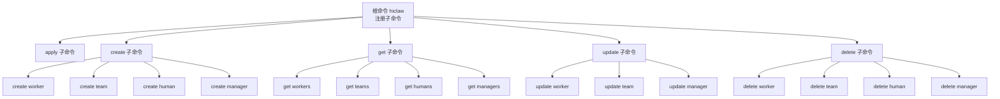
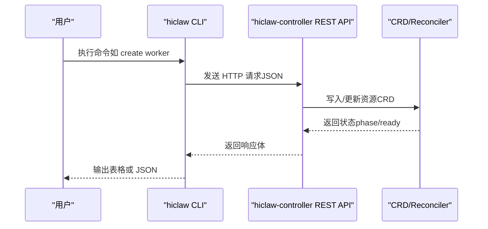
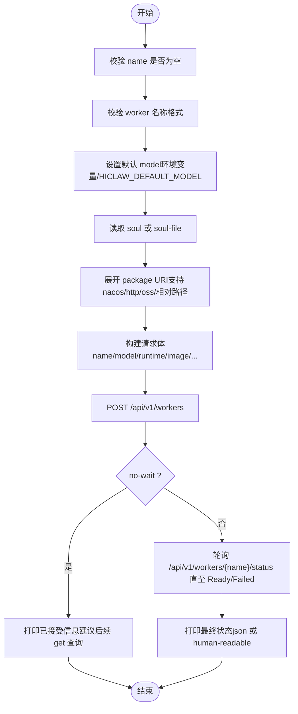
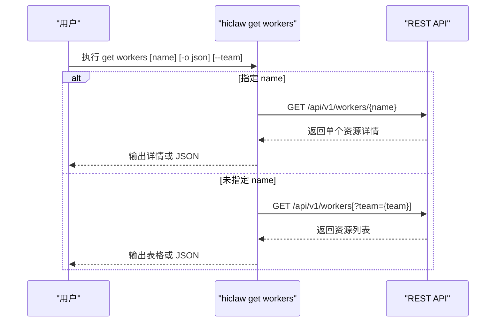
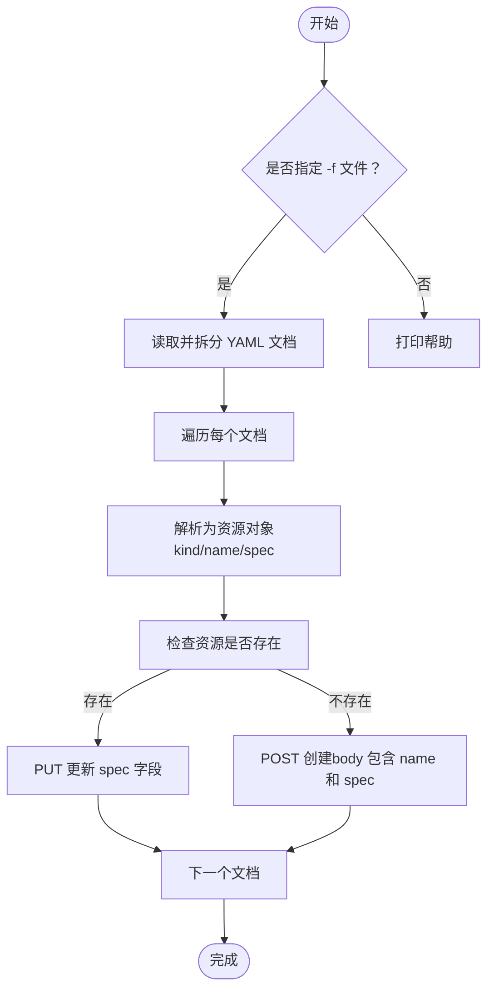
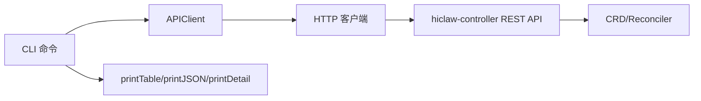

# 资源管理命令

<cite>
**本文引用的文件**
- [根命令入口 main.go](file://hiclaw-controller/cmd/hiclaw/main.go)
- [创建 create.go](file://hiclaw-controller/cmd/hiclaw/create.go)
- [获取 get.go](file://hiclaw-controller/cmd/hiclaw/get.go)
- [更新 update.go](file://hiclaw-controller/cmd/hiclaw/update.go)
- [删除 delete.go](file://hiclaw-controller/cmd/hiclaw/delete.go)
- [应用 apply.go](file://hiclaw-controller/cmd/hiclaw/apply.go)
- [输出与表格 output.go](file://hiclaw-controller/cmd/hiclaw/output.go)
- [HTTP 客户端与错误处理 client.go](file://hiclaw-controller/cmd/hiclaw/client.go)
- [Worker CRD 规范 workers.hiclaw.io.yaml](file://hiclaw-controller/config/crd/workers.hiclaw.io.yaml)
- [Team CRD 规范 teams.hiclaw.io.yaml](file://hiclaw-controller/config/crd/teams.hiclaw.io.yaml)
- [Manager CRD 规范 managers.hiclaw.io.yaml](file://hiclaw-controller/config/crd/managers.hiclaw.io.yaml)
- [Human CRD 规范 humans.hiclaw.io.yaml](file://hiclaw-controller/config/crd/humans.hiclaw.io.yaml)
- [声明式资源管理文档 declarative-resource-management.md](file://docs/declarative-resource-management.md)
- [快速入门文档 quickstart.md](file://docs/quickstart.md)
</cite>

## 目录
1. [简介](#简介)
2. [项目结构](#项目结构)
3. [核心组件](#核心组件)
4. [架构总览](#架构总览)
5. [详细组件分析](#详细组件分析)
6. [依赖分析](#依赖分析)
7. [性能考虑](#性能考虑)
8. [故障排查指南](#故障排查指南)
9. [结论](#结论)
10. [附录](#附录)

## 简介
hiclaw CLI 是 HiClaw 平台的资源管理命令行工具，通过 hiclaw-controller 的 REST API 对 Worker、Team、Human、Manager 四类资源进行创建、查询、更新、删除与声明式应用。本文档面向运维与平台管理员，系统梳理 create、get、update、delete、apply 五大命令的完整语法、参数选项、使用场景、输出格式、错误处理与返回码，并提供批量部署、配置文件管理与自动化脚本的最佳实践。

## 项目结构
hiclaw CLI 的命令组织基于 cobra，根命令注册了 apply、create、get、update、delete 及其他辅助子命令。各资源的 CRUD 行为由对应的子命令实现，最终通过统一的 HTTP 客户端调用控制器 REST API。

图表来源
- [根命令入口 main.go:9-29](file://hiclaw-controller/cmd/hiclaw/main.go#L9-L29)

章节来源
- [根命令入口 main.go:1-35](file://hiclaw-controller/cmd/hiclaw/main.go#L1-L35)

## 核心组件
- 根命令与子命令注册：在根命令中注册 apply、create、get、update、delete 等子命令，形成清晰的命令树。
- HTTP 客户端：封装 REST API 请求、认证、响应解析与错误包装，统一处理 2xx/4xx/5xx 场景。
- 输出格式化：支持表格与 JSON 两种输出；表格用于人类可读，JSON 便于脚本解析。
- 资源模型：Worker、Team、Human、Manager 的字段定义来自 CRD 规范，CLI 参数映射到 spec 字段。

章节来源
- [根命令入口 main.go:9-29](file://hiclaw-controller/cmd/hiclaw/main.go#L9-L29)
- [HTTP 客户端与错误处理 client.go:15-210](file://hiclaw-controller/cmd/hiclaw/client.go#L15-L210)
- [输出与表格 output.go:11-59](file://hiclaw-controller/cmd/hiclaw/output.go#L11-L59)
- [Worker CRD 规范 workers.hiclaw.io.yaml:12-204](file://hiclaw-controller/config/crd/workers.hiclaw.io.yaml#L12-L204)
- [Team CRD 规范 teams.hiclaw.io.yaml:12-351](file://hiclaw-controller/config/crd/teams.hiclaw.io.yaml#L12-L351)
- [Manager CRD 规范 managers.hiclaw.io.yaml:12-171](file://hiclaw-controller/config/crd/managers.hiclaw.io.yaml#L12-L171)
- [Human CRD 规范 humans.hiclaw.io.yaml:12-84](file://hiclaw-controller/config/crd/humans.hiclaw.io.yaml#L12-L84)

## 架构总览
hiclaw CLI 通过 HTTP 客户端访问 hiclaw-controller 的 REST API，控制器根据 CRD 规范对资源进行创建、更新、删除与状态同步。CLI 提供两种工作模式：
- 声明式（apply）：从 YAML 文件或参数生成资源，自动区分创建或更新。
- 命令式（create/get/update/delete）：直接对单个资源执行 CRUD 操作。

图表来源
- [HTTP 客户端与错误处理 client.go:96-128](file://hiclaw-controller/cmd/hiclaw/client.go#L96-L128)
- [声明式资源管理文档 declarative-resource-management.md:600-686](file://docs/declarative-resource-management.md#L600-L686)

## 详细组件分析

### create 命令
- 支持资源类型：worker、team、human、manager
- 适用场景：
  - 快速创建 Worker 并等待 Ready（默认等待）或立即返回（no-wait）
  - 创建团队并指定 Leader、Worker 列表、心跳与空闲超时
  - 创建 Human 用户并设置权限级别与可访问范围
  - 创建 Manager 并选择运行时与镜像
- 关键参数与行为：
  - worker：name（必填）、model、runtime、image、identity、soul、soul-file、skills、package、expose、team、role、output、wait-timeout、no-wait
  - team：name（必填）、leader-name（必填）、leader-model、leader-heartbeat-every、worker-idle-timeout、workers、description
  - human：name（必填）、display-name（必填）、email、permission-level、accessible-teams、accessible-workers、note
  - manager：name（必填）、model（必填）、runtime、image、soul
- 输出格式：默认表格，支持 -o json；worker 在 no-wait 模式下会提示后续查询状态
- 错误处理：参数校验失败、API 返回非 2xx、等待 Ready 超时等均以错误形式返回

章节来源
- [创建 create.go:14-499](file://hiclaw-controller/cmd/hiclaw/create.go#L14-L499)

#### create worker 流程图

图表来源
- [创建 create.go:59-128](file://hiclaw-controller/cmd/hiclaw/create.go#L59-L128)
- [创建 create.go:149-177](file://hiclaw-controller/cmd/hiclaw/create.go#L149-L177)

### get 命令
- 支持资源类型：workers、teams、humans、managers
- 适用场景：列出所有资源或按名称查询单个资源；支持过滤与输出格式
- 关键参数：
  - workers：--team 过滤、-o json
  - teams：-o json
  - humans：-o json
  - managers：-o json
- 输出格式：表格（默认）或 JSON；表格列随资源类型变化
- 行为细节：当查询单个资源时，CLI 直接 GET 该资源；列表时支持查询参数过滤

章节来源
- [获取 get.go:11-283](file://hiclaw-controller/cmd/hiclaw/get.go#L11-L283)

#### get workers 序列图

图表来源
- [获取 get.go:41-86](file://hiclaw-controller/cmd/hiclaw/get.go#L41-L86)

### update 命令
- 支持资源类型：worker、team、manager
- 适用场景：仅更新指定字段，避免全量覆盖；适合增量调整
- 关键参数：
  - worker：--name（必填）、model、runtime、image、identity、soul、skills、package、expose
  - team：--name（必填）、description、leader-model、leader-heartbeat-every、worker-idle-timeout
  - manager：--name（必填）、model、runtime、image、soul
- 行为细节：至少需要一个字段；PUT 请求仅发送变更字段

章节来源
- [更新 update.go:9-215](file://hiclaw-controller/cmd/hiclaw/update.go#L9-L215)

### delete 命令
- 支持资源类型：worker、team、human、manager
- 适用场景：删除不再使用的资源；删除前请确认依赖关系（例如先删 Human 再删 Team）
- 行为细节：DELETE 请求成功后打印已删除信息；错误时返回 APIError

章节来源
- [删除 delete.go:9-73](file://hiclaw-controller/cmd/hiclaw/delete.go#L9-L73)

### apply 命令
- 支持模式：从 YAML 文件批量创建/更新资源；也支持从 ZIP 包或参数直接创建/更新 Worker
- 适用场景：
  - 声明式管理：将 desired state 写入 YAML，一次性应用
  - Worker 导入：通过 ZIP 包或参数快速导入 Worker 配置
- 关键参数：
  - -f：YAML 文件（可多次传入）
  - worker 子命令：--name（必填）、--zip、--model、--runtime、--image、--identity、--soul、--soul-file、--skills、--package、--expose、--team、--role
- 行为细节：
  - 解析多文档 YAML，逐个资源判断存在性并执行 POST 或 PUT
  - ZIP 模式：上传包 → 读取 manifest.json → 自动填充 model/runtime → 创建/更新 Worker
  - 顺序重要：先定义 Team，再定义 Human（若 Human 访问 Team）

章节来源
- [应用 apply.go:16-388](file://hiclaw-controller/cmd/hiclaw/apply.go#L16-L388)
- [声明式资源管理文档 declarative-resource-management.md:600-782](file://docs/declarative-resource-management.md#L600-L782)

#### apply 流程图

图表来源
- [应用 apply.go:56-126](file://hiclaw-controller/cmd/hiclaw/apply.go#L56-L126)

## 依赖分析
- 命令与资源类型映射：
  - create：worker/team/human/manager
  - get：workers/teams/humans/managers
  - update：worker/team/manager
  - delete：worker/team/human/manager
  - apply：worker（文件/参数/ZIP）
- HTTP 客户端依赖：
  - 环境变量发现令牌（HICLAW_AUTH_TOKEN 或 HICLAW_AUTH_TOKEN_FILE）
  - 统一超时控制与错误包装（APIError）
  - 多种请求方法：DoJSON、DoMultipart（ZIP 上传）
- 输出层：
  - printTable：表格输出（类似 kubectl get）
  - printJSON：JSON 输出
  - printDetail：键值对详情输出

图表来源
- [HTTP 客户端与错误处理 client.go:32-94](file://hiclaw-controller/cmd/hiclaw/client.go#L32-L94)
- [输出与表格 output.go:11-59](file://hiclaw-controller/cmd/hiclaw/output.go#L11-L59)

章节来源
- [HTTP 客户端与错误处理 client.go:32-210](file://hiclaw-controller/cmd/hiclaw/client.go#L32-L210)
- [输出与表格 output.go:11-59](file://hiclaw-controller/cmd/hiclaw/output.go#L11-L59)

## 性能考虑
- get 列表模式：建议使用 -o json 以便脚本高效解析；表格模式适合人工审阅
- create worker：默认等待 Ready，适合交互式体验；CI/CD 中可使用 --no-wait 并结合定时轮询
- apply 批量：按依赖顺序排列 YAML 文档，减少控制器回滚与重试
- 超时与重试：客户端统一超时；worker 就绪轮询间隔固定，超时时间可调

## 故障排查指南
- 常见错误类型：
  - 参数缺失：如 --name 为空、必需字段缺失
  - API 非 2xx：返回 APIError，包含状态码与消息
  - 等待超时：worker 就绪超时，打印最后一次状态摘要
- 排查步骤：
  - 使用 -o json 获取完整响应，定位具体字段问题
  - 查看控制器日志与资源 status.message
  - 使用 get 查询资源当前 phase 与关键状态字段
- 退出码：
  - 成功：0
  - 失败：非 0（错误信息包含 APIError 或参数校验失败原因）

章节来源
- [HTTP 客户端与错误处理 client.go:22-128](file://hiclaw-controller/cmd/hiclaw/client.go#L22-L128)
- [创建 create.go:149-177](file://hiclaw-controller/cmd/hiclaw/create.go#L149-L177)

## 结论
hiclaw CLI 提供了统一、可编程的资源管理能力，结合声明式 YAML 与命令式参数，既能满足日常运维的快速操作，也能支撑大规模自动化编排。通过理解各命令的参数语义、输出格式与错误处理机制，可以更稳健地进行资源生命周期管理与批量部署。

## 附录

### 命令参考与示例

- create worker
  - 语法要点：--name 必填；--model 默认来自环境变量或内置默认值；--no-wait 可立即返回
  - 示例场景：创建带技能与暴露端口的 Worker；从 ZIP 包导入 Worker
- create team
  - 语法要点：--leader-name 必填；可设置心跳与空闲超时；workers 为可选列表
  - 示例场景：创建包含 Leader 与多个 Worker 的团队
- create human
  - 语法要点：--display-name 与 --permission-level 必填；可限制可访问 Team/Worker
  - 示例场景：为产品负责人授予 L2 权限并允许访问特定团队
- create manager
  - 语法要点：--model 必填；可指定 runtime/image/soul
  - 示例场景：创建默认 Manager 实例并启用必要技能
- get
  - workers：支持 --team 过滤与 -o json
  - teams/humans/managers：支持 -o json
- update
  - worker/team/manager：至少指定一个字段进行更新
- delete
  - worker/team/human/manager：按名称删除
- apply
  - -f：批量应用 YAML；按文档顺序依次创建/更新
  - worker 子命令：支持 --zip 与参数组合导入

章节来源
- [创建 create.go:14-499](file://hiclaw-controller/cmd/hiclaw/create.go#L14-L499)
- [获取 get.go:11-283](file://hiclaw-controller/cmd/hiclaw/get.go#L11-L283)
- [更新 update.go:9-215](file://hiclaw-controller/cmd/hiclaw/update.go#L9-L215)
- [删除 delete.go:9-73](file://hiclaw-controller/cmd/hiclaw/delete.go#L9-L73)
- [应用 apply.go:16-388](file://hiclaw-controller/cmd/hiclaw/apply.go#L16-L388)
- [声明式资源管理文档 declarative-resource-management.md:600-782](file://docs/declarative-resource-management.md#L600-L782)

### 输出格式与字段说明
- 表格输出：列名随资源类型变化；适合快速概览
- JSON 输出：便于脚本解析与二次处理
- 详情输出：键值对形式，包含关键状态字段（如 phase、message、matrixUserID、roomID 等）

章节来源
- [输出与表格 output.go:11-59](file://hiclaw-controller/cmd/hiclaw/output.go#L11-L59)
- [获取 get.go:289-447](file://hiclaw-controller/cmd/hiclaw/get.go#L289-L447)

### 资源类型与字段映射（简表）
- Worker：model、runtime、image、identity、soul、agents、skills、mcpServers、package、expose、state、labels、accessEntries
- Team：description、peerMentions、channelPolicy、admin、leader（含 heartbeat、workerIdleTimeout、state）、workers[]
- Human：displayName、email、permissionLevel、accessibleTeams、accessibleWorkers、note
- Manager：model、runtime、image、soul、agents、skills、mcpServers、package、state、config（heartbeatInterval、workerIdleTimeout、notifyChannel）

章节来源
- [Worker CRD 规范 workers.hiclaw.io.yaml:12-204](file://hiclaw-controller/config/crd/workers.hiclaw.io.yaml#L12-L204)
- [Team CRD 规范 teams.hiclaw.io.yaml:12-351](file://hiclaw-controller/config/crd/teams.hiclaw.io.yaml#L12-L351)
- [Human CRD 规范 humans.hiclaw.io.yaml:12-84](file://hiclaw-controller/config/crd/humans.hiclaw.io.yaml#L12-L84)
- [Manager CRD 规范 managers.hiclaw.io.yaml:12-171](file://hiclaw-controller/config/crd/managers.hiclaw.io.yaml#L12-L171)

### 最佳实践与自动化建议
- 声明式管理（推荐）：使用 -f 批量应用；先定义 Team，再定义 Human；编辑后重新 apply
- CI/CD 集成：使用 -o json 输出，配合 jq 进行断言与状态检查
- Worker 导入：优先使用 ZIP 包，确保 manifest.json 正确；必要时通过 --runtime 覆盖
- 权限与安全：Human 的 permissionLevel 与可访问范围需与业务域匹配；定期审计 groupAllowFrom 与房间权限
- 环境变量：合理配置 HICLAW_CONTROLLER_URL、HICLAW_AUTH_TOKEN/TOKEN_FILE，确保认证稳定

章节来源
- [声明式资源管理文档 declarative-resource-management.md:600-782](file://docs/declarative-resource-management.md#L600-L782)
- [快速入门文档 quickstart.md:53-60](file://docs/quickstart.md#L53-L60)