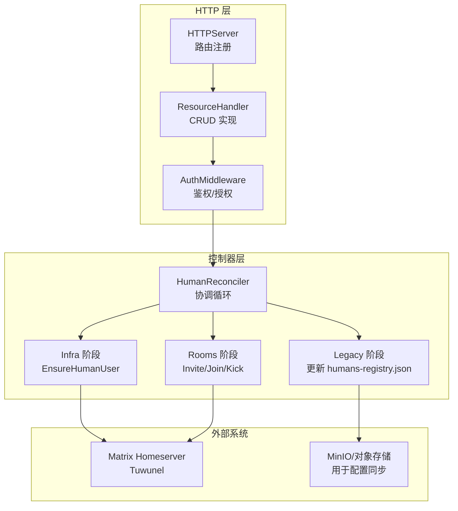
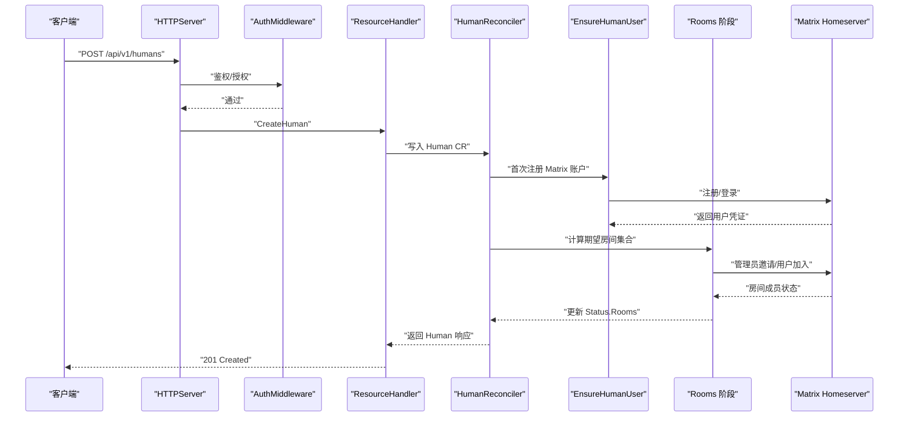
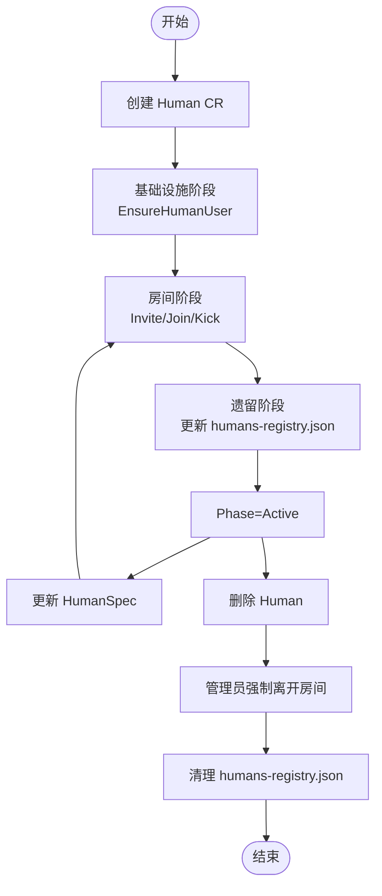
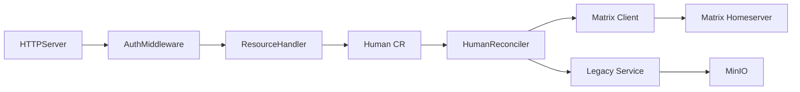

# Human 管理 API

<cite>
**本文引用的文件**
- [http.go](file://hiclaw-controller/internal/server/http.go)
- [resource_handler.go](file://hiclaw-controller/internal/server/resource_handler.go)
- [types.go](file://hiclaw-controller/api/v1beta1/types.go)
- [middleware.go](file://hiclaw-controller/internal/auth/middleware.go)
- [client.go](file://hiclaw-controller/internal/matrix/client.go)
- [human_controller.go](file://hiclaw-controller/internal/controller/human_controller.go)
- [human_reconcile_infra.go](file://hiclaw-controller/internal/controller/human_reconcile_infra.go)
- [human_reconcile_rooms.go](file://hiclaw-controller/internal/controller/human_reconcile_rooms.go)
- [human_reconcile_delete.go](file://hiclaw-controller/internal/controller/human_reconcile_delete.go)
- [human_scope.go](file://hiclaw-controller/internal/controller/human_scope.go)
- [legacy.go](file://hiclaw-controller/internal/service/legacy.go)
- [manage-humans-registry.sh](file://manager/agent/skills/human-management/scripts/manage-humans-registry.sh)
- [declarative-resource-management.md](file://docs/declarative-resource-management.md)
- [declarative-resource-management.md](file://docs/zh-cn/declarative-resource-management.md)
- [test-19-human-and-team-admin.sh](file://tests/test-19-human-and-team-admin.sh)
</cite>

## 目录
1. [简介](#简介)
2. [项目结构](#项目结构)
3. [核心组件](#核心组件)
4. [架构总览](#架构总览)
5. [详细组件分析](#详细组件分析)
6. [依赖分析](#依赖分析)
7. [性能考虑](#性能考虑)
8. [故障排查指南](#故障排查指南)
9. [结论](#结论)
10. [附录](#附录)

## 简介
本文件为 HiClaw 项目中 Human（真人用户）管理相关的统一 API 文档，覆盖 Human 资源的创建、查询、列表、删除等 HTTP 端点，以及 HumanSpec 字段语义、权限模型、生命周期管理流程、与 Matrix 房间的交互机制、安全认证与会话管理、审计日志与最佳实践等内容。文档同时给出关键流程的序列图与类图，帮助开发者与运维人员快速理解与落地。

## 项目结构
Human 管理 API 由控制器层与 HTTP 层协同完成：
- HTTP 层负责暴露 REST API 并进行鉴权/授权校验
- 控制器层负责与 Matrix Homeserver 交互，确保 Human 的 Matrix 账户与房间成员身份一致
- 数据模型基于 CRD（HumanSpec/HumanStatus），状态通过控制器收敛

图表来源
- [http.go:36-72](file://hiclaw-controller/internal/server/http.go#L36-L72)
- [resource_handler.go:549-634](file://hiclaw-controller/internal/server/resource_handler.go#L549-L634)
- [human_controller.go:29-96](file://hiclaw-controller/internal/controller/human_controller.go#L29-L96)
- [client.go:131-225](file://hiclaw-controller/internal/matrix/client.go#L131-L225)

章节来源
- [http.go:36-72](file://hiclaw-controller/internal/server/http.go#L36-L72)
- [resource_handler.go:549-634](file://hiclaw-controller/internal/server/resource_handler.go#L549-L634)

## 核心组件
- HTTP 路由与处理器
  - POST /api/v1/humans：创建 Human
  - GET /api/v1/humans：列出 Human
  - GET /api/v1/humans/{name}：获取 Human 详情
  - DELETE /api/v1/humans/{name}：删除 Human
  - 鉴权中间件对上述端点启用 RequireAuthz 校验
- 数据模型
  - HumanSpec：包含显示名、邮箱、权限级别、可访问团队/Worker 列表、备注
  - HumanStatus：包含生命周期阶段、Matrix 用户 ID、初始密码、房间列表、邮件发送标记、消息
- 控制器
  - HumanReconciler：执行三阶段收敛（基础设施/房间/遗留兼容）
  - Matrix 客户端：封装注册、登录、房间邀请/加入/踢出、消息发送等

章节来源
- [http.go:68-72](file://hiclaw-controller/internal/server/http.go#L68-L72)
- [resource_handler.go:551-634](file://hiclaw-controller/internal/server/resource_handler.go#L551-L634)
- [types.go:339-355](file://hiclaw-controller/api/v1beta1/types.go#L339-L355)
- [human_controller.go:22-27](file://hiclaw-controller/internal/controller/human_controller.go#L22-L27)

## 架构总览
下图展示从 HTTP 请求到控制器执行再到 Matrix 操作的整体流程：

图表来源
- [http.go:68-72](file://hiclaw-controller/internal/server/http.go#L68-L72)
- [resource_handler.go:551-584](file://hiclaw-controller/internal/server/resource_handler.go#L551-L584)
- [human_controller.go:83-96](file://hiclaw-controller/internal/controller/human_controller.go#L83-L96)
- [human_reconcile_infra.go:35-53](file://hiclaw-controller/internal/controller/human_reconcile_infra.go#L35-L53)
- [human_reconcile_rooms.go:27-41](file://hiclaw-controller/internal/controller/human_reconcile_rooms.go#L27-L41)
- [client.go:131-225](file://hiclaw-controller/internal/matrix/client.go#L131-L225)

## 详细组件分析

### HTTP 端点规范
- POST /api/v1/humans
  - 请求体：CreateHumanRequest（name、displayName、email、permissionLevel、accessibleTeams、accessibleWorkers、note）
  - 成功：201 Created，返回 HumanResponse
  - 鉴权：RequireAuthz(ActionCreate, "human", nil)
- GET /api/v1/humans
  - 成功：200 OK，返回 HumanListResponse
  - 鉴权：RequireAuthz(ActionList, "human", nil)
- GET /api/v1/humans/{name}
  - 成功：200 OK，返回 HumanResponse
  - 鉴权：RequireAuthz(ActionGet, "human", nameFn)
- DELETE /api/v1/humans/{name}
  - 成功：204 No Content
  - 鉴权：RequireAuthz(ActionDelete, "human", nameFn)

章节来源
- [http.go:68-72](file://hiclaw-controller/internal/server/http.go#L68-L72)
- [resource_handler.go:551-634](file://hiclaw-controller/internal/server/resource_handler.go#L551-L634)
- [middleware.go:79-118](file://hiclaw-controller/internal/auth/middleware.go#L79-L118)

### HumanSpec 字段说明
- displayName：显示名称
- email：可选，用于欢迎邮件
- permissionLevel：权限级别（1=管理员，2=团队级，3=Worker 级）
- accessibleTeams：可访问的团队列表（仅在级别 2 生效）
- accessibleWorkers：可访问的 Worker 列表
- note：备注

章节来源
- [types.go:339-346](file://hiclaw-controller/api/v1beta1/types.go#L339-L346)

### HumanStatus 字段说明
- phase：生命周期阶段（Pending/Active/Failed）
- matrixUserID：Matrix 用户 ID
- initialPassword：初始密码（创建时生成，仅展示一次）
- rooms：当前已加入的房间列表
- emailSent：是否已发送欢迎邮件
- message：错误信息（失败时）

章节来源
- [types.go:348-355](file://hiclaw-controller/api/v1beta1/types.go#L348-L355)

### 权限模型与房间策略
- 权限级别与组白名单（groupAllowFrom）变更：
  - L1：添加到 Manager + 所有 Leader + 所有 Worker
  - L2：添加到指定 Team 的 Leader + Worker + 指定独立 Worker
  - L3：添加到指定 Worker
- 房间邀请策略：
  - L1：所有房间
  - L2：指定 Team 房间 + Worker 房间
  - L3：指定 Worker 房间
- 创建流程要点：
  - 注册 Matrix 账户（随机密码）
  - 基于 permissionLevel 计算受影响的 Agent 列表
  - 更新每个 Agent 的 openclaw.json 中的 groupAllowFrom
  - 邀请 Human 至对应房间
  - 更新 humans-registry.json
  - 推送更新后的配置到 MinIO，通知 Agent 执行 file-sync
  - 如配置 SMTP 且 spec.email 非空，则发送欢迎邮件

章节来源
- [declarative-resource-management.md:479-500](file://docs/declarative-resource-management.md#L479-L500)
- [declarative-resource-management.md:477-498](file://docs/zh-cn/declarative-resource-management.md#L477-L498)

### 生命周期管理流程
- 创建 Human
  - 写入 Human CR → 控制器触发基础设施阶段（注册 Matrix 账户）→ 房间阶段（邀请/加入）→ 遗留阶段（更新 humans-registry.json）
- 更新 Human
  - 修改 HumanSpec 后，控制器重新计算期望房间集合并收敛
- 删除 Human
  - 控制器通过管理员身份强制离开房间 → 清理 humans-registry.json → 移除 Finalizer

图表来源
- [human_controller.go:83-96](file://hiclaw-controller/internal/controller/human_controller.go#L83-L96)
- [human_reconcile_infra.go:35-53](file://hiclaw-controller/internal/controller/human_reconcile_infra.go#L35-L53)
- [human_reconcile_rooms.go:27-41](file://hiclaw-controller/internal/controller/human_reconcile_rooms.go#L27-L41)
- [human_reconcile_delete.go:22-51](file://hiclaw-controller/internal/controller/human_reconcile_delete.go#L22-L51)
- [legacy.go:429-459](file://hiclaw-controller/internal/service/legacy.go#L429-L459)

章节来源
- [human_controller.go:29-96](file://hiclaw-controller/internal/controller/human_controller.go#L29-L96)
- [human_reconcile_infra.go:35-53](file://hiclaw-controller/internal/controller/human_reconcile_infra.go#L35-L53)
- [human_reconcile_rooms.go:27-41](file://hiclaw-controller/internal/controller/human_reconcile_rooms.go#L27-L41)
- [human_reconcile_delete.go:22-51](file://hiclaw-controller/internal/controller/human_reconcile_delete.go#L22-L51)
- [legacy.go:429-459](file://hiclaw-controller/internal/service/legacy.go#L429-L459)

### 与 Matrix 房间的交互机制
- 注册与登录
  - EnsureUser：优先尝试注册，失败时回退到登录；若用户存在但密码被外部更改，通过 AdminCommand 触发重置密码，再重试登录
- 房间邀请与加入
  - 邀请：使用管理员令牌向房间发送邀请（幂等）
  - 加入：在可获得用户令牌时，以用户身份加入房间；若无法登录（密码过期），则跳过 /join，等待后续重试
  - 踢出：管理员踢出房间，失败时不丢弃状态，等待下次重试
- 管理员命令
  - 通过 AdminCommand 发送 "!admin ..." 命令至管理员房间，实现账户修复等运维动作

章节来源
- [client.go:131-225](file://hiclaw-controller/internal/matrix/client.go#L131-L225)
- [client.go:555-585](file://hiclaw-controller/internal/matrix/client.go#L555-L585)
- [client.go:587-626](file://hiclaw-controller/internal/matrix/client.go#L587-L626)
- [client.go:492-508](file://hiclaw-controller/internal/matrix/client.go#L492-L508)

### 安全认证、会话管理与审计
- 鉴权中间件
  - 支持 Bearer Token 认证，支持身份增强与资源授权矩阵
  - 对 /api/v1/humans 系列端点启用 RequireAuthz
- 会话管理
  - 首次注册后缓存用户访问令牌，避免周期性登录造成设备膨胀
  - 非稳态时按需获取用户令牌，减少不必要的登录往返
- 审计与日志
  - 控制器在错误时写入 status.message
  - 测试脚本验证控制器日志中出现 "human created" 关键字
  - 欢迎邮件发送标记（emailSent）用于幂等控制

章节来源
- [middleware.go:51-118](file://hiclaw-controller/internal/auth/middleware.go#L51-L118)
- [human_reconcile_infra.go:20-29](file://hiclaw-controller/internal/controller/human_reconcile_infra.go#L20-L29)
- [test-19-human-and-team-admin.sh:98-115](file://tests/test-19-human-and-team-admin.sh#L98-L115)

### 权限配置示例与最佳实践
- 示例：管理员（L1）
  - permissionLevel: 1
  - accessibleTeams/accessibleWorkers 可省略
- 示例：团队成员（L2）
  - permissionLevel: 2
  - accessibleTeams: ["alpha-team","beta-team"]
  - accessibleWorkers: ["standalone-dev"]
- 示例：Worker 专用（L3）
  - permissionLevel: 3
  - accessibleWorkers: ["alice","bob"]
- 最佳实践
  - 严格最小权限原则：仅授予必要的 teams/workers
  - 使用 accessibleTeams 与 accessibleWorkers 的组合精确控制访问范围
  - 配置 SMTP 以便新用户接收欢迎邮件与登录凭据
  - 定期审查 humans-registry.json 与房间成员状态，确保一致性

章节来源
- [declarative-resource-management.md:458-477](file://docs/declarative-resource-management.md#L458-L477)
- [declarative-resource-management.md:500-528](file://docs/zh-cn/declarative-resource-management.md#L500-L528)

## 依赖分析
- 组件耦合
  - HTTPServer 通过 AuthMiddleware 将鉴权结果注入上下文，ResourceHandler 读取 CallerIdentity 并执行授权决策
  - HumanReconciler 依赖 Matrix 客户端进行用户与房间操作，依赖 Legacy 兼容层维护 humans-registry.json
- 外部依赖
  - Matrix Homeserver（Tuwunel）：提供用户注册/登录、房间邀请/加入/踢出、消息发送等能力
  - MinIO：用于存储与分发 Agent 配置（openclaw.json），配合 file-sync 技术生效

图表来源
- [http.go:36-72](file://hiclaw-controller/internal/server/http.go#L36-L72)
- [middleware.go:31-49](file://hiclaw-controller/internal/auth/middleware.go#L31-L49)
- [resource_handler.go:549-634](file://hiclaw-controller/internal/server/resource_handler.go#L549-L634)
- [human_controller.go:22-27](file://hiclaw-controller/internal/controller/human_controller.go#L22-L27)
- [client.go:16-87](file://hiclaw-controller/internal/matrix/client.go#L16-L87)
- [legacy.go:429-459](file://hiclaw-controller/internal/service/legacy.go#L429-L459)

章节来源
- [http.go:36-72](file://hiclaw-controller/internal/server/http.go#L36-L72)
- [middleware.go:31-49](file://hiclaw-controller/internal/auth/middleware.go#L31-L49)
- [client.go:16-87](file://hiclaw-controller/internal/matrix/client.go#L16-L87)

## 性能考虑
- 登录开销控制：仅在需要加入房间时才获取用户令牌，避免每周期登录导致设备数量膨胀
- 房间操作幂等：邀请/加入/踢出均具备幂等性，失败时保留状态等待重试，降低瞬时错误影响
- 乐观并发：K8s 更新采用多次重试与合并补丁，提升写入成功率

## 故障排查指南
- 无法加入房间
  - 检查用户令牌是否可获取（密码可能被外部更改）
  - 查看控制器日志中 "human created" 关键字确认创建流程
  - 确认 humans-registry.json 是否正确更新
- 删除 Human 后仍留在房间
  - 控制器通过管理员强制离开房间；若失败，状态会保留并在下次重试
- 权限未生效
  - 检查 Agent 的 openclaw.json 中 groupAllowFrom 是否已更新
  - 确认 MinIO 上的配置已推送并触发 file-sync

章节来源
- [test-19-human-and-team-admin.sh:98-127](file://tests/test-19-human-and-team-admin.sh#L98-L127)
- [human_reconcile_rooms.go:27-41](file://hiclaw-controller/internal/controller/human_reconcile_rooms.go#L27-L41)
- [human_reconcile_delete.go:22-51](file://hiclaw-controller/internal/controller/human_reconcile_delete.go#L22-L51)
- [legacy.go:429-459](file://hiclaw-controller/internal/service/legacy.go#L429-L459)

## 结论
Human 管理 API 通过声明式 CRD 与控制器模式，将 Matrix 用户与房间成员关系自动化收敛，结合权限白名单与房间邀请实现细粒度的人机协作控制。配合鉴权中间件、会话优化与审计日志，系统在可用性与安全性之间取得平衡。建议在生产环境中遵循最小权限原则与配置审计流程，确保权限与房间状态的一致性。

## 附录
- 术语
  - L1/L2/L3：权限级别（管理员/团队级/Worker 级）
  - groupAllowFrom：Agent 白名单配置项
  - humans-registry.json：嵌入式模式下的用户注册表
- 相关脚本
  - manage-humans-registry.sh：更新/移除 humans-registry.json 的工具脚本

章节来源
- [manage-humans-registry.sh:50-92](file://manager/agent/skills/human-management/scripts/manage-humans-registry.sh#L50-L92)