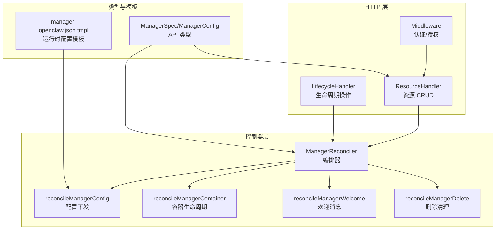
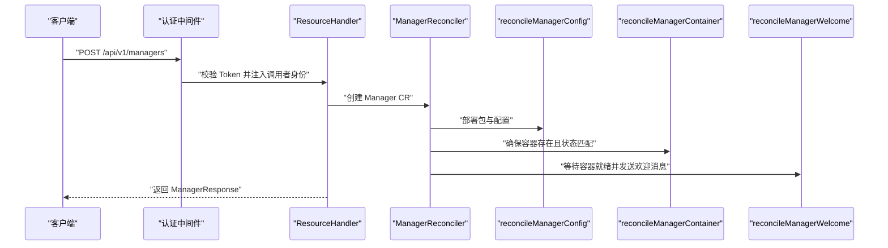
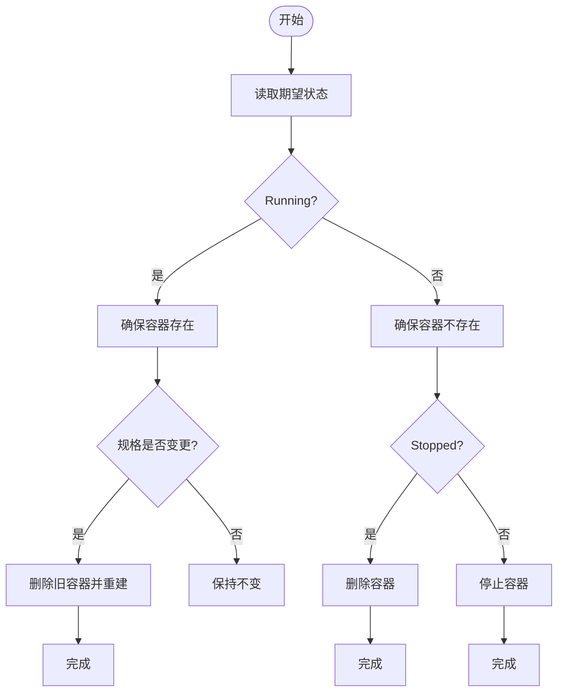
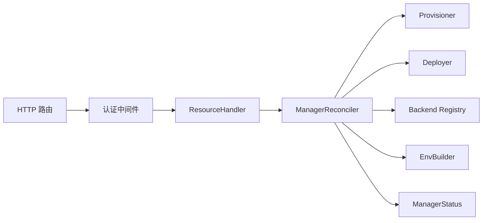

# Manager 管理 API

<cite>
**本文引用的文件**
- [types.go](file://hiclaw-controller/api/v1beta1/types.go)
- [http.go](file://hiclaw-controller/internal/server/http.go)
- [resource_handler.go](file://hiclaw-controller/internal/server/resource_handler.go)
- [types.go](file://hiclaw-controller/internal/server/types.go)
- [manager_controller.go](file://hiclaw-controller/internal/controller/manager_controller.go)
- [manager_reconcile_config.go](file://hiclaw-controller/internal/controller/manager_reconcile_config.go)
- [manager_reconcile_container.go](file://hiclaw-controller/internal/controller/manager_reconcile_container.go)
- [manager_reconcile_welcome.go](file://hiclaw-controller/internal/controller/manager_reconcile_welcome.go)
- [manager_reconcile_delete.go](file://hiclaw-controller/internal/controller/manager_reconcile_delete.go)
- [middleware.go](file://hiclaw-controller/internal/auth/middleware.go)
- [manager-guide.md](file://docs/manager-guide.md)
- [manager-openclaw.json.tmpl](file://manager/configs/manager-openclaw.json.tmpl)
</cite>

## 目录
1. [简介](#简介)
2. [项目结构](#项目结构)
3. [核心组件](#核心组件)
4. [架构总览](#架构总览)
5. [详细组件分析](#详细组件分析)
6. [依赖分析](#依赖分析)
7. [性能考虑](#性能考虑)
8. [故障排查指南](#故障排查指南)
9. [结论](#结论)
10. [附录](#附录)

## 简介
本文件为 HiClaw 中 Manager 管理 API 的权威文档，覆盖以下内容：
- 所有与 Manager 相关的 HTTP 端点规范：创建、查询、更新、删除
- ManagerSpec 结构体字段详解：协调器配置、连接信息、运行时设置、监控参数
- Manager 生命周期管理：启动、配置更新、健康检查、优雅关闭
- Manager 与 Worker 的绑定关系与任务分配、状态同步机制
- 安全配置、凭据管理与访问控制策略
- 实际配置示例与部署最佳实践

## 项目结构
Manager 管理 API 由控制器层与 HTTP 层协同实现：
- 控制器层负责资源编排、容器生命周期、欢迎消息投递与清理
- HTTP 层提供 REST 接口，封装认证授权与资源转换
- API 类型定义集中在 CRD 类型中，统一了数据模型与状态机

图表来源
- [http.go:61-83](file://hiclaw-controller/internal/server/http.go#L61-L83)
- [resource_handler.go:636-797](file://hiclaw-controller/internal/server/resource_handler.go#L636-L797)
- [manager_controller.go:72-160](file://hiclaw-controller/internal/controller/manager_controller.go#L72-L160)
- [manager_reconcile_config.go:12-45](file://hiclaw-controller/internal/controller/manager_reconcile_config.go#L12-L45)
- [manager_reconcile_container.go:16-99](file://hiclaw-controller/internal/controller/manager_reconcile_container.go#L16-L99)
- [manager_reconcile_welcome.go:25-97](file://hiclaw-controller/internal/controller/manager_reconcile_welcome.go#L25-L97)
- [manager_reconcile_delete.go:13-65](file://hiclaw-controller/internal/controller/manager_reconcile_delete.go#L13-L65)
- [types.go:379-420](file://hiclaw-controller/api/v1beta1/types.go#L379-L420)
- [manager-openclaw.json.tmpl:1-145](file://manager/configs/manager-openclaw.json.tmpl#L1-L145)

章节来源
- [http.go:61-83](file://hiclaw-controller/internal/server/http.go#L61-L83)
- [resource_handler.go:636-797](file://hiclaw-controller/internal/server/resource_handler.go#L636-L797)
- [types.go:379-420](file://hiclaw-controller/api/v1beta1/types.go#L379-L420)

## 核心组件
- Manager 资源类型与配置
  - ManagerSpec：描述 Manager 的模型、运行时、镜像、技能、MCP 服务器、包分发、配置与期望状态
  - ManagerConfig：心跳间隔、空闲超时、通知渠道等运行时参数
  - ManagerStatus：阶段、矩阵用户/房间、容器状态、版本、消息与欢迎发送标记
- HTTP 路由与处理器
  - /api/v1/managers：支持 POST/GET/PUT/DELETE
  - 认证中间件：基于 Bearer Token 的鉴权与授权
- 控制器编排
  - 基础设施准备、配置下发、容器生命周期、欢迎消息、删除清理

章节来源
- [types.go:379-420](file://hiclaw-controller/api/v1beta1/types.go#L379-L420)
- [http.go:61-83](file://hiclaw-controller/internal/server/http.go#L61-L83)
- [middleware.go:31-118](file://hiclaw-controller/internal/auth/middleware.go#L31-L118)

## 架构总览
Manager 管理 API 的端到端交互流程如下：

图表来源
- [http.go:61-83](file://hiclaw-controller/internal/server/http.go#L61-L83)
- [resource_handler.go:638-682](file://hiclaw-controller/internal/server/resource_handler.go#L638-L682)
- [manager_controller.go:126-160](file://hiclaw-controller/internal/controller/manager_controller.go#L126-L160)
- [manager_reconcile_config.go:12-45](file://hiclaw-controller/internal/controller/manager_reconcile_config.go#L12-L45)
- [manager_reconcile_container.go:16-99](file://hiclaw-controller/internal/controller/manager_reconcile_container.go#L16-L99)
- [manager_reconcile_welcome.go:25-97](file://hiclaw-controller/internal/controller/manager_reconcile_welcome.go#L25-L97)

## 详细组件分析

### HTTP 端点规范
- 创建 Manager（POST /api/v1/managers）
  - 请求体：CreateManagerRequest
  - 返回：ManagerResponse；状态码 201
  - 权限：需要具备 manager.create 操作权限
- 获取 Manager 列表（GET /api/v1/managers）
  - 返回：ManagerListResponse
  - 权限：需要具备 manager.list 操作权限
- 获取单个 Manager（GET /api/v1/managers/{name}）
  - 路径参数：name
  - 返回：ManagerResponse
  - 权限：需要具备 manager.get 操作权限
- 更新 Manager（PUT /api/v1/managers/{name}）
  - 路径参数：name
  - 请求体：UpdateManagerRequest
  - 返回：ManagerResponse
  - 权限：需要具备 manager.update 操作权限
- 删除 Manager（DELETE /api/v1/managers/{name}）
  - 路径参数：name
  - 返回：204 No Content
  - 权限：需要具备 manager.delete 操作权限

章节来源
- [http.go:61-83](file://hiclaw-controller/internal/server/http.go#L61-L83)
- [resource_handler.go:638-797](file://hiclaw-controller/internal/server/resource_handler.go#L638-L797)
- [types.go:175-223](file://hiclaw-controller/internal/server/types.go#L175-L223)

### ManagerSpec 字段详解
- model：默认模型标识
- runtime：运行时引擎（openclaw | copaw | hermes；Manager 默认 openclaw）
- image：自定义镜像
- soul：自定义 SOUL.md 内容
- agents：自定义 AGENTS.md 内容
- skills：按需启用的技能列表
- mcpServers：可被 Manager 调用的 MCP 服务器列表
- package：包分发地址（file://、http(s):// 或 nacos://）
- config：运行时配置（心跳间隔、空闲超时、通知渠道）
- state：期望生命周期状态（Running | Sleeping | Stopped）
- accessEntries：云权限授予条目
- labels：用户定义的 Pod 标签（合并优先级：模板 < CR 元数据 < CR 规格 < 控制器系统标签）

章节来源
- [types.go:379-406](file://hiclaw-controller/api/v1beta1/types.go#L379-L406)
- [types.go:416-420](file://hiclaw-controller/api/v1beta1/types.go#L416-L420)

### ManagerConfig 参数
- heartbeatInterval：心跳周期，默认 15 分钟
- workerIdleTimeout：Worker 空闲超时，默认 720 分钟
- notifyChannel：通知主通道，默认 admin-dm

章节来源
- [types.go:416-420](file://hiclaw-controller/api/v1beta1/types.go#L416-L420)

### 生命周期管理
- 启动
  - 控制器检测后端（Docker/K8s），根据期望状态创建容器
  - 首次启动后发送欢迎消息（需容器就绪与网关鉴权生效）
- 配置更新
  - 包与配置通过 Deployer 下发至 OSS；技能按需推送
  - 规范变更触发容器重建（当前不支持热重载）
- 健康检查
  - 提供 /healthz 与 /api/v1/status、/api/v1/version
  - 运行时状态聚合来自后端与 CR 状态
- 优雅关闭
  - Stopped：删除容器
  - Sleeping：停止容器（若后端支持删除则删除）

图表来源
- [manager_reconcile_container.go:16-99](file://hiclaw-controller/internal/controller/manager_reconcile_container.go#L16-L99)
- [manager_reconcile_container.go:101-124](file://hiclaw-controller/internal/controller/manager_reconcile_container.go#L101-L124)

章节来源
- [manager_controller.go:126-160](file://hiclaw-controller/internal/controller/manager_controller.go#L126-L160)
- [manager_reconcile_container.go:16-99](file://hiclaw-controller/internal/controller/manager_reconcile_container.go#L16-L99)
- [manager_reconcile_container.go:101-124](file://hiclaw-controller/internal/controller/manager_reconcile_container.go#L101-L124)

### 欢迎消息与首次引导
- 控制器在容器 Running/Ready 且管理员 DM 房间已加入、网关鉴权生效后，仅一次地发送欢迎消息
- 使用乐观并发 Patch 防止重复发送

章节来源
- [manager_reconcile_welcome.go:25-97](file://hiclaw-controller/internal/controller/manager_reconcile_welcome.go#L25-L97)
- [manager_reconcile_welcome.go:97-216](file://hiclaw-controller/internal/controller/manager_reconcile_welcome.go#L97-L216)

### 删除清理
- 退出所有房间、删除房间、去配额、删除容器、清理 OSS 数据、删除凭证与服务账号
- 移除 Finalizer 并更新资源

章节来源
- [manager_reconcile_delete.go:13-65](file://hiclaw-controller/internal/controller/manager_reconcile_delete.go#L13-L65)

### 安全配置、凭据管理与访问控制
- 认证
  - Bearer Token 鉴权，中间件从 Authorization 头提取
- 授权
  - 基于 Action 与资源类型（manager.*）进行授权检查
  - 支持资源名称解析与团队上下文
- 凭据
  - 管理员 Matrix Token、网关 Consumer Key、MinIO 密码等由 Provisioner 注入
  - 控制器负责刷新与落盘，避免在容器内暴露敏感信息

章节来源
- [middleware.go:31-118](file://hiclaw-controller/internal/auth/middleware.go#L31-L118)
- [middleware.go:137-156](file://hiclaw-controller/internal/auth/middleware.go#L137-L156)
- [manager_controller.go:126-160](file://hiclaw-controller/internal/controller/manager_controller.go#L126-L160)

### Manager 与 Worker 的绑定关系与任务分配
- 绑定关系
  - Manager 作为协调者，通过 Matrix 与 Worker 通信
  - Worker 的状态与房间信息在 CR 状态中维护
- 任务分配与状态同步
  - Manager 在项目房间中发起任务，Worker 在房间中执行并回传进度
  - 会话重置后可通过任务历史与进度日志恢复工作
- 主通道与跨通道升级
  - 支持将主通道切换到 Discord/飞书/Telegram 等
  - 紧急决策可通过主通道跨通道升级

章节来源
- [manager-guide.md:71-106](file://docs/manager-guide.md#L71-L106)
- [manager-guide.md:107-157](file://docs/manager-guide.md#L107-L157)

### 运行时配置模板
- OpenClaw/CoPaw 运行时配置模板包含网关、通道、模型、代理、工具、会话与插件等
- 关键变量：HICLAW_* 环境变量用于填充模板中的占位符

章节来源
- [manager-openclaw.json.tmpl:1-145](file://manager/configs/manager-openclaw.json.tmpl#L1-L145)

## 依赖分析
- 路由与处理器
  - /api/v1/managers 由 ResourceHandler 处理，并经由中间件进行鉴权
- 控制器依赖
  - ManagerReconciler 依赖 Provisioner（基础设施与凭证）、Deployer（包与配置）、Backend（容器后端）、EnvBuilder（环境变量）
- 类型依赖
  - ManagerSpec/ManagerConfig/ManagerStatus 定义了 API 与状态机

图表来源
- [http.go:61-83](file://hiclaw-controller/internal/server/http.go#L61-L83)
- [resource_handler.go:636-797](file://hiclaw-controller/internal/server/resource_handler.go#L636-L797)
- [manager_controller.go:31-62](file://hiclaw-controller/internal/controller/manager_controller.go#L31-L62)

章节来源
- [http.go:61-83](file://hiclaw-controller/internal/server/http.go#L61-L83)
- [resource_handler.go:636-797](file://hiclaw-controller/internal/server/resource_handler.go#L636-L797)
- [manager_controller.go:31-62](file://hiclaw-controller/internal/controller/manager_controller.go#L31-L62)

## 性能考虑
- 配置热重载尚未实现：规格变更会触发容器重建，建议批量变更以减少重建次数
- 控制器轮询与重试：欢迎消息与状态检查采用短周期重试，避免长时间阻塞
- 并发控制：欢迎消息发送采用乐观并发 Patch，防止重复投递

## 故障排查指南
- 无法创建 Manager
  - 检查 Bearer Token 是否有效
  - 确认请求体包含必需字段（如 model）
- 欢迎消息未送达
  - 确认容器已 Running/Ready
  - 确认管理员已在 DM 房间
  - 确认网关鉴权已生效
- 容器未按期望状态运行
  - 查看 ManagerStatus.Phase 与 Message
  - 若规格变更导致重建，等待控制器完成重建
- 删除失败或残留
  - 检查控制器日志与 Finalizer 是否移除
  - 手动清理残留房间、凭证与容器

章节来源
- [manager_reconcile_welcome.go:97-216](file://hiclaw-controller/internal/controller/manager_reconcile_welcome.go#L97-L216)
- [manager_reconcile_container.go:16-99](file://hiclaw-controller/internal/controller/manager_reconcile_container.go#L16-L99)
- [manager_reconcile_delete.go:13-65](file://hiclaw-controller/internal/controller/manager_reconcile_delete.go#L13-L65)

## 结论
Manager 管理 API 通过清晰的 REST 接口与强一致的控制器编排，实现了从创建、配置、运行到删除的全生命周期管理。结合安全的认证授权与凭据管理、完善的欢迎消息与状态同步机制，以及灵活的多通道通信能力，为多智能体协作提供了稳定可靠的基础设施。

## 附录

### API 端点一览
- POST /api/v1/managers
- GET /api/v1/managers
- GET /api/v1/managers/{name}
- PUT /api/v1/managers/{name}
- DELETE /api/v1/managers/{name}

章节来源
- [http.go:61-83](file://hiclaw-controller/internal/server/http.go#L61-L83)

### ManagerSpec 字段对照表
- model：字符串，必填
- runtime：字符串，可选
- image：字符串，可选
- soul：字符串，可选
- agents：字符串，可选
- skills：字符串数组，可选
- mcpServers：对象数组，可选
- package：字符串，可选
- config：对象，可选
- state：字符串，可选
- accessEntries：对象数组，可选
- labels：键值映射，可选

章节来源
- [types.go:379-406](file://hiclaw-controller/api/v1beta1/types.go#L379-L406)

### 配置示例与最佳实践
- 使用环境变量驱动安装与运行时行为，推荐在安装时生成 .env 文件
- 将 Manager Agent 的 SOUL/AGENTS/HEARTBEAT 文件托管于 MinIO 并与主机工作区双向同步
- 通过 Higress 管理 MCP 服务器与消费者授权，确保最小权限原则
- 在生产环境启用多通道主通道与可信联系人机制，提升可用性与安全性

章节来源
- [manager-guide.md:9-36](file://docs/manager-guide.md#L9-L36)
- [manager-guide.md:41-56](file://docs/manager-guide.md#L41-L56)
- [manager-guide.md:62-79](file://docs/manager-guide.md#L62-L79)
- [manager-guide.md:91-106](file://docs/manager-guide.md#L91-L106)