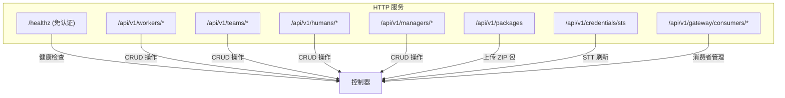
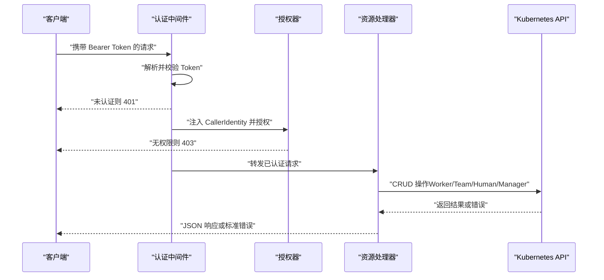
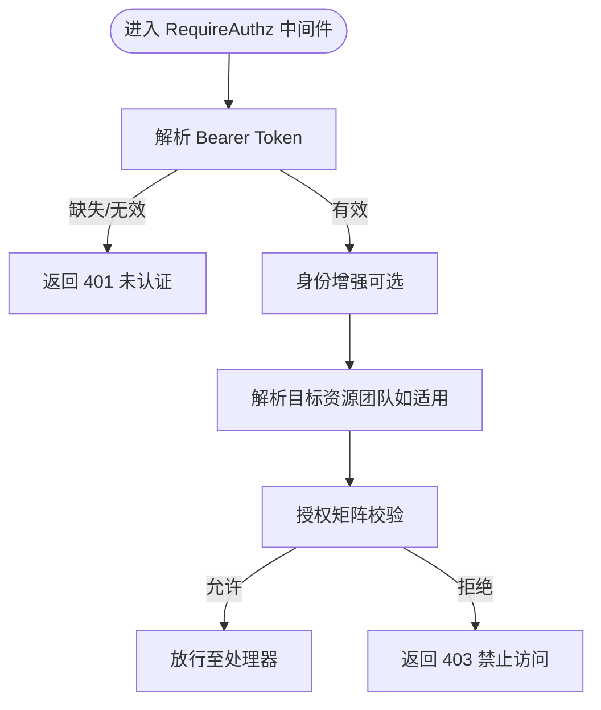
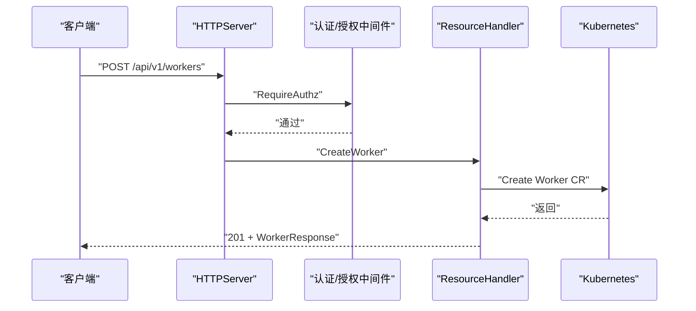
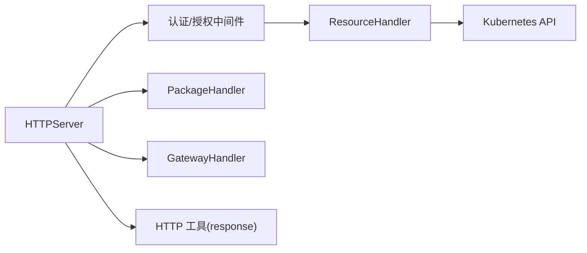

# REST API

<cite>
**本文引用的文件**
- [hiclaw-controller/internal/server/http.go](file://hiclaw-controller/internal/server/http.go)
- [hiclaw-controller/internal/server/resource_handler.go](file://hiclaw-controller/internal/server/resource_handler.go)
- [hiclaw-controller/internal/server/types.go](file://hiclaw-controller/internal/server/types.go)
- [hiclaw-controller/internal/auth/middleware.go](file://hiclaw-controller/internal/auth/middleware.go)
- [hiclaw-controller/internal/auth/authorizer.go](file://hiclaw-controller/internal/auth/authorizer.go)
- [hiclaw-controller/internal/httputil/response.go](file://hiclaw-controller/internal/httputil/response.go)
- [hiclaw-controller/internal/server/package_handler.go](file://hiclaw-controller/internal/server/package_handler.go)
- [hiclaw-controller/internal/server/gateway_handler.go](file://hiclaw-controller/internal/server/gateway_handler.go)
- [hiclaw-controller/cmd/hiclaw/main.go](file://hiclaw-controller/cmd/hiclaw/main.go)
- [hiclaw-controller/cmd/hiclaw/delete.go](file://hiclaw-controller/cmd/hiclaw/delete.go)
- [hiclaw-controller/cmd/hiclaw/get.go](file://hiclaw-controller/cmd/hiclaw/get.go)
- [shared/lib/oss-credentials.sh](file://shared/lib/oss-credentials.sh)
</cite>

## 目录
1. [简介](#简介)
2. [项目结构](#项目结构)
3. [核心组件](#核心组件)
4. [架构总览](#架构总览)
5. [详细组件分析](#详细组件分析)
6. [依赖分析](#依赖分析)
7. [性能考虑](#性能考虑)
8. [故障排查指南](#故障排查指南)
9. [结论](#结论)
10. [附录](#附录)

## 简介
本文件为 HiClaw 控制器统一 REST API 的权威文档，覆盖 Worker、Team、Manager、Human 四类资源的管理接口，以及与控制器集成的包上传、凭据刷新、AI 网关消费者管理等能力。API 基于统一的版本前缀 /api/v1，采用 Bearer Token 认证与基于角色的授权策略，返回标准 JSON 错误格式。本文提供端点清单、请求/响应模型、状态码、错误处理、认证与授权策略、速率限制与最佳实践建议，以及客户端实现指引。

## 项目结构
- 统一 HTTP 服务在内部模块中注册路由，按资源类型分组：
  - Worker 管理：/api/v1/workers
  - Team 管理：/api/v1/teams
  - Human 管理：/api/v1/humans
  - Manager 管理：/api/v1/managers
  - 包上传：/api/v1/packages
  - 凭据刷新：/api/v1/credentials/sts
  - 网关消费者：/api/v1/gateway/consumers/*
- 所有受保护端点均通过中间件进行认证与授权检查；健康检查端点 /healthz 免认证。

**图表来源**
- [hiclaw-controller/internal/server/http.go:42-112](file://hiclaw-controller/internal/server/http.go#L42-L112)

**章节来源**
- [hiclaw-controller/internal/server/http.go:42-112](file://hiclaw-controller/internal/server/http.go#L42-L112)

## 核心组件
- HTTPServer：统一注册路由并挂载认证/授权中间件。
- ResourceHandler：实现 Worker/Team/Human/Manager 的 CRUD 与聚合视图逻辑。
- Types：定义请求/响应数据结构。
- Auth 中间件与授权器：实现 Bearer Token 解析、身份增强与基于角色的授权矩阵。
- HTTP 工具：统一 JSON 响应与错误输出。
- 包上传处理器：支持 multipart/form-data 上传 ZIP 包并返回 OSS URI。
- 网关处理器：封装统一网关客户端，提供消费者创建/绑定/删除等能力。
- CLI 客户端：演示 Bearer Token 使用与统一错误处理。

**章节来源**
- [hiclaw-controller/internal/server/http.go:36-112](file://hiclaw-controller/internal/server/http.go#L36-L112)
- [hiclaw-controller/internal/server/resource_handler.go:22-70](file://hiclaw-controller/internal/server/resource_handler.go#L22-L70)
- [hiclaw-controller/internal/server/types.go:5-245](file://hiclaw-controller/internal/server/types.go#L5-L245)
- [hiclaw-controller/internal/auth/middleware.go:31-169](file://hiclaw-controller/internal/auth/middleware.go#L31-L169)
- [hiclaw-controller/internal/auth/authorizer.go:31-155](file://hiclaw-controller/internal/auth/authorizer.go#L31-L155)
- [hiclaw-controller/internal/httputil/response.go:9-27](file://hiclaw-controller/internal/httputil/response.go#L9-L27)
- [hiclaw-controller/internal/server/package_handler.go:13-70](file://hiclaw-controller/internal/server/package_handler.go#L13-L70)
- [hiclaw-controller/internal/server/gateway_handler.go:12-95](file://hiclaw-controller/internal/server/gateway_handler.go#L12-L95)
- [hiclaw-controller/cmd/hiclaw/main.go:9-35](file://hiclaw-controller/cmd/hiclaw/main.go#L9-L35)

## 架构总览
下图展示 API 请求在认证、授权、资源处理与 Kubernetes CRD 之间的流转。

**图表来源**
- [hiclaw-controller/internal/auth/middleware.go:51-118](file://hiclaw-controller/internal/auth/middleware.go#L51-L118)
- [hiclaw-controller/internal/auth/authorizer.go:38-155](file://hiclaw-controller/internal/auth/authorizer.go#L38-L155)
- [hiclaw-controller/internal/server/resource_handler.go:74-138](file://hiclaw-controller/internal/server/resource_handler.go#L74-L138)

## 详细组件分析

### 认证与授权
- 认证：从请求头 Authorization: Bearer <token> 提取令牌，若缺失或无效返回 401。
- 授权：基于角色（管理员、经理、团队领导、Worker）与资源团队进行授权矩阵校验，拒绝则返回 403。
- 资源团队解析：对 worker 资源可解析其所属团队注解，用于同队限制。

**图表来源**
- [hiclaw-controller/internal/auth/middleware.go:51-118](file://hiclaw-controller/internal/auth/middleware.go#L51-L118)
- [hiclaw-controller/internal/auth/authorizer.go:38-155](file://hiclaw-controller/internal/auth/authorizer.go#L38-L155)

**章节来源**
- [hiclaw-controller/internal/auth/middleware.go:51-169](file://hiclaw-controller/internal/auth/middleware.go#L51-L169)
- [hiclaw-controller/internal/auth/authorizer.go:38-155](file://hiclaw-controller/internal/auth/authorizer.go#L38-L155)

### Worker 管理 API
- 版本：/api/v1
- 路由与方法
  - POST /api/v1/workers：创建独立 Worker（非团队成员）
  - GET /api/v1/workers：列出所有 Worker（独立 + 团队成员聚合视图）
  - GET /api/v1/workers/{name}：获取 Worker 或团队成员合成视图
  - PUT /api/v1/workers/{name}：更新独立 Worker
  - DELETE /api/v1/workers/{name}：删除独立 Worker
- 查询参数（列表）
  - team：仅返回指定团队成员
- 请求体（创建/更新）
  - CreateWorkerRequest / UpdateWorkerRequest
  - 关键字段：name、model、runtime、image、identity、soul、agents、skills、mcpServers、package、expose、channelPolicy、state
  - 团队上下文字段（team、teamLeader、role）仅在团队成员场景使用，独立 API 禁止设置
- 响应体
  - WorkerResponse：name、phase、state、model、runtime、image、containerState、matrixUserID、roomID、message、exposedPorts、team、role
  - 列表：WorkerListResponse
- 状态码
  - 201（创建）、200（获取/更新）、204（删除成功）、400（参数/JSON 错误）、409（冲突：团队成员需经 /teams/{name} 更新）、404（未找到）、500（内部错误）

**图表来源**
- [hiclaw-controller/internal/server/http.go:61-66](file://hiclaw-controller/internal/server/http.go#L61-L66)
- [hiclaw-controller/internal/server/resource_handler.go:74-138](file://hiclaw-controller/internal/server/resource_handler.go#L74-L138)

**章节来源**
- [hiclaw-controller/internal/server/http.go:61-66](file://hiclaw-controller/internal/server/http.go#L61-L66)
- [hiclaw-controller/internal/server/resource_handler.go:74-332](file://hiclaw-controller/internal/server/resource_handler.go#L74-L332)
- [hiclaw-controller/internal/server/types.go:7-67](file://hiclaw-controller/internal/server/types.go#L7-L67)

### Team 管理 API
- 路由与方法
  - POST /api/v1/teams：创建 Team
  - GET /api/v1/teams：列出 Team
  - GET /api/v1/teams/{name}：获取 Team
  - PUT /api/v1/teams/{name}：更新 Team（可替换成员列表）
  - DELETE /api/v1/teams/{name}：删除 Team
- 请求体
  - CreateTeamRequest / UpdateTeamRequest
  - 关键字段：name、description、admin、leader（含 heartbeat、workerIdleTimeout、channelPolicy、state）、workers（数组）
- 响应体
  - TeamResponse：name、phase、description、leaderName、leaderHeartbeat、workerIdleTimeout、teamRoomID、leaderDMRoomID、leaderReady、readyWorkers、totalWorkers、message、workerNames、workerExposedPorts
  - 列表：TeamListResponse
- 状态码
  - 201（创建）、200（获取/更新）、204（删除成功）、400（参数/JSON 错误）、404（未找到）、409（冲突：团队成员需经 /teams/{name} 更新）、500（内部错误）

**章节来源**
- [hiclaw-controller/internal/server/http.go:61-66](file://hiclaw-controller/internal/server/http.go#L61-L66)
- [hiclaw-controller/internal/server/resource_handler.go:335-547](file://hiclaw-controller/internal/server/resource_handler.go#L335-L547)
- [hiclaw-controller/internal/server/types.go:71-144](file://hiclaw-controller/internal/server/types.go#L71-L144)

### Human 管理 API
- 路由与方法
  - POST /api/v1/humans：创建 Human
  - GET /api/v1/humans：列出 Human
  - GET /api/v1/humans/{name}：获取 Human
  - DELETE /api/v1/humans/{name}：删除 Human
- 请求体
  - CreateHumanRequest：name、displayName、email、permissionLevel、accessibleTeams、accessibleWorkers、note
- 响应体
  - HumanResponse：name、phase、displayName、matrixUserID、initialPassword、rooms、message
  - 列表：HumanListResponse
- 状态码
  - 201（创建）、200（获取）、204（删除成功）、400（参数/JSON 错误）、404（未找到）、500（内部错误）

**章节来源**
- [hiclaw-controller/internal/server/http.go:68-72](file://hiclaw-controller/internal/server/http.go#L68-L72)
- [hiclaw-controller/internal/server/resource_handler.go:551-634](file://hiclaw-controller/internal/server/resource_handler.go#L551-L634)
- [hiclaw-controller/internal/server/types.go:148-171](file://hiclaw-controller/internal/server/types.go#L148-L171)

### Manager 管理 API
- 路由与方法
  - POST /api/v1/managers：创建 Manager
  - GET /api/v1/managers：列出 Manager
  - GET /api/v1/managers/{name}：获取 Manager
  - PUT /api/v1/managers/{name}：更新 Manager
  - DELETE /api/v1/managers/{name}：删除 Manager
- 请求体
  - CreateManagerRequest / UpdateManagerRequest：name、model、runtime、image、soul、agents、skills、mcpServers、package、config、state
- 响应体
  - ManagerResponse：name、phase、state、model、runtime、image、matrixUserID、roomID、version、message、welcomeSent
  - 列表：ManagerListResponse
- 状态码
  - 201（创建）、200（获取/更新）、204（删除成功）、400（参数/JSON 错误）、404（未找到）、500（内部错误）

**章节来源**
- [hiclaw-controller/internal/server/http.go:74-79](file://hiclaw-controller/internal/server/http.go#L74-L79)
- [hiclaw-controller/internal/server/resource_handler.go:638-797](file://hiclaw-controller/internal/server/resource_handler.go#L638-L797)
- [hiclaw-controller/internal/server/types.go:175-223](file://hiclaw-controller/internal/server/types.go#L175-L223)

### 包上传 API
- 路由与方法
  - POST /api/v1/packages：上传 ZIP 包
- 请求
  - Content-Type: multipart/form-data
  - 字段：
    - file：ZIP 文件二进制
    - name：资源名（用于存储键）
  - 限制：最大 64MB
- 响应
  - 成功：200 + {"packageUri": "oss://hiclaw-config/packages/{name}-{hash}.zip"}
  - 失败：400/500（解析/读取/上传错误），503（OSS 未配置）
- 注意
  - 返回的 packageUri 可直接用于 Worker/Manager 的 package 字段

**章节来源**
- [hiclaw-controller/internal/server/http.go:81-83](file://hiclaw-controller/internal/server/http.go#L81-L83)
- [hiclaw-controller/internal/server/package_handler.go:22-70](file://hiclaw-controller/internal/server/package_handler.go#L22-L70)

### 凭据刷新 API
- 路由与方法
  - POST /api/v1/credentials/sts：刷新 STS 凭据（自限定：不带路径名，按调用者身份作用域）
- 请求
  - 需携带 Bearer Token（通常来自控制器或 Worker）
- 响应
  - 成功：200 + 凭据信息（具体结构由后端实现决定）
  - 失败：401/403/500
- 使用场景
  - Worker 首次启动或凭据过期时向控制器申请临时凭据

**章节来源**
- [hiclaw-controller/internal/server/http.go:100-102](file://hiclaw-controller/internal/server/http.go#L100-L102)
- [shared/lib/oss-credentials.sh:51-64](file://shared/lib/oss-credentials.sh#L51-L64)

### 网关消费者 API
- 路由与方法
  - POST /api/v1/gateway/consumers：创建消费者并返回 consumer_id 与 API Key
  - POST /api/v1/gateway/consumers/{id}/bind：将消费者与 AI 路由授权绑定
  - DELETE /api/v1/gateway/consumers/{id}：删除消费者
- 请求体
  - CreateConsumerRequest：name、credential_key（可选）
- 响应体
  - ConsumerResponse：name、consumer_id、api_key（可选）、status
- 状态码
  - 201/204/200、400/500（未实现/后端错误）

**章节来源**
- [hiclaw-controller/internal/server/http.go:74-79](file://hiclaw-controller/internal/server/http.go#L74-L79)
- [hiclaw-controller/internal/server/gateway_handler.go:21-95](file://hiclaw-controller/internal/server/gateway_handler.go#L21-L95)

## 依赖分析
- 路由注册依赖认证中间件与资源处理器：
  - /api/v1/workers → ResourceHandler.Create/Get/List/Update/DeleteWorker
  - /api/v1/teams → ResourceHandler.Create/Get/List/Update/DeleteTeam
  - /api/v1/humans → ResourceHandler.Create/Get/List/DeleteHuman
  - /api/v1/managers → ResourceHandler.Create/Get/List/Update/DeleteManager
  - /api/v1/packages → PackageHandler.Upload
  - /api/v1/credentials/sts → CredentialsHandler.RefreshSTS
  - /api/v1/gateway/consumers → GatewayHandler.Create/Bind/DeleteConsumer
- 错误映射：Kubernetes API 错误映射为 404/409/500，统一通过工具函数输出标准 JSON 错误。

**图表来源**
- [hiclaw-controller/internal/server/http.go:36-112](file://hiclaw-controller/internal/server/http.go#L36-L112)
- [hiclaw-controller/internal/server/resource_handler.go:1015-1027](file://hiclaw-controller/internal/server/resource_handler.go#L1015-L1027)
- [hiclaw-controller/internal/httputil/response.go:14-27](file://hiclaw-controller/internal/httputil/response.go#L14-L27)

**章节来源**
- [hiclaw-controller/internal/server/http.go:36-112](file://hiclaw-controller/internal/server/http.go#L36-L112)
- [hiclaw-controller/internal/server/resource_handler.go:1015-1027](file://hiclaw-controller/internal/server/resource_handler.go#L1015-L1027)
- [hiclaw-controller/internal/httputil/response.go:14-27](file://hiclaw-controller/internal/httputil/response.go#L14-L27)

## 性能考虑
- 列表聚合：/api/v1/workers 在未指定团队过滤时会合并独立 Worker 与团队成员视图，查询开销与团队规模相关。
- 乐观锁重试：更新操作在遇到并发冲突时最多重试数次，避免瞬时竞争导致失败。
- Docker API 透传（嵌入模式）：仅在特定模式启用，且具备安全校验，避免任意容器操作风险。
- 建议
  - 批量操作时优先使用列表 + 客户端过滤，减少多次往返。
  - 对频繁更新的资源，注意并发冲突与重试策略。

[本节为通用指导，无需代码引用]

## 故障排查指南
- 401 未认证
  - 检查 Authorization 头是否为 Bearer <token>，且 token 有效。
- 403 禁止访问
  - 核对调用者角色与目标资源团队是否匹配；团队领导仅能访问本队资源。
- 400 参数/JSON 错误
  - 检查请求体 JSON 结构与必填字段；确认 multipart 表单字段与大小限制。
- 404 未找到
  - 确认资源名称与命名空间正确；独立 Worker 与团队成员的更新入口不同。
- 409 冲突
  - 团队成员请改走 /api/v1/teams/{name}；对象被修改请重试。
- 500 内部错误
  - 查看控制器日志；关注 Kubernetes API 错误映射与后端异常。
- CLI 错误处理
  - 客户端会将非 2xx 响应映射为带状态码与消息的错误，便于脚本化处理。

**章节来源**
- [hiclaw-controller/internal/auth/middleware.go:51-118](file://hiclaw-controller/internal/auth/middleware.go#L51-L118)
- [hiclaw-controller/internal/auth/authorizer.go:38-155](file://hiclaw-controller/internal/auth/authorizer.go#L38-L155)
- [hiclaw-controller/internal/server/resource_handler.go:1015-1027](file://hiclaw-controller/internal/server/resource_handler.go#L1015-L1027)
- [hiclaw-controller/cmd/hiclaw/get.go:194-209](file://hiclaw-controller/cmd/hiclaw/get.go#L194-L209)

## 结论
HiClaw REST API 以统一的 /api/v1 版本前缀提供资源管理能力，结合 Bearer Token 认证与角色授权矩阵，确保多角色协作下的安全与一致性。通过聚合视图与标准错误格式，既满足现有客户端兼容性，又为未来扩展提供清晰边界。建议在生产环境中配合严格的令牌管理与审计日志，遵循最小权限原则与幂等设计。

[本节为总结，无需代码引用]

## 附录

### API 端点一览（按资源）
- Worker
  - POST /api/v1/workers
  - GET /api/v1/workers
  - GET /api/v1/workers/{name}
  - PUT /api/v1/workers/{name}
  - DELETE /api/v1/workers/{name}
- Team
  - POST /api/v1/teams
  - GET /api/v1/teams
  - GET /api/v1/teams/{name}
  - PUT /api/v1/teams/{name}
  - DELETE /api/v1/teams/{name}
- Human
  - POST /api/v1/humans
  - GET /api/v1/humans
  - GET /api/v1/humans/{name}
  - DELETE /api/v1/humans/{name}
- Manager
  - POST /api/v1/managers
  - GET /api/v1/managers
  - GET /api/v1/managers/{name}
  - PUT /api/v1/managers/{name}
  - DELETE /api/v1/managers/{name}
- 包上传
  - POST /api/v1/packages
- 凭据刷新
  - POST /api/v1/credentials/sts
- 网关消费者
  - POST /api/v1/gateway/consumers
  - POST /api/v1/gateway/consumers/{id}/bind
  - DELETE /api/v1/gateway/consumers/{id}

**章节来源**
- [hiclaw-controller/internal/server/http.go:61-102](file://hiclaw-controller/internal/server/http.go#L61-L102)

### 认证与授权要点
- 认证方式：Bearer Token（Authorization: Bearer <token>）
- 授权角色：Admin、Manager、TeamLeader、Worker
- 授权规则：
  - Admin/Manager：全量资源全权限
  - TeamLeader：仅限本队的 get/list/update/wake/sleep/ensure-ready/status 等
  - Worker：仅限自身 get/status/ready/sts
- 资源团队：worker 资源可解析所属团队，跨队访问将被拒绝

**章节来源**
- [hiclaw-controller/internal/auth/middleware.go:51-169](file://hiclaw-controller/internal/auth/middleware.go#L51-L169)
- [hiclaw-controller/internal/auth/authorizer.go:38-155](file://hiclaw-controller/internal/auth/authorizer.go#L38-L155)

### 错误响应格式
- 统一 JSON：{"message": "<错误描述>"}
- 状态码映射（示例）
  - 400：参数/JSON/表单解析错误
  - 401：未认证
  - 403：禁止访问
  - 404：资源不存在
  - 409：冲突（对象被修改或团队成员需经团队端点）
  - 500：内部错误
  - 503：服务不可用（如 OSS 未配置）

**章节来源**
- [hiclaw-controller/internal/httputil/response.go:9-27](file://hiclaw-controller/internal/httputil/response.go#L9-L27)
- [hiclaw-controller/internal/server/resource_handler.go:1015-1027](file://hiclaw-controller/internal/server/resource_handler.go#L1015-L1027)

### 客户端实现建议
- 令牌来源
  - 优先使用环境变量 HICLAW_AUTH_TOKEN 或 HICLAW_AUTH_TOKEN_FILE
  - Worker 可通过控制器 /api/v1/credentials/sts 获取临时令牌
- 请求头
  - 每个受保护请求必须包含 Authorization: Bearer <token>
- 错误处理
  - 对非 2xx 响应读取 body 并解析错误消息
  - 对 401/403 做重试/刷新令牌策略
- 幂等性
  - 列表与查询端点尽量幂等；更新端点注意乐观锁重试

**章节来源**
- [hiclaw-controller/cmd/hiclaw/main.go:16-19](file://hiclaw-controller/cmd/hiclaw/main.go#L16-L19)
- [shared/lib/oss-credentials.sh:28-64](file://shared/lib/oss-credentials.sh#L28-L64)

### 示例：使用 CLI 删除资源
- 语法
  - hiclaw delete worker <name>
  - hiclaw delete team <name>
  - hiclaw delete human <name>
  - hiclaw delete manager <name>
- 行为
  - 自动拼接 /api/v1/{kind}s/{name} 并携带 Bearer Token

**章节来源**
- [hiclaw-controller/cmd/hiclaw/delete.go:21-72](file://hiclaw-controller/cmd/hiclaw/delete.go#L21-L72)