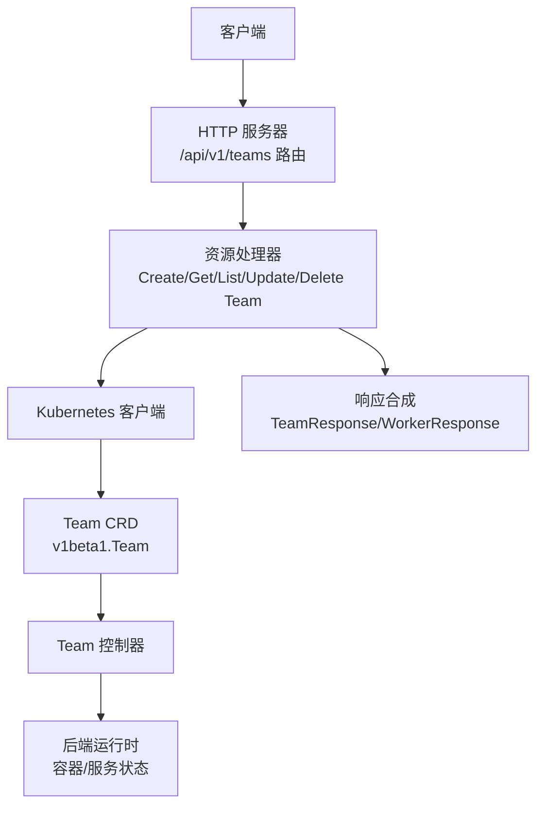
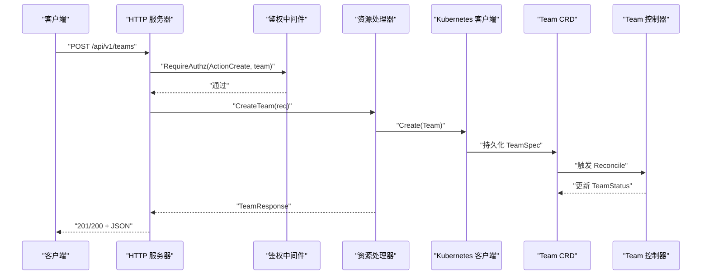
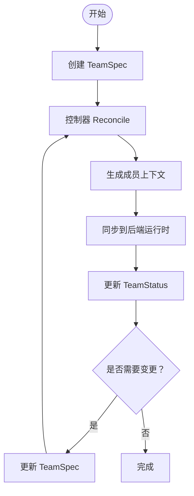
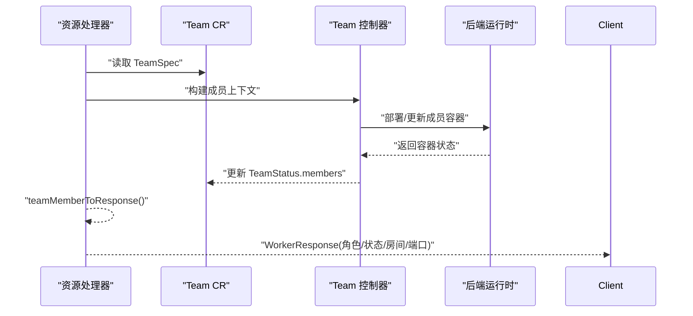
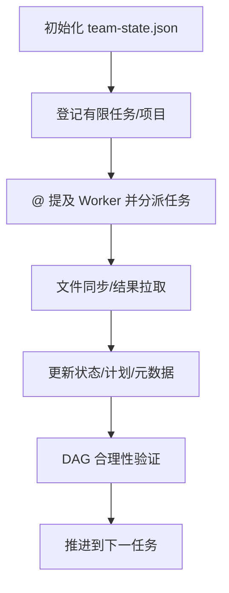
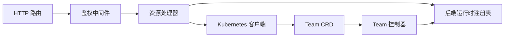

# Team 管理 API

<cite>
**本文引用的文件**
- [hiclaw-controller/internal/server/http.go](file://hiclaw-controller/internal/server/http.go)
- [hiclaw-controller/internal/server/resource_handler.go](file://hiclaw-controller/internal/server/resource_handler.go)
- [hiclaw-controller/internal/server/types.go](file://hiclaw-controller/internal/server/types.go)
- [hiclaw-controller/api/v1beta1/types.go](file://hiclaw-controller/api/v1beta1/types.go)
- [hiclaw-controller/internal/controller/team_controller.go](file://hiclaw-controller/internal/controller/team_controller.go)
- [hiclaw-controller/internal/controller/member_reconcile.go](file://hiclaw-controller/internal/controller/member_reconcile.go)
- [manager/agent/team-leader-agent/skills/team-task-management/references/state-management.md](file://manager/agent/team-leader-agent/skills/team-task-management/references/state-management.md)
- [manager/agent/team-leader-agent/skills/team-project-management/references/task-lifecycle.md](file://manager/agent/team-leader-agent/skills/team-project-management/references/task-lifecycle.md)
- [tests/test-21-team-project-dag.sh](file://tests/test-21-team-project-dag.sh)
</cite>

## 目录
1. [简介](#简介)
2. [项目结构](#项目结构)
3. [核心组件](#核心组件)
4. [架构总览](#架构总览)
5. [详细组件分析](#详细组件分析)
6. [依赖分析](#依赖分析)
7. [性能考虑](#性能考虑)
8. [故障排查指南](#故障排查指南)
9. [结论](#结论)
10. [附录](#附录)

## 简介
本文件面向 Team 管理 API 的使用者与维护者，系统性梳理 HiClaw 中 Team 的 HTTP 接口、数据模型与生命周期管理机制。内容覆盖：
- Team 相关端点：创建、列出、查询、更新、删除
- TeamSpec 字段详解：Leader、成员列表、权限策略、任务状态与暴露端口
- Team 生命周期：创建、成员增删、权限变更、销毁
- Team 与 Worker 的绑定关系与状态同步
- 团队级任务协调与状态管理（基于 Leader Agent 的状态文件）
- 请求/响应示例与最佳实践

## 项目结构
Team API 由统一 HTTP 服务器注册路由，资源处理器负责解析请求、调用 Kubernetes 客户端并返回响应；TeamSpec 数据模型定义在 CRD 层，控制器负责将 Spec 同步到后端运行时与状态。

图表来源
- [hiclaw-controller/internal/server/http.go:61-66](file://hiclaw-controller/internal/server/http.go#L61-L66)
- [hiclaw-controller/internal/server/resource_handler.go:336-547](file://hiclaw-controller/internal/server/resource_handler.go#L336-L547)
- [hiclaw-controller/api/v1beta1/types.go:159-165](file://hiclaw-controller/api/v1beta1/types.go#L159-L165)

章节来源
- [hiclaw-controller/internal/server/http.go:61-66](file://hiclaw-controller/internal/server/http.go#L61-L66)
- [hiclaw-controller/internal/server/resource_handler.go:336-547](file://hiclaw-controller/internal/server/resource_handler.go#L336-L547)
- [hiclaw-controller/api/v1beta1/types.go:159-165](file://hiclaw-controller/api/v1beta1/types.go#L159-L165)

## 核心组件
- HTTP 路由注册：在统一的 HTTP 服务器中注册 Team 相关路由，使用鉴权中间件进行授权校验。
- 资源处理器：负责解析请求体、构造 Team CR、调用 Kubernetes 客户端执行 CRUD 操作，并将 CR 状态映射为 API 响应。
- 数据模型：TeamSpec、LeaderSpec、TeamWorkerSpec、TeamStatus 等定义在 CRD 层，承载团队配置、成员与状态。
- 控制器：将 TeamSpec 同步到后端运行时，管理成员生命周期、房间与暴露端口等状态。

章节来源
- [hiclaw-controller/internal/server/http.go:61-66](file://hiclaw-controller/internal/server/http.go#L61-L66)
- [hiclaw-controller/internal/server/resource_handler.go:336-547](file://hiclaw-controller/internal/server/resource_handler.go#L336-L547)
- [hiclaw-controller/api/v1beta1/types.go:167-317](file://hiclaw-controller/api/v1beta1/types.go#L167-L317)

## 架构总览
下图展示 Team API 的端到端交互：客户端通过 HTTP 发起请求，服务器经鉴权后交由资源处理器处理，最终写入或读取 Kubernetes 中的 Team CR。

图表来源
- [hiclaw-controller/internal/server/http.go:61-66](file://hiclaw-controller/internal/server/http.go#L61-L66)
- [hiclaw-controller/internal/server/resource_handler.go:336-374](file://hiclaw-controller/internal/server/resource_handler.go#L336-L374)
- [hiclaw-controller/api/v1beta1/types.go:159-165](file://hiclaw-controller/api/v1beta1/types.go#L159-L165)

## 详细组件分析

### HTTP 端点规范
- 创建 Team
  - 方法与路径：POST /api/v1/teams
  - 鉴权：ActionCreate 对 team 资源
  - 请求体：CreateTeamRequest
  - 响应：201 Created 或 200 OK（取决于实现），返回 TeamResponse
- 列出 Teams
  - 方法与路径：GET /api/v1/teams
  - 鉴权：ActionList 对 team 资源
  - 响应：200 OK，返回 TeamListResponse
- 获取 Team 详情
  - 方法与路径：GET /api/v1/teams/{name}
  - 鉴权：ActionGet 对 team 资源（按名称）
  - 响应：200 OK，返回 TeamResponse
- 更新 Team
  - 方法与路径：PUT /api/v1/teams/{name}
  - 鉴权：ActionUpdate 对 team 资源（按名称）
  - 请求体：UpdateTeamRequest
  - 响应：200 OK，返回 TeamResponse
- 删除 Team
  - 方法与路径：DELETE /api/v1/teams/{name}
  - 鉴权：ActionDelete 对 team 资源（按名称）
  - 响应：204 No Content

章节来源
- [hiclaw-controller/internal/server/http.go:61-66](file://hiclaw-controller/internal/server/http.go#L61-L66)
- [hiclaw-controller/internal/server/resource_handler.go:336-547](file://hiclaw-controller/internal/server/resource_handler.go#L336-L547)

### Team 数据模型与字段说明
- TeamSpec
  - 字段
    - description: 团队描述
    - admin: 团队管理员信息（可选）
    - leader: 队长规格（必填）
    - workers: 成员列表（可选）
    - peerMentions: 是否允许成员间 @ 提及（默认 true）
    - channelPolicy: 团队级通信策略覆盖（可选）
- LeaderSpec
  - 字段
    - name: 队长名称（必填）
    - model/identity/soul/agents/package: 配置项
    - heartbeat: 心跳配置（可选）
    - workerIdleTimeout: 成员空闲超时
    - channelPolicy: 队长通信策略（可选）
    - state: 队长期望生命周期状态（Running/Sleeping/Stopped）
    - accessEntries/labels: 权限与标签（可选）
- TeamWorkerSpec
  - 字段
    - name: 成员名称（必填）
    - model/runtime/image/identity/soul/agents/package: 配置项
    - skills/mcpServers/expose/channelPolicy: 行为与网络策略（可选）
    - state: 成员期望生命周期状态（Running/Sleeping/Stopped）
    - accessEntries/labels: 权限与标签（可选）
- TeamStatus
  - 字段
    - phase: 团队阶段（Pending/Active/Degraded/Failed）
    - teamRoomID/leaderDMRoomID: 团队共享房间与队长 DM 房间 ID
    - leaderReady/readyWorkers/totalWorkers/message: 运行态统计与消息
    - members: 成员状态数组（含角色、房间、就绪、暴露端口等）

章节来源
- [hiclaw-controller/api/v1beta1/types.go:167-317](file://hiclaw-controller/api/v1beta1/types.go#L167-L317)

### Team 生命周期管理
- 创建
  - 解析 CreateTeamRequest，填充 TeamSpec（含 leader、workers、policy 等），写入 Kubernetes
- 成员管理
  - 成员通过 workers 列表声明；控制器根据 Spec 生成成员上下文并同步到后端
  - 成员状态聚合在 TeamStatus.members 中，包含就绪、房间、暴露端口等
- 权限与通信策略
  - 支持在 TeamSpec 和成员级别设置 channelPolicy；支持 accessEntries 注入云权限
- 销毁
  - DELETE /api/v1/teams/{name} 删除 Team CR，控制器随之清理成员与相关资源

图表来源
- [hiclaw-controller/internal/controller/team_controller.go:644-668](file://hiclaw-controller/internal/controller/team_controller.go#L644-L668)
- [hiclaw-controller/api/v1beta1/types.go:240-317](file://hiclaw-controller/api/v1beta1/types.go#L240-L317)

章节来源
- [hiclaw-controller/internal/server/resource_handler.go:336-547](file://hiclaw-controller/internal/server/resource_handler.go#L336-L547)
- [hiclaw-controller/internal/controller/team_controller.go:153-191](file://hiclaw-controller/internal/controller/team_controller.go#L153-L191)
- [hiclaw-controller/internal/controller/team_controller.go:427-481](file://hiclaw-controller/internal/controller/team_controller.go#L427-L481)

### Team 与 Worker 绑定关系与状态同步
- Team 成员通过 TeamSpec 已声明；资源处理器在合成 /workers 视图时，会将 Team 成员映射为 WorkerResponse，包含角色、状态、房间、暴露端口等
- 控制器通过成员上下文（MemberContext）将 Spec 变更与后端状态对齐，成员状态稳定排序以减少补丁抖动
- 心跳与空闲超时由 TeamLeaderHeartbeatSpec 与成员 state 字段共同驱动

图表来源
- [hiclaw-controller/internal/server/resource_handler.go:946-1013](file://hiclaw-controller/internal/server/resource_handler.go#L946-L1013)
- [hiclaw-controller/internal/controller/team_controller.go:644-668](file://hiclaw-controller/internal/controller/team_controller.go#L644-L668)

章节来源
- [hiclaw-controller/internal/server/resource_handler.go:946-1013](file://hiclaw-controller/internal/server/resource_handler.go#L946-L1013)
- [hiclaw-controller/internal/controller/member_reconcile.go:41-72](file://hiclaw-controller/internal/controller/member_reconcile.go#L41-L72)

### 团队级任务协调与状态同步
- Leader Agent 维护团队级状态文件（team-state.json），用于跟踪活动任务、项目与更新时间
- 任务生命周期：登记、分派、结果拉取、状态更新、DAG 合理性验证
- 测试脚本验证 DAG 循环检测与状态跟踪功能

图表来源
- [manager/agent/team-leader-agent/skills/team-task-management/references/state-management.md:1-47](file://manager/agent/team-leader-agent/skills/team-task-management/references/state-management.md#L1-L47)
- [manager/agent/team-leader-agent/skills/team-project-management/references/task-lifecycle.md:60-110](file://manager/agent/team-leader-agent/skills/team-project-management/references/task-lifecycle.md#L60-L110)
- [tests/test-21-team-project-dag.sh:311-345](file://tests/test-21-team-project-dag.sh#L311-L345)

章节来源
- [manager/agent/team-leader-agent/skills/team-task-management/references/state-management.md:1-47](file://manager/agent/team-leader-agent/skills/team-task-management/references/state-management.md#L1-L47)
- [manager/agent/team-leader-agent/skills/team-project-management/references/task-lifecycle.md:60-110](file://manager/agent/team-leader-agent/skills/team-project-management/references/task-lifecycle.md#L60-L110)
- [tests/test-21-team-project-dag.sh:311-345](file://tests/test-21-team-project-dag.sh#L311-L345)

### 请求/响应示例与最佳实践
- 示例请求（创建 Team）
  - 请求体字段：name、leader.name、description、admin、peerMentions、channelPolicy、workers[]
  - 建议：首次创建时仅指定 leader，后续通过更新接口追加成员
- 示例响应（TeamResponse）
  - 字段：name、phase、description、leaderName、leaderHeartbeat、workerIdleTimeout、teamRoomID、leaderDMRoomID、leaderReady、readyWorkers、totalWorkers、message、workerNames、workerExposedPorts
- 最佳实践
  - 使用 channelPolicy 精细控制团队内通信范围
  - 通过 workers[] 声明成员而非直接创建 Worker CR，避免绕过控制器
  - 使用 state 字段表达期望生命周期（Running/Sleeping/Stopped），让控制器自动收敛
  - 通过 /api/v1/workers 聚合视图查看 Team 成员状态与暴露端口

章节来源
- [hiclaw-controller/internal/server/types.go:71-122](file://hiclaw-controller/internal/server/types.go#L71-L122)
- [hiclaw-controller/internal/server/types.go:124-144](file://hiclaw-controller/internal/server/types.go#L124-L144)
- [hiclaw-controller/internal/server/resource_handler.go:336-547](file://hiclaw-controller/internal/server/resource_handler.go#L336-L547)

## 依赖分析
- 路由层依赖鉴权中间件，确保对 team 资源的操作具备相应权限
- 资源处理器依赖 Kubernetes 客户端与后端运行时注册表，用于写入 CR 与查询容器状态
- 控制器依赖 provisioner/deployer/backend 等组件，将 Spec 同步为后端实际状态

图表来源
- [hiclaw-controller/internal/server/http.go:61-66](file://hiclaw-controller/internal/server/http.go#L61-L66)
- [hiclaw-controller/internal/server/resource_handler.go:336-547](file://hiclaw-controller/internal/server/resource_handler.go#L336-L547)
- [hiclaw-controller/api/v1beta1/types.go:159-165](file://hiclaw-controller/api/v1beta1/types.go#L159-L165)

章节来源
- [hiclaw-controller/internal/server/http.go:61-66](file://hiclaw-controller/internal/server/http.go#L61-L66)
- [hiclaw-controller/internal/server/resource_handler.go:336-547](file://hiclaw-controller/internal/server/resource_handler.go#L336-L547)

## 性能考虑
- 稳定排序与补丁最小化：控制器对成员状态进行稳定排序，减少不必要的补丁与事件风暴
- 增量变更检测：通过 SpecChanged 与 SpecHash 识别成员规格变更，避免不必要的重建
- 聚合视图优化：/workers 聚合视图在内存中合成 Team 成员状态，降低多次查询成本

章节来源
- [hiclaw-controller/internal/controller/team_controller.go:624-628](file://hiclaw-controller/internal/controller/team_controller.go#L624-L628)
- [hiclaw-controller/internal/controller/member_reconcile.go:41-72](file://hiclaw-controller/internal/controller/member_reconcile.go#L41-L72)

## 故障排查指南
- 常见错误码
  - 404 Not Found：资源不存在
  - 409 Conflict：对象冲突或已存在
  - 500 Internal Server Error：Kubernetes API 调用异常
- 定位步骤
  - 检查鉴权：确认调用方对 team 资源具有 ActionCreate/ActionGet/ActionUpdate/ActionDelete 权限
  - 检查请求体：确保 name、leader.name 等必填字段齐全
  - 查看 TeamStatus.message：定位控制器层面的错误信息
  - 关注成员状态：检查 TeamStatus.members 中各成员的就绪与房间信息

章节来源
- [hiclaw-controller/internal/server/resource_handler.go:1015-1027](file://hiclaw-controller/internal/server/resource_handler.go#L1015-L1027)
- [hiclaw-controller/api/v1beta1/types.go:240-317](file://hiclaw-controller/api/v1beta1/types.go#L240-L317)

## 结论
Team 管理 API 通过清晰的 HTTP 接口与严谨的数据模型，实现了团队的全生命周期管理。配合控制器的成员编排与状态同步能力，以及 Leader Agent 的团队级任务协调机制，能够支撑多 Agent 协作的复杂场景。建议在生产环境中遵循声明式配置、使用 channelPolicy 与 accessEntries 精准控制权限，并通过 state 字段表达期望状态，让控制器自动收敛至目标形态。

## 附录
- 相关参考文档
  - 团队任务状态管理：[state-management.md](file://manager/agent/team-leader-agent/skills/team-task-management/references/state-management.md)
  - 任务生命周期与 DAG 校验：[task-lifecycle.md](file://manager/agent/team-leader-agent/skills/team-project-management/references/task-lifecycle.md)
  - 团队项目 DAG 测试：[test-21-team-project-dag.sh](file://tests/test-21-team-project-dag.sh)