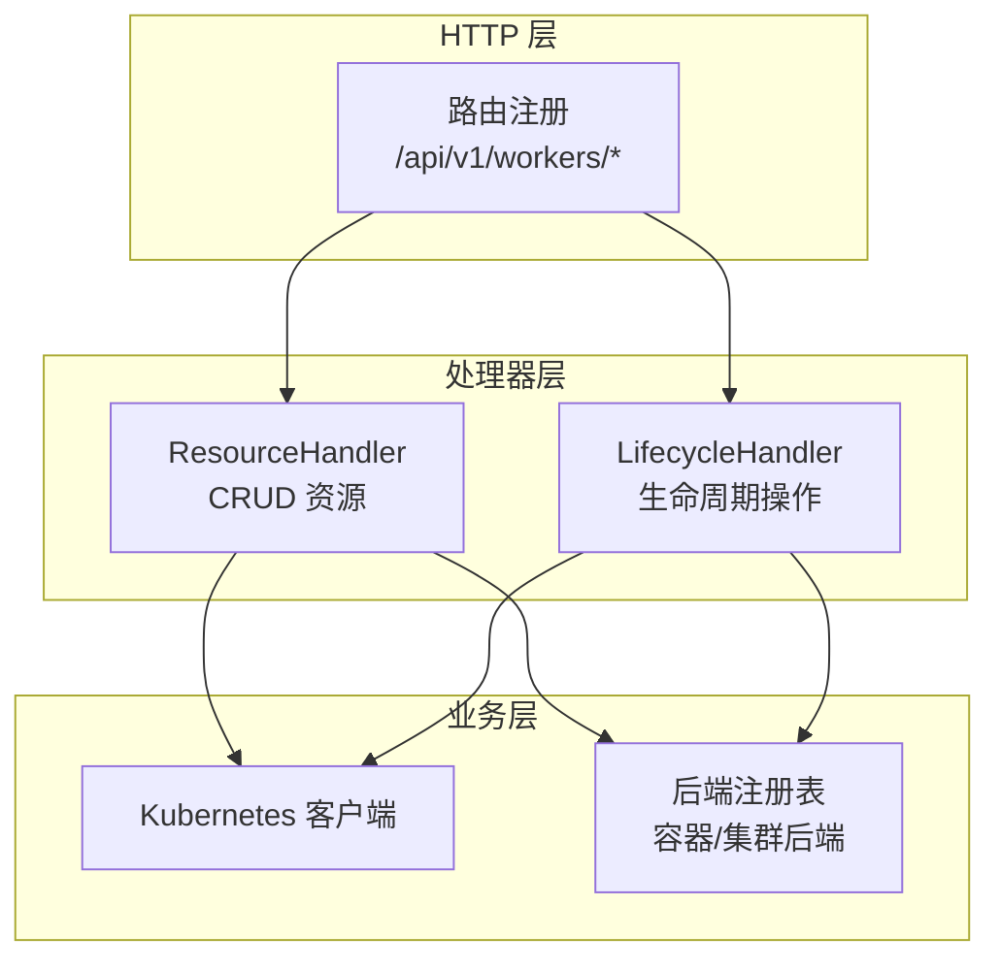
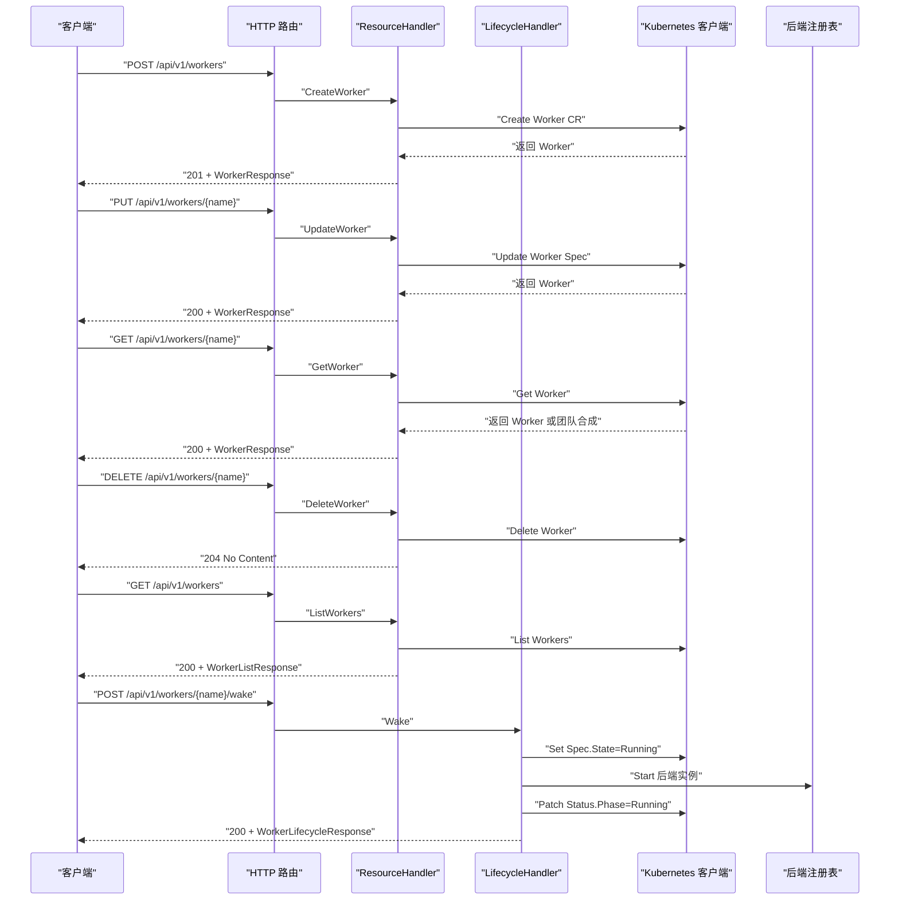
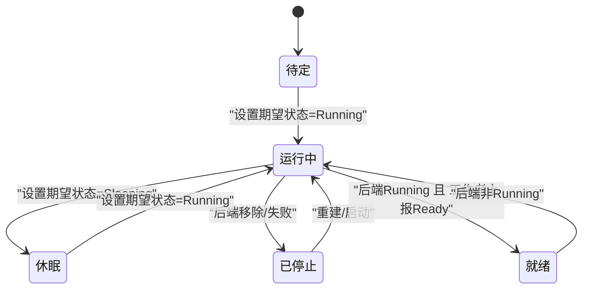
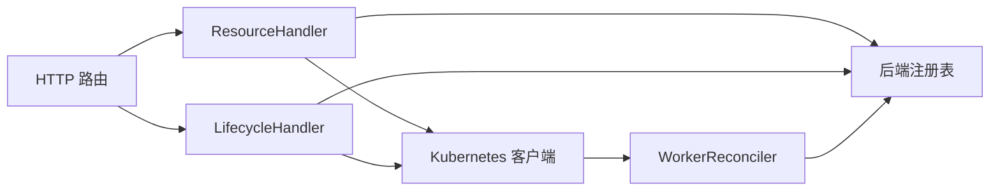

# Worker 管理 API

<cite>
**本文引用的文件**
- [hiclaw-controller/internal/server/http.go](file://hiclaw-controller/internal/server/http.go)
- [hiclaw-controller/internal/server/resource_handler.go](file://hiclaw-controller/internal/server/resource_handler.go)
- [hiclaw-controller/internal/server/lifecycle_handler.go](file://hiclaw-controller/internal/server/lifecycle_handler.go)
- [hiclaw-controller/internal/server/types.go](file://hiclaw-controller/internal/server/types.go)
- [hiclaw-controller/api/v1beta1/types.go](file://hiclaw-controller/api/v1beta1/types.go)
- [hiclaw-controller/internal/controller/worker_controller.go](file://hiclaw-controller/internal/controller/worker_controller.go)
- [hiclaw-controller/cmd/hiclaw/create.go](file://hiclaw-controller/cmd/hiclaw/create.go)
- [manager/agent/skills/worker-management/scripts/update-worker-config.sh](file://manager/agent/skills/worker-management/scripts/update-worker-config.sh)
- [manager/agent/skills/worker-management/scripts/lifecycle-worker.sh](file://manager/agent/skills/worker-management/scripts/lifecycle-worker.sh)
</cite>

## 目录
1. [简介](#简介)
2. [项目结构](#项目结构)
3. [核心组件](#核心组件)
4. [架构总览](#架构总览)
5. [详细组件分析](#详细组件分析)
6. [依赖分析](#依赖分析)
7. [性能考虑](#性能考虑)
8. [故障排查指南](#故障排查指南)
9. [结论](#结论)
10. [附录](#附录)

## 简介
本文件为 HiClaw 中 Worker 管理 API 的权威文档，覆盖以下内容：
- 所有 Worker 相关的 HTTP 端点：创建、获取详情、更新配置、删除、列表查询及生命周期操作
- 每个端点的请求参数、请求体格式、响应格式与状态码
- WorkerSpec 结构体字段说明（必填/可选）、运行时选择、资源暴露、标签管理与最佳实践
- Worker 生命周期状态转换、并发控制与错误处理机制
- 完整的请求/响应示例路径（以源码路径形式给出）

## 项目结构
Worker 管理 API 由控制器内置 HTTP 服务器提供，核心入口在路由注册处，实际业务逻辑分别由“声明式资源处理器”和“生命周期处理器”承担。

图表来源
- [hiclaw-controller/internal/server/http.go:54-91](file://hiclaw-controller/internal/server/http.go#L54-L91)
- [hiclaw-controller/internal/server/resource_handler.go:74-332](file://hiclaw-controller/internal/server/resource_handler.go#L74-L332)
- [hiclaw-controller/internal/server/lifecycle_handler.go:34-205](file://hiclaw-controller/internal/server/lifecycle_handler.go#L34-L205)

章节来源
- [hiclaw-controller/internal/server/http.go:54-91](file://hiclaw-controller/internal/server/http.go#L54-L91)

## 核心组件
- 路由注册：在统一入口注册 Worker 相关端点，支持鉴权与授权中间件
- ResourceHandler：负责 Worker 的声明式 CRUD 操作，支持聚合视图（独立 Worker + 团队成员）
- LifecycleHandler：负责 Worker 的即时生命周期操作（唤醒/休眠/确保就绪/就绪上报/运行时状态）
- WorkerSpec：Worker 的规格定义，包含模型、运行时、镜像、身份、技能、MCP 服务器、包、暴露端口、通道策略、期望状态、权限条目、标签等

章节来源
- [hiclaw-controller/internal/server/resource_handler.go:74-332](file://hiclaw-controller/internal/server/resource_handler.go#L74-L332)
- [hiclaw-controller/internal/server/lifecycle_handler.go:34-205](file://hiclaw-controller/internal/server/lifecycle_handler.go#L34-L205)
- [hiclaw-controller/api/v1beta1/types.go:71-104](file://hiclaw-controller/api/v1beta1/types.go#L71-L104)

## 架构总览
下图展示 Worker API 的关键交互流程：客户端通过 HTTP 调用控制器 API；ResourceHandler/LifecycleHandler 将请求映射到 Kubernetes CR 和后端容器/集群；控制器 Reconciler 将期望状态收敛为实际状态，并回写 WorkerStatus。

图表来源
- [hiclaw-controller/internal/server/http.go:54-91](file://hiclaw-controller/internal/server/http.go#L54-L91)
- [hiclaw-controller/internal/server/resource_handler.go:74-332](file://hiclaw-controller/internal/server/resource_handler.go#L74-L332)
- [hiclaw-controller/internal/server/lifecycle_handler.go:34-205](file://hiclaw-controller/internal/server/lifecycle_handler.go#L34-L205)

## 详细组件分析

### Worker API 端点规范

- 基础路径
  - 版本前缀：/api/v1
  - 资源路径：/workers

- 端点一览
  - POST /api/v1/workers
  - GET /api/v1/workers
  - GET /api/v1/workers/{name}
  - PUT /api/v1/workers/{name}
  - DELETE /api/v1/workers/{name}

- 生命周期端点（即时操作）
  - POST /api/v1/workers/{name}/wake
  - POST /api/v1/workers/{name}/sleep
  - POST /api/v1/workers/{name}/ensure-ready
  - POST /api/v1/workers/{name}/ready
  - GET /api/v1/workers/{name}/status

章节来源
- [hiclaw-controller/internal/server/http.go:54-91](file://hiclaw-controller/internal/server/http.go#L54-L91)

#### POST /api/v1/workers（创建 Worker）
- 功能：创建一个独立 Worker（非团队成员）
- 认证/授权：需要 ActionCreate 权限
- 请求体：CreateWorkerRequest
- 成功响应：201 Created + WorkerResponse
- 典型错误：400（JSON 解析失败/缺少 name）、409（名称属于团队成员）

请求体字段（CreateWorkerRequest）
- name: 必填
- model: 可选
- runtime: 可选（openclaw | copaw | hermes，默认 openclaw）
- image: 可选（自定义镜像）
- identity: 可选
- soul: 可选
- agents: 可选
- skills: 可选（字符串数组）
- mcpServers: 可选（数组，见 MCPServer）
- package: 可选（file://, http(s)://, nacos:// URI）
- expose: 可选（数组，见 ExposePort）
- channelPolicy: 可选（见 ChannelPolicySpec）
- state: 可选（Running | Sleeping | Stopped）
- team/teamLeader/role: 保留字段，团队成员请使用 /teams

响应体（WorkerResponse）
- name, phase, state, model, runtime, image, containerState, matrixUserID, roomID, message, exposedPorts, team, role

章节来源
- [hiclaw-controller/internal/server/resource_handler.go:74-138](file://hiclaw-controller/internal/server/resource_handler.go#L74-L138)
- [hiclaw-controller/internal/server/types.go:7-26](file://hiclaw-controller/internal/server/types.go#L7-L26)
- [hiclaw-controller/api/v1beta1/types.go:71-104](file://hiclaw-controller/api/v1beta1/types.go#L71-L104)

#### GET /api/v1/workers（列表查询）
- 功能：返回独立 Worker + 团队成员的聚合视图
- 认证/授权：需要 ActionList 权限
- 查询参数：team（可选，按团队过滤）
- 成功响应：200 OK + WorkerListResponse
- 行为：当未指定 team 时仅列出独立 Worker；否则包含所有团队成员（合成响应）

响应体（WorkerListResponse）
- workers: WorkerResponse 数组
- total: 整数

章节来源
- [hiclaw-controller/internal/server/resource_handler.go:171-212](file://hiclaw-controller/internal/server/resource_handler.go#L171-L212)

#### GET /api/v1/workers/{name}（获取详情）
- 功能：获取独立 Worker 或团队成员的详情
- 认证/授权：需要 ActionGet 权限
- 成功响应：200 OK + WorkerResponse
- 行为：若不存在独立 Worker，则尝试从团队成员中合成响应；不存在则 404

章节来源
- [hiclaw-controller/internal/server/resource_handler.go:140-169](file://hiclaw-controller/internal/server/resource_handler.go#L140-L169)

#### PUT /api/v1/workers/{name}（更新 Worker 配置）
- 功能：更新独立 Worker 的 Spec（不支持团队成员，请使用 /teams）
- 认证/授权：需要 ActionUpdate 权限
- 请求体：UpdateWorkerRequest（字段均为可选，支持部分更新）
- 成功响应：200 OK + WorkerResponse
- 并发控制：内部采用乐观锁重试（最多 3 次），避免与控制器状态写入冲突

请求体字段（UpdateWorkerRequest）
- model, runtime, image, identity, soul, agents, skills, mcpServers, package, expose, channelPolicy, state

章节来源
- [hiclaw-controller/internal/server/resource_handler.go:226-305](file://hiclaw-controller/internal/server/resource_handler.go#L226-L305)
- [hiclaw-controller/internal/server/types.go:28-41](file://hiclaw-controller/internal/server/types.go#L28-L41)

#### DELETE /api/v1/workers/{name}（删除 Worker）
- 功能：删除独立 Worker（不支持团队成员，请使用 /teams）
- 认证/授权：需要 ActionDelete 权限
- 成功响应：204 No Content
- 错误：409（名称属于团队成员）

章节来源
- [hiclaw-controller/internal/server/resource_handler.go:307-332](file://hiclaw-controller/internal/server/resource_handler.go#L307-L332)

#### 生命周期端点
- POST /api/v1/workers/{name}/wake（唤醒）
  - 设置 Spec.State=Running，立即调用后端启动，刷新状态为 Running
  - 成功：200 + WorkerLifecycleResponse
- POST /api/v1/workers/{name}/sleep（休眠）
  - 设置 Spec.State=Sleeping，立即调用后端停止，刷新状态为 Sleeping
  - 成功：200 + WorkerLifecycleResponse
- POST /api/v1/workers/{name}/ensure-ready（确保就绪）
  - 若当前为 Stopped/Sleeping，设置 Spec.State=Running 并尝试启动后端；若已 Running 且标记就绪，则返回 Ready
  - 成功：200 + WorkerLifecycleResponse
- POST /api/v1/workers/{name}/ready（就绪上报）
  - 工作者自我报告 Ready（受中间件限制仅允许工作者自身）
  - 成功：204 No Content
- GET /api/v1/workers/{name}/status（运行时状态）
  - 聚合 CR 状态与后端状态，若后端运行且已就绪则返回 Ready
  - 成功：200 + WorkerResponse

章节来源
- [hiclaw-controller/internal/server/lifecycle_handler.go:34-205](file://hiclaw-controller/internal/server/lifecycle_handler.go#L34-L205)

### WorkerSpec 字段说明（必填/可选）
- 必填字段
  - name（创建时）
  - model（创建时，或通过更新覆盖）
- 可选字段
  - runtime：运行时类型（openclaw | copaw | hermes，默认 openclaw）
  - image：自定义镜像
  - identity/soul/agents：身份与配置注入
  - skills：启用的技能名数组
  - mcpServers：MCP 服务器列表
  - package：包地址（file://, http(s)://, nacos://）
  - expose：暴露端口（协议 http/grpc）
  - channelPolicy：通道策略（群组/私信允许/拒绝扩展）
  - state：期望生命周期状态（Running | Sleeping | Stopped）
  - accessEntries：云权限授予条目
  - labels：Pod 标签（与控制器系统标签合并优先级）

章节来源
- [hiclaw-controller/api/v1beta1/types.go:71-104](file://hiclaw-controller/api/v1beta1/types.go#L71-L104)

### Worker 生命周期状态转换
- 状态来源：WorkerStatus.Phase（Pending/Running/Sleeping/Failed）
- 控制器 Reconciler 统一根据期望状态与后端实际状态计算最终 Phase
- 就绪判定：后端状态为 Running 且收到工作者就绪上报时，对外呈现 Ready

图表来源
- [hiclaw-controller/internal/controller/worker_controller.go:65-86](file://hiclaw-controller/internal/controller/worker_controller.go#L65-L86)
- [hiclaw-controller/internal/server/lifecycle_handler.go:176-205](file://hiclaw-controller/internal/server/lifecycle_handler.go#L176-L205)

章节来源
- [hiclaw-controller/internal/controller/worker_controller.go:65-86](file://hiclaw-controller/internal/controller/worker_controller.go#L65-L86)

### 并发控制与错误处理
- 并发控制
  - 更新操作采用乐观锁重试（最多 3 次），避免与控制器状态写入竞争
  - 路由层对 Worker 相关端点应用鉴权/授权中间件
- 错误处理
  - 400：请求体解析失败、缺少必要参数
  - 404：资源不存在
  - 409：名称冲突（属于团队成员）
  - 5xx：后端错误或内部异常
- 生命周期端点对后端错误进行分类映射（NotFound/Conflict/InternalServerError）

章节来源
- [hiclaw-controller/internal/server/resource_handler.go:18-20](file://hiclaw-controller/internal/server/resource_handler.go#L18-L20)
- [hiclaw-controller/internal/server/resource_handler.go:249-304](file://hiclaw-controller/internal/server/resource_handler.go#L249-L304)
- [hiclaw-controller/internal/server/lifecycle_handler.go:225-234](file://hiclaw-controller/internal/server/lifecycle_handler.go#L225-L234)

### 请求/响应示例（路径）
以下为典型场景的请求/响应示例路径（不直接展示具体内容）：
- 成功创建 Worker
  - 请求：POST /api/v1/workers
  - 示例路径：[hiclaw-controller/cmd/hiclaw/create.go:246-271](file://hiclaw-controller/cmd/hiclaw/create.go#L246-L271)
  - 响应：201 + WorkerResponse
- 更新 Worker 配置
  - 请求：PUT /api/v1/workers/{name}
  - 示例路径：[hiclaw-controller/cmd/hiclaw/create.go:246-271](file://hiclaw-controller/cmd/hiclaw/create.go#L246-L271)
  - 响应：200 + WorkerResponse
- 删除 Worker
  - 请求：DELETE /api/v1/workers/{name}
  - 示例路径：[hiclaw-controller/internal/server/resource_handler.go:307-332](file://hiclaw-controller/internal/server/resource_handler.go#L307-L332)
  - 响应：204 No Content
- 获取 Worker 详情
  - 请求：GET /api/v1/workers/{name}
  - 示例路径：[hiclaw-controller/internal/server/resource_handler.go:140-169](file://hiclaw-controller/internal/server/resource_handler.go#L140-L169)
  - 响应：200 + WorkerResponse
- 列表查询
  - 请求：GET /api/v1/workers
  - 示例路径：[hiclaw-controller/internal/server/resource_handler.go:171-212](file://hiclaw-controller/internal/server/resource_handler.go#L171-L212)
  - 响应：200 + WorkerListResponse
- 唤醒/休眠/确保就绪/就绪上报/运行时状态
  - 请求：POST /api/v1/workers/{name}/wake | sleep | ensure-ready | ready | GET /api/v1/workers/{name}/status
  - 示例路径：[hiclaw-controller/internal/server/lifecycle_handler.go:34-205](file://hiclaw-controller/internal/server/lifecycle_handler.go#L34-L205)

## 依赖分析
- 路由到处理器
  - /api/v1/workers/* → ResourceHandler
  - /api/v1/workers/{name}/wake|sleep|ensure-ready|ready|status → LifecycleHandler
- 处理器到后端
  - ResourceHandler：Kubernetes 客户端 + 后端注册表（用于运行时状态）
  - LifecycleHandler：Kubernetes 客户端 + 后端注册表（直接操作后端）
- 控制器收敛
  - WorkerReconciler：将期望状态（Spec.State）收敛为实际状态（Status.Phase），并写入状态

图表来源
- [hiclaw-controller/internal/server/http.go:54-91](file://hiclaw-controller/internal/server/http.go#L54-L91)
- [hiclaw-controller/internal/server/resource_handler.go:74-332](file://hiclaw-controller/internal/server/resource_handler.go#L74-L332)
- [hiclaw-controller/internal/server/lifecycle_handler.go:34-205](file://hiclaw-controller/internal/server/lifecycle_handler.go#L34-L205)
- [hiclaw-controller/internal/controller/worker_controller.go:57-151](file://hiclaw-controller/internal/controller/worker_controller.go#L57-L151)

章节来源
- [hiclaw-controller/internal/server/http.go:54-91](file://hiclaw-controller/internal/server/http.go#L54-L91)
- [hiclaw-controller/internal/controller/worker_controller.go:57-151](file://hiclaw-controller/internal/controller/worker_controller.go#L57-L151)

## 性能考虑
- 列表聚合：/workers 返回独立 Worker + 团队成员的合成视图，避免客户端多次请求
- 乐观锁重试：更新操作最多 3 次重试，降低并发冲突导致的失败率
- 运行时状态：/workers/{name}/status 聚合 CR 与后端状态，减少额外轮询
- 启动等待：CLI 提供等待 Ready 的超时机制，避免忙轮询

## 故障排查指南
- 400 错误
  - 检查请求体 JSON 是否合法，name/model 等是否缺失
- 404 错误
  - 资源不存在；确认命名空间与名称正确
- 409 错误
  - 名称属于团队成员，请改用 /teams/{name} 接口
- 500 错误
  - 后端或控制器内部异常；查看控制器日志与后端状态
- 就绪问题
  - 使用 /workers/{name}/status 观察后端状态；如后端 Running 但未 Ready，检查工作者是否上报 /workers/{name}/ready
- 运行时切换
  - 更新 runtime 后，使用 /workers/{name}/status 等待 Running 且 runtime 字段匹配；参考脚本中的轮询逻辑

章节来源
- [hiclaw-controller/internal/server/lifecycle_handler.go:225-234](file://hiclaw-controller/internal/server/lifecycle_handler.go#L225-L234)
- [hiclaw-controller/cmd/hiclaw/create.go:149-191](file://hiclaw-controller/cmd/hiclaw/create.go#L149-L191)
- [manager/agent/skills/worker-management/scripts/update-worker-config.sh:112-141](file://manager/agent/skills/worker-management/scripts/update-worker-config.sh#L112-L141)

## 结论
本 API 以声明式 CRUD 与即时生命周期操作相结合的方式，提供对 Worker 的全生命周期管理能力。通过控制器 Reconciler 将期望状态收敛为实际状态，并结合后端注册表实现运行时状态聚合与即时操作。建议在生产环境中配合就绪上报与状态轮询，确保 Worker 的可用性与可观测性。

## 附录

### WorkerSpec 字段对照表
- model：模型标识（创建时通常必填）
- runtime：运行时类型（openclaw | copaw | hermes）
- image：自定义镜像
- identity/soul/agents：身份与配置注入
- skills：技能名数组
- mcpServers：MCP 服务器列表
- package：包地址（file://, http(s)://, nacos://）
- expose：暴露端口（port, protocol=http|grpc）
- channelPolicy：通道策略（群组/私信允许/拒绝扩展）
- state：期望生命周期状态（Running | Sleeping | Stopped）
- accessEntries：云权限授予条目
- labels：Pod 标签（与控制器系统标签合并优先级）

章节来源
- [hiclaw-controller/api/v1beta1/types.go:71-104](file://hiclaw-controller/api/v1beta1/types.go#L71-L104)

### 最佳实践
- 运行时选择
  - 默认 openclaw；跨运行时迁移需等待 Running 且 runtime 字段匹配
- 资源限制配置
  - 通过 labels 注入 Pod 标签，由控制器与后端共同生效
- 标签管理
  - labels 与控制器系统标签存在优先级关系，避免覆盖系统标签
- 并发更新
  - 使用 PUT 部分更新，避免覆盖未变更字段；利用乐观锁重试机制
- 生命周期管理
  - 使用 ensure-ready 自动从 Stopped/Sleeping 恢复；就绪上报由工作者执行

章节来源
- [hiclaw-controller/api/v1beta1/types.go:95-103](file://hiclaw-controller/api/v1beta1/types.go#L95-L103)
- [manager/agent/skills/worker-management/scripts/update-worker-config.sh:112-141](file://manager/agent/skills/worker-management/scripts/update-worker-config.sh#L112-L141)
- [manager/agent/skills/worker-management/scripts/lifecycle-worker.sh:455-505](file://manager/agent/skills/worker-management/scripts/lifecycle-worker.sh#L455-L505)