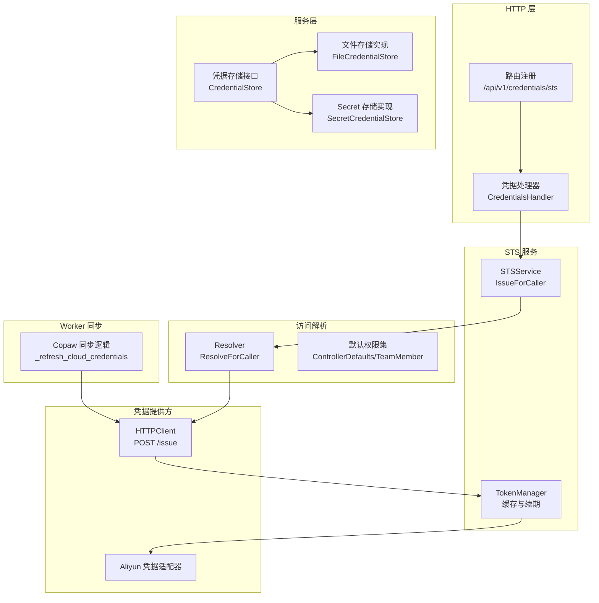
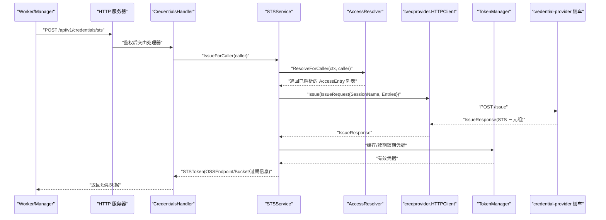
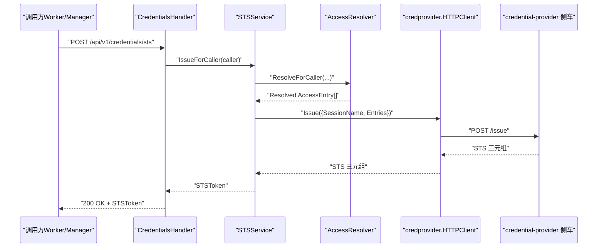
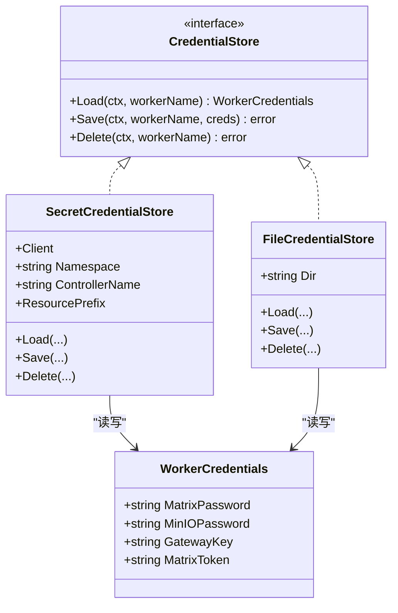
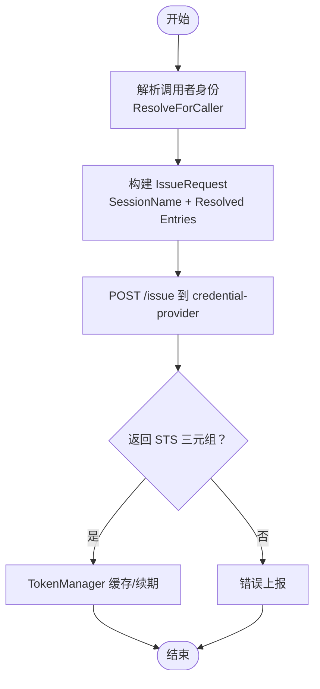
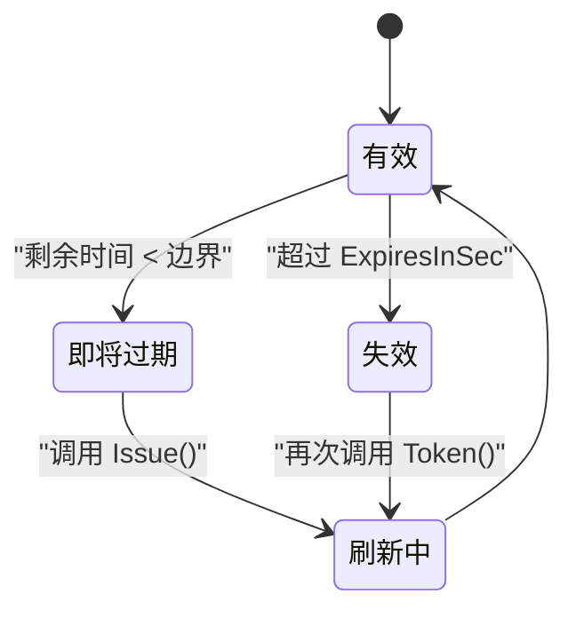
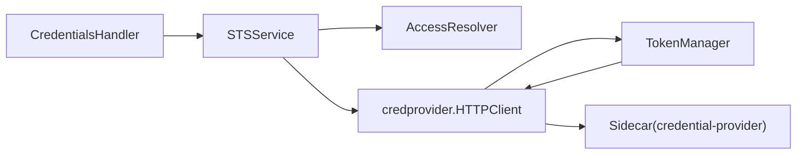

# 凭据管理 API

<cite>
**本文引用的文件**
- [hiclaw-controller/internal/server/http.go](file://hiclaw-controller/internal/server/http.go)
- [hiclaw-controller/internal/server/credentials_handler.go](file://hiclaw-controller/internal/server/credentials_handler.go)
- [hiclaw-controller/internal/service/credentials.go](file://hiclaw-controller/internal/service/credentials.go)
- [hiclaw-controller/internal/credentials/types.go](file://hiclaw-controller/internal/credentials/types.go)
- [hiclaw-controller/internal/credentials/sts.go](file://hiclaw-controller/internal/credentials/sts.go)
- [hiclaw-controller/internal/credprovider/types.go](file://hiclaw-controller/internal/credprovider/types.go)
- [hiclaw-controller/internal/credprovider/client.go](file://hiclaw-controller/internal/credprovider/client.go)
- [hiclaw-controller/internal/credprovider/tokenmanager.go](file://hiclaw-controller/internal/credprovider/tokenmanager.go)
- [hiclaw-controller/internal/credprovider/aliyun_credential.go](file://hiclaw-controller/internal/credprovider/aliyun_credential.go)
- [hiclaw-controller/internal/accessresolver/resolver.go](file://hiclaw-controller/internal/accessresolver/resolver.go)
- [hiclaw-controller/internal/accessresolver/defaults.go](file://hiclaw-controller/internal/accessresolver/defaults.go)
- [hiclaw-controller/internal/oss/client_test.go](file://hiclaw-controller/internal/oss/client_test.go)
- [copaw/src/copaw_worker/sync.py](file://copaw/src/copaw_worker/sync.py)
- [helm/hiclaw/templates/controller/deployment.yaml](file://helm/helm/hiclaw/templates/controller/deployment.yaml)
- [helm/hiclaw/templates/00-validate.yaml](file://helm/helm/hiclaw/templates/00-validate.yaml)
- [docs/zh-cn/manager-guide.md](file://docs/zh-cn/manager-guide.md)
</cite>

## 目录
1. [简介](#简介)
2. [项目结构](#项目结构)
3. [核心组件](#核心组件)
4. [架构总览](#架构总览)
5. [详细组件分析](#详细组件分析)
6. [依赖分析](#依赖分析)
7. [性能考虑](#性能考虑)
8. [故障排查指南](#故障排查指南)
9. [结论](#结论)
10. [附录](#附录)

## 简介
本文件面向凭据管理 API 的使用者与维护者，系统化梳理凭据的存储、检索、发放与管理相关能力，重点覆盖以下方面：
- HTTP 端点规范：凭据短期令牌（STS）发放接口
- 凭据类型与加密存储机制：对象存储凭据、API 网关凭据、矩阵令牌等
- 权限控制与访问审计：基于访问条目（AccessEntry）的最小权限模型
- 凭据轮换策略、过期管理与自动续期
- 与 Worker 的绑定关系与隔离策略
- 安全配置、备份恢复与合规性最佳实践

当前代码库中未发现针对“凭据实体”的通用 CRUD 端点（如创建、更新、删除凭据资源），但提供了面向 Worker/Manager 的短期凭据发放能力（STS），并通过 Kubernetes Secret 或文件系统持久化 Worker 的静态凭据（如矩阵密码、MinIO 密码、网关密钥、矩阵访问令牌）。

## 项目结构
围绕凭据管理的关键模块分布如下：
- HTTP 层：统一 API 路由注册与鉴权中间件
- 服务层：凭据存储抽象（文件系统/Secret）
- STS 服务：凭据发放与令牌缓存
- 凭据提供方：与阿里云 STS 的交互客户端
- 访问解析器：将 CR 中的访问条目解析为最小权限策略
- Worker 同步：Worker 侧拉取/刷新短期凭据

**图表来源**
- [hiclaw-controller/internal/server/http.go:99-112](file://hiclaw-controller/internal/server/http.go#L99-L112)
- [hiclaw-controller/internal/server/credentials_handler.go:12-42](file://hiclaw-controller/internal/server/credentials_handler.go#L12-L42)
- [hiclaw-controller/internal/service/credentials.go:38-102](file://hiclaw-controller/internal/service/credentials.go#L38-L102)
- [hiclaw-controller/internal/credentials/sts.go:29-89](file://hiclaw-controller/internal/credentials/sts.go#L29-L89)
- [hiclaw-controller/internal/credprovider/client.go:15-84](file://hiclaw-controller/internal/credprovider/client.go#L15-L84)
- [hiclaw-controller/internal/credprovider/tokenmanager.go:10-77](file://hiclaw-controller/internal/credprovider/tokenmanager.go#L10-L77)
- [hiclaw-controller/internal/credprovider/aliyun_credential.go:9-90](file://hiclaw-controller/internal/credprovider/aliyun_credential.go#L9-L90)
- [hiclaw-controller/internal/accessresolver/resolver.go:195-233](file://hiclaw-controller/internal/accessresolver/resolver.go#L195-L233)
- [copaw/src/copaw_worker/sync.py:143-164](file://copaw/src/copaw_worker/sync.py#L143-L164)

**章节来源**
- [hiclaw-controller/internal/server/http.go:99-112](file://hiclaw-controller/internal/server/http.go#L99-L112)
- [hiclaw-controller/internal/server/credentials_handler.go:12-42](file://hiclaw-controller/internal/server/credentials_handler.go#L12-L42)
- [hiclaw-controller/internal/service/credentials.go:38-102](file://hiclaw-controller/internal/service/credentials.go#L38-L102)

## 核心组件
- HTTP 路由与处理器
  - 路由：POST /api/v1/credentials/sts
  - 处理器：CredentialsHandler.RefreshSTS
  - 鉴权：RequireAuthz(ActionSTS, "credentials", nil)
- 凭据存储
  - 接口：CredentialStore（Load/Save/Delete）
  - 实现：FileCredentialStore（嵌入式模式）、SecretCredentialStore（集群模式）
- STS 服务
  - STSService：根据调用者身份解析访问条目并请求短期凭据
  - TokenManager：缓存与自动续期短期凭据
- 凭据提供方
  - HTTPClient：向 credential-provider 侧车发起 /issue 请求
  - 类型定义：IssueRequest/IssueResponse、AccessEntry/AccessScope
- 访问解析
  - Resolver：将 CR 中的访问条目解析为 Provider 可理解的最小权限集合
  - 默认权限：ControllerDefaults、DefaultEntriesForTeamMember、DefaultEntriesForManager

**章节来源**
- [hiclaw-controller/internal/server/http.go:99-112](file://hiclaw-controller/internal/server/http.go#L99-L112)
- [hiclaw-controller/internal/server/credentials_handler.go:21-42](file://hiclaw-controller/internal/server/credentials_handler.go#L21-L42)
- [hiclaw-controller/internal/service/credentials.go:38-102](file://hiclaw-controller/internal/service/credentials.go#L38-L102)
- [hiclaw-controller/internal/credentials/sts.go:29-89](file://hiclaw-controller/internal/credentials/sts.go#L29-L89)
- [hiclaw-controller/internal/credprovider/types.go:20-75](file://hiclaw-controller/internal/credprovider/types.go#L20-L75)
- [hiclaw-controller/internal/credprovider/client.go:15-84](file://hiclaw-controller/internal/credprovider/client.go#L15-L84)
- [hiclaw-controller/internal/accessresolver/resolver.go:195-233](file://hiclaw-controller/internal/accessresolver/resolver.go#L195-L233)

## 架构总览
凭据发放的整体流程如下：

**图表来源**
- [hiclaw-controller/internal/server/credentials_handler.go:21-42](file://hiclaw-controller/internal/server/credentials_handler.go#L21-L42)
- [hiclaw-controller/internal/credentials/sts.go:63-89](file://hiclaw-controller/internal/credentials/sts.go#L63-L89)
- [hiclaw-controller/internal/accessresolver/resolver.go:195-233](file://hiclaw-controller/internal/accessresolver/resolver.go#L195-L233)
- [hiclaw-controller/internal/credprovider/client.go:43-84](file://hiclaw-controller/internal/credprovider/client.go#L43-L84)
- [hiclaw-controller/internal/credprovider/tokenmanager.go:52-69](file://hiclaw-controller/internal/credprovider/tokenmanager.go#L52-L69)

## 详细组件分析

### HTTP 端点：短期凭据发放（STS）
- 方法与路径
  - POST /api/v1/credentials/sts
- 鉴权与授权
  - 使用 RequireAuthz(ActionSTS, "credentials", nil) 限制调用主体
- 请求与响应
  - 请求体：无（凭据由调用上下文推导）
  - 响应体：STSToken（包含 AK/SK/Token、过期时间、OSS 端点与桶）
- 错误处理
  - 未配置 STS 服务：503 Service Unavailable
  - 缺少调用者身份：400 Bad Request
  - 发放失败：500 Internal Server Error

**图表来源**
- [hiclaw-controller/internal/server/http.go:99-112](file://hiclaw-controller/internal/server/http.go#L99-L112)
- [hiclaw-controller/internal/server/credentials_handler.go:21-42](file://hiclaw-controller/internal/server/credentials_handler.go#L21-L42)
- [hiclaw-controller/internal/credentials/sts.go:63-89](file://hiclaw-controller/internal/credentials/sts.go#L63-L89)
- [hiclaw-controller/internal/credprovider/client.go:43-84](file://hiclaw-controller/internal/credprovider/client.go#L43-L84)

**章节来源**
- [hiclaw-controller/internal/server/http.go:99-112](file://hiclaw-controller/internal/server/http.go#L99-L112)
- [hiclaw-controller/internal/server/credentials_handler.go:21-42](file://hiclaw-controller/internal/server/credentials_handler.go#L21-L42)
- [hiclaw-controller/internal/credentials/types.go:3-12](file://hiclaw-controller/internal/credentials/types.go#L3-L12)

### 凭据类型与存储机制
- Worker 凭据载体
  - WorkerCredentials：包含矩阵密码、MinIO 密码、网关密钥、矩阵访问令牌
- 存储介质
  - 文件系统（嵌入式模式）：FileCredentialStore（按 workerName 生成 .env 文件）
  - Kubernetes Secret（集群模式）：SecretCredentialStore（按 hiclaw-creds-{workerName} 管理）
- 安全要点
  - 文件权限：凭证文件采用严格权限（例如 0600）
  - Secret 标签：包含应用标签与控制器归属标签，便于多实例隔离与筛选
  - 矩阵令牌：持久化以避免每次重配导致网关重启

**图表来源**
- [hiclaw-controller/internal/service/credentials.go:21-102](file://hiclaw-controller/internal/service/credentials.go#L21-L102)
- [hiclaw-controller/internal/service/credentials.go:144-220](file://hiclaw-controller/internal/service/credentials.go#L144-L220)

**章节来源**
- [hiclaw-controller/internal/service/credentials.go:21-102](file://hiclaw-controller/internal/service/credentials.go#L21-L102)
- [hiclaw-controller/internal/service/credentials.go:144-220](file://hiclaw-controller/internal/service/credentials.go#L144-L220)

### 权限控制与访问审计
- 权限模型
  - AccessEntry：服务类型（对象存储/网关）、权限集合、作用域（桶/前缀或网关ID/资源）
  - AccessScope：对象存储（桶/前缀）、AI 网关（网关ID/资源）
- 解析与默认
  - Resolver.ResolveForCaller：将调用者声明的访问条目解析为 Provider 可理解的最小权限集合
  - ControllerDefaults/DefaultEntriesForTeamMember/DefaultEntriesForManager：内置默认权限集
- 审计与追踪
  - SessionName：用于标识调用方（如 hiclaw-worker-{name}、hiclaw-manager、hiclaw-controller）
  - Secret 标签：包含控制器归属标签，便于审计与隔离

**图表来源**
- [hiclaw-controller/internal/accessresolver/resolver.go:195-233](file://hiclaw-controller/internal/accessresolver/resolver.go#L195-L233)
- [hiclaw-controller/internal/accessresolver/defaults.go:50-100](file://hiclaw-controller/internal/accessresolver/defaults.go#L50-L100)
- [hiclaw-controller/internal/credprovider/types.go:20-75](file://hiclaw-controller/internal/credprovider/types.go#L20-L75)
- [hiclaw-controller/internal/credprovider/client.go:43-84](file://hiclaw-controller/internal/credprovider/client.go#L43-L84)

**章节来源**
- [hiclaw-controller/internal/accessresolver/resolver.go:195-233](file://hiclaw-controller/internal/accessresolver/resolver.go#L195-L233)
- [hiclaw-controller/internal/accessresolver/defaults.go:50-100](file://hiclaw-controller/internal/accessresolver/defaults.go#L50-L100)
- [hiclaw-controller/internal/credprovider/types.go:20-75](file://hiclaw-controller/internal/credprovider/types.go#L20-L75)

### 凭据轮换、过期管理与自动续期
- 短期凭据（STS）
  - TokenManager：在剩余有效期小于刷新边界（默认 10 分钟）时自动刷新
  - Aliyun 凭据适配器：将 TokenManager 暴露为 SDK 可用的 Credential 接口
- Worker 静态凭据
  - FileCredentialStore/SecretCredentialStore：持久化矩阵密码、MinIO 密码、网关密钥、矩阵令牌
  - 矩阵令牌：持久化以减少频繁登录带来的网关重启风险

**图表来源**
- [hiclaw-controller/internal/credprovider/tokenmanager.go:52-69](file://hiclaw-controller/internal/credprovider/tokenmanager.go#L52-L69)
- [hiclaw-controller/internal/credprovider/aliyun_credential.go:9-23](file://hiclaw-controller/internal/credprovider/aliyun_credential.go#L9-L23)

**章节来源**
- [hiclaw-controller/internal/credprovider/tokenmanager.go:10-77](file://hiclaw-controller/internal/credprovider/tokenmanager.go#L10-L77)
- [hiclaw-controller/internal/credprovider/aliyun_credential.go:9-23](file://hiclaw-controller/internal/credprovider/aliyun_credential.go#L9-L23)
- [hiclaw-controller/internal/service/credentials.go:21-36](file://hiclaw-controller/internal/service/credentials.go#L21-L36)

### 与 Worker 的绑定关系与隔离策略
- 绑定关系
  - SessionName：将调用者身份（角色+用户名）映射到 SessionName，确保凭据与 Worker/Manager 绑定
  - Secret 名称：hiclaw-creds-{workerName}，便于按 Worker 精确检索与删除
- 隔离策略
  - 多实例隔离：Secret 标签包含控制器归属标签，不同控制器实例可过滤自身凭据
  - 应用标签对齐：Secret 的“app”标签与 Worker 的应用标签保持一致，便于资源分组

**章节来源**
- [hiclaw-controller/internal/credentials/sts.go:63-89](file://hiclaw-controller/internal/credentials/sts.go#L63-L89)
- [hiclaw-controller/internal/service/credentials.go:144-220](file://hiclaw-controller/internal/service/credentials.go#L144-L220)

### Worker 侧凭据同步与自动续期
- Copaw Worker
  - _refresh_cloud_credentials：在凭据即将过期时触发 STS 刷新，避免频繁调用
  - 设置 MC_HOST 环境变量，使 mc 客户端使用最新凭据

**章节来源**
- [copaw/src/copaw_worker/sync.py:143-164](file://copaw/src/copaw_worker/sync.py#L143-L164)

## 依赖分析
- 组件耦合
  - CredentialsHandler 依赖 STSService
  - STSService 依赖 AccessResolver 与 credprovider.Client
  - TokenManager 依赖 credprovider.Client，提供缓存与续期
  - Worker 侧通过 HTTPClient 与 TokenManager 协作
- Helm 部署
  - 当启用 AI 网关或对象存储时，必须启用 credential-provider 侧车并正确配置镜像与端口
  - 侧车健康检查端点 /healthz 与端口由模板定义

**图表来源**
- [hiclaw-controller/internal/server/credentials_handler.go:12-42](file://hiclaw-controller/internal/server/credentials_handler.go#L12-L42)
- [hiclaw-controller/internal/credentials/sts.go:29-89](file://hiclaw-controller/internal/credentials/sts.go#L29-L89)
- [hiclaw-controller/internal/credprovider/client.go:15-84](file://hiclaw-controller/internal/credprovider/client.go#L15-L84)
- [hiclaw-controller/internal/credprovider/tokenmanager.go:10-77](file://hiclaw-controller/internal/credprovider/tokenmanager.go#L10-L77)
- [helm/hiclaw/templates/controller/deployment.yaml:193-224](file://helm/helm/hiclaw/templates/controller/deployment.yaml#L193-L224)
- [helm/helm/hiclaw/templates/00-validate.yaml:65-74](file://helm/helm/hiclaw/templates/00-validate.yaml#L65-L74)

**章节来源**
- [hiclaw-controller/internal/server/credentials_handler.go:12-42](file://hiclaw-controller/internal/server/credentials_handler.go#L12-L42)
- [hiclaw-controller/internal/credentials/sts.go:29-89](file://hiclaw-controller/internal/credentials/sts.go#L29-L89)
- [hiclaw-controller/internal/credprovider/client.go:15-84](file://hiclaw-controller/internal/credprovider/client.go#L15-L84)
- [helm/helm/hiclaw/templates/controller/deployment.yaml:193-224](file://helm/helm/hiclaw/templates/controller/deployment.yaml#L193-L224)
- [helm/helm/hiclaw/templates/00-validate.yaml:65-74](file://helm/helm/hiclaw/templates/00-validate.yaml#L65-L74)

## 性能考虑
- TokenManager 刷新边界
  - 默认 10 分钟提前刷新，平衡网络开销与过期风险
- Worker 侧懒加载
  - Copaw 同步逻辑仅在即将过期时刷新，避免频繁调用 STS
- Secret 与文件存储
  - Secret 读写为幂等更新，避免不必要的创建/删除
  - 文件存储采用原子写入与严格权限，降低磁盘 IO 与安全风险

[本节为通用建议，不直接分析具体文件]

## 故障排查指南
- STS 端点返回 503
  - 原因：未配置 credential-provider 侧车或未启用
  - 排查：确认 Helm 值中 credentialProvider.enabled=true，且镜像仓库与端口配置正确
- STS 端点返回 400
  - 原因：请求上下文中缺少调用者身份
  - 排查：确认调用方已通过鉴权中间件注入 CallerIdentity
- STS 端点返回 500
  - 原因：AccessResolver 或 credprovider.Client 返回错误
  - 排查：查看 AccessEntry 是否合法、SessionName 是否正确、侧车 /issue 响应是否完整
- 凭据文件/Secret 异常
  - 文件权限：确保 .env 文件权限为 0600
  - Secret 标签缺失：确认控制器归属标签与应用标签已正确设置
- Worker 无法访问对象存储
  - 检查 MC_HOST 环境变量是否被设置
  - 检查 TokenManager 是否成功缓存凭据

**章节来源**
- [hiclaw-controller/internal/server/credentials_handler.go:21-42](file://hiclaw-controller/internal/server/credentials_handler.go#L21-L42)
- [hiclaw-controller/internal/credprovider/client.go:43-84](file://hiclaw-controller/internal/credprovider/client.go#L43-L84)
- [hiclaw-controller/internal/service/credentials.go:180-211](file://hiclaw-controller/internal/service/credentials.go#L180-L211)
- [copaw/src/copaw_worker/sync.py:143-164](file://copaw/src/copaw_worker/sync.py#L143-L164)

## 结论
本凭据管理 API 以“短期凭据（STS）+最小权限（AccessEntry）+自动续期（TokenManager）”为核心设计，既满足 Worker/Manager 的动态凭据需求，又通过 Secret/文件存储保障静态凭据的安全持久化。配合访问解析器与 Helm 部署约束，系统在安全性、可运维性与可扩展性之间取得良好平衡。

[本节为总结性内容，不直接分析具体文件]

## 附录

### API 规范（当前实现）
- POST /api/v1/credentials/sts
  - 鉴权：需要 ActionSTS 权限
  - 请求：无请求体（凭据由调用上下文推导）
  - 成功响应：STSToken（包含 AK/SK/Token、过期时间、OSS 端点与桶）
  - 失败响应：错误码与错误信息
- 注意
  - 当前代码库未提供针对“凭据实体”的通用 CRUD 端点（如创建、更新、删除凭据资源）

**章节来源**
- [hiclaw-controller/internal/server/http.go:99-112](file://hiclaw-controller/internal/server/http.go#L99-L112)
- [hiclaw-controller/internal/server/credentials_handler.go:21-42](file://hiclaw-controller/internal/server/credentials_handler.go#L21-L42)
- [hiclaw-controller/internal/credentials/types.go:3-12](file://hiclaw-controller/internal/credentials/types.go#L3-L12)

### 凭据类型与字段
- WorkerCredentials
  - 字段：MatrixPassword、MinIOPassword、GatewayKey、MatrixToken
- STSToken
  - 字段：AccessKeyID、AccessKeySecret、SecurityToken、Expiration、ExpiresInSec、OSSEndpoint、OSSBucket
- IssueRequest/IssueResponse
  - 字段：SessionName、DurationSeconds、Entries、AccessKeyID、AccessKeySecret、SecurityToken、Expiration、ExpiresInSec

**章节来源**
- [hiclaw-controller/internal/service/credentials.go:21-36](file://hiclaw-controller/internal/service/credentials.go#L21-L36)
- [hiclaw-controller/internal/credentials/types.go:3-12](file://hiclaw-controller/internal/credentials/types.go#L3-L12)
- [hiclaw-controller/internal/credprovider/types.go:20-75](file://hiclaw-controller/internal/credprovider/types.go#L20-L75)

### 安全配置、备份恢复与合规性最佳实践
- 安全配置
  - 仅在需要对象存储或 AI 网关时启用 credential-provider 侧车
  - 为 Secret 设置控制器归属标签与应用标签，实现多实例隔离
  - 文件存储采用严格权限（0600），避免凭据泄露
- 备份恢复
  - 数据卷包含：Tuwunel 数据库、MinIO 存储、Higress 配置
  - 支持 tar 备份与恢复流程
- 合规性
  - 通过最小权限模型与短期凭据降低长期密钥暴露风险
  - 通过访问解析器与默认权限集确保权限收敛

**章节来源**
- [helm/helm/hiclaw/templates/00-validate.yaml:65-74](file://helm/helm/hiclaw/templates/00-validate.yaml#L65-L74)
- [hiclaw-controller/internal/service/credentials.go:180-211](file://hiclaw-controller/internal/service/credentials.go#L180-L211)
- [docs/zh-cn/manager-guide.md:207-238](file://docs/zh-cn/manager-guide.md#L207-L238)