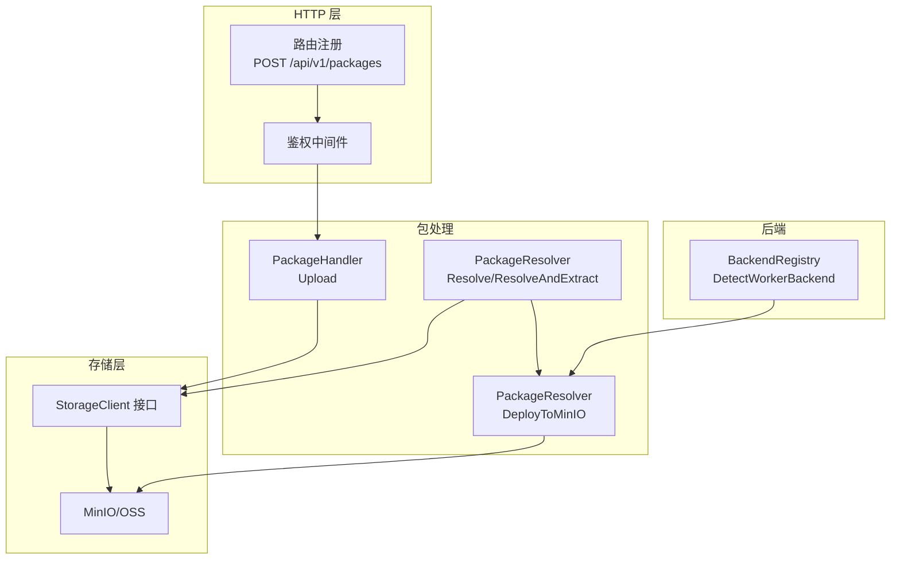
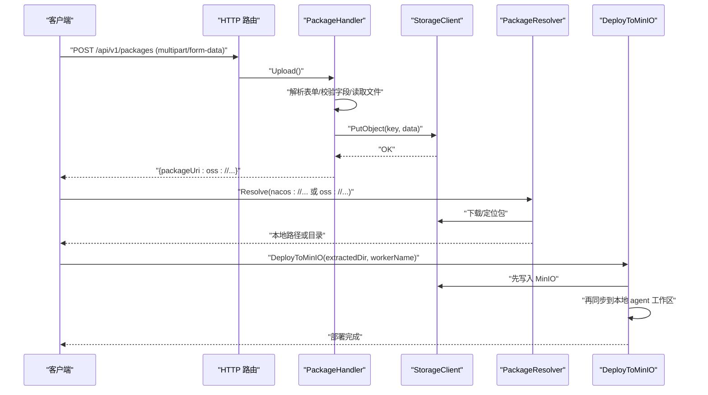
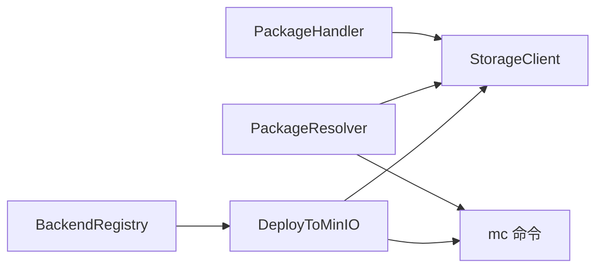

# 包管理 API

<cite>
**本文引用的文件**
- [hiclaw-controller/internal/server/package_handler.go](file://hiclaw-controller/internal/server/package_handler.go)
- [hiclaw-controller/internal/server/http.go](file://hiclaw-controller/internal/server/http.go)
- [hiclaw-controller/internal/executor/package.go](file://hiclaw-controller/internal/executor/package.go)
- [hiclaw-controller/internal/oss/types.go](file://hiclaw-controller/internal/oss/types.go)
- [hiclaw-controller/internal/oss/client.go](file://hiclaw-controller/internal/oss/client.go)
- [hiclaw-controller/internal/server/resource_handler.go](file://hiclaw-controller/internal/server/resource_handler.go)
- [hiclaw-controller/internal/backend/registry.go](file://hiclaw-controller/internal/backend/registry.go)
- [hiclaw-controller/cmd/hiclaw/create.go](file://hiclaw-controller/cmd/hiclaw/create.go)
- [hiclaw-controller/cmd/hiclaw/main_test.go](file://hiclaw-controller/cmd/hiclaw/main_test.go)
- [hiclaw-controller/internal/executor/package_test.go](file://hiclaw-controller/internal/executor/package_test.go)
- [docs/quickstart.md](file://docs/quickstart.md)
- [docs/zh-cn/quickstart.md](file://docs/zh-cn/quickstart.md)
</cite>

## 目录
1. [简介](#简介)
2. [项目结构](#项目结构)
3. [核心组件](#核心组件)
4. [架构总览](#架构总览)
5. [详细组件分析](#详细组件分析)
6. [依赖分析](#依赖分析)
7. [性能考虑](#性能考虑)
8. [故障排查指南](#故障排查指南)
9. [结论](#结论)
10. [附录](#附录)

## 简介
本文件为 HiClaw 包管理 API 的权威技术文档，聚焦 Worker 包的生命周期管理与 API 规范，涵盖包上传、解析与部署、安装与卸载的端到端流程。基于现有代码实现，文档明确以下要点：
- 上传端点：POST /api/v1/packages（multipart/form-data，字段 file 与 name）
- 包解析与部署：支持 file://、http(s)://、nacos://、oss:// 等多种来源，统一解析为本地路径或目录，并按标准包布局进行校验与部署
- 包格式与元数据：标准包布局包含 config、skills、Dockerfile 等目录与文件；必须包含 SOUL.md 或 config/SOUL.md
- 版本与兼容：通过内容寻址（content-addressable）缓存避免重复下载；支持标签/版本选择（nacos://）
- 安全与访问控制：对象存储采用 mc CLI 与可插拔凭证源；支持策略化用户与策略管理（嵌入模式）
- 存储与备份：包以 zip 形式存储于 MinIO/OSS，命名包含内容哈希；部署阶段先写入 MinIO 再同步至本地工作区
- 工作流与最佳实践：结合 CLI 与 Manager Agent 的工作流，提供从开发、测试到发布的建议

## 项目结构
围绕包管理 API 的关键模块与职责如下：
- HTTP 层：注册 /api/v1/packages 上传路由，绑定鉴权中间件
- 包处理器：接收 multipart/form-data，计算哈希，上传至 OSS/MinIO，返回包 URI
- 包解析器：统一解析 file://、http(s)://、nacos://、oss://，支持内容寻址缓存与 ZIP 解压
- 部署器：将包内容部署到 MinIO 与本地 agent 工作区，确保与后台同步一致
- 对象存储接口：抽象 PutObject、Mirror、List/Delete 等操作，支持策略化用户与策略
- 后端注册表：检测可用 Worker 后端（Docker/K8s），为安装/卸载提供基础能力
- CLI 与测试：提供包 URI 展开、Nacos 校验等工具函数与测试用例



图表来源
- [hiclaw-controller/internal/server/http.go:81-83](file://hiclaw-controller/internal/server/http.go#L81-L83)
- [hiclaw-controller/internal/server/package_handler.go:22-70](file://hiclaw-controller/internal/server/package_handler.go#L22-L70)
- [hiclaw-controller/internal/executor/package.go:28-125](file://hiclaw-controller/internal/executor/package.go#L28-L125)
- [hiclaw-controller/internal/oss/client.go:5-33](file://hiclaw-controller/internal/oss/client.go#L5-L33)
- [hiclaw-controller/internal/backend/registry.go:28-57](file://hiclaw-controller/internal/backend/registry.go#L28-L57)

章节来源
- [hiclaw-controller/internal/server/http.go:74-83](file://hiclaw-controller/internal/server/http.go#L74-L83)
- [hiclaw-controller/internal/server/package_handler.go:1-71](file://hiclaw-controller/internal/server/package_handler.go#L1-L71)
- [hiclaw-controller/internal/executor/package.go:1-596](file://hiclaw-controller/internal/executor/package.go#L1-L596)
- [hiclaw-controller/internal/oss/client.go:1-55](file://hiclaw-controller/internal/oss/client.go#L1-L55)
- [hiclaw-controller/internal/backend/registry.go:1-58](file://hiclaw-controller/internal/backend/registry.go#L1-L58)

## 核心组件
- 包处理器（PackageHandler）
  - 负责接收 multipart/form-data，校验必填字段，计算内容哈希，上传至对象存储，返回 oss:// 包 URI
  - 限制上传大小（默认 64MB），错误时返回标准化错误响应
- 包解析器（PackageResolver）
  - 支持 file://、http(s)://、nacos://、oss:// 与相对路径（MinIO）解析
  - 内容寻址缓存：根据 ETag 或文件名中的哈希命中缓存，避免重复下载
  - ZIP 解压与包布局校验：确保包含 SOUL.md 或 config/SOUL.md
- 部署器（DeployToMinIO）
  - 先写入 MinIO，再同步到本地 agent 工作区，避免后台同步覆盖
  - 支持排除 MEMORY.md 等特定文件的更新路径
- 对象存储接口（StorageClient）
  - 抽象 PutObject、Mirror、List/Delete 等操作，支持策略化用户与策略（嵌入模式）
- 后端注册表（BackendRegistry）
  - 自动检测可用 Worker 后端（Docker/K8s），为安装/卸载提供基础能力

章节来源
- [hiclaw-controller/internal/server/package_handler.go:22-70](file://hiclaw-controller/internal/server/package_handler.go#L22-L70)
- [hiclaw-controller/internal/executor/package.go:28-125](file://hiclaw-controller/internal/executor/package.go#L28-L125)
- [hiclaw-controller/internal/executor/package.go:127-256](file://hiclaw-controller/internal/executor/package.go#L127-L256)
- [hiclaw-controller/internal/oss/client.go:5-33](file://hiclaw-controller/internal/oss/client.go#L5-L33)
- [hiclaw-controller/internal/backend/registry.go:28-57](file://hiclaw-controller/internal/backend/registry.go#L28-L57)

## 架构总览
下图展示包上传、解析与部署的端到端流程，以及与对象存储、后端注册表的关系。



图表来源
- [hiclaw-controller/internal/server/http.go:81-83](file://hiclaw-controller/internal/server/http.go#L81-L83)
- [hiclaw-controller/internal/server/package_handler.go:22-70](file://hiclaw-controller/internal/server/package_handler.go#L22-L70)
- [hiclaw-controller/internal/executor/package.go:28-125](file://hiclaw-controller/internal/executor/package.go#L28-L125)
- [hiclaw-controller/internal/executor/package.go:127-256](file://hiclaw-controller/internal/executor/package.go#L127-L256)

## 详细组件分析

### 包上传 API（POST /api/v1/packages）
- 请求方法与路径
  - 方法：POST
  - 路径：/api/v1/packages
  - 鉴权：RequireAuthz(ActionCreate, "worker")
- 请求体
  - Content-Type：multipart/form-data
  - 字段：
    - file：ZIP 包二进制（必填）
    - name：资源名称（用于存储键名，必填）
- 服务器行为
  - 校验 OSS 客户端是否存在
  - 限制最大上传体积（默认 64MB）
  - 读取 file 字段内容，计算前 16 位十六进制哈希
  - 生成存储键名：hiclaw-config/packages/{name}-{hash}.zip
  - 上传至对象存储，返回 JSON：{"packageUri": "oss://{key}"}
- 错误处理
  - OSS 未配置：503
  - 表单解析失败：400
  - 缺少 name 或 file：400
  - 上传失败：500

章节来源
- [hiclaw-controller/internal/server/http.go:81-83](file://hiclaw-controller/internal/server/http.go#L81-L83)
- [hiclaw-controller/internal/server/package_handler.go:22-70](file://hiclaw-controller/internal/server/package_handler.go#L22-L70)

### 包解析与部署（Resolve/ResolveAndExtract/DeployToMinIO）
- 支持的 URI 方案
  - file://：本地文件或导入目录中的文件
  - http(s)://：远程 ZIP 下载，带内容寻址缓存
  - nacos://：从 Nacos 获取 AgentSpec，输出目录形式
  - oss://：从 MinIO/OSS 下载，文件名包含内容哈希，天然缓存
  - 相对 MinIO 路径：通过 mc stat 获取 ETag，构造缓存键
- 内容寻址缓存
  - http(s)：基于文件名缓存
  - oss://：基于文件名中的哈希缓存
  - 相对 MinIO：优先使用 mc stat 的 ETag，失败时回退为 URI 的哈希前缀
- 解析与解压
  - Resolve 返回本地路径（ZIP）或目录（nacos）
  - ResolveAndExtract：对 ZIP 进行解压，校验包布局（SOUL.md 或 config/SOUL.md）
- 部署到 MinIO 与本地
  - DeployToMinIO：先写入 MinIO，再同步到本地 agent 工作区，避免后台同步覆盖
  - 支持排除 MEMORY.md 的更新路径

```mermaid
flowchart TD
Start(["进入 Resolve"]) --> Parse["解析 URI"]
Parse --> Scheme{"方案类型？"}
Scheme --> |file| Local["定位本地文件"]
Scheme --> |http(s)| Http["下载并缓存 ZIP"]
Scheme --> |nacos| Nacos["拉取 AgentSpec 目录"]
Scheme --> |oss| Oss["下载 ZIP 并缓存"]
Scheme --> |相对路径| MinIO["mc stat 获取 ETag/回退哈希"]
Local --> Return["返回本地路径/目录"]
Http --> Return
Nacos --> Return
Oss --> Return
MinIO --> Return
Return --> End(["结束"])
```

图表来源
- [hiclaw-controller/internal/executor/package.go:28-125](file://hiclaw-controller/internal/executor/package.go#L28-L125)
- [hiclaw-controller/internal/executor/package.go:407-435](file://hiclaw-controller/internal/executor/package.go#L407-L435)

章节来源
- [hiclaw-controller/internal/executor/package.go:28-125](file://hiclaw-controller/internal/executor/package.go#L28-L125)
- [hiclaw-controller/internal/executor/package.go:127-256](file://hiclaw-controller/internal/executor/package.go#L127-L256)
- [hiclaw-controller/internal/executor/package.go:407-435](file://hiclaw-controller/internal/executor/package.go#L407-L435)

### 包格式、元数据与依赖
- 标准包布局
  - config/：必需包含 SOUL.md；可选 AGENTS.md、子目录
  - skills/：可选技能目录
  - crons/：可选定时任务 jobs.json
  - Dockerfile：可选
- 校验规则
  - 至少存在 SOUL.md 或 config/SOUL.md
- 内联配置覆盖
  - WriteInlineConfigs：根据 runtime 将 identity/soul/agents 写入本地 agent 目录，优先级高于包内文件
- Nacos URI 校验
  - ValidateNacosURI：预检检查地址、认证与版本/标签有效性

章节来源
- [hiclaw-controller/internal/executor/package.go:280-288](file://hiclaw-controller/internal/executor/package.go#L280-L288)
- [hiclaw-controller/internal/executor/package.go:330-378](file://hiclaw-controller/internal/executor/package.go#L330-L378)
- [hiclaw-controller/internal/executor/package.go:548-595](file://hiclaw-controller/internal/executor/package.go#L548-L595)

### 版本管理、兼容性与冲突解决
- 版本与标签
  - nacos:// URI 支持指定版本或 label: 前缀的标签选择
- 兼容性检查
  - 包布局校验（SOUL.md 存在）
  - Nacos URI 预检（CheckAgentSpecExists）
- 冲突解决
  - 内联配置覆盖包内文件（WriteInlineConfigs）
  - 更新路径排除 MEMORY.md，避免覆盖

章节来源
- [hiclaw-controller/internal/executor/package.go:490-546](file://hiclaw-controller/internal/executor/package.go#L490-L546)
- [hiclaw-controller/internal/executor/package_test.go:493-518](file://hiclaw-controller/internal/executor/package_test.go#L493-L518)

### 安全扫描、签名验证与访问控制
- 访问控制
  - 对象存储采用 mc CLI 与可插拔 CredentialSource，支持策略化用户与策略（嵌入模式）
  - PolicyRequest 支持按 worker、team、manager 粒度授权
- 安全策略
  - SecurityValidator：容器创建策略（允许的镜像仓库、危险能力等），用于安装/运行阶段的安全约束
- 签名与完整性
  - 上传端点未内置签名验证；包完整性通过内容哈希与内容寻址缓存保障

章节来源
- [hiclaw-controller/internal/oss/types.go:16-53](file://hiclaw-controller/internal/oss/types.go#L16-L53)
- [hiclaw-controller/internal/proxy/security.go:46-78](file://hiclaw-controller/internal/proxy/security.go#L46-L78)

### 存储位置、备份与清理
- 存储位置
  - 包以 ZIP 形式存储于 MinIO/OSS，键名包含内容哈希：hiclaw-config/packages/{name}-{hash}.zip
- 备份策略
  - 通过对象存储的备份/快照能力实现（取决于部署环境）
- 清理规则
  - 删除对象：DeleteObject
  - 递归删除前缀：DeletePrefix
  - 清理 MinIO 本地工作区：cp -r 同步后清理

章节来源
- [hiclaw-controller/internal/server/package_handler.go:59-69](file://hiclaw-controller/internal/server/package_handler.go#L59-L69)
- [hiclaw-controller/internal/oss/client.go:21-33](file://hiclaw-controller/internal/oss/client.go#L21-L33)
- [hiclaw-controller/internal/executor/package.go:127-256](file://hiclaw-controller/internal/executor/package.go#L127-L256)

### 包开发、测试与发布工作流
- 开发与测试
  - CLI 展开包 URI：expandPackageURI 支持短路径到 nacos:// 的转换
  - Nacos URI 校验：ValidateNacosURI 用于预检
  - 单元测试：覆盖 Nacos URI 校验失败场景
- 发布与安装
  - 通过 /api/v1/packages 上传 ZIP，获得 oss:// 包 URI
  - 在 Worker/Team/Manager 资源中引用该 URI
  - 安装/卸载由后端注册表与 Worker 后端协作完成

章节来源
- [hiclaw-controller/cmd/hiclaw/create.go:443-472](file://hiclaw-controller/cmd/hiclaw/create.go#L443-L472)
- [hiclaw-controller/cmd/hiclaw/main_test.go:52-105](file://hiclaw-controller/cmd/hiclaw/main_test.go#L52-L105)
- [hiclaw-controller/internal/executor/package_test.go:493-518](file://hiclaw-controller/internal/executor/package_test.go#L493-L518)
- [hiclaw-controller/internal/backend/registry.go:28-57](file://hiclaw-controller/internal/backend/registry.go#L28-L57)

## 依赖分析
- 组件耦合
  - PackageHandler 依赖 StorageClient 接口，降低与具体对象存储实现的耦合
  - PackageResolver 依赖 mc 命令与对象存储接口，统一解析逻辑
  - DeployToMinIO 依赖 mc mirror/cp，确保部署一致性
- 外部依赖
  - mc（MinIO CLI）：用于对象存储操作与缓存命中
  - Nacos AgentSpec 客户端：用于 nacos:// URI 的拉取
- 循环依赖
  - 未发现循环依赖迹象



图表来源
- [hiclaw-controller/internal/server/package_handler.go:14-20](file://hiclaw-controller/internal/server/package_handler.go#L14-L20)
- [hiclaw-controller/internal/executor/package.go:28-125](file://hiclaw-controller/internal/executor/package.go#L28-L125)
- [hiclaw-controller/internal/executor/package.go:127-256](file://hiclaw-controller/internal/executor/package.go#L127-L256)
- [hiclaw-controller/internal/backend/registry.go:28-57](file://hiclaw-controller/internal/backend/registry.go#L28-L57)

章节来源
- [hiclaw-controller/internal/server/package_handler.go:1-71](file://hiclaw-controller/internal/server/package_handler.go#L1-L71)
- [hiclaw-controller/internal/executor/package.go:1-596](file://hiclaw-controller/internal/executor/package.go#L1-L596)
- [hiclaw-controller/internal/backend/registry.go:1-58](file://hiclaw-controller/internal/backend/registry.go#L1-L58)

## 性能考虑
- 内容寻址缓存
  - http(s)、oss://、相对 MinIO 路径均采用内容哈希作为缓存键，避免重复下载
- 并发与重试
  - 解析阶段使用 mc 命令，注意并发下载的资源竞争
- 部署一致性
  - DeployToMinIO 先写入 MinIO 再同步本地，避免后台同步覆盖导致的竞态

## 故障排查指南
- 上传失败
  - OSS 未配置：检查对象存储客户端初始化
  - 表单解析失败：确认 Content-Type 为 multipart/form-data
  - 缺少 name 或 file：补齐必填字段
- 下载与解析失败
  - http(s)：检查网络连通性与状态码
  - nacos://：使用 ValidateNacosURI 预检，确认地址、认证与版本/标签
  - oss://：确认对象存在且文件名包含正确哈希
- 部署失败
  - mc 命令失败：检查 mc 配置与权限
  - 包布局校验失败：确保包含 SOUL.md 或 config/SOUL.md
- 权限问题
  - 对象存储策略：确认 PolicyRequest 配置正确
  - 容器安全策略：检查 SecurityValidator 的允许列表与危险能力

章节来源
- [hiclaw-controller/internal/server/package_handler.go:28-70](file://hiclaw-controller/internal/server/package_handler.go#L28-L70)
- [hiclaw-controller/internal/executor/package.go:450-488](file://hiclaw-controller/internal/executor/package.go#L450-L488)
- [hiclaw-controller/internal/executor/package.go:490-546](file://hiclaw-controller/internal/executor/package.go#L490-L546)
- [hiclaw-controller/internal/executor/package.go:280-288](file://hiclaw-controller/internal/executor/package.go#L280-L288)
- [hiclaw-controller/internal/executor/package_test.go:493-518](file://hiclaw-controller/internal/executor/package_test.go#L493-L518)
- [hiclaw-controller/internal/oss/types.go:46-53](file://hiclaw-controller/internal/oss/types.go#L46-L53)
- [hiclaw-controller/internal/proxy/security.go:46-78](file://hiclaw-controller/internal/proxy/security.go#L46-L78)

## 结论
HiClaw 的包管理 API 以内容寻址为核心，结合统一的包解析与部署流程，实现了从上传、解析到安装/卸载的闭环。通过对象存储抽象与策略化访问控制，系统在安全性与可扩展性方面具备良好基础。建议在生产环境中配合对象存储的备份策略与权限治理，持续完善包的签名与完整性校验机制。

## 附录
- 相关文档与示例
  - 快速入门与安装说明：[docs/quickstart.md:1-356](file://docs/quickstart.md#L1-L356)、[docs/zh-cn/quickstart.md:1-338](file://docs/zh-cn/quickstart.md#L1-L338)