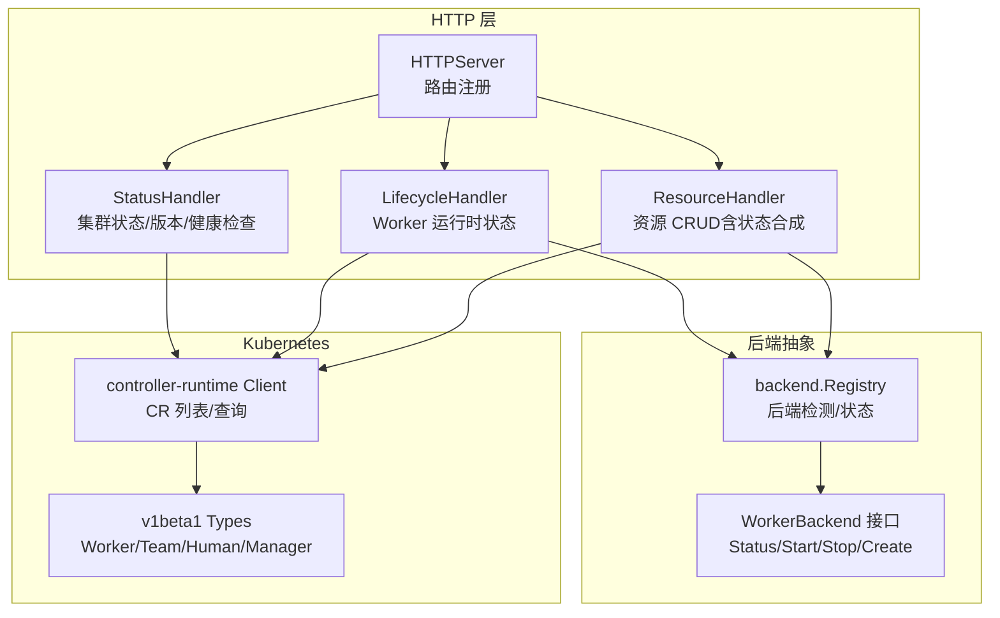
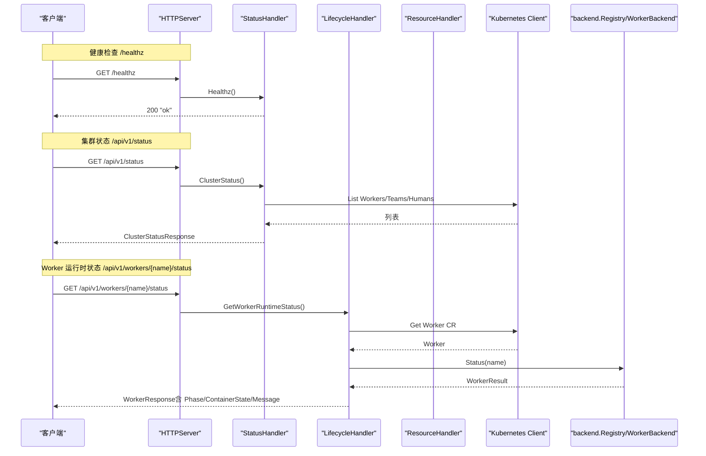
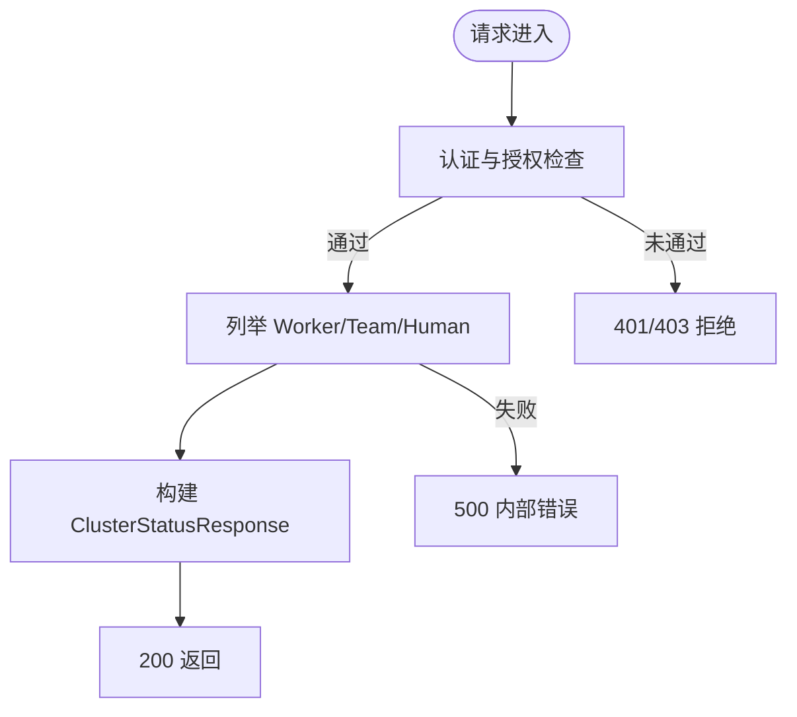
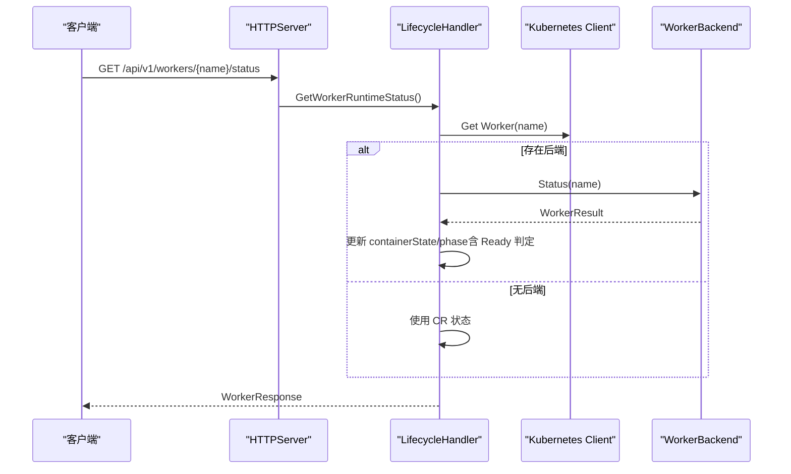
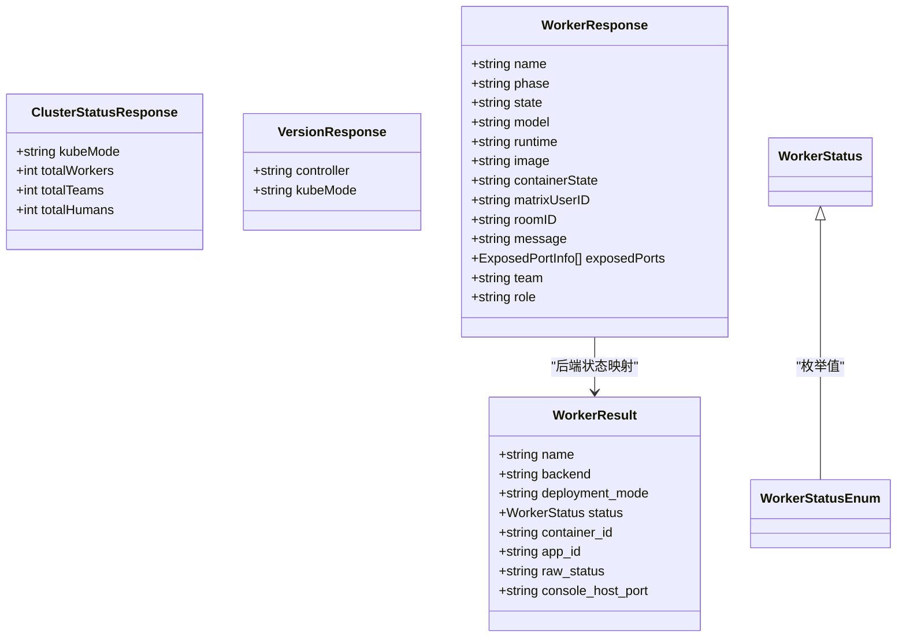
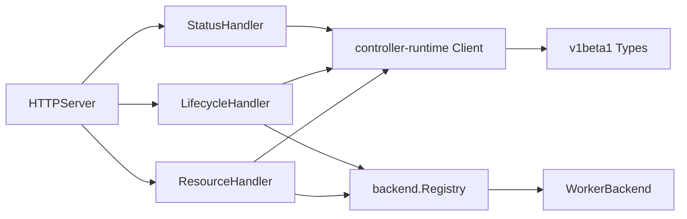

# 状态查询 API

<cite>
**本文引用的文件**
- [hiclaw-controller/internal/server/http.go](file://hiclaw-controller/internal/server/http.go)
- [hiclaw-controller/internal/server/status_handler.go](file://hiclaw-controller/internal/server/status_handler.go)
- [hiclaw-controller/internal/server/lifecycle_handler.go](file://hiclaw-controller/internal/server/lifecycle_handler.go)
- [hiclaw-controller/internal/server/resource_handler.go](file://hiclaw-controller/internal/server/resource_handler.go)
- [hiclaw-controller/internal/server/types.go](file://hiclaw-controller/internal/server/types.go)
- [hiclaw-controller/internal/backend/interface.go](file://hiclaw-controller/internal/backend/interface.go)
- [hiclaw-controller/api/v1beta1/types.go](file://hiclaw-controller/api/v1beta1/types.go)
- [hiclaw-controller/cmd/hiclaw/status_cmd.go](file://hiclaw-controller/cmd/hiclaw/status_cmd.go)
- [hiclaw-controller/internal/apiserver/embedded.go](file://hiclaw-controller/internal/apiserver/embedded.go)
</cite>

## 目录
1. [简介](#简介)
2. [项目结构](#项目结构)
3. [核心组件](#核心组件)
4. [架构总览](#架构总览)
5. [详细组件分析](#详细组件分析)
6. [依赖分析](#依赖分析)
7. [性能考虑](#性能考虑)
8. [故障排查指南](#故障排查指南)
9. [结论](#结论)
10. [附录](#附录)

## 简介
本文件为 HiClaw 系统的状态查询 API 提供完整的规范与实现解析，覆盖以下端点与能力：
- 健康检查：GET /healthz
- 集群状态：GET /api/v1/status
- 版本信息：GET /api/v1/version
- 单个 Worker 运行时状态：GET /api/v1/workers/{name}/status

文档同时说明状态数据结构、过滤与排序选项、缓存策略、更新频率与过期机制、性能优化建议以及状态监控与告警集成最佳实践。

## 项目结构
状态查询相关代码主要位于控制器服务层，通过统一的 HTTP 路由注册，结合 Kubernetes 客户端与后端抽象，聚合 CR 与后端状态，返回标准化的响应。

图表来源
- [hiclaw-controller/internal/server/http.go:36-59](file://hiclaw-controller/internal/server/http.go#L36-L59)
- [hiclaw-controller/internal/server/status_handler.go:12-74](file://hiclaw-controller/internal/server/status_handler.go#L12-L74)
- [hiclaw-controller/internal/server/lifecycle_handler.go:15-32](file://hiclaw-controller/internal/server/lifecycle_handler.go#L15-L32)
- [hiclaw-controller/internal/server/resource_handler.go:32-57](file://hiclaw-controller/internal/server/resource_handler.go#L32-L57)
- [hiclaw-controller/internal/backend/interface.go:179-210](file://hiclaw-controller/internal/backend/interface.go#L179-L210)
- [hiclaw-controller/api/v1beta1/types.go:63-146](file://hiclaw-controller/api/v1beta1/types.go#L63-L146)

章节来源
- [hiclaw-controller/internal/server/http.go:36-59](file://hiclaw-controller/internal/server/http.go#L36-L59)

## 核心组件
- HTTPServer：统一注册路由，区分公开健康检查与受认证保护的状态接口。
- StatusHandler：提供 /healthz、/api/v1/status、/api/v1/version。
- LifecycleHandler：提供 /api/v1/workers/{name}/status，聚合 CR 与后端状态。
- ResourceHandler：负责资源 CRUD，并在团队成员场景下合成 Worker 状态。
- backend.Registry/WorkerBackend：抽象不同后端（如 Docker/K8s），提供统一状态查询能力。
- v1beta1 类型：定义 Worker/Team/Human/Manager 的状态字段，作为状态响应的基础。

章节来源
- [hiclaw-controller/internal/server/status_handler.go:12-74](file://hiclaw-controller/internal/server/status_handler.go#L12-L74)
- [hiclaw-controller/internal/server/lifecycle_handler.go:15-32](file://hiclaw-controller/internal/server/lifecycle_handler.go#L15-L32)
- [hiclaw-controller/internal/server/resource_handler.go:32-57](file://hiclaw-controller/internal/server/resource_handler.go#L32-L57)
- [hiclaw-controller/internal/backend/interface.go:179-210](file://hiclaw-controller/internal/backend/interface.go#L179-L210)
- [hiclaw-controller/api/v1beta1/types.go:63-146](file://hiclaw-controller/api/v1beta1/types.go#L63-L146)

## 架构总览
状态查询的整体流程如下：
- 客户端请求对应端点
- HTTPServer 将请求分发到相应 Handler
- Handler 从 Kubernetes 客户端读取 CR 数据，必要时调用后端 Registry 查询实际容器/实例状态
- 合成统一的响应结构并返回

图表来源
- [hiclaw-controller/internal/server/http.go:42-48](file://hiclaw-controller/internal/server/http.go#L42-L48)
- [hiclaw-controller/internal/server/status_handler.go:23-62](file://hiclaw-controller/internal/server/status_handler.go#L23-L62)
- [hiclaw-controller/internal/server/lifecycle_handler.go:176-205](file://hiclaw-controller/internal/server/lifecycle_handler.go#L176-L205)

## 详细组件分析

### 健康检查：GET /healthz
- 功能：返回服务可用性标识，无需认证。
- 实现要点：
  - 直接写入 200 状态码与固定文本。
- 典型用途：容器探针、网关路由健康检查。

章节来源
- [hiclaw-controller/internal/server/http.go:42-46](file://hiclaw-controller/internal/server/http.go#L42-L46)
- [hiclaw-controller/internal/server/status_handler.go:23-26](file://hiclaw-controller/internal/server/status_handler.go#L23-L26)
- [hiclaw-controller/internal/apiserver/embedded.go:173](file://hiclaw-controller/internal/apiserver/embedded.go#L173)

### 集群状态：GET /api/v1/status
- 功能：返回当前命名空间内 Worker/Team/Human 的总数，以及运行模式。
- 请求与权限：
  - 方法：GET
  - 路径：/api/v1/status
  - 认证：需要认证；授权：任意角色可访问
- 响应结构：ClusterStatusResponse
  - 字段：kubeMode（运行模式）、totalWorkers、totalTeams、totalHumans
- 数据来源：
  - 通过 Kubernetes 客户端列出 WorkerList/TeamList/HumanList 并统计数量。
- 错误处理：
  - 列表失败时返回 500 与错误消息。

图表来源
- [hiclaw-controller/internal/server/http.go:46-48](file://hiclaw-controller/internal/server/http.go#L46-L48)
- [hiclaw-controller/internal/server/status_handler.go:35-62](file://hiclaw-controller/internal/server/status_handler.go#L35-L62)

章节来源
- [hiclaw-controller/internal/server/http.go:46-48](file://hiclaw-controller/internal/server/http.go#L46-L48)
- [hiclaw-controller/internal/server/status_handler.go:28-62](file://hiclaw-controller/internal/server/status_handler.go#L28-L62)

### 版本信息：GET /api/v1/version
- 功能：返回控制器版本与运行模式。
- 请求与权限：
  - 方法：GET
  - 路径：/api/v1/version
  - 认证：可匿名访问（仅认证，不强制授权）
- 响应结构：VersionResponse
  - 字段：controller（版本号）、kubeMode（运行模式）

章节来源
- [hiclaw-controller/internal/server/http.go:47-48](file://hiclaw-controller/internal/server/http.go#L47-L48)
- [hiclaw-controller/internal/server/status_handler.go:64-74](file://hiclaw-controller/internal/server/status_handler.go#L64-L74)

### Worker 运行时状态：GET /api/v1/workers/{name}/status
- 功能：返回指定 Worker 的运行时状态，聚合 CR 状态与后端状态。
- 请求与权限：
  - 方法：GET
  - 路径：/api/v1/workers/{name}/status
  - 认证：需要认证；授权：需具备 worker.status 权限
- 响应结构：WorkerResponse
  - 关键字段：name、phase、state、model、runtime、image、containerState、matrixUserID、roomID、message、exposedPorts、team、role
  - 备注：当后端返回“运行中且已就绪”时，phase 可能被提升为 Ready
- 数据来源与合成：
  - 从 Kubernetes 获取 Worker CR
  - 若存在后端，调用后端 Status(name) 获取容器状态
  - 后端状态映射到 phase（running/ready→Running；starting→Pending；stopped→Stopped）
  - 若后端状态为 running 且 Handler 内部标记为 ready，则最终 phase=Ready
- 错误处理：
  - Worker 不存在：404
  - 后端查询失败：500
  - 后端资源不存在：404

图表来源
- [hiclaw-controller/internal/server/http.go:90](file://hiclaw-controller/internal/server/http.go#L90)
- [hiclaw-controller/internal/server/lifecycle_handler.go:176-205](file://hiclaw-controller/internal/server/lifecycle_handler.go#L176-L205)
- [hiclaw-controller/internal/backend/interface.go:167-177](file://hiclaw-controller/internal/backend/interface.go#L167-L177)

章节来源
- [hiclaw-controller/internal/server/http.go:90](file://hiclaw-controller/internal/server/http.go#L90)
- [hiclaw-controller/internal/server/lifecycle_handler.go:176-205](file://hiclaw-controller/internal/server/lifecycle_handler.go#L176-L205)
- [hiclaw-controller/internal/backend/interface.go:16-26](file://hiclaw-controller/internal/backend/interface.go#L16-L26)

### 团队成员状态合成（用于 /api/v1/workers/{name}/status）
- 当 Worker 不是独立 CR（而是团队成员）时，ResourceHandler 会合成 WorkerResponse：
  - 从 Team.Status 中提取成员房间、矩阵用户 ID、暴露端口等
  - 通过后端 Status(name) 获取容器状态并映射 phase
  - 若团队领导已就绪，phase 设为 Running
- 该逻辑同样影响 /api/v1/workers/{name}/status 的响应一致性。

章节来源
- [hiclaw-controller/internal/server/resource_handler.go:946-1013](file://hiclaw-controller/internal/server/resource_handler.go#L946-L1013)

### 状态数据结构定义
- ClusterStatusResponse：集群级概览
  - kubeMode、totalWorkers、totalTeams、totalHumans
- VersionResponse：版本信息
  - controller、kubeMode
- WorkerResponse：Worker 运行时状态
  - name、phase、state、model、runtime、image、containerState、matrixUserID、roomID、message、exposedPorts、team、role
- WorkerResult：后端返回的统一结果
  - name、backend、deployment_mode、status、container_id、app_id、raw_status、console_host_port

章节来源
- [hiclaw-controller/internal/server/status_handler.go:28-33](file://hiclaw-controller/internal/server/status_handler.go#L28-L33)
- [hiclaw-controller/internal/server/status_handler.go:64-67](file://hiclaw-controller/internal/server/status_handler.go#L64-L67)
- [hiclaw-controller/internal/server/types.go:43-67](file://hiclaw-controller/internal/server/types.go#L43-L67)
- [hiclaw-controller/internal/backend/interface.go:167-177](file://hiclaw-controller/internal/backend/interface.go#L167-L177)

### 状态数据结构类图

图表来源
- [hiclaw-controller/internal/server/status_handler.go:28-33](file://hiclaw-controller/internal/server/status_handler.go#L28-L33)
- [hiclaw-controller/internal/server/status_handler.go:64-67](file://hiclaw-controller/internal/server/status_handler.go#L64-L67)
- [hiclaw-controller/internal/server/types.go:43-67](file://hiclaw-controller/internal/server/types.go#L43-L67)
- [hiclaw-controller/internal/backend/interface.go:16-26](file://hiclaw-controller/internal/backend/interface.go#L16-L26)
- [hiclaw-controller/internal/backend/interface.go:167-177](file://hiclaw-controller/internal/backend/interface.go#L167-L177)

## 依赖分析
- 路由注册与中间件：
  - /healthz 与 /api/v1/status 由 HTTPServer 注册，前者无需认证，后者需认证。
  - /api/v1/workers/{name}/status 需要认证与授权（worker.status）。
- 数据依赖：
  - StatusHandler 依赖 Kubernetes 客户端进行 CR 列表。
  - LifecycleHandler/ResourceHandler 依赖 backend.Registry 进行后端状态查询。
- 类型依赖：
  - v1beta1.Worker/Team/Human/Manager 的 Status 字段为状态响应提供基础。

图表来源
- [hiclaw-controller/internal/server/http.go:36-59](file://hiclaw-controller/internal/server/http.go#L36-L59)
- [hiclaw-controller/internal/server/lifecycle_handler.go:15-32](file://hiclaw-controller/internal/server/lifecycle_handler.go#L15-L32)
- [hiclaw-controller/internal/server/resource_handler.go:32-57](file://hiclaw-controller/internal/server/resource_handler.go#L32-L57)
- [hiclaw-controller/api/v1beta1/types.go:63-146](file://hiclaw-controller/api/v1beta1/types.go#L63-L146)

章节来源
- [hiclaw-controller/internal/server/http.go:36-59](file://hiclaw-controller/internal/server/http.go#L36-L59)

## 性能考虑
- 查询路径与复杂度
  - /healthz：纯内存返回，延迟极低。
  - /api/v1/status：对 Worker/Team/Human 分别执行一次列表操作，总体 O(W+T+H)，适合小规模命名空间。
  - /api/v1/workers/{name}/status：单条 Worker 查询 + 后端状态查询，后端查询取决于具体实现（Docker/K8s）。
- 缓存策略
  - 当前实现未见显式缓存层；LifecycleHandler 内部维护一个轻量 ready 映射，用于快速判定 Ready 状态，避免重复后端查询。
- 更新频率与过期
  - 未发现内置定时刷新或过期机制；状态为即时查询结果。
- 优化建议
  - 对 /api/v1/status：若命名空间较大，建议客户端侧分页或增量查询（例如按标签过滤）。
  - 对 /api/v1/workers/{name}/status：若频繁查询，可在客户端侧缓存短周期结果（如 1–3 秒），并在后端状态变化时使用事件驱动刷新。
  - 对后端状态查询：在 Docker/K8s 后端实现中尽量复用连接与会话，减少握手开销。
  - 对列表查询：优先使用带命名空间的过滤，避免全集群扫描。

[本节为通用性能讨论，不直接分析具体文件]

## 故障排查指南
- 常见错误与定位
  - /api/v1/status 返回 500：检查 Kubernetes 客户端权限与 CRD 可用性。
  - /api/v1/workers/{name}/status 返回 404：Worker 不存在或为团队成员但未创建独立 CR。
  - /api/v1/workers/{name}/status 返回 500：后端不可用或查询失败，检查后端配置与网络连通性。
- 日志与可观测性
  - 后端错误映射：后端 NotFound/Conflict 会被转换为 404/409，其他错误为 500。
  - Ready 标记：LifecycleHandler 内部 ready 映射仅在进程内存中，重启后清空。
- 健康检查
  - /healthz 应始终返回 200，否则需检查控制器进程与监听端口。

章节来源
- [hiclaw-controller/internal/server/lifecycle_handler.go:225-234](file://hiclaw-controller/internal/server/lifecycle_handler.go#L225-L234)
- [hiclaw-controller/internal/server/status_handler.go:39-54](file://hiclaw-controller/internal/server/status_handler.go#L39-L54)

## 结论
HiClaw 的状态查询 API 以清晰的端点划分与统一的数据结构实现了对集群与 Worker 运行时状态的可观测性。当前实现强调即时性与一致性，未内置缓存与过期机制，适合中小规模部署。对于大规模与高并发场景，建议在客户端侧引入短期缓存与事件驱动刷新，并优化后端查询路径。

[本节为总结性内容，不直接分析具体文件]

## 附录

### API 规范汇总
- GET /healthz
  - 认证：否
  - 成功响应：200，正文为固定文本
- GET /api/v1/status
  - 认证：是；授权：任意角色
  - 成功响应：200，ClusterStatusResponse
  - 失败响应：500（内部错误）
- GET /api/v1/version
  - 认证：是；授权：可匿名
  - 成功响应：200，VersionResponse
- GET /api/v1/workers/{name}/status
  - 认证：是；授权：worker.status
  - 成功响应：200，WorkerResponse
  - 失败响应：404（不存在），500（后端错误）

章节来源
- [hiclaw-controller/internal/server/http.go:42-48](file://hiclaw-controller/internal/server/http.go#L42-L48)
- [hiclaw-controller/internal/server/http.go:90](file://hiclaw-controller/internal/server/http.go#L90)
- [hiclaw-controller/internal/server/status_handler.go:23-74](file://hiclaw-controller/internal/server/status_handler.go#L23-L74)
- [hiclaw-controller/internal/server/lifecycle_handler.go:176-205](file://hiclaw-controller/internal/server/lifecycle_handler.go#L176-L205)

### 状态数据结构字段说明
- ClusterStatusResponse
  - kubeMode：运行模式（如本地/云）
  - totalWorkers/totalTeams/totalHumans：各资源计数
- VersionResponse
  - controller：控制器版本
  - kubeMode：运行模式
- WorkerResponse
  - name：名称
  - phase：阶段（Pending/Running/Sleeping/Stopped/Ready）
  - state：期望生命周期状态（Running/Sleeping/Stopped）
  - model/runtime/image：模型/运行时/镜像
  - containerState：后端容器状态（running/ready/stopped/starting/not_found/unknown）
  - matrixUserID/roomID/message：通信与消息
  - exposedPorts：暴露端口列表
  - team/role：团队与角色（团队成员合成时有效）

章节来源
- [hiclaw-controller/internal/server/status_handler.go:28-33](file://hiclaw-controller/internal/server/status_handler.go#L28-L33)
- [hiclaw-controller/internal/server/status_handler.go:64-67](file://hiclaw-controller/internal/server/status_handler.go#L64-L67)
- [hiclaw-controller/internal/server/types.go:43-67](file://hiclaw-controller/internal/server/types.go#L43-L67)
- [hiclaw-controller/api/v1beta1/types.go:130-146](file://hiclaw-controller/api/v1beta1/types.go#L130-L146)

### 过滤与排序选项
- 当前实现未提供查询参数级别的过滤与排序（如按状态类型、时间范围、资源标签）。如需扩展，建议：
  - 在 /api/v1/status 中增加标签过滤参数，限制 CR 列表范围
  - 在 /api/v1/workers/{name}/status 中支持后端状态缓存与条件刷新
- CLI 示例参考：hiclaw status 与 hiclaw worker status 命令展示了如何消费这些端点。

章节来源
- [hiclaw-controller/cmd/hiclaw/status_cmd.go:17-31](file://hiclaw-controller/cmd/hiclaw/status_cmd.go#L17-L31)
- [hiclaw-controller/cmd/hiclaw/worker_cmd.go:147-162](file://hiclaw-controller/cmd/hiclaw/worker_cmd.go#L147-L162)

### 缓存策略、更新频率与过期机制
- 现状：未发现内置缓存与过期控制；Ready 标记为进程内内存缓存。
- 建议：
  - 客户端缓存短期结果（1–3 秒），配合后端状态变更事件触发刷新
  - 对 /api/v1/status 增加标签过滤参数，降低列表成本
  - 对 /api/v1/workers/{name}/status 支持条件查询（如 If-None-Match）

[本节为通用建议，不直接分析具体文件]

### 性能优化与大规模查询建议
- 减少后端查询次数：合并多 Worker 查询为批量后端状态查询（若后端支持）
- 使用命名空间过滤：避免跨命名空间扫描
- 客户端侧分页与增量刷新：对 /api/v1/status 采用分页与增量策略
- 事件驱动刷新：基于 Kubernetes 事件或后端回调减少轮询

[本节为通用建议，不直接分析具体文件]

### 状态监控与告警集成最佳实践
- 健康检查：定期探测 /healthz，异常时触发告警
- 状态聚合：将 /api/v1/status 的计数与比例纳入仪表盘
- Worker 就绪率：通过 /api/v1/workers/{name}/status 的 phase/ready 统计就绪率
- 后端异常：关注 500/404 错误趋势，定位后端可用性问题

[本节为通用建议，不直接分析具体文件]