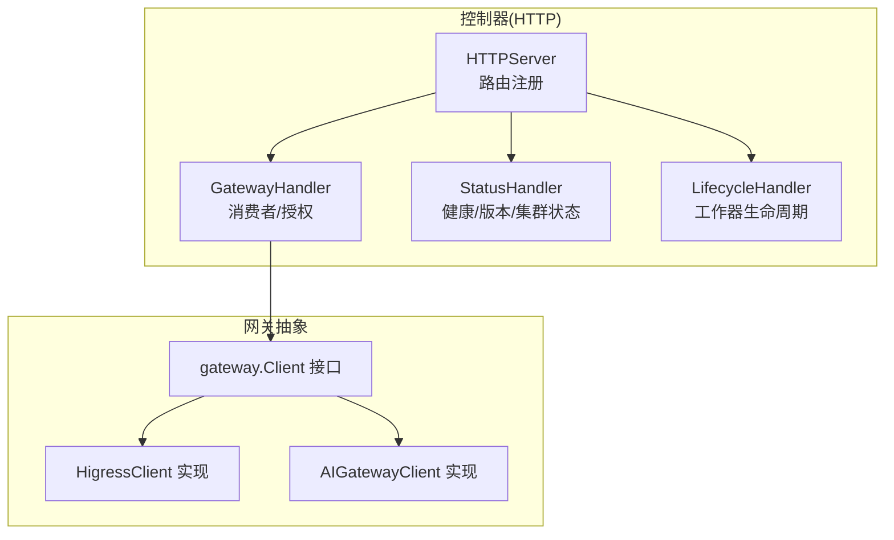
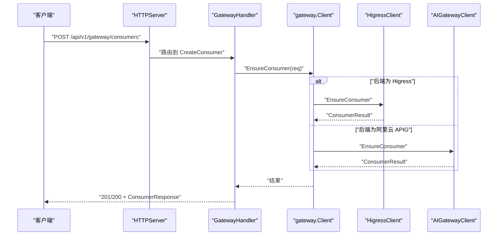
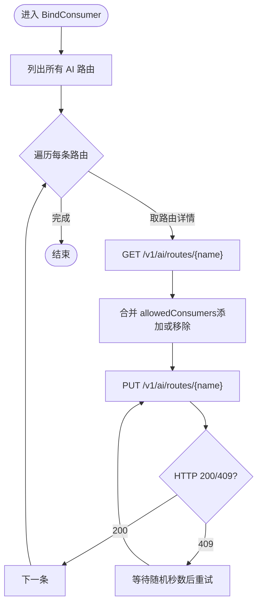
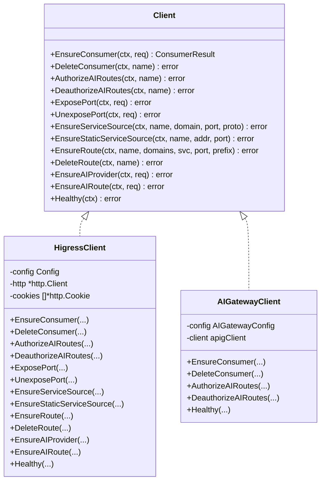
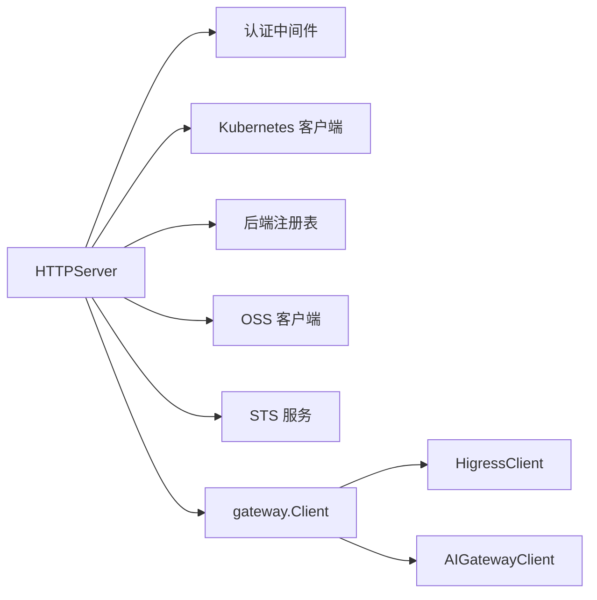

# 网关管理 API

<cite>
**本文引用的文件**
- [hiclaw-controller/internal/server/http.go](file://hiclaw-controller/internal/server/http.go)
- [hiclaw-controller/internal/server/gateway_handler.go](file://hiclaw-controller/internal/server/gateway_handler.go)
- [hiclaw-controller/internal/gateway/client.go](file://hiclaw-controller/internal/gateway/client.go)
- [hiclaw-controller/internal/gateway/higress.go](file://hiclaw-controller/internal/gateway/higress.go)
- [hiclaw-controller/internal/gateway/aigateway.go](file://hiclaw-controller/internal/gateway/aigateway.go)
- [hiclaw-controller/internal/gateway/types.go](file://hiclaw-controller/internal/gateway/types.go)
- [hiclaw-controller/internal/server/types.go](file://hiclaw-controller/internal/server/types.go)
- [hiclaw-controller/internal/server/status_handler.go](file://hiclaw-controller/internal/server/status_handler.go)
- [hiclaw-controller/internal/server/lifecycle_handler.go](file://hiclaw-controller/internal/server/lifecycle_handler.go)
- [hiclaw-controller/internal/httputil/response.go](file://hiclaw-controller/internal/httputil/response.go)
- [manager/scripts/lib/gateway-api.sh](file://manager/scripts/lib/gateway-api.sh)
- [manager/agent/skills/mcp-server-management/scripts/setup-mcp-proxy.sh](file://manager/agent/skills/mcp-server-management/scripts/setup-mcp-proxy.sh)
</cite>

## 目录
1. [简介](#简介)
2. [项目结构](#项目结构)
3. [核心组件](#核心组件)
4. [架构总览](#架构总览)
5. [详细组件分析](#详细组件分析)
6. [依赖分析](#依赖分析)
7. [性能考虑](#性能考虑)
8. [故障排查指南](#故障排查指南)
9. [结论](#结论)
10. [附录：端点规范与参数](#附录端点规范与参数)

## 简介
本文件为 HiClaw 项目中“网关管理 API”的权威文档，覆盖以下内容：
- 网关消费者与路由授权的统一 API 规范
- 自托管 Higress 网关与阿里云 API Gateway 的双后端支持
- 与 MCP 服务器的集成配置与授权流程
- 安全策略、访问控制与限流建议
- 性能与可用性优化、运维最佳实践与故障排查

注意：当前仓库中未发现“配置网关”“获取网关状态”“更新网关设置”“重启网关”“网关路由管理”的具体端点实现。本文将基于现有代码对可实现的能力进行规范，并明确缺失能力以便后续扩展。

## 项目结构
与网关管理相关的核心模块分布如下：
- 控制器 HTTP 服务与路由注册：hiclaw-controller/internal/server/http.go
- 网关 API 处理器：hiclaw-controller/internal/server/gateway_handler.go
- 网关客户端接口与实现：hiclaw-controller/internal/gateway/client.go、higress.go、aigateway.go
- 网关类型定义：hiclaw-controller/internal/gateway/types.go
- 公共响应工具：hiclaw-controller/internal/httputil/response.go
- 管理器侧网关脚本与 MCP 配置：manager/scripts/lib/gateway-api.sh、manager/agent/skills/mcp-server-management/scripts/setup-mcp-proxy.sh

图表来源
- [hiclaw-controller/internal/server/http.go:36-112](file://hiclaw-controller/internal/server/http.go#L36-L112)
- [hiclaw-controller/internal/server/gateway_handler.go:12-95](file://hiclaw-controller/internal/server/gateway_handler.go#L12-L95)
- [hiclaw-controller/internal/gateway/client.go:5-51](file://hiclaw-controller/internal/gateway/client.go#L5-L51)
- [hiclaw-controller/internal/gateway/higress.go:17-32](file://hiclaw-controller/internal/gateway/higress.go#L17-L32)
- [hiclaw-controller/internal/gateway/aigateway.go:46-84](file://hiclaw-controller/internal/gateway/aigateway.go#L46-L84)

章节来源
- [hiclaw-controller/internal/server/http.go:36-112](file://hiclaw-controller/internal/server/http.go#L36-L112)
- [hiclaw-controller/internal/server/gateway_handler.go:12-95](file://hiclaw-controller/internal/server/gateway_handler.go#L12-L95)
- [hiclaw-controller/internal/gateway/client.go:5-51](file://hiclaw-controller/internal/gateway/client.go#L5-L51)

## 核心组件
- HTTPServer：统一注册控制器 REST API，含健康检查、状态查询、资源 CRUD、生命周期、网关消费者管理等端点。
- GatewayHandler：封装消费者创建、绑定与删除；内部通过 gateway.Client 调用具体网关实现。
- gateway.Client 接口：定义消费者、路由、AI Provider、端口暴露等能力；HigressClient 与 AIGatewayClient 分别实现自托管与阿里云后端。
- 类型系统：ConsumerRequest/ConsumerResult、AIRouteRequest/AIRoute、AIProviderRequest、PortExposeRequest、Config 等。
- 响应工具：统一 JSON 错误与成功响应格式。

章节来源
- [hiclaw-controller/internal/server/http.go:36-112](file://hiclaw-controller/internal/server/http.go#L36-L112)
- [hiclaw-controller/internal/server/gateway_handler.go:12-95](file://hiclaw-controller/internal/server/gateway_handler.go#L12-L95)
- [hiclaw-controller/internal/gateway/client.go:5-51](file://hiclaw-controller/internal/gateway/client.go#L5-L51)
- [hiclaw-controller/internal/gateway/types.go:3-61](file://hiclaw-controller/internal/gateway/types.go#L3-L61)
- [hiclaw-controller/internal/httputil/response.go:9-26](file://hiclaw-controller/internal/httputil/response.go#L9-L26)

## 架构总览
下图展示控制器如何通过 HTTPServer 将请求分发到 GatewayHandler，并由 gateway.Client 抽象调用不同后端实现。

图表来源
- [hiclaw-controller/internal/server/http.go:93-97](file://hiclaw-controller/internal/server/http.go#L93-L97)
- [hiclaw-controller/internal/server/gateway_handler.go:21-53](file://hiclaw-controller/internal/server/gateway_handler.go#L21-L53)
- [hiclaw-controller/internal/gateway/client.go:8-17](file://hiclaw-controller/internal/gateway/client.go#L8-L17)
- [hiclaw-controller/internal/gateway/higress.go:137-165](file://hiclaw-controller/internal/gateway/higress.go#L137-L165)
- [hiclaw-controller/internal/gateway/aigateway.go:104-151](file://hiclaw-controller/internal/gateway/aigateway.go#L104-L151)

## 详细组件分析

### HTTP 路由与端点
- 已实现端点
  - POST /api/v1/gateway/consumers：创建消费者
  - POST /api/v1/gateway/consumers/{id}/bind：将消费者授权到所有 AI 路由
  - DELETE /api/v1/gateway/consumers/{id}：删除消费者
- 未实现端点（当前仓库）
  - POST /gateway/config、GET /gateway/status、PUT /gateway/config、POST /gateway/restart、GET/POST/PUT/DELETE /gateway/routes

章节来源
- [hiclaw-controller/internal/server/http.go:93-97](file://hiclaw-controller/internal/server/http.go#L93-L97)
- [hiclaw-controller/internal/server/gateway_handler.go:21-95](file://hiclaw-controller/internal/server/gateway_handler.go#L21-L95)

### 网关消费者管理
- CreateConsumer：接收 name 与可选 credential_key，返回 ConsumerResponse（name、consumer_id、api_key、status）。
- BindConsumer：将指定消费者授权到所有 AI 路由，内部遍历 AI 路由列表，逐条更新 authConfig.allowedConsumers 并处理冲突重试。
- DeleteConsumer：删除消费者。

图表来源
- [hiclaw-controller/internal/server/gateway_handler.go:55-74](file://hiclaw-controller/internal/server/gateway_handler.go#L55-L74)
- [hiclaw-controller/internal/gateway/higress.go:178-300](file://hiclaw-controller/internal/gateway/higress.go#L178-L300)

章节来源
- [hiclaw-controller/internal/server/gateway_handler.go:21-95](file://hiclaw-controller/internal/server/gateway_handler.go#L21-L95)
- [hiclaw-controller/internal/gateway/higress.go:178-300](file://hiclaw-controller/internal/gateway/higress.go#L178-L300)

### 网关客户端接口与实现
- Client 接口：定义 EnsureConsumer、DeleteConsumer、AuthorizeAIRoutes、DeauthorizeAIRoutes、ExposePort、UnexposePort、EnsureServiceSource、EnsureStaticServiceSource、EnsureRoute、DeleteRoute、EnsureAIProvider、EnsureAIRoute、Healthy 等方法。
- HigressClient：实现自托管 Higress 网关，负责会话登录、域/服务源/路由/消费者等资源的创建与删除，以及 AI 路由授权。
- AIGatewayClient：实现阿里云 API Gateway，仅支持消费者相关操作，其他基础设施类操作返回不支持错误。

图表来源
- [hiclaw-controller/internal/gateway/client.go:7-51](file://hiclaw-controller/internal/gateway/client.go#L7-L51)
- [hiclaw-controller/internal/gateway/higress.go:17-32](file://hiclaw-controller/internal/gateway/higress.go#L17-L32)
- [hiclaw-controller/internal/gateway/aigateway.go:46-84](file://hiclaw-controller/internal/gateway/aigateway.go#L46-L84)

章节来源
- [hiclaw-controller/internal/gateway/client.go:5-51](file://hiclaw-controller/internal/gateway/client.go#L5-L51)
- [hiclaw-controller/internal/gateway/higress.go:17-300](file://hiclaw-controller/internal/gateway/higress.go#L17-L300)
- [hiclaw-controller/internal/gateway/aigateway.go:46-303](file://hiclaw-controller/internal/gateway/aigateway.go#L46-L303)

### 类型与数据模型
- Config：Higress 控制台地址、管理员账号与密码、是否允许默认管理员回退。
- ConsumerRequest/ConsumerResult：消费者创建请求与结果。
- AIRouteRequest/AIRoute：AI 路由骨架与授权消费者列表。
- AIProviderRequest：LLM 提供商注册请求。
- PortExposeRequest：通过网关暴露工作器端口的请求。

章节来源
- [hiclaw-controller/internal/gateway/types.go:3-61](file://hiclaw-controller/internal/gateway/types.go#L3-L61)

### 管理器侧网关脚本与 MCP 集成
- gateway-api.sh：统一抽象 Higress 本地与云端后端的消费者创建、路由授权、MCP 授权等操作。
- setup-mcp-proxy.sh：在 Higress 中创建/更新 MCP 服务器配置，并授权消费者（如 manager）。

章节来源
- [manager/scripts/lib/gateway-api.sh:1-200](file://manager/scripts/lib/gateway-api.sh#L1-L200)
- [manager/scripts/lib/gateway-api.sh:223-287](file://manager/scripts/lib/gateway-api.sh#L223-L287)
- [manager/agent/skills/mcp-server-management/scripts/setup-mcp-proxy.sh:259-291](file://manager/agent/skills/mcp-server-management/scripts/setup-mcp-proxy.sh#L259-L291)

## 依赖分析
- HTTPServer 依赖认证中间件、Kubernetes 客户端、后端注册表、OSS 存储、STS 服务与网关客户端。
- GatewayHandler 仅依赖 gateway.Client。
- HigressClient 依赖 HTTP 客户端与会话 Cookie 管理。
- AIGatewayClient 依赖阿里云 APIG SDK。

图表来源
- [hiclaw-controller/internal/server/http.go:16-28](file://hiclaw-controller/internal/server/http.go#L16-L28)
- [hiclaw-controller/internal/server/gateway_handler.go:12-19](file://hiclaw-controller/internal/server/gateway_handler.go#L12-L19)
- [hiclaw-controller/internal/gateway/higress.go:17-32](file://hiclaw-controller/internal/gateway/higress.go#L17-L32)
- [hiclaw-controller/internal/gateway/aigateway.go:46-84](file://hiclaw-controller/internal/gateway/aigateway.go#L46-L84)

章节来源
- [hiclaw-controller/internal/server/http.go:16-28](file://hiclaw-controller/internal/server/http.go#L16-L28)
- [hiclaw-controller/internal/server/gateway_handler.go:12-19](file://hiclaw-controller/internal/server/gateway_handler.go#L12-L19)

## 性能考虑
- 冲突重试：Higress 路由授权在 409 冲突时采用指数退避与随机抖动，最大重试次数固定，避免级联失败。
- 会话复用：HigressClient 登录后缓存 Cookie，减少重复认证开销。
- 批量授权：遍历 AI 路由时逐条更新，确保每个路由的 allowedConsumers 合法性。
- 健康检查：HigressClient 与 AIGatewayClient 均提供 Healthy 方法，用于快速探测网关控制面可用性。

章节来源
- [hiclaw-controller/internal/gateway/higress.go:178-300](file://hiclaw-controller/internal/gateway/higress.go#L178-L300)
- [hiclaw-controller/internal/gateway/higress.go:34-84](file://hiclaw-controller/internal/gateway/higress.go#L34-L84)
- [hiclaw-controller/internal/gateway/aigateway.go:289-303](file://hiclaw-controller/internal/gateway/aigateway.go#L289-L303)

## 故障排查指南
- 消费者创建失败
  - 检查请求体 JSON 是否合法、name 是否为空。
  - 查看网关后端是否可用（Healthy）。
- 路由授权 409 冲突
  - 系统已内置重试与退避；若持续失败，检查并发写入与路由状态。
- 会话失效
  - HigressClient 在 401/403 时清除缓存 Cookie 并重新登录。
- MCP 授权异常
  - 使用 gateway-api.sh 的 _gateway_higress_authorize_mcp 流程，确认 MCP 服务器存在且允许的消费者列表正确合并。

章节来源
- [hiclaw-controller/internal/server/gateway_handler.go:21-95](file://hiclaw-controller/internal/server/gateway_handler.go#L21-L95)
- [hiclaw-controller/internal/gateway/higress.go:546-590](file://hiclaw-controller/internal/gateway/higress.go#L546-L590)
- [manager/scripts/lib/gateway-api.sh:223-287](file://manager/scripts/lib/gateway-api.sh#L223-L287)

## 结论
- 当前仓库实现了“消费者管理 + AI 路由授权”的核心网关能力，并通过 gateway.Client 抽象同时支持自托管 Higress 与阿里云 API Gateway。
- 未实现的端点（如配置、状态、重启、路由 CRUD）可在现有 HTTPServer 与 Client 接口基础上扩展。
- MCP 服务器集成通过管理器侧脚本与 Higress Console API 协同完成，具备幂等与冲突处理能力。

## 附录：端点规范与参数

### 已实现端点
- POST /api/v1/gateway/consumers
  - 请求体：CreateConsumerRequest
    - name：字符串，必填
    - credential_key：字符串，可选（自托管 Higress 使用）
  - 成功响应：201/200 + ConsumerResponse
    - name、consumer_id、api_key、status
  - 失败响应：400/500 + JSON 错误
- POST /api/v1/gateway/consumers/{id}/bind
  - 路径参数：id（消费者名称）
  - 成功响应：204
  - 失败响应：400/500 + JSON 错误
- DELETE /api/v1/gateway/consumers/{id}
  - 路径参数：id（消费者名称）
  - 成功响应：204
  - 失败响应：400/500 + JSON 错误

章节来源
- [hiclaw-controller/internal/server/http.go:93-97](file://hiclaw-controller/internal/server/http.go#L93-L97)
- [hiclaw-controller/internal/server/gateway_handler.go:21-95](file://hiclaw-controller/internal/server/gateway_handler.go#L21-L95)
- [hiclaw-controller/internal/server/types.go:227-237](file://hiclaw-controller/internal/server/types.go#L227-L237)
- [hiclaw-controller/internal/httputil/response.go:9-26](file://hiclaw-controller/internal/httputil/response.go#L9-L26)

### 未实现端点（建议扩展）
- POST /gateway/config
  - 功能：创建/更新网关配置（如域名、证书、鉴权策略）
  - 建议参数：域名数组、证书路径、鉴权类型（如 key-auth）、WASM 插件开关
- GET /gateway/status
  - 功能：返回网关控制面健康状态与运行信息
  - 建议返回：状态码、版本、会话信息、资源计数
- PUT /gateway/config
  - 功能：更新现有配置
  - 建议参数：与 POST /gateway/config 对应
- POST /gateway/restart
  - 功能：触发网关控制面重启（谨慎使用）
  - 建议参数：可选重启策略（优雅/强制）
- GET/POST/PUT/DELETE /gateway/routes
  - 功能：管理路由（域名、路径前缀、上游服务、权重、超时与重试）
  - 建议参数：name、domains、pathPrefix、serviceName、port、upstreams、timeout、retryPolicy

说明：以上端点为扩展建议，需在 HTTPServer 中新增路由并在 gateway.Client 上补充对应实现。

### 网关配置参数（建议）
- 路由规则
  - name：唯一标识
  - domains：域名数组
  - pathPredicate：匹配类型与值（如 PRE 匹配前缀）
  - upstreams：上游服务列表（provider、权重、模型映射）
- 负载均衡策略
  - 权重分配、健康检查间隔与阈值
- 超时设置与重试机制
  - 连接超时、读取超时、重试次数与退避策略
- 认证与授权
  - key-auth（Bearer）、consumer 白名单（allowedConsumers）

### 网关性能监控与故障诊断
- 健康检查
  - /healthz：轻量健康探针
  - /api/v1/status：集群资源统计
  - /api/v1/version：控制器版本
- 网关健康
  - gateway.Client.Healthy：探测网关控制面可用性
- 日志与错误
  - 统一 JSON 错误响应（message 字段）
  - 409 冲突重试与随机抖动

章节来源
- [hiclaw-controller/internal/server/http.go:42-48](file://hiclaw-controller/internal/server/http.go#L42-L48)
- [hiclaw-controller/internal/server/status_handler.go:23-74](file://hiclaw-controller/internal/server/status_handler.go#L23-L74)
- [hiclaw-controller/internal/gateway/client.go:49-50](file://hiclaw-controller/internal/gateway/client.go#L49-L50)
- [hiclaw-controller/internal/httputil/response.go:9-26](file://hiclaw-controller/internal/httputil/response.go#L9-L26)

### 网关与 MCP 服务器集成
- 管理器侧脚本
  - gateway-api.sh：检测后端、创建消费者、授权路由与 MCP
  - setup-mcp-proxy.sh：创建/更新 MCP 服务器配置并授权消费者
- Higress Console API
  - /v1/mcpServer、/v1/mcpServer/consumers 等

章节来源
- [manager/scripts/lib/gateway-api.sh:1-200](file://manager/scripts/lib/gateway-api.sh#L1-L200)
- [manager/scripts/lib/gateway-api.sh:223-287](file://manager/scripts/lib/gateway-api.sh#L223-L287)
- [manager/agent/skills/mcp-server-management/scripts/setup-mcp-proxy.sh:259-291](file://manager/agent/skills/mcp-server-management/scripts/setup-mcp-proxy.sh#L259-L291)

### 安全策略、访问控制与流量限制
- 访问控制
  - 所有 API 均经认证中间件保护；消费者授权仅在 AI 路由层面生效
- 流量限制
  - 建议在上游 LLM Provider 或 Higress 层面配置 QPS/并发限制
- 传输安全
  - 建议启用 HTTPS 与证书校验；消费者密钥以 Bearer 方式传递

章节来源
- [hiclaw-controller/internal/server/http.go:40-44](file://hiclaw-controller/internal/server/http.go#L40-L44)
- [hiclaw-controller/internal/gateway/higress.go:137-165](file://hiclaw-controller/internal/gateway/higress.go#L137-L165)

### 部署、升级与维护最佳实践
- 部署
  - 自托管：确保 Higress Console 可达，初始化管理员账户
  - 云平台：使用 AIGatewayClient，消费者授权在 APIG 控制台完成
- 升级
  - 保持消费者名称前缀一致性（云平台）
  - 升级前备份路由与消费者配置
- 维护
  - 定期执行 Healthy 检查
  - 并发授权时关注 409 冲突与重试上限
  - MCP 授权使用脚本保证幂等与一致性

章节来源
- [hiclaw-controller/internal/gateway/higress.go:34-84](file://hiclaw-controller/internal/gateway/higress.go#L34-L84)
- [hiclaw-controller/internal/gateway/aigateway.go:94-151](file://hiclaw-controller/internal/gateway/aigateway.go#L94-L151)
- [manager/scripts/lib/gateway-api.sh:223-287](file://manager/scripts/lib/gateway-api.sh#L223-L287)