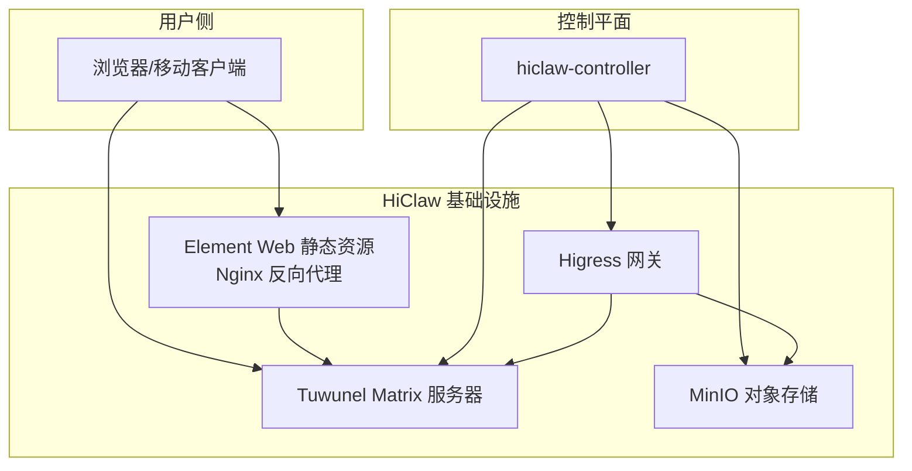
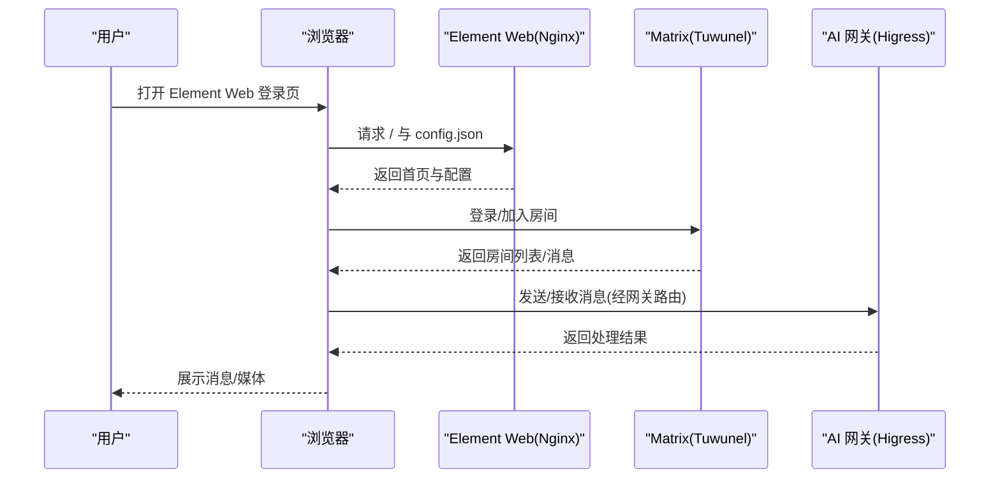
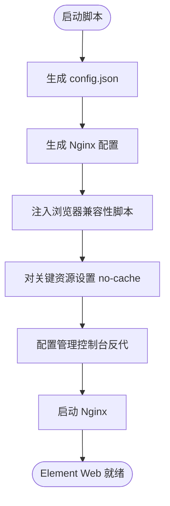
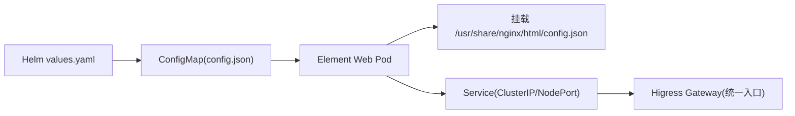
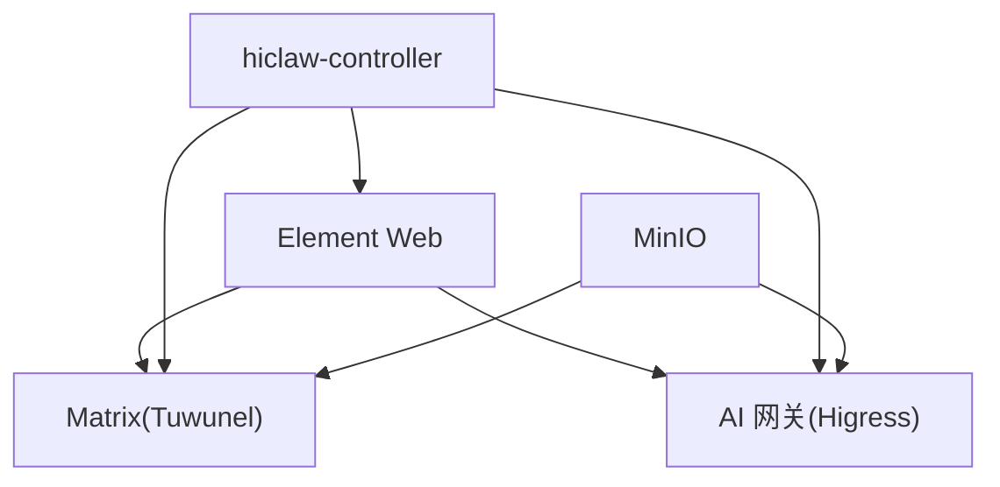

# Element Web 界面

<cite>
**本文档引用的文件**
- [start-element-web.sh](file://manager/scripts/init/start-element-web.sh)
- [deployment.yaml](file://helm/hiclaw/templates/element-web/deployment.yaml)
- [configmap.yaml](file://helm/hiclaw/templates/element-web/configmap.yaml)
- [service.yaml](file://helm/hiclaw/templates/element-web/service.yaml)
- [values.yaml](file://helm/hiclaw/values.yaml)
- [README.md](file://README.md)
- [quickstart.md](file://docs/quickstart.md)
- [architecture.md](file://docs/architecture.md)
- [development.md](file://docs/development.md)
- [windows-deploy.md](file://docs/zh-cn/windows-deploy.md)
- [faq.md](file://docs/zh-cn/faq.md)
- [import-worker.md](file://docs/zh-cn/import-worker.md)
</cite>

## 目录
1. [简介](#简介)
2. [项目结构](#项目结构)
3. [核心组件](#核心组件)
4. [架构总览](#架构总览)
5. [详细组件分析](#详细组件分析)
6. [依赖关系分析](#依赖关系分析)
7. [性能考虑](#性能考虑)
8. [故障排查指南](#故障排查指南)
9. [结论](#结论)
10. [附录](#附录)

## 简介
本文件面向 Element Web 界面的定制化与部署，围绕 HiClaw 项目中的 Element Web 组件，系统阐述其架构定位、部署配置、域名与 SSL 管理、定制选项与品牌化、界面布局与交互设计、本地化与无障碍优化、性能与缓存策略，以及与 Matrix 服务器的连接与认证流程。文档同时给出在本地与 Kubernetes 环境中的部署步骤与最佳实践。

## 项目结构
Element Web 在 HiClaw 中承担“浏览器端 Matrix 客户端”的职责，负责用户登录、房间浏览、消息收发、媒体附件展示等基础 IM 功能。其部署形态与运行方式如下：

- 本地安装模式（Embedded Controller）：Element Web 与 Higress、Tuwunel、MinIO 一起打包在控制器容器内，通过 Nginx 提供静态资源与反向代理能力。
- Kubernetes 模式（Helm Chart）：Element Web 以独立 Deployment/Service 形式部署，通过 ConfigMap 注入配置，结合 Gateway（Higress）暴露公共访问入口。

图示来源
- [architecture.md:23-82](file://docs/architecture.md#L23-L82)
- [start-element-web.sh:37-57](file://manager/scripts/init/start-element-web.sh#L37-L57)
- [deployment.yaml:29-42](file://helm/hiclaw/templates/element-web/deployment.yaml#L29-L42)

章节来源
- [architecture.md:1-235](file://docs/architecture.md#L1-L235)
- [README.md:29-48](file://README.md#L29-L48)

## 核心组件
- Element Web 配置生成与注入
  - 本地模式通过启动脚本生成 config.json 并挂载至 Nginx 静态目录，确保 Element Web 启动时可读取默认 homeserver 地址、品牌名、访客禁用等关键参数。
  - Kubernetes 模式通过 Helm ConfigMap 注入相同配置，保证一致性。
- Nginx 反向代理与安全策略
  - 本地模式：通过 sub_filter 注入浏览器兼容性豁免脚本，避免 CSP 限制；为 Element Web、管理控制台、插件服务器分别配置监听端口与路由。
  - Kubernetes 模式：通过 Service 暴露 Element Web，结合 Gateway（Higress）统一入口与 TLS 终止。
- 品牌化与定制
  - 支持通过环境变量或 Helm values 覆盖品牌名、默认 homeserver 地址、访客策略等，满足企业定制需求。
- 与 Matrix 服务器的连接
  - Element Web 通过配置中的 homeserver base_url 与 Matrix 服务器建立连接；在本地模式下，Nginx 代理确保跨域与路由正确性。

章节来源
- [start-element-web.sh:11-22](file://manager/scripts/init/start-element-web.sh#L11-L22)
- [configmap.yaml:12-22](file://helm/hiclaw/templates/element-web/configmap.yaml#L12-L22)
- [deployment.yaml:24-42](file://helm/hiclaw/templates/element-web/deployment.yaml#L24-L42)

## 架构总览
Element Web 在系统中的作用是“零配置浏览器 IM 客户端”，用户通过浏览器访问 Element Web，即可与 Matrix 服务器交互，参与由 Manager/Worker 组成的协作房间。

图示来源
- [quickstart.md:62-76](file://docs/quickstart.md#L62-L76)
- [start-element-web.sh:37-57](file://manager/scripts/init/start-element-web.sh#L37-L57)
- [architecture.md:119-137](file://docs/architecture.md#L119-L137)

## 详细组件分析

### 组件一：Element Web 配置与启动（本地模式）
- 配置生成
  - 依据环境变量生成 config.json，包含默认 homeserver base_url、品牌名、访客禁用等。
- Nginx 配置
  - 监听 8088，根目录指向 Element Web 静态资源，启用 try_files 回退至 index.html。
  - 通过 sub_filter 注入浏览器兼容性豁免脚本，避免 CSP 限制。
  - 对 config.json、index.html、i18n、version 等关键资源设置 no-cache 头，确保配置与国际化内容即时生效。
- 管理控制台反向代理（OpenClaw/Copaw）
  - 根据运行时差异，采用不同策略注入令牌或直连，确保控制台访问安全与兼容。

图示来源
- [start-element-web.sh:11-22](file://manager/scripts/init/start-element-web.sh#L11-L22)
- [start-element-web.sh:37-57](file://manager/scripts/init/start-element-web.sh#L37-L57)
- [start-element-web.sh:62-110](file://manager/scripts/init/start-element-web.sh#L62-L110)

章节来源
- [start-element-web.sh:1-147](file://manager/scripts/init/start-element-web.sh#L1-L147)

### 组件二：Element Web 配置与启动（Kubernetes 模式）
- ConfigMap 注入
  - 通过 Helm values 渲染 config.json，注入到 Pod 的 /usr/share/nginx/html/config.json。
- Deployment/Service
  - Deployment 挂载 ConfigMap，容器端口 8080；Service 暴露端口，支持 ClusterIP/NodePort。
- 与 Gateway 的集成
  - 通过 gateway.publicURL 生成 Element Web 配置，确保浏览器访问入口与网关一致。

图示来源
- [configmap.yaml:12-22](file://helm/hiclaw/templates/element-web/configmap.yaml#L12-L22)
- [deployment.yaml:29-42](file://helm/hiclaw/templates/element-web/deployment.yaml#L29-L42)
- [service.yaml:14-22](file://helm/hiclaw/templates/element-web/service.yaml#L14-L22)
- [values.yaml:62-171](file://helm/hiclaw/values.yaml#L62-L171)

章节来源
- [configmap.yaml:1-24](file://helm/hiclaw/templates/element-web/configmap.yaml#L1-L24)
- [deployment.yaml:1-58](file://helm/hiclaw/templates/element-web/deployment.yaml#L1-L58)
- [service.yaml:1-23](file://helm/hiclaw/templates/element-web/service.yaml#L1-L23)
- [values.yaml:212-230](file://helm/hiclaw/values.yaml#L212-L230)

### 组件三：域名与 SSL 证书管理
- 本地模式
  - Element Web 默认监听 8088，域名如 matrix-client-local.hiclaw.io:18088。若需 HTTPS，可在网关层（Higress）配置 TLS 终止与证书。
- Kubernetes 模式
  - 通过 gateway.publicURL 指定对外访问地址；结合 Ingress/LoadBalancer 与证书管理（如 cert-manager）实现 HTTPS。
- 建议
  - 生产环境务必启用 HTTPS，避免明文传输与中间人攻击。
  - 将 Element Web 域名与 Matrix 域名分离，便于证书与访问控制管理。

章节来源
- [windows-deploy.md:261-277](file://docs/zh-cn/windows-deploy.md#L261-L277)
- [values.yaml:62-171](file://helm/hiclaw/values.yaml#L62-L171)

### 组件四：定制选项、主题与品牌化
- 品牌与默认服务器
  - 通过环境变量或 Helm values 覆盖品牌名与默认 homeserver base_url，实现企业品牌化。
- 访客策略
  - disable_guests 控制访客登录；disable_custom_urls 控制自定义 URL 访问。
- 浏览器兼容性
  - 本地模式通过注入脚本绕过浏览器版本检查，兼顾安全与可用性。

章节来源
- [start-element-web.sh:4-21](file://manager/scripts/init/start-element-web.sh#L4-L21)
- [configmap.yaml:12-22](file://helm/hiclaw/templates/element-web/configmap.yaml#L12-L22)

### 组件五：界面布局、交互设计与响应式适配
- Element Web 作为标准 Matrix 客户端，提供：
  - 房间列表与搜索
  - 文本/媒体消息收发
  - 媒体预览与下载
  - 多语言界面与无障碍基础支持
- 响应式适配
  - Element Web 采用响应式设计，适配桌面与移动端；在移动端建议使用官方 Element/FluffyChat 客户端以获得最佳体验。

章节来源
- [quickstart.md:371-373](file://docs/quickstart.md#L371-L373)
- [windows-deploy.md:364-397](file://docs/zh-cn/windows-deploy.md#L364-L397)

### 组件六：本地化与多语言支持
- Element Web 支持多语言界面，配置通过 i18n 资源实现；在本地模式下，相关资源被标记为 no-cache，确保语言切换即时生效。
- 建议
  - 在生产环境中，通过 CDN 缓存静态资源，仅对动态 i18n 资源设置较短缓存或 no-cache。

章节来源
- [start-element-web.sh:53-55](file://manager/scripts/init/start-element-web.sh#L53-L55)

### 组件七：与 Matrix 服务器的连接与认证流程
- 连接配置
  - Element Web 通过 config.json 中的 m.homeserver.base_url 与 Matrix 服务器建立连接。
- 认证流程
  - 用户登录后，Element Web 与 Matrix 服务器建立加密通道；与 AI 网关的 LLM 调用通过 Higress 网关与消费者令牌完成鉴权。
- 本地模式注意事项
  - 若浏览器代理导致请求被拦截，需将本地域名加入绕过列表或关闭代理。

章节来源
- [architecture.md:119-137](file://docs/architecture.md#L119-L137)
- [faq.md:294-299](file://docs/zh-cn/faq.md#L294-L299)

## 依赖关系分析
Element Web 与系统其他组件的依赖关系如下：

图示来源
- [architecture.md:19-82](file://docs/architecture.md#L19-L82)
- [deployment.yaml:29-42](file://helm/hiclaw/templates/element-web/deployment.yaml#L29-L42)

章节来源
- [architecture.md:1-235](file://docs/architecture.md#L1-L235)

## 性能考虑
- 缓存策略
  - 对 config.json、index.html、i18n、version 等关键资源设置 no-cache，确保配置与语言即时生效；对静态资源（CSS/JS/图片）建议通过 CDN 与浏览器缓存提升加载速度。
- 资源加载优化
  - 合理拆分与懒加载，减少首屏加载时间；对媒体资源采用缩略图与按需加载。
- 网络与代理
  - 本地代理可能影响健康检查与资源加载，需将本地域名加入绕过列表或关闭代理。
- Kubernetes 环境
  - 通过 Service/Ingress 与 Higress 统一入口，结合合理的副本数与资源限制，保障高可用与低延迟。

[本节为通用指导，不直接分析具体文件]

## 故障排查指南
- Element Web 无法访问或显示“不支持”
  - 检查本地代理设置，将本地域名加入绕过列表；或在浏览器中忽略安全警告进入。
- 登录后无房间或消息异常
  - 确认 Element Web 配置中的 homeserver 地址与 Matrix 服务器一致；检查 Higress 网关路由与消费者令牌同步状态。
- 端口占用或访问受限
  - 更换 Element Web 监听端口或调整 Service 类型；在 Kubernetes 环境中检查 Ingress/LoadBalancer 配置。
- 语言切换无效
  - 确认 i18n 资源未被缓存；必要时清理浏览器缓存或强制刷新。

章节来源
- [faq.md:270-299](file://docs/zh-cn/faq.md#L270-L299)
- [windows-deploy.md:492-501](file://docs/zh-cn/windows-deploy.md#L492-L501)

## 结论
Element Web 在 HiClaw 中扮演“零配置浏览器 IM 客户端”的关键角色。通过本地模式的 Nginx 配置与 Kubernetes 模式的 Helm 部署，实现了灵活的接入与统一的品牌化、域名与 SSL 管理。结合合理的缓存与网络策略，可显著提升用户体验与系统稳定性。建议在生产环境中启用 HTTPS、合理规划域名与证书，并通过 CDN 优化静态资源加载。

[本节为总结性内容，不直接分析具体文件]

## 附录

### A. 本地安装与访问
- 本地模式访问地址：http://127.0.0.1:18088/#/login
- 登录后与 Manager 聊天，创建首个 Worker。

章节来源
- [quickstart.md:62-76](file://docs/quickstart.md#L62-L76)
- [windows-deploy.md:364-373](file://docs/zh-cn/windows-deploy.md#L364-L373)

### B. Kubernetes 部署要点
- 启用 Element Web：在 values.yaml 中设置 elementWeb.enabled=true
- 配置 gateway.publicURL 为对外访问地址
- 通过 Service 暴露端口，结合 Ingress/LoadBalancer 与证书管理实现 HTTPS

章节来源
- [values.yaml:212-230](file://helm/hiclaw/values.yaml#L212-L230)
- [service.yaml:14-22](file://helm/hiclaw/templates/element-web/service.yaml#L14-L22)

### C. 品牌化与定制清单
- 品牌名：通过环境变量或 Helm values 覆盖
- 默认 homeserver：通过 config.json 注入
- 访客策略：disable_guests 与 disable_custom_urls
- 浏览器兼容性：本地模式注入兼容性脚本

章节来源
- [start-element-web.sh:4-21](file://manager/scripts/init/start-element-web.sh#L4-L21)
- [configmap.yaml:12-22](file://helm/hiclaw/templates/element-web/configmap.yaml#L12-L22)