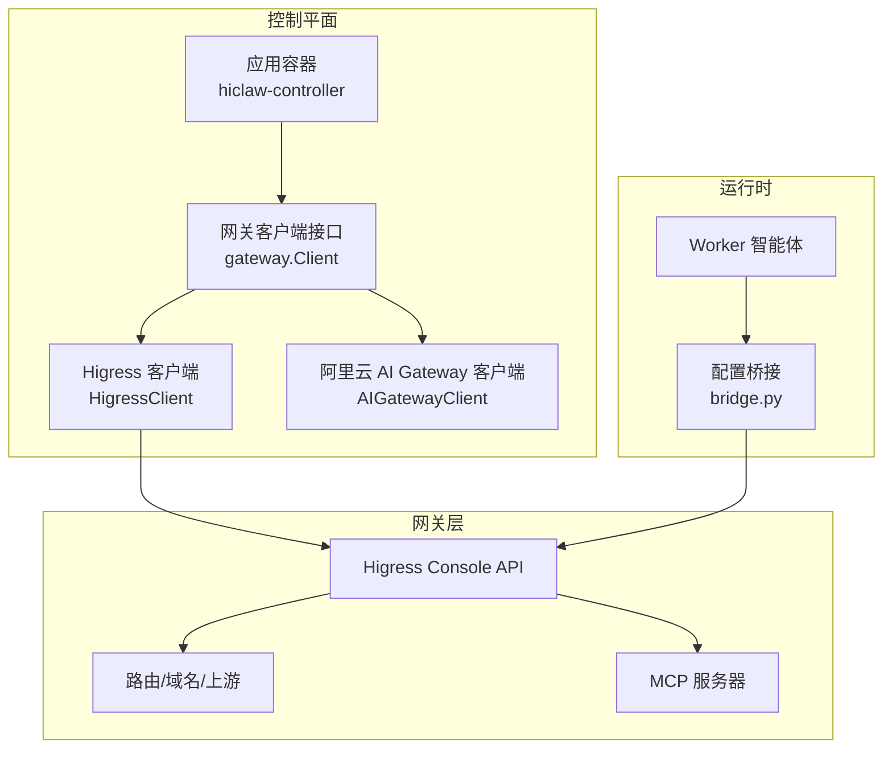
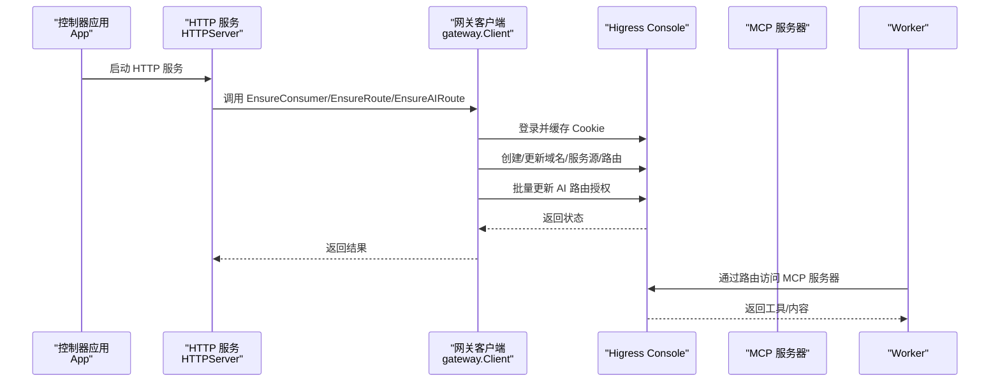
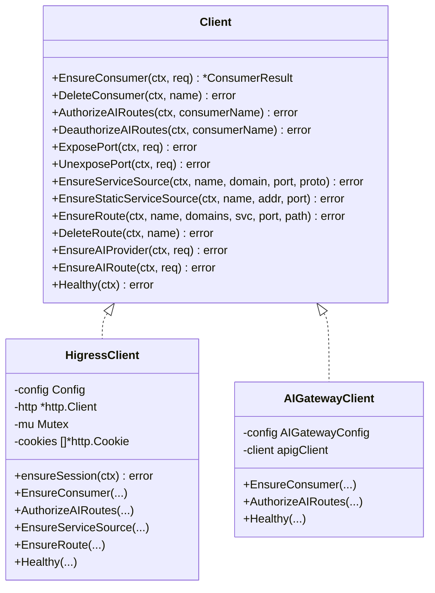
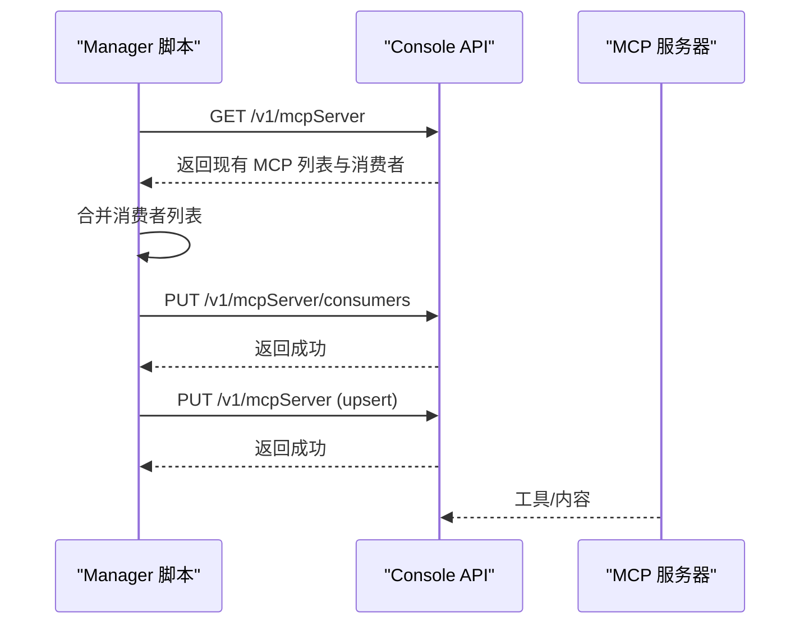
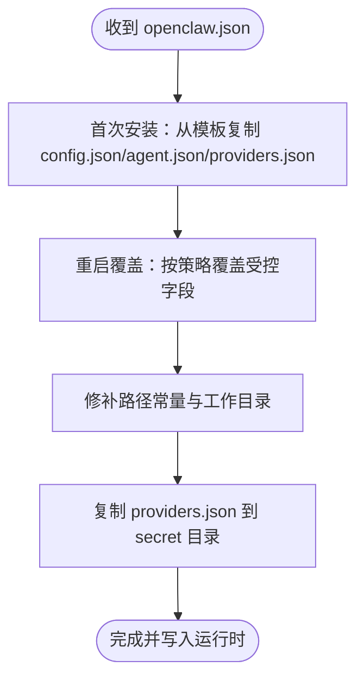
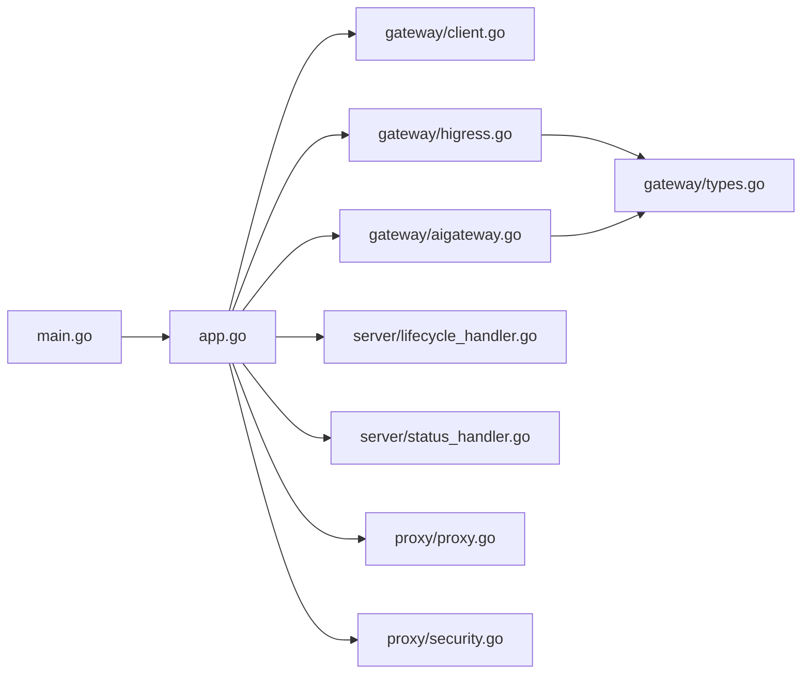

# Higress AI 网关

<cite>
**本文引用的文件**
- [hiclaw-controller/internal/gateway/aigateway.go](file://hiclaw-controller/internal/gateway/aigateway.go)
- [hiclaw-controller/internal/gateway/higress.go](file://hiclaw-controller/internal/gateway/higress.go)
- [hiclaw-controller/internal/gateway/types.go](file://hiclaw-controller/internal/gateway/types.go)
- [hiclaw-controller/internal/gateway/client.go](file://hiclaw-controller/internal/gateway/client.go)
- [manager/scripts/lib/gateway-api.sh](file://manager/scripts/lib/gateway-api.sh)
- [manager/agent/skills/mcp-server-management/references/create-update-server.md](file://manager/agent/skills/mcp-server-management/references/create-update-server.md)
- [manager/agent/skills/mcp-server-management/references/setup-mcp-proxy.md](file://manager/agent/skills/mcp-server-management/references/setup-mcp-proxy.md)
- [manager/agent/skills-alpha/higress-gateway-management/references/higress-api-doc.json](file://manager/agent/skills-alpha/higress-gateway-management/references/higress-api-doc.json)
- [copaw/src/copaw_worker/bridge.py](file://copaw/src/copaw_worker/bridge.py)
- [hiclaw-controller/internal/server/lifecycle_handler.go](file://hiclaw-controller/internal/server/lifecycle_handler.go)
- [hiclaw-controller/internal/server/status_handler.go](file://hiclaw-controller/internal/server/status_handler.go)
- [hiclaw-controller/internal/proxy/proxy.go](file://hiclaw-controller/internal/proxy/proxy.go)
- [hiclaw-controller/internal/proxy/security.go](file://hiclaw-controller/internal/proxy/security.go)
- [helm/hiclaw/values.yaml](file://helm/hiclaw/values.yaml)
- [hiclaw-controller/cmd/controller/main.go](file://hiclaw-controller/cmd/controller/main.go)
- [hiclaw-controller/internal/app/app.go](file://hiclaw-controller/internal/app/app.go)
- [tests/lib/agent-metrics.sh](file://tests/lib/agent-metrics.sh)
</cite>

## 目录
1. [简介](#简介)
2. [项目结构](#项目结构)
3. [核心组件](#核心组件)
4. [架构总览](#架构总览)
5. [详细组件分析](#详细组件分析)
6. [依赖关系分析](#依赖关系分析)
7. [性能考虑](#性能考虑)
8. [故障排查指南](#故障排查指南)
9. [结论](#结论)
10. [附录](#附录)

## 简介
本文件面向 Higress AI 网关在 Kubernetes 原生环境中的技术文档，系统阐述其架构设计、路由与流量控制、负载均衡、MCP 服务器集成与配置管理、健康检查与监控、性能优化策略，并提供路由规则配置示例、MCP 注册流程、故障转移机制、部署配置、SSL/TLS 设置与安全策略，以及与 Worker 智能体的通信协议与消息传递机制。

## 项目结构
HiClaw 控制平面通过控制器应用（controller）统一编排 Higress 网关、矩阵服务、存储与 Worker 生命周期；网关侧抽象了两类提供方：自托管 Higress 与阿里云 AI Gateway（APIG）。MCP 服务器通过 Higress Console API 进行注册与授权，Worker 通过桥接脚本将控制器下发的配置映射到运行时工作区。

图示来源
- [hiclaw-controller/internal/app/app.go:81-108](file://hiclaw-controller/internal/app/app.go#L81-L108)
- [hiclaw-controller/internal/gateway/client.go:5-51](file://hiclaw-controller/internal/gateway/client.go#L5-L51)
- [hiclaw-controller/internal/gateway/higress.go:17-32](file://hiclaw-controller/internal/gateway/higress.go#L17-L32)
- [hiclaw-controller/internal/gateway/aigateway.go:46-84](file://hiclaw-controller/internal/gateway/aigateway.go#L46-L84)

章节来源
- [hiclaw-controller/internal/app/app.go:81-108](file://hiclaw-controller/internal/app/app.go#L81-L108)
- [hiclaw-controller/internal/gateway/client.go:5-51](file://hiclaw-controller/internal/gateway/client.go#L5-L51)
- [hiclaw-controller/internal/gateway/higress.go:17-32](file://hiclaw-controller/internal/gateway/higress.go#L17-L32)
- [hiclaw-controller/internal/gateway/aigateway.go:46-84](file://hiclaw-controller/internal/gateway/aigateway.go#L46-L84)

## 核心组件
- 网关客户端接口与实现
  - 接口定义：统一消费者创建/删除、AI 路由授权、端口暴露/卸载、基础设施初始化（域名/服务源/路由）、健康检查等能力。
  - 实现：
    - 自托管 Higress：通过 Console API 进行会话登录、缓存 Cookie、批量更新 AI 路由授权、创建/删除域名/服务源/路由、健康检查。
    - 阿里云 AI Gateway：仅支持消费者与授权，不管理路由/提供商等资源，避免云平台与控制平面的冲突。
- 控制器应用与启动
  - 应用装配：构建 Scheme、基础设施客户端、后端注册表、控制器管理器、鉴权中间件、服务层、HTTP 服务器。
  - 启动流程：启动 HTTP 服务与控制器管理器；领导者选举后执行集群初始化（含网关、矩阵、存储）。
- Worker 生命周期与状态
  - 提供 /api/v1/workers/{name}/wake、sleep、ensure-ready、ready、status 等端点，支持就绪标记与后端状态聚合。
- Docker API 反向代理与安全校验
  - 对 Docker API 的 POST/DELETE 请求进行白名单放行，GET/HEAD 全部放行；对容器创建请求进行安全校验。
- Helm 部署参数
  - 支持本地（kind/minikube）与阿里云模式，选择 Higress 或 AI Gateway 提供方，配置存储（MinIO/OSS）、证书、资源配额等。

章节来源
- [hiclaw-controller/internal/gateway/client.go:5-51](file://hiclaw-controller/internal/gateway/client.go#L5-L51)
- [hiclaw-controller/internal/gateway/higress.go:17-32](file://hiclaw-controller/internal/gateway/higress.go#L17-L32)
- [hiclaw-controller/internal/gateway/aigateway.go:46-84](file://hiclaw-controller/internal/gateway/aigateway.go#L46-L84)
- [hiclaw-controller/internal/server/lifecycle_handler.go:34-160](file://hiclaw-controller/internal/server/lifecycle_handler.go#L34-L160)
- [hiclaw-controller/internal/proxy/proxy.go:26-88](file://hiclaw-controller/internal/proxy/proxy.go#L26-L88)
- [helm/hiclaw/values.yaml:55-111](file://helm/hiclaw/values.yaml#L55-L111)

## 架构总览
下图展示从控制器到网关、再到 Worker 的调用链路与职责边界：

图示来源
- [hiclaw-controller/internal/app/app.go:110-175](file://hiclaw-controller/internal/app/app.go#L110-L175)
- [hiclaw-controller/internal/gateway/higress.go:137-176](file://hiclaw-controller/internal/gateway/higress.go#L137-L176)
- [hiclaw-controller/internal/gateway/higress.go:302-338](file://hiclaw-controller/internal/gateway/higress.go#L302-L338)
- [hiclaw-controller/internal/gateway/higress.go:359-448](file://hiclaw-controller/internal/gateway/higress.go#L359-L448)

## 详细组件分析

### 网关客户端与路由授权
- Higress 客户端
  - 会话管理：首次初始化管理员账户，随后使用配置密码登录；若默认凭据可恢复则变更密码并重登。
  - 消费者与授权：创建消费者、删除消费者；批量遍历 AI 路由并更新 allowedConsumers 字段，处理并发冲突重试。
  - 基础设施：注册域名、DNS 类型服务源、静态服务源、通用路由；删除时清理对应资源。
  - 健康检查：访问消费者列表以验证 Console 可达性与认证状态。
- 阿里云 AI Gateway 客户端
  - 仅支持消费者与授权：创建消费者、删除消费者、授权/撤销 AI 路由；不管理路由/提供商等资源，返回“不支持”错误以避免云平台与控制平面冲突。
  - 健康检查：调用 ListConsumers 验证 SDK 凭证与端点可达。

图示来源
- [hiclaw-controller/internal/gateway/client.go:5-51](file://hiclaw-controller/internal/gateway/client.go#L5-L51)
- [hiclaw-controller/internal/gateway/higress.go:17-32](file://hiclaw-controller/internal/gateway/higress.go#L17-L32)
- [hiclaw-controller/internal/gateway/aigateway.go:46-58](file://hiclaw-controller/internal/gateway/aigateway.go#L46-L58)

章节来源
- [hiclaw-controller/internal/gateway/higress.go:35-84](file://hiclaw-controller/internal/gateway/higress.go#L35-L84)
- [hiclaw-controller/internal/gateway/higress.go:137-176](file://hiclaw-controller/internal/gateway/higress.go#L137-L176)
- [hiclaw-controller/internal/gateway/higress.go:178-300](file://hiclaw-controller/internal/gateway/higress.go#L178-L300)
- [hiclaw-controller/internal/gateway/higress.go:302-338](file://hiclaw-controller/internal/gateway/higress.go#L302-L338)
- [hiclaw-controller/internal/gateway/higress.go:340-448](file://hiclaw-controller/internal/gateway/higress.go#L340-L448)
- [hiclaw-controller/internal/gateway/higress.go:450-459](file://hiclaw-controller/internal/gateway/higress.go#L450-L459)
- [hiclaw-controller/internal/gateway/aigateway.go:104-168](file://hiclaw-controller/internal/gateway/aigateway.go#L104-L168)
- [hiclaw-controller/internal/gateway/aigateway.go:170-250](file://hiclaw-controller/internal/gateway/aigateway.go#L170-L250)
- [hiclaw-controller/internal/gateway/aigateway.go:289-303](file://hiclaw-controller/internal/gateway/aigateway.go#L289-L303)

### MCP 服务器集成与配置管理
- 注册与授权流程
  - 通过 Console API 列出当前 MCP 服务器，合并现有消费者列表，追加新消费者后 PUT 更新。
  - 支持内置模板与用户自定义 YAML；可指定 API 域名或自动从 YAML 解析。
  - 支持代理已有 MCP 服务器（HTTP/SSE），可注入认证头。
- 管理脚本参考
  - 创建/更新 MCP 服务器：setup-mcp-server.sh，支持模板与自定义 YAML。
  - 代理现有 MCP：setup-mcp-proxy.sh，支持 SSE/HTTP 与多组认证头。
- API 文档
  - Higress Console API 文档中包含 /v1/mcpServer 相关接口，用于列出与更新 MCP 服务器。

图示来源
- [manager/scripts/lib/gateway-api.sh:258-287](file://manager/scripts/lib/gateway-api.sh#L258-L287)
- [manager/agent/skills/mcp-server-management/references/create-update-server.md:1-44](file://manager/agent/skills/mcp-server-management/references/create-update-server.md#L1-L44)
- [manager/agent/skills/mcp-server-management/references/setup-mcp-proxy.md:1-47](file://manager/agent/skills/mcp-server-management/references/setup-mcp-proxy.md#L1-L47)
- [manager/agent/skills-alpha/higress-gateway-management/references/higress-api-doc.json:1134-1167](file://manager/agent/skills-alpha/higress-gateway-management/references/higress-api-doc.json#L1134-L1167)

章节来源
- [manager/scripts/lib/gateway-api.sh:258-287](file://manager/scripts/lib/gateway-api.sh#L258-L287)
- [manager/agent/skills/mcp-server-management/references/create-update-server.md:1-44](file://manager/agent/skills/mcp-server-management/references/create-update-server.md#L1-L44)
- [manager/agent/skills/mcp-server-management/references/setup-mcp-proxy.md:1-47](file://manager/agent/skills/mcp-server-management/references/setup-mcp-proxy.md#L1-L47)
- [manager/agent/skills-alpha/higress-gateway-management/references/higress-api-doc.json:1134-1167](file://manager/agent/skills-alpha/higress-gateway-management/references/higress-api-doc.json#L1134-L1167)

### Worker 智能体通信协议与消息传递
- 配置桥接
  - 将控制器下发的 openclaw.json 映射到运行时工作区（config.json、agent.json、providers.json），采用“模板创建 + 控制器覆盖”的策略，确保安全默认与可控覆盖。
  - 在容器与主机环境下自动调整端口映射（如 :8080 → 主机暴露端口），并修补路径常量。
- 消息通道
  - Worker 通过 Matrix 与 Manager/人类交互；消息发送需经 CoPaw 通道封装，避免绕过格式化层。
- 认证与权限
  - 控制器基于 Kubernetes ServiceAccount Token 进行认证与授权；Worker 通过网关路由访问 MCP 服务器，消费者授权由网关客户端维护。

图示来源
- [copaw/src/copaw_worker/bridge.py:155-211](file://copaw/src/copaw_worker/bridge.py#L155-L211)
- [copaw/src/copaw_worker/bridge.py:519-581](file://copaw/src/copaw_worker/bridge.py#L519-L581)
- [copaw/src/copaw_worker/bridge.py:654-697](file://copaw/src/copaw_worker/bridge.py#L654-L697)

章节来源
- [copaw/src/copaw_worker/bridge.py:155-211](file://copaw/src/copaw_worker/bridge.py#L155-L211)
- [copaw/src/copaw_worker/bridge.py:519-581](file://copaw/src/copaw_worker/bridge.py#L519-L581)
- [copaw/src/copaw_worker/bridge.py:654-697](file://copaw/src/copaw_worker/bridge.py#L654-L697)

### 健康检查、监控指标与性能优化
- 健康检查
  - 控制器：/healthz 返回 “ok”，/api/v1/status 返回集群统计信息，/api/v1/version 返回版本信息。
  - 网关：HigressClient 通过访问消费者列表进行健康探测；AIGatewayClient 通过 ListConsumers 验证连通性。
- 监控指标
  - 测试工具提供会话级指标收集与阈值断言，支持按角色汇总（Manager/Workers）与基线对比。
- 性能优化建议
  - 并发冲突重试：AI 路由授权遇到 409 冲突时进行有限次重试并退避。
  - 会话复用：Higress 客户端登录后缓存 Cookie，减少重复认证开销。
  - 资源清理：卸载端口时同步删除域名、服务源与路由，避免悬挂资源。
  - Docker API 白名单：仅允许必要操作，降低攻击面与误操作风险。

章节来源
- [hiclaw-controller/internal/server/status_handler.go:23-74](file://hiclaw-controller/internal/server/status_handler.go#L23-L74)
- [hiclaw-controller/internal/gateway/higress.go:450-459](file://hiclaw-controller/internal/gateway/higress.go#L450-L459)
- [hiclaw-controller/internal/gateway/aigateway.go:289-303](file://hiclaw-controller/internal/gateway/aigateway.go#L289-L303)
- [tests/lib/agent-metrics.sh:752-1224](file://tests/lib/agent-metrics.sh#L752-L1224)
- [hiclaw-controller/internal/gateway/higress.go:186-299](file://hiclaw-controller/internal/gateway/higress.go#L186-L299)

### 部署配置、SSL/TLS 与安全策略
- Helm 值
  - 网关提供方：higress（自托管）或 ai-gateway（阿里云 APIG）；公共 URL、子图表参数等。
  - 存储提供方：minio（嵌入式）或 oss（外部）；OSS 需要凭据提供器与端点配置。
  - 证书与 TLS：Higress Console API 文档包含 TLS 证书更新接口，可用于 SSL/TLS 设置。
- 安全策略
  - Docker API 反向代理：仅允许白名单操作，其余禁止；容器创建前进行安全校验（镜像仓库白名单、挂载与特权限制等）。
  - 认证与授权：基于 Kubernetes ServiceAccount Token 的鉴权中间件，结合 RBAC 与资源前缀。

章节来源
- [helm/hiclaw/values.yaml:55-111](file://helm/hiclaw/values.yaml#L55-L111)
- [manager/agent/skills-alpha/higress-gateway-management/references/higress-api-doc.json:246-294](file://manager/agent/skills-alpha/higress-gateway-management/references/higress-api-doc.json#L246-L294)
- [hiclaw-controller/internal/proxy/proxy.go:26-88](file://hiclaw-controller/internal/proxy/proxy.go#L26-L88)
- [hiclaw-controller/internal/proxy/security.go:46-78](file://hiclaw-controller/internal/proxy/security.go#L46-L78)

## 依赖关系分析

图示来源
- [hiclaw-controller/cmd/controller/main.go:16-36](file://hiclaw-controller/cmd/controller/main.go#L16-L36)
- [hiclaw-controller/internal/app/app.go:81-108](file://hiclaw-controller/internal/app/app.go#L81-L108)
- [hiclaw-controller/internal/gateway/client.go:5-51](file://hiclaw-controller/internal/gateway/client.go#L5-L51)
- [hiclaw-controller/internal/gateway/higress.go:17-32](file://hiclaw-controller/internal/gateway/higress.go#L17-L32)
- [hiclaw-controller/internal/gateway/aigateway.go:46-58](file://hiclaw-controller/internal/gateway/aigateway.go#L46-L58)
- [hiclaw-controller/internal/server/lifecycle_handler.go:15-32](file://hiclaw-controller/internal/server/lifecycle_handler.go#L15-L32)
- [hiclaw-controller/internal/server/status_handler.go:12-21](file://hiclaw-controller/internal/server/status_handler.go#L12-L21)
- [hiclaw-controller/internal/proxy/proxy.go:26-52](file://hiclaw-controller/internal/proxy/proxy.go#L26-L52)
- [hiclaw-controller/internal/proxy/security.go:59-78](file://hiclaw-controller/internal/proxy/security.go#L59-L78)

章节来源
- [hiclaw-controller/cmd/controller/main.go:16-36](file://hiclaw-controller/cmd/controller/main.go#L16-L36)
- [hiclaw-controller/internal/app/app.go:81-108](file://hiclaw-controller/internal/app/app.go#L81-L108)

## 性能考虑
- 并发与重试
  - AI 路由授权在遇到 409 冲突时进行有限次数重试并带随机退避，降低竞争条件下的失败率。
- 会话与连接
  - Higress 客户端登录后缓存 Cookie，避免重复认证；HTTP 客户端设置超时，防止阻塞。
- 资源回收
  - 卸载端口时同步清理域名、服务源与路由，避免资源泄漏导致的配置膨胀。
- API 白名单
  - Docker API 反向代理仅放行必要操作，减少不必要的网络往返与潜在风险。

[本节为通用指导，无需特定文件引用]

## 故障排查指南
- 网关健康检查失败
  - 使用 /healthz 与 /api/v1/status 检查控制器健康；确认 Higress Console 可达与管理员密码正确。
  - 若为阿里云 AI Gateway，检查 Region/GatewayID/ModelAPIID/EnvID 是否配置正确。
- Worker 就绪问题
  - 通过 /api/v1/workers/{name}/ensure-ready 触发启动并等待就绪；若长时间未就绪，检查后端状态与日志。
- Docker API 拒绝
  - 查看反向代理日志，确认请求是否命中白名单；检查镜像仓库白名单与挂载/特权配置。
- MCP 授权失败
  - 确认 Console API 返回的消费者列表已包含目标 Worker；检查脚本合并逻辑与 PUT 请求体。

章节来源
- [hiclaw-controller/internal/server/status_handler.go:23-74](file://hiclaw-controller/internal/server/status_handler.go#L23-L74)
- [hiclaw-controller/internal/gateway/aigateway.go:170-173](file://hiclaw-controller/internal/gateway/aigateway.go#L170-L173)
- [hiclaw-controller/internal/server/lifecycle_handler.go:112-160](file://hiclaw-controller/internal/server/lifecycle_handler.go#L112-L160)
- [hiclaw-controller/internal/proxy/proxy.go:54-88](file://hiclaw-controller/internal/proxy/proxy.go#L54-L88)

## 结论
Higress AI 网关在 HiClaw 中通过统一的网关客户端接口实现对自托管与云托管两种提供方的支持；MCP 服务器通过 Console API 实现注册与授权；控制器应用负责集群初始化、生命周期管理与安全策略落地。配合健康检查、监控指标与性能优化策略，可在 Kubernetes 原生环境中稳定运行 AI 路由与智能体协作场景。

[本节为总结，无需特定文件引用]

## 附录
- 路由规则配置示例
  - 通过 EnsureAIRoute 创建 AI 路由骨架（路径前缀、上游提供商），再通过 AuthorizeAIRoutes 为消费者添加授权，避免重启时重置 allowedConsumers 导致 403。
- MCP 服务器注册流程
  - 使用 setup-mcp-server.sh 或 setup-mcp-proxy.sh 完成注册与授权；注意传输类型（HTTP/SSE）与认证头配置。
- 故障转移机制
  - 通过多 Worker 与多路由权重（在上游配置中体现）实现简单故障转移；结合健康检查与就绪端点保障流量切换。

章节来源
- [hiclaw-controller/internal/gateway/higress.go:386-448](file://hiclaw-controller/internal/gateway/higress.go#L386-L448)
- [hiclaw-controller/internal/gateway/higress.go:178-184](file://hiclaw-controller/internal/gateway/higress.go#L178-L184)
- [manager/agent/skills/mcp-server-management/references/create-update-server.md:19-28](file://manager/agent/skills/mcp-server-management/references/create-update-server.md#L19-L28)
- [manager/agent/skills/mcp-server-management/references/setup-mcp-proxy.md:19-37](file://manager/agent/skills/mcp-server-management/references/setup-mcp-proxy.md#L19-L37)