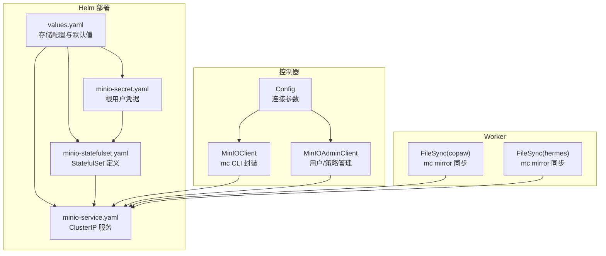
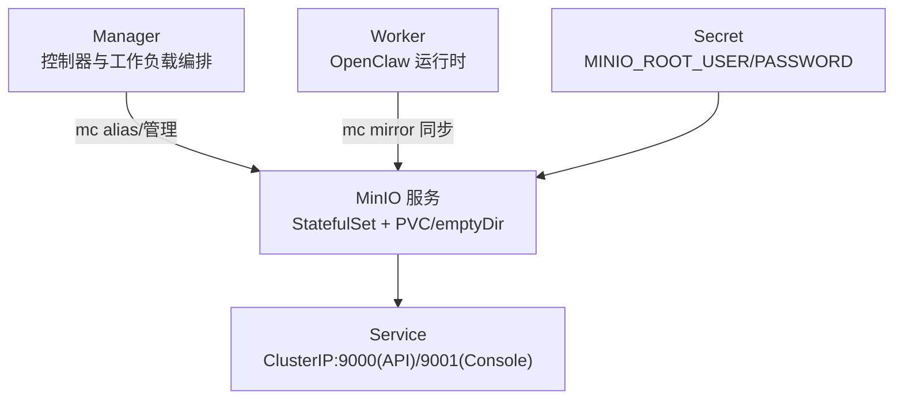
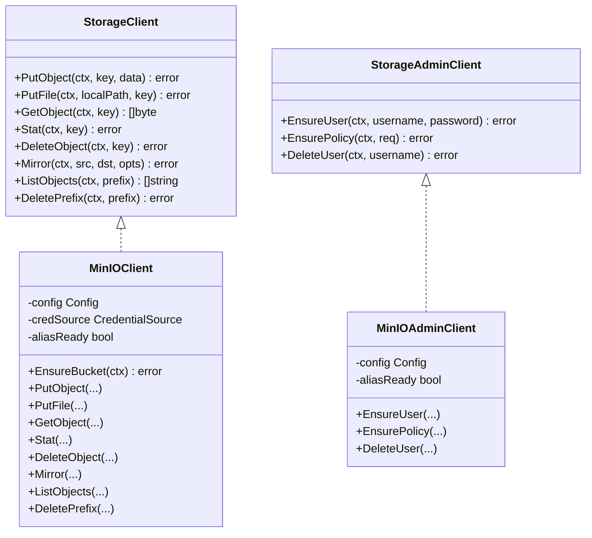
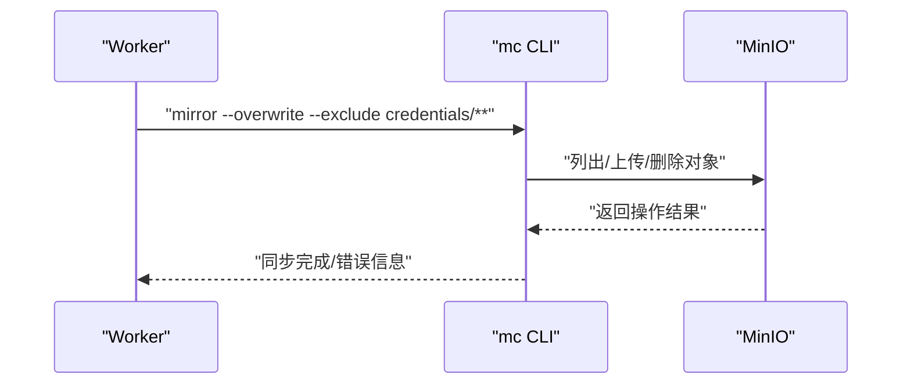
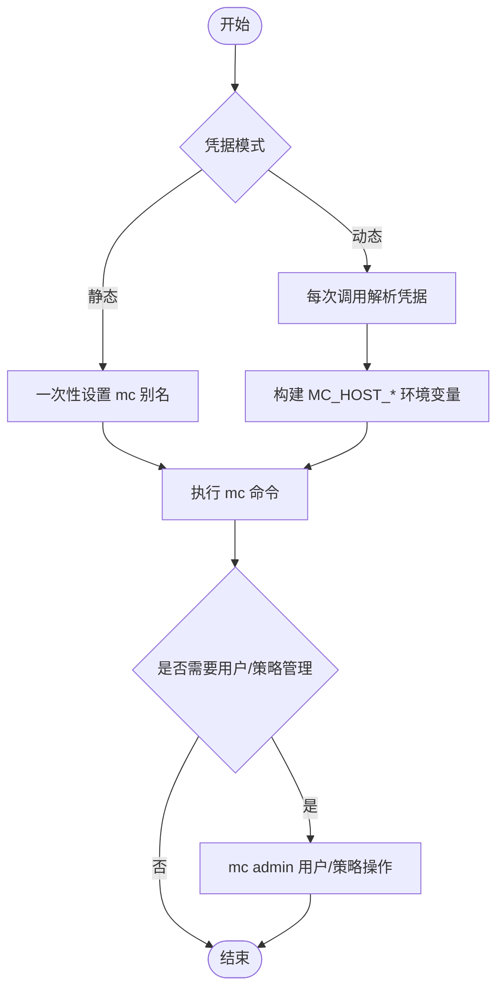
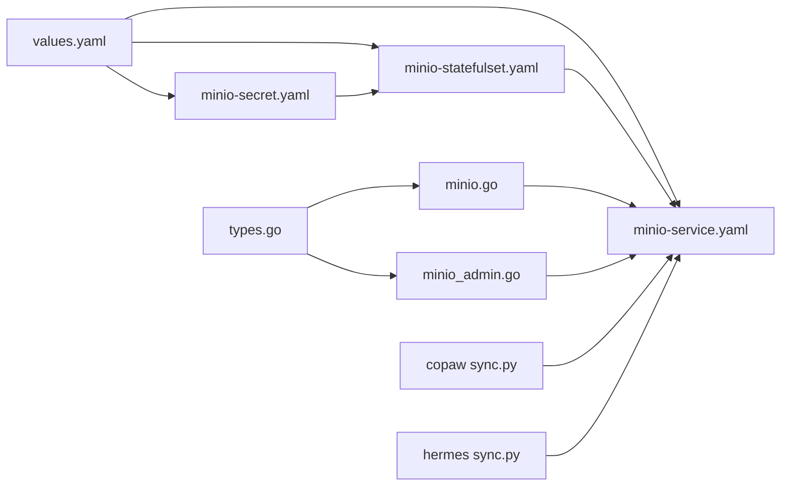

# MinIO 对象存储

<cite>
**本文引用的文件**
- [values.yaml](file://helm/hiclaw/values.yaml)
- [minio-statefulset.yaml](file://helm/hiclaw/templates/storage/minio-statefulset.yaml)
- [minio-service.yaml](file://helm/hiclaw/templates/storage/minio-service.yaml)
- [minio-secret.yaml](file://helm/hiclaw/templates/storage/minio-secret.yaml)
- [minio.go](file://hiclaw-controller/internal/oss/minio.go)
- [minio_admin.go](file://hiclaw-controller/internal/oss/minio_admin.go)
- [types.go](file://hiclaw-controller/internal/oss/types.go)
- [client.go](file://hiclaw-controller/internal/oss/client.go)
- [start-minio.sh](file://manager/scripts/init/start-minio.sh)
- [minio-client.sh](file://tests/lib/minio-client.sh)
- [minio_test.go](file://hiclaw-controller/internal/oss/minio_test.go)
- [worker-guide.md](file://docs/zh-cn/worker-guide.md)
- [sync.py（copaw）](file://copaw/src/copaw_worker/sync.py)
- [sync.py（hermes）](file://hermes/src/hermes_worker/sync.py)
</cite>

## 目录
1. [简介](#简介)
2. [项目结构](#项目结构)
3. [核心组件](#核心组件)
4. [架构总览](#架构总览)
5. [组件详解](#组件详解)
6. [依赖关系分析](#依赖关系分析)
7. [性能与容量规划](#性能与容量规划)
8. [故障排查](#故障排查)
9. [结论](#结论)
10. [附录](#附录)

## 简介
本指南围绕 HiClaw 项目中的 MinIO 对象存储进行系统性配置与管理说明，覆盖以下主题：
- 分布式架构与高可用：当前以单副本 StatefulSet 提供对象存储服务；如需高可用，建议结合外部对象存储或在生产环境采用多副本部署策略。
- 数据冗余与访问控制：通过策略生成与用户管理实现按 Worker 的最小权限访问；支持动态凭据注入以适配短期令牌场景。
- 存储桶与路径规范：统一的存储前缀与命名空间组织，便于 Worker 与 Manager 的文件同步。
- 对象操作：上传、下载、列举、删除与镜像同步，均基于 mc CLI 实现。
- 监控与性能：通过探针与日志观测健康状态；结合资源限制与镜像同步策略优化性能。
- 备份与灾难恢复：建议采用 mc mirror 的双向同步与定期快照策略。
- 客户端与 SDK：通过 mc CLI 与自定义封装的 StorageClient 接口对接；Worker 使用 mc mirror 实现文件同步。
- 与 Worker 的数据交换：通过 MinIO 前缀隔离与策略约束，实现 Manager 与 Worker 的安全协作。

## 项目结构
与 MinIO 相关的关键位置如下：
- Helm Chart：定义了 MinIO 的镜像、服务、持久化与认证参数，以及默认的存储桶名称与前缀。
- 控制器侧对象存储客户端：封装 mc CLI，提供统一的对象读写与策略管理接口。
- Worker 侧文件同步：通过 mc mirror 实现本地与 MinIO 的双向同步。
- 测试与验证：提供 mc 别名配置与对象存在性校验的测试脚本。

**图表来源**
- [values.yaml:78-111](file://helm/hiclaw/values.yaml#L78-L111)
- [minio-statefulset.yaml:1-79](file://helm/hiclaw/templates/storage/minio-statefulset.yaml#L1-L79)
- [minio-service.yaml:1-25](file://helm/hiclaw/templates/storage/minio-service.yaml#L1-L25)
- [minio-secret.yaml:1-14](file://helm/hiclaw/templates/storage/minio-secret.yaml#L1-L14)
- [minio.go:25-40](file://hiclaw-controller/internal/oss/minio.go#L25-L40)
- [minio_admin.go:15-29](file://hiclaw-controller/internal/oss/minio_admin.go#L15-L29)
- [sync.py（copaw）:1-20](file://copaw/src/copaw_worker/sync.py#L1-L20)
- [sync.py（hermes）:114-147](file://hermes/src/hermes_worker/sync.py#L114-L147)

**章节来源**
- [values.yaml:78-111](file://helm/hiclaw/values.yaml#L78-L111)
- [minio-statefulset.yaml:1-79](file://helm/hiclaw/templates/storage/minio-statefulset.yaml#L1-L79)
- [minio-service.yaml:1-25](file://helm/hiclaw/templates/storage/minio-service.yaml#L1-L25)
- [minio-secret.yaml:1-14](file://helm/hiclaw/templates/storage/minio-secret.yaml#L1-L14)

## 核心组件
- 存储配置与默认值：Helm values 中定义了存储提供方、模式、桶名、镜像、资源、服务端口与根用户凭据等。
- MinIO StatefulSet：单副本部署，挂载 PVC 或 emptyDir，暴露 API 与控制台端口。
- MinIO 服务：ClusterIP 类型，提供稳定的 DNS 名称与端口映射。
- MinIO Secret：存放根用户账号与密码，注入到容器环境变量。
- 控制器对象存储客户端：
  - MinIOClient：封装 mc CLI，支持静态与动态凭据模式，提供 Put/Get/Delete/List/Mirror 等能力。
  - MinIOAdminClient：仅用于内置 MinIO 场景，负责用户与策略的创建与绑定。
- Worker 文件同步：通过 mc mirror 实现本地与 MinIO 的双向同步，区分 Manager 管理与 Worker 写入的目录范围。

**章节来源**
- [values.yaml:78-111](file://helm/hiclaw/values.yaml#L78-L111)
- [minio-statefulset.yaml:25-59](file://helm/hiclaw/templates/storage/minio-statefulset.yaml#L25-L59)
- [minio-service.yaml:15-23](file://helm/hiclaw/templates/storage/minio-service.yaml#L15-L23)
- [minio-secret.yaml:10-12](file://helm/hiclaw/templates/storage/minio-secret.yaml#L10-L12)
- [minio.go:13-25](file://hiclaw-controller/internal/oss/minio.go#L13-L25)
- [minio_admin.go:13-18](file://hiclaw-controller/internal/oss/minio_admin.go#L13-L18)
- [client.go:5-39](file://hiclaw-controller/internal/oss/client.go#L5-L39)

## 架构总览
下图展示了 MinIO 在 HiClaw 中的角色与交互：

**图表来源**
- [minio-statefulset.yaml:10-59](file://helm/hiclaw/templates/storage/minio-statefulset.yaml#L10-L59)
- [minio-service.yaml:10-23](file://helm/hiclaw/templates/storage/minio-service.yaml#L10-L23)
- [minio-secret.yaml:9-12](file://helm/hiclaw/templates/storage/minio-secret.yaml#L9-L12)
- [minio.go:203-226](file://hiclaw-controller/internal/oss/minio.go#L203-L226)
- [sync.py（copaw）:466-492](file://copaw/src/copaw_worker/sync.py#L466-L492)

## 组件详解

### 存储配置与部署
- 存储提供方与模式：支持内置 MinIO（managed）与外部 OSS（existing）。内置模式下，Helm Chart 会部署 StatefulSet、Service 与 Secret。
- 默认桶名与前缀：values 中定义了默认桶名与存储前缀，用于统一命名空间组织。
- 资源与端口：StatefulSet 定义了 CPU/内存请求与限制，服务暴露 API 与控制台端口。
- 持久化：默认启用 PVC，大小与 StorageClass 可配置；也可选择 emptyDir 用于开发环境。

**章节来源**
- [values.yaml:78-111](file://helm/hiclaw/values.yaml#L78-L111)
- [minio-statefulset.yaml:25-77](file://helm/hiclaw/templates/storage/minio-statefulset.yaml#L25-L77)
- [minio-service.yaml:15-23](file://helm/hiclaw/templates/storage/minio-service.yaml#L15-L23)
- [minio-secret.yaml:10-12](file://helm/hiclaw/templates/storage/minio-secret.yaml#L10-L12)

### 控制器侧对象存储客户端
- MinIOClient
  - 支持静态与动态两种凭据模式：静态模式通过一次性设置 mc 别名复用；动态模式每次调用解析凭据并通过环境变量注入。
  - 提供 PutObject/PutFile/GetObject/Stat/DeleteObject/Mirror/DeletePrefix/ListObjects 等操作。
  - EnsureBucket 用于确保桶存在。
- MinIOAdminClient
  - 仅在内置 MinIO 模式下使用，负责用户创建与策略管理。
  - 策略构建逻辑按 Worker 名称、团队与是否为管理员生成受限的 List/Put/Delete 权限集合。
- 类型与接口
  - Config/Credentials/MirrorOptions/PolicyRequest 等类型定义清晰，便于扩展与测试。

**图表来源**
- [client.go:5-54](file://hiclaw-controller/internal/oss/client.go#L5-L54)
- [minio.go:13-25](file://hiclaw-controller/internal/oss/minio.go#L13-L25)
- [minio_admin.go:13-18](file://hiclaw-controller/internal/oss/minio_admin.go#L13-L18)

**章节来源**
- [minio.go:52-226](file://hiclaw-controller/internal/oss/minio.go#L52-L226)
- [minio_admin.go:31-190](file://hiclaw-controller/internal/oss/minio_admin.go#L31-L190)
- [types.go:5-53](file://hiclaw-controller/internal/oss/types.go#L5-L53)
- [client.go:5-54](file://hiclaw-controller/internal/oss/client.go#L5-L54)

### Worker 侧文件同步与数据交换
- 启动流程：配置 mc 别名、拉取 Worker 配置、复制技能模板、启动双向 mc mirror 同步、配置 MCP 端点并启动 OpenClaw。
- 同步策略：
  - 本地 → 远端：Worker 写入后立即推送至 MinIO。
  - 远端 → 本地：Manager 主动推送或每 5 分钟周期性拉取。
- 前缀隔离：每个 Worker 的命名空间为 agents/<name>，共享目录为 shared，Manager 专属为 manager，团队目录为 teams/<team>。
- 策略约束：Worker 的策略仅允许访问自身命名空间与共享目录，避免越权。

**图表来源**
- [worker-guide.md:148-158](file://docs/zh-cn/worker-guide.md#L148-L158)
- [sync.py（copaw）:222-250](file://copaw/src/copaw_worker/sync.py#L222-L250)
- [sync.py（hermes）:222-250](file://hermes/src/hermes_worker/sync.py#L222-L250)

**章节来源**
- [worker-guide.md:124-158](file://docs/zh-cn/worker-guide.md#L124-L158)
- [sync.py（copaw）:1-20](file://copaw/src/copaw_worker/sync.py#L1-L20)
- [sync.py（copaw）:466-492](file://copaw/src/copaw_worker/sync.py#L466-L492)
- [sync.py（hermes）:114-147](file://hermes/src/hermes_worker/sync.py#L114-L147)

### 访问控制与策略
- 用户与策略管理：内置 MinIO 模式下，控制器通过 mc admin 创建用户并为其生成策略，策略限定 Worker 的访问前缀与权限。
- 动态凭据：在外部 OSS 模式下，控制器通过 CredentialSource 每次调用解析凭据，避免别名与令牌缓存，提升安全性与时效性。
- 环境变量注入：通过构建 MC_HOST_<alias>=<scheme>://<ak>:<sk>[:<token>]@<host> 注入 mc CLI，确保凭据正确传递。

**图表来源**
- [minio.go:52-67](file://hiclaw-controller/internal/oss/minio.go#L52-L67)
- [minio.go:209-219](file://hiclaw-controller/internal/oss/minio.go#L209-L219)
- [minio_admin.go:57-94](file://hiclaw-controller/internal/oss/minio_admin.go#L57-L94)

**章节来源**
- [minio_admin.go:57-94](file://hiclaw-controller/internal/oss/minio_admin.go#L57-L94)
- [minio.go:228-267](file://hiclaw-controller/internal/oss/minio.go#L228-L267)
- [minio_test.go:8-79](file://hiclaw-controller/internal/oss/minio_test.go#L8-L79)

## 依赖关系分析
- 组件耦合
  - 控制器通过 Config 与 MinIOClient/MinIOAdminClient 解耦具体实现，便于替换为其他对象存储后端。
  - Worker 通过 mc mirror 与 MinIO 交互，不直接依赖控制器，降低耦合度。
- 外部依赖
  - mc CLI：作为对象存储操作与策略管理的唯一外部工具。
  - Kubernetes：StatefulSet、Service、Secret、PVC 等资源由 Helm 管理。
- 循环依赖
  - 未发现循环依赖；各模块职责清晰，接口边界明确。

**图表来源**
- [values.yaml:78-111](file://helm/hiclaw/values.yaml#L78-L111)
- [minio-statefulset.yaml:1-79](file://helm/hiclaw/templates/storage/minio-statefulset.yaml#L1-L79)
- [minio-service.yaml:1-25](file://helm/hiclaw/templates/storage/minio-service.yaml#L1-L25)
- [minio-secret.yaml:1-14](file://helm/hiclaw/templates/storage/minio-secret.yaml#L1-L14)
- [types.go:5-14](file://hiclaw-controller/internal/oss/types.go#L5-L14)
- [minio.go:25-40](file://hiclaw-controller/internal/oss/minio.go#L25-L40)
- [minio_admin.go:15-29](file://hiclaw-controller/internal/oss/minio_admin.go#L15-L29)
- [sync.py（copaw）:1-20](file://copaw/src/copaw_worker/sync.py#L1-L20)
- [sync.py（hermes）:114-147](file://hermes/src/hermes_worker/sync.py#L114-L147)

**章节来源**
- [client.go:5-54](file://hiclaw-controller/internal/oss/client.go#L5-L54)
- [types.go:5-53](file://hiclaw-controller/internal/oss/types.go#L5-L53)

## 性能与容量规划
- 资源规划
  - 建议根据对象数量、并发上传/下载与镜像同步频率设置合理的 CPU/内存请求与限制，避免突发流量导致调度失败。
  - 服务端口与网络带宽应满足 mc mirror 的吞吐需求，必要时调整队列与并发参数。
- 存储容量
  - PVC 大小应预留增长空间，结合对象数量与平均大小估算；定期清理不再使用的对象以回收空间。
- 同步策略
  - Worker 写入后立即推送，减少远端等待；Manager 端定期拉取作为兜底，避免遗漏。
  - 使用排除规则（如 credentials/**）避免敏感目录被同步，提高安全性与性能。
- 健康检查
  - 利用就绪/存活探针监控 MinIO 服务可用性，异常时及时告警与恢复。

[本节为通用指导，无需特定文件来源]

## 故障排查
- MinIO 服务不可达
  - 检查 Service 是否正常暴露端口，Pod 是否处于 Running 状态，PVC 是否绑定成功。
  - 查看容器日志与探针输出，确认端口监听与凭据是否正确。
- mc 命令失败
  - 核对 mc 别名是否已设置，或在动态模式下确认凭据解析与环境变量注入是否成功。
  - 关注错误输出中关于权限不足、对象不存在或网络问题的信息。
- Worker 同步异常
  - 确认 mc mirror 参数（覆盖、排除规则）与本地目录权限。
  - 检查 Manager 与 Worker 的网络连通性与 DNS 解析。
- 验证脚本
  - 使用测试库提供的函数进行对象存在性检查、内容读取与目录列举，辅助定位问题。

**章节来源**
- [minio-client.sh:12-58](file://tests/lib/minio-client.sh#L12-L58)
- [minio.go:203-226](file://hiclaw-controller/internal/oss/minio.go#L203-L226)
- [minio_admin.go:31-43](file://hiclaw-controller/internal/oss/minio_admin.go#L31-L43)

## 结论
HiClaw 通过 Helm Chart 将 MinIO 以单副本方式集成到系统中，配合控制器侧的 mc CLI 封装与 Worker 侧的 mc mirror 同步，实现了安全、可控且易于扩展的对象存储方案。对于高可用与大规模场景，建议结合外部对象存储或在生产环境中采用多副本部署与更严格的容量与性能规划。

[本节为总结，无需特定文件来源]

## 附录

### 配置清单与默认值
- 存储提供方与模式：storage.provider 与 storage.mode
- 桶名与前缀：storage.bucket 与 storage.minio.auth.rootUser/rootPassword
- 镜像与资源：storage.minio.image.* 与 storage.minio.resources.*
- 服务端口：storage.minio.service.apiPort/consolePort
- 持久化：storage.minio.persistence.enabled/size/storageClassName

**章节来源**
- [values.yaml:78-111](file://helm/hiclaw/values.yaml#L78-L111)

### 管理命令速查
- 设置 mc 别名：用于静态模式下的一次性配置
- 对象操作：上传、下载、统计、删除、列举、镜像同步
- 用户与策略：创建用户、生成策略并附加到用户

**章节来源**
- [minio.go:73-201](file://hiclaw-controller/internal/oss/minio.go#L73-L201)
- [minio_admin.go:45-110](file://hiclaw-controller/internal/oss/minio_admin.go#L45-L110)