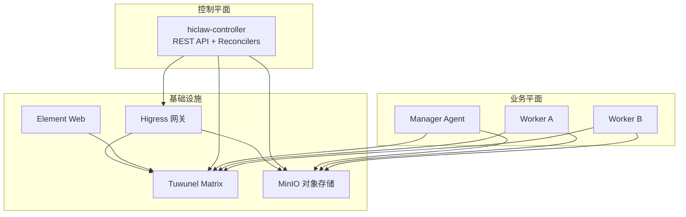
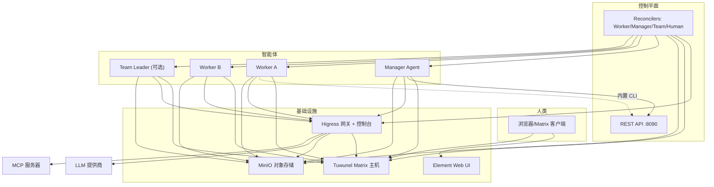
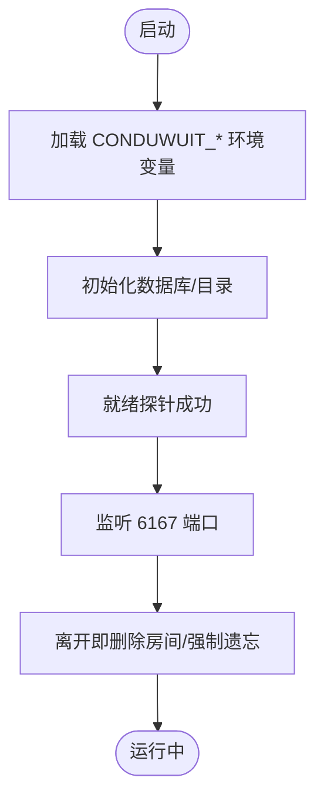
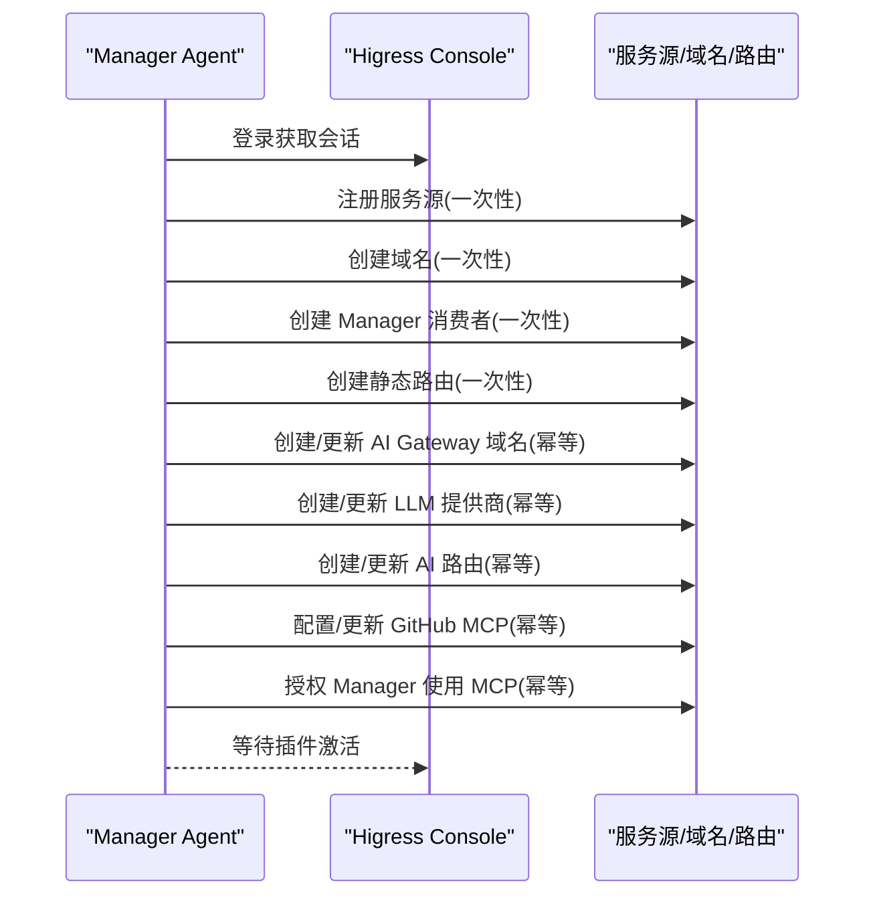
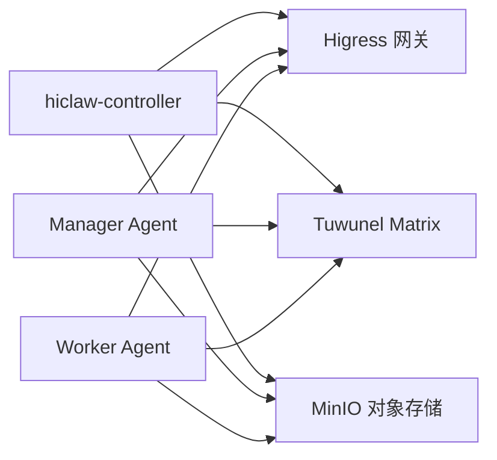

# Tuwunel Matrix 服务器

<cite>
**本文引用的文件**
- [README.md](file://README.md)
- [docs/architecture.md](file://docs/architecture.md)
- [docs/quickstart.md](file://docs/quickstart.md)
- [docs/manager-guide.md](file://docs/manager-guide.md)
- [docs/worker-guide.md](file://docs/worker-guide.md)
- [manager/README.md](file://manager/README.md)
- [worker/README.md](file://worker/README.md)
- [copaw/src/matrix/README.md](file://copaw/src/matrix/README.md)
- [hermes/README.md](file://hermes/README.md)
- [helm/hiclaw/values.yaml](file://helm/hiclaw/values.yaml)
- [helm/hiclaw/templates/matrix/tuwunel-statefulset.yaml](file://helm/hiclaw/templates/matrix/tuwunel-statefulset.yaml)
- [hiclaw-controller/cmd/controller/main.go](file://hiclaw-controller/cmd/controller/main.go)
- [hiclaw-controller/go.mod](file://hiclaw-controller/go.mod)
- [manager/scripts/init/setup-higress.sh](file://manager/scripts/init/setup-higress.sh)
</cite>

## 目录
1. [简介](#简介)
2. [项目结构](#项目结构)
3. [核心组件](#核心组件)
4. [架构总览](#架构总览)
5. [详细组件分析](#详细组件分析)
6. [依赖关系分析](#依赖关系分析)
7. [性能考虑](#性能考虑)
8. [故障排查指南](#故障排查指南)
9. [结论](#结论)
10. [附录](#附录)

## 简介
本文件面向部署与运维工程师，系统性阐述基于 Tuwunel Matrix 的 HiClaw 多智能体协作平台的部署与管理实践。内容覆盖：
- Matrix 协议与去中心化通信机制概述
- Tuwunel 服务器的部署配置、集群与高可用设计
- 房间管理、用户认证与权限控制
- 服务器 API、消息协议与事件处理
- 房间创建、用户邀请与权限分配操作指南
- 监控、日志与性能调优
- 与 Manager Agent、Worker 的集成与通信流程

## 项目结构
HiClaw 将基础设施（Higress 网关、Tuwunel Matrix、MinIO、Element Web）与业务容器（Manager、Worker）解耦，通过控制器在本地或 Kubernetes 上统一编排。

图表来源
- [docs/architecture.md](file://docs/architecture.md)
- [helm/hiclaw/values.yaml](file://helm/hiclaw/values.yaml)

章节来源
- [docs/architecture.md](file://docs/architecture.md)
- [README.md](file://README.md)

## 核心组件
- 控制器（hiclaw-controller）
  - 提供 REST API 与资源编排能力，负责 Manager/Worker/Team/Human 资源的生命周期与一致性维护。
  - 支持本地嵌入式控制器与 Kubernetes 部署两种模式。
- 管理员代理（Manager Agent）
  - 在 Matrix 中作为协调者，负责任务分发、房间管理、MCP 服务授权与凭证发放。
  - 支持 OpenClaw/CoPaw 两种运行时。
- 工作线程代理（Worker Agent）
  - 轻量无状态容器，通过 MinIO 同步配置与技能，使用 AI Gateway 访问 LLM，通过 mcporter 调用 MCP 服务。
- Tuwunel Matrix 服务器
  - 基于 conduwuit 家族的自托管 homeserver，支持注册令牌、历史清理与房间强制遗忘等策略。
- Higress 网关
  - 统一流量入口，提供 AI 路由、MCP 服务暴露与消费者鉴权。
- MinIO 对象存储
  - 共享工作区与任务数据，确保 Worker 可替换性与持久化。

章节来源
- [docs/architecture.md](file://docs/architecture.md)
- [manager/README.md](file://manager/README.md)
- [worker/README.md](file://worker/README.md)
- [README.md](file://README.md)

## 架构总览
下图展示逻辑层与部署形态，以及 Manager/Worker 与基础设施之间的交互路径。

图表来源
- [docs/architecture.md](file://docs/architecture.md)

章节来源
- [docs/architecture.md](file://docs/architecture.md)

## 详细组件分析

### Tuwunel Matrix 服务器
- 角色与职责
  - 自托管 homeserver，承载 Matrix 消息、房间与用户生命周期。
  - 支持注册令牌、历史缓冲、房间强制遗忘等策略，保障 Agent 生命周期安全与房间状态收敛。
- 部署形态
  - Helm Chart 默认以 StatefulSet 方式部署，支持持久化与探活健康检查。
  - 环境变量通过 CONDUWUIT_* 前缀注入，如数据库路径、监听地址、注册令牌、删除房间策略等。
- 高可用与集群
  - 通过副本数与持久卷满足可用性与数据持久化需求；结合控制器的房间清理策略，避免重名 Agent 重启后遗留房间状态。
- 权限与安全
  - 注册令牌用于初始注册；房间策略与强制遗忘减少状态漂移风险。

图表来源
- [helm/hiclaw/templates/matrix/tuwunel-statefulset.yaml](file://helm/hiclaw/templates/matrix/tuwunel-statefulset.yaml)

章节来源
- [helm/hiclaw/templates/matrix/tuwunel-statefulset.yaml](file://helm/hiclaw/templates/matrix/tuwunel-statefulset.yaml)
- [docs/architecture.md](file://docs/architecture.md)

### Higress 网关与路由
- 角色与职责
  - 作为 AI Gateway 与 API 网关，统一 LLM 与 MCP 服务访问，基于消费者密钥进行身份鉴权。
  - 通过 Console 进行路由、域名与消费者配置管理。
- 首次引导与幂等更新
  - 非幂等段：服务源、域名、Manager 消费者、静态路由仅首次引导创建。
  - 幂等段：AI Gateway 域名、AI 路由、LLM 提供商、GitHub MCP 服务器按当前环境配置更新。
- 关键流程
  - 注册服务源（Tuwunel、Element Web、MinIO、OpenClaw Console）
  - 创建域名与路由（Matrix、Element Web、文件系统、AI Gateway、Console）
  - 配置 LLM 提供商与 AI 路由（自动注入 User-Agent）
  - 配置 GitHub MCP 服务器并授权 Manager

图表来源
- [manager/scripts/init/setup-higress.sh](file://manager/scripts/init/setup-higress.sh)

章节来源
- [manager/scripts/init/setup-higress.sh](file://manager/scripts/init/setup-higress.sh)

### 管理员代理（Manager Agent）
- 角色与职责
  - 在 Matrix 中作为协调者，负责房间创建、成员邀请、任务分发、MCP 授权与凭证发放。
  - 通过 MinIO 同步配置与技能，支持心跳与会话管理。
- 运行时选择
  - OpenClaw 或 CoPaw 两种运行时，共享技能与工作区结构。
- 技能体系
  - 内置 16 个 Manager 技能，涵盖通道管理、文件同步、任务协调、团队管理、矩阵服务器管理等。
- 日志与可观测性
  - v1.1.0+ 嵌入式安装下，基础设施日志位于控制器容器内；可通过日志命令与回放工具定位问题。

章节来源
- [manager/README.md](file://manager/README.md)
- [docs/manager-guide.md](file://docs/manager-guide.md)
- [docs/architecture.md](file://docs/architecture.md)

### 工作线程代理（Worker Agent）
- 角色与职责
  - 轻量无状态容器，连接 Manager 与 Matrix，从 MinIO 同步配置与技能，使用 AI Gateway 与 mcporter 执行任务。
- 文件系统布局
  - OpenClaw/Copaw/Hermes 三类运行时采用不同工作区布局，但均以 MinIO 为持久化根。
- 生命周期管理
  - 空闲超时自动停止；任务分配时自动拉起；控制器重启后自动重建缺失容器。
- 故障排查
  - 常见问题包括配置未生成、mc 命令缺失、端口不可达等；可使用内置诊断命令与回放工具辅助定位。

章节来源
- [worker/README.md](file://worker/README.md)
- [docs/worker-guide.md](file://docs/worker-guide.md)

### Matrix 协议与去中心化通信
- 协议特性
  - 去中心化、开放协议，支持联邦与自托管，避免厂商锁定与数据采集。
  - 通过房间承载人类与 Agent 的可见协作，支持提及、加密、历史缓冲等增强能力。
- 安全模型
  - Agent 仅持有消费级令牌，真实凭据由网关集中管理；人类全程可见干预。
- 策略与增强
  - 通过 CoPaw/Hermes Overlay 引入端到端加密、历史缓冲、提及处理、Markdown 渲染等能力。

章节来源
- [README.md](file://README.md)
- [copaw/src/matrix/README.md](file://copaw/src/matrix/README.md)
- [hermes/README.md](file://hermes/README.md)

### API 接口与事件处理
- 控制器 API
  - 提供 REST API（如 :8090），用于创建/查询/更新/删除 Worker/Manager/Team/Human 资源。
  - 通过控制器驱动 Higress 路由、消费者与 MCP 授权。
- 事件与会话
  - Manager/Worker 使用会话重置策略与进度日志，保证任务中断后的可恢复性。
- 与 Element Web 的集成
  - Element Web 通过网关域名访问 Matrix 与文件系统，提供零配置 IM 客户端体验。

章节来源
- [hiclaw-controller/cmd/controller/main.go](file://hiclaw-controller/cmd/controller/main.go)
- [hiclaw-controller/go.mod](file://hiclaw-controller/go.mod)
- [docs/manager-guide.md](file://docs/manager-guide.md)
- [docs/quickstart.md](file://docs/quickstart.md)

## 依赖关系分析

图表来源
- [docs/architecture.md](file://docs/architecture.md)
- [hiclaw-controller/go.mod](file://hiclaw-controller/go.mod)

章节来源
- [docs/architecture.md](file://docs/architecture.md)
- [hiclaw-controller/go.mod](file://hiclaw-controller/go.mod)

## 性能考虑
- Tuwunel
  - 增大缓存容量参数以降低 RocksDB 抖动风险；启用就绪/存活探针保障健康状态。
- Higress
  - 首次配置后等待插件激活；AI 路由与提供商更新采用幂等策略，避免重复开销。
- MinIO
  - 通过 mc mirror 实现双向同步，建议合理设置同步间隔与带宽限制。
- Manager/Worker
  - 利用会话重置与进度日志减少上下文丢失；空闲 Worker 自动停止以节省资源。

章节来源
- [helm/hiclaw/templates/matrix/tuwunel-statefulset.yaml](file://helm/hiclaw/templates/matrix/tuwunel-statefulset.yaml)
- [manager/scripts/init/setup-higress.sh](file://manager/scripts/init/setup-higress.sh)
- [docs/worker-guide.md](file://docs/worker-guide.md)
- [docs/manager-guide.md](file://docs/manager-guide.md)

## 故障排查指南
- 基础设施健康检查
  - Matrix/MinIO 健康探测：通过控制器容器内部端点验证。
  - Higress 控制台：确认路由与消费者状态。
- 日志定位
  - Manager Agent 与基础设施日志位置；OpenClaw 运行时日志查看。
  - 回放对话日志，便于交叉分析。
- 常见问题
  - Worker 启动失败：检查配置是否生成、mc 是否可用、端口可达。
  - 无法连接 Matrix：验证网关域名解析与路由。
  - 无法访问 LLM/MCP：核对消费者密钥与授权状态。
  - Worker 重置后恢复：利用进度日志与任务历史文件恢复上下文。

章节来源
- [docs/manager-guide.md](file://docs/manager-guide.md)
- [docs/worker-guide.md](file://docs/worker-guide.md)
- [docs/quickstart.md](file://docs/quickstart.md)

## 结论
Tuwunel Matrix 服务器作为 HiClaw 的核心通信基础设施，配合控制器、网关与对象存储，构建了安全、可控、可观测的多智能体协作平台。通过 Helm Chart 与本地安装脚本，可在单机或 Kubernetes 环境快速部署；借助房间与会话机制，实现人类全程可见与干预的协作闭环。

## 附录

### 部署与配置要点
- Helm 配置
  - Matrix 提供商选择（tuwunel/synapse）、模式（managed/existing）、服务端口与持久化。
  - 网关提供商（higress/ai-gateway）、公共 URL、AI 路由与消费者配置。
  - 存储提供商（minio/oss）、桶名称与认证信息。
- Tuwunel StatefulSet
  - 副本数、资源请求/限制、持久卷大小与存储类。
  - 环境变量（注册令牌、服务器名、缓存容量、房间清理策略等）。
- 控制器
  - REST API 端口、资源配额、工作负载后端（k8s/sae）与服务账号。

章节来源
- [helm/hiclaw/values.yaml](file://helm/hiclaw/values.yaml)
- [helm/hiclaw/templates/matrix/tuwunel-statefulset.yaml](file://helm/hiclaw/templates/matrix/tuwunel-statefulset.yaml)
- [hiclaw-controller/cmd/controller/main.go](file://hiclaw-controller/cmd/controller/main.go)