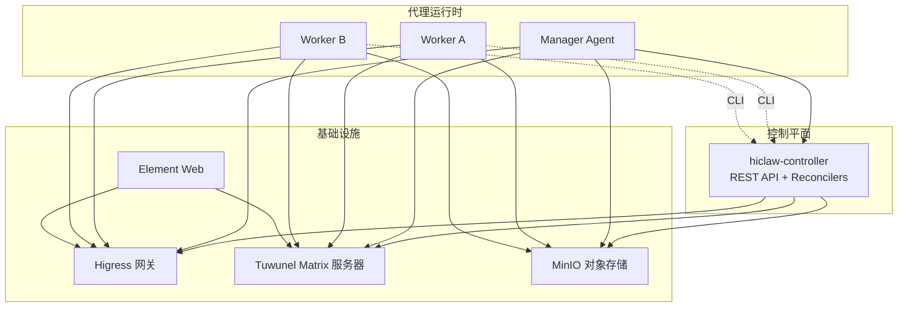
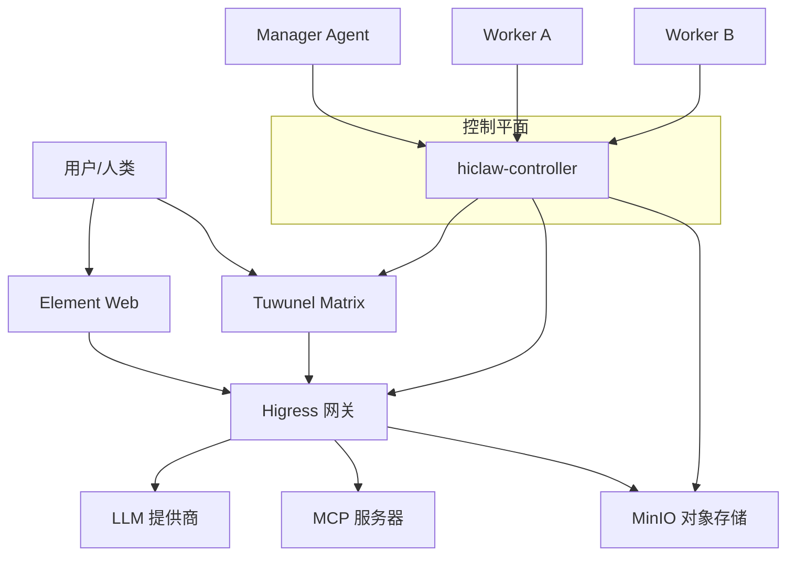
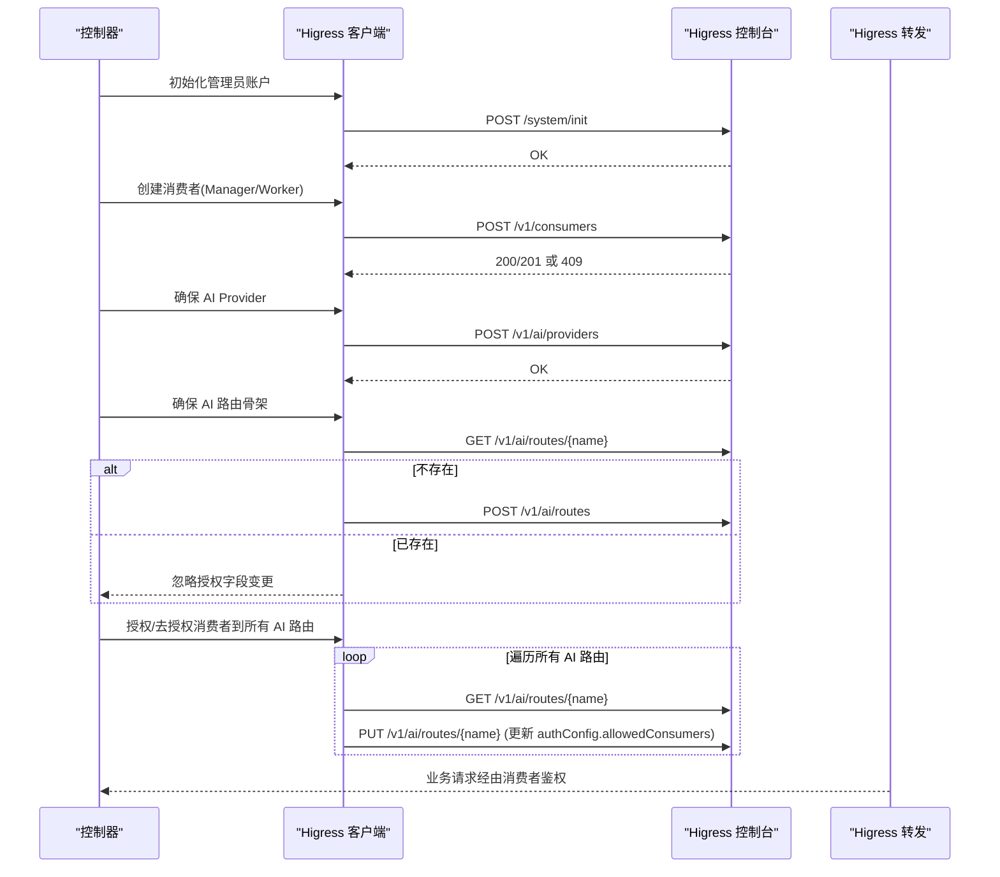
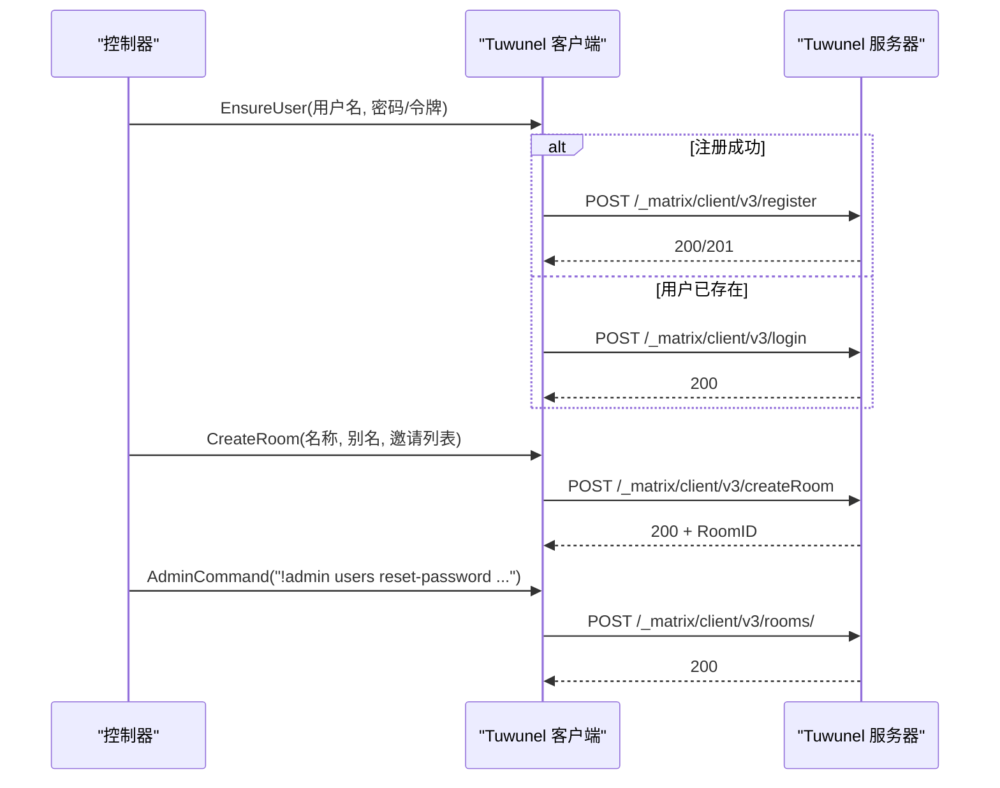
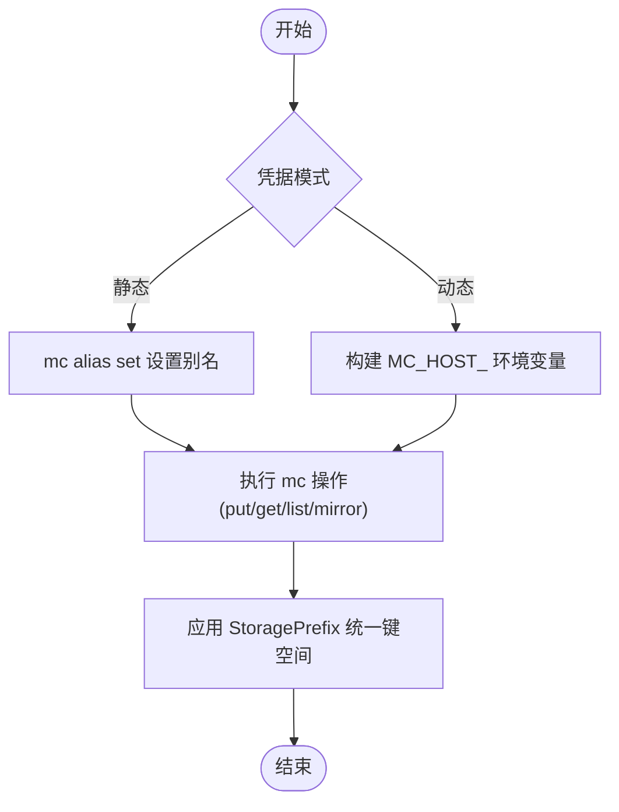
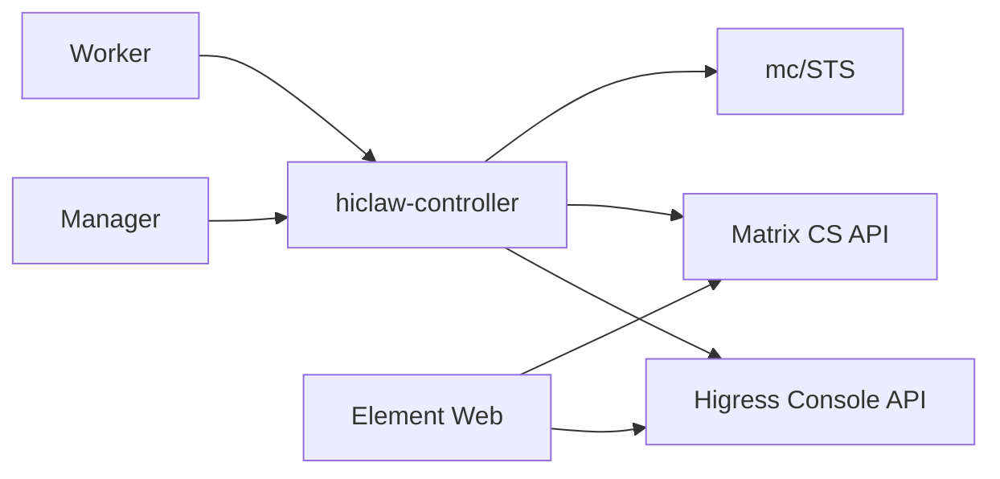

# 基础设施组件

<cite>
**本文引用的文件**   
- [README.md](file://README.md)
- [架构文档](file://docs/architecture.md)
- [values.yaml](file://helm/hiclaw/values.yaml)
- [Higress 客户端实现](file://hiclaw-controller/internal/gateway/higress.go)
- [网关类型定义](file://hiclaw-controller/internal/gateway/types.go)
- [Matrix 客户端接口与实现](file://hiclaw-controller/internal/matrix/client.go)
- [Matrix 类型定义](file://hiclaw-controller/internal/matrix/types.go)
- [MinIO 客户端实现](file://hiclaw-controller/internal/oss/minio.go)
- [对象存储类型定义](file://hiclaw-controller/internal/oss/types.go)
- [控制器入口](file://hiclaw-controller/cmd/controller/main.go)
- [控制器部署模板](file://helm/hiclaw/templates/controller/deployment.yaml)
- [Tuwunel StatefulSet 模板](file://helm/hiclaw/templates/matrix/tuwunel-statefulset.yaml)
- [MinIO StatefulSet 模板](file://helm/hiclaw/templates/storage/minio-statefulset.yaml)
- [Manager 镜像构建脚本](file://manager/Dockerfile)
- [Manager 启动脚本基础库](file://manager/scripts/lib/base.sh)
</cite>

## 目录
1. [简介](#简介)
2. [项目结构](#项目结构)
3. [核心组件](#核心组件)
4. [架构总览](#架构总览)
5. [详细组件分析](#详细组件分析)
6. [依赖分析](#依赖分析)
7. [性能考虑](#性能考虑)
8. [故障排查指南](#故障排查指南)
9. [结论](#结论)
10. [附录](#附录)

## 简介
本文件面向 HiClaw 的基础设施组件，围绕以下目标展开：  
- 深入介绍 Higress AI 网关的配置与管理（路由、MCP 服务器托管、消费者授权、端口暴露等）  
- 详解 Tuwunel Matrix 服务器的部署与维护（房间管理、用户权限、注册令牌、安全设置）  
- 说明 MinIO 对象存储的配置与优化（静态根凭据、动态 STS 凭据、备份与容量规划）  
- 介绍 Element Web 界面的定制与用户体验优化  
- 解释组件间的集成关系与数据流  
- 提供监控、日志与故障排查方法  
- 总结高可用与灾难恢复最佳实践  

## 项目结构
HiClaw 将“基础设施”与“代理运行时”解耦：  
- 控制平面（hiclaw-controller）负责 CRD 调谐、网关消费者与路由、矩阵房间与用户、对象存储策略与同步  
- Manager/Worker 运行时仅携带代理逻辑与技能，不内嵌基础设施栈  
- Helm Chart 将 Higress、Tuwunel、MinIO、Element Web 作为独立工作负载或子图进行编排

图表来源
- [架构文档](file://docs/architecture.md)
- [控制器部署模板](file://helm/hiclaw/templates/controller/deployment.yaml)

章节来源
- [README.md](file://README.md)
- [架构文档](file://docs/architecture.md)

## 核心组件
- Higress AI 网关：统一 LLM 流量入口，支持 key-auth 消费者授权、AI 路由骨架、MCP 服务器托管、端口暴露（Worker 服务对外访问）
- Tuwunel Matrix：自建 homeserver，提供房间、消息、成员管理、管理员命令通道
- MinIO 对象存储：共享工作区与任务树，支持静态凭据与动态 STS 凭据模式
- Element Web：零配置浏览器客户端，通过网关暴露的公共 URL 访问
- 控制器（hiclaw-controller）：统一的控制平面，协调上述组件并提供 REST API

章节来源
- [README.md](file://README.md)
- [架构文档](file://docs/architecture.md)

## 架构总览
下图展示逻辑交互与数据流：

图表来源
- [架构文档](file://docs/architecture.md)
- [Higress 客户端实现](file://hiclaw-controller/internal/gateway/higress.go)
- [Matrix 客户端接口与实现](file://hiclaw-controller/internal/matrix/client.go)
- [MinIO 客户端实现](file://hiclaw-controller/internal/oss/minio.go)

## 详细组件分析

### Higress AI 网关：配置与管理
- 登录与会话管理：首次引导初始化管理员账户；支持默认凭证回退与密码收敛；登录后缓存会话 Cookie
- 消费者管理：按身份创建 key-auth 消费者（Bearer），用于区分 Manager/Worker 的 LLM 调用
- AI 路由管理：仅创建路由骨架（路径前缀、上游提供者），授权列表由 Reconciler 在消费者存在后写入，避免重启导致授权丢失
- MCP 服务器托管：通过 AI Provider 注册上游，结合路由与 key-auth 实现安全访问
- 端口暴露：为 Worker 的本地服务源、域名与路由提供创建/删除流程，便于 Worker 服务对外暴露

图表来源
- [Higress 客户端实现](file://hiclaw-controller/internal/gateway/higress.go)
- [网关类型定义](file://hiclaw-controller/internal/gateway/types.go)

章节来源
- [Higress 客户端实现](file://hiclaw-controller/internal/gateway/higress.go)
- [网关类型定义](file://hiclaw-controller/internal/gateway/types.go)

### Tuwunel Matrix 服务器：部署与维护
- 用户管理：基于注册令牌的注册与登录；若用户已存在但密码被外部轮换，通过管理员机器人命令触发重置并重试登录
- 房间管理：创建房间时可指定别名，确保幂等性；支持邀请、加入、离开、成员查询、踢出
- 管理员通道：通过“#admins:domain”别名解析管理员房间，向其中发送“!admin ...”命令以执行系统级操作
- 安全与隐私：可启用 E2EE；内置注册开关与缓存容量调整，降低 RocksDB 抖动风险；离开即删除房间并强制 forget，防止状态泄露

图表来源
- [Matrix 客户端接口与实现](file://hiclaw-controller/internal/matrix/client.go)
- [Matrix 类型定义](file://hiclaw-controller/internal/matrix/types.go)

章节来源
- [Matrix 客户端接口与实现](file://hiclaw-controller/internal/matrix/client.go)
- [Matrix 类型定义](file://hiclaw-controller/internal/matrix/types.go)
- [Tuwunel StatefulSet 模板](file://helm/hiclaw/templates/matrix/tuwunel-statefulset.yaml)

### MinIO 对象存储：配置与优化
- 静态凭据模式：在 Helm 值中配置根凭据，控制器使用 mc alias set 一次性安装，后续命令复用
- 动态 STS 模式：通过 CredentialSource 每次调用 mc 时注入 MC_HOST_ 环境变量，适配云 OSS 的短期令牌
- 存储前缀：统一的 StoragePrefix 保证键空间隔离；支持镜像、上传、统计、列举、删除前缀等操作
- 备份与容量：建议定期对 PVC/卷进行快照；根据对象数量与大小规划副本数与存储类；开启压缩/分片策略（如适用）

图表来源
- [MinIO 客户端实现](file://hiclaw-controller/internal/oss/minio.go)
- [对象存储类型定义](file://hiclaw-controller/internal/oss/types.go)
- [values.yaml](file://helm/hiclaw/values.yaml)

章节来源
- [MinIO 客户端实现](file://hiclaw-controller/internal/oss/minio.go)
- [对象存储类型定义](file://hiclaw-controller/internal/oss/types.go)
- [values.yaml](file://helm/hiclaw/values.yaml)
- [MinIO StatefulSet 模板](file://helm/hiclaw/templates/storage/minio-statefulset.yaml)

### Element Web 界面：定制与体验
- 默认随 Helm Chart 部署，提供零配置访问入口
- 通过 gateway.publicURL 配置 Element Web 的公共访问地址，确保与网关一致
- 可通过 ConfigMap/环境变量进行主题、语言、功能开关等定制（参考 Chart 模板与 values）

章节来源
- [README.md](file://README.md)
- [架构文档](file://docs/architecture.md)
- [values.yaml](file://helm/hiclaw/values.yaml)

## 依赖分析
- 控制器依赖：Higress Console API、Matrix CS API、MinIO mc CLI/STS
- 运行时依赖：控制器 REST API（hiclaw CLI）、Element Web、Tuwunel、MinIO
- Helm Chart 依赖：values.yaml 中的 provider/mode 选择决定子图部署（Higress/Tuwunel/MinIO/Element Web）

图表来源
- [控制器部署模板](file://helm/hiclaw/templates/controller/deployment.yaml)
- [Higress 客户端实现](file://hiclaw-controller/internal/gateway/higress.go)
- [Matrix 客户端接口与实现](file://hiclaw-controller/internal/matrix/client.go)
- [MinIO 客户端实现](file://hiclaw-controller/internal/oss/minio.go)

章节来源
- [控制器部署模板](file://helm/hiclaw/templates/controller/deployment.yaml)
- [Higress 客户端实现](file://hiclaw-controller/internal/gateway/higress.go)
- [Matrix 客户端接口与实现](file://hiclaw-controller/internal/matrix/client.go)
- [MinIO 客户端实现](file://hiclaw-controller/internal/oss/minio.go)

## 性能考虑
- Higress
  - 使用 key-auth 框架与允许消费者列表分离，避免重启导致授权丢失与频繁重载
  - 路由批量更新时引入重试与冲突处理，降低并发写入失败率
- Tuwunel
  - 增大缓存容量参数，减少 RocksDB 抖动；启用“离开即删除房间并强制 forget”，降低状态膨胀
  - 合理设置就绪/存活探针，缩短故障感知时间
- MinIO
  - 静态模式下一次性 alias set，避免每次调用重复认证开销
  - 动态模式下最小化 STS 生命周期，减少凭据刷新频率
  - 使用镜像操作与排除规则，控制带宽与 IO 峰值
- Manager/Worker
  - 使用 mcporter 与 mc 同步，避免在容器内直接挂载大体积卷
  - 通过资源限制与亲和性调度，提升稳定性

章节来源
- [Higress 客户端实现](file://hiclaw-controller/internal/gateway/higress.go)
- [Tuwunel StatefulSet 模板](file://helm/hiclaw/templates/matrix/tuwunel-statefulset.yaml)
- [MinIO 客户端实现](file://hiclaw-controller/internal/oss/minio.go)
- [Manager 镜像构建脚本](file://manager/Dockerfile)

## 故障排查指南
- 控制器健康检查
  - 通过 /healthz 探针判断控制器存活；日志输出由 zap 提供
- 网关问题
  - 若出现 401/403，检查会话缓存是否失效并自动重新登录
  - 授权冲突（409）时重试并等待短暂退避
- Matrix 问题
  - 用户登录失败且提示“已存在”：通过管理员机器人发送“!admin users reset-password”命令重置密码，再重试登录
  - 房间别名冲突：CreateRoom 会解析别名并返回现有 RoomID，避免重复创建
- 对象存储问题
  - 动态 STS 模式下，若 mc 执行报错包含“对象不存在”或退出码，按不存在处理
  - 环境变量 MC_HOST_<alias> 构造需注意 userinfo 不做 URL 解码，避免 OSS 返回 InvalidSecurityToken
- 启动脚本辅助
  - 使用 waitForService/waitForHTTP 等工具在容器启动阶段等待依赖服务就绪

章节来源
- [控制器入口](file://hiclaw-controller/cmd/controller/main.go)
- [Higress 客户端实现](file://hiclaw-controller/internal/gateway/higress.go)
- [Matrix 客户端接口与实现](file://hiclaw-controller/internal/matrix/client.go)
- [MinIO 客户端实现](file://hiclaw-controller/internal/oss/minio.go)
- [Manager 启动脚本基础库](file://manager/scripts/lib/base.sh)

## 结论
HiClaw 将基础设施与代理运行时解耦，借助控制器统一编排 Higress、Tuwunel、MinIO 与 Element Web，并通过声明式资源与 CLI 提升运维效率。通过合理的路由与消费者授权、房间与用户生命周期管理、对象存储的静态/动态凭据模式以及前端界面定制，可在单机与 Kubernetes 场景下实现安全、可观测、可扩展的多智能体协作平台。

## 附录
- 高可用与灾难恢复建议
  - 控制器：多副本 + 领导选举，确保单点故障下的快速接管
  - 网关：多副本与健康检查，结合灰度发布与蓝绿切换
  - Matrix：StatefulSet + PVC，定期快照；必要时迁移数据目录
  - 对象存储：MinIO 多副本或对接云 OSS；开启版本控制与跨区域复制
  - 元数据与日志：集中采集与索引，保留足够历史以便回溯
- 监控与日志
  - 控制器：/healthz 探针 + 控制器日志；可选 CMS 集成导出指标与追踪
  - 网关：Higress 控制台与访问日志；审计 key-auth 授权事件
  - Matrix：Tuwunel 日志与审计；关注异常成员与房间状态
  - 存储：MinIO 控制台与指标；对象计数、容量与延迟趋势

章节来源
- [控制器部署模板](file://helm/hiclaw/templates/controller/deployment.yaml)
- [README.md](file://README.md)
- [架构文档](file://docs/architecture.md)