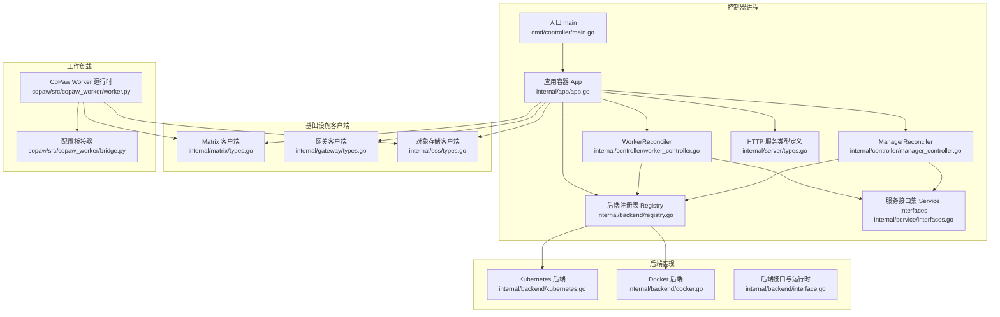
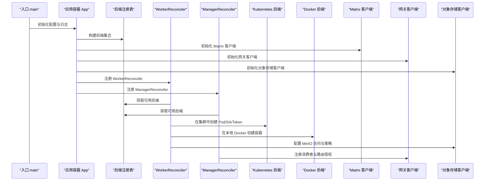
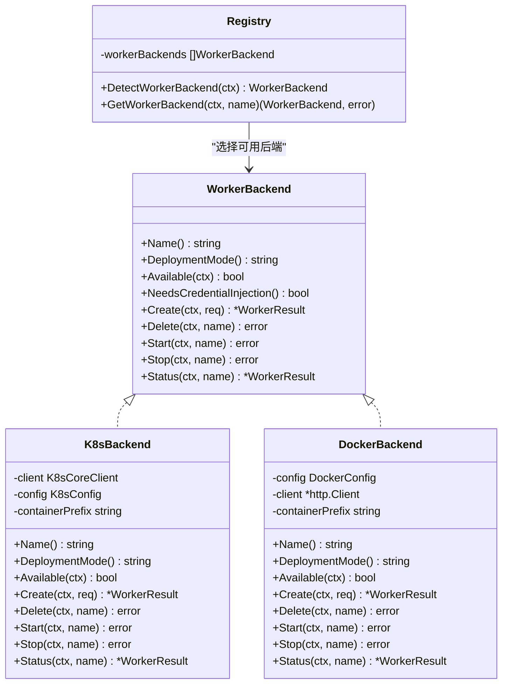
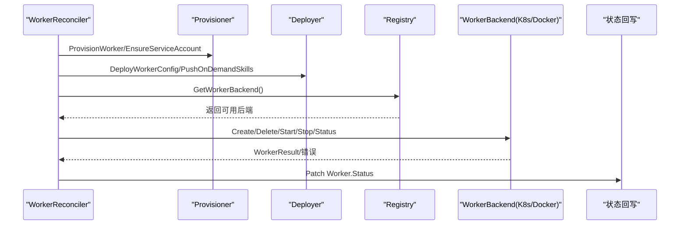
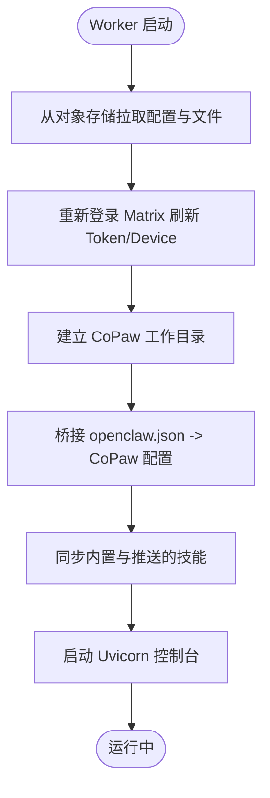
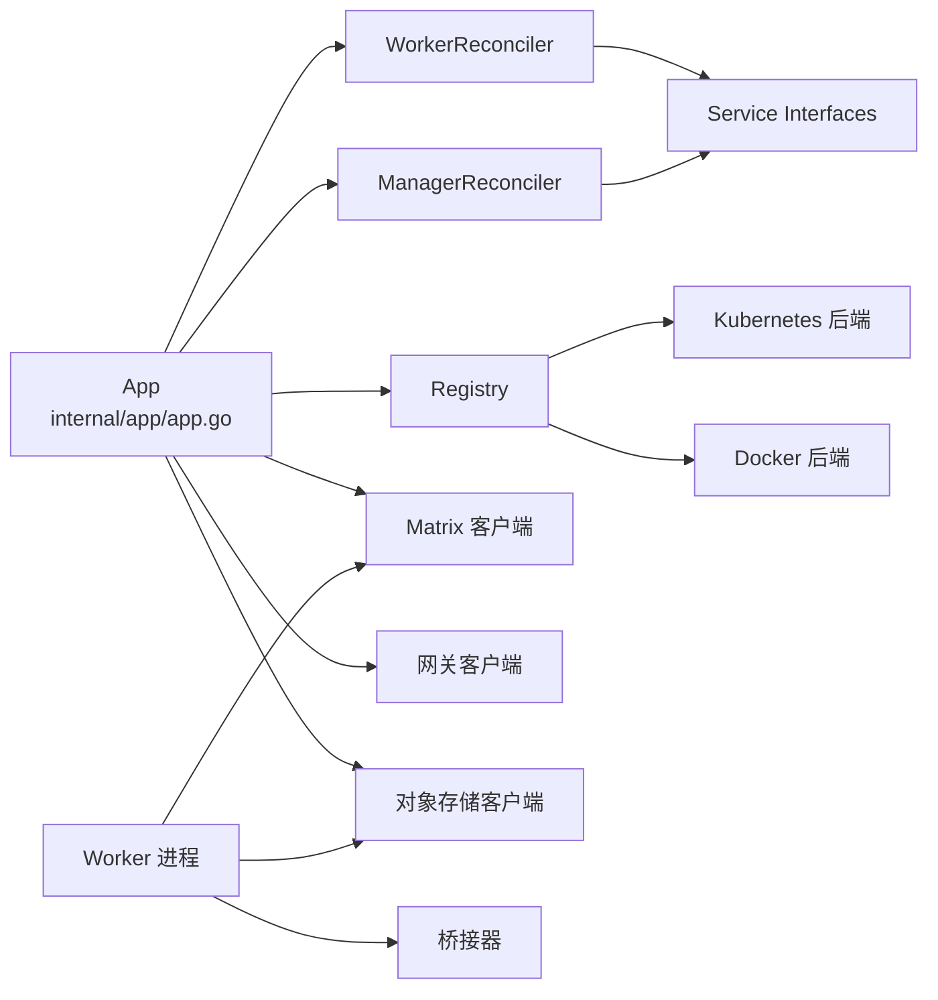

# 组件集成与通信

<cite>
**本文引用的文件**
- [hiclaw-controller/internal/backend/interface.go](file://hiclaw-controller/internal/backend/interface.go)
- [hiclaw-controller/internal/backend/kubernetes.go](file://hiclaw-controller/internal/backend/kubernetes.go)
- [hiclaw-controller/internal/backend/docker.go](file://hiclaw-controller/internal/backend/docker.go)
- [hiclaw-controller/internal/backend/registry.go](file://hiclaw-controller/internal/backend/registry.go)
- [hiclaw-controller/internal/app/app.go](file://hiclaw-controller/internal/app/app.go)
- [hiclaw-controller/cmd/controller/main.go](file://hiclaw-controller/cmd/controller/main.go)
- [hiclaw-controller/internal/controller/worker_controller.go](file://hiclaw-controller/internal/controller/worker_controller.go)
- [hiclaw-controller/internal/controller/manager_controller.go](file://hiclaw-controller/internal/controller/manager_controller.go)
- [hiclaw-controller/internal/service/interfaces.go](file://hiclaw-controller/internal/service/interfaces.go)
- [hiclaw-controller/internal/gateway/types.go](file://hiclaw-controller/internal/gateway/types.go)
- [hiclaw-controller/internal/oss/types.go](file://hiclaw-controller/internal/oss/types.go)
- [hiclaw-controller/internal/matrix/types.go](file://hiclaw-controller/internal/matrix/types.go)
- [hiclaw-controller/internal/server/types.go](file://hiclaw-controller/internal/server/types.go)
- [copaw/src/copaw_worker/bridge.py](file://copaw/src/copaw_worker/bridge.py)
- [copaw/src/copaw_worker/worker.py](file://copaw/src/copaw_worker/worker.py)
</cite>

## 目录
1. [引言](#引言)
2. [项目结构](#项目结构)
3. [核心组件](#核心组件)
4. [架构总览](#架构总览)
5. [详细组件分析](#详细组件分析)
6. [依赖关系分析](#依赖关系分析)
7. [性能考虑](#性能考虑)
8. [故障排查指南](#故障排查指南)
9. [结论](#结论)
10. [附录](#附录)

## 引言
本文件面向基础设施组件的集成与通信机制，系统性阐述控制器如何在 Kubernetes 与 Docker 后端之间进行抽象与切换；如何通过服务发现、服务注册与暴露实现组件间的服务编排；如何在组件间传递消息、触发事件与保持状态一致；以及网络拓扑、防火墙与安全策略的落地方式。同时覆盖健康检查、故障检测与自动恢复、监控指标采集与告警配置等运维要点。

## 项目结构
HiClaw 的控制器以 controller-runtime 为核心，采用“声明式 + 控制器”的模式管理 Worker、Manager、Team、Human 等资源，并通过后端抽象层在 Kubernetes 与 Docker 之间无缝切换。应用启动流程自上而下分为：入口程序加载配置、构建应用容器、初始化基础设施客户端（矩阵、网关、对象存储）、构建后端注册表、装配控制器与 HTTP 服务，最终进入主循环。

图示来源
- [hiclaw-controller/cmd/controller/main.go:16-36](file://hiclaw-controller/cmd/controller/main.go#L16-L36)
- [hiclaw-controller/internal/app/app.go:83-108](file://hiclaw-controller/internal/app/app.go#L83-L108)
- [hiclaw-controller/internal/backend/registry.go:28-57](file://hiclaw-controller/internal/backend/registry.go#L28-L57)
- [hiclaw-controller/internal/backend/kubernetes.go:94-131](file://hiclaw-controller/internal/backend/kubernetes.go#L94-L131)
- [hiclaw-controller/internal/backend/docker.go:36-51](file://hiclaw-controller/internal/backend/docker.go#L36-L51)
- [hiclaw-controller/internal/controller/worker_controller.go:43-55](file://hiclaw-controller/internal/controller/worker_controller.go#L43-L55)
- [hiclaw-controller/internal/controller/manager_controller.go:32-62](file://hiclaw-controller/internal/controller/manager_controller.go#L32-L62)
- [hiclaw-controller/internal/service/interfaces.go:9-33](file://hiclaw-controller/internal/service/interfaces.go#L9-L33)
- [hiclaw-controller/internal/server/types.go:7-26](file://hiclaw-controller/internal/server/types.go#L7-L26)

章节来源
- [hiclaw-controller/cmd/controller/main.go:16-36](file://hiclaw-controller/cmd/controller/main.go#L16-L36)
- [hiclaw-controller/internal/app/app.go:83-108](file://hiclaw-controller/internal/app/app.go#L83-L108)

## 核心组件
- 后端抽象层与切换
  - WorkerBackend 接口统一了生命周期操作（创建、删除、启动、停止、状态查询），并支持自动检测可用后端。
  - Registry 负责按注册顺序优先选择可用后端（Docker → K8s）。
  - Kubernetes 与 Docker 后端分别封装了 Pod/SA/Token 注入、资源限制、卷挂载、端口映射、重启策略等差异化能力。
- 控制器层
  - WorkerReconciler/ManagerReconciler 将 CR 的期望状态收敛到后端实际状态，负责服务账号、凭证、暴露端口、Pod 观察等。
  - 通过服务接口集解耦 Provisioner/Deployer/EnvBuilder，便于测试与扩展。
- 运行时与桥接
  - Worker 进程从对象存储拉取配置与技能，桥接器将控制器下发的 openclaw.json 转换为 CoPaw 运行时所需的配置文件。
- 基础设施客户端
  - Matrix：用户注册、房间创建与成员管理。
  - 网关：消费者与路由的注册与授权。
  - 对象存储：镜像同步、策略生成与访问控制。

章节来源
- [hiclaw-controller/internal/backend/interface.go:179-210](file://hiclaw-controller/internal/backend/interface.go#L179-L210)
- [hiclaw-controller/internal/backend/registry.go:28-57](file://hiclaw-controller/internal/backend/registry.go#L28-L57)
- [hiclaw-controller/internal/backend/kubernetes.go:47-59](file://hiclaw-controller/internal/backend/kubernetes.go#L47-L59)
- [hiclaw-controller/internal/backend/docker.go:29-34](file://hiclaw-controller/internal/backend/docker.go#L29-L34)
- [hiclaw-controller/internal/controller/worker_controller.go:30-55](file://hiclaw-controller/internal/controller/worker_controller.go#L30-L55)
- [hiclaw-controller/internal/controller/manager_controller.go:31-62](file://hiclaw-controller/internal/controller/manager_controller.go#L31-L62)
- [hiclaw-controller/internal/service/interfaces.go:9-33](file://hiclaw-controller/internal/service/interfaces.go#L9-L33)
- [copaw/src/copaw_worker/bridge.py:155-211](file://copaw/src/copaw_worker/bridge.py#L155-L211)
- [copaw/src/copaw_worker/worker.py:65-177](file://copaw/src/copaw_worker/worker.py#L65-L177)

## 架构总览
控制器通过应用容器集中装配依赖，按 kube 模式（embedded/incluster）选择不同的控制面形态；后端注册表在运行时根据环境自动选择 Docker 或 Kubernetes；控制器通过服务接口集与基础设施交互，Worker/Manager 的生命周期由后端具体实现。

图示来源
- [hiclaw-controller/cmd/controller/main.go:16-36](file://hiclaw-controller/cmd/controller/main.go#L16-L36)
- [hiclaw-controller/internal/app/app.go:282-286](file://hiclaw-controller/internal/app/app.go#L282-L286)
- [hiclaw-controller/internal/backend/registry.go:28-57](file://hiclaw-controller/internal/backend/registry.go#L28-L57)
- [hiclaw-controller/internal/backend/kubernetes.go:151-313](file://hiclaw-controller/internal/backend/kubernetes.go#L151-L313)
- [hiclaw-controller/internal/backend/docker.go:87-209](file://hiclaw-controller/internal/backend/docker.go#L87-L209)
- [hiclaw-controller/internal/controller/worker_controller.go:110-151](file://hiclaw-controller/internal/controller/worker_controller.go#L110-L151)
- [hiclaw-controller/internal/controller/manager_controller.go:128-160](file://hiclaw-controller/internal/controller/manager_controller.go#L128-L160)

## 详细组件分析

### 后端抽象与切换机制
- WorkerBackend 接口定义了统一的生命周期方法与可用性判断，支持凭据注入需求标记。
- Registry 提供自动检测与按名获取后端的能力，优先返回可用后端。
- Kubernetes 后端负责：
  - 从控制器命名空间读取 Pod 模板覆盖（ConfigMap），合并标签与资源限制。
  - 投注 ServiceAccount 令牌投影，设置 Token 文件路径供 Worker 读取。
  - 支持 OwnerReference 关联，实现级联删除。
- Docker 后端负责：
  - 通过 Unix Socket 调用 Docker Engine API，处理冲突重试与端口冲突回退。
  - 注入预签发 SA 令牌（嵌入式模式）或使用投影令牌（incluster 模式）。
  - 默认工作目录推断与运行时镜像回退逻辑。

图示来源
- [hiclaw-controller/internal/backend/interface.go:179-210](file://hiclaw-controller/internal/backend/interface.go#L179-L210)
- [hiclaw-controller/internal/backend/registry.go:19-57](file://hiclaw-controller/internal/backend/registry.go#L19-L57)
- [hiclaw-controller/internal/backend/kubernetes.go:47-149](file://hiclaw-controller/internal/backend/kubernetes.go#L47-L149)
- [hiclaw-controller/internal/backend/docker.go:29-65](file://hiclaw-controller/internal/backend/docker.go#L29-L65)

章节来源
- [hiclaw-controller/internal/backend/interface.go:179-210](file://hiclaw-controller/internal/backend/interface.go#L179-L210)
- [hiclaw-controller/internal/backend/registry.go:28-57](file://hiclaw-controller/internal/backend/registry.go#L28-L57)
- [hiclaw-controller/internal/backend/kubernetes.go:151-363](file://hiclaw-controller/internal/backend/kubernetes.go#L151-L363)
- [hiclaw-controller/internal/backend/docker.go:87-363](file://hiclaw-controller/internal/backend/docker.go#L87-L363)

### 控制器与资源编排
- WorkerReconciler
  - 将 Worker CR 转换为 MemberContext，分阶段执行：基础设施、服务账号、配置、容器、暴露端口。
  - 通过 Pod 生命周期谓词过滤事件，仅响应属于当前控制器实例的 Pod。
  - 将状态写回 Worker.Status，包含 Phase、ObservedGeneration、Message、容器状态、暴露端口等。
- ManagerReconciler
  - 管理 Manager 的基础设施、服务账号、配置、容器与欢迎消息。
  - 在嵌入式模式下可注入 Workspace/HostShare/额外环境变量与控制台端口。

图示来源
- [hiclaw-controller/internal/controller/worker_controller.go:110-151](file://hiclaw-controller/internal/controller/worker_controller.go#L110-L151)
- [hiclaw-controller/internal/controller/worker_controller.go:311-342](file://hiclaw-controller/internal/controller/worker_controller.go#L311-L342)
- [hiclaw-controller/internal/controller/manager_controller.go:128-160](file://hiclaw-controller/internal/controller/manager_controller.go#L128-L160)

章节来源
- [hiclaw-controller/internal/controller/worker_controller.go:110-151](file://hiclaw-controller/internal/controller/worker_controller.go#L110-L151)
- [hiclaw-controller/internal/controller/worker_controller.go:311-342](file://hiclaw-controller/internal/controller/worker_controller.go#L311-L342)
- [hiclaw-controller/internal/controller/manager_controller.go:128-160](file://hiclaw-controller/internal/controller/manager_controller.go#L128-L160)

### 配置桥接与运行时同步
- Worker 启动流程
  - 从对象存储拉取 openclaw.json、SOUL/AGENTS/HEARTBEAT 等文件，建立工作目录。
  - 使用桥接器将 openclaw.json 转换为 CoPaw 的 config.json/agent.json/providers.json。
  - 重新登录 Matrix 以刷新设备 ID，确保 E2EE 场景下的密钥分发正常。
  - 同步技能与文件，启动 Uvicorn 服务作为 Web 控制台。
- 桥接策略
  - 模板安装与“重启覆盖”两阶段：首次创建模板，后续仅对控制器拥有的字段进行覆盖。
  - 支持远程覆盖、列表并集、深度合并与种子写入等策略，避免覆盖用户侧修改。

图示来源
- [copaw/src/copaw_worker/worker.py:65-177](file://copaw/src/copaw_worker/worker.py#L65-L177)
- [copaw/src/copaw_worker/bridge.py:155-211](file://copaw/src/copaw_worker/bridge.py#L155-L211)

章节来源
- [copaw/src/copaw_worker/worker.py:65-177](file://copaw/src/copaw_worker/worker.py#L65-L177)
- [copaw/src/copaw_worker/bridge.py:155-211](file://copaw/src/copaw_worker/bridge.py#L155-L211)

### 服务发现、注册与负载均衡
- 服务发现
  - 控制器通过后端实现创建 Pod/ServiceAccount/Token，Kubernetes 后端利用标签与控制器实例名进行隔离。
  - 网关侧通过消费者与路由模型实现“谁可以访问”的动态授权，避免在控制器重启时清空授权列表。
- 服务注册
  - 网关消费者（API Key 或平台 ConsumerID）与 AI 路由（PathPrefix/Provider）在初始化阶段注册，后续由控制器追加授权。
- 负载均衡
  - Kubernetes 后端通过标准 Service/Ingress 暴露端口；Docker 后端通过主机端口映射暴露控制台端口。
  - 网关作为统一入口，结合路由与消费者授权实现访问控制与限流。

章节来源
- [hiclaw-controller/internal/gateway/types.go:11-61](file://hiclaw-controller/internal/gateway/types.go#L11-L61)
- [hiclaw-controller/internal/backend/kubernetes.go:274-313](file://hiclaw-controller/internal/backend/kubernetes.go#L274-L313)
- [hiclaw-controller/internal/backend/docker.go:156-209](file://hiclaw-controller/internal/backend/docker.go#L156-L209)

### 组件间消息传递、事件通知与状态同步
- 控制器事件源
  - WorkerReconciler 监听 Pod 生命周期事件（创建/删除/阶段变化），并基于标签与控制器实例名过滤。
  - 状态同步通过 Status.Patch 将 Phase/ObservedGeneration/Message 等写回 CR。
- 运行时事件
  - Worker 进程在配置变更时触发桥接与通道允许列表热更新，避免中断正在进行的请求。
- 网关与对象存储事件
  - 网关消费者与路由授权在控制器内部完成，对象存储策略通过 CredentialSource 动态注入短期凭据。

章节来源
- [hiclaw-controller/internal/controller/worker_controller.go:344-386](file://hiclaw-controller/internal/controller/worker_controller.go#L344-L386)
- [hiclaw-controller/internal/backend/kubernetes.go:290-297](file://hiclaw-controller/internal/backend/kubernetes.go#L290-L297)
- [copaw/src/copaw_worker/worker.py:494-545](file://copaw/src/copaw_worker/worker.py#L494-L545)
- [hiclaw-controller/internal/oss/types.go:27-38](file://hiclaw-controller/internal/oss/types.go#L27-L38)

### 网络拓扑、防火墙与安全策略
- 网络拓扑
  - Kubernetes：Pod 通过 ServiceAccount 令牌投影访问控制器；对象存储与网关通过内网或 Ingress 暴露。
  - Docker：Worker 容器通过主机端口映射暴露控制台；镜像拉取与对象存储访问依赖宿主机网络。
- 防火墙与访问控制
  - 网关消费者授权与 AI 路由白名单分离，避免重启导致的瞬时锁死。
  - 对象存储凭据通过 CredentialSource 注入，避免长期持久化敏感信息。
- 安全策略
  - 控制器启用 K8s ServiceAccount Token 校验与授权中间件，限定访问范围。
  - Worker 侧通过桥接器与运行时配置最小化暴露面，仅开放必要端口与通道。

章节来源
- [hiclaw-controller/internal/app/app.go:338-357](file://hiclaw-controller/internal/app/app.go#L338-L357)
- [hiclaw-controller/internal/gateway/types.go:11-23](file://hiclaw-controller/internal/gateway/types.go#L11-L23)
- [hiclaw-controller/internal/oss/types.go:27-38](file://hiclaw-controller/internal/oss/types.go#L27-L38)

### 健康检查、故障检测与自动恢复
- 健康检查
  - Docker 后端通过 ping 与容器状态查询；Kubernetes 后端通过 Pod Phase 映射。
  - 网关侧通过消费者授权就绪与 Matrix 侧欢迎消息投递就绪双条件保障首次引导成功。
- 故障检测
  - 控制器在状态回写中保留旧 Phase，避免瞬时错误将健康 Worker 标记为失败。
  - Docker 后端对端口冲突进行重试与清理，降低部署失败率。
- 自动恢复
  - 级联删除通过 OwnerReference 实现；对象存储策略与网关授权在重建时自动恢复。

章节来源
- [hiclaw-controller/internal/backend/docker.go:67-85](file://hiclaw-controller/internal/backend/docker.go#L67-L85)
- [hiclaw-controller/internal/backend/kubernetes.go:505-523](file://hiclaw-controller/internal/backend/kubernetes.go#L505-L523)
- [hiclaw-controller/internal/controller/worker_controller.go:294-309](file://hiclaw-controller/internal/controller/worker_controller.go#L294-L309)
- [hiclaw-controller/internal/controller/manager_controller.go:92-107](file://hiclaw-controller/internal/controller/manager_controller.go#L92-L107)

### 监控指标、采集与告警
- 指标采集
  - 控制器运行时指标通过 controller-runtime 内置指标服务器暴露，建议结合 Prometheus 抓取。
  - 对象存储与网关可通过各自客户端的日志与错误计数进行观测。
- 告警配置
  - 建议基于控制器日志与指标阈值（如 Pod 失败率、重启次数、网关授权失败次数）设置告警。
  - 对象存储与网关的凭据过期与配额告警需结合外部监控系统。

章节来源
- [hiclaw-controller/internal/app/app.go:545-550](file://hiclaw-controller/internal/app/app.go#L545-L550)

## 依赖关系分析
- 组件耦合
  - 应用容器集中装配，控制器仅依赖服务接口集与后端注册表，降低耦合度。
  - 后端实现与控制器通过接口解耦，便于替换与扩展。
- 外部依赖
  - Kubernetes：Pod/ConfigMap/ServiceAccount 与控制器运行时客户端。
  - Docker：Unix Socket 与 Engine API。
  - Matrix/网关/对象存储：通过类型化的客户端与配置驱动。

图示来源
- [hiclaw-controller/internal/app/app.go:432-497](file://hiclaw-controller/internal/app/app.go#L432-L497)
- [hiclaw-controller/internal/backend/registry.go:28-57](file://hiclaw-controller/internal/backend/registry.go#L28-L57)
- [hiclaw-controller/internal/service/interfaces.go:9-33](file://hiclaw-controller/internal/service/interfaces.go#L9-L33)
- [copaw/src/copaw_worker/worker.py:65-177](file://copaw/src/copaw_worker/worker.py#L65-L177)

章节来源
- [hiclaw-controller/internal/app/app.go:432-497](file://hiclaw-controller/internal/app/app.go#L432-L497)
- [hiclaw-controller/internal/backend/registry.go:28-57](file://hiclaw-controller/internal/backend/registry.go#L28-L57)
- [hiclaw-controller/internal/service/interfaces.go:9-33](file://hiclaw-controller/internal/service/interfaces.go#L9-L33)

## 性能考虑
- 资源配额
  - Kubernetes 后端默认资源限制与请求已设定，可通过配置覆盖；Docker 后端依赖宿主机资源。
- 并发与重试
  - Docker 后端对端口冲突进行有限次重试与清理，避免长时间阻塞。
  - 控制器通过状态回写与重试间隔平衡一致性与吞吐。
- I/O 优化
  - Worker 通过对象存储镜像同步与增量推送减少带宽占用；桥接器仅覆盖受控字段，降低磁盘写入。

章节来源
- [hiclaw-controller/internal/backend/kubernetes.go:386-429](file://hiclaw-controller/internal/backend/kubernetes.go#L386-L429)
- [hiclaw-controller/internal/backend/docker.go:162-208](file://hiclaw-controller/internal/backend/docker.go#L162-L208)
- [hiclaw-controller/internal/controller/worker_controller.go:150](file://hiclaw-controller/internal/controller/worker_controller.go#L150)

## 故障排查指南
- 后端不可用
  - 检查 Docker Socket 是否存在与可达；确认 Kubernetes 配置是否正确加载。
- Pod/容器状态异常
  - 查看 Pod Phase 与容器状态；核对 Token 投影与 ServiceAccount 权限。
- 端口冲突
  - Docker 后端会自动更换主机端口并清理冲突容器；若仍失败，检查宿主机端口占用。
- 首次引导失败
  - 确认 Matrix 房间加入与网关授权同步完成；检查欢迎消息投递状态。
- 凭据问题
  - 对象存储凭据通过 CredentialSource 注入；确认凭据提供者可用且未过期。

章节来源
- [hiclaw-controller/internal/backend/docker.go:67-85](file://hiclaw-controller/internal/backend/docker.go#L67-L85)
- [hiclaw-controller/internal/backend/kubernetes.go:536-564](file://hiclaw-controller/internal/backend/kubernetes.go#L536-L564)
- [hiclaw-controller/internal/backend/docker.go:193-208](file://hiclaw-controller/internal/backend/docker.go#L193-L208)
- [hiclaw-controller/internal/controller/manager_controller.go:141-149](file://hiclaw-controller/internal/controller/manager_controller.go#L141-L149)
- [hiclaw-controller/internal/oss/types.go:27-38](file://hiclaw-controller/internal/oss/types.go#L27-L38)

## 结论
HiClaw 通过后端抽象层实现了 Kubernetes 与 Docker 的统一接入，配合控制器的声明式收敛、服务接口集的解耦设计与运行时桥接机制，形成了稳定可靠的组件集成与通信体系。在网络安全与访问控制方面，控制器通过令牌校验、消费者授权与凭据动态注入提供了多层防护；在可观测性方面，控制器指标与外部监控系统协同可实现完善的告警与追踪。

## 附录
- HTTP API 类型定义用于控制器对外提供资源管理与生命周期操作的统一接口，便于 CLI 与自动化工具集成。
- 网关与对象存储的类型化配置明确了消费者、路由、策略与凭据的结构，便于在不同部署形态下复用。

章节来源
- [hiclaw-controller/internal/server/types.go:7-26](file://hiclaw-controller/internal/server/types.go#L7-L26)
- [hiclaw-controller/internal/gateway/types.go:11-61](file://hiclaw-controller/internal/gateway/types.go#L11-L61)
- [hiclaw-controller/internal/oss/types.go:5-14](file://hiclaw-controller/internal/oss/types.go#L5-L14)