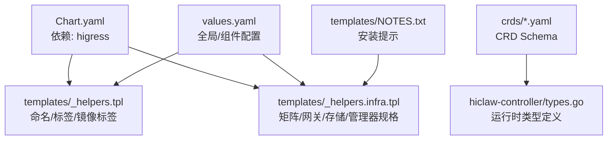
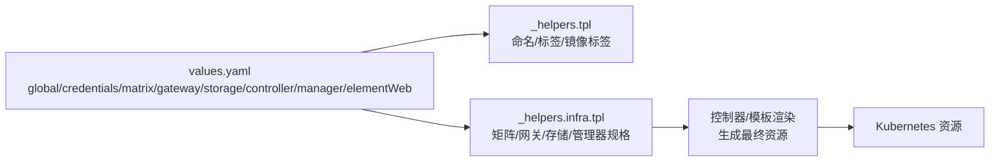
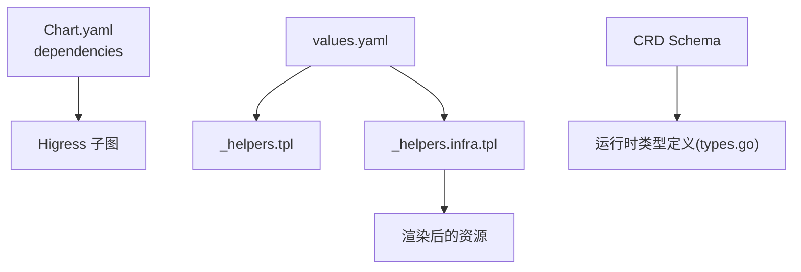
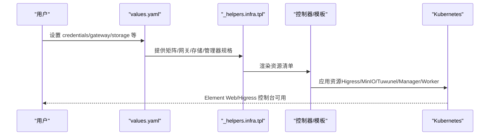

# Helm Chart 配置详解

<cite>
**本文引用的文件**
- [values.yaml](file://helm/hiclaw/values.yaml)
- [Chart.yaml](file://helm/hiclaw/Chart.yaml)
- [_helpers.tpl](file://helm/hiclaw/templates/_helpers.tpl)
- [_helpers.infra.tpl](file://helm/hiclaw/templates/_helpers.infra.tpl)
- [NOTES.txt](file://helm/hiclaw/templates/NOTES.txt)
- [humans.hiclaw.io.yaml](file://helm/hiclaw/crds/humans.hiclaw.io.yaml)
- [managers.hiclaw.io.yaml](file://helm/hiclaw/crds/managers.hiclaw.io.yaml)
- [workers.hiclaw.io.yaml](file://helm/hiclaw/crds/workers.hiclaw.io.yaml)
- [teams.hiclaw.io.yaml](file://helm/hiclaw/crds/teams.hiclaw.io.yaml)
- [types.go](file://hiclaw-controller/api/v1beta1/types.go)
- [architecture.md](file://docs/architecture.md)
- [quickstart.md](file://docs/quickstart.md)
</cite>

## 目录
1. [简介](#简介)
2. [项目结构](#项目结构)
3. [核心组件与配置总览](#核心组件与配置总览)
4. [架构概览](#架构概览)
5. [详细组件配置分析](#详细组件配置分析)
6. [依赖关系分析](#依赖关系分析)
7. [性能与资源规划建议](#性能与资源规划建议)
8. [故障排查指南](#故障排查指南)
9. [结论](#结论)
10. [附录：配置示例与最佳实践](#附录配置示例与最佳实践)

## 简介
本文件面向使用 HiClaw Helm Chart 的运维与平台工程师，系统性解读 values.yaml 中各配置块的语义、默认值、取值范围与最佳实践，并结合 CRD 定义与模板逻辑，给出不同部署场景（本地开发、Kubernetes、阿里云 ACK）的配置差异与组合建议。文档同时提供配置流程图与时序图，帮助快速定位问题与优化资源配置。

## 项目结构
Helm Chart 核心位于 helm/hiclaw，包含：
- values.yaml：全局与各组件默认配置
- Chart.yaml：Chart 元数据与依赖声明
- templates/：渲染后的 Kubernetes 资源模板（含命名与 URL 辅助）
- crds/：HiClaw CRD 定义（用于声明式管理 Manager/Worker/Team/Human）

图表来源
- [Chart.yaml:23-28](file://helm/hiclaw/Chart.yaml#L23-L28)
- [_helpers.tpl:1-190](file://helm/hiclaw/templates/_helpers.tpl#L1-L190)
- [_helpers.infra.tpl:1-104](file://helm/hiclaw/templates/_helpers.infra.tpl#L1-L104)
- [values.yaml:1-263](file://helm/hiclaw/values.yaml#L1-L263)
- [NOTES.txt:1-23](file://helm/hiclaw/templates/NOTES.txt#L1-L23)

章节来源
- [Chart.yaml:1-28](file://helm/hiclaw/Chart.yaml#L1-L28)
- [values.yaml:1-263](file://helm/hiclaw/values.yaml#L1-L263)
- [_helpers.tpl:1-190](file://helm/hiclaw/templates/_helpers.tpl#L1-L190)
- [_helpers.infra.tpl:1-104](file://helm/hiclaw/templates/_helpers.infra.tpl#L1-L104)
- [NOTES.txt:1-23](file://helm/hiclaw/templates/NOTES.txt#L1-L23)

## 核心组件与配置总览
- 全局配置（global）
  - 命名空间与镜像仓库/标签：namespace、imageRegistry、imageTag
- 凭据（credentials）
  - 注册令牌、管理员账号密码、LLM 凭据与模型、基础地址
- 矩阵（matrix）
  - 提供商（tuwunel/synapse）、模式（managed/existing）、内部 URL/ServerName、Tuwunel 镜像/资源/持久化等
- 网关（gateway）
  - 提供商（higress/ai-gateway）、模式（managed/existing）、公共 URL、Higress 子图开关、阿里云 APIG 参数
- 对象存储（storage）
  - 提供商（minio/oss）、模式（managed/existing）、桶名、OSS 区域/端点覆盖
- Higress 子图（higress）
  - 控制面副本、服务端口、控制台密码初始化
- 凭据提供器（credentialProvider）
  - 是否启用、镜像、资源、端口、环境变量与注入
- 控制器（controller）
  - 副本、镜像、服务、资源、后端类型、前缀、SA、时区
- 管理员代理（manager）
  - 是否创建初始 Manager CR、模型、运行时、镜像、资源
- Element Web（elementWeb）
  - 是否启用、镜像、副本、资源、服务
- 观测（cms）
  - 是否启用、端点、密钥、项目/工作空间、服务名、指标开关
- 工作负载默认（worker）
  - 各运行时默认镜像仓库/标签、默认运行时、资源

章节来源
- [values.yaml:8-263](file://helm/hiclaw/values.yaml#L8-L263)

## 架构概览
下图展示 values.yaml 中的关键配置如何影响模板渲染与运行时行为（矩阵/网关/存储/管理器规格）：

图表来源
- [values.yaml:1-263](file://helm/hiclaw/values.yaml#L1-L263)
- [_helpers.tpl:1-190](file://helm/hiclaw/templates/_helpers.tpl#L1-L190)
- [_helpers.infra.tpl:1-104](file://helm/hiclaw/templates/_helpers.infra.tpl#L1-L104)

章节来源
- [values.yaml:1-263](file://helm/hiclaw/values.yaml#L1-L263)
- [_helpers.tpl:1-190](file://helm/hiclaw/templates/_helpers.tpl#L1-L190)
- [_helpers.infra.tpl:1-104](file://helm/hiclaw/templates/_helpers.infra.tpl#L1-L104)

## 详细组件配置分析

### 全局配置（global）
- 命名空间
  - 作用：覆盖 Release 命名空间；为空则使用 .Release.Namespace
  - 默认值：空字符串
  - 取值范围：任意有效命名空间名称
  - 最佳实践：在多租户或隔离环境中显式设置
- 镜像仓库与标签
  - imageRegistry：统一镜像仓库前缀（如阿里云 CR）
  - imageTag：若为空则回退到 Chart.AppVersion 派生的 vX.Y.Z
  - 最佳实践：CI/CD 中通过 imageTag 固定版本，避免漂移

章节来源
- [values.yaml:8-13](file://helm/hiclaw/values.yaml#L8-L13)
- [_helpers.tpl:50-74](file://helm/hiclaw/templates/_helpers.tpl#L50-L74)

### 凭据（credentials）
- registrationToken：Matrix 注册令牌；留空则自动生成
- adminUser/adminPassword：管理员账号与密码；留空则自动生成
- llmApiKey：必需字段，LLM 访问密钥
- llmProvider/defaultModel/llmBaseUrl：提供商、默认模型与兼容 OpenAI 的基础 URL
- 最佳实践：生产环境务必显式设置 adminPassword 并轮换；LLM 密钥通过 Secret 注入

章节来源
- [values.yaml:15-24](file://helm/hiclaw/values.yaml#L15-L24)

### 矩阵（matrix）
- provider：tuwunel 或 synapse
- mode：managed 或 existing
  - managed：由 Chart 自管 Tuwunel（StatefulSet），自动派生 internalURL 与 serverName
  - existing：使用外部 Synapse，需显式提供 internalURL 与 serverName
- tuwunel 配置
  - 镜像仓库/标签/拉取策略
  - 副本数、CPU/内存请求/限制
  - 服务类型与端口
  - 持久化：启用、容量、StorageClass、挂载路径
  - extraEnv：透传环境变量
- synapse：保留块，当前未在模板中使用
- 最佳实践：本地开发用 managed；生产对接自有 Synapse 时选择 existing 并提供准确 internalURL/serverName

章节来源
- [values.yaml:25-54](file://helm/hiclaw/values.yaml#L25-L54)
- [_helpers.infra.tpl:10-24](file://helm/hiclaw/templates/_helpers.infra.tpl#L10-L24)
- [_helpers.tpl:120-134](file://helm/hiclaw/templates/_helpers.tpl#L120-L134)

### 网关（gateway）
- provider：higress 或 ai-gateway
- mode：managed 或 existing
  - managed：Chart 内部子图部署 Higress
  - existing：外部阿里云 APIG，控制器仅管理消费者
- publicURL：浏览器/客户端访问的公网 URL（必填）
- higress.enabled：是否启用 Higress 子图
- ai-gateway 参数：region、gatewayId、modelApiId、envId（当 provider=ai-gateway 时必填）
- 最佳实践：ACK 环境优先使用 ai-gateway（existing）以复用企业网关能力；本地/测试可用 managed

章节来源
- [values.yaml:55-71](file://helm/hiclaw/values.yaml#L55-L71)
- [_helpers.infra.tpl:26-52](file://helm/hiclaw/templates/_helpers.infra.tpl#L26-L52)
- [Chart.yaml:23-28](file://helm/hiclaw/Chart.yaml#L23-L28)

### 对象存储（storage）
- provider：minio 或 oss
- mode：managed 或 existing
  - managed：Chart 内部部署 MinIO（StatefulSet），提供静态根凭据与控制台
  - existing：外部 OSS，控制器通过 credentialProvider 获取 STS 凭据
- bucket：存储桶名称（必填）
- oss：region、endpoint（可选覆盖）
- minio：镜像、资源、服务端口、持久化、rootUser/rootPassword
- 最佳实践：生产推荐 OSS（existing）+ credentialProvider；本地开发可用 minio（managed）

章节来源
- [values.yaml:72-111](file://helm/hiclaw/values.yaml#L72-L111)
- [_helpers.infra.tpl:58-94](file://helm/hiclaw/templates/_helpers.infra.tpl#L58-L94)

### Higress 子图（higress）
- global.local：kind/minikube 环境关闭云 LoadBalancer
- higress-core.gateway：副本数、HTTP/HTTPS 端口、服务类型与端口
- higress-core.controller：副本数、镜像
- higress-console.admin.password：留空由控制器通过 /system/init 初始化（基于 credentials.adminPassword）
- 最佳实践：按集群规模调整副本数；生产环境开启 TLS 与鉴权

章节来源
- [values.yaml:112-142](file://helm/hiclaw/values.yaml#L112-L142)

### 凭据提供器（credentialProvider）
- enabled：当 gateway.provider=ai-gateway 或 storage.provider=oss 时自动强制为 true
- image：仓库/标签/拉取策略
- port/resources/env/envFrom：端口、资源、环境变量与注入
- 最佳实践：在云上部署时必须提供该 Sidecar，实现按需 STS 授权

章节来源
- [values.yaml:143-165](file://helm/hiclaw/values.yaml#L143-L165)

### 控制器（controller）
- replicaCount：高可用建议 >1 并启用主控选举
- image：仓库/标签/拉取策略
- service：类型与端口
- resources：CPU/内存请求/限制
- workerBackend：k8s 或 sae（当前仅 k8s 生效）
- resourcePrefix：资源前缀
- serviceAccount：创建/名称/注解
- env/timezone：环境变量与时区
- 最佳实践：生产环境增加副本与资源配额，确保控制器稳定

章节来源
- [values.yaml:166-192](file://helm/hiclaw/values.yaml#L166-L192)

### 管理员代理（manager）
- enabled：启动时是否创建初始 Manager CR
- model：默认模型，缺省取 credentials.defaultModel
- runtime：openclaw/copaw/hermes（当前 Chart 仅支持 openclaw/copaw）
- image：仓库/标签
- resources：CPU/内存请求/限制
- 最佳实践：根据团队偏好选择 runtime；生产环境固定镜像标签

章节来源
- [values.yaml:193-211](file://helm/hiclaw/values.yaml#L193-L211)
- [_helpers.infra.tpl:95-103](file://helm/hiclaw/templates/_helpers.infra.tpl#L95-L103)

### Element Web（elementWeb）
- enabled：是否部署 Element Web
- image：仓库/标签/拉取策略
- replicaCount：副本数
- resources：CPU/内存请求/限制
- service：类型与端口
- 最佳实践：本地开发建议启用；生产可通过网关统一暴露

章节来源
- [values.yaml:212-230](file://helm/hiclaw/values.yaml#L212-L230)

### 观测（cms）
- enabled：是否启用阿里云 CMS 2.0（ARMS）集成
- endpoint/licenseKey/project/workspace/serviceName/metricsEnabled：导出 OTLP 的必要参数
- 最佳实践：生产环境开启并配置正确的凭证与项目信息

章节来源
- [values.yaml:231-242](file://helm/hiclaw/values.yaml#L231-L242)

### 工作负载默认（worker）
- defaultImage.openclaw/copaw/hermes：各运行时默认镜像仓库/标签
- defaultRuntime：默认运行时（openclaw/copaw/hermes）
- resources：CPU/内存请求/限制
- 最佳实践：按任务类型与并发需求调优资源；生产环境建议固定镜像标签

章节来源
- [values.yaml:243-263](file://helm/hiclaw/values.yaml#L243-L263)

## 依赖关系分析
- Chart 依赖
  - 当 gateway.higress.enabled 为真时，Chart 条件依赖 Higress Helm 仓库中的 higress 子图
- 模板依赖
  - _helpers.tpl 提供命名、标签、镜像标签派生
  - _helpers.infra.tpl 将 values 抽象为矩阵/网关/存储/管理器规格等基础设施抽象
- 运行时依赖
  - CRD 定义与控制器类型保持一致，确保 values 与 CR 字段映射正确

图表来源
- [Chart.yaml:23-28](file://helm/hiclaw/Chart.yaml#L23-L28)
- [_helpers.tpl:1-190](file://helm/hiclaw/templates/_helpers.tpl#L1-L190)
- [_helpers.infra.tpl:1-104](file://helm/hiclaw/templates/_helpers.infra.tpl#L1-L104)
- [types.go:1-448](file://hiclaw-controller/api/v1beta1/types.go#L1-L448)

章节来源
- [Chart.yaml:23-28](file://helm/hiclaw/Chart.yaml#L23-L28)
- [_helpers.tpl:1-190](file://helm/hiclaw/templates/_helpers.tpl#L1-L190)
- [_helpers.infra.tpl:1-104](file://helm/hiclaw/templates/_helpers.infra.tpl#L1-L104)
- [types.go:1-448](file://hiclaw-controller/api/v1beta1/types.go#L1-L448)

## 性能与资源规划建议
- CPU/内存
  - 控制器、管理器、MinIO、Higress 均有明确的 requests/limits，建议按并发与任务复杂度适度上调
- 存储
  - MinIO 持久化容量与 StorageClass 选择直接影响对象存储吞吐与可靠性
- 网络
  - gateway.publicURL 必须可达；Higress 控制台与网关端口需在集群内可达
- 并发与副本
  - controller replicaCount 建议 ≥2；elementWeb/minio/tuwunel 副本按流量与数据量评估

[本节为通用建议，无需特定文件引用]

## 故障排查指南
- 缺少必填项
  - gateway.publicURL：必须显式填写
  - storage.bucket：必须显式填写
  - credentials.llmApiKey：必须填写
- 网关/存储/矩阵组合不支持
  - _helpers.infra.tpl 中对不支持的组合会触发错误（例如未知的 provider/mode 组合）
- 安装后访问
  - NOTES.txt 提供端口转发与登录指引，可据此验证 Element Web 与 Higress 控制台连通性

章节来源
- [_helpers.infra.tpl:26-71](file://helm/hiclaw/templates/_helpers.infra.tpl#L26-L71)
- [NOTES.txt:1-23](file://helm/hiclaw/templates/NOTES.txt#L1-L23)

## 结论
HiClaw Helm Chart 通过 values.yaml 将矩阵、网关、存储、控制器、管理器与工作负载进行统一编排。结合 CRD 与模板辅助函数，可在本地与云端（含阿里云 ACK）灵活部署。生产环境建议：
- 使用 existing 模式的网关与存储（ai-gateway/OSS + credentialProvider）
- 显式设置敏感参数（adminPassword、llmApiKey、publicURL、bucket）
- 固定镜像标签并合理分配资源
- 通过 CRD 与控制器实现声明式管理

[本节为总结，无需特定文件引用]

## 附录：配置示例与最佳实践

### 不同部署场景的配置要点
- 本地开发（kind/minikube）
  - matrix.mode=managed；gateway.mode=managed；storage.mode=managed
  - higress.global.local=true；elementWeb.enabled=true
  - credentials.llmApiKey 必填；adminPassword 建议显式设置
- 生产环境（自管 Synapse）
  - matrix.mode=existing；提供 internalURL 与 serverName
  - gateway.mode=existing；provider=ai-gateway；填写 region/gatewayId/modelApiId/envId
  - storage.mode=existing；provider=oss；填写 region/endpoint
  - credentialProvider.enabled=true；提供 STS 服务
- 阿里云 ACK
  - 同“生产环境”，配合阿里云网关与 OSS；通过 credentialProvider 实现最小权限授权

章节来源
- [values.yaml:25-111](file://helm/hiclaw/values.yaml#L25-L111)
- [_helpers.infra.tpl:10-71](file://helm/hiclaw/templates/_helpers.infra.tpl#L10-L71)

### 关键流程与时序（安装与初始化）

图表来源
- [values.yaml:15-111](file://helm/hiclaw/values.yaml#L15-L111)
- [_helpers.infra.tpl:10-103](file://helm/hiclaw/templates/_helpers.infra.tpl#L10-L103)

### CRD 字段与运行时类型映射
- Manager/Worker/Team/Human 的 CRD 字段与控制器类型定义保持一致，确保 values 与 CR 的字段映射正确
- 示例参考：
  - ManagerSpec/Runtime/Image/Skills/McpServers/Package/Config/State/AccessEntries/Labels
  - WorkerSpec/Runtime/Image/Identity/Soul/Agents/Skills/McpServers/Package/Expose/ChannelPolicy/State/AccessEntries/Labels
  - TeamSpec/Admin/Leader/Workers/PeerMentions/ChannelPolicy
  - HumanSpec/Status

章节来源
- [managers.hiclaw.io.yaml:1-171](file://helm/hiclaw/crds/managers.hiclaw.io.yaml#L1-L171)
- [workers.hiclaw.io.yaml:1-204](file://helm/hiclaw/crds/workers.hiclaw.io.yaml#L1-L204)
- [teams.hiclaw.io.yaml:1-351](file://helm/hiclaw/crds/teams.hiclaw.io.yaml#L1-L351)
- [humans.hiclaw.io.yaml:1-84](file://helm/hiclaw/crds/humans.hiclaw.io.yaml#L1-L84)
- [types.go:64-447](file://hiclaw-controller/api/v1beta1/types.go#L64-L447)

### 配置校验与安装提示
- NOTES.txt 提供安装后的访问方式与登录信息，便于快速验证
- 参考文档：Quickstart 与 Architecture 文档，了解端到端流程与容器布局

章节来源
- [NOTES.txt:1-23](file://helm/hiclaw/templates/NOTES.txt#L1-L23)
- [quickstart.md:1-356](file://docs/quickstart.md#L1-L356)
- [architecture.md:1-235](file://docs/architecture.md#L1-L235)