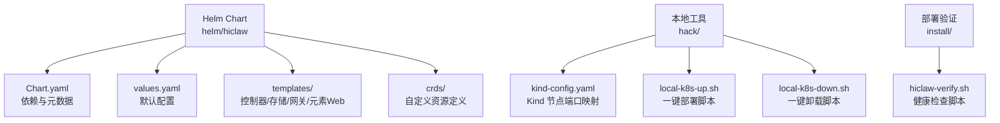
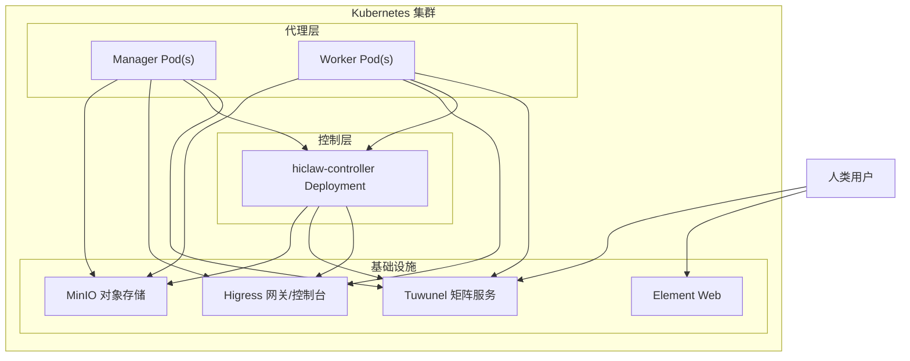
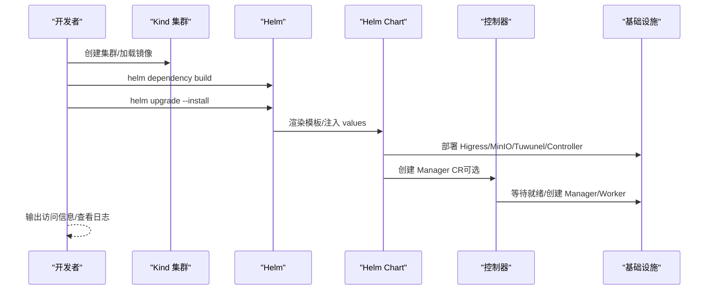
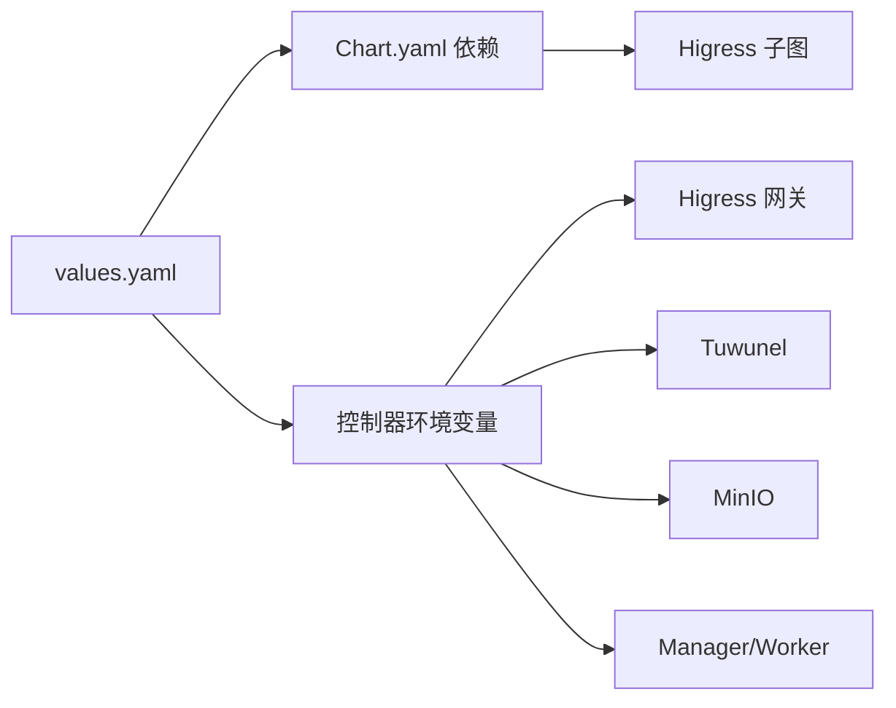

# Kubernetes 集群部署

<cite>
**本文引用的文件**
- [values.yaml](file://helm/hiclaw/values.yaml)
- [Chart.yaml](file://helm/hiclaw/Chart.yaml)
- [kind-config.yaml](file://hack/kind-config.yaml)
- [local-k8s-up.sh](file://hack/local-k8s-up.sh)
- [local-k8s-down.sh](file://hack/local-k8s-down.sh)
- [_helpers.tpl](file://helm/hiclaw/templates/_helpers.tpl)
- [deployment.yaml](file://helm/hiclaw/templates/controller/deployment.yaml)
- [minio-statefulset.yaml](file://helm/hiclaw/templates/storage/minio-statefulset.yaml)
- [runtime-env.yaml](file://helm/hiclaw/templates/secrets/runtime-env.yaml)
- [humans.hiclaw.io.yaml](file://helm/hiclaw/crds/humans.hiclaw.io.yaml)
- [hiclaw-verify.sh](file://install/hiclaw-verify.sh)
- [architecture.md](file://docs/architecture.md)
- [quickstart.md](file://docs/quickstart.md)
</cite>

## 目录
1. [简介](#简介)
2. [项目结构](#项目结构)
3. [核心组件](#核心组件)
4. [架构总览](#架构总览)
5. [详细组件分析](#详细组件分析)
6. [依赖关系分析](#依赖关系分析)
7. [性能考虑](#性能考虑)
8. [故障排查指南](#故障排查指南)
9. [结论](#结论)
10. [附录](#附录)

## 简介
本指南面向在 Kubernetes 集群中部署 HiClaw 的工程师与运维人员，覆盖 Helm Chart 的配置项、部署流程、集群准备、Ingress/网关配置、存储与对象存储、网络策略、服务发现与负载均衡、部署验证、运维与故障排查等内容。文档同时提供 Kind 本地集群搭建与 Minikube 部署的参考路径，并给出多环境下的最佳实践。

## 项目结构
HiClaw 的 Kubernetes 部署主要由 Helm Chart 提供，核心位于 helm/hiclaw 目录，包含 Chart 描述、CRD、模板与默认配置。配套的本地开发工具位于 hack/ 目录，提供 Kind 集群创建与一键安装脚本。部署验证脚本位于 install/ 目录，用于对安装后的服务进行健康检查。

图表来源
- [Chart.yaml:1-28](file://helm/hiclaw/Chart.yaml#L1-L28)
- [values.yaml:1-263](file://helm/hiclaw/values.yaml#L1-L263)
- [kind-config.yaml:1-17](file://hack/kind-config.yaml#L1-L17)
- [local-k8s-up.sh:1-260](file://hack/local-k8s-up.sh#L1-L260)
- [local-k8s-down.sh:1-28](file://hack/local-k8s-down.sh#L1-L28)
- [hiclaw-verify.sh:1-176](file://install/hiclaw-verify.sh#L1-L176)

章节来源
- [Chart.yaml:1-28](file://helm/hiclaw/Chart.yaml#L1-L28)
- [values.yaml:1-263](file://helm/hiclaw/values.yaml#L1-L263)
- [kind-config.yaml:1-17](file://hack/kind-config.yaml#L1-L17)
- [local-k8s-up.sh:1-260](file://hack/local-k8s-up.sh#L1-L260)
- [local-k8s-down.sh:1-28](file://hack/local-k8s-down.sh#L1-L28)
- [hiclaw-verify.sh:1-176](file://install/hiclaw-verify.sh#L1-L176)

## 核心组件
- 控制器（hiclaw-controller）
  - 负责 CRD（Worker/Manager/Team/Human）的协调、Worker 生命周期管理、Higress 消费者与路由、对象存储凭证下发等。
  - 在 Kubernetes 模式下以“incluster”方式运行，通过 Service 与内部组件通信。
- 管理员（Manager）
  - 作为协调者，负责任务、团队、人类参与者与 MCP 的编排；支持 OpenClaw/CoPaw/Hermes 三种运行时。
- 工作者（Worker）
  - 任务执行器，按需创建；状态与工件存于对象存储，具备可替换性。
- 网关（Higress）
  - AI 网关与 API 网关，提供 LLM 流量与 MCP 服务路由，支持消费者级鉴权。
- 存储（MinIO）
  - 提供对象存储能力，用于共享工作空间、任务树与配置同步。
- 矩阵（Tuwunel）
  - 基于 conduwuit 的 Homeserver，提供 IM 通信与人类监督。
- 元素 Web（Element Web）
  - IM UI，便于人类用户接入。

章节来源
- [deployment.yaml:1-234](file://helm/hiclaw/templates/controller/deployment.yaml#L1-L234)
- [values.yaml:166-263](file://helm/hiclaw/values.yaml#L166-L263)
- [architecture.md:1-235](file://docs/architecture.md#L1-L235)

## 架构总览
下图展示 HiClaw 在 Kubernetes 中的逻辑与部署形态，以及各组件间的交互关系。

图表来源
- [architecture.md:19-82](file://docs/architecture.md#L19-L82)
- [deployment.yaml:1-234](file://helm/hiclaw/templates/controller/deployment.yaml#L1-L234)
- [minio-statefulset.yaml:1-79](file://helm/hiclaw/templates/storage/minio-statefulset.yaml#L1-L79)

章节来源
- [architecture.md:1-235](file://docs/architecture.md#L1-L235)

## 详细组件分析

### Helm Chart 配置与最佳实践
- 全局与命名空间
  - global.namespace 用于覆盖 Release 命名空间；global.imageRegistry/global.imageTag 用于统一镜像仓库与标签。
- 凭据与 LLM
  - credentials.llmApiKey 为必需项；credentials.llmProvider、credentials.defaultModel、credentials.llmBaseUrl 用于指定提供商与默认模型。
- 矩阵（Matrix）
  - provider 支持 tuwunel/synapse；mode 支持 managed/existing；managed 模式下内部 URL 与 serverName 自动推导。
- 网关（Gateway）
  - provider 支持 higress/ai-gateway；mode 支持 managed/existing；publicURL 为浏览器/公共入口 URL。
  - 当 provider=higress 且 mode=managed 时，Chart 会启用 Higress 子图。
- 存储（Storage）
  - provider 支持 minio/oss；mode 支持 managed/existing；bucket 为默认桶名。
  - managed 模式下 MinIO StatefulSet 与持久化卷可配置；oss 模式下通过 STS 凭证侧车获取临时凭证。
- 控制器（Controller）
  - replicaCount 支持高可用（配合主控选举）；controller.service 为内部服务；workerBackend 支持 k8s/sae。
  - 通过环境变量注入矩阵、网关、存储、CMS 等连接信息。
- 管理员（Manager）
  - enabled=true 时，控制器在初始化时创建 Manager CR；runtime 支持 openclaw/copaw/hermes。
- 元素 Web（Element Web）
  - 可选组件，提供 IM UI。
- CMS 观测性
  - cms.enabled=true 时，开启 OTLP 指标与追踪导出至阿里云 CMS 2.0。
- Worker 默认镜像与资源
  - worker.defaultImage.*.repository/tag 指定不同运行时的默认镜像；worker.resources.limits/requests 控制默认资源。

章节来源
- [values.yaml:1-263](file://helm/hiclaw/values.yaml#L1-L263)

### 控制器部署与环境变量
控制器 Deployment 通过环境变量将 Chart 配置注入到 Pod 中，包括：
- 运行模式与命名空间、控制器实例名、资源前缀、Worker 后端类型、默认 Worker 运行时、时区等。
- 存储提供方与端点、桶名、访问密钥/密钥（当 provider=minio 时）。
- 网关提供方与 URL、区域、网关实例 ID、模型 API ID、环境 ID（当 provider=ai-gateway 时）。
- 可选的凭证侧车地址。
- 矩阵连接信息（URL、Domain）。
- K8s 模式下的 Worker 资源默认值。
- Manager CR 驱动部署开关与规格。
- 可选的 Element Web URL。
- 可选的 CMS 观测性参数。

章节来源
- [deployment.yaml:1-234](file://helm/hiclaw/templates/controller/deployment.yaml#L1-L234)
- [_helpers.tpl:1-190](file://helm/hiclaw/templates/_helpers.tpl#L1-L190)

### MinIO 存储与持久化
- 当 storage.provider=minio 时，渲染 MinIO StatefulSet，包含：
  - 容器端口（API/Console）、探针、资源限制。
  - 环境变量来自 Secret（根账号凭据）。
  - 可选的持久化卷声明（PVC）与大小、StorageClass。
- 当 storage.mode=existing 且 provider=oss 时，控制器通过凭证侧车获取 STS 临时凭证，不创建桶/用户/策略。

章节来源
- [minio-statefulset.yaml:1-79](file://helm/hiclaw/templates/storage/minio-statefulset.yaml#L1-L79)
- [values.yaml:72-111](file://helm/hiclaw/values.yaml#L72-L111)

### 网关与 Ingress/负载均衡
- Higress 子图
  - Chart 依赖 higress 子图；在 kind/minikube 场景下，global.local=true，服务类型为 ClusterIP。
  - 控制器通过 HICLAW_AI_GATEWAY_ADMIN_URL/HICLAW_AI_GATEWAY_URL 注入网关管理与业务 URL。
- Ingress/NodePort/LoadBalancer
  - 在 Kind 场景下，kind-config.yaml 映射 NodePort 30080 到主机 18080；生产环境建议通过 Ingress/LoadBalancer 暴露 Higress。
  - 控制器通过 HICLAW_GATEWAY_PROVIDER 与 HICLAW_AI_GATEWAY_URL 等环境变量感知网关配置。

章节来源
- [Chart.yaml:23-28](file://helm/hiclaw/Chart.yaml#L23-L28)
- [values.yaml:55-71](file://helm/hiclaw/values.yaml#L55-L71)
- [deployment.yaml:98-116](file://helm/hiclaw/templates/controller/deployment.yaml#L98-L116)
- [_helpers.tpl:144-155](file://helm/hiclaw/templates/_helpers.tpl#L144-L155)
- [kind-config.yaml:1-17](file://hack/kind-config.yaml#L1-L17)

### 服务发现与负载均衡
- 控制器通过 Service 名称与命名空间进行服务发现，例如：
  - Tuwunel: <fullname>-tuwunel.<namespace>.svc.cluster.local
  - MinIO: <fullname>-minio.<namespace>.svc.cluster.local
  - Controller: <fullname>-controller.<namespace>.svc.cluster.local
  - Element Web: <fullname>-element-web.<namespace>.svc.cluster.local
- Higress 网关与控制台通过服务名暴露，控制器注入 HICLAW_HIGRESS_GATEWAY_URL/HICLAW_HIGRESS_CONSOLE_URL 等。

章节来源
- [_helpers.tpl:120-155](file://helm/hiclaw/templates/_helpers.tpl#L120-L155)

### 管理员与 Worker 的 CRD 驱动
- CRD 定义了 Human/Manager/Team/Worker 的规范与状态字段，控制器基于这些 CR 进行资源编排。
- Manager CR 的创建由控制器在初始化阶段执行（当 manager.enabled=true 时），随后控制器创建 Manager Pod 并按需创建 Worker。

章节来源
- [humans.hiclaw.io.yaml:1-84](file://helm/hiclaw/crds/humans.hiclaw.io.yaml#L1-L84)
- [deployment.yaml:137-141](file://helm/hiclaw/templates/controller/deployment.yaml#L137-L141)

### 部署流程（Kind 本地集群）
- 前置条件
  - 安装 kind、helm、kubectl、docker。
  - 准备 LLM API Key（HICLAW_LLM_API_KEY）。
- 步骤概览
  1) 创建 Kind 集群（可复用现有集群）。
  2) 构建并加载本地镜像到 Kind 节点，或使用远程镜像。
  3) 构建 Helm 依赖。
  4) 执行 Helm 升级安装，设置 gateway.publicURL、credentials.llmApiKey 等。
  5) 等待核心基础设施（Tuwunel、MinIO、Controller）就绪。
  6) 输出访问信息（Element Web、控制器日志、管理员日志）。

图表来源
- [local-k8s-up.sh:53-260](file://hack/local-k8s-up.sh#L53-L260)
- [Chart.yaml:23-28](file://helm/hiclaw/Chart.yaml#L23-L28)
- [deployment.yaml:137-141](file://helm/hiclaw/templates/controller/deployment.yaml#L137-L141)

章节来源
- [local-k8s-up.sh:1-260](file://hack/local-k8s-up.sh#L1-L260)
- [kind-config.yaml:1-17](file://hack/kind-config.yaml#L1-L17)

### 部署验证（Kubernetes）
- 验证要点
  - 控制器 Deployment 就绪。
  - MinIO/Matrix API 内部可达。
  - Higress 网关与控制台对外可达（NodePort/Ingress）。
  - Manager Agent 健康（根据运行时选择不同的健康检查）。
- Kubernetes 下的注意事项
  - 容器检测：在 K8s 下应使用 kubectl 替代 docker/podman。
  - 内部服务检查：使用 kubectl exec 或 port-forward 检查服务。
  - 外部访问检查：使用 NodePort/Ingress 地址替代本机 127.0.0.1。

章节来源
- [hiclaw-verify.sh:10-38](file://install/hiclaw-verify.sh#L10-L38)
- [hiclaw-verify.sh:40-176](file://install/hiclaw-verify.sh#L40-L176)

## 依赖关系分析
- Chart 依赖
  - Higress 子图（当 gateway.higress.enabled=true 时）。
- 组件耦合
  - 控制器与 Higress、Tuwunel、MinIO 强耦合；通过环境变量传递连接信息。
  - Manager/Worker 通过控制器提供的凭据与路由进行通信。
- 外部集成
  - OSS/阿里云 APIG：通过 credentialProvider 侧车获取 STS 凭证与消费者授权。
  - CMS：可选的 OTLP 导出，影响 Manager 与 Worker 的可观测性。

图表来源
- [Chart.yaml:23-28](file://helm/hiclaw/Chart.yaml#L23-L28)
- [values.yaml:55-111](file://helm/hiclaw/values.yaml#L55-L111)
- [deployment.yaml:98-168](file://helm/hiclaw/templates/controller/deployment.yaml#L98-L168)

章节来源
- [Chart.yaml:23-28](file://helm/hiclaw/Chart.yaml#L23-L28)
- [values.yaml:55-111](file://helm/hiclaw/values.yaml#L55-L111)
- [deployment.yaml:98-168](file://helm/hiclaw/templates/controller/deployment.yaml#L98-L168)

## 性能考虑
- 资源配额
  - 控制器、Manager、Worker 的 requests/limits 应结合实际负载调优；默认值可按需放大。
- 存储 IOPS
  - MinIO PVC 的 StorageClass 与容量应满足并发写入需求；必要时启用本地 SSD 或高性能存储类。
- 网络延迟
  - Higress 控制平面与数据平面分离部署可降低跨节点延迟；Ingress 层面启用压缩与缓存可提升用户体验。
- 并发与副本
  - 控制器副本数可提升 HA；Worker 数量随任务并发度动态扩展。
- 观测性
  - 启用 CMS/OTLP 可视化链路与指标，但注意带宽与存储成本。

## 故障排查指南
- 控制器未就绪
  - 检查控制器日志与健康探针；确认 values 中的 LLM API Key、矩阵与网关 URL 正确。
- MinIO 不可用
  - 检查 PVC/StorageClass、探针状态与 Secret；确认控制器注入的访问密钥正确。
- 网关不可达
  - 在 Kind 环境下确认 NodePort 映射；生产环境确认 Ingress/LoadBalancer 配置。
- Manager/Worker 无法注册/认证
  - 检查 Registration Token、管理员密码、矩阵服务连通性。
- 验证脚本（K8s 场景）
  - 将脚本中的 Docker/Podman 检测与端口检测替换为 kubectl；内部服务检查改为通过 Service/ClusterIP；外部访问改为通过 Ingress/NodePort。

章节来源
- [hiclaw-verify.sh:10-38](file://install/hiclaw-verify.sh#L10-L38)
- [hiclaw-verify.sh:40-176](file://install/hiclaw-verify.sh#L40-L176)

## 结论
通过 Helm Chart，HiClaw 在 Kubernetes 中实现了基础设施与应用的解耦：Higress、Tuwunel、MinIO、Element Web 作为独立组件，控制器负责编排与治理。结合 Kind/Minikube 的本地部署脚本与 K8s 生产环境的最佳实践，可快速完成从开发到生产的迁移。建议在生产环境中完善 Ingress/负载均衡、存储与网络策略、观测性与备份恢复方案，并持续优化资源配额与并发策略。

## 附录

### 常用部署命令与参数
- Kind 一键部署
  - 设置 HICLAW_LLM_API_KEY 后执行本地脚本，自动构建镜像并安装。
- Values 覆盖示例
  - 网关公开地址：--set gateway.publicURL="http://your-domain:80"
  - 存储提供方切换：--set storage.provider=oss
  - 控制器副本数：--set controller.replicaCount=2
- 验证
  - kubectl get pods -n <namespace>；kubectl logs -f deployment/hiclaw-controller -n <namespace>

章节来源
- [local-k8s-up.sh:176-197](file://hack/local-k8s-up.sh#L176-L197)
- [values.yaml:55-111](file://helm/hiclaw/values.yaml#L55-L111)