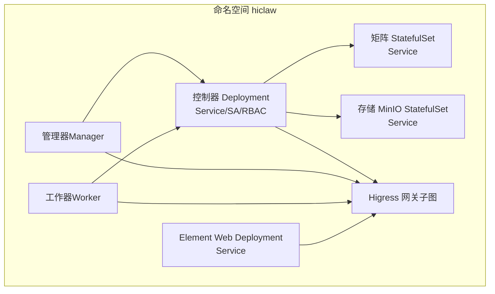
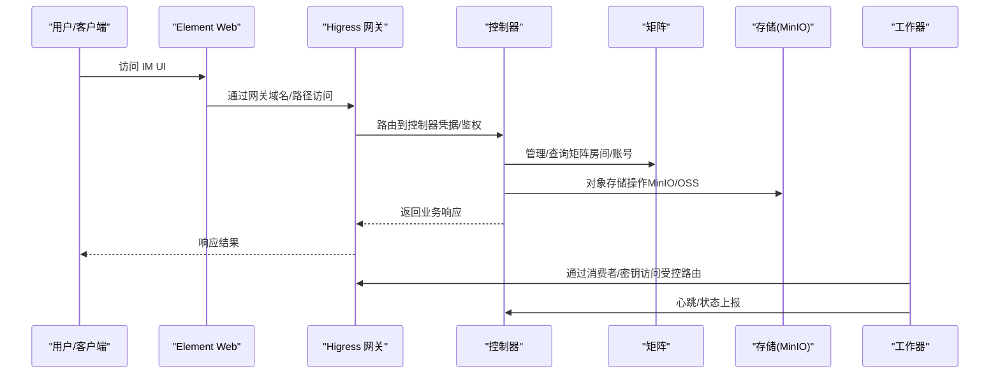
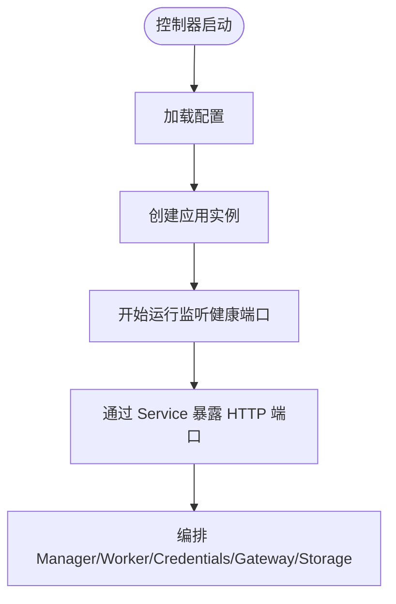
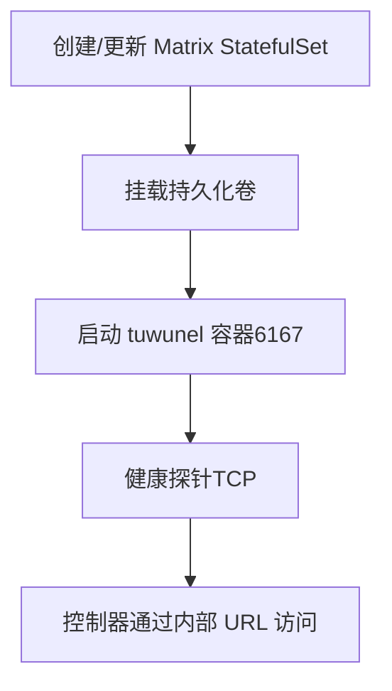
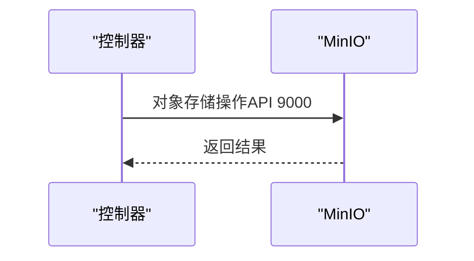
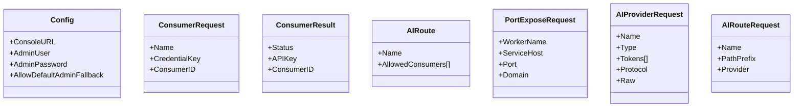
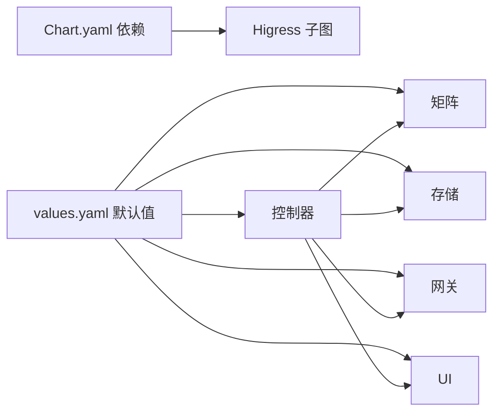

# 服务与网络配置

<cite>
**本文引用的文件**
- [Chart.yaml](file://helm/hiclaw/Chart.yaml)
- [values.yaml](file://helm/hiclaw/values.yaml)
- [deployment.yaml（控制器）](file://helm/hiclaw/templates/controller/deployment.yaml)
- [rbac.yaml（控制器）](file://helm/hiclaw/templates/controller/rbac.yaml)
- [service.yaml（控制器）](file://helm/hiclaw/templates/controller/service.yaml)
- [serviceaccount.yaml（控制器）](file://helm/hiclaw/templates/controller/serviceaccount.yaml)
- [tuwunel-statefulset.yaml（矩阵）](file://helm/hiclaw/templates/matrix/tuwunel-statefulset.yaml)
- [minio-statefulset.yaml（存储）](file://helm/hiclaw/templates/storage/minio-statefulset.yaml)
- [minio-service.yaml（存储）](file://helm/hiclaw/templates/storage/minio-service.yaml)
- [deployment.yaml（Element Web）](file://helm/hiclaw/templates/element-web/deployment.yaml)
- [service.yaml（Element Web）](file://helm/hiclaw/templates/element-web/service.yaml)
- [types.go（网关类型定义）](file://hiclaw-controller/internal/gateway/types.go)
- [main.go（控制器入口）](file://hiclaw-controller/cmd/controller/main.go)
</cite>

## 目录
1. [简介](#简介)
2. [项目结构](#项目结构)
3. [核心组件](#核心组件)
4. [架构总览](#架构总览)
5. [组件详细分析](#组件详细分析)
6. [依赖关系分析](#依赖关系分析)
7. [性能考量](#性能考量)
8. [故障排查指南](#故障排查指南)
9. [结论](#结论)
10. [附录](#附录)

## 简介
本文件聚焦 HiClaw 在 Kubernetes 上的服务与网络配置，系统性解析控制器（Controller）、管理器（Manager）、工作器（Worker）、矩阵（Matrix）、网关（Gateway）、存储（Storage）等组件的 Service、Deployment、RBAC 等资源；并说明网络策略、Ingress/路由暴露、负载均衡、端口映射、服务发现、DNS、TLS 证书管理、故障排查与性能优化，以及不同网络环境的适配方案。

## 项目结构
- Helm Chart：集中定义了各组件的镜像、资源、暴露方式、依赖（如 Higress 网关子图）与默认值。
- 控制器：以 Deployment 运行，通过 RBAC 授权访问集群资源，注入环境变量驱动矩阵、存储、网关等外部系统对接。
- 矩阵：支持 tuwunel（Conduwuit）作为托管或现有模式，使用 StatefulSet 与持久化卷。
- 存储：默认 MinIO（StatefulSet），提供对象存储 API 与控制台；可切换为云 OSS 并通过凭据提供方获取临时凭证。
- 网关：默认 Higress（子图），提供 HTTP/HTTPS 路由、密钥认证、消费者与路由管理；也可对接阿里云 API Gateway。
- UI：Element Web 可选部署，用于 IM 前端体验。

图表来源
- [deployment.yaml（控制器）:1-234](file://helm/hiclaw/templates/controller/deployment.yaml#L1-L234)
- [service.yaml（控制器）:1-18](file://helm/hiclaw/templates/controller/service.yaml#L1-L18)
- [rbac.yaml（控制器）:1-83](file://helm/hiclaw/templates/controller/rbac.yaml#L1-L83)
- [serviceaccount.yaml（控制器）:1-14](file://helm/hiclaw/templates/controller/serviceaccount.yaml#L1-L14)
- [tuwunel-statefulset.yaml（矩阵）:1-106](file://helm/hiclaw/templates/matrix/tuwunel-statefulset.yaml#L1-L106)
- [minio-statefulset.yaml（存储）:1-79](file://helm/hiclaw/templates/storage/minio-statefulset.yaml#L1-L79)
- [minio-service.yaml（存储）:1-25](file://helm/hiclaw/templates/storage/minio-service.yaml#L1-L25)
- [deployment.yaml（Element Web）:1-58](file://helm/hiclaw/templates/element-web/deployment.yaml#L1-L58)
- [service.yaml（Element Web）:1-23](file://helm/hiclaw/templates/element-web/service.yaml#L1-L23)

章节来源
- [Chart.yaml:1-28](file://helm/hiclaw/Chart.yaml#L1-L28)
- [values.yaml:1-263](file://helm/hiclaw/values.yaml#L1-L263)

## 核心组件
- 控制器（Controller）
  - 以 Deployment 运行，暴露 HTTP 端口，挂载凭据卷，注入大量运行时环境变量（矩阵、存储、网关、OSS 前缀、CMS 等）。
  - 使用 RBAC 读写 CRD、Pod、Service、ConfigMap、Secret、ServiceAccount、Lease 等资源，并具备 TokenReview 权限。
  - 支持内嵌凭据提供方 Sidecar（按需启用），通过本地回环端口提供 STS/凭据。
- 管理器（Manager）
  - 通过 CRD 驱动，启动时由控制器创建 Manager CR，随后控制器负责矩阵账号、网关消费者、Pod 等资源编排。
- 工作器（Worker）
  - 由控制器根据 Worker CR 派生并创建，使用控制器注入的默认镜像与运行时参数。
- 矩阵（Matrix）
  - 支持 tuwunel（Conduwuit）托管模式，StatefulSet 提供持久化数据目录，端口 6167。
  - 支持现有模式（external），由用户自管 Matrix 实例。
- 存储（Storage）
  - 默认 MinIO（StatefulSet），提供 API 9000 与控制台 9001 端口；支持持久化卷。
  - 可切换为 OSS（现有模式），控制器通过凭据提供方获取 STS 凭证。
- 网关（Gateway）
  - 默认 Higress（子图），ClusterIP 暴露 80/443，支持密钥认证与消费者授权。
  - 也可对接阿里云 API Gateway（ai-gateway），通过控制器管理消费者与路由骨架。
- UI（Element Web）
  - 可选部署，提供 IM 前端，通过 Service 暴露。

章节来源
- [deployment.yaml（控制器）:1-234](file://helm/hiclaw/templates/controller/deployment.yaml#L1-L234)
- [rbac.yaml（控制器）:1-83](file://helm/hiclaw/templates/controller/rbac.yaml#L1-L83)
- [service.yaml（控制器）:1-18](file://helm/hiclaw/templates/controller/service.yaml#L1-L18)
- [serviceaccount.yaml（控制器）:1-14](file://helm/hiclaw/templates/controller/serviceaccount.yaml#L1-L14)
- [tuwunel-statefulset.yaml（矩阵）:1-106](file://helm/hiclaw/templates/matrix/tuwunel-statefulset.yaml#L1-L106)
- [minio-statefulset.yaml（存储）:1-79](file://helm/hiclaw/templates/storage/minio-statefulset.yaml#L1-L79)
- [minio-service.yaml（存储）:1-25](file://helm/hiclaw/templates/storage/minio-service.yaml#L1-L25)
- [deployment.yaml（Element Web）:1-58](file://helm/hiclaw/templates/element-web/deployment.yaml#L1-L58)
- [service.yaml（Element Web）:1-23](file://helm/hiclaw/templates/element-web/service.yaml#L1-L23)

## 架构总览
下图展示组件间的网络交互与暴露路径，涵盖控制器、矩阵、存储、网关与 UI 的典型调用链。

图表来源
- [deployment.yaml（控制器）:1-234](file://helm/hiclaw/templates/controller/deployment.yaml#L1-L234)
- [service.yaml（控制器）:1-18](file://helm/hiclaw/templates/controller/service.yaml#L1-L18)
- [tuwunel-statefulset.yaml（矩阵）:1-106](file://helm/hiclaw/templates/matrix/tuwunel-statefulset.yaml#L1-L106)
- [minio-statefulset.yaml（存储）:1-79](file://helm/hiclaw/templates/storage/minio-statefulset.yaml#L1-L79)
- [deployment.yaml（Element Web）:1-58](file://helm/hiclaw/templates/element-web/deployment.yaml#L1-L58)
- [service.yaml（Element Web）:1-23](file://helm/hiclaw/templates/element-web/service.yaml#L1-L23)

## 组件详细分析

### 控制器（Controller）
- 资源与角色
  - Deployment：容器名含 controller 与可选 credential-provider（当启用凭据提供方时），挂载空目录卷用于 Worker 凭据分发。
  - Service：ClusterIP 类型，端口来自 values 中 controller.service。
  - ServiceAccount：可创建并绑定 RBAC。
  - RBAC：覆盖 Pods、Pod 日志/执行、ConfigMap/Secret、Service、ServiceAccount、事件、hiclaw.io CRD 及 Leases。
- 环境变量
  - 矩阵连接：HICLAW_MATRIX_URL、HICLAW_MATRIX_DOMAIN
  - 存储：HICLAW_STORAGE_PROVIDER、HICLAW_FS_ENDPOINT、HICLAW_FS_BUCKET、HICLAW_STORAGE_PREFIX、MinIO 访问密钥（当 provider=minio）
  - 网关：HICLAW_GATEWAY_PROVIDER、HICLAW_AI_GATEWAY_URL、HICLAW_AI_GATEWAY_ADMIN_URL（当 provider=higress），或阿里云 APIG 参数（当 provider=ai-gateway）
  - 其他：HICLAW_CONTROLLER_URL、HICLAW_RESOURCE_PREFIX、HICLAW_WORKER_BACKEND、HICLAW_DEFAULT_WORKER_RUNTIME、HICLAW_MANAGER_ENABLED、HICLAW_ELEMENT_WEB_URL、HICLAW_CMS_* 等
- 启动流程
  - 控制器入口加载配置并启动应用实例，监听健康检查端点。

图表来源
- [main.go（控制器入口）:1-37](file://hiclaw-controller/cmd/controller/main.go#L1-L37)
- [deployment.yaml（控制器）:1-234](file://helm/hiclaw/templates/controller/deployment.yaml#L1-L234)
- [service.yaml（控制器）:1-18](file://helm/hiclaw/templates/controller/service.yaml#L1-L18)

章节来源
- [deployment.yaml（控制器）:1-234](file://helm/hiclaw/templates/controller/deployment.yaml#L1-L234)
- [rbac.yaml（控制器）:1-83](file://helm/hiclaw/templates/controller/rbac.yaml#L1-L83)
- [service.yaml（控制器）:1-18](file://helm/hiclaw/templates/controller/service.yaml#L1-L18)
- [serviceaccount.yaml（控制器）:1-14](file://helm/hiclaw/templates/controller/serviceaccount.yaml#L1-L14)
- [main.go（控制器入口）:1-37](file://hiclaw-controller/cmd/controller/main.go#L1-L37)

### 管理器（Manager）
- 部署方式
  - 通过 CRD 驱动：控制器在启动时创建 Manager CR，随后由控制器编排矩阵账号、网关消费者与 Pod。
- 关键点
  - values 中 manager.enabled 决定是否在初始化阶段创建 CR。
  - 运行时镜像与资源限制由 values 控制。

章节来源
- [values.yaml:193-211](file://helm/hiclaw/values.yaml#L193-L211)
- [deployment.yaml（控制器）:137-141](file://helm/hiclaw/templates/controller/deployment.yaml#L137-L141)

### 工作器（Worker）
- 默认镜像与运行时
  - values 中定义了 openclaw、copaw、hermes 三种运行时的默认镜像仓库与标签。
  - 控制器注入默认运行时与 Worker 资源上限。
- 生命周期
  - 由控制器基于 Worker CR 派生并创建，通常通过 K8s 后端调度。

章节来源
- [values.yaml:243-263](file://helm/hiclaw/values.yaml#L243-L263)
- [deployment.yaml（控制器）:70-77](file://helm/hiclaw/templates/controller/deployment.yaml#L70-L77)

### 矩阵（Matrix）
- tuwunel 托管模式
  - StatefulSet：副本数、镜像、资源、持久化卷大小与存储类、挂载路径等由 values 控制。
  - 端口：6167（matrix），健康探针为 TCP。
  - 注入注册令牌、服务器名、删除房间策略等环境变量。
- 现有模式（existing）
  - 由用户自管 Matrix，控制器仅在 managed 模式下部署 tuwunel。

图表来源
- [tuwunel-statefulset.yaml（矩阵）:1-106](file://helm/hiclaw/templates/matrix/tuwunel-statefulset.yaml#L1-L106)
- [values.yaml:25-53](file://helm/hiclaw/values.yaml#L25-L53)

章节来源
- [tuwunel-statefulset.yaml（矩阵）:1-106](file://helm/hiclaw/templates/matrix/tuwunel-statefulset.yaml#L1-L106)
- [values.yaml:25-53](file://helm/hiclaw/values.yaml#L25-L53)

### 存储（Storage）
- MinIO 托管模式
  - StatefulSet：副本 1，镜像与资源由 values 控制；提供 API 9000 与控制台 9001 端口。
  - 健康探针：/minio/health/ready（API 端口）。
  - Secret：通过独立 Secret 注入根用户凭据。
- OSS 现有模式
  - 由控制器通过凭据提供方获取 STS 凭证，不创建桶/用户/策略。
- 端口映射
  - API 端口：9000；控制台端口：9001；Service 类型：ClusterIP。

图表来源
- [minio-statefulset.yaml（存储）:1-79](file://helm/hiclaw/templates/storage/minio-statefulset.yaml#L1-L79)
- [minio-service.yaml（存储）:1-25](file://helm/hiclaw/templates/storage/minio-service.yaml#L1-L25)
- [values.yaml:78-111](file://helm/hiclaw/values.yaml#L78-L111)

章节来源
- [minio-statefulset.yaml（存储）:1-79](file://helm/hiclaw/templates/storage/minio-statefulset.yaml#L1-L79)
- [minio-service.yaml（存储）:1-25](file://helm/hiclaw/templates/storage/minio-service.yaml#L1-L25)
- [values.yaml:78-111](file://helm/hiclaw/values.yaml#L78-L111)

### 网关（Gateway）
- Higress（托管）
  - 作为子图部署，副本数、HTTP/HTTPS 端口、Service 类型由 values 控制。
  - 控制器注入 HICLAW_AI_GATEWAY_ADMIN_URL 与 HICLAW_AI_GATEWAY_URL，用于消费者与路由管理。
- 阿里云 API Gateway（现有）
  - 通过 values.gateway.aiGateway.* 注入区域、网关实例 ID、模型 API ID、环境 ID。
  - 控制器负责消费者与路由骨架的管理，避免重启时的竞争重置 allowedConsumers。
- 类型定义
  - 消费者请求、路由请求、AI 提供商请求等类型定义清晰分离“骨架创建”与“授权变更”。

图表来源
- [types.go（网关类型定义）:1-61](file://hiclaw-controller/internal/gateway/types.go#L1-L61)

章节来源
- [values.yaml:55-71](file://helm/hiclaw/values.yaml#L55-L71)
- [deployment.yaml（控制器）:98-116](file://helm/hiclaw/templates/controller/deployment.yaml#L98-L116)
- [types.go（网关类型定义）:1-61](file://hiclaw-controller/internal/gateway/types.go#L1-L61)

### UI（Element Web）
- 部署与暴露
  - Deployment：镜像、资源、副本数由 values 控制。
  - Service：类型可为 ClusterIP/NodePort，端口 8080。
- 与网关集成
  - 控制器注入 HICLAW_ELEMENT_WEB_URL，便于网关初始化时引用。

章节来源
- [values.yaml:212-230](file://helm/hiclaw/values.yaml#L212-L230)
- [deployment.yaml（Element Web）:1-58](file://helm/hiclaw/templates/element-web/deployment.yaml#L1-L58)
- [service.yaml（Element Web）:1-23](file://helm/hiclaw/templates/element-web/service.yaml#L1-L23)
- [deployment.yaml（控制器）:143-145](file://helm/hiclaw/templates/controller/deployment.yaml#L143-L145)

## 依赖关系分析
- Helm Chart 依赖
  - Higress 子图：当 gateway.higress.enabled 为真时启用。
- 组件耦合
  - 控制器对矩阵、存储、网关存在强耦合（通过环境变量与内部 URL）。
  - 网关与 UI 通过域名/路径进行路由关联。
- 外部依赖
  - 当使用阿里云 API Gateway 或 OSS 时，需要凭据提供方（credentialProvider）。

图表来源
- [Chart.yaml:23-27](file://helm/hiclaw/Chart.yaml#L23-L27)
- [values.yaml:1-263](file://helm/hiclaw/values.yaml#L1-L263)

章节来源
- [Chart.yaml:1-28](file://helm/hiclaw/Chart.yaml#L1-L28)
- [values.yaml:1-263](file://helm/hiclaw/values.yaml#L1-L263)

## 性能考量
- 资源配额
  - 控制器、管理器、Worker、MinIO、Higress 均提供 requests/limits，建议结合实际负载调整。
- 探针与健康
  - 控制器与各组件均配置就绪/存活探针，确保滚动升级与自愈。
- 矩阵缓存
  - tuwunel 设置了缓存容量修正参数，降低 RocksDB 抖动风险。
- 网络暴露
  - 生产环境建议使用 Ingress/LoadBalancer 暴露网关与 UI，避免 NodePort。
- TLS 与证书
  - Higress 支持 HTTPS（443），建议在网关层统一管理证书与 SNI。
- 观测性
  - 可启用 CMS（阿里云 ARMS）导出指标与追踪，便于定位性能瓶颈。

## 故障排查指南
- 控制器无法访问矩阵/存储/网关
  - 检查控制器 Service 与内部 URL（HICLAW_*_URL 环境变量）是否正确。
  - 查看控制器日志与健康端口（/healthz）。
- 网关路由异常
  - 确认消费者与路由骨架已创建，且 allowedConsumers 更新正常（避免重启竞争导致的重置）。
- MinIO 不可用
  - 检查健康探针（/minio/health/ready）与持久化卷。
- Element Web 无法访问
  - 检查 Service 类型与端口映射，确认 HICLAW_ELEMENT_WEB_URL 正确。
- 凭据/STS 获取失败
  - 若启用凭据提供方，检查其健康端口与网络连通性。

章节来源
- [deployment.yaml（控制器）:180-191](file://helm/hiclaw/templates/controller/deployment.yaml#L180-L191)
- [tuwunel-statefulset.yaml（矩阵）:73-82](file://helm/hiclaw/templates/matrix/tuwunel-statefulset.yaml#L73-L82)
- [minio-statefulset.yaml（存储）:44-55](file://helm/hiclaw/templates/storage/minio-statefulset.yaml#L44-L55)
- [deployment.yaml（Element Web）:45-56](file://helm/hiclaw/templates/element-web/deployment.yaml#L45-L56)

## 结论
HiClaw 的服务与网络配置围绕 Helm Chart 的 values.yaml 与模板展开，控制器作为中枢协调矩阵、存储、网关与 UI，通过环境变量与内部服务发现实现解耦。生产部署建议采用 Higress 网关统一暴露、TLS 终止、凭据提供方与持久化存储，并结合探针与观测性工具保障稳定性与可观测性。

## 附录
- 不同网络环境适配方案
  - Kind/Minikube：Higress 使用 ClusterIP，无云 LoadBalancer；通过 NodePort 或端口转发访问。
  - 公有云（阿里云）：启用 ai-gateway，由控制器管理消费者与路由；存储可选 OSS 并启用凭据提供方。
  - 自建集群：根据企业网关能力选择 Higress 或现有 API 网关；存储可选 MinIO 或 OSS。
- 端口与服务发现
  - 控制器：HTTP 端口（controller.service.*）
  - 矩阵：6167（tuwunel）
  - MinIO：API 9000、控制台 9001
  - Higress：80/443（ClusterIP）
  - Element Web：8080（可 NodePort）