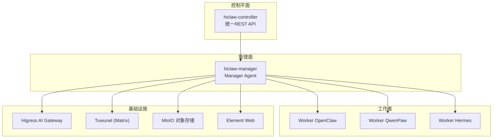
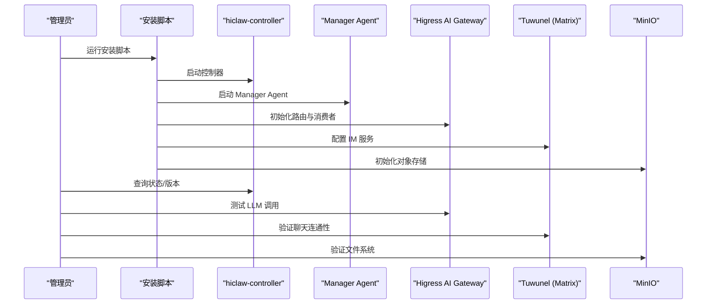
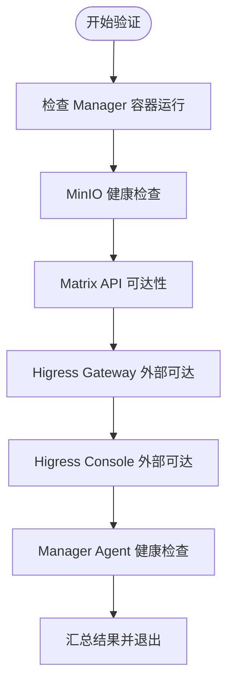
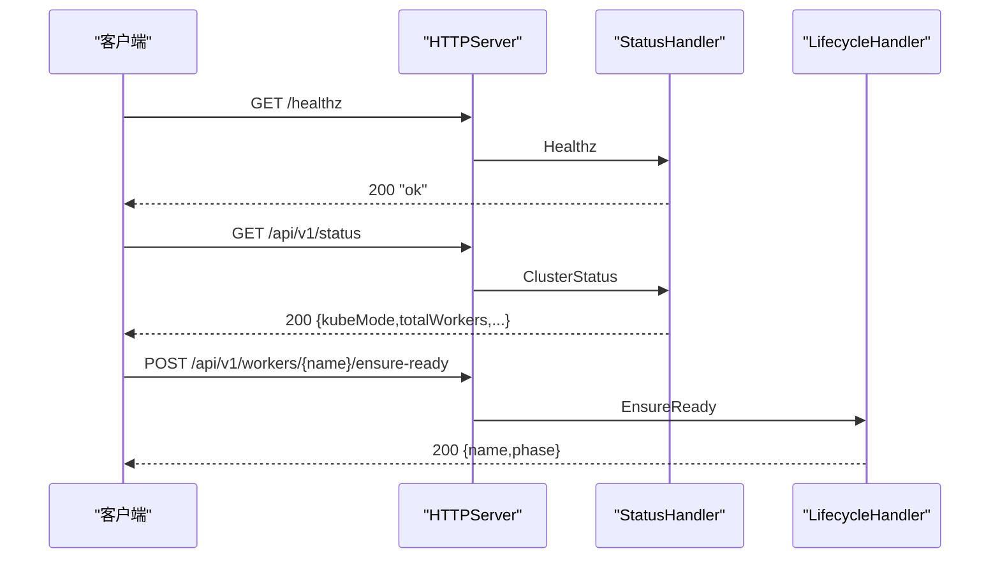
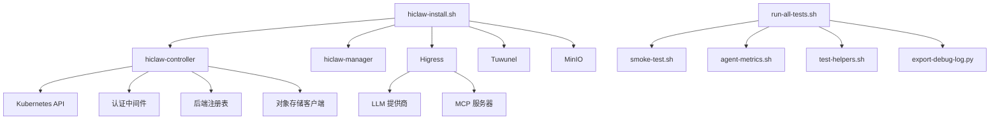

# 部署验证与监控

<cite>
**本文档引用的文件**
- [hiclaw-verify.sh](file://install/hiclaw-verify.sh)
- [hiclaw-install.sh](file://install/hiclaw-install.sh)
- [smoke-test.sh](file://manager/tests/smoke-test.sh)
- [run-all-tests.sh](file://tests/run-all-tests.sh)
- [agent-metrics.sh](file://tests/lib/agent-metrics.sh)
- [test-helpers.sh](file://tests/lib/test-helpers.sh)
- [export-debug-log.py](file://scripts/export-debug-log.py)
- [setup-higress.sh](file://manager/scripts/init/setup-higress.sh)
- [local-k8s-up.sh](file://hack/local-k8s-up.sh)
- [http.go](file://hiclaw-controller/internal/server/http.go)
- [status_handler.go](file://hiclaw-controller/internal/server/status_handler.go)
- [lifecycle_handler.go](file://hiclaw-controller/internal/server/lifecycle_handler.go)
- [base.sh](file://manager/scripts/lib/base.sh)
- [main.go](file://hiclaw-controller/cmd/hiclaw/main.go)
- [README.md](file://README.md)
</cite>

## 目录
1. [简介](#简介)
2. [项目结构](#项目结构)
3. [核心组件](#核心组件)
4. [架构总览](#架构总览)
5. [详细组件分析](#详细组件分析)
6. [依赖关系分析](#依赖关系分析)
7. [性能考虑](#性能考虑)
8. [故障排除指南](#故障排除指南)
9. [结论](#结论)
10. [附录](#附录)

## 简介
本指南面向 HiClaw 部署后的验证与监控，覆盖组件状态检查、服务可用性验证、网络连通性测试、自动化验证流程、系统健康监控、性能指标采集、错误日志导出与诊断、以及生产环境最佳实践。文档基于仓库内的安装脚本、控制器 API、测试工具与监控脚本进行系统化梳理，帮助运维与开发团队建立标准化的部署验证与持续监控体系。

## 项目结构
HiClaw 采用多容器分布式架构，核心组件包括：
- 控制平面：hiclaw-controller（统一 REST API、资源编排）
- 管理面：hiclaw-manager（Manager Agent，负责任务编排与人类交互）
- 工作者：hiclaw-worker（OpenClaw/QwenPaw/Hermes 多运行时）
- 基础设施：Higress AI Gateway、Tuwunel（Matrix）、MinIO、Element Web
- 验证与监控：安装脚本、Smoke 测试、集成测试框架、调试日志导出工具

**图表来源**
- [http.go:30-112](file://hiclaw-controller/internal/server/http.go#L30-L112)
- [README.md:305-333](file://README.md#L305-L333)

**章节来源**
- [README.md:305-333](file://README.md#L305-L333)

## 核心组件
- 安装与验证脚本：提供一键安装、端口与域名配置、安装后验证与烟雾测试能力
- 控制器 API：统一的资源管理、生命周期控制、状态查询与版本信息
- 网关与路由：Higress AI Gateway 提供 LLM 代理、MCP 服务器托管与消费者授权
- 测试与度量：集成测试框架、会话指标提取、调试日志导出
- 健康与状态：控制器健康检查、集群状态查询、工作者运行时状态

**章节来源**
- [hiclaw-install.sh:1-100](file://install/hiclaw-install.sh#L1-L100)
- [hiclaw-verify.sh:1-80](file://install/hiclaw-verify.sh#L1-L80)
- [smoke-test.sh:1-50](file://manager/tests/smoke-test.sh#L1-L50)
- [http.go:30-112](file://hiclaw-controller/internal/server/http.go#L30-L112)
- [status_handler.go:12-74](file://hiclaw-controller/internal/server/status_handler.go#L12-L74)
- [lifecycle_handler.go:15-32](file://hiclaw-controller/internal/server/lifecycle_handler.go#L15-L32)
- [setup-higress.sh:1-50](file://manager/scripts/init/setup-higress.sh#L1-L50)
- [export-debug-log.py:1-40](file://scripts/export-debug-log.py#L1-L40)

## 架构总览
下图展示部署后的验证与监控关键路径：安装脚本初始化配置与服务，控制器提供统一 API，Higress 负责路由与授权，测试框架与度量工具用于验证与监控。

**图表来源**
- [hiclaw-install.sh:100-170](file://install/hiclaw-install.sh#L100-L170)
- [http.go:42-98](file://hiclaw-controller/internal/server/http.go#L42-L98)
- [setup-higress.sh:160-285](file://manager/scripts/init/setup-higress.sh#L160-L285)
- [smoke-test.sh:27-51](file://manager/tests/smoke-test.sh#L27-L51)

## 详细组件分析

### 部署后验证脚本（hiclaw-verify.sh）
- 功能概述：对 Manager 容器、MinIO、Matrix、Higress Gateway/Console、Manager Agent 健康状态进行只读探测
- 支持的检查项：
  - 容器运行状态
  - MinIO 健康检查（内部）
  - Matrix API 可达性（内部）
  - Higress Gateway 外部可达性
  - Higress Console 外部可达性（HTTP 200）
  - Manager Agent 健康检查（OpenClaw 或 CoPaw）
- 输出：逐项 PASS/FAIL，最终统计结果
- K8s 迁移注意事项：脚本包含针对 K8s 的扩展注释，需替换容器 exec 逻辑、服务发现与端口映射策略

**图表来源**
- [hiclaw-verify.sh:80-175](file://install/hiclaw-verify.sh#L80-L175)

**章节来源**
- [hiclaw-verify.sh:1-176](file://install/hiclaw-verify.sh#L1-L176)

### 安装脚本与配置（hiclaw-install.sh）
- 功能概述：交互式/非交互式安装，支持多种 LLM 提供商、端口配置、本地/外部访问模式、Docker Socket 挂载、代理与安全配置
- 关键特性：
  - 语言与时区检测
  - 端口与域名配置（Higress、Element、Manager 控制台）
  - 管理员凭据生成与持久化
  - 等待 Manager Agent 就绪
  - API 连通性测试与 Embedding 模型配置
- 非交互模式：通过环境变量批量注入配置，便于 CI/CD 自动化

**章节来源**
- [hiclaw-install.sh:1-120](file://install/hiclaw-install.sh#L1-L120)
- [hiclaw-install.sh:450-780](file://install/hiclaw-install.sh#L450-L780)

### 烟雾测试（smoke-test.sh）
- 功能概述：启动后对核心服务进行可达性与进程状态检查
- 检查范围：MinIO、Tuwunel、Higress、Element Web、MinIO 存储桶与 Manager 文件、关键进程
- 适用场景：容器启动后快速验证基础设施完整性

**章节来源**
- [smoke-test.sh:1-71](file://manager/tests/smoke-test.sh#L1-L71)

### 集成测试与自动化验证（run-all-tests.sh）
- 功能概述：构建镜像、启动 Manager、运行全部测试用例、汇总结果
- 关键流程：
  - 环境变量加载与配置检测
  - Manager 启动与等待就绪
  - 管理员身份配置（英文）
  - Gateway 授权验证（消费者与 AI 路由）
  - 并发执行测试用例，收集结果
- 适配现有安装：支持使用已存在的 Manager 实例进行测试

**章节来源**
- [run-all-tests.sh:1-120](file://tests/run-all-tests.sh#L1-L120)
- [run-all-tests.sh:120-220](file://tests/run-all-tests.sh#L120-L220)
- [run-all-tests.sh:315-388](file://tests/run-all-tests.sh#L315-L388)

### 测试辅助与度量（agent-metrics.sh、test-helpers.sh）
- agent-metrics.sh：从会话日志中提取 LLM 调用次数、Token 使用量、时间戳等指标，支持阈值配置与增量度量
- test-helpers.sh：提供断言、轮询等待、配置检测、Docker 辅助函数、会话稳定性等待等测试基础设施
- 应用场景：集成测试中对 Manager 与 Worker 的会话指标进行统计与断言

**章节来源**
- [agent-metrics.sh:18-34](file://tests/lib/agent-metrics.sh#L18-L34)
- [agent-metrics.sh:550-720](file://tests/lib/agent-metrics.sh#L550-L720)
- [test-helpers.sh:148-264](file://tests/lib/test-helpers.sh#L148-L264)
- [test-helpers.sh:386-475](file://tests/lib/test-helpers.sh#L386-L475)

### 调试日志导出（export-debug-log.py）
- 功能概述：导出指定时间窗口内的 Matrix 消息与 Agent 会话日志，支持 PII 自动脱敏
- 导出内容：Matrix 消息 JSONL、Agent 会话 JSONL、Hermes 状态数据库快照与日志
- 使用方式：通过时间范围、容器/房间过滤、禁用 PII 脱敏等参数控制导出范围

**章节来源**
- [export-debug-log.py:1-40](file://scripts/export-debug-log.py#L1-L40)
- [export-debug-log.py:677-756](file://scripts/export-debug-log.py#L677-L756)

### Higress 路由与消费者配置（setup-higress.sh）
- 功能概述：首次启动时注册服务源、域名、消费者与静态路由；每次启动时更新 AI Gateway 路由与提供商配置
- 关键步骤：
  - 注册本地服务源（Tuwunel、Element Web、MinIO、Manager 控制台）
  - 创建域名与路由（Matrix、FS、Console）
  - 配置 Manager 消费者与 Basic Auth
  - 更新 LLM 提供商与 AI 路由（支持 openai-compat、qwen 等）
  - 配置 GitHub MCP 服务器与授权

**章节来源**
- [setup-higress.sh:95-158](file://manager/scripts/init/setup-higress.sh#L95-L158)
- [setup-higress.sh:160-285](file://manager/scripts/init/setup-higress.sh#L160-L285)

### K8s 本地部署（local-k8s-up.sh）
- 功能概述：通过 kind 创建集群，构建/加载镜像，Helm 安装 HiClaw，等待核心组件就绪，打印访问信息
- 关键流程：
  - 预检与镜像构建/加载
  - Helm 依赖构建与安装
  - 等待 Tuwunel、MinIO、Controller 就绪
  - 输出访问信息与日志查看命令

**章节来源**
- [local-k8s-up.sh:43-80](file://hack/local-k8s-up.sh#L43-L80)
- [local-k8s-up.sh:169-220](file://hack/local-k8s-up.sh#L169-L220)

### 控制器 API 与健康检查（http.go、status_handler.go、lifecycle_handler.go）
- 统一 REST API：提供资源 CRUD、包上传、生命周期控制、网关消费者管理、凭据 STS、Docker API 透传（嵌入模式）
- 健康检查：/healthz 返回 ok；/api/v1/status 返回集群状态；/api/v1/version 返回控制器与 K8s 模式
- 生命周期控制：/api/v1/workers/{name}/wake、sleep、ensure-ready、ready、status
- 访问控制：基于中间件的认证与授权

**图表来源**
- [http.go:42-98](file://hiclaw-controller/internal/server/http.go#L42-L98)
- [status_handler.go:23-74](file://hiclaw-controller/internal/server/status_handler.go#L23-L74)
- [lifecycle_handler.go:112-160](file://hiclaw-controller/internal/server/lifecycle_handler.go#L112-L160)

**章节来源**
- [http.go:30-112](file://hiclaw-controller/internal/server/http.go#L30-L112)
- [status_handler.go:12-74](file://hiclaw-controller/internal/server/status_handler.go#L12-L74)
- [lifecycle_handler.go:15-32](file://hiclaw-controller/internal/server/lifecycle_handler.go#L15-L32)

### 基础设施等待与健康（base.sh）
- 提供 TCP 与 HTTP 等待函数，用于服务就绪检测
- 场景：等待 MinIO、Tuwunel、Higress 等服务可用

**章节来源**
- [base.sh:7-47](file://manager/scripts/lib/base.sh#L7-L47)

### CLI 入口（hiclaw/main.go）
- 提供资源管理 CLI：apply、create、get、update、delete、worker、status、version
- 环境变量：HICLAW_CONTROLLER_URL、认证令牌等

**章节来源**
- [main.go:9-34](file://hiclaw-controller/cmd/hiclaw/main.go#L9-L34)

## 依赖关系分析
- 安装脚本依赖容器运行时（Docker/Podman）与网络端口映射
- 控制器 API 依赖 Kubernetes 客户端、认证中间件、后端注册表、网关与对象存储客户端
- Higress 配置依赖环境变量（LLM API Key、域名、端口等）
- 测试框架依赖 Docker 容器、Matrix 与 MinIO 端点、会话日志路径

**图表来源**
- [hiclaw-install.sh:1-120](file://install/hiclaw-install.sh#L1-L120)
- [http.go:16-28](file://hiclaw-controller/internal/server/http.go#L16-L28)
- [run-all-tests.sh:1-120](file://tests/run-all-tests.sh#L1-L120)
- [export-debug-log.py:1-40](file://scripts/export-debug-log.py#L1-L40)

**章节来源**
- [hiclaw-install.sh:1-120](file://install/hiclaw-install.sh#L1-L120)
- [http.go:16-28](file://hiclaw-controller/internal/server/http.go#L16-L28)
- [run-all-tests.sh:1-120](file://tests/run-all-tests.sh#L1-L120)
- [export-debug-log.py:1-40](file://scripts/export-debug-log.py#L1-L40)

## 性能考虑
- 端口与网络：合理配置本地绑定与外部暴露，避免不必要的端口映射与防火墙规则
- LLM 调用：通过 Higress 路由与消费者授权集中管理，减少重复调用与错误重试
- 存储与缓存：MinIO 作为共享文件系统，降低多 Agent 协作的 Token 消耗
- 日志与指标：使用会话指标与调试日志导出工具进行性能分析，避免过度记录影响吞吐

[本节为通用指导，无需特定文件引用]

## 故障排除指南
- 安装与启动
  - 使用安装脚本的等待与就绪检测，确认 Manager Agent 健康
  - 检查 LLM API Key 与 Base URL 配置，必要时进行连通性测试
- 服务可达性
  - 使用 hiclaw-verify.sh 进行端到端验证
  - 通过 smoke-test.sh 快速定位 MinIO、Matrix、Higress、Element Web 等组件
- 控制器与资源
  - 通过控制器 API 查询集群状态与版本，核对命名空间与 kubeMode
  - 使用 hiclaw CLI 检查 Worker/Team/Human 资源状态
- 日志与调试
  - 使用 export-debug-log.py 导出指定时间窗口内的 Matrix 消息与 Agent 会话日志
  - 结合 agent-metrics.sh 与 test-helpers.sh 的等待与断言能力进行问题复现
- K8s 环境
  - 使用 local-k8s-up.sh 快速搭建本地集群，验证 Helm 安装与组件就绪
  - 关注控制器日志与 Pod 状态，结合控制器 API 进行交叉验证

**章节来源**
- [hiclaw-verify.sh:1-80](file://install/hiclaw-verify.sh#L1-L80)
- [smoke-test.sh:1-71](file://manager/tests/smoke-test.sh#L1-L71)
- [status_handler.go:35-61](file://hiclaw-controller/internal/server/status_handler.go#L35-L61)
- [export-debug-log.py:677-756](file://scripts/export-debug-log.py#L677-L756)
- [local-k8s-up.sh:200-260](file://hack/local-k8s-up.sh#L200-L260)

## 结论
通过安装脚本、控制器 API、Higress 路由、测试框架与调试工具的协同，HiClaw 提供了完善的部署验证与监控能力。建议在生产环境中结合自动化验证脚本、健康检查 API、会话指标与日志导出工具，建立持续的部署验证与监控体系，确保系统稳定性与可观测性。

[本节为总结性内容，无需特定文件引用]

## 附录
- 生产环境最佳实践
  - 使用 Helm 在 Kubernetes 上部署，启用 Ingress/LoadBalancer 与 TLS
  - 配置独立的管理员账户与强密码，定期轮换
  - 启用对象存储与日志的备份策略
  - 使用 CI/CD 集成 hiclaw-verify.sh 与 run-all-tests.sh 进行自动化验证
- 质量保证措施
  - 在合并前运行集成测试，确保资源创建、生命周期与网关授权正常
  - 建立会话指标阈值，监控 LLM 调用与 Token 使用趋势
  - 定期导出调试日志，进行根因分析与回归测试

[本节为通用指导，无需特定文件引用]