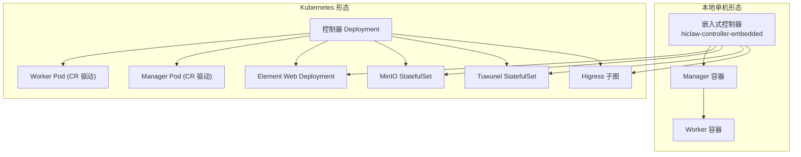
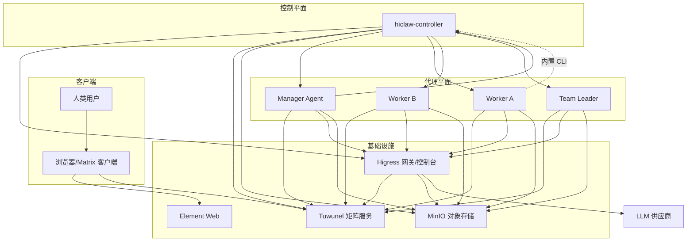
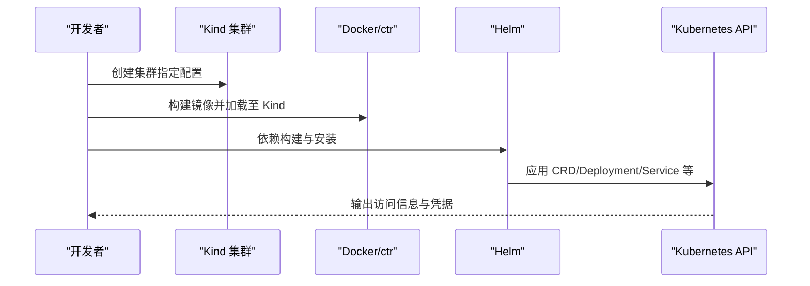
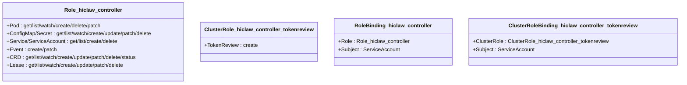
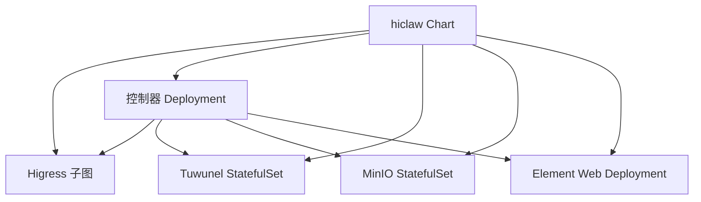

# 集群准备与环境搭建

<cite>
**本文档引用的文件**
- [kind-config.yaml](file://hack/kind-config.yaml)
- [local-k8s-up.sh](file://hack/local-k8s-up.sh)
- [local-k8s-down.sh](file://hack/local-k8s-down.sh)
- [values.yaml](file://helm/hiclaw/values.yaml)
- [Chart.yaml](file://helm/hiclaw/Chart.yaml)
- [deployment.yaml](file://helm/hiclaw/templates/controller/deployment.yaml)
- [rbac.yaml](file://helm/hiclaw/templates/controller/rbac.yaml)
- [minio-statefulset.yaml](file://helm/hiclaw/templates/storage/minio-statefulset.yaml)
- [deployment.yaml](file://helm/hiclaw/templates/element-web/deployment.yaml)
- [hiclaw-install.sh](file://install/hiclaw-install.sh)
- [hiclaw-apply.sh](file://install/hiclaw-apply.sh)
- [hiclaw-verify.sh](file://install/hiclaw-verify.sh)
- [quickstart.md](file://docs/quickstart.md)
- [architecture.md](file://docs/architecture.md)
- [managers.hiclaw.io.yaml](file://hiclaw-controller/config/crd/managers.hiclaw.io.yaml)
- [workers.hiclaw.io.yaml](file://hiclaw-controller/config/crd/workers.hiclaw.io.yaml)
- [humans.hiclaw.io.yaml](file://hiclaw-controller/config/crd/humans.hiclaw.io.yaml)
- [teams.hiclaw.io.yaml](file://hiclaw-controller/config/crd/teams.hiclaw.io.yaml)
</cite>

## 目录
1. [简介](#简介)
2. [项目结构](#项目结构)
3. [核心组件](#核心组件)
4. [架构总览](#架构总览)
5. [详细组件分析](#详细组件分析)
6. [依赖关系分析](#依赖关系分析)
7. [性能考虑](#性能考虑)
8. [故障排查指南](#故障排查指南)
9. [结论](#结论)
10. [附录](#附录)

## 简介
本指南面向在 Kubernetes 集群上部署 HiClaw 的工程师与运维人员，覆盖本地 Kind 集群搭建、Minikube 部署、云厂商集群接入等多场景方案；明确集群前置条件（节点配置、网络与存储）、集群初始化脚本使用方法、Ingress 控制器与证书管理、RBAC 权限配置、以及不同环境下的最佳实践与性能优化建议。文档同时提供故障排查清单与常见问题定位方法，帮助快速恢复与验证。

## 项目结构
HiClaw 提供两套部署形态：
- 本地单机形态（install/）：通过嵌入式控制器镜像一键启动 Higress、Tuwunel、MinIO、Element Web 与控制器进程，并在宿主上创建 Manager 与 Worker 容器。
- Kubernetes 形态（helm/hiclaw）：通过 Helm Chart 将各组件拆分为独立 Pod（Higress 子图、Tuwunel StatefulSet、MinIO、Element Web、控制器 Deployment、Manager/Worker Pod 由 CR 驱动创建）。

图表来源
- [architecture.md](file://docs/architecture.md)
- [Chart.yaml](file://helm/hiclaw/Chart.yaml)
- [deployment.yaml](file://helm/hiclaw/templates/controller/deployment.yaml)

章节来源
- [architecture.md](file://docs/architecture.md)
- [Chart.yaml](file://helm/hiclaw/Chart.yaml)

## 核心组件
- 控制器（hiclaw-controller）
  - 负责 CRD（Worker/Manager/Team/Human）的协调、生命周期管理、网关消费者与路由、对象存储凭证发放、日志与可观测性注入。
  - 在 Kubernetes 下以 Deployment 运行，通过 RBAC 授权访问集群资源。
- 网关（Higress）
  - 提供 AI Gateway 与 API Gateway 能力，统一管理 LLM 路由、MCP 服务暴露与消费者鉴权。
- 矩阵服务（Tuwunel）
  - 提供 Matrix Homeserver，承载人类与 Agent 的通信、房间与权限控制。
- 对象存储（MinIO）
  - 提供共享工作空间与任务工件的持久化存储，支持 Console 与 mc 管理。
- Element Web
  - 提供 IM UI，便于人类登录与协作。
- Manager/Worker
  - Manager 作为团队协调者，Worker 作为任务执行器，二者均通过 CR 驱动在 Kubernetes 下以 Pod 形式运行。

章节来源
- [deployment.yaml](file://helm/hiclaw/templates/controller/deployment.yaml)
- [rbac.yaml](file://helm/hiclaw/templates/controller/rbac.yaml)
- [minio-statefulset.yaml](file://helm/hiclaw/templates/storage/minio-statefulset.yaml)
- [deployment.yaml](file://helm/hiclaw/templates/element-web/deployment.yaml)
- [values.yaml](file://helm/hiclaw/values.yaml)

## 架构总览
下图展示 Kubernetes 场景下的组件关系与数据流：

图表来源
- [architecture.md](file://docs/architecture.md)
- [values.yaml](file://helm/hiclaw/values.yaml)

## 详细组件分析

### 本地 Kind 集群搭建
- 准备工具
  - kind、kubectl、helm、docker（用于镜像预加载）
- 关键配置
  - 端口映射：将 Higress NodePort 30080 映射到宿主机 18080，便于 Element Web 与网关访问。
- 初始化流程
  - 创建集群 → 构建/加载镜像 → Helm 依赖构建 → Helm 安装 → 等待核心组件就绪 → 输出访问信息与日志查看指引。

图表来源
- [local-k8s-up.sh](file://hack/local-k8s-up.sh)
- [kind-config.yaml](file://hack/kind-config.yaml)

章节来源
- [local-k8s-up.sh](file://hack/local-k8s-up.sh)
- [local-k8s-down.sh](file://hack/local-k8s-down.sh)
- [kind-config.yaml](file://hack/kind-config.yaml)

### Minikube 部署
- 前置条件
  - 启用 Ingress 控制器（如 ingress-nginx 或 k3s 自带 ingress）
  - 配置本地域名解析或使用 MetalLB/LoadBalancer 提供外部访问
- 集群初始化
  - 启动 Minikube → 安装 Ingress 控制器 → 准备镜像 → 使用 Helm 安装 HiClaw → 验证各组件健康状态

章节来源
- [local-k8s-up.sh](file://hack/local-k8s-up.sh)
- [values.yaml](file://helm/hiclaw/values.yaml)

### 云厂商集群接入（阿里云 ACK/ACS）
- 配置要点
  - 使用 values-aliyun.yaml（需在仓库中维护）覆盖默认镜像仓库与网关/存储提供商
  - 若使用阿里云 AI Gateway，则在 values.yaml 中配置 gateway.aiGateway.* 字段
  - 若使用 OSS，则启用 credentialProvider 并正确配置 STS 凭证下发
- 安装流程
  - Helm 安装 → 等待控制器就绪 → 验证网关、矩阵、存储连通性

章节来源
- [values.yaml](file://helm/hiclaw/values.yaml)
- [Chart.yaml](file://helm/hiclaw/Chart.yaml)

### Ingress 控制器与证书管理
- 本地/Minikube
  - 使用 NodePort 或 LoadBalancer（MetalLB）暴露 Higress Console 与 Element Web
  - 本地开发建议使用自签名证书并通过浏览器信任链导入
- 生产/云厂商
  - 使用 IngressClass + cert-manager + ACME 证书颁发器
  - 为 Element Web、Matrix、AI Gateway 配置独立域名与 TLS Secret

章节来源
- [values.yaml](file://helm/hiclaw/values.yaml)
- [deployment.yaml](file://helm/hiclaw/templates/element-web/deployment.yaml)

### RBAC 权限配置
- 控制器所需权限
  - 对 Pod、ConfigMap、Secret、Service、ServiceAccount、事件及 CRD 的读写权限
  - 对 Coordination.Leases 的读写权限
  - 对 TokenReview 的创建权限（用于身份认证）
- 最小权限原则
  - 为控制器创建专用 ServiceAccount，并限制其对命名空间内资源的操作范围
  - 通过 Role/ClusterRole 绑定，避免使用 ClusterAdmin

图表来源
- [rbac.yaml](file://helm/hiclaw/templates/controller/rbac.yaml)

章节来源
- [rbac.yaml](file://helm/hiclaw/templates/controller/rbac.yaml)

### 存储与对象存储配置
- MinIO（托管）
  - 通过 StatefulSet 提供对象存储服务，支持 Console 与 mc 管理
  - 支持持久化卷与资源配额
- OSS（外部）
  - 启用 credentialProvider，控制器通过 STS 动态下发凭证
  - 通过 accessEntries 为 Manager/Worker/Team 限定最小权限范围

章节来源
- [minio-statefulset.yaml](file://helm/hiclaw/templates/storage/minio-statefulset.yaml)
- [values.yaml](file://helm/hiclaw/values.yaml)

### 集群初始化脚本使用方法
- 本地 Kind
  - 设置 HICLAW_LLM_API_KEY → 运行 local-k8s-up.sh → 等待组件就绪 → 访问 Element Web 与 Higress Console
  - 可选参数：注册令牌、管理员密码、集群名、命名空间、跳过 Kind/构建、控制器副本数
- Minikube
  - 启用 Ingress → 准备镜像 → Helm 安装 → 验证端点可达
- 云厂商
  - 准备 values-aliyun.yaml → Helm 安装 → 验证 AI Gateway 与 OSS 连通

章节来源
- [local-k8s-up.sh](file://hack/local-k8s-up.sh)
- [local-k8s-down.sh](file://hack/local-k8s-down.sh)

### 集群验证与故障排查
- 验证清单（Kubernetes）
  - 控制器 Deployment 就绪（readiness/liveness）
  - MinIO StatefulSet 就绪（/minio/health/live）
  - Element Web Deployment 就绪（/）
  - Higress Console 可达（HTTP 200）
  - 网关路由与消费者状态正常
- 故障排查
  - 查看控制器日志与事件
  - 检查 CR 状态字段（phase、message、matrixUserID、roomID 等）
  - 核对镜像拉取策略、Secret 与 PVC 绑定
  - 确认 RBAC 授权与 ServiceAccount 绑定

章节来源
- [hiclaw-verify.sh](file://install/hiclaw-verify.sh)
- [managers.hiclaw.io.yaml](file://hiclaw-controller/config/crd/managers.hiclaw.io.yaml)
- [workers.hiclaw.io.yaml](file://hiclaw-controller/config/crd/workers.hiclaw.io.yaml)
- [teams.hiclaw.io.yaml](file://hiclaw-controller/config/crd/teams.hiclaw.io.yaml)
- [humans.hiclaw.io.yaml](file://hiclaw-controller/config/crd/humans.hiclaw.io.yaml)

## 依赖关系分析
- Helm Chart 依赖
  - Higress 作为子图依赖，受 gateway.higress.enabled 控制
- 组件依赖
  - 控制器依赖 Higress（路由/消费者）、Tuwunel（Matrix）、MinIO（对象存储）
  - Manager/Worker 依赖控制器提供的凭证与路由

图表来源
- [Chart.yaml](file://helm/hiclaw/Chart.yaml)
- [values.yaml](file://helm/hiclaw/values.yaml)

章节来源
- [Chart.yaml](file://helm/hiclaw/Chart.yaml)
- [values.yaml](file://helm/hiclaw/values.yaml)

## 性能考虑
- 资源配额
  - 控制器、MinIO、Tuwunel、Element Web 均配置了 CPU/内存请求与限制，建议结合业务规模调整
- 网络与路由
  - 使用 Higress 的连接池与超时配置，减少长尾延迟
  - 合理设置 IngressClass 与证书缓存，降低 TLS 握手开销
- 存储性能
  - MinIO 使用 SSD 存储类可显著提升并发读写性能
  - 合理设置 PVC 大小与 IOPS 配额
- 可观测性
  - 启用 CMS/OTLP 指标与追踪，结合 Prometheus/Grafana 监控关键指标

章节来源
- [values.yaml](file://helm/hiclaw/values.yaml)

## 故障排查指南
- 控制器无法就绪
  - 检查 Pod 日志与事件，确认 Secret、ServiceAccount、RBAC 是否正确
  - 核对环境变量（HICLAW_*）与 CRD 状态
- 网关/路由异常
  - 检查 Higress Console 与路由状态，确认消费者与密钥是否生效
  - 核对 Element Web 与 Matrix 域名解析
- 对象存储不可用
  - 检查 MinIO Pod 就绪与 PVC 绑定，确认 mc 与 Console 可达
- 证书与 TLS
  - 确认 cert-manager 与 ACME 配置，检查证书 Secret 与到期时间
- 云厂商集成
  - 确认 credentialProvider 可用，STK 凭证下发成功，accessEntries 权限范围正确

章节来源
- [hiclaw-verify.sh](file://install/hiclaw-verify.sh)
- [rbac.yaml](file://helm/hiclaw/templates/controller/rbac.yaml)
- [values.yaml](file://helm/hiclaw/values.yaml)

## 结论
通过本指南，可在本地、Minikube 与云厂商集群上完成 HiClaw 的端到端部署。建议优先采用 Helm Chart 进行生产级部署，配合 Ingress + cert-manager 实现安全与高可用；在开发阶段可使用 Kind 快速验证。合理规划 RBAC、存储与网络，结合控制器的 CRD 管理能力，可实现 Manager/Worker/Team/Human 的声明式编排与自动化运维。

## 附录

### A. 环境前置条件清单
- 节点与资源
  - 至少 1 个控制面 + 2 个工作节点（建议 2C4G+）
  - 留足 Pod 与存储资源余量
- 网络
  - 集群内 DNS 可用
  - 出口可访问镜像仓库（必要时配置镜像加速）
- 存储
  - 默认 StorageClass 可用；或提前创建 SSD 类型存储类
- 安全
  - 准备 TLS 证书（本地可用自签，生产使用 ACME）
  - 配置 RBAC 与 ServiceAccount

### B. 初始化脚本参数说明（节选）
- local-k8s-up.sh
  - HICLAW_LLM_API_KEY：必需
  - HICLAW_REGISTRATION_TOKEN/HICLAW_ADMIN_PASSWORD：可选
  - HICLAW_CLUSTER_NAME/HICLAW_NAMESPACE：可选
  - HICLAW_SKIP_KIND/HICLAW_SKIP_BUILD：可选
  - HICLAW_CONTROLLER_REPLICAS：可选
- hiclaw-install.sh（本地单机形态）
  - HICLAW_LLM_API_KEY、HICLAW_ADMIN_*、HICLAW_PORT_* 等

章节来源
- [local-k8s-up.sh](file://hack/local-k8s-up.sh)
- [hiclaw-install.sh](file://install/hiclaw-install.sh)