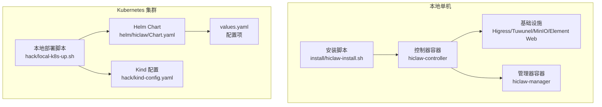
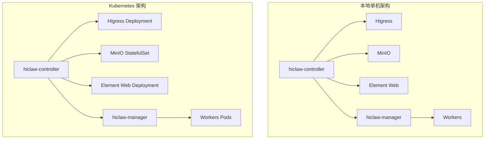
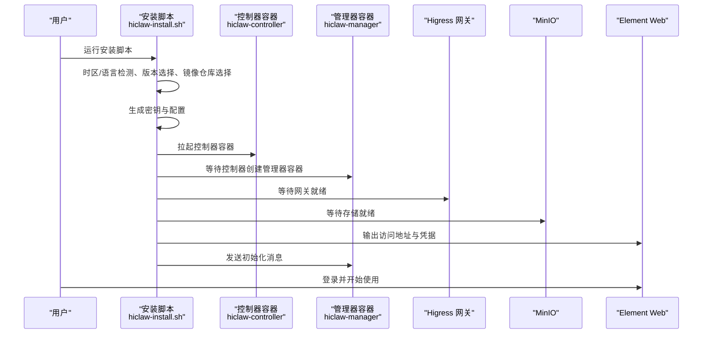
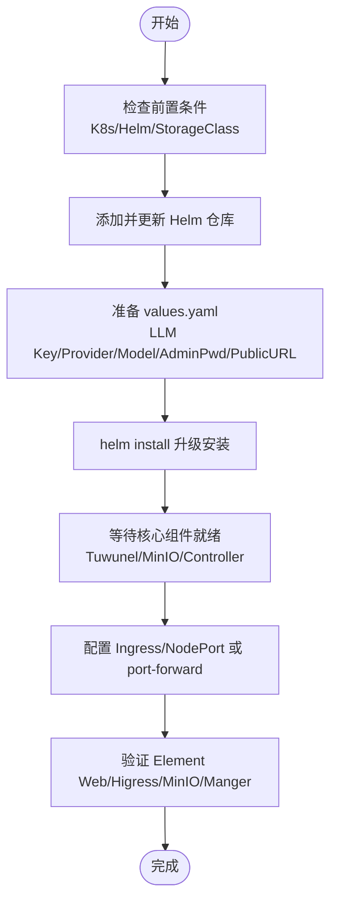
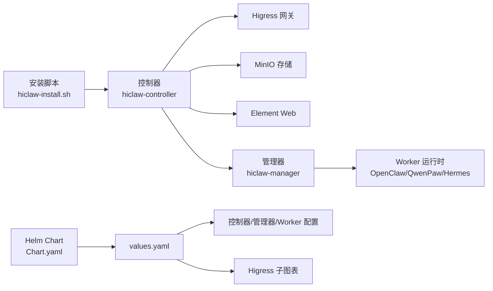

# 安装与部署

<cite>
**本文引用的文件**
- [README.md](file://README.md)
- [install/README.md](file://install/README.md)
- [install/hiclaw-install.sh](file://install/hiclaw-install.sh)
- [install/hiclaw-apply.sh](file://install/hiclaw-apply.sh)
- [install/hiclaw-verify.sh](file://install/hiclaw-verify.sh)
- [docs/windows-deploy.md](file://docs/windows-deploy.md)
- [docs/quickstart.md](file://docs/quickstart.md)
- [docs/faq.md](file://docs/faq.md)
- [docs/zh-cn/faq.md](file://docs/zh-cn/faq.md)
- [helm/hiclaw/Chart.yaml](file://helm/hiclaw/Chart.yaml)
- [helm/hiclaw/values.yaml](file://helm/hiclaw/values.yaml)
- [hack/kind-config.yaml](file://hack/kind-config.yaml)
- [hack/local-k8s-up.sh](file://hack/local-k8s-up.sh)
- [hack/local-k8s-down.sh](file://hack/local-k8s-down.sh)
</cite>

## 目录
1. [简介](#简介)
2. [项目结构](#项目结构)
3. [核心组件](#核心组件)
4. [架构总览](#架构总览)
5. [详细组件分析](#详细组件分析)
6. [依赖关系分析](#依赖关系分析)
7. [性能考虑](#性能考虑)
8. [故障排除指南](#故障排除指南)
9. [结论](#结论)
10. [附录](#附录)

## 简介
本指南面向不同技术背景的读者，提供 HiClaw 的完整安装与部署方案，覆盖本地单机部署与 Kubernetes 集群部署两大场景。内容包括系统前置要求、硬件资源需求、网络配置、安装步骤（macOS/Linux 与 Windows）、Helm Chart 配置项详解、部署验证方法、常见问题排查以及生产环境最佳实践。

## 项目结构
HiClaw 提供两类安装入口：
- 本地单机安装：通过一键安装脚本自动拉起控制器、管理器与基础设施（Higress、Tuwunel、MinIO、Element Web），并支持交互式配置与非交互式自动化。
- Kubernetes 集群安装：通过官方 Helm Chart 在集群中部署，支持多种运行时（OpenClaw/QwenPaw/Hermes）与多种存储/网关/矩阵实现。

图示来源
- [install/hiclaw-install.sh:1-80](file://install/hiclaw-install.sh#L1-L80)
- [helm/hiclaw/Chart.yaml:1-28](file://helm/hiclaw/Chart.yaml#L1-L28)
- [helm/hiclaw/values.yaml:1-263](file://helm/hiclaw/values.yaml#L1-L263)
- [hack/kind-config.yaml:1-17](file://hack/kind-config.yaml#L1-L17)
- [hack/local-k8s-up.sh:1-260](file://hack/local-k8s-up.sh#L1-L260)

章节来源
- [README.md:54-110](file://README.md#L54-L110)
- [install/README.md:1-186](file://install/README.md#L1-L186)
- [docs/windows-deploy.md:1-525](file://docs/windows-deploy.md#L1-L525)
- [docs/quickstart.md:1-356](file://docs/quickstart.md#L1-L356)
- [helm/hiclaw/Chart.yaml:1-28](file://helm/hiclaw/Chart.yaml#L1-L28)
- [helm/hiclaw/values.yaml:1-263](file://helm/hiclaw/values.yaml#L1-L263)
- [hack/kind-config.yaml:1-17](file://hack/kind-config.yaml#L1-L17)
- [hack/local-k8s-up.sh:1-260](file://hack/local-k8s-up.sh#L1-L260)

## 核心组件
- 控制器（hiclaw-controller）：负责基础设施（Higress、Tuwunel、MinIO、Element Web）与资源编排（Manager/Worker/Team/Human CRD）。
- 管理器（hiclaw-manager）：轻量级 Agent 容器，承载 Manager Agent。
- Worker：多运行时支持（OpenClaw/QwenPaw/Hermes），通过 CRD/CLI 管理。
- 网关（Higress）：统一 AI 流量入口，集中凭证与路由。
- 矩阵服务（Tuwunel/Element Web）：IM 通信与协作。
- 存储（MinIO）：共享文件系统，降低 Token 消耗。

章节来源
- [README.md:305-333](file://README.md#L305-L333)
- [docs/quickstart.md:42-61](file://docs/quickstart.md#L42-L61)
- [helm/hiclaw/values.yaml:55-111](file://helm/hiclaw/values.yaml#L55-L111)

## 架构总览
本地单机与 Kubernetes 两种架构均遵循“控制器 + 管理器 + Worker”的解耦设计，控制器负责基础设施与资源编排，管理器负责业务编排，Worker 负责具体任务执行。

图示来源
- [README.md:305-333](file://README.md#L305-L333)
- [docs/quickstart.md:42-61](file://docs/quickstart.md#L42-L61)
- [helm/hiclaw/values.yaml:55-111](file://helm/hiclaw/values.yaml#L55-L111)

## 详细组件分析

### 本地单机部署（macOS/Linux/Windows）
- 前置要求
  - Docker Desktop（Windows/macOS）或 Docker Engine（Linux）。
  - Windows 需 PowerShell 7+，WSL2 后端。
  - 资源建议：2 核心 + 4 GB 内存（多 Worker 场景建议 4 核心 + 8 GB）。
- 安装方式
  - 一键安装：交互式选择 LLM 提供商、API Key、网络模式、端口与域名等。
  - 非交互安装：通过环境变量批量注入配置，适合 CI/CD。
- 关键流程
  - 时区与语言检测、镜像仓库选择、版本选择、容器运行时检测（Docker/Podman）。
  - 生成密钥与配置、拉取镜像、启动控制器与管理器、等待服务就绪、发送初始化消息。
- 验证方法
  - 使用安装脚本自带的验证脚本进行健康检查（MinIO/Matrix/Higress/Manager Agent）。
  - 通过 Element Web 登录，与 Manager 交互创建 Worker 并分配任务。

图示来源
- [install/hiclaw-install.sh:1-80](file://install/hiclaw-install.sh#L1-L80)
- [install/hiclaw-verify.sh:1-176](file://install/hiclaw-verify.sh#L1-L176)
- [docs/quickstart.md:62-77](file://docs/quickstart.md#L62-L77)

章节来源
- [README.md:54-110](file://README.md#L54-L110)
- [install/README.md:1-186](file://install/README.md#L1-L186)
- [docs/windows-deploy.md:1-525](file://docs/windows-deploy.md#L1-L525)
- [docs/quickstart.md:1-356](file://docs/quickstart.md#L1-L356)
- [install/hiclaw-install.sh:1-80](file://install/hiclaw-install.sh#L1-L80)
- [install/hiclaw-verify.sh:1-176](file://install/hiclaw-verify.sh#L1-L176)

### Kubernetes 集群部署（Helm）
- 前置要求
  - Kubernetes 1.24+，Helm 3.7+，默认 StorageClass（用于 PVC）。
  - 本地开发可使用 kind，提供端口映射与镜像预加载脚本。
- 安装方式
  - 使用官方 Helm Chart，通过 --set 指定 LLM API Key、管理员密码、网关公开地址等。
  - 支持切换 LLM 提供商（OpenAI 兼容、Qwen）、默认模型、运行时（OpenClaw/QwenPaw/Hermes）。
- 关键配置项（values.yaml）
  - credentials：LLM API Key、默认提供商、默认模型、管理员密码、注册令牌。
  - matrix：矩阵服务提供商（Tuwunel/Synapse）、托管/现有模式、副本数、资源、持久化。
  - gateway：网关提供商（Higress/阿里云 APIG）、托管/现有模式、publicURL。
  - storage：存储提供商（MinIO/OSS）、桶名、资源、持久化。
  - controller/manager/worker：镜像仓库/标签、副本数、资源、运行时与默认镜像。
  - elementWeb：Element Web 部署。
  - higress：Higress 子图表配置（本地开发默认 ClusterIP）。
- 验证与访问
  - 通过 kubectl port-forward 访问 Higress 网关或配置 Ingress/LoadBalancer。
  - 通过本地脚本一键创建 kind 集群并部署，自动打印访问信息与日志查看命令。

图示来源
- [README.md:110-238](file://README.md#L110-L238)
- [helm/hiclaw/values.yaml:1-263](file://helm/hiclaw/values.yaml#L1-L263)
- [hack/kind-config.yaml:1-17](file://hack/kind-config.yaml#L1-L17)
- [hack/local-k8s-up.sh:1-260](file://hack/local-k8s-up.sh#L1-L260)

章节来源
- [README.md:110-238](file://README.md#L110-L238)
- [helm/hiclaw/Chart.yaml:1-28](file://helm/hiclaw/Chart.yaml#L1-L28)
- [helm/hiclaw/values.yaml:1-263](file://helm/hiclaw/values.yaml#L1-L263)
- [hack/kind-config.yaml:1-17](file://hack/kind-config.yaml#L1-L17)
- [hack/local-k8s-up.sh:1-260](file://hack/local-k8s-up.sh#L1-L260)
- [hack/local-k8s-down.sh:1-28](file://hack/local-k8s-down.sh#L1-L28)

### Helm Chart 配置项详解
- credentials
  - llmApiKey：必填，LLM 凭证。
  - llmProvider：默认 openai-compat，可选 qwen。
  - defaultModel：默认模型名。
  - llmBaseUrl：OpenAI 兼容 Base URL。
  - adminUser/adminPassword：管理员账户与密码（为空则自动生成）。
- gateway
  - provider：higress 或 ai-gateway（现有模式）。
  - mode：managed 或 existing。
  - publicURL：浏览器访问地址（http://localhost:18080 或 https://...）。
- storage
  - provider：minio 或 oss。
  - mode：managed 或 existing。
  - bucket：默认 hiclaw。
  - oss.endpoint/region：OSS 相关配置。
- matrix
  - provider：tuwunel 或 synapse。
  - mode：managed 或 existing。
  - tuwunel.resources/service/persistence：副本数、CPU/内存、服务类型、PVC 大小。
- controller/manager/worker
  - image：仓库/标签/拉取策略。
  - resources：requests/limits。
  - manager.runtime：openclaw/copaw/hermes。
  - worker.defaultRuntime：openclaw/copaw/hermes。
  - worker.defaultImage.*：各运行时默认镜像仓库/标签。
- elementWeb
  - image：Element Web 镜像。
  - service：服务类型与端口。
- higress
  - local：kind/minikube 环境默认启用。
  - gateway/controller：副本数与端口。
- 其他
  - global.imageRegistry/imageTag：全局镜像仓库与标签。
  - cms：可选 CMS 观测集成（ARMS）。

章节来源
- [helm/hiclaw/values.yaml:1-263](file://helm/hiclaw/values.yaml#L1-L263)

## 依赖关系分析
- 本地单机安装依赖 Docker/Podman 守护进程与容器运行时 socket（可选直接挂载）。
- Kubernetes 安装依赖 Helm 与集群 RBAC 权限，Chart 通过子依赖引入 Higress。
- 控制器负责基础设施与资源编排，管理器与 Worker 通过 CRD/CLI 管理，Higress 作为统一网关。

图示来源
- [install/hiclaw-install.sh:1-80](file://install/hiclaw-install.sh#L1-L80)
- [helm/hiclaw/Chart.yaml:1-28](file://helm/hiclaw/Chart.yaml#L1-L28)
- [helm/hiclaw/values.yaml:1-263](file://helm/hiclaw/values.yaml#L1-L263)

章节来源
- [install/hiclaw-install.sh:1-80](file://install/hiclaw-install.sh#L1-L80)
- [helm/hiclaw/Chart.yaml:1-28](file://helm/hiclaw/Chart.yaml#L1-L28)
- [helm/hiclaw/values.yaml:1-263](file://helm/hiclaw/values.yaml#L1-L263)

## 性能考虑
- 资源规划
  - 单机部署：2 核心 + 4 GB（多 Worker 场景建议 4 核心 + 8 GB）。
  - Kubernetes：根据负载调整副本数与资源 requests/limits，合理设置 Higress 与 MinIO 的 CPU/内存。
- 网络与安全
  - 本地仅本机访问（127.0.0.1）更安全；若允许多设备访问，建议在 Higress 控制台配置 TLS 与 HTTPS。
- 存储
  - MinIO 使用 PVC，建议使用高性能 StorageClass；OSS 模式下通过凭证提供者动态发放 STS。
- 运行时选择
  - OpenClaw：通用、生态丰富；QwenPaw：轻量 Python；Hermes：自主编码与开发任务。

章节来源
- [README.md:56-58](file://README.md#L56-L58)
- [docs/quickstart.md:42-61](file://docs/quickstart.md#L42-L61)
- [helm/hiclaw/values.yaml:78-111](file://helm/hiclaw/values.yaml#L78-L111)

## 故障排除指南
- 本地单机
  - 安装脚本闪退（Windows）：确认 Docker Desktop 已安装并完全启动。
  - Manager Agent 启动超时：检查 Docker VM 内存（建议≥4GB），查看控制器与管理器日志。
  - 端口占用：修改端口或释放占用端口。
  - Matrix 服务器不可达：检查系统/浏览器代理，将本地域名加入绕过列表。
- Kubernetes
  - 无法拉取镜像：使用本地镜像预加载脚本或更换镜像仓库。
  - 网关/存储未就绪：检查 Pod 状态与事件，确认 StorageClass 与 PVC 绑定。
  - 访问异常：确认 Ingress/NodePort/LoadBalancer 配置与 publicURL 一致。
- 通用
  - API 连通性测试失败：核对 API Key、模型服务是否启用、网络可达性。
  - 401/404 错误：检查模型名、路由配置与上游服务状态。

章节来源
- [docs/faq.md:202-267](file://docs/faq.md#L202-L267)
- [docs/zh-cn/faq.md:202-267](file://docs/zh-cn/faq.md#L202-L267)
- [install/hiclaw-verify.sh:1-176](file://install/hiclaw-verify.sh#L1-L176)
- [hack/local-k8s-up.sh:1-260](file://hack/local-k8s-up.sh#L1-L260)

## 结论
HiClaw 提供了从单机到 Kubernetes 的完整安装与部署方案，具备清晰的组件边界与丰富的配置项。通过 Helm Chart 可快速在集群中完成基础设施与应用的一致化交付；通过安装脚本可在本地快速体验多运行时协作能力。建议在生产环境中结合 TLS、RBAC、持久化与可观测性进行加固与监控。

## 附录

### 本地单机安装步骤（macOS/Linux）
- 一键安装
  - bash <(curl -sSL https://higress.ai/hiclaw/install.sh)
  - 交互式选择 LLM 提供商、API Key、网络模式、端口与域名等。
- 非交互安装
  - 设置环境变量后运行安装脚本，适合 CI/CD。
- 验证
  - 使用安装脚本自带验证脚本进行健康检查。
  - 登录 Element Web，与 Manager 交互创建 Worker 并分配任务。

章节来源
- [README.md:54-110](file://README.md#L54-L110)
- [install/README.md:1-186](file://install/README.md#L1-L186)
- [install/hiclaw-verify.sh:1-176](file://install/hiclaw-verify.sh#L1-L176)
- [docs/quickstart.md:62-77](file://docs/quickstart.md#L62-L77)

### 本地单机安装步骤（Windows）
- 前置要求：Docker Desktop（WSL2）、PowerShell 7+。
- 安装
  - PowerShell 执行安装脚本，按提示完成配置。
- 验证
  - 登录 Element Web，与 Manager 交互创建 Worker 并分配任务。

章节来源
- [docs/windows-deploy.md:1-525](file://docs/windows-deploy.md#L1-L525)

### Kubernetes 集群安装步骤
- 本地 kind 集群
  - 使用本地脚本一键创建集群并部署，自动打印访问信息与日志查看命令。
- 生产集群
  - 添加并更新 Helm 仓库，准备 values.yaml，执行 helm install/upgrade。
  - 配置 Ingress/LoadBalancer 或 port-forward 访问 Higress 网关。

章节来源
- [README.md:110-238](file://README.md#L110-L238)
- [helm/hiclaw/values.yaml:1-263](file://helm/hiclaw/values.yaml#L1-L263)
- [hack/kind-config.yaml:1-17](file://hack/kind-config.yaml#L1-L17)
- [hack/local-k8s-up.sh:1-260](file://hack/local-k8s-up.sh#L1-L260)

### 部署验证清单
- 本地单机
  - 控制器/管理器容器运行、MinIO/Matrix/Higress/Manager Agent 健康。
  - Element Web 可访问，管理员凭据正确。
- Kubernetes
  - 控制器/管理器/MinIO/Tuwunel 就绪。
  - Higress 网关可访问，publicURL 正确。
  - Element Web 可访问，管理员凭据正确。

章节来源
- [install/hiclaw-verify.sh:1-176](file://install/hiclaw-verify.sh#L1-L176)
- [docs/quickstart.md:68-77](file://docs/quickstart.md#L68-L77)