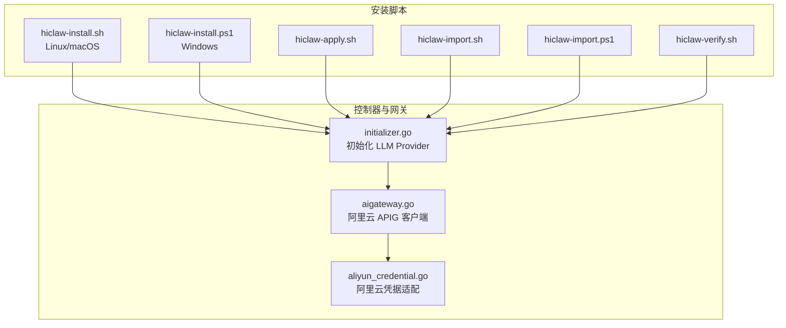
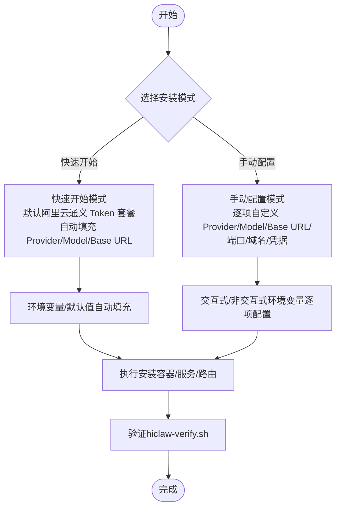
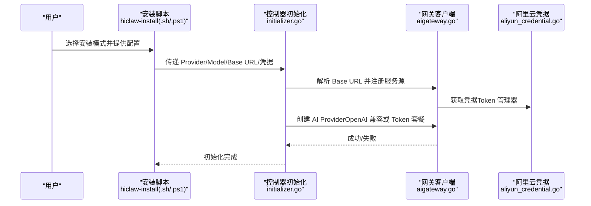

# 安装模式选择

<cite>
**本文引用的文件**
- [install/README.md](file://install/README.md)
- [hiclaw-install.sh](file://install/hiclaw-install.sh)
- [hiclaw-install.ps1](file://install/hiclaw-install.ps1)
- [hiclaw-apply.sh](file://install/hiclaw-apply.sh)
- [hiclaw-import.sh](file://install/hiclaw-import.sh)
- [hiclaw-import.ps1](file://install/hiclaw-import.ps1)
- [hiclaw-verify.sh](file://install/hiclaw-verify.sh)
- [quickstart.md](file://docs/quickstart.md)
- [quickstart.md（中文）](file://docs/zh-cn/quickstart.md)
- [aliyun_credential.go](file://hiclaw-controller/internal/credprovider/aliyun_credential.go)
- [aigateway.go](file://hiclaw-controller/internal/gateway/aigateway.go)
- [initializer.go](file://hiclaw-controller/internal/initializer/initializer.go)
</cite>

## 目录
1. [简介](#简介)
2. [项目结构](#项目结构)
3. [核心组件](#核心组件)
4. [架构总览](#架构总览)
5. [详细组件分析](#详细组件分析)
6. [依赖关系分析](#依赖关系分析)
7. [性能考量](#性能考量)
8. [故障排查指南](#故障排查指南)
9. [结论](#结论)
10. [附录](#附录)

## 简介
本指南面向希望在本地安装 HiClaw 的用户，聚焦“安装模式选择”。我们将系统对比“快速开始模式”与“手动配置模式”的差异、适用场景、配置要点与注意事项，并结合阿里云通义 Token 套餐与 OpenAI 兼容 API 的实现细节，帮助您基于自身需求做出合适的选择。

## 项目结构
与安装模式直接相关的文件主要集中在 install 目录与控制器初始化逻辑中：
- 安装脚本与工具：hiclaw-install.sh（Linux/macOS）、hiclaw-install.ps1（Windows）、hiclaw-apply.sh、hiclaw-import.sh/.ps1、hiclaw-verify.sh
- 快速入门文档：quickstart.md 及其中文版
- 控制器侧初始化与网关对接：initializer.go、aigateway.go、aliyun_credential.go

图表来源
- [hiclaw-install.sh:1-80](file://install/hiclaw-install.sh#L1-L80)
- [hiclaw-install.ps1:1-80](file://install/hiclaw-install.ps1#L1-L80)
- [hiclaw-apply.sh:1-85](file://install/hiclaw-apply.sh#L1-L85)
- [hiclaw-import.sh:1-140](file://install/hiclaw-import.sh#L1-L140)
- [hiclaw-import.ps1:1-169](file://install/hiclaw-import.ps1#L1-L169)
- [hiclaw-verify.sh:1-176](file://install/hiclaw-verify.sh#L1-L176)
- [initializer.go:284-375](file://hiclaw-controller/internal/initializer/initializer.go#L284-L375)
- [aigateway.go:1-367](file://hiclaw-controller/internal/gateway/aigateway.go#L1-L367)
- [aliyun_credential.go:1-90](file://hiclaw-controller/internal/credprovider/aliyun_credential.go#L1-L90)

章节来源
- [install/README.md:1-186](file://install/README.md#L1-L186)
- [hiclaw-install.sh:1-80](file://install/hiclaw-install.sh#L1-L80)
- [hiclaw-install.ps1:1-80](file://install/hiclaw-install.ps1#L1-L80)

## 核心组件
- 安装入口与模式选择
  - Linux/macOS：hiclaw-install.sh 支持交互式“快速开始”和“手动配置”，并提供非交互自动化环境变量。
  - Windows：hiclaw-install.ps1 提供等价的模式选择与自动化能力。
- 资源导入与声明式管理
  - hiclaw-apply.sh 与 hiclaw-import.sh/.ps1 提供 YAML 与资源子命令两种导入方式，统一转发至容器内的 hiclaw CLI。
- 控制器初始化与网关对接
  - initializer.go 根据 LLM 提供商类型创建 AI Provider，支持 OpenAI 兼容与阿里云 Token 套餐等。
  - aigateway.go 为阿里云 APIG 提供消费者与授权等操作；aliyun_credential.go 将 Token 管理器适配为阿里云 SDK 所需的凭据接口。

章节来源
- [install/README.md:24-186](file://install/README.md#L24-L186)
- [hiclaw-install.sh:1-80](file://install/hiclaw-install.sh#L1-L80)
- [hiclaw-install.ps1:1-80](file://install/hiclaw-install.ps1#L1-L80)
- [hiclaw-apply.sh:1-85](file://install/hiclaw-apply.sh#L1-L85)
- [hiclaw-import.sh:1-140](file://install/hiclaw-import.sh#L1-L140)
- [hiclaw-import.ps1:1-169](file://install/hiclaw-import.ps1#L1-L169)
- [initializer.go:284-375](file://hiclaw-controller/internal/initializer/initializer.go#L284-L375)
- [aigateway.go:1-367](file://hiclaw-controller/internal/gateway/aigateway.go#L1-L367)
- [aliyun_credential.go:1-90](file://hiclaw-controller/internal/credprovider/aliyun_credential.go#L1-L90)

## 架构总览
下图展示两种安装模式在“安装阶段”的关键差异与共同路径：

图表来源
- [hiclaw-install.sh:10-50](file://install/hiclaw-install.sh#L10-L50)
- [hiclaw-install.ps1:10-50](file://install/hiclaw-install.ps1#L10-L50)
- [hiclaw-verify.sh:1-176](file://install/hiclaw-verify.sh#L1-L176)

章节来源
- [hiclaw-install.sh:10-50](file://install/hiclaw-install.sh#L10-L50)
- [hiclaw-install.ps1:10-50](file://install/hiclaw-install.ps1#L10-L50)
- [hiclaw-verify.sh:1-176](file://install/hiclaw-verify.sh#L1-L176)

## 详细组件分析

### 快速开始模式 vs 手动配置模式：对比与选择
- 快速开始模式（推荐）
  - 适用场景：首次体验、快速落地、无需复杂定制
  - 特点：默认使用阿里云通义 Token 套餐（兼容模式），自动填充 Provider、默认模型与 Base URL；支持非交互自动化（通过环境变量）
  - 优势：安装简单、默认合理、适合国内用户；减少配置出错概率
  - 限制：对 OpenAI 兼容 API 的自定义能力较弱（默认 Base URL 由脚本自动推断）
- 手动配置模式
  - 适用场景：需要自定义 LLM 提供商（如 OpenAI、DeepSeek 等）、精确控制端口/域名/凭据
  - 特点：逐项交互式配置 Provider、模型、Base URL、端口、域名、GitHub PAT、数据持久化等
  - 优势：灵活性高，可满足企业或特定网络环境需求
  - 注意：需自行保证 Base URL 与 API Key 的正确性，避免连通性问题

章节来源
- [install/README.md:24-186](file://install/README.md#L24-L186)
- [hiclaw-install.sh:14-50](file://install/hiclaw-install.sh#L14-L50)
- [hiclaw-install.ps1:14-50](file://install/hiclaw-install.ps1#L14-L50)

### 阿里云通义 Token 套餐：优势与限制
- 优势
  - 默认即用：快速开始模式默认启用，无需额外注册与配置
  - 兼容性强：通过兼容模式适配 OpenAI 兼容 API，便于迁移与统一管理
  - 凭据安全：通过 Token 管理器与阿里云 SDK 凭据适配，自动刷新与签名
- 限制
  - 默认 Base URL 与模型由脚本自动选择，若需更灵活的自定义，建议使用“手动配置模式”
  - 若网络环境受限，需确保可达性与 DNS 解析

章节来源
- [hiclaw-install.sh:385-425](file://install/hiclaw-install.sh#L385-L425)
- [hiclaw-install.ps1:304-328](file://install/hiclaw-install.ps1#L304-L328)
- [aliyun_credential.go:1-90](file://hiclaw-controller/internal/credprovider/aliyun_credential.go#L1-L90)
- [aigateway.go:1-367](file://hiclaw-controller/internal/gateway/aigateway.go#L1-L367)

### OpenAI 兼容 API：自定义配置方法
- 非交互自动化
  - Linux/macOS：通过环境变量设置 HICLAW_LLM_PROVIDER、HICLAW_OPENAI_BASE_URL、HICLAW_LLM_API_KEY 等
  - Windows：通过环境变量或 PowerShell 参数设置相同变量
- 控制器侧生效
  - initializer.go 会根据 Provider 类型创建 AI Provider；若提供自定义 Base URL，则解析域名/端口并注册服务源，随后创建 OpenAI 兼容 Provider
- 连通性测试
  - 安装脚本提供 OpenAI 兼容 API 的连通性测试，失败时给出提示与文档链接

章节来源
- [hiclaw-install.sh:14-50](file://install/hiclaw-install.sh#L14-L50)
- [hiclaw-install.ps1:14-50](file://install/hiclaw-install.ps1#L14-L50)
- [initializer.go:284-375](file://hiclaw-controller/internal/initializer/initializer.go#L284-L375)

### 安装流程与典型配置示例（路径指引）
- 一键安装（快速开始）
  - Linux/macOS：参考 [install/README.md:18-23](file://install/README.md#L18-L23)
  - Windows：参考 [install/README.md:18-23](file://install/README.md#L18-L23)
- 非交互自动化（快速开始）
  - Linux/macOS：参考 [install/README.md:117-134](file://install/README.md#L117-L134)
  - Windows：参考 [install/README.md:117-134](file://install/README.md#L117-L134)
- 手动配置（逐项定制）
  - Linux/macOS：参考 [install/README.md:40-116](file://install/README.md#L40-L116)
  - Windows：参考 [install/README.md:40-116](file://install/README.md#L40-L116)
- 资源导入与声明式管理
  - YAML 模式：参考 [hiclaw-apply.sh:1-85](file://install/hiclaw-apply.sh#L1-L85)
  - 资源子命令模式：参考 [hiclaw-import.sh:1-140](file://install/hiclaw-import.sh#L1-L140)、[hiclaw-import.ps1:1-169](file://install/hiclaw-import.ps1#L1-L169)
- 快速入门与验证
  - 参考 [quickstart.md:1-356](file://docs/quickstart.md#L1-L356)、[quickstart.md（中文）:1-338](file://docs/zh-cn/quickstart.md#L1-L338)
  - 验证脚本：参考 [hiclaw-verify.sh:1-176](file://install/hiclaw-verify.sh#L1-L176)

章节来源
- [install/README.md:18-186](file://install/README.md#L18-L186)
- [hiclaw-apply.sh:1-85](file://install/hiclaw-apply.sh#L1-L85)
- [hiclaw-import.sh:1-140](file://install/hiclaw-import.sh#L1-L140)
- [hiclaw-import.ps1:1-169](file://install/hiclaw-import.ps1#L1-L169)
- [quickstart.md:1-356](file://docs/quickstart.md#L1-L356)
- [quickstart.md（中文）:1-338](file://docs/zh-cn/quickstart.md#L1-L338)
- [hiclaw-verify.sh:1-176](file://install/hiclaw-verify.sh#L1-L176)

### 两种模式的详细对比表
- 快速开始模式
  - 默认 Provider：阿里云通义 Token 套餐（兼容模式）
  - 默认模型：按语言/区域自动选择（脚本内默认值）
  - Base URL：自动推断（脚本内默认值）
  - 端口/域名：默认值，可非交互覆盖
  - 适用：国内用户、快速体验、最小化配置
- 手动配置模式
  - Provider：可选阿里云通义 Token 套餐或 OpenAI 兼容 API
  - 模型：可自定义
  - Base URL：可自定义（OpenAI 兼容 API）
  - 端口/域名/凭据：可逐项自定义
  - 适用：企业定制、特定网络环境、OpenAI 兼容 API 场景

章节来源
- [install/README.md:24-186](file://install/README.md#L24-L186)
- [hiclaw-install.sh:14-50](file://install/hiclaw-install.sh#L14-L50)
- [hiclaw-install.ps1:14-50](file://install/hiclaw-install.ps1#L14-L50)

## 依赖关系分析
- 安装脚本与控制器初始化的耦合
  - 安装脚本决定 Provider 类型与 Base URL；initializer.go 根据 Provider 类型创建 AI Provider，并在需要时解析自定义 Base URL
- 阿里云 APIG 与凭据链路
  - aigateway.go 通过 ali_credentials.go 适配的凭据访问 APIG；Token 管理器负责刷新与签名
- 资源导入与声明式管理
  - hiclaw-apply.sh 与 hiclaw-import.sh/.ps1 将资源导入转发至容器内 hiclaw CLI，统一走控制器的资源管理流程

图表来源
- [hiclaw-install.sh:14-50](file://install/hiclaw-install.sh#L14-L50)
- [hiclaw-install.ps1:14-50](file://install/hiclaw-install.ps1#L14-L50)
- [initializer.go:284-375](file://hiclaw-controller/internal/initializer/initializer.go#L284-L375)
- [aigateway.go:1-367](file://hiclaw-controller/internal/gateway/aigateway.go#L1-L367)
- [aliyun_credential.go:1-90](file://hiclaw-controller/internal/credprovider/aliyun_credential.go#L1-L90)

章节来源
- [hiclaw-install.sh:14-50](file://install/hiclaw-install.sh#L14-L50)
- [hiclaw-install.ps1:14-50](file://install/hiclaw-install.ps1#L14-L50)
- [initializer.go:284-375](file://hiclaw-controller/internal/initializer/initializer.go#L284-L375)
- [aigateway.go:1-367](file://hiclaw-controller/internal/gateway/aigateway.go#L1-L367)
- [aliyun_credential.go:1-90](file://hiclaw-controller/internal/credprovider/aliyun_credential.go#L1-L90)

## 性能考量
- 安装阶段
  - 快速开始模式默认使用兼容模式，减少额外解析与注册步骤，安装速度更快
  - 手动配置模式若自定义 Base URL，需进行 DNS 解析与连通性测试，可能增加初始化时间
- 运行阶段
  - 选择合适的默认模型与上下文窗口有助于减少往返次数与延迟
  - 启用 Embedding 搜索可提升记忆检索质量，但需额外的 API 调用成本

## 故障排查指南
- 安装后连通性问题
  - 使用 hiclaw-verify.sh 进行健康检查，定位容器运行、内部服务与外部端口可达性
- OpenAI 兼容 API 连通性失败
  - 安装脚本提供测试与提示，检查 Base URL、API Key、网络策略与 DNS 解析
- 阿里云 Token 套餐问题
  - 确认 API Key 有效、套餐已开通；必要时参考安装脚本提供的文档链接

章节来源
- [hiclaw-verify.sh:1-176](file://install/hiclaw-verify.sh#L1-L176)
- [hiclaw-install.sh:673-690](file://install/hiclaw-install.sh#L673-L690)
- [hiclaw-install.ps1:483-491](file://install/hiclaw-install.ps1#L483-L491)

## 结论
- 若追求“即装即用、默认合理”，优先选择“快速开始模式”，尤其适用于国内用户与初次体验
- 若需要“OpenAI 兼容 API 自定义、企业级定制、特定网络环境”，选择“手动配置模式”，并充分利用非交互自动化能力
- 两种模式均可通过环境变量与脚本工具实现自动化部署，建议结合团队规范与合规要求选择

## 附录
- 快速开始模式典型配置示例（路径指引）
  - Linux/macOS：参考 [install/README.md:18-23](file://install/README.md#L18-L23)
  - Windows：参考 [install/README.md:18-23](file://install/README.md#L18-L23)
- 手动配置模式典型配置示例（路径指引）
  - Linux/macOS：参考 [install/README.md:40-116](file://install/README.md#L40-L116)
  - Windows：参考 [install/README.md:40-116](file://install/README.md#L40-L116)
- 非交互自动化（路径指引）
  - Linux/macOS：参考 [install/README.md:117-134](file://install/README.md#L117-L134)
  - Windows：参考 [install/README.md:117-134](file://install/README.md#L117-L134)
- 资源导入与声明式管理（路径指引）
  - YAML 模式：参考 [hiclaw-apply.sh:1-85](file://install/hiclaw-apply.sh#L1-L85)
  - 资源子命令模式：参考 [hiclaw-import.sh:1-140](file://install/hiclaw-import.sh#L1-L140)、[hiclaw-import.ps1:1-169](file://install/hiclaw-import.ps1#L1-L169)
- 快速入门与验证（路径指引）
  - 参考 [quickstart.md:1-356](file://docs/quickstart.md#L1-L356)、[quickstart.md（中文）:1-338](file://docs/zh-cn/quickstart.md#L1-L338)
  - 验证脚本：参考 [hiclaw-verify.sh:1-176](file://install/hiclaw-verify.sh#L1-L176)