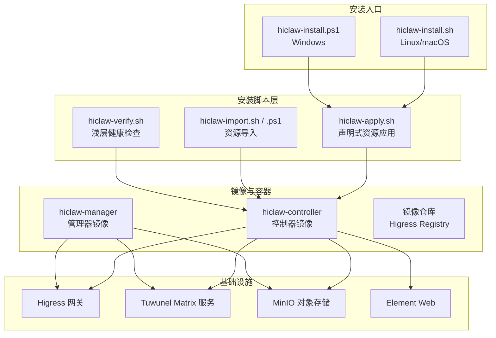
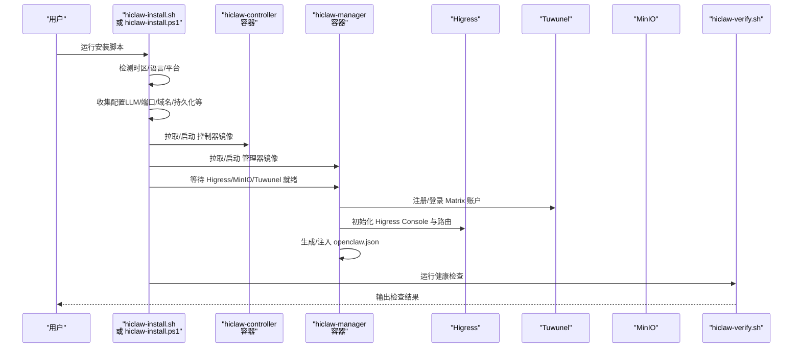
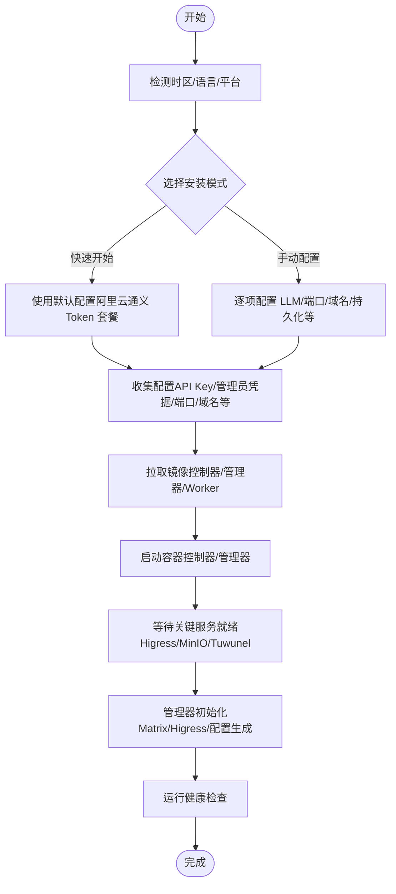
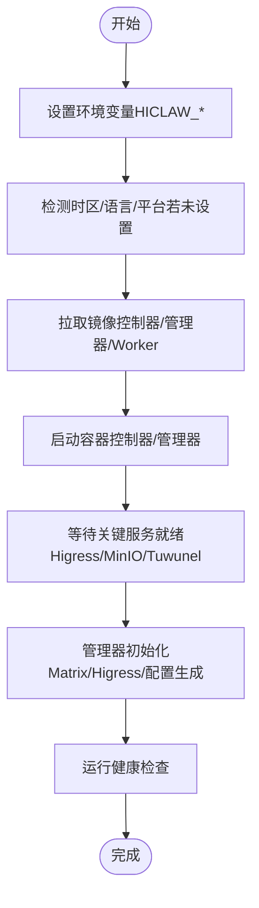
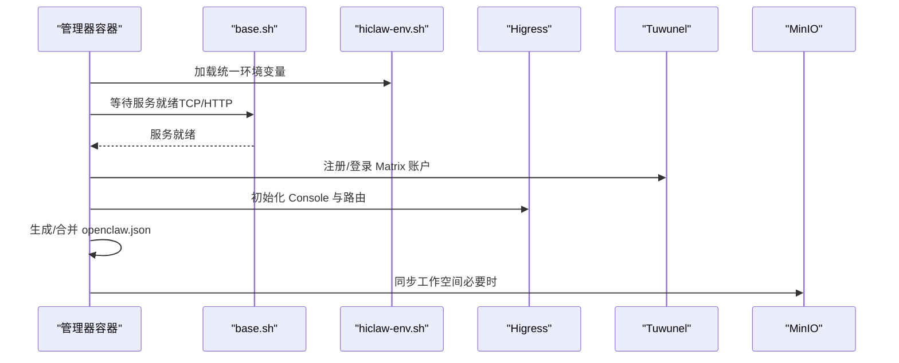
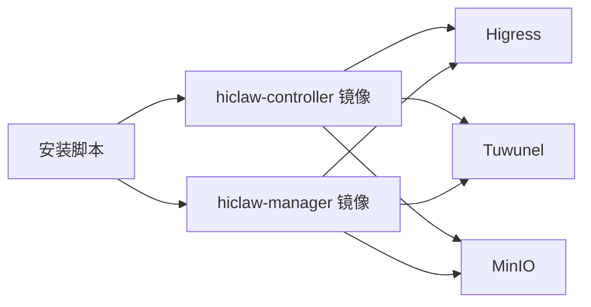

# 安装流程步骤

<cite>
**本文引用的文件**
- [install/README.md](file://install/README.md)
- [install/hiclaw-install.sh](file://install/hiclaw-install.sh)
- [install/hiclaw-install.ps1](file://install/hiclaw-install.ps1)
- [install/hiclaw-apply.sh](file://install/hiclaw-apply.sh)
- [install/hiclaw-verify.sh](file://install/hiclaw-verify.sh)
- [install/hiclaw-import.sh](file://install/hiclaw-import.sh)
- [install/hiclaw-import.ps1](file://install/hiclaw-import.ps1)
- [manager/scripts/init/start-manager-agent.sh](file://manager/scripts/init/start-manager-agent.sh)
- [manager/scripts/lib/base.sh](file://manager/scripts/lib/base.sh)
- [shared/lib/hiclaw-env.sh](file://shared/lib/hiclaw-env.sh)
- [manager/Dockerfile](file://manager/Dockerfile)
- [hiclaw-controller/Dockerfile](file://hiclaw-controller/Dockerfile)
- [helm/hiclaw/values.yaml](file://helm/hiclaw/values.yaml)
- [helm/hiclaw/Chart.yaml](file://helm/hiclaw/Chart.yaml)
- [hack/kind-config.yaml](file://hack/kind-config.yaml)
</cite>

## 目录
1. [简介](#简介)
2. [项目结构](#项目结构)
3. [核心组件](#核心组件)
4. [架构总览](#架构总览)
5. [详细组件分析](#详细组件分析)
6. [依赖关系分析](#依赖关系分析)
7. [性能考虑](#性能考虑)
8. [故障排查指南](#故障排查指南)
9. [结论](#结论)
10. [附录](#附录)

## 简介
本文件面向 HiClaw 本地安装场景，提供完整、可追溯的安装流程步骤文档。内容涵盖环境检测、配置收集、镜像拉取、容器启动、服务就绪检查、初始化配置、安装进度监控与故障排查等关键环节，并给出交互式与非交互式两种安装流程图。文档严格基于仓库源文件进行分析与总结，确保每一步骤均可在实际环境中复现。

## 项目结构
HiClaw 的本地安装主要由安装脚本、控制器镜像、管理器镜像以及配套的 Helm Chart 组成。安装脚本负责检测环境、收集配置、拉取镜像、启动容器、等待服务就绪并完成初始化；控制器镜像提供管理器所需的 CLI、CRD、嵌入式基础设施（Higress、Tuwunel、MinIO）等；管理器镜像承载 OpenClaw/Copaw/Hermes Agent 并负责与 Matrix、AI 网关、存储等组件交互。

图表来源
- [install/hiclaw-install.sh:1-800](file://install/hiclaw-install.sh#L1-L800)
- [install/hiclaw-install.ps1:1-800](file://install/hiclaw-install.ps1#L1-L800)
- [install/hiclaw-apply.sh:1-85](file://install/hiclaw-apply.sh#L1-L85)
- [install/hiclaw-import.sh:1-140](file://install/hiclaw-import.sh#L1-L140)
- [install/hiclaw-import.ps1:1-169](file://install/hiclaw-import.ps1#L1-L169)
- [install/hiclaw-verify.sh:1-176](file://install/hiclaw-verify.sh#L1-L176)
- [hiclaw-controller/Dockerfile:1-61](file://hiclaw-controller/Dockerfile#L1-L61)
- [manager/Dockerfile:1-87](file://manager/Dockerfile#L1-L87)

章节来源
- [install/README.md:1-186](file://install/README.md#L1-L186)
- [install/hiclaw-install.sh:1-800](file://install/hiclaw-install.sh#L1-L800)
- [install/hiclaw-install.ps1:1-800](file://install/hiclaw-install.ps1#L1-L800)
- [install/hiclaw-apply.sh:1-85](file://install/hiclaw-apply.sh#L1-L85)
- [install/hiclaw-import.sh:1-140](file://install/hiclaw-import.sh#L1-L140)
- [install/hiclaw-import.ps1:1-169](file://install/hiclaw-import.ps1#L1-L169)
- [install/hiclaw-verify.sh:1-176](file://install/hiclaw-verify.sh#L1-L176)
- [hiclaw-controller/Dockerfile:1-61](file://hiclaw-controller/Dockerfile#L1-L61)
- [manager/Dockerfile:1-87](file://manager/Dockerfile#L1-L87)

## 核心组件
- 安装脚本（交互式/非交互式）
  - Linux/macOS: [hiclaw-install.sh:1-800](file://install/hiclaw-install.sh#L1-L800)
  - Windows: [hiclaw-install.ps1:1-800](file://install/hiclaw-install.ps1#L1-L800)
- 声明式资源应用
  - [hiclaw-apply.sh:1-85](file://install/hiclaw-apply.sh#L1-L85)
- 资源导入工具
  - Linux/macOS: [hiclaw-import.sh:1-140](file://install/hiclaw-import.sh#L1-L140)
  - Windows: [hiclaw-import.ps1:1-169](file://install/hiclaw-import.ps1#L1-L169)
- 健康检查
  - [hiclaw-verify.sh:1-176](file://install/hiclaw-verify.sh#L1-L176)
- 管理器启动脚本
  - [start-manager-agent.sh:1-800](file://manager/scripts/init/start-manager-agent.sh#L1-L800)
- 环境与等待工具
  - [base.sh:1-61](file://manager/scripts/lib/base.sh#L1-L61)
  - [hiclaw-env.sh:1-52](file://shared/lib/hiclaw-env.sh#L1-L52)
- 镜像构建
  - 控制器镜像: [hiclaw-controller/Dockerfile:1-61](file://hiclaw-controller/Dockerfile#L1-L61)
  - 管理器镜像: [manager/Dockerfile:1-87](file://manager/Dockerfile#L1-L87)
- Helm Chart（用于 K8s 场景）
  - [Chart.yaml:1-28](file://helm/hiclaw/Chart.yaml#L1-L28)
  - [values.yaml:1-263](file://helm/hiclaw/values.yaml#L1-L263)

章节来源
- [install/hiclaw-install.sh:1-800](file://install/hiclaw-install.sh#L1-L800)
- [install/hiclaw-install.ps1:1-800](file://install/hiclaw-install.ps1#L1-L800)
- [install/hiclaw-apply.sh:1-85](file://install/hiclaw-apply.sh#L1-L85)
- [install/hiclaw-import.sh:1-140](file://install/hiclaw-import.sh#L1-L140)
- [install/hiclaw-import.ps1:1-169](file://install/hiclaw-import.ps1#L1-L169)
- [install/hiclaw-verify.sh:1-176](file://install/hiclaw-verify.sh#L1-L176)
- [manager/scripts/init/start-manager-agent.sh:1-800](file://manager/scripts/init/start-manager-agent.sh#L1-L800)
- [manager/scripts/lib/base.sh:1-61](file://manager/scripts/lib/base.sh#L1-L61)
- [shared/lib/hiclaw-env.sh:1-52](file://shared/lib/hiclaw-env.sh#L1-L52)
- [hiclaw-controller/Dockerfile:1-61](file://hiclaw-controller/Dockerfile#L1-L61)
- [manager/Dockerfile:1-87](file://manager/Dockerfile#L1-L87)
- [helm/hiclaw/Chart.yaml:1-28](file://helm/hiclaw/Chart.yaml#L1-L28)
- [helm/hiclaw/values.yaml:1-263](file://helm/hiclaw/values.yaml#L1-L263)

## 架构总览
下图展示本地安装的核心交互：安装脚本检测环境、收集配置、拉取镜像、启动容器并等待关键服务就绪，随后由管理器启动脚本完成初始化（注册 Matrix 账户、Higress 初始化、生成 openclaw.json 等），最后通过健康检查确认各组件可达。

图表来源
- [install/hiclaw-install.sh:1-800](file://install/hiclaw-install.sh#L1-L800)
- [install/hiclaw-install.ps1:1-800](file://install/hiclaw-install.ps1#L1-L800)
- [install/hiclaw-verify.sh:1-176](file://install/hiclaw-verify.sh#L1-L176)
- [manager/scripts/init/start-manager-agent.sh:1-800](file://manager/scripts/init/start-manager-agent.sh#L1-L800)

## 详细组件分析

### 交互式安装流程（Linux/macOS）

图表来源
- [install/hiclaw-install.sh:1-800](file://install/hiclaw-install.sh#L1-L800)
- [install/hiclaw-verify.sh:1-176](file://install/hiclaw-verify.sh#L1-L176)
- [manager/scripts/init/start-manager-agent.sh:1-800](file://manager/scripts/init/start-manager-agent.sh#L1-L800)

章节来源
- [install/hiclaw-install.sh:1-800](file://install/hiclaw-install.sh#L1-L800)
- [install/README.md:1-186](file://install/README.md#L1-L186)

### 非交互式安装流程（自动化）

图表来源
- [install/hiclaw-install.sh:1-800](file://install/hiclaw-install.sh#L1-L800)
- [install/hiclaw-verify.sh:1-176](file://install/hiclaw-verify.sh#L1-L176)
- [manager/scripts/init/start-manager-agent.sh:1-800](file://manager/scripts/init/start-manager-agent.sh#L1-L800)

章节来源
- [install/hiclaw-install.sh:1-800](file://install/hiclaw-install.sh#L1-L800)
- [install/README.md:117-134](file://install/README.md#L117-L134)

### 管理器启动与初始化流程

图表来源
- [manager/scripts/init/start-manager-agent.sh:1-800](file://manager/scripts/init/start-manager-agent.sh#L1-L800)
- [manager/scripts/lib/base.sh:1-61](file://manager/scripts/lib/base.sh#L1-L61)
- [shared/lib/hiclaw-env.sh:1-52](file://shared/lib/hiclaw-env.sh#L1-L52)

章节来源
- [manager/scripts/init/start-manager-agent.sh:1-800](file://manager/scripts/init/start-manager-agent.sh#L1-L800)
- [manager/scripts/lib/base.sh:1-61](file://manager/scripts/lib/base.sh#L1-L61)
- [shared/lib/hiclaw-env.sh:1-52](file://shared/lib/hiclaw-env.sh#L1-L52)

### 声明式资源应用与资源导入
- 声明式应用：通过 [hiclaw-apply.sh:1-85](file://install/hiclaw-apply.sh#L1-L85) 将 YAML 资源转发至管理器容器内的 hiclaw CLI 执行。
- 资源导入：通过 [hiclaw-import.sh:1-140](file://install/hiclaw-import.sh#L1-L140) 或 [hiclaw-import.ps1:1-169](file://install/hiclaw-import.ps1#L1-L169) 支持 ZIP 包、远程包、Nacos 包等导入。

章节来源
- [install/hiclaw-apply.sh:1-85](file://install/hiclaw-apply.sh#L1-L85)
- [install/hiclaw-import.sh:1-140](file://install/hiclaw-import.sh#L1-L140)
- [install/hiclaw-import.ps1:1-169](file://install/hiclaw-import.ps1#L1-L169)

## 依赖关系分析
- 安装脚本依赖 Docker/Podman 运行时，检测容器 socket 并决定是否启用直接创建 Worker 的能力。
- 管理器镜像基于 openclaw-base，不包含 Higress/Tuwunel/MinIO，这些由控制器镜像或 Helm Chart 提供。
- 控制器镜像包含 hiclaw CLI、kube-apiserver、CRD 与 MinIO 客户端，用于集群或本地嵌入式部署。
- 管理器启动脚本通过统一环境变量与等待工具实现跨环境一致性。

图表来源
- [hiclaw-controller/Dockerfile:1-61](file://hiclaw-controller/Dockerfile#L1-L61)
- [manager/Dockerfile:1-87](file://manager/Dockerfile#L1-L87)
- [install/hiclaw-install.sh:1-800](file://install/hiclaw-install.sh#L1-L800)

章节来源
- [hiclaw-controller/Dockerfile:1-61](file://hiclaw-controller/Dockerfile#L1-L61)
- [manager/Dockerfile:1-87](file://manager/Dockerfile#L1-L87)
- [install/hiclaw-install.sh:1-800](file://install/hiclaw-install.sh#L1-L800)

## 性能考虑
- 镜像拉取：首次安装建议在稳定网络环境下进行，避免重复拉取失败导致的重试成本。
- 等待策略：管理器启动脚本对关键服务采用轮询等待，超时时间可调（默认 120~180s），可根据硬件性能适当调整。
- 端口占用：安装脚本会检测端口占用情况并提示绑定策略（仅本机或对外暴露），合理选择可减少网络开销与安全风险。
- 存储同步：首次启动时管理器会从 MinIO 同步工作空间，网络较慢时可能影响初始化速度。

## 故障排查指南
- 安装脚本日志
  - Linux/macOS：安装日志输出到用户主目录下的 hiclaw-install.log，便于定位问题。
  - Windows：使用 Start-Transcript 记录日志，位于用户配置目录。
- 常见问题与解决方案
  - Docker 未运行：安装脚本会检测并提示先安装/启动 Docker Desktop 或 Podman Desktop。
  - 端口冲突：根据提示调整端口或改为仅本机绑定。
  - LLM API 连通性失败：检查 API Key、Base URL 与网络连通性；脚本提供测试与提示信息。
  - 管理器未就绪：查看 hiclaw-verify.sh 输出，确认 Higress、MinIO、Matrix 是否可达。
  - 管理器启动失败：查看容器日志（docker logs <容器名>），结合安装日志定位根因。
- 健康检查
  - 使用 [hiclaw-verify.sh:1-176](file://install/hiclaw-verify.sh#L1-L176) 对 Manager 容器、MinIO、Matrix、Higress 网关与 Console 进行浅层验证，失败项逐条检查。

章节来源
- [install/hiclaw-install.sh:63-78](file://install/hiclaw-install.sh#L63-L78)
- [install/hiclaw-install.ps1:77-94](file://install/hiclaw-install.ps1#L77-L94)
- [install/hiclaw-verify.sh:1-176](file://install/hiclaw-verify.sh#L1-L176)

## 结论
HiClaw 本地安装流程以安装脚本为核心入口，结合控制器与管理器镜像完成端到端部署。通过交互式与非交互式两种模式满足不同用户需求，配合健康检查与日志记录，能够高效完成环境检测、配置收集、镜像拉取、容器启动、服务就绪与初始化配置等关键步骤。建议在稳定网络与充足资源条件下执行安装，并在出现问题时结合健康检查与日志进行定位。

## 附录
- 安装模式与环境变量
  - 交互式/非交互式安装模式与环境变量详见 [install/README.md:117-151](file://install/README.md#L117-L151)。
- Helm Chart（K8s 场景）
  - Helm Chart 与 values.yaml 描述了 K8s 下的部署参数与默认配置，适用于集群化部署。
- 本地开发（Kind）
  - 通过 [hack/kind-config.yaml:1-17](file://hack/kind-config.yaml#L1-L17) 可在 Kind 集群中快速体验，映射 Higress 网关端口至本地 18080。

章节来源
- [install/README.md:117-151](file://install/README.md#L117-L151)
- [helm/hiclaw/Chart.yaml:1-28](file://helm/hiclaw/Chart.yaml#L1-L28)
- [helm/hiclaw/values.yaml:1-263](file://helm/hiclaw/values.yaml#L1-L263)
- [hack/kind-config.yaml:1-17](file://hack/kind-config.yaml#L1-L17)