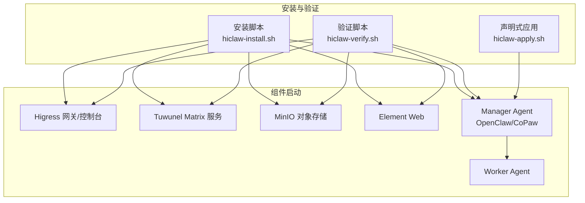
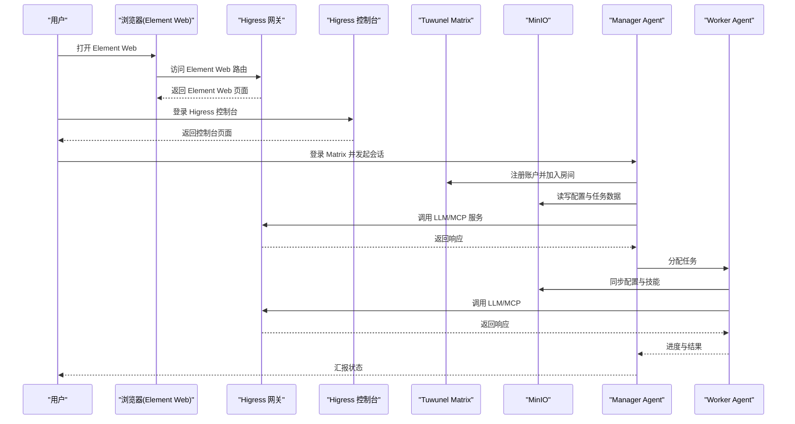
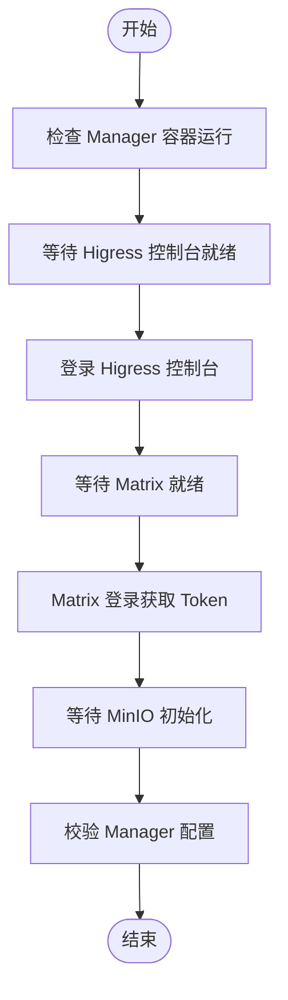
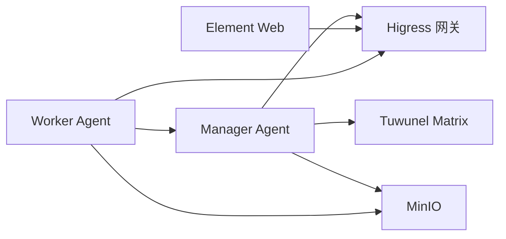

# 安装验证与测试

<cite>
**本文档引用的文件**
- [install/README.md](file://install/README.md)
- [install/hiclaw-verify.sh](file://install/hiclaw-verify.sh)
- [install/hiclaw-install.sh](file://install/hiclaw-install.sh)
- [install/hiclaw-apply.sh](file://install/hiclaw-apply.sh)
- [manager/scripts/init/setup-higress.sh](file://manager/scripts/init/setup-higress.sh)
- [manager/scripts/init/start-manager-agent.sh](file://manager/scripts/init/start-manager-agent.sh)
- [manager/scripts/init/start-element-web.sh](file://manager/scripts/init/start-element-web.sh)
- [manager/tests/smoke-test.sh](file://manager/tests/smoke-test.sh)
- [tests/test-01-manager-boot.sh](file://tests/test-01-manager-boot.sh)
- [tests/test-02-create-worker.sh](file://tests/test-02-create-worker.sh)
- [tests/test-05-heartbeat.sh](file://tests/test-05-heartbeat.sh)
- [tests/lib/test-helpers.sh](file://tests/lib/test-helpers.sh)
- [README.md](file://README.md)
- [docs/quickstart.md](file://docs/quickstart.md)
- [docs/manager-guide.md](file://docs/manager-guide.md)
- [docs/worker-guide.md](file://docs/worker-guide.md)
</cite>

## 目录
1. [简介](#简介)
2. [项目结构](#项目结构)
3. [核心组件](#核心组件)
4. [架构总览](#架构总览)
5. [详细组件分析](#详细组件分析)
6. [依赖关系分析](#依赖关系分析)
7. [性能考虑](#性能考虑)
8. [故障排除指南](#故障排除指南)
9. [结论](#结论)
10. [附录](#附录)

## 简介
本文件面向 HiClaw 本地安装后的验证与测试，提供系统化的验证清单、自动化脚本与手动步骤，覆盖 Manager 服务就绪检查、Matrix 服务可用性测试、LLM API 连通性测试、Embedding API 测试、Element Web 访问验证、移动端连接测试等。同时给出常见验证失败原因与修复方法，并明确安装成功的判定标准与后续操作指引。

## 项目结构
HiClaw 的安装验证涉及多个层次：
- 安装脚本层：一键安装、环境变量注入、端口映射、服务初始化
- 验证脚本层：浅层健康检查、集成测试套件
- 组件启动层：Higress 网关与控制台、Tuwunel Matrix、MinIO、Element Web
- 应用层：Manager Agent（OpenClaw/CoPaw）、Worker Agent、MCP 服务器

**图表来源**
- [install/hiclaw-install.sh:1-120](file://install/hiclaw-install.sh#L1-L120)
- [install/hiclaw-verify.sh:1-176](file://install/hiclaw-verify.sh#L1-L176)
- [install/hiclaw-apply.sh:1-85](file://install/hiclaw-apply.sh#L1-L85)
- [manager/scripts/init/setup-higress.sh:1-327](file://manager/scripts/init/setup-higress.sh#L1-L327)
- [manager/scripts/init/start-manager-agent.sh:1-464](file://manager/scripts/init/start-manager-agent.sh#L1-L464)
- [manager/scripts/init/start-element-web.sh:1-147](file://manager/scripts/init/start-element-web.sh#L1-L147)

**章节来源**
- [install/README.md:1-186](file://install/README.md#L1-L186)
- [install/hiclaw-install.sh:1-120](file://install/hiclaw-install.sh#L1-L120)

## 核心组件
- Manager 服务：负责协调 Worker、路由 LLM/MCP 请求、维护 Matrix 房间与状态
- Higress 网关/控制台：统一入口、路由规则、消费者鉴权、AI 路由与 MCP 服务器注册
- Tuwunel Matrix：自建 Matrix 服务器，提供聊天协议与房间管理
- MinIO：共享文件系统，存储 Agent 配置、任务数据与日志
- Element Web：零配置浏览器客户端，用于访问 Matrix 与管理控制台
- Worker Agent：轻量无状态容器，按需创建与销毁，同步配置并执行任务

**章节来源**
- [docs/manager-guide.md:1-298](file://docs/manager-guide.md#L1-L298)
- [docs/worker-guide.md:1-185](file://docs/worker-guide.md#L1-L185)

## 架构总览
下图展示本地安装后各组件间的交互关系与验证要点：

**图表来源**
- [manager/scripts/init/setup-higress.sh:160-327](file://manager/scripts/init/setup-higress.sh#L160-L327)
- [manager/scripts/init/start-manager-agent.sh:298-464](file://manager/scripts/init/start-manager-agent.sh#L298-L464)
- [manager/scripts/init/start-element-web.sh:37-141](file://manager/scripts/init/start-element-web.sh#L37-L141)

## 详细组件分析

### Manager 服务就绪检查
- 目标：确认 Manager 容器运行、Higress 控制台会话有效、Matrix 登录成功、MinIO 存储可用、Manager Agent 配置正确
- 自动化验证：使用安装脚本内置的等待逻辑与健康检查
- 手动验证：通过 curl 检查内部服务端口与外部端口可达性

验证步骤
- 检查 Manager 容器运行状态
- 等待 Higress 控制台初始化并登录
- 等待 Tuwunel Matrix 就绪并通过版本接口探测
- 等待 MinIO 初始化并返回健康状态
- 登录 Matrix 获取 Manager Token
- 校验 Manager Agent 配置文件存在且关键字段正确

**图表来源**
- [manager/scripts/init/start-manager-agent.sh:106-290](file://manager/scripts/init/start-manager-agent.sh#L106-L290)
- [manager/scripts/init/setup-higress.sh:298-375](file://manager/scripts/init/setup-higress.sh#L298-L375)

**章节来源**
- [install/hiclaw-install.sh:650-672](file://install/hiclaw-install.sh#L650-L672)
- [tests/test-01-manager-boot.sh:14-102](file://tests/test-01-manager-boot.sh#L14-L102)

### Matrix 服务可用性测试
- 目标：验证 Matrix 服务器版本接口可达、房间创建与成员加入正常、消息收发无阻塞
- 方法：通过内部 exec 方式调用 Matrix API，或使用 Element Web 作为客户端验证

验证步骤
- 内部探测 Matrix 版本接口
- 登录管理员账户获取 Token
- 创建与 Manager 的 DM 房间
- 等待 Manager 自动加入房间
- 发送测试消息并等待回复

**章节来源**
- [tests/test-01-manager-boot.sh:51-102](file://tests/test-01-manager-boot.sh#L51-L102)
- [tests/lib/test-helpers.sh:179-264](file://tests/lib/test-helpers.sh#L179-L264)

### LLM API 连通性测试
- 目标：验证 AI Gateway 路由与 LLM 提供商配置正确，请求可转发至上游
- 方法：通过 Higress 控制台创建/更新提供商与 AI 路由，使用 curl 测试 /v1/models 或 /chat 接口

验证步骤
- 在 Higress 控制台创建/更新 LLM 提供商（qwen 或 openai-compat）
- 配置 AI 路由并启用消费者鉴权
- 使用 Manager Gateway Key 调用 /v1/models 或 /chat 接口
- 校验返回状态码与响应内容

**章节来源**
- [manager/scripts/init/setup-higress.sh:185-285](file://manager/scripts/init/setup-higress.sh#L185-L285)
- [docs/manager-guide.md:189-198](file://docs/manager-guide.md#L189-L198)

### Embedding API 测试
- 目标：验证记忆搜索（Memory Search）功能可用，若配置了 Embedding 模型则应生效
- 方法：在 Manager 配置中启用嵌入模型并在 Worker 中验证其使用

验证步骤
- 在 Manager 配置中设置 HICLAW_EMBEDDING_MODEL
- 观察 Worker openclaw.json 是否包含 memorySearch 字段
- 通过聊天触发记忆检索并检查返回结果

**章节来源**
- [install/hiclaw-install.sh:690-713](file://install/hiclaw-install.sh#L690-L713)
- [manager/scripts/init/start-manager-agent.sh:746-770](file://manager/scripts/init/start-manager-agent.sh#L746-L770)

### Element Web 访问验证
- 目标：确认 Element Web 可直接访问或通过网关域名访问，登录成功并能进入与 Manager 的 DM 房间
- 方法：使用浏览器访问 http://127.0.0.1:18088 或通过网关域名访问

验证步骤
- 访问 Element Web 端口
- 使用管理员凭据登录
- 查找与 Manager 的 DM 房间并进入
- 发送一条测试消息并等待回复

**章节来源**
- [install/README.md:171-186](file://install/README.md#L171-L186)
- [docs/quickstart.md:62-77](file://docs/quickstart.md#L62-L77)

### 移动端连接测试
- 目标：验证移动端（Element/FluffyChat）可连接到本地 Matrix 服务器
- 方法：在移动设备上设置 homeserver 地址为 http://<本机局域网IP>:18080 并登录

验证步骤
- 在移动设备上安装 Element/FluffyChat
- 设置 homeserver 为 http://<本机局域网IP>:18080
- 使用管理员凭据登录并进入与 Manager 的 DM 房间
- 发送测试消息并等待回复

**章节来源**
- [install/README.md:179-186](file://install/README.md#L179-L186)
- [docs/quickstart.md:80-141](file://docs/quickstart.md#L80-L141)

### 声明式资源管理验证
- 目标：验证通过 hiclaw-apply.sh 将 YAML 资源应用到 Manager 的能力
- 方法：准备 Worker/Team/Human 资源 YAML，使用 hiclaw-apply.sh 推送到 Manager 容器并执行 apply

验证步骤
- 准备资源 YAML 文件
- 使用 hiclaw-apply.sh -f resource.yaml 推送并应用
- 在 Manager 容器内确认资源状态（hiclaw get）

**章节来源**
- [install/hiclaw-apply.sh:1-85](file://install/hiclaw-apply.sh#L1-L85)
- [docs/quickstart.md:53-60](file://docs/quickstart.md#L53-L60)

## 依赖关系分析
- Manager 依赖 Higress 网关进行 LLM/MCP 请求转发
- Manager 依赖 Tuwunel Matrix 进行消息通信
- Manager 依赖 MinIO 进行配置与任务数据存储
- Element Web 依赖 Higress 网关暴露的路由
- Worker 依赖 Manager 提供的配置与密钥

**图表来源**
- [manager/scripts/init/setup-higress.sh:160-327](file://manager/scripts/init/setup-higress.sh#L160-L327)
- [manager/scripts/init/start-manager-agent.sh:620-790](file://manager/scripts/init/start-manager-agent.sh#L620-L790)

**章节来源**
- [docs/manager-guide.md:158-206](file://docs/manager-guide.md#L158-L206)

## 性能考虑
- 端口绑定策略：本地仅绑定 127.0.0.1 可减少暴露面，但需通过网关域名访问；绑定 0.0.0.0 可直接访问但需注意安全
- 超时与重试：安装脚本对关键服务设置了合理的等待时间与重试逻辑，避免误判
- 资源占用：多 Worker 场景建议分配 4 核心/8GB 内存以上

**章节来源**
- [install/hiclaw-install.sh:456-490](file://install/hiclaw-install.sh#L456-L490)
- [README.md:56-58](file://README.md#L56-L58)

## 故障排除指南
常见问题与修复方法
- Higress 控制台无法登录
  - 现象：登录后返回 401/403 或会话无效
  - 处理：确认管理员凭据正确；重新登录并验证 Cookie 是否有效；必要时重启控制台
- Matrix 服务不可达
  - 现象：/_matrix/client/versions 返回非 200
  - 处理：检查 Tuwunel 容器状态；确认端口映射；查看日志
- MinIO 未初始化
  - 现象：/minio/health/live 返回非 200
  - 处理：等待初始化完成；检查存储卷挂载；确认 mc 别名配置
- Element Web 无法加载
  - 现象：浏览器访问 8088 端口白屏或 404
  - 处理：确认 Nginx 配置；检查反代与 CSP；确认端口映射
- Manager Agent 配置缺失
  - 现象：openclaw.json 或 agent.json 缺失关键字段
  - 处理：确认生成流程完成；检查内存搜索配置；核对模型参数
- LLM API 调用失败
  - 现象：401/403/404 或无响应
  - 处理：核对提供商配置与 API Key；确认 AI 路由与消费者鉴权；检查上游服务状态
- 移动端无法连接
  - 现象：移动端提示连接失败或无法登录
  - 处理：确认 homeserver 地址为 http://<本机局域网IP>:18080；检查防火墙与端口；确保 DNS 解析

定位与诊断
- 日志查看：hiclaw-controller/hiclaw-manager 容器的日志与 Higress/Tuwunel/MinIO 的系统日志
- 健康检查：使用 curl 或安装脚本内置的健康检查命令
- 调试工具：export-debug-log.py 导出调试日志并结合代码库分析

**章节来源**
- [docs/manager-guide.md:158-206](file://docs/manager-guide.md#L158-L206)
- [docs/worker-guide.md:61-123](file://docs/worker-guide.md#L61-L123)

## 结论
通过上述验证流程与故障排除方法，可以系统性地确认 HiClaw 本地安装的正确性与稳定性。建议在安装完成后立即执行自动化验证脚本，并结合手动步骤进行交叉验证，确保各组件协同工作。对于生产或团队协作场景，建议进一步完善监控与备份策略。

## 附录

### 安装成功判定标准
- Manager 容器运行且健康
- Higress 控制台可登录并显示消费者与路由
- Matrix 服务就绪，管理员与 Manager 可互相登录并建立 DM 房间
- MinIO 存储初始化完成，Manager 配置与任务数据可读写
- Element Web 可访问并登录
- LLM/MCP 路由配置正确，可返回有效响应
- Worker 可按需创建并接入房间

**章节来源**
- [tests/test-01-manager-boot.sh:14-134](file://tests/test-01-manager-boot.sh#L14-L134)
- [manager/tests/smoke-test.sh:24-70](file://manager/tests/smoke-test.sh#L24-L70)

### 后续操作指引
- 首次使用：在 Element Web 中与 Manager 聊天，创建第一个 Worker
- 多 Worker 协作：在 DM 中分配任务，观察 Manager 协调与 Worker 执行
- GitHub 集成：配置 GitHub PAT，启用 MCP Server 并授权 Worker
- 监控与备份：定期导出调试日志，备份 hiclaw-data 卷

**章节来源**
- [docs/quickstart.md:1-356](file://docs/quickstart.md#L1-L356)
- [docs/manager-guide.md:207-271](file://docs/manager-guide.md#L207-L271)