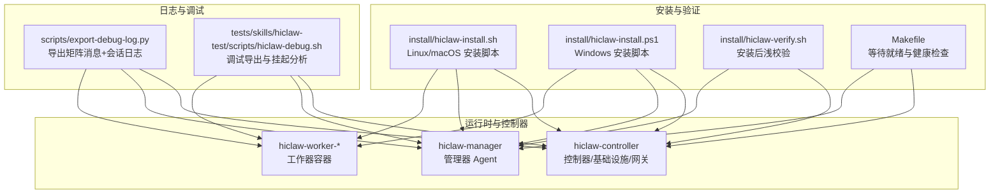
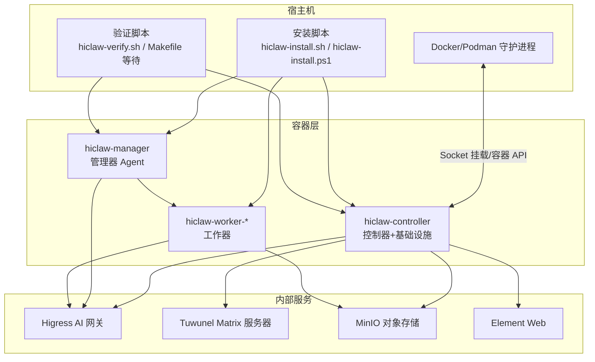
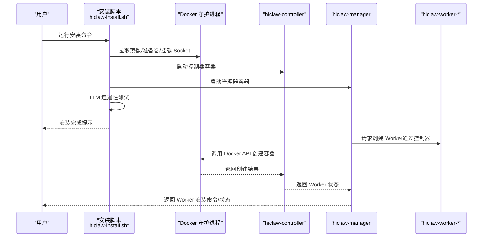
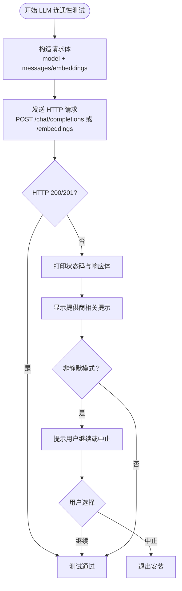
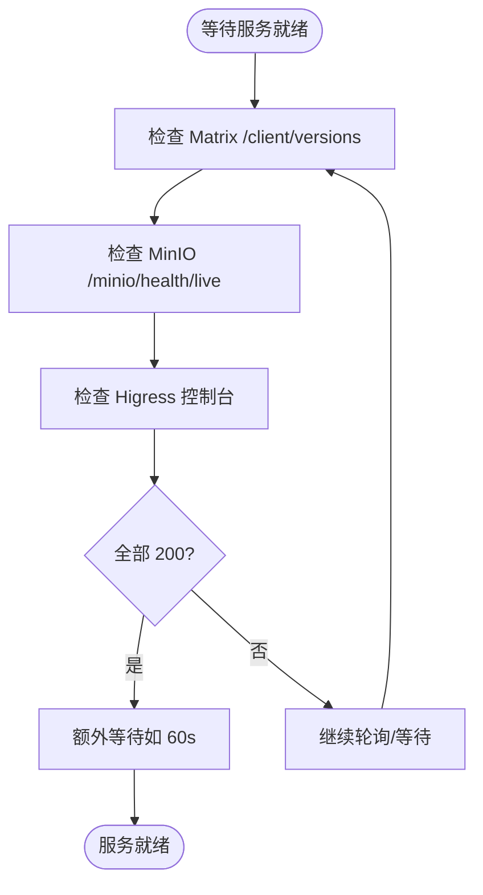
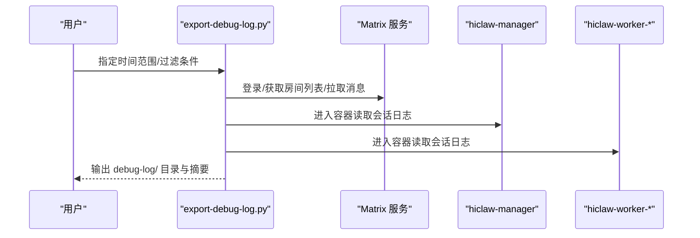
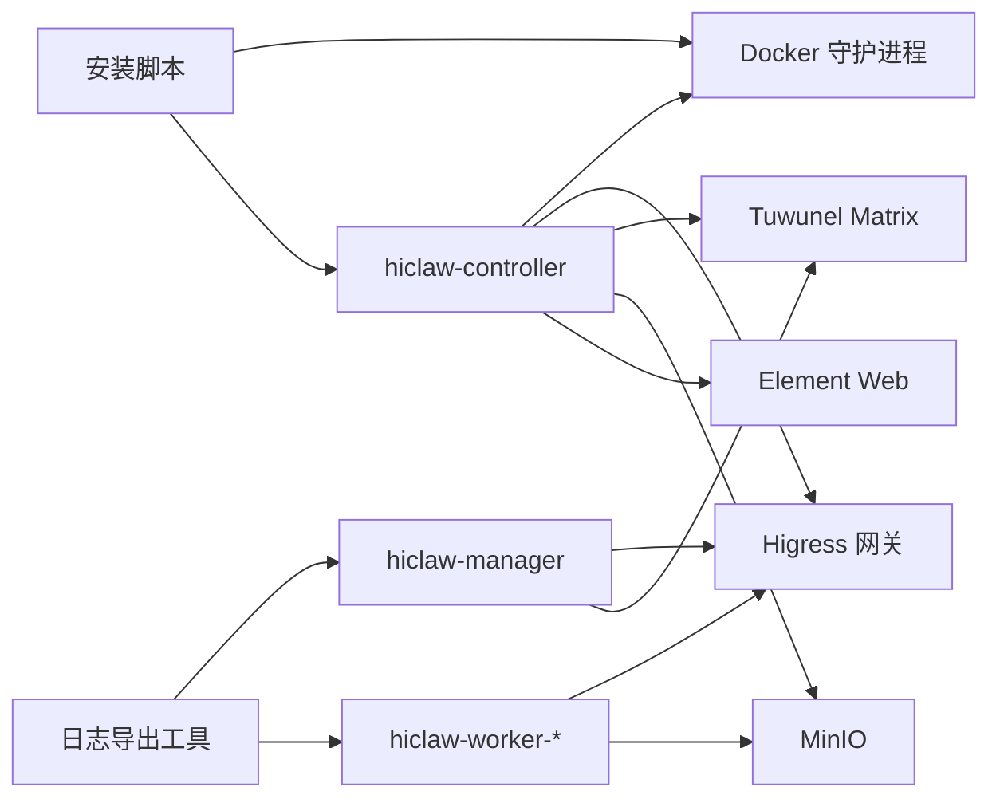

# 常见问题与故障排除

<cite>
**本文引用的文件**
- [README.md](file://README.md)
- [install/README.md](file://install/README.md)
- [docs/faq.md](file://docs/faq.md)
- [docs/zh-cn/quickstart.md](file://docs/zh-cn/quickstart.md)
- [scripts/export-debug-log.py](file://scripts/export-debug-log.py)
- [tests/skills/hiclaw-test/scripts/hiclaw-debug.sh](file://tests/skills/hiclaw-test/scripts/hiclaw-debug.sh)
- [install/hiclaw-install.sh](file://install/hiclaw-install.sh)
- [install/hiclaw-install.ps1](file://install/hiclaw-install.ps1)
- [install/hiclaw-verify.sh](file://install/hiclaw-verify.sh)
- [Makefile](file://Makefile)
- [tests/lib/test-helpers.sh](file://tests/lib/test-helpers.sh)
- [hiclaw-controller/internal/backend/docker.go](file://hiclaw-controller/internal/backend/docker.go)
- [hiclaw-controller/internal/initializer/initializer.go](file://hiclaw-controller/internal/initializer/initializer.go)
- [hiclaw-controller/internal/proxy/security_test.go](file://hiclaw-controller/internal/proxy/security_test.go)
- [hiclaw-controller/internal/service/provisioner.go](file://hiclaw-controller/internal/service/provisioner.go)
- [manager/agent/skills/worker-management/scripts/lifecycle-worker.sh](file://manager/agent/skills/worker-management/scripts/lifecycle-worker.sh)
</cite>

## 目录
1. [简介](#简介)
2. [项目结构](#项目结构)
3. [核心组件](#核心组件)
4. [架构总览](#架构总览)
5. [详细组件分析](#详细组件分析)
6. [依赖关系分析](#依赖关系分析)
7. [性能考虑](#性能考虑)
8. [故障排除指南](#故障排除指南)
9. [结论](#结论)
10. [附录](#附录)

## 简介
本文件面向 HiClaw 本地安装场景，系统性整理安装过程中最常遇到的问题与排障方法，涵盖 Docker 权限、端口冲突、网络连通、LLM API 配置、容器启动与健康检查、服务就绪超时等主题。每类问题提供症状、原因分析、解决方案与预防措施，并给出日志导出与调试技巧、问题报告模板与社区支持渠道。

## 项目结构
HiClaw 采用多容器架构，安装脚本负责拉起控制器与管理器容器，再由管理器按需创建 Worker 容器。关键安装与排障相关文件如下：
- 安装脚本：install/hiclaw-install.sh（Linux/macOS）、install/hiclaw-install.ps1（Windows）
- 验证脚本：install/hiclaw-verify.sh、Makefile 中的等待逻辑
- 控制器与后端：hiclaw-controller 内部的 Docker 后端、初始化与探活逻辑
- 日志导出：scripts/export-debug-log.py、tests/skills/hiclaw-test/scripts/hiclaw-debug.sh
- 文档与 FAQ：docs/faq.md、docs/zh-cn/quickstart.md

图示来源
- [install/hiclaw-install.sh:1-200](file://install/hiclaw-install.sh#L1-L200)
- [install/hiclaw-install.ps1:2507-2530](file://install/hiclaw-install.ps1#L2507-L2530)
- [install/hiclaw-verify.sh:1-175](file://install/hiclaw-verify.sh#L1-L175)
- [Makefile:491-515](file://Makefile#L491-L515)
- [scripts/export-debug-log.py:1-120](file://scripts/export-debug-log.py#L1-L120)
- [tests/skills/hiclaw-test/scripts/hiclaw-debug.sh:1-176](file://tests/skills/hiclaw-test/scripts/hiclaw-debug.sh#L1-L176)

章节来源
- [README.md:54-108](file://README.md#L54-L108)
- [install/README.md:1-186](file://install/README.md#L1-L186)

## 核心组件
- 安装脚本：负责镜像拉取、环境变量注入、Docker Socket 挂载、容器运行参数组装、LLM 连通性测试、安装后验证与卸载。
- 控制器（hiclaw-controller）：统一管理基础设施（Higress、Tuwunel、MinIO、Element Web）与资源编排，负责 Worker 容器生命周期与安全策略校验。
- 管理器（hiclaw-manager）：运行 Manager Agent，负责与用户交互、任务编排、Worker 生命周期管理。
- Worker：按需创建的 Agent 容器，支持多种运行时（OpenClaw、CoPaw、Hermes）。
- 日志导出工具：导出矩阵消息与 Agent 会话日志，便于根因分析。

章节来源
- [docs/faq.md:74-198](file://docs/faq.md#L74-L198)
- [docs/zh-cn/quickstart.md:40-75](file://docs/zh-cn/quickstart.md#L40-L75)

## 架构总览
下图展示本地安装后的典型组件关系与交互路径，包括 Docker Socket 挂载、容器创建、健康检查与日志导出。

图示来源
- [install/hiclaw-install.sh:2530-2561](file://install/hiclaw-install.sh#L2530-L2561)
- [install/hiclaw-install.ps1:2507-2530](file://install/hiclaw-install.ps1#L2507-L2530)
- [install/hiclaw-verify.sh:129-164](file://install/hiclaw-verify.sh#L129-L164)
- [Makefile:491-515](file://Makefile#L491-L515)

## 详细组件分析

### 安装脚本与容器创建流程
- Docker Socket 挂载：脚本检测宿主 Docker Socket 并决定是否挂载到控制器容器，以便控制器直接调用 Docker API 创建 Worker 容器。
- 镜像拉取与版本：根据运行时与版本选择合适的镜像，避免重复拉取。
- LLM 连通性测试：在安装前对 OpenAI 兼容接口进行连通性探测，失败时给出提示与继续选项。
- 容器创建与冲突处理：控制器通过 Docker Engine API 创建容器，若同名冲突则先删除再重试一次。

图示来源
- [install/hiclaw-install.sh:2530-2561](file://install/hiclaw-install.sh#L2530-L2561)
- [install/hiclaw-install.sh:3294-3336](file://install/hiclaw-install.sh#L3294-L3336)
- [hiclaw-controller/internal/backend/docker.go:211-227](file://hiclaw-controller/internal/backend/docker.go#L211-L227)

章节来源
- [install/hiclaw-install.sh:2530-2561](file://install/hiclaw-install.sh#L2530-L2561)
- [install/hiclaw-install.sh:3294-3336](file://install/hiclaw-install.sh#L3294-L3336)
- [hiclaw-controller/internal/backend/docker.go:211-227](file://hiclaw-controller/internal/backend/docker.go#L211-L227)

### LLM API 配置与连通性测试
- 支持 OpenAI 兼容接口与特定提供商（如阿里云百炼）。
- 安装阶段进行 chat/completions 与 embeddings 的连通性测试，失败时输出状态码与响应体，并给出继续或中止选项。
- Windows 安装脚本同样提供连通性测试与错误提示。

图示来源
- [install/hiclaw-install.sh:3294-3336](file://install/hiclaw-install.sh#L3294-L3336)
- [install/hiclaw-install.ps1:1203-1282](file://install/hiclaw-install.ps1#L1203-L1282)

章节来源
- [install/hiclaw-install.sh:3294-3336](file://install/hiclaw-install.sh#L3294-L3336)
- [install/hiclaw-install.ps1:1203-1282](file://install/hiclaw-install.ps1#L1203-L1282)

### 容器启动与健康检查
- 控制器与管理器容器健康检查：通过 curl 或 runtime 特定健康端点判断就绪状态。
- Worker 容器状态：管理器侧维护 Worker 容器状态，支持空闲超时与自动回收。
- 等待就绪：Makefile 提供统一等待逻辑，轮询 Matrix、MinIO、Higress 控制台等服务的健康端点。

图示来源
- [Makefile:491-515](file://Makefile#L491-L515)
- [install/hiclaw-verify.sh:129-164](file://install/hiclaw-verify.sh#L129-L164)
- [tests/lib/test-helpers.sh:148-229](file://tests/lib/test-helpers.sh#L148-L229)

章节来源
- [Makefile:491-515](file://Makefile#L491-L515)
- [install/hiclaw-verify.sh:129-164](file://install/hiclaw-verify.sh#L129-L164)
- [tests/lib/test-helpers.sh:148-229](file://tests/lib/test-helpers.sh#L148-L229)

### 日志导出与调试
- 导出范围：矩阵消息（JSONL）、Agent 会话（OpenClaw/Copaw/Hermes）。
- 自动脱敏：对敏感信息（API Key、Token、邮箱、电话等）进行脱敏处理。
- 分析工具：提供挂起问题分析（如 PHASE_DONE 缺少 @manager 提示）。

图示来源
- [scripts/export-debug-log.py:19-756](file://scripts/export-debug-log.py#L19-L756)
- [tests/skills/hiclaw-test/scripts/hiclaw-debug.sh:45-176](file://tests/skills/hiclaw-test/scripts/hiclaw-debug.sh#L45-L176)

章节来源
- [scripts/export-debug-log.py:19-756](file://scripts/export-debug-log.py#L19-L756)
- [tests/skills/hiclaw-test/scripts/hiclaw-debug.sh:45-176](file://tests/skills/hiclaw-test/scripts/hiclaw-debug.sh#L45-L176)

## 依赖关系分析
- 安装脚本依赖 Docker/Podman 守护进程与 Socket 权限；Windows 使用 Docker Desktop 且需启用 WSL2 后端。
- 控制器通过 Docker Engine API 创建 Worker 容器，需满足安全策略与网络配置。
- 管理器与 Worker 依赖 Higress 网关路由 LLM 与 MCP 服务，MinIO 提供共享存储，Tuwunel 提供 IM 服务。
- 日志导出工具依赖容器内文件与 Matrix API，需确保容器处于可访问状态。

图示来源
- [install/hiclaw-install.sh:2530-2561](file://install/hiclaw-install.sh#L2530-L2561)
- [hiclaw-controller/internal/backend/docker.go:211-227](file://hiclaw-controller/internal/backend/docker.go#L211-L227)
- [scripts/export-debug-log.py:19-756](file://scripts/export-debug-log.py#L19-L756)

章节来源
- [install/hiclaw-install.sh:2530-2561](file://install/hiclaw-install.sh#L2530-L2561)
- [hiclaw-controller/internal/backend/docker.go:211-227](file://hiclaw-controller/internal/backend/docker.go#L211-L227)
- [scripts/export-debug-log.py:19-756](file://scripts/export-debug-log.py#L19-L756)

## 性能考虑
- 资源建议：最低 2 核 4GB，多 Worker 场景建议 4 核 8GB。
- 端口占用：默认端口 18080（网关）、18088（Element Web）、18001（Higress 控制台），确保未被占用。
- 网络与代理：若系统启用了代理，可能导致本地域名解析失败，需将本地域加入代理绕过列表。
- 日志与存储：MinIO 与日志体量较大时，建议使用独立磁盘与卷管理，避免 IO 抖动。

## 故障排除指南

### Docker 权限问题
- 症状
  - 安装脚本提示无法连接 Docker 守护进程或找不到 Socket。
  - 控制器无法通过 Socket 调用 Docker API 创建 Worker。
- 原因分析
  - Docker Desktop 未启动或未运行。
  - Socket 权限不足或未正确挂载。
  - Windows 使用 WSL2 后端但未启用。
- 解决方案
  - 确保 Docker Desktop/Podman 已启动并运行。
  - 在 Linux/macOS 上确认安装脚本检测到 Socket 并正确挂载。
  - Windows 确认使用 PowerShell 7+，Docker Desktop 已启用 WSL2 后端。
- 预防措施
  - 安装前运行安装脚本自带的浅校验，检查端口与服务可达性。
  - 避免在无权限或受限环境中运行安装脚本。

章节来源
- [install/hiclaw-install.sh:2530-2561](file://install/hiclaw-install.sh#L2530-L2561)
- [install/hiclaw-install.ps1:2507-2530](file://install/hiclaw-install.ps1#L2507-L2530)
- [install/hiclaw-verify.sh:129-164](file://install/hiclaw-verify.sh#L129-L164)

### 端口冲突
- 症状
  - 网关、控制台或 Element Web 无法启动或端口被占用。
- 原因分析
  - 默认端口已在其他服务中使用。
- 解决方案
  - 修改安装脚本中的端口环境变量（如 HICLAW_PORT_GATEWAY、HICLAW_PORT_CONSOLE、HICLAW_PORT_ELEMENT_WEB）。
  - 卸载后重新安装，或在宿主机释放对应端口。
- 预防措施
  - 安装前检查常用端口占用情况，必要时调整默认值。

章节来源
- [install/README.md:135-151](file://install/README.md#L135-L151)
- [install/hiclaw-install.sh:44-48](file://install/hiclaw-install.sh#L44-L48)

### 网络连接失败（本地域名/代理）
- 症状
  - 浏览器提示不安全连接或无法访问本地 Element Web。
  - Matrix 服务不可达。
- 原因分析
  - 系统代理导致本地域名解析异常。
  - 本地域名未指向 127.0.0.1。
- 解决方案
  - 关闭系统代理或将本地域加入代理绕过列表。
  - 确认本地域名解析到 127.0.0.1。
- 预防措施
  - 安装后使用安装脚本提供的浅校验进行验证。

章节来源
- [docs/faq.md:294-300](file://docs/faq.md#L294-L300)
- [install/hiclaw-verify.sh:129-164](file://install/hiclaw-verify.sh#L129-L164)

### LLM API 配置错误
- 症状
  - 安装阶段 LLM 连通性测试失败，返回非 200/201。
  - 运行中出现 401、404 或上游错误。
- 原因分析
  - API Key 错误或未激活（如阿里云百炼“编程计划”未激活）。
  - Base URL 或模型名不匹配。
  - 网络限制或代理阻断。
- 解决方案
  - 核对 API Key 与 Base URL，确保提供商已激活相应计划。
  - 使用安装脚本内置的连通性测试，按提示继续或中止。
  - 检查 Higress 路由配置，确保模型名与路由规则匹配。
- 预防措施
  - 安装前进行 LLM 连通性测试，失败时记录状态码与响应体。
  - 使用官方文档提供的路由配置示例。

章节来源
- [install/hiclaw-install.sh:3294-3336](file://install/hiclaw-install.sh#L3294-L3336)
- [install/hiclaw-install.ps1:1203-1282](file://install/hiclaw-install.ps1#L1203-L1282)
- [docs/faq.md:588-599](file://docs/faq.md#L588-L599)

### 容器启动失败
- 症状
  - 控制器创建容器失败或 Worker 容器状态异常。
  - 容器名冲突或被拒绝。
- 原因分析
  - 容器名不符合规范或包含危险路径。
  - 安全能力（Capabilities）被拒绝。
  - Docker Engine API 调用失败。
- 解决方案
  - 检查容器名是否符合控制器的安全校验规则。
  - 移除危险 Capabilities，保留必要能力（如 NET_BIND_SERVICE）。
  - 清理冲突容器后重试创建。
- 预防措施
  - 使用安装脚本生成的容器名与参数。
  - 避免自定义高风险安全选项。

章节来源
- [hiclaw-controller/internal/proxy/security_test.go:68-101](file://hiclaw-controller/internal/proxy/security_test.go#L68-L101)
- [hiclaw-controller/internal/proxy/security_test.go:279-293](file://hiclaw-controller/internal/proxy/security_test.go#L279-L293)
- [hiclaw-controller/internal/backend/docker.go:211-227](file://hiclaw-controller/internal/backend/docker.go#L211-L227)

### 服务就绪超时
- 症状
  - 安装完成后，Element Web 或 Higress 控制台无法访问。
  - 等待逻辑超时。
- 原因分析
  - 容器启动缓慢或资源不足。
  - 网络策略或防火墙阻断。
  - 健康检查端点未就绪。
- 解决方案
  - 增加宿主机资源（CPU/内存）。
  - 使用安装脚本的等待逻辑与健康检查端点逐一排查。
  - 查看控制器与管理器日志定位具体服务。
- 预防措施
  - 安装前进行浅校验，确保各服务端口可达。
  - 使用 Makefile 的等待就绪目标进行自动化验证。

章节来源
- [Makefile:491-515](file://Makefile#L491-L515)
- [install/hiclaw-verify.sh:129-164](file://install/hiclaw-verify.sh#L129-L164)
- [tests/lib/test-helpers.sh:148-229](file://tests/lib/test-helpers.sh#L148-L229)

### Worker 空闲与生命周期管理
- 症状
  - Worker 长时间空闲后被回收。
  - Worker 状态异常或无法唤醒。
- 原因分析
  - 空闲超时设置过短。
  - 非团队 Worker 的自动回收策略。
- 解决方案
  - 调整空闲超时参数，避免频繁回收。
  - 对团队 Worker 不适用自动回收策略。
- 预防措施
  - 根据使用场景合理设置空闲超时。

章节来源
- [manager/agent/skills/worker-management/scripts/lifecycle-worker.sh:204-231](file://manager/agent/skills/worker-management/scripts/lifecycle-worker.sh#L204-L231)

### 日志查看与调试技巧
- 查看管理器与控制器日志
  - 管理器 Agent 日志与会话日志。
  - 控制器/基础设施日志（Higress 网关、控制台）。
- 导出调试日志
  - 使用 export-debug-log.py 导出矩阵消息与 Agent 会话日志，支持时间范围与 PII 脱敏。
  - 使用 hiclaw-debug.sh 快速导出并分析潜在挂起问题。
- 常用命令
  - docker logs、docker exec 进入容器查看状态。
  - 使用 Higress 控制台与 Matrix/MinIO 健康端点辅助诊断。

章节来源
- [docs/faq.md:602-622](file://docs/faq.md#L602-L622)
- [scripts/export-debug-log.py:19-756](file://scripts/export-debug-log.py#L19-L756)
- [tests/skills/hiclaw-test/scripts/hiclaw-debug.sh:45-176](file://tests/skills/hiclaw-test/scripts/hiclaw-debug.sh#L45-L176)

### 问题报告模板与社区支持
- 问题报告模板（建议）
  - 环境信息：操作系统、Docker 版本、HiClaw 版本、安装方式。
  - 复现步骤：最小化复现步骤与期望/实际结果。
  - 日志附件：使用 export-debug-log.py 导出的 debug-log 目录。
  - 附加信息：网络拓扑、代理设置、端口占用情况。
- 社区支持渠道
  - Discord、GitHub Issues。

章节来源
- [README.md:363-379](file://README.md#L363-L379)

## 结论
HiClaw 本地安装的整体稳定性取决于 Docker 权限、端口与网络配置、LLM API 连通性以及容器健康检查。通过安装脚本的预检与连通性测试、控制器的健康检查与安全策略、以及完善的日志导出与调试工具，大多数安装与运行期问题均可快速定位与解决。建议在安装前完成资源与端口规划，在运行中持续关注健康检查与日志指标，并利用官方工具进行问题归因与报告。

## 附录
- 快速入口
  - 安装脚本与环境变量：参见 install/README.md 与 install/hiclaw-install.sh。
  - 常见问题与排障：参见 docs/faq.md。
  - 安装后验证：参见 install/hiclaw-verify.sh 与 Makefile。
  - 日志导出：参见 scripts/export-debug-log.py 与 tests/skills/hiclaw-test/scripts/hiclaw-debug.sh。