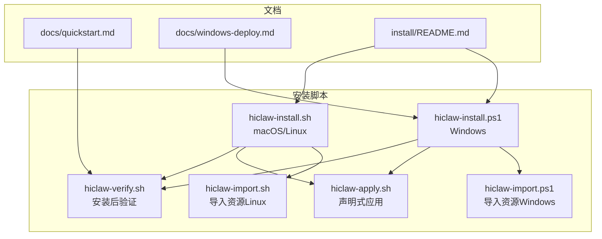
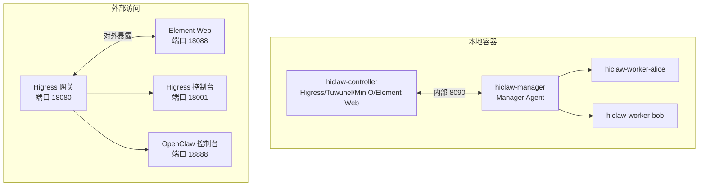
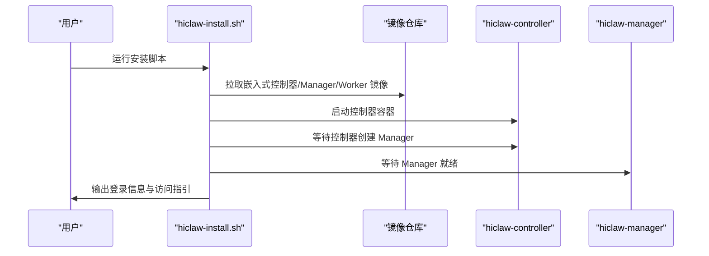
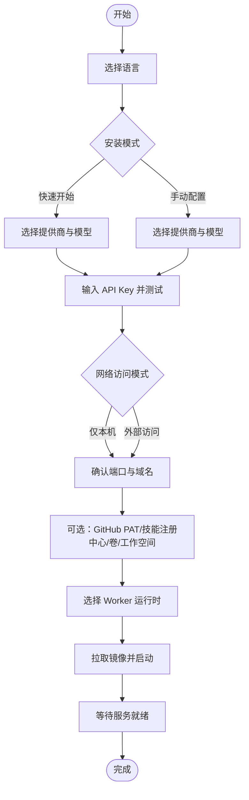
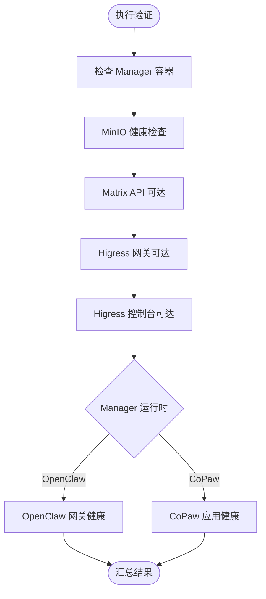
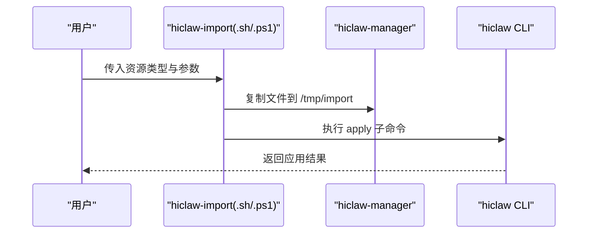
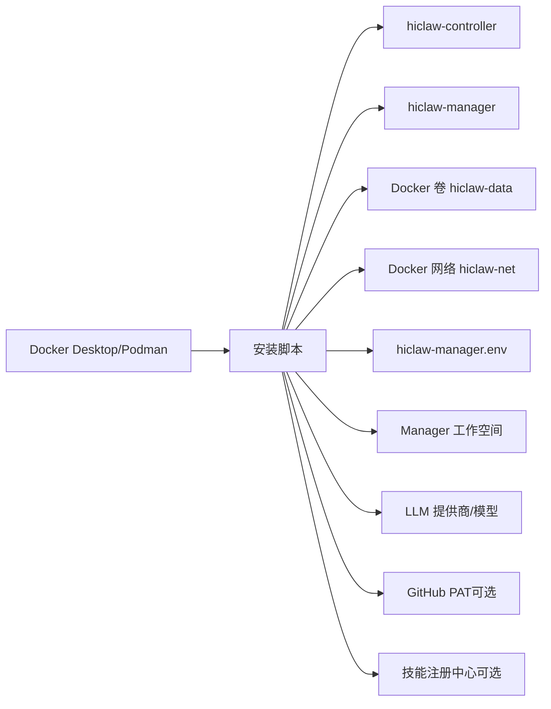

# 本地单机安装

<cite>
**本文引用的文件**
- [README.md](file://README.md)
- [install/README.md](file://install/README.md)
- [install/hiclaw-install.sh](file://install/hiclaw-install.sh)
- [install/hiclaw-install.ps1](file://install/hiclaw-install.ps1)
- [install/hiclaw-verify.sh](file://install/hiclaw-verify.sh)
- [install/hiclaw-import.sh](file://install/hiclaw-import.sh)
- [install/hiclaw-import.ps1](file://install/hiclaw-import.ps1)
- [install/hiclaw-apply.sh](file://install/hiclaw-apply.sh)
- [docs/quickstart.md](file://docs/quickstart.md)
- [docs/windows-deploy.md](file://docs/windows-deploy.md)
</cite>

## 目录
1. [简介](#简介)
2. [项目结构](#项目结构)
3. [核心组件](#核心组件)
4. [架构总览](#架构总览)
5. [详细组件分析](#详细组件分析)
6. [依赖关系分析](#依赖关系分析)
7. [性能考虑](#性能考虑)
8. [故障排除指南](#故障排除指南)
9. [结论](#结论)
10. [附录](#附录)

## 简介
本指南面向在本地单机（macOS/Linux/Windows）部署 HiClaw 的用户，提供从系统前置要求、安装脚本使用方法、交互式与非交互式安装差异、配置项详解，到安装验证、常见问题与卸载/重装的完整流程说明。HiClaw 采用“Manager-Workers 架构”，通过 Higress 网关、Tuwunel（Matrix）IM 服务器、MinIO 文件存储与 Element Web 客户端，实现企业级安全、人类可审计的人机协作。

## 项目结构
与本地单机安装直接相关的文件主要位于 install/ 目录，并辅以 docs/ 中的快速入门与 Windows 部署指南。关键文件职责如下：
- install/README.md：安装总览、模式与环境变量说明
- install/hiclaw-install.sh：macOS/Linux 一键安装脚本（含交互与非交互模式）
- install/hiclaw-install.ps1：Windows 一键安装脚本（含交互与非交互模式）
- install/hiclaw-verify.sh：安装后浅层健康检查脚本
- install/hiclaw-import.sh、install/hiclaw-import.ps1：导入 Worker/团队/人类资源的辅助脚本
- install/hiclaw-apply.sh：声明式资源管理入口（YAML 应用）
- docs/quickstart.md：快速入门与验证清单
- docs/windows-deploy.md：Windows 部署步骤与故障排除

图表来源
- [install/hiclaw-install.sh](file://install/hiclaw-install.sh)
- [install/hiclaw-install.ps1](file://install/hiclaw-install.ps1)
- [install/hiclaw-verify.sh](file://install/hiclaw-verify.sh)
- [install/hiclaw-apply.sh](file://install/hiclaw-apply.sh)
- [install/hiclaw-import.sh](file://install/hiclaw-import.sh)
- [install/hiclaw-import.ps1](file://install/hiclaw-import.ps1)
- [docs/quickstart.md](file://docs/quickstart.md)
- [docs/windows-deploy.md](file://docs/windows-deploy.md)
- [install/README.md](file://install/README.md)

章节来源
- [install/README.md](file://install/README.md)
- [install/hiclaw-install.sh](file://install/hiclaw-install.sh)
- [install/hiclaw-install.ps1](file://install/hiclaw-install.ps1)
- [install/hiclaw-verify.sh](file://install/hiclaw-verify.sh)
- [install/hiclaw-apply.sh](file://install/hiclaw-apply.sh)
- [install/hiclaw-import.sh](file://install/hiclaw-import.sh)
- [install/hiclaw-import.ps1](file://install/hiclaw-import.ps1)
- [docs/quickstart.md](file://docs/quickstart.md)
- [docs/windows-deploy.md](file://docs/windows-deploy.md)

## 核心组件
- 一键安装脚本
  - macOS/Linux：install/hiclaw-install.sh 支持交互与非交互模式，自动检测时区与语言，选择 LLM 提供商与模型，配置端口与域名，生成密钥与 env 文件，拉起 hiclaw-controller 与 hiclaw-manager，并等待服务就绪。
  - Windows：install/hiclaw-install.ps1 功能等价，支持 PowerShell 7+，WSL 2 后端，自动检测时区映射 IANA，镜像仓库自动选择，支持“快速开始”与“手动配置”两种模式。
- 安装后验证
  - install/hiclaw-verify.sh 对 Manager 容器、MinIO、Matrix API、Higress 网关/控制台、Agent 健康状态进行只读探测，便于快速定位问题。
- 资源导入与声明式管理
  - install/hiclaw-import.sh 与 install/hiclaw-import.ps1 将 ZIP 包或远程包导入到 Manager 容器并调用 hiclaw CLI。
  - install/hiclaw-apply.sh 将 YAML 文件复制到容器并执行 hiclaw apply，支持 prune/dry-run/watch 等选项。
- 文档与指南
  - docs/quickstart.md 提供端到端验证清单与步骤。
  - docs/windows-deploy.md 提供 Windows 平台详细步骤与常见问题。

章节来源
- [install/hiclaw-install.sh](file://install/hiclaw-install.sh)
- [install/hiclaw-install.ps1](file://install/hiclaw-install.ps1)
- [install/hiclaw-verify.sh](file://install/hiclaw-verify.sh)
- [install/hiclaw-import.sh](file://install/hiclaw-import.sh)
- [install/hiclaw-import.ps1](file://install/hiclaw-import.ps1)
- [install/hiclaw-apply.sh](file://install/hiclaw-apply.sh)
- [docs/quickstart.md](file://docs/quickstart.md)
- [docs/windows-deploy.md](file://docs/windows-deploy.md)

## 架构总览
本地单机安装默认采用“嵌入式”多容器布局（v1.1.0+）：
- hiclaw-controller：打包 Higress、Tuwunel、MinIO、Element Web 与 Go 控制器，提供 REST API（内部 8090）。
- hiclaw-manager：轻量 Manager Agent（OpenClaw 或 CoPaw），负责房间编排与任务协调。
- Worker 容器：按需创建（hiclaw-worker-*、hiclaw-copaw-worker-*、hiclaw-hermes-worker-*）。

图表来源
- [docs/quickstart.md](file://docs/quickstart.md)
- [install/hiclaw-install.sh](file://install/hiclaw-install.sh)
- [install/hiclaw-install.ps1](file://install/hiclaw-install.ps1)

章节来源
- [docs/quickstart.md](file://docs/quickstart.md)
- [install/hiclaw-install.sh](file://install/hiclaw-install.sh)
- [install/hiclaw-install.ps1](file://install/hiclaw-install.ps1)

## 详细组件分析

### macOS/Linux 安装流程（hiclaw-install.sh）
- 交互式安装
  - 选择“快速开始”或“手动配置”
  - 选择 LLM 提供商（阿里云百炼/通义 Token 套餐 或 OpenAI 兼容）
  - 输入 API Key，可选测试连通性
  - 配置管理员凭据、端口（网关/控制台/Element/Manager 控制台）、域名（Matrix/Element/Web/Gateway/FS/Console）
  - 可选：GitHub PAT、技能注册中心、数据持久化卷、共享主机目录、Worker 运行时、E2EE、Docker API 代理、Worker 空闲超时等
  - 等待服务就绪，打印登录信息与移动端访问指引
- 非交互式安装
  - 通过环境变量覆盖默认值（如 HICLAW_NON_INTERACTIVE、HICLAW_LLM_PROVIDER、HICLAW_LLM_API_KEY、HICLAW_ADMIN_USER/ PASSWORD、端口与域名、数据目录、版本与镜像仓库等）
  - 适合自动化流水线与 CI/CD
- 升级与重装
  - 检测到既有安装时，提供“就地升级”或“全新重装”选项；重装会清理数据卷、网络、工作空间与 env 文件
- Worker 安装
  - 通过 Manager 与 Matrix 交互创建 Worker，或使用 install/hiclaw-install.sh worker 子命令（非交互）

图表来源
- [install/hiclaw-install.sh](file://install/hiclaw-install.sh)

章节来源
- [install/hiclaw-install.sh](file://install/hiclaw-install.sh)
- [install/README.md](file://install/README.md)

### Windows 安装流程（hiclaw-install.ps1）
- 依赖与前置
  - Docker Desktop（WSL 2 后端），PowerShell 7+，时区映射 IANA
  - 镜像仓库按时区自动选择（北美/东南亚/中国）
- 安装步骤
  - 语言选择（自动检测）
  - 安装模式：快速开始（默认阿里云百炼）或手动配置
  - LLM 提供商与模型系列选择（CodingPlan/百炼通用）
  - API Key 输入与连通性测试
  - 网络访问模式（仅本机/允许外部访问）
  - 端口与域名确认（默认值即可）
  - 可选：GitHub PAT、技能注册中心、Docker 卷、Manager 工作空间
  - Worker 运行时选择（OpenClaw/CoPaw/Hermes）
  - 等待安装完成，显示登录 URL 与凭据
- 升级与卸载
  - 升级：再次运行安装脚本，选择“就地升级”或“全新重装”
  - 卸载：停止并移除所有容器、卷、网络、env 文件、工作空间与日志

图表来源
- [install/hiclaw-install.ps1](file://install/hiclaw-install.ps1)
- [docs/windows-deploy.md](file://docs/windows-deploy.md)

章节来源
- [install/hiclaw-install.ps1](file://install/hiclaw-install.ps1)
- [docs/windows-deploy.md](file://docs/windows-deploy.md)

### 安装验证（hiclaw-verify.sh）
- 检查项
  - Manager 容器运行状态
  - MinIO 健康检查（内部 127.0.0.1:9000）
  - Matrix API 可达（内部 127.0.0.1:6167）
  - Higress 网关可达（外部 127.0.0.1:PORT_GATEWAY）
  - Higress 控制台可达（外部 127.0.0.1:PORT_CONSOLE）
  - Agent 健康（OpenClaw 使用网关健康检查，CoPaw 使用应用健康端点）
- 结果统计：通过/失败计数，失败时退出码 1

图表来源
- [install/hiclaw-verify.sh](file://install/hiclaw-verify.sh)

章节来源
- [install/hiclaw-verify.sh](file://install/hiclaw-verify.sh)
- [docs/quickstart.md](file://docs/quickstart.md)

### 资源导入与声明式管理
- 导入 Worker
  - install/hiclaw-import.sh：支持 ZIP 包、远程包（nacos://、http://）与 YAML 文件；自动检测容器运行时并转发到 hiclaw CLI
  - install/hiclaw-import.ps1：Windows 等价实现
- 声明式应用
  - install/hiclaw-apply.sh：将 YAML 复制到容器并执行 hiclaw apply，支持 --prune/--dry-run/--watch

图表来源
- [install/hiclaw-import.sh](file://install/hiclaw-import.sh)
- [install/hiclaw-import.ps1](file://install/hiclaw-import.ps1)
- [install/hiclaw-apply.sh](file://install/hiclaw-apply.sh)

章节来源
- [install/hiclaw-import.sh](file://install/hiclaw-import.sh)
- [install/hiclaw-import.ps1](file://install/hiclaw-import.ps1)
- [install/hiclaw-apply.sh](file://install/hiclaw-apply.sh)

## 依赖关系分析
- 容器运行时
  - Docker Desktop（Windows/macOS）或 Docker Engine（Linux）为必备依赖；Windows 需 WSL 2 后端
- 网络与端口
  - 默认端口：18080（Higress 网关）、18001（Higress 控制台）、18088（Element Web）、18888（OpenClaw 控制台）
  - 端口绑定策略：本地仅本机（127.0.0.1）或对外（0.0.0.0），建议开启 HTTPS
- 存储与工作空间
  - Docker 卷 hiclaw-data（默认）用于持久化；Manager 工作空间默认位于用户主目录
- LLM 与模型
  - 支持阿里云百炼（Token 套餐/百炼通用/Coding 套餐）、OpenAI 兼容 API；可配置 Base URL 与默认模型
- 可选集成
  - GitHub PAT（用于 MCP GitHub 操作）
  - 技能注册中心（默认 skills.sh）

图表来源
- [install/hiclaw-install.sh](file://install/hiclaw-install.sh)
- [install/hiclaw-install.ps1](file://install/hiclaw-install.ps1)
- [install/README.md](file://install/README.md)

章节来源
- [install/hiclaw-install.sh](file://install/hiclaw-install.sh)
- [install/hiclaw-install.ps1](file://install/hiclaw-install.ps1)
- [install/README.md](file://install/README.md)

## 性能考虑
- 资源建议
  - 最低：2 核心 + 4 GB 内存；多 Worker 场景建议 4 核心 + 8 GB
  - 不同运行时内存占用：OpenClaw 约 500MB/Worker，CoPaw 约 150MB/Worker，Hermes 视负载而定
- 网络与安全
  - 仅本机访问可减少暴露面；若需外部访问，务必在 Higress 控制台配置 TLS 证书并启用 HTTPS
- 镜像拉取
  - 脚本按时区自动选择镜像仓库，网络不佳时可在 Docker Desktop 设置中配置镜像加速器

[本节为通用指导，无需特定文件引用]

## 故障排除指南
- Docker 未运行或不可用
  - 现象：提示 Docker 未运行或找不到 docker/podman
  - 处理：启动 Docker Desktop（Windows 需 WSL 2），等待底部状态变为绿色
- 管理员密码缺失或过短
  - 现象：MinIO 要求密码至少 8 位
  - 处理：在非交互模式下设置 HICLAW_ADMIN_PASSWORD，或在交互模式下输入符合要求的密码
- 端口占用
  - 现象：Element Web 无法访问
  - 处理：检查端口占用（如 18088），在“手动配置”模式下修改端口后重试
- API 连通性测试失败
  - 现象：提示 API 测试失败
  - 处理：确认 API Key 有效、服务已启用（如 CodingPlan）、网络可达；必要时在 Higress 控制台后续配置
- Manager Agent 启动超时
  - 现象：长时间停留在“等待 Manager 就绪”
  - 处理：检查 WSL 2 内存分配（Windows），查看控制器与 Manager 日志，必要时调整内存配置
- 卸载后残留数据卷
  - 现象：检测到遗留数据卷但无匹配 env 文件
  - 处理：在非交互模式下自动清理，或手动选择保留后执行“全新重装”

章节来源
- [docs/windows-deploy.md](file://docs/windows-deploy.md)
- [install/hiclaw-install.sh](file://install/hiclaw-install.sh)
- [install/hiclaw-install.ps1](file://install/hiclaw-install.ps1)
- [install/hiclaw-verify.sh](file://install/hiclaw-verify.sh)

## 结论
通过 install/ 目录下的安装脚本与配套工具，HiClaw 在本地单机环境下实现了从 LLM 提供商配置、端口与域名设定、数据持久化到服务就绪的全流程自动化。结合 docs/quickstart.md 的验证清单与 docs/windows-deploy.md 的 Windows 专项指南，用户可以快速完成安装、验证与日常运维。遇到问题时，借助 hiclaw-verify.sh 的健康检查与日志定位，通常能高效解决问题。

[本节为总结，无需特定文件引用]

## 附录

### 系统前置要求
- macOS/Linux
  - Docker Desktop（macOS）或 Docker Engine（Linux）
  - Bash 3.2+（macOS 默认）
- Windows
  - Docker Desktop（WSL 2 后端）
  - PowerShell 7+（PowerShell Core）
  - 时区正确识别（脚本自动映射 IANA）

章节来源
- [install/README.md](file://install/README.md)
- [install/hiclaw-install.sh](file://install/hiclaw-install.sh)
- [install/hiclaw-install.ps1](file://install/hiclaw-install.ps1)

### 安装模式与环境变量
- 安装模式
  - 快速开始：默认阿里云百炼，仅需 API Key
  - 手动配置：逐项自定义提供商、模型、端口、域名、GitHub PAT、数据持久化等
- 关键环境变量（非交互）
  - HICLAW_NON_INTERACTIVE、HICLAW_LLM_PROVIDER、HICLAW_DEFAULT_MODEL、HICLAW_LLM_API_KEY、HICLAW_ADMIN_USER/PASSWORD、端口与域名、数据目录、版本与镜像仓库等

章节来源
- [install/README.md](file://install/README.md)
- [install/hiclaw-install.sh](file://install/hiclaw-install.sh)
- [install/hiclaw-install.ps1](file://install/hiclaw-install.ps1)

### 卸载与重装
- 卸载
  - macOS/Linux：bash <(curl -fsSL ...) uninstall
  - Windows：PowerShell 执行安装脚本 uninstall 参数
  - 影响范围：停止并移除 hiclaw-controller、hiclaw-manager、所有 Worker 容器、hiclaw-docker-proxy（如有）、hiclaw-data 卷、hiclaw-net 网络、hiclaw-manager.env、工作空间目录与安装日志
- 重装
  - 就地升级：保留数据、配置与工作空间，仅更新镜像
  - 全新重装：删除所有数据并重新开始

章节来源
- [README.md](file://README.md)
- [docs/quickstart.md](file://docs/quickstart.md)
- [install/hiclaw-install.sh](file://install/hiclaw-install.sh)
- [install/hiclaw-install.ps1](file://install/hiclaw-install.ps1)