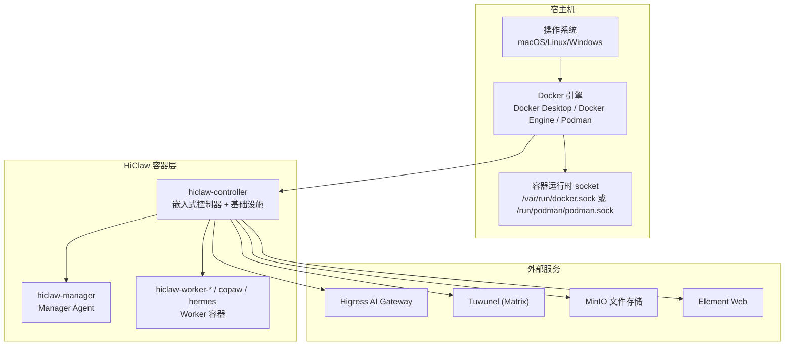
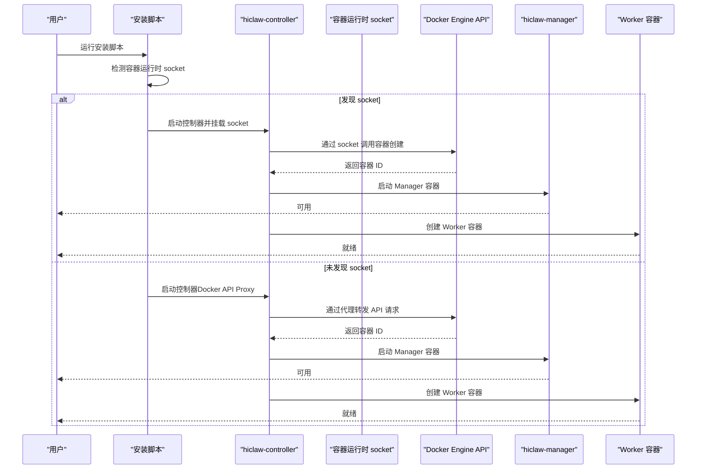
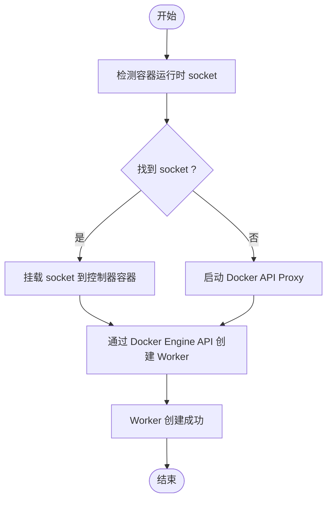
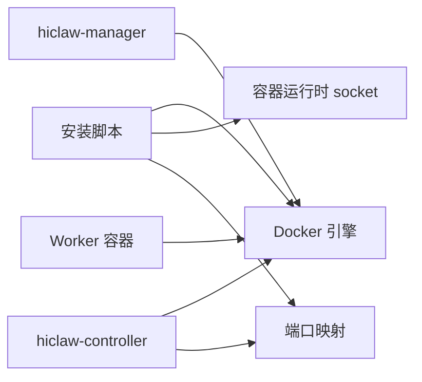

# 系统前置要求

<cite>
**本文引用的文件**
- [README.md](file://README.md)
- [install/README.md](file://install/README.md)
- [docs/quickstart.md](file://docs/quickstart.md)
- [docs/windows-deploy.md](file://docs/windows-deploy.md)
- [docs/faq.md](file://docs/faq.md)
- [docs/zh-cn/development.md](file://docs/zh-cn/development.md)
- [hiclaw-controller/internal/backend/docker.go](file://hiclaw-controller/internal/backend/docker.go)
- [hiclaw-controller/internal/proxy/proxy.go](file://hiclaw-controller/internal/proxy/proxy.go)
- [install/hiclaw-install.sh](file://install/hiclaw-install.sh)
- [install/hiclaw-install.ps1](file://install/hiclaw-install.ps1)
</cite>

## 目录
1. [简介](#简介)
2. [项目结构](#项目结构)
3. [核心组件](#核心组件)
4. [架构总览](#架构总览)
5. [详细组件分析](#详细组件分析)
6. [依赖关系分析](#依赖关系分析)
7. [性能考量](#性能考量)
8. [故障排查指南](#故障排查指南)
9. [结论](#结论)
10. [附录](#附录)

## 简介
本文件面向 HiClaw 本地安装的系统前置要求，覆盖 macOS/Linux 与 Windows 平台的最低硬件要求、Docker 环境要求（版本兼容性、Docker Desktop vs Docker Engine）、网络要求（端口开放、防火墙配置）、可选组件要求（Git、GitHub CLI），并重点解释容器运行时 socket 的重要性及其对 Worker 自动创建的影响。同时提供系统兼容性检查清单与常见前置问题的解决方案，帮助用户顺利完成安装与运行。

## 项目结构
HiClaw 采用多容器架构，包含控制器、网关、矩阵服务、对象存储与管理器等组件。安装脚本负责拉取镜像、创建网络与数据卷、启动容器，并根据平台差异选择合适的 Docker 引擎与端口绑定策略。

图表来源
- [install/hiclaw-install.sh:2530-2553](file://install/hiclaw-install.sh#L2530-L2553)
- [install/hiclaw-install.ps1:2507-2530](file://install/hiclaw-install.ps1#L2507-L2530)
- [hiclaw-controller/internal/backend/docker.go:445-479](file://hiclaw-controller/internal/backend/docker.go#L445-L479)

章节来源
- [README.md:110-173](file://README.md#L110-L173)
- [docs/quickstart.md:42-61](file://docs/quickstart.md#L42-L61)

## 核心组件
- 控制器（hiclaw-controller）：承载嵌入式基础设施（Higress、Tuwunel、MinIO、Element Web）与控制平面，对外提供 REST API。
- 管理器（hiclaw-manager）：轻量级 Manager Agent 容器，负责与用户交互、编排 Worker。
- Worker：按需创建的 Agent 容器，支持多种运行时（OpenClaw、CoPaw/QwenPaw、Hermes）。
- 网关（Higress）：统一流量入口与凭证管理。
- 矩阵（Tuwunel）：去中心化 IM 服务。
- 对象存储（MinIO）：共享文件系统，用于跨 Agent 数据交换。

章节来源
- [docs/quickstart.md:42-61](file://docs/quickstart.md#L42-L61)
- [README.md:305-333](file://README.md#L305-L333)

## 架构总览
多容器架构下，Manager 与 Worker 的生命周期由控制器统一管理。安装脚本在宿主机上检测并挂载容器运行时 socket，使控制器能够直接调用 Docker Engine API 创建 Worker 容器；若未检测到 socket，则通过 Docker API 代理（Docker API Proxy）转发请求至宿主机 Docker 引擎。

图表来源
- [install/hiclaw-install.sh:2530-2553](file://install/hiclaw-install.sh#L2530-L2553)
- [install/hiclaw-install.ps1:2507-2530](file://install/hiclaw-install.ps1#L2507-L2530)
- [hiclaw-controller/internal/proxy/proxy.go:32-52](file://hiclaw-controller/internal/proxy/proxy.go#L32-L52)

章节来源
- [docs/quickstart.md:114-134](file://docs/quickstart.md#L114-L134)

## 详细组件分析

### 硬件与资源要求
- macOS/Linux（推荐）
  - CPU：至少 2 核，建议 4 核以上
  - 内存：至少 4 GB，建议 8 GB 以上
  - 磁盘：至少 10 GB 可用空间，建议 20 GB 以上
  - 多 Worker 场景：每个 Worker 的内存占用不同，OpenClaw 约 500 MB，CoPaw 约 150 MB，Hermes 视负载而定
- Windows
  - CPU：至少 2 核，建议 4 核以上
  - 内存：至少 4 GB，建议 8 GB 以上
  - 磁盘：至少 10 GB 可用空间，建议 20 GB 以上
  - 注意：Windows 虚拟机不支持（无法运行 Linux 容器）

章节来源
- [docs/windows-deploy.md:42-50](file://docs/windows-deploy.md#L42-L50)
- [README.md:56-58](file://README.md#L56-L58)

### Docker 环境要求与版本兼容性
- macOS/Linux
  - 推荐使用 Docker Desktop（macOS）或 Docker Engine（Linux）
  - 支持 amd64 与 arm64 架构
- Windows
  - 必须使用 Docker Desktop，且启用 WSL 2 后端
  - PowerShell 7+（推荐）
  - Docker Desktop 版本建议：较新的版本（具体版本号以安装脚本提示为准）
- 容器运行时 socket
  - 安装脚本会尝试检测并挂载宿主机的容器运行时 socket（Docker 或 Podman）
  - 若未检测到 socket，将使用 Docker API Proxy 作为替代方案
  - 挂载 socket 会赋予容器对宿主机容器运行时的完全控制权，属于本地开发场景下的可接受风险

章节来源
- [install/README.md:5-9](file://install/README.md#L5-L9)
- [docs/windows-deploy.md:36-60](file://docs/windows-deploy.md#L36-L60)
- [docs/zh-cn/development.md:309-342](file://docs/zh-cn/development.md#L309-L342)
- [install/hiclaw-install.sh:2530-2553](file://install/hiclaw-install.sh#L2530-L2553)
- [install/hiclaw-install.ps1:2507-2530](file://install/hiclaw-install.ps1#L2507-L2530)

### 网络与端口要求
- 默认端口（本地仅本机访问）
  - 网关：18080
  - Higress 控制台：18001
  - Element Web：18088
  - Manager 控制台（本地访问）：18888
- 外部访问模式（允许局域网/公网访问）
  - 端口绑定到 0.0.0.0，便于移动设备或同事访问
  - 建议在 Higress 控制台配置 TLS 证书并启用 HTTPS，避免明文传输
- 端口冲突排查
  - 若端口被占用，可在“手动设置”模式下修改端口
- 域名解析
  - 默认域名自动解析到 127.0.0.1，无需手动配置 hosts

章节来源
- [docs/windows-deploy.md:238-273](file://docs/windows-deploy.md#L238-L273)
- [docs/quickstart.md:62-77](file://docs/quickstart.md#L62-L77)
- [docs/faq.md:270-299](file://docs/faq.md#L270-L299)

### 可选组件要求
- Git 与 GitHub CLI
  - 仓库克隆、分支与提交等 Git 操作由 Worker 的 git-delegation 技能完成
  - GitHub PR/Issue 管理由 GitHub MCP 工具链完成
  - 安装脚本与文档未强制要求宿主机安装 Git/GitHub CLI，但若需要在宿主机侧进行 Git 操作，建议安装相应工具
- 其他可选工具
  - GitHub CLI 可用于自动化提交与 PR 流程（非必需）

章节来源
- [docs/quickstart.md:256-298](file://docs/quickstart.md#L256-L298)
- [manager/agent/worker-skills/github-operations/SKILL.md:1-72](file://manager/agent/worker-skills/github-operations/SKILL.md#L1-L72)

### 容器运行时 socket 的重要性与 Worker 自动创建
- 自动创建条件
  - 安装脚本检测到宿主机容器运行时 socket（Docker 或 Podman）时，会将其挂载到控制器容器中
  - 控制器通过该 socket 直接调用 Docker Engine API 创建 Worker 容器，无需额外的 docker run 命令
- 无 socket 时的替代方案
  - 若未检测到 socket，安装脚本会启动 Docker API Proxy 容器，通过代理转发 API 请求
  - 此时 Manager 会提供 docker run 命令，用户可在目标主机上手动运行以创建 Worker
- 安全性说明
  - 挂载 socket 相当于授予容器对宿主机容器运行时的完全控制权，属于本地开发场景下的可接受风险
  - 生产环境建议采用更严格的访问控制方式

图表来源
- [install/hiclaw-install.sh:2530-2553](file://install/hiclaw-install.sh#L2530-L2553)
- [install/hiclaw-install.ps1:2507-2530](file://install/hiclaw-install.ps1#L2507-L2530)
- [hiclaw-controller/internal/proxy/proxy.go:32-52](file://hiclaw-controller/internal/proxy/proxy.go#L32-L52)

章节来源
- [docs/quickstart.md:114-134](file://docs/quickstart.md#L114-L134)
- [docs/zh-cn/development.md:309-342](file://docs/zh-cn/development.md#L309-L342)

## 依赖关系分析
- 安装脚本对宿主机环境的依赖
  - Docker 引擎（Docker Desktop / Docker Engine / Podman）
  - 容器运行时 socket（可选，优先使用）
  - PowerShell 7+（Windows）
- 控制器对 Docker 引擎的依赖
  - 直接调用 Docker Engine API（通过 socket 或代理）
  - 管理 Worker 容器生命周期
- 网络与域名解析
  - 默认绑定到 127.0.0.1，便于本地访问
  - 外部访问时需确保端口未被占用且防火墙放行

图表来源
- [install/hiclaw-install.sh:2530-2553](file://install/hiclaw-install.sh#L2530-L2553)
- [install/hiclaw-install.ps1:2507-2530](file://install/hiclaw-install.ps1#L2507-L2530)
- [docs/windows-deploy.md:238-273](file://docs/windows-deploy.md#L238-L273)

章节来源
- [install/README.md:5-9](file://install/README.md#L5-L9)
- [docs/faq.md:270-299](file://docs/faq.md#L270-L299)

## 性能考量
- 多 Worker 场景建议更高的 CPU 与内存配置，以保证各 Worker 的稳定运行
- 网络访问模式选择“仅本机”可减少外部暴露带来的性能与安全风险
- 使用 Docker API Proxy 时，API 请求经由代理转发，可能带来轻微延迟

## 故障排查指南
- 安装脚本在 Windows 上立即退出
  - 确认 Docker Desktop 已安装并完全启动（底部状态图标变为绿色）
  - 首次手动执行 docker info 确认 Docker 可用
- Docker Desktop 未运行
  - 启动 Docker Desktop 并等待底部图标变为绿色后再重试
- 镜像拉取超时
  - 安装脚本会自动选择就近镜像仓库；特殊网络环境下可在 Docker Desktop 设置中配置镜像加速
- API 连通性测试失败
  - 确认 API Key 无多余空格
  - 若使用 CodingPlan，确认服务已激活
  - 在浏览器访问对应服务地址验证网络可达性
- Manager Agent 启动超时或失败
  - 检查 WSL 2 内存配置（必要时在 .wslconfig 中提高内存）
  - 查看控制器与 Manager 容器日志定位问题
- 端口被占用
  - 使用 netstat 检查端口占用情况，选择“手动设置”模式修改端口
- 无法访问 Matrix 服务器
  - 检查浏览器或系统代理设置，确保本地域名解析生效

章节来源
- [docs/windows-deploy.md:433-513](file://docs/windows-deploy.md#L433-L513)
- [docs/faq.md:202-299](file://docs/faq.md#L202-L299)

## 结论
HiClaw 的本地安装对硬件与 Docker 环境有明确要求。通过安装脚本自动检测容器运行时 socket 并选择合适的部署模式，可实现 Worker 的自动创建与管理。建议在满足最低硬件要求的前提下，优先使用 Docker Desktop（Windows/macOS）或 Docker Engine（Linux），并根据实际需求选择本地或外部访问模式。遇到常见问题时，可参考本文提供的检查清单与故障排查步骤快速定位并解决。

## 附录

### 系统兼容性检查清单
- 操作系统
  - macOS/Linux：满足最低硬件要求
  - Windows：Windows 10/11，WSL 2 启用，Docker Desktop 安装并运行
- Docker 环境
  - Docker Desktop（macOS）或 Docker Engine（Linux）或 Docker Desktop（Windows）
  - PowerShell 7+（Windows）
  - 容器运行时 socket 可用（优先）
- 网络
  - 默认端口未被占用
  - 外部访问模式下确保防火墙放行相关端口
- 可选组件
  - Git/GitHub CLI（如需在宿主机侧进行 Git 操作）
- 安全
  - 了解挂载 socket 的安全影响，仅在本地开发场景使用

### 常见前置问题与解决方案
- Docker Desktop 未运行：启动 Docker Desktop 并等待状态图标变为绿色
- 端口冲突：修改端口或释放占用端口
- API Key 无效：确认粘贴无多余空格，必要时重新生成
- Manager 启动超时：调整 WSL 2 内存配置或查看日志
- 无法访问 Matrix：关闭代理或添加本地域名到代理绕过列表