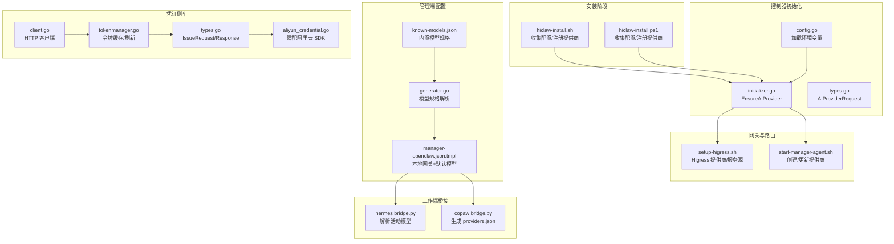
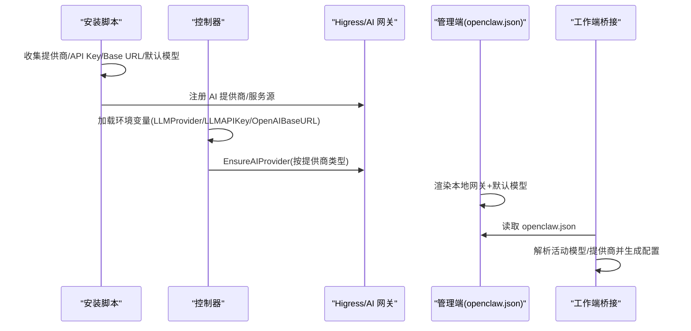
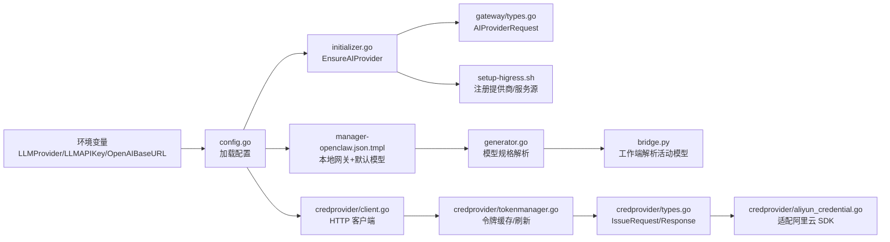

# LLM 提供商配置

<cite>
**本文档引用的文件**
- [hiclaw-install.sh](file://install/hiclaw-install.sh)
- [hiclaw-install.ps1](file://install/hiclaw-install.ps1)
- [initializer.go](file://hiclaw-controller/internal/initializer/initializer.go)
- [config.go](file://hiclaw-controller/internal/config/config.go)
- [types.go](file://hiclaw-controller/internal/gateway/types.go)
- [client.go](file://hiclaw-controller/internal/credprovider/client.go)
- [tokenmanager.go](file://hiclaw-controller/internal/credprovider/tokenmanager.go)
- [types.go](file://hiclaw-controller/internal/credprovider/types.go)
- [aliyun_credential.go](file://hiclaw-controller/internal/credprovider/aliyun_credential.go)
- [setup-higress.sh](file://manager/scripts/init/setup-higress.sh)
- [start-manager-agent.sh](file://manager/scripts/init/start-manager-agent.sh)
- [manager-openclaw.json.tmpl](file://manager/configs/manager-openclaw.json.tmpl)
- [known-models.json](file://manager/configs/known-models.json)
- [generator.go](file://hiclaw-controller/internal/agentconfig/generator.go)
- [runtime-env.yaml](file://helm/hiclaw/templates/secrets/runtime-env.yaml)
- [bridge.py](file://hermes/src/hermes_worker/bridge.py)
- [bridge.py](file://copaw/src/copaw_worker/bridge.py)
</cite>

## 目录
1. [简介](#简介)
2. [项目结构](#项目结构)
3. [核心组件](#核心组件)
4. [架构总览](#架构总览)
5. [详细组件分析](#详细组件分析)
6. [依赖分析](#依赖分析)
7. [性能考虑](#性能考虑)
8. [故障排查指南](#故障排查指南)
9. [结论](#结论)
10. [附录](#附录)

## 简介
本文件面向 HiClaw 的 LLM 提供商配置，覆盖以下提供商与模式：
- 阿里云通义 Token 套餐（兼容模式）
- 阿里云百炼 DashScope
- 阿里云 Coding 套餐
- OpenAI 兼容 API 模式

内容包括：提供商特点与适用场景、API Key 获取方式、默认模型选择、Base URL 配置、模型参数设置、提供商切换指南、连通性测试方法、常见问题排查与最佳实践。

## 项目结构
与 LLM 提供商配置直接相关的模块分布如下：
- 安装与引导：安装脚本负责交互式或非交互式收集提供商、API Key、Base URL、默认模型等，并在首次启动时注册网关提供商。
- 控制器初始化：根据环境变量在控制器启动时注册 AI 提供商到 Higress/AI 网关。
- 管理端模板：管理端 openclaw.json 模板定义了本地网关模式、默认提供商与模型列表。
- 工作端桥接：工作端桥接逻辑从 openclaw.json 解析活动模型与提供商，生成工作端配置。
- 凭证侧车：控制器通过凭证侧车获取短期 STS 凭证，用于访问云服务与下游凭据发放。

**图表来源**
- [hiclaw-install.sh:1729-1930](file://install/hiclaw-install.sh#L1729-L1930)
- [hiclaw-install.ps1:1658-1676](file://install/hiclaw-install.ps1#L1658-L1676)
- [initializer.go:259-375](file://hiclaw-controller/internal/initializer/initializer.go#L259-L375)
- [config.go:298-300](file://hiclaw-controller/internal/config/config.go#L298-L300)
- [types.go:39-60](file://hiclaw-controller/internal/gateway/types.go#L39-L60)
- [setup-higress.sh:187-239](file://manager/scripts/init/setup-higress.sh#L187-L239)
- [start-manager-agent.sh:418-436](file://manager/scripts/init/start-manager-agent.sh#L418-L436)
- [manager-openclaw.json.tmpl:46-72](file://manager/configs/manager-openclaw.json.tmpl#L46-L72)
- [known-models.json:1-19](file://manager/configs/known-models.json#L1-L19)
- [generator.go:398-492](file://hiclaw-controller/internal/agentconfig/generator.go#L398-L492)
- [bridge.py:73-106](file://hermes/src/hermes_worker/bridge.py#L73-L106)
- [bridge.py:587-618](file://copaw/src/copaw_worker/bridge.py#L587-L618)
- [client.go:15-85](file://hiclaw-controller/internal/credprovider/client.go#L15-L85)
- [tokenmanager.go:10-78](file://hiclaw-controller/internal/credprovider/tokenmanager.go#L10-L78)
- [types.go:20-75](file://hiclaw-controller/internal/credprovider/types.go#L20-L75)
- [aliyun_credential.go:9-90](file://hiclaw-controller/internal/credprovider/aliyun_credential.go#L9-L90)

**章节来源**
- [hiclaw-install.sh:1729-1930](file://install/hiclaw-install.sh#L1729-L1930)
- [hiclaw-install.ps1:1658-1676](file://install/hiclaw-install.ps1#L1658-L1676)
- [initializer.go:259-375](file://hiclaw-controller/internal/initializer/initializer.go#L259-L375)
- [config.go:298-300](file://hiclaw-controller/internal/config/config.go#L298-L300)
- [setup-higress.sh:187-239](file://manager/scripts/init/setup-higress.sh#L187-L239)
- [start-manager-agent.sh:418-436](file://manager/scripts/init/start-manager-agent.sh#L418-L436)
- [manager-openclaw.json.tmpl:46-72](file://manager/configs/manager-openclaw.json.tmpl#L46-L72)
- [known-models.json:1-19](file://manager/configs/known-models.json#L1-L19)
- [generator.go:398-492](file://hiclaw-controller/internal/agentconfig/generator.go#L398-L492)
- [bridge.py:73-106](file://hermes/src/hermes_worker/bridge.py#L73-L106)
- [bridge.py:587-618](file://copaw/src/copaw_worker/bridge.py#L587-L618)
- [client.go:15-85](file://hiclaw-controller/internal/credprovider/client.go#L15-L85)
- [tokenmanager.go:10-78](file://hiclaw-controller/internal/credprovider/tokenmanager.go#L10-L78)
- [types.go:20-75](file://hiclaw-controller/internal/credprovider/types.go#L20-L75)
- [aliyun_credential.go:9-90](file://hiclaw-controller/internal/credprovider/aliyun_credential.go#L9-L90)

## 核心组件
- 安装脚本（Linux/Windows）：负责交互式收集提供商类型、API Key、Base URL、默认模型、嵌入模型等；支持非交互模式通过环境变量注入。
- 控制器配置与初始化：从环境变量读取提供商配置，调用网关接口注册 AI 提供商；支持 qwen、openai-compat 及自定义兼容模式。
- 网关注册：通过 Higress Console 或管理端脚本创建 DNS 服务源与 AI 提供商，或在控制器中直接注册。
- 管理端 openclaw.json 模板：定义本地网关模式、默认提供商与模型列表，以及默认主模型别名映射。
- 工作端桥接：从 openclaw.json 解析活动模型与提供商，生成工作端配置（如 hermes 的 config.yaml、copaw 的 providers.json）。
- 凭证侧车：控制器通过凭证侧车获取短期 STS 凭证，用于云服务调用与下游凭据发放。

**章节来源**
- [hiclaw-install.sh:1729-1930](file://install/hiclaw-install.sh#L1729-L1930)
- [hiclaw-install.ps1:1658-1676](file://install/hiclaw-install.ps1#L1658-L1676)
- [initializer.go:259-375](file://hiclaw-controller/internal/initializer/initializer.go#L259-L375)
- [config.go:298-300](file://hiclaw-controller/internal/config/config.go#L298-L300)
- [setup-higress.sh:187-239](file://manager/scripts/init/setup-higress.sh#L187-L239)
- [start-manager-agent.sh:418-436](file://manager/scripts/init/start-manager-agent.sh#L418-L436)
- [manager-openclaw.json.tmpl:46-72](file://manager/configs/manager-openclaw.json.tmpl#L46-L72)
- [bridge.py:73-106](file://hermes/src/hermes_worker/bridge.py#L73-L106)
- [bridge.py:587-618](file://copaw/src/copaw_worker/bridge.py#L587-L618)
- [client.go:15-85](file://hiclaw-controller/internal/credprovider/client.go#L15-L85)
- [tokenmanager.go:10-78](file://hiclaw-controller/internal/credprovider/tokenmanager.go#L10-L78)

## 架构总览
下图展示从安装到运行期的关键流程：安装脚本收集配置并注册提供商，控制器加载配置并在网关侧创建提供商与服务源，管理端与工作端基于 openclaw.json 与桥接逻辑进行模型解析与配置生成。

**图表来源**
- [hiclaw-install.sh:1729-1930](file://install/hiclaw-install.sh#L1729-L1930)
- [hiclaw-install.ps1:1658-1676](file://install/hiclaw-install.ps1#L1658-L1676)
- [initializer.go:259-375](file://hiclaw-controller/internal/initializer/initializer.go#L259-L375)
- [setup-higress.sh:187-239](file://manager/scripts/init/setup-higress.sh#L187-L239)
- [manager-openclaw.json.tmpl:46-72](file://manager/configs/manager-openclaw.json.tmpl#L46-L72)
- [bridge.py:73-106](file://hermes/src/hermes_worker/bridge.py#L73-L106)
- [bridge.py:587-618](file://copaw/src/copaw_worker/bridge.py#L587-L618)

## 详细组件分析

### 阿里云通义 Token 套餐（兼容模式）
- 特点与适用场景
  - 通过“兼容模式”对接通义千问 Token 套餐，适合需要按量付费或套餐计费的用户。
  - 安装脚本在非交互模式下可预设提供商为 openai-compat，并提供默认 Base URL 指向 Token 套餐兼容端点。
- API Key 获取
  - 在安装脚本中提示从阿里云百炼（DashScope）或通义 Token 套餐页面获取 DASHSCOPE_API_KEY。
- 默认模型与 Base URL
  - 默认模型：qwen3.6-plus（非交互模式 zh 场景）。
  - 默认 Base URL：Token 套餐兼容端点（非交互模式 zh 场景）。
- 模型参数设置
  - 若使用已知模型，将采用内置模型规格；未知模型可通过环境变量覆盖上下文窗口、最大 token 数、推理能力与视觉输入等。
- 配置入口
  - 安装脚本交互流程与非交互默认值设定。
  - 控制器初始化时以 openai 类型注册提供商，并携带兼容模式的原始配置。
  - 管理端模板中的 hiclaw-gateway 提供商指向本地网关，模型列表由内置模型规格生成。
- 切换与测试
  - 切换至该提供商只需设置提供商为 openai-compat 并提供 Base URL 与 API Key。
  - 使用安装脚本提供的连通性测试函数验证 chat/completions 与 embeddings 接口。

**章节来源**
- [hiclaw-install.sh:1729-1930](file://install/hiclaw-install.sh#L1729-L1930)
- [hiclaw-install.ps1:1658-1676](file://install/hiclaw-install.ps1#L1658-L1676)
- [hiclaw-install.ps1:365-376](file://install/hiclaw-install.ps1#L365-L376)
- [initializer.go:259-375](file://hiclaw-controller/internal/initializer/initializer.go#L259-L375)
- [config.go:298-300](file://hiclaw-controller/internal/config/config.go#L298-L300)
- [manager-openclaw.json.tmpl:46-72](file://manager/configs/manager-openclaw.json.tmpl#L46-L72)
- [known-models.json:1-19](file://manager/configs/known-models.json#L1-L19)
- [generator.go:398-492](file://hiclaw-controller/internal/agentconfig/generator.go#L398-L492)
- [hiclaw-install.ps1:1203-1289](file://install/hiclaw-install.ps1#L1203-L1289)

### 阿里云百炼 DashScope
- 特点与适用场景
  - 直接对接 DashScope，适合已有 DashScope 账号与模型授权的用户。
  - 控制器初始化时以 qwen 类型注册提供商，并启用兼容模式与禁用搜索等配置。
- API Key 获取
  - 安装脚本提供 DashScope API Key 获取指引与官方文档链接。
- 默认模型与 Base URL
  - 默认模型：qwen3.6-plus。
  - Base URL：DashScope 兼容端点（qwen 类型）。
- 模型参数设置
  - 使用内置模型规格；未知模型可通过环境变量覆盖。
- 配置入口
  - 控制器初始化注册 qwen 类型提供商。
  - 管理端模板中的 hiclaw-gateway 提供商指向本地网关，模型列表由内置模型规格生成。
- 切换与测试
  - 切换至 qwen 类型提供商，设置 API Key 即可。
  - 使用安装脚本提供的连通性测试函数验证 chat/completions 与 embeddings 接口。

**章节来源**
- [hiclaw-install.ps1:365-376](file://install/hiclaw-install.ps1#L365-L376)
- [initializer.go:266-282](file://hiclaw-controller/internal/initializer/initializer.go#L266-L282)
- [start-manager-agent.sh:418-436](file://manager/scripts/init/start-manager-agent.sh#L418-L436)
- [manager-openclaw.json.tmpl:46-72](file://manager/configs/manager-openclaw.json.tmpl#L46-L72)
- [known-models.json:1-19](file://manager/configs/known-models.json#L1-L19)
- [generator.go:398-492](file://hiclaw-controller/internal/agentconfig/generator.go#L398-L492)
- [hiclaw-install.ps1:1203-1289](file://install/hiclaw-install.ps1#L1203-L1289)

### 阿里云 Coding 套餐
- 特点与适用场景
  - 通过“兼容模式”对接 Coding 套餐，适合企业内部私有化部署或特定套餐授权场景。
- API Key 获取
  - 安装脚本提供获取指引与官方文档链接。
- 默认模型与 Base URL
  - 默认模型：qwen3.6-plus。
  - Base URL：Coding 套餐兼容端点（openai-compat）。
- 模型参数设置
  - 使用内置模型规格；未知模型可通过环境变量覆盖。
- 配置入口
  - 安装脚本交互流程与非交互默认值设定。
  - 控制器初始化以 openai 类型注册提供商，并携带兼容模式的原始配置。
- 切换与测试
  - 切换至 openai-compat 并提供 Base URL 与 API Key。
  - 使用安装脚本提供的连通性测试函数验证 chat/completions 与 embeddings 接口。

**章节来源**
- [hiclaw-install.ps1:365-376](file://install/hiclaw-install.ps1#L365-L376)
- [hiclaw-install.sh:1729-1930](file://install/hiclaw-install.sh#L1729-L1930)
- [initializer.go:259-375](file://hiclaw-controller/internal/initializer/initializer.go#L259-L375)
- [config.go:298-300](file://hiclaw-controller/internal/config/config.go#L298-L300)
- [manager-openclaw.json.tmpl:46-72](file://manager/configs/manager-openclaw.json.tmpl#L46-L72)
- [known-models.json:1-19](file://manager/configs/known-models.json#L1-L19)
- [generator.go:398-492](file://hiclaw-controller/internal/agentconfig/generator.go#L398-L492)
- [hiclaw-install.ps1:1203-1289](file://install/hiclaw-install.ps1#L1203-L1289)

### OpenAI 兼容 API
- 特点与适用场景
  - 适用于任何遵循 OpenAI 协议的第三方 LLM 服务（如 Ollama、自建服务等）。
- API Key 获取
  - 由自建服务或第三方平台提供。
- 默认模型与 Base URL
  - 默认模型：gpt-5.4（openai-compat 场景）。
  - Base URL：由用户自定义（可为空，为空时使用官方 OpenAI 端点）。
- 模型参数设置
  - 使用内置模型规格；未知模型可通过环境变量覆盖。
- 配置入口
  - 安装脚本交互流程与非交互默认值设定。
  - 控制器初始化以 openai 类型注册提供商；若提供自定义 Base URL，则先注册 DNS 服务源再创建提供商。
- 切换与测试
  - 切换至 openai-compat 并提供 Base URL 与 API Key。
  - 使用安装脚本提供的连通性测试函数验证 chat/completions 与 embeddings 接口。

**章节来源**
- [hiclaw-install.sh:1729-1930](file://install/hiclaw-install.sh#L1729-L1930)
- [hiclaw-install.ps1:1658-1676](file://install/hiclaw-install.ps1#L1658-L1676)
- [initializer.go:284-375](file://hiclaw-controller/internal/initializer/initializer.go#L284-L375)
- [config.go:298-300](file://hiclaw-controller/internal/config/config.go#L298-L300)
- [setup-higress.sh:187-239](file://manager/scripts/init/setup-higress.sh#L187-L239)
- [manager-openclaw.json.tmpl:46-72](file://manager/configs/manager-openclaw.json.tmpl#L46-L72)
- [known-models.json:1-19](file://manager/configs/known-models.json#L1-L19)
- [generator.go:398-492](file://hiclaw-controller/internal/agentconfig/generator.go#L398-L492)
- [hiclaw-install.ps1:1203-1289](file://install/hiclaw-install.ps1#L1203-L1289)

### 模型参数与默认模型
- 内置模型规格
  - 管理端内置模型列表包含多厂商主流模型及其上下文窗口、最大 token 数、是否具备推理能力与视觉输入等属性。
- 默认模型选择
  - 安装脚本在不同语言与非交互模式下提供默认模型；管理端 openclaw.json 模板将默认主模型设置为 hiclaw-gateway/<默认模型>。
- 自定义模型参数
  - 对于未知模型，可通过环境变量覆盖上下文窗口、最大 token 数、推理能力与视觉输入等。

**章节来源**
- [known-models.json:1-19](file://manager/configs/known-models.json#L1-L19)
- [manager-openclaw.json.tmpl:78-97](file://manager/configs/manager-openclaw.json.tmpl#L78-L97)
- [generator.go:398-492](file://hiclaw-controller/internal/agentconfig/generator.go#L398-L492)
- [start-manager-agent.sh:648-675](file://manager/scripts/init/start-manager-agent.sh#L648-L675)
- [manager/agent/skills/worker-management/scripts/generate-worker-config.sh:37-74](file://manager/agent/skills/worker-management/scripts/generate-worker-config.sh#L37-L74)
- [manager/agent/skills/model-switch/scripts/update-manager-model.sh:86-121](file://manager/agent/skills/model-switch/scripts/update-manager-model.sh#L86-L121)

### 提供商切换指南
- 切换步骤
  - 设置提供商类型（qwen、openai-compat 或自定义名称）。
  - 提供 API Key。
  - 如为 openai-compat，需提供 Base URL；如为 qwen，Base URL 由系统默认。
  - 如需自定义兼容端点，提供 Base URL 与 API Key。
- 控制器注册
  - 控制器根据提供商类型调用 EnsureAIProvider 注册；若提供自定义 Base URL，先注册 DNS 服务源再创建提供商。
- 管理端与工作端
  - 管理端 openclaw.json 模板中的 hiclaw-gateway 提供商指向本地网关，模型列表由内置模型规格生成。
  - 工作端桥接从 openclaw.json 解析活动模型与提供商，生成对应配置。

**章节来源**
- [initializer.go:259-375](file://hiclaw-controller/internal/initializer/initializer.go#L259-L375)
- [config.go:298-300](file://hiclaw-controller/internal/config/config.go#L298-L300)
- [setup-higress.sh:187-239](file://manager/scripts/init/setup-higress.sh#L187-L239)
- [start-manager-agent.sh:418-436](file://manager/scripts/init/start-manager-agent.sh#L418-L436)
- [manager-openclaw.json.tmpl:46-72](file://manager/configs/manager-openclaw.json.tmpl#L46-L72)
- [bridge.py:73-106](file://hermes/src/hermes_worker/bridge.py#L73-L106)
- [bridge.py:587-618](file://copaw/src/copaw_worker/bridge.py#L587-L618)

### API 连通性测试方法
- 测试接口
  - chat/completions：用于对话类请求连通性测试。
  - embeddings：用于向量嵌入类请求连通性测试。
- 测试流程
  - 安装脚本提供测试函数，构造请求体并发送 POST 请求，检查响应状态码与错误信息。
  - 若失败，输出状态码与响应体，便于定位问题。

**章节来源**
- [hiclaw-install.ps1:1203-1289](file://install/hiclaw-install.ps1#L1203-L1289)
- [hiclaw-install.sh:1729-1930](file://install/hiclaw-install.sh#L1729-L1930)

## 依赖分析
- 环境变量与配置
  - 控制器从环境变量读取 LLMProvider、LLMAPIKey、OpenAIBaseURL 等，作为提供商注册与模型解析的基础。
- 网关注册与路由
  - 控制器通过 AIProviderRequest 描述提供商类型、令牌、协议与原始配置；Higress Console 提供提供商与服务源的 REST API。
- 模型规格与别名
  - 管理端模板与生成器共同决定可用模型列表与别名映射，工作端桥接据此解析活动模型。
- 凭证侧车
  - 控制器通过凭证侧车客户端与令牌管理器获取短期 STS 凭证，适配阿里云 SDK 接口。

**图表来源**
- [config.go:298-300](file://hiclaw-controller/internal/config/config.go#L298-L300)
- [initializer.go:259-375](file://hiclaw-controller/internal/initializer/initializer.go#L259-L375)
- [types.go:39-60](file://hiclaw-controller/internal/gateway/types.go#L39-L60)
- [setup-higress.sh:187-239](file://manager/scripts/init/setup-higress.sh#L187-L239)
- [manager-openclaw.json.tmpl:46-72](file://manager/configs/manager-openclaw.json.tmpl#L46-L72)
- [generator.go:398-492](file://hiclaw-controller/internal/agentconfig/generator.go#L398-L492)
- [bridge.py:73-106](file://hermes/src/hermes_worker/bridge.py#L73-L106)
- [client.go:15-85](file://hiclaw-controller/internal/credprovider/client.go#L15-L85)
- [tokenmanager.go:10-78](file://hiclaw-controller/internal/credprovider/tokenmanager.go#L10-L78)
- [types.go:20-75](file://hiclaw-controller/internal/credprovider/types.go#L20-L75)
- [aliyun_credential.go:9-90](file://hiclaw-controller/internal/credprovider/aliyun_credential.go#L9-L90)

**章节来源**
- [config.go:298-300](file://hiclaw-controller/internal/config/config.go#L298-L300)
- [initializer.go:259-375](file://hiclaw-controller/internal/initializer/initializer.go#L259-L375)
- [types.go:39-60](file://hiclaw-controller/internal/gateway/types.go#L39-L60)
- [setup-higress.sh:187-239](file://manager/scripts/init/setup-higress.sh#L187-L239)
- [manager-openclaw.json.tmpl:46-72](file://manager/configs/manager-openclaw.json.tmpl#L46-L72)
- [generator.go:398-492](file://hiclaw-controller/internal/agentconfig/generator.go#L398-L492)
- [bridge.py:73-106](file://hermes/src/hermes_worker/bridge.py#L73-L106)
- [client.go:15-85](file://hiclaw-controller/internal/credprovider/client.go#L15-L85)
- [tokenmanager.go:10-78](file://hiclaw-controller/internal/credprovider/tokenmanager.go#L10-L78)
- [types.go:20-75](file://hiclaw-controller/internal/credprovider/types.go#L20-L75)
- [aliyun_credential.go:9-90](file://hiclaw-controller/internal/credprovider/aliyun_credential.go#L9-L90)

## 性能考虑
- 模型选择与资源匹配
  - 上下文窗口与最大 token 数影响请求体积与响应时间；应结合任务复杂度选择合适模型。
- 并发与速率限制
  - 管理端与工作端均支持并发控制与重试策略，避免对网关造成瞬时压力。
- 本地网关与路由
  - 本地网关模式减少跨域与代理开销，提升响应速度；确保服务源与提供商正确注册以避免路由失败。

[本节为通用指导，无需具体文件分析]

## 故障排查指南
- 常见问题
  - Base URL 错误：确认 Base URL 是否为兼容端点，协议是否正确（http/https），端口是否开放。
  - API Key 无效：检查 API Key 权限范围与有效期，确保未被回收或过期。
  - 模型不可用：确认模型是否在内置列表中，未知模型需通过环境变量覆盖参数。
  - 网关注册失败：检查 Higress Console 可达性与管理员凭据；确认服务源与提供商创建顺序。
- 排查步骤
  - 使用安装脚本提供的连通性测试函数验证 chat/completions 与 embeddings 接口。
  - 查看控制器日志与网关注册状态，确认提供商与服务源是否存在。
  - 核对管理端 openclaw.json 与工作端桥接解析结果，确认活动模型与提供商一致。

**章节来源**
- [hiclaw-install.ps1:1203-1289](file://install/hiclaw-install.ps1#L1203-L1289)
- [initializer.go:259-375](file://hiclaw-controller/internal/initializer/initializer.go#L259-L375)
- [setup-higress.sh:187-239](file://manager/scripts/init/setup-higress.sh#L187-L239)
- [manager-openclaw.json.tmpl:46-72](file://manager/configs/manager-openclaw.json.tmpl#L46-L72)
- [bridge.py:73-106](file://hermes/src/hermes_worker/bridge.py#L73-L106)

## 结论
HiClaw 提供了灵活的 LLM 提供商配置能力，支持阿里云通义 Token 套餐（兼容模式）、阿里云百炼 DashScope、阿里云 Coding 套餐与 OpenAI 兼容 API 多种模式。通过安装脚本与控制器初始化，用户可在交互式或非交互式场景下快速完成提供商注册与模型配置；管理端与工作端桥接确保配置一致性与可维护性。建议在生产环境中优先使用稳定 Base URL 与权限明确的 API Key，并结合内置模型规格与自定义参数优化性能与成本。

[本节为总结性内容，无需具体文件分析]

## 附录
- 环境变量清单（与 LLM 提供商相关）
  - HICLAW_LLM_PROVIDER：提供商类型（qwen、openai-compat 或自定义名称）
  - HICLAW_LLM_API_KEY：提供商 API Key
  - HICLAW_OPENAI_BASE_URL：OpenAI 兼容 Base URL（可选）
  - HICLAW_DEFAULT_MODEL：默认模型（可选）
  - HICLAW_EMBEDDING_MODEL：嵌入模型（可选）
  - HICLAW_MODEL_CONTEXT_WINDOW/HICLAW_MODEL_MAX_TOKENS/HICLAW_MODEL_REASONING/HICLAW_MODEL_VISION：自定义模型参数（可选）

**章节来源**
- [runtime-env.yaml:30-35](file://helm/hiclaw/templates/secrets/runtime-env.yaml#L30-L35)
- [config.go:292-297](file://hiclaw-controller/internal/config/config.go#L292-L297)
- [start-manager-agent.sh:648-675](file://manager/scripts/init/start-manager-agent.sh#L648-L675)
- [manager/agent/skills/worker-management/scripts/generate-worker-config.sh:56-74](file://manager/agent/skills/worker-management/scripts/generate-worker-config.sh#L56-L74)
- [manager/agent/skills/model-switch/scripts/update-manager-model.sh:108-121](file://manager/agent/skills/model-switch/scripts/update-manager-model.sh#L108-L121)