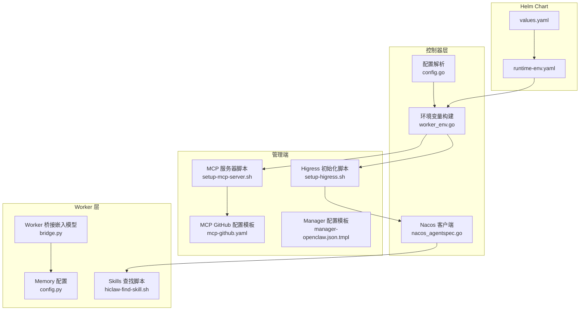
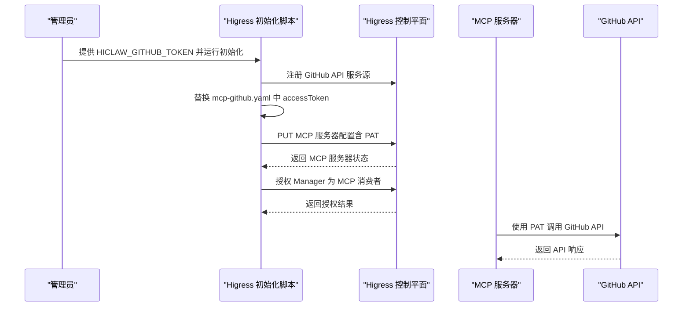
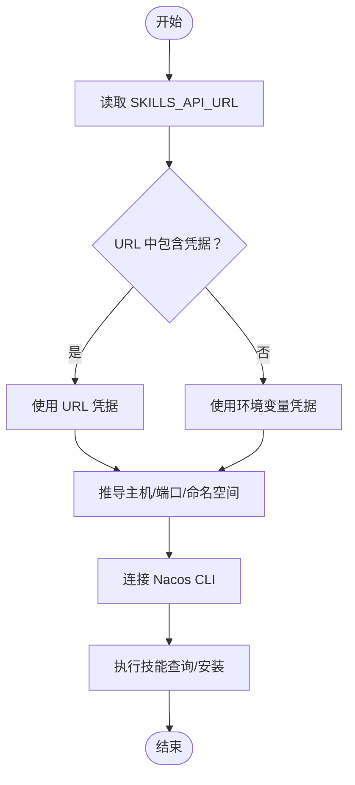
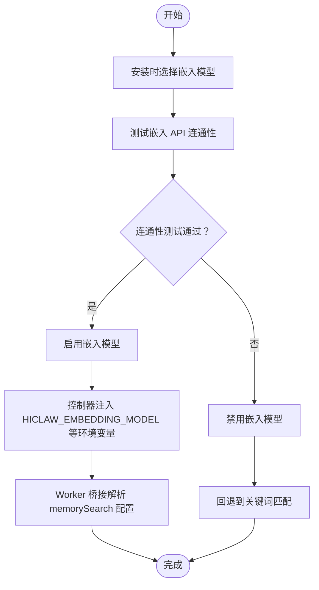
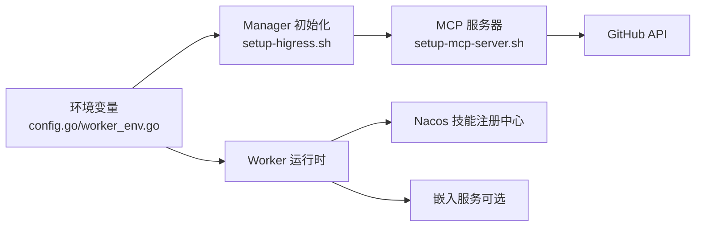

# 可选集成配置

<cite>
**本文引用的文件**
- [hiclaw-install.sh](file://install/hiclaw-install.sh)
- [hiclaw-install.ps1](file://install/hiclaw-install.ps1)
- [setup-higress.sh](file://manager/scripts/init/setup-higress.sh)
- [setup-mcp-server.sh](file://manager/agent/skills/mcp-server-management/scripts/setup-mcp-server.sh)
- [mcp-github.yaml](file://manager/agent/skills/mcp-server-management/references/mcp-github.yaml)
- [nacos_agentspec.go](file://hiclaw-controller/internal/executor/nacos_agentspec.go)
- [package_test.go](file://hiclaw-controller/internal/executor/package_test.go)
- [config.go](file://hiclaw-controller/internal/config/config.go)
- [worker_env.go](file://hiclaw-controller/internal/service/worker_env.go)
- [manager-openclaw.json.tmpl](file://manager/configs/manager-openclaw.json.tmpl)
- [hiclaw-env.sh](file://shared/lib/hiclaw-env.sh)
- [bridge.py](file://copaw/src/copaw_worker/bridge.py)
- [config.py](file://copaw/src/matrix/config.py)
- [values.yaml](file://helm/hiclaw/values.yaml)
- [runtime-env.yaml](file://helm/hiclaw/templates/secrets/runtime-env.yaml)
- [hiclaw-find-skill.sh](file://manager/agent/worker-agent/skills/find-skills/scripts/hiclaw-find-skill.sh)
- [test-hiclaw-find-skill.sh](file://manager/tests/test-hiclaw-find-skill.sh)
</cite>

## 目录
1. [简介](#简介)
2. [项目结构与总体架构](#项目结构与总体架构)
3. [核心可选集成概览](#核心可选集成概览)
4. [GitHub 集成（个人访问令牌）](#github-集成个人访问令牌)
5. [Skills 注册中心（Nacos 服务）](#skills-注册中心nacos-服务)
6. [嵌入式模型（Memory Search）](#嵌入式模型memory-search)
7. [依赖关系与数据流](#依赖关系与数据流)
8. [性能与资源考量](#性能与资源考量)
9. [故障排查指南](#故障排查指南)
10. [结论](#结论)

## 简介
本文面向 HiClaw 的可选集成配置，重点覆盖以下三个方面：
- GitHub 集成（个人访问令牌配置），用于通过 MCP 服务器调用 GitHub API，实现仓库管理、文件操作等能力。
- Skills 注册中心（Nacos 服务配置），用于 Worker 市场搜索与技能包导入，支持从 Nacos 读取技能清单与元数据。
- 嵌入式模型（Memory Search），用于增强记忆检索质量，提供语义匹配能力，并在无嵌入模型时回退到关键词匹配。

同时，文档说明各集成的作用、配置步骤、安全注意事项、常见问题排查以及最佳实践，帮助用户在不同部署场景下正确启用与维护这些可选功能。

## 项目结构与总体架构
HiClaw 的可选集成主要分布在以下模块：
- 控制器层：负责解析环境变量、生成运行时环境、连接外部服务（如 Nacos、Higress 网关）。
- 管理端（Manager）：负责初始化基础设施（如 Higress 路由、MCP 服务器注册），并下发配置给 Worker。
- Worker 层：根据配置加载嵌入模型、执行技能、与 Skills 注册中心交互。
- Helm Chart：提供统一的部署参数与密钥注入，便于在 Kubernetes 环境中集中管理。

图表来源
- [config.go:280-334](file://hiclaw-controller/internal/config/config.go#L280-L334)
- [worker_env.go:34-135](file://hiclaw-controller/internal/service/worker_env.go#L34-L135)
- [setup-higress.sh:287-318](file://manager/scripts/init/setup-higress.sh#L287-L318)
- [setup-mcp-server.sh:26-84](file://manager/agent/skills/mcp-server-management/scripts/setup-mcp-server.sh#L26-L84)
- [mcp-github.yaml:1-200](file://manager/agent/skills/mcp-server-management/references/mcp-github.yaml#L1-L200)
- [nacos_agentspec.go:93-126](file://hiclaw-controller/internal/executor/nacos_agentspec.go#L93-L126)
- [bridge.py:268-308](file://copaw/src/copaw_worker/bridge.py#L268-L308)
- [config.py:414-627](file://copaw/src/matrix/config.py#L414-L627)
- [hiclaw-find-skill.sh:128-211](file://manager/agent/worker-agent/skills/find-skills/scripts/hiclaw-find-skill.sh#L128-L211)
- [values.yaml:1-263](file://helm/hiclaw/values.yaml#L1-L263)
- [runtime-env.yaml:26-35](file://helm/hiclaw/templates/secrets/runtime-env.yaml#L26-L35)

章节来源
- [config.go:280-334](file://hiclaw-controller/internal/config/config.go#L280-L334)
- [worker_env.go:34-135](file://hiclaw-controller/internal/service/worker_env.go#L34-L135)
- [setup-higress.sh:287-318](file://manager/scripts/init/setup-higress.sh#L287-L318)
- [setup-mcp-server.sh:26-84](file://manager/agent/skills/mcp-server-management/scripts/setup-mcp-server.sh#L26-L84)
- [mcp-github.yaml:1-200](file://manager/agent/skills/mcp-server-management/references/mcp-github.yaml#L1-L200)
- [nacos_agentspec.go:93-126](file://hiclaw-controller/internal/executor/nacos_agentspec.go#L93-L126)
- [bridge.py:268-308](file://copaw/src/copaw_worker/bridge.py#L268-L308)
- [config.py:414-627](file://copaw/src/matrix/config.py#L414-L627)
- [hiclaw-find-skill.sh:128-211](file://manager/agent/worker-agent/skills/find-skills/scripts/hiclaw-find-skill.sh#L128-L211)
- [values.yaml:1-263](file://helm/hiclaw/values.yaml#L1-L263)
- [runtime-env.yaml:26-35](file://helm/hiclaw/templates/secrets/runtime-env.yaml#L26-L35)

## 核心可选集成概览
- GitHub 集成：通过 Higress 将 MCP 服务器注册到网关，使用 GitHub PAT 访问 GitHub API，实现仓库、文件、搜索等工具。
- Skills 注册中心（Nacos）：Worker 通过 Nacos 读取技能清单，支持从 URL 或环境变量派生主机、端口、命名空间与凭据。
- 嵌入式模型（Memory Search）：通过 openclaw 的 agents.defaults.memorySearch 配置远程嵌入服务，支持维度、超时、强制检索等参数；若未配置则回退到关键词匹配。

章节来源
- [setup-higress.sh:287-318](file://manager/scripts/init/setup-higress.sh#L287-L318)
- [setup-mcp-server.sh:26-84](file://manager/agent/skills/mcp-server-management/scripts/setup-mcp-server.sh#L26-L84)
- [mcp-github.yaml:1-200](file://manager/agent/skills/mcp-server-management/references/mcp-github.yaml#L1-L200)
- [nacos_agentspec.go:93-126](file://hiclaw-controller/internal/executor/nacos_agentspec.go#L93-L126)
- [hiclaw-find-skill.sh:128-211](file://manager/agent/worker-agent/skills/find-skills/scripts/hiclaw-find-skill.sh#L128-L211)
- [bridge.py:268-308](file://copaw/src/copaw_worker/bridge.py#L268-L308)
- [config.py:414-627](file://copaw/src/matrix/config.py#L414-L627)

## GitHub 集成（个人访问令牌）
### 作用
- 通过 MCP 服务器对接 GitHub API，提供仓库查询、文件创建/更新、仓库创建、文件内容获取、批量推送等工具。
- 在 Higress 中注册 GitHub MCP 服务源与消费者授权，确保 Manager 可以调用 GitHub 工具。

### 配置步骤
- 设置环境变量 HICLAW_GITHUB_TOKEN，值为 GitHub 个人访问令牌（PAT）。
- 执行 Higress 初始化脚本，脚本会：
  - 注册 GitHub API 服务源（DNS 类型，域名为 api.github.com）。
  - 读取 MCP 配置模板，将 accessToken 替换为实际 PAT。
  - PUT 创建/更新 MCP 服务器配置，并授权 Manager 作为消费者。
- 若未设置 HICLAW_GITHUB_TOKEN，则跳过 GitHub MCP 配置。

图表来源
- [setup-higress.sh:287-318](file://manager/scripts/init/setup-higress.sh#L287-L318)
- [mcp-github.yaml:1-200](file://manager/agent/skills/mcp-server-management/references/mcp-github.yaml#L1-L200)
- [setup-mcp-server.sh:26-84](file://manager/agent/skills/mcp-server-management/scripts/setup-mcp-server.sh#L26-L84)

章节来源
- [setup-higress.sh:287-318](file://manager/scripts/init/setup-higress.sh#L287-L318)
- [setup-mcp-server.sh:26-84](file://manager/agent/skills/mcp-server-management/scripts/setup-mcp-server.sh#L26-L84)
- [mcp-github.yaml:1-200](file://manager/agent/skills/mcp-server-management/references/mcp-github.yaml#L1-L200)

### 安全考虑
- PAT 应仅授予最小权限，避免泄露敏感操作权限。
- 在 CI/CD 环境中，建议通过密钥管理服务注入 PAT，避免硬编码在配置中。
- MCP 服务器配置中的 PAT 仅在初始化阶段注入，后续应避免在日志或配置中暴露。

### 故障排查
- 若 MCP 服务器未生效，检查 HICLAW_GITHUB_TOKEN 是否存在且有效。
- 若授权失败，确认 Manager 是否已授权为 MCP 消费者。
- 若 GitHub API 调用失败，检查 PAT 权限与网络连通性。

### 最佳实践
- 在生产环境使用专用 PAT，并定期轮换。
- 将 PAT 存储在受控的密钥管理服务中，通过环境变量注入。
- 对 MCP 服务器进行最小化授权，仅允许必要的工具与路径。

## Skills 注册中心（Nacos 服务）
### 作用
- 通过 Nacos 读取技能清单与元数据，支持 Worker 市场搜索与技能包导入。
- 支持从 URL 或环境变量派生主机、端口、命名空间与凭据，优先使用 URL 中的凭据，否则回退到环境变量。

### 配置步骤
- 设置 HICLAW_NACOS_REGISTRY_URI，格式为 nacos://[user:pass@]host:port/namespace。
- 可选设置 HICLAW_NACOS_USERNAME/HICLAW_NACOS_PASSWORD 作为默认凭据。
- Worker 在查找技能时，会：
  - 解析 SKILLS_API_URL（若存在），从中提取主机、端口、命名空间与凭据。
  - 若 URL 中包含用户凭据，则优先使用；否则使用环境变量中的凭据。
  - 调用 npx @nacos-group/cli 连接到 Nacos，执行技能查询与安装。

图表来源
- [hiclaw-find-skill.sh:128-211](file://manager/agent/worker-agent/skills/find-skills/scripts/hiclaw-find-skill.sh#L128-L211)
- [nacos_agentspec.go:501-530](file://hiclaw-controller/internal/executor/nacos_agentspec.go#L501-L530)

章节来源
- [hiclaw-find-skill.sh:128-211](file://manager/agent/worker-agent/skills/find-skills/scripts/hiclaw-find-skill.sh#L128-L211)
- [nacos_agentspec.go:501-530](file://hiclaw-controller/internal/executor/nacos_agentspec.go#L501-L530)

### 安全考虑
- Nacos 凭据应通过环境变量注入，避免硬编码在配置中。
- 若使用 URL 凭据，建议使用只读账号，限制写入权限。
- 在多租户环境中，为不同团队配置独立的命名空间与权限。

### 故障排查
- 若连接失败，检查 Nacos 地址、端口与网络连通性。
- 若认证失败，确认用户名/密码是否完整提供，或是否与 URL 中的凭据冲突。
- 若技能列表为空，确认命名空间与权限范围是否正确。

### 最佳实践
- 使用只读账号与最小权限策略。
- 为不同环境（开发/测试/生产）配置独立的命名空间。
- 定期审计 Nacos 权限与访问日志。

## 嵌入式模型（Memory Search）
### 作用
- 通过 openclaw 的 agents.defaults.memorySearch 配置远程嵌入服务，提升记忆检索的语义匹配质量。
- 若未配置远程嵌入服务，则回退到关键词匹配，仍可正常工作。

### 配置步骤
- 在安装流程中选择嵌入模型（默认推荐 text-embedding-v4，也可自定义或禁用）。
- 安装脚本会自动测试嵌入 API 的连通性，若失败则禁用嵌入模型。
- 控制器会将 HICLAW_EMBEDDING_MODEL 等环境变量注入到运行时，Worker 侧桥接逻辑会解析 memorySearch 配置并生成嵌入客户端参数。

图表来源
- [hiclaw-install.sh:1918-1968](file://install/hiclaw-install.sh#L1918-L1968)
- [hiclaw-install.ps1:1843-1898](file://install/hiclaw-install.ps1#L1843-L1898)
- [hiclaw-env.sh:47-51](file://shared/lib/hiclaw-env.sh#L47-L51)
- [config.go:292-293](file://hiclaw-controller/internal/config/config.go#L292-L293)
- [worker_env.go:616-619](file://hiclaw-controller/internal/service/worker_env.go#L616-L619)
- [bridge.py:268-308](file://copaw/src/copaw_worker/bridge.py#L268-L308)
- [config.py:414-627](file://copaw/src/matrix/config.py#L414-L627)

章节来源
- [hiclaw-install.sh:1918-1968](file://install/hiclaw-install.sh#L1918-L1968)
- [hiclaw-install.ps1:1843-1898](file://install/hiclaw-install.ps1#L1843-L1898)
- [hiclaw-env.sh:47-51](file://shared/lib/hiclaw-env.sh#L47-L51)
- [config.go:292-293](file://hiclaw-controller/internal/config/config.go#L292-L293)
- [worker_env.go:616-619](file://hiclaw-controller/internal/service/worker_env.go#L616-L619)
- [bridge.py:268-308](file://copaw/src/copaw_worker/bridge.py#L268-L308)
- [config.py:414-627](file://copaw/src/matrix/config.py#L414-L627)

### 安全考虑
- 嵌入 API 的密钥应通过受控方式注入，避免泄露。
- 若使用远程嵌入服务，建议启用 TLS 与最小权限策略。

### 故障排查
- 若嵌入 API 测试失败，检查 Base URL、API Key 与模型名称。
- 若 Worker 报告 apiKey 缺失，确认 memorySearch.remote.apiKey 是否正确注入。
- 若检索效果不佳，尝试调整输出维度、超时与强制检索参数。

### 最佳实践
- 在高延迟网络环境下适当提高 force_memory_search_timeout。
- 根据业务场景选择合适的嵌入模型，并在安装时进行连通性测试。
- 对嵌入服务进行监控与限流，避免成为性能瓶颈。

## 依赖关系与数据流
- 控制器解析环境变量（包括嵌入模型、LLM 提供商、存储前缀等），并将关键变量注入到 Manager/Worker 的运行时环境。
- Manager 初始化 Higress 与 MCP 服务器，注册 GitHub API 服务源并授权 Manager。
- Worker 通过 Skills 查找脚本连接 Nacos，获取技能清单；同时根据 memorySearch 配置调用嵌入服务进行语义检索。

图表来源
- [config.go:280-334](file://hiclaw-controller/internal/config/config.go#L280-L334)
- [worker_env.go:34-135](file://hiclaw-controller/internal/service/worker_env.go#L34-L135)
- [setup-higress.sh:287-318](file://manager/scripts/init/setup-higress.sh#L287-L318)
- [setup-mcp-server.sh:26-84](file://manager/agent/skills/mcp-server-management/scripts/setup-mcp-server.sh#L26-L84)
- [hiclaw-find-skill.sh:128-211](file://manager/agent/worker-agent/skills/find-skills/scripts/hiclaw-find-skill.sh#L128-L211)
- [bridge.py:268-308](file://copaw/src/copaw_worker/bridge.py#L268-L308)

章节来源
- [config.go:280-334](file://hiclaw-controller/internal/config/config.go#L280-L334)
- [worker_env.go:34-135](file://hiclaw-controller/internal/service/worker_env.go#L34-L135)
- [setup-higress.sh:287-318](file://manager/scripts/init/setup-higress.sh#L287-L318)
- [setup-mcp-server.sh:26-84](file://manager/agent/skills/mcp-server-management/scripts/setup-mcp-server.sh#L26-L84)
- [hiclaw-find-skill.sh:128-211](file://manager/agent/worker-agent/skills/find-skills/scripts/hiclaw-find-skill.sh#L128-L211)
- [bridge.py:268-308](file://copaw/src/copaw_worker/bridge.py#L268-L308)

## 性能与资源考量
- 嵌入模型的启用会增加请求延迟与带宽消耗，建议在高延迟网络环境下适当提高超时阈值。
- Skills 查询与 MCP 工具调用可能产生大量网络请求，建议在生产环境启用缓存与限流策略。
- 控制器与 Manager 的资源配额应根据并发任务量与 Worker 数量进行合理分配。

## 故障排查指南
- GitHub 集成
  - 症状：MCP 服务器未注册或工具调用失败。
  - 排查：确认 HICLAW_GITHUB_TOKEN 是否设置；检查 Higress 日志与 MCP 服务器状态；验证 PAT 权限。
- Skills 注册中心（Nacos）
  - 症状：技能列表为空或连接失败。
  - 排查：确认 HICLAW_NACOS_REGISTRY_URI 格式正确；检查凭据优先级（URL 凭据优先于环境变量）；验证网络连通性与命名空间权限。
- 嵌入式模型（Memory Search）
  - 症状：嵌入 API 测试失败或检索效果差。
  - 排查：确认 Base URL、API Key 与模型名称；检查网络连通性；调整输出维度与超时参数。

章节来源
- [setup-higress.sh:287-318](file://manager/scripts/init/setup-higress.sh#L287-L318)
- [nacos_agentspec.go:93-126](file://hiclaw-controller/internal/executor/nacos_agentspec.go#L93-L126)
- [hiclaw-find-skill.sh:128-211](file://manager/agent/worker-agent/skills/find-skills/scripts/hiclaw-find-skill.sh#L128-L211)
- [hiclaw-install.sh:1918-1968](file://install/hiclaw-install.sh#L1918-L1968)

## 结论
HiClaw 的可选集成提供了强大的扩展能力：GitHub 集成通过 MCP 服务器实现对 GitHub API 的安全调用；Skills 注册中心（Nacos）支持灵活的技能市场与导入；嵌入式模型（Memory Search）提升了语义检索质量。通过合理的配置、安全策略与故障排查流程，可以在不同部署场景下稳定地启用这些功能，并获得更好的协作与自动化体验。