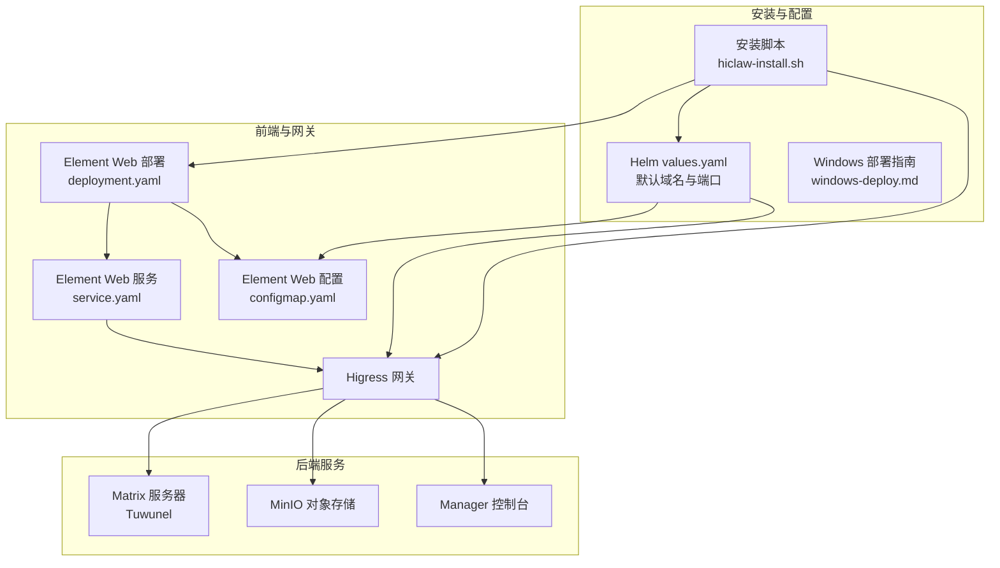
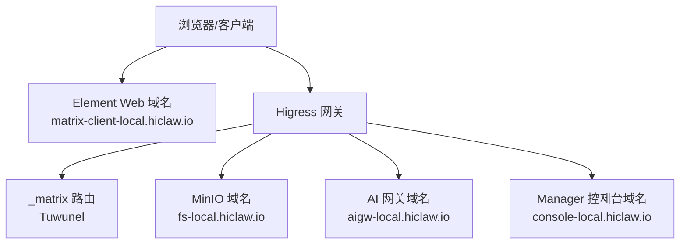
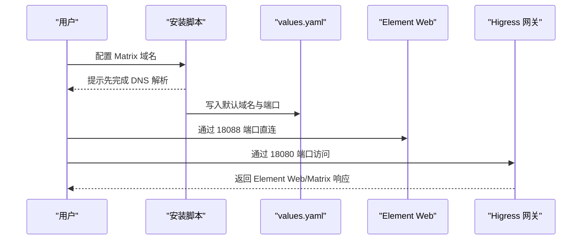
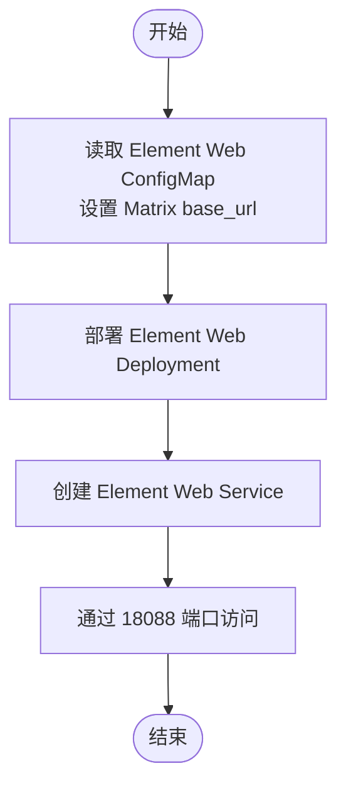
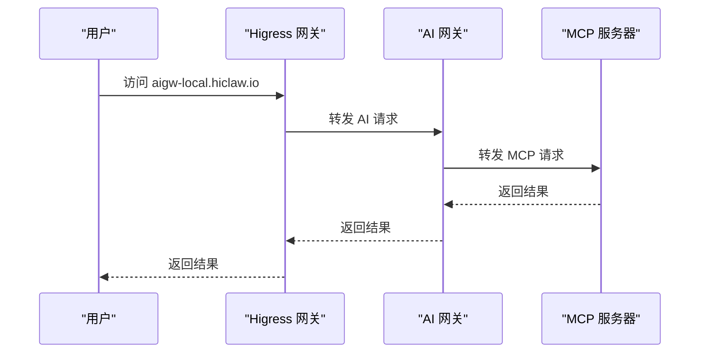
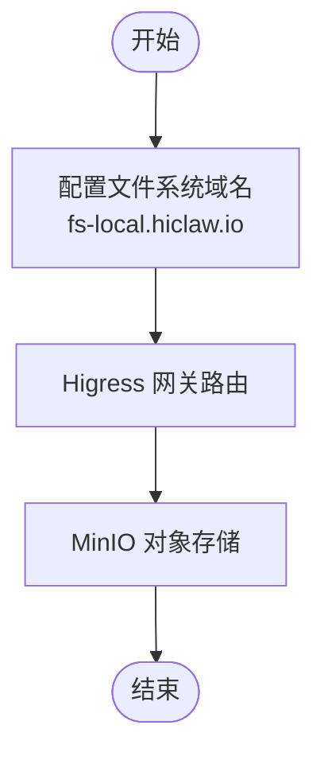
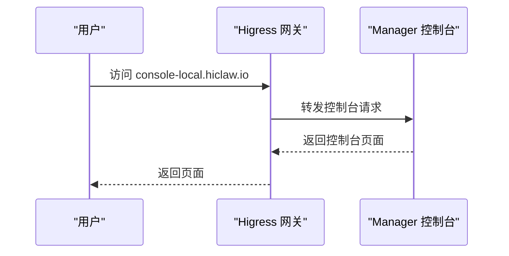
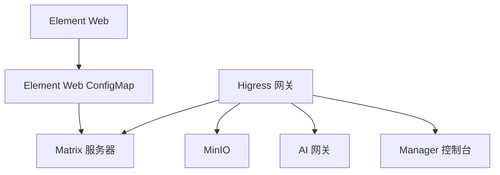
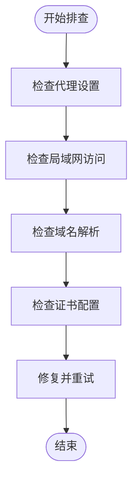

# 域名配置

<cite>
**本文引用的文件**
- [values.yaml](file://helm/hiclaw/values.yaml)
- [architecture.md](file://docs/zh-cn/architecture.md)
- [quickstart.md](file://docs/zh-cn/quickstart.md)
- [hiclaw-install.sh](file://install/hiclaw-install.sh)
- [windows-deploy.md](file://docs/windows-deploy.md)
- [setup-higress.sh](file://manager/scripts/init/setup-higress.sh)
- [start-element-web.sh](file://manager/scripts/init/start-element-web.sh)
- [configmap.yaml](file://helm/hiclaw/templates/element-web/configmap.yaml)
- [deployment.yaml](file://helm/hiclaw/templates/element-web/deployment.yaml)
- [service.yaml](file://helm/hiclaw/templates/element-web/service.yaml)
- [higress-api-doc.json](file://manager/agent/skills-alpha/higress-gateway-management/references/higress-api-doc.json)
- [faq.md](file://docs/faq.md)
- [README.md](file://README.md)
</cite>

## 目录
1. [简介](#简介)
2. [项目结构](#项目结构)
3. [核心组件](#核心组件)
4. [架构总览](#架构总览)
5. [详细组件分析](#详细组件分析)
6. [依赖关系分析](#依赖关系分析)
7. [性能考量](#性能考量)
8. [故障排查指南](#故障排查指南)
9. [结论](#结论)
10. [附录](#附录)

## 简介
本文件面向 HiClaw 的域名配置与访问，覆盖以下关键域名及其用途：
- Matrix 域名：Element Web 与 Matrix 服务器的入口
- Element Web 域名：IM Web 客户端入口
- AI 网关域名：LLM 代理与 MCP 服务器入口
- 文件系统域名：MinIO 对象存储入口
- Manager 控制台域名：Agent 控制台入口

内容涵盖 DNS 解析要求、单机 ECS 部署的特殊考虑、IP 直接访问方案、域名变更指南、SSL 证书配置建议以及常见域名问题的解决方案。

## 项目结构
HiClaw 的域名配置涉及安装脚本、Helm Chart、Element Web、Higress 网关与 MinIO 等组件。默认情况下，安装脚本会引导用户配置各域名，Helm Chart 提供默认值，Element Web 通过 ConfigMap 指向 Matrix 服务器，Higress 负责路由与 TLS。

图示来源
- [hiclaw-install.sh:492-505](file://install/hiclaw-install.sh#L492-L505)
- [values.yaml:26-111](file://helm/hiclaw/values.yaml#L26-L111)
- [deployment.yaml:1-57](file://helm/hiclaw/templates/element-web/deployment.yaml#L1-L57)
- [service.yaml:1-22](file://helm/hiclaw/templates/element-web/service.yaml#L1-L22)
- [configmap.yaml:1-23](file://helm/hiclaw/templates/element-web/configmap.yaml#L1-L23)

章节来源
- [hiclaw-install.sh:492-505](file://install/hiclaw-install.sh#L492-L505)
- [values.yaml:26-111](file://helm/hiclaw/values.yaml#L26-L111)

## 核心组件
- Matrix 域名与 Element Web 域名：用于访问 Element Web 与 Matrix 服务器，安装脚本会引导用户配置，Helm Chart 提供默认值，Element Web 通过 ConfigMap 指向 Matrix 服务器。
- AI 网关域名：Higress 网关负责 AI 路由与 MCP 服务器接入，安装脚本与 Windows 部署指南提供默认域名与端口。
- 文件系统域名：MinIO 对象存储域名，Higress 网关负责路由与 TLS。
- Manager 控制台域名：Agent 控制台域名，Higress 网关负责路由与基本认证保护。

章节来源
- [architecture.md:63-84](file://docs/zh-cn/architecture.md#L63-L84)
- [quickstart.md:62-74](file://docs/zh-cn/quickstart.md#L62-L74)
- [values.yaml:26-111](file://helm/hiclaw/values.yaml#L26-L111)
- [configmap.yaml:12-22](file://helm/hiclaw/templates/element-web/configmap.yaml#L12-L22)

## 架构总览
下图展示域名与组件的映射关系，以及 Higress 网关在其中的角色。

图示来源
- [architecture.md:63-84](file://docs/zh-cn/architecture.md#L63-L84)
- [values.yaml:26-111](file://helm/hiclaw/values.yaml#L26-L111)

章节来源
- [architecture.md:63-84](file://docs/zh-cn/architecture.md#L63-L84)
- [values.yaml:26-111](file://helm/hiclaw/values.yaml#L26-L111)

## 详细组件分析

### Matrix 域名配置
- 作用：Element Web 与 Matrix 服务器的入口，安装脚本引导用户配置，默认域名形如 matrix-local.hiclaw.io。
- 配置要点：
  - 安装脚本提供交互式提示，要求先完成 DNS 解析。
  - 单机 ECS 部署时无需修改 aigw、fs 等域名；Element Web 与 Matrix Server 可通过 IP 直接访问。
  - Element Web 默认通过 18088 端口直连，也可通过网关访问。
- 默认值与端口：
  - Element Web 默认端口 8080（容器内），可通过宿主机 18088 端口访问。
  - 网关默认端口 18080，Matrix 与 Element Web 均通过该网关访问。

图示来源
- [hiclaw-install.sh:494-496](file://install/hiclaw-install.sh#L494-L496)
- [quickstart.md:62-74](file://docs/zh-cn/quickstart.md#L62-L74)
- [values.yaml:212-229](file://helm/hiclaw/values.yaml#L212-L229)

章节来源
- [hiclaw-install.sh:494-496](file://install/hiclaw-install.sh#L494-L496)
- [quickstart.md:62-74](file://docs/zh-cn/quickstart.md#L62-L74)
- [values.yaml:212-229](file://helm/hiclaw/values.yaml#L212-L229)

### Element Web 域名配置
- 作用：IM Web 客户端入口，Helm Chart 提供默认域名与端口。
- 配置要点：
  - Element Web 通过 ConfigMap 指向 Matrix 服务器的 base_url。
  - 默认端口 8080（容器内），可通过宿主机 18088 端口访问。
- 默认值与端口：
  - Element Web 服务端口 8080，Helm Chart 提供默认值。
  - 安装脚本与 Windows 部署指南提供默认域名与端口。

图示来源
- [configmap.yaml:12-22](file://helm/hiclaw/templates/element-web/configmap.yaml#L12-L22)
- [deployment.yaml:28-44](file://helm/hiclaw/templates/element-web/deployment.yaml#L28-L44)
- [service.yaml:14-19](file://helm/hiclaw/templates/element-web/service.yaml#L14-L19)

章节来源
- [configmap.yaml:12-22](file://helm/hiclaw/templates/element-web/configmap.yaml#L12-L22)
- [deployment.yaml:28-44](file://helm/hiclaw/templates/element-web/deployment.yaml#L28-L44)
- [service.yaml:14-19](file://helm/hiclaw/templates/element-web/service.yaml#L14-L19)

### AI 网关域名配置
- 作用：AI 路由与 MCP 服务器入口，Higress 网关负责路由与 TLS。
- 配置要点：
  - 安装脚本与 Windows 部署指南提供默认域名与端口。
  - Higress 网关负责将请求路由到 AI Provider 或 MCP 服务器。
- 默认值与端口：
  - 网关默认端口 18080，AI 网关域名默认为 aigw-local.hiclaw.io。

图示来源
- [windows-deploy.md:266-270](file://docs/windows-deploy.md#L266-L270)
- [values.yaml:55-71](file://helm/hiclaw/values.yaml#L55-L71)

章节来源
- [windows-deploy.md:266-270](file://docs/windows-deploy.md#L266-L270)
- [values.yaml:55-71](file://helm/hiclaw/values.yaml#L55-L71)

### 文件系统域名配置
- 作用：MinIO 对象存储入口，Higress 网关负责路由与 TLS。
- 配置要点：
  - 安装脚本与 Windows 部署指南提供默认域名与端口。
  - Higress 网关负责将请求路由到 MinIO。
- 默认值与端口：
  - MinIO 默认端口 9000（API），9001（控制台）。
  - 文件系统域名默认为 fs-local.hiclaw.io。

图示来源
- [windows-deploy.md:268-270](file://docs/windows-deploy.md#L268-L270)
- [values.yaml:72-111](file://helm/hiclaw/values.yaml#L72-L111)

章节来源
- [windows-deploy.md:268-270](file://docs/windows-deploy.md#L268-L270)
- [values.yaml:72-111](file://helm/hiclaw/values.yaml#L72-L111)

### Manager 控制台域名配置
- 作用：Agent 控制台入口，Higress 网关负责路由与基本认证保护。
- 配置要点：
  - 安装脚本与 Windows 部署指南提供默认域名与端口。
  - Higress 网关负责将请求路由到 Manager 控制台。
- 默认值与端口：
  - 控制台域名默认为 console-local.hiclaw.io。
  - 安装脚本与 Windows 部署指南提供默认域名与端口。

图示来源
- [windows-deploy.md:269-270](file://docs/windows-deploy.md#L269-L270)
- [values.yaml:212-229](file://helm/hiclaw/values.yaml#L212-L229)

章节来源
- [windows-deploy.md:269-270](file://docs/windows-deploy.md#L269-L270)
- [values.yaml:212-229](file://helm/hiclaw/values.yaml#L212-L229)

## 依赖关系分析
- Element Web 依赖 Matrix 服务器：Element Web 通过 ConfigMap 指向 Matrix 服务器的 base_url。
- Higress 网关统一入口：Matrix、MinIO、AI 网关、Manager 控制台均由 Higress 网关路由。
- 安装脚本与 Helm Chart：安装脚本引导用户配置域名，Helm Chart 提供默认值与端口。

图示来源
- [configmap.yaml:12-22](file://helm/hiclaw/templates/element-web/configmap.yaml#L12-L22)
- [values.yaml:26-111](file://helm/hiclaw/values.yaml#L26-L111)

章节来源
- [configmap.yaml:12-22](file://helm/hiclaw/templates/element-web/configmap.yaml#L12-L22)
- [values.yaml:26-111](file://helm/hiclaw/values.yaml#L26-L111)

## 性能考量
- 端口与负载：Higress 网关默认端口 18080，Element Web 默认端口 8080/18088，MinIO 默认端口 9000/9001。合理规划端口可避免冲突。
- TLS 与安全：Windows 部署指南建议在允许外部访问时配置 TLS 证书并启用 HTTPS，避免明文传输。
- DNS 解析：安装脚本提示先完成 DNS 解析，避免解析延迟影响访问体验。

章节来源
- [windows-deploy.md:252-253](file://docs/windows-deploy.md#L252-L253)
- [hiclaw-install.sh:494-495](file://install/hiclaw-install.sh#L494-L495)

## 故障排查指南
- 本地访问 Matrix 服务器不通：检查浏览器或系统代理，将 `*-local.hiclaw.io` / `127.0.0.1` 加入代理绕过列表。
- 局域网其他设备无法访问 Web 端：在其他设备浏览器中访问 `http://<LAN-IP>:18088`，并在登录时将 Matrix Server 地址改为 `http://<LAN-IP>:18080`。
- 域名变更后访问异常：通过 Higress Console API 更新域名与证书，确保域名与证书匹配。
- 域名解析失败：确认 DNS 已正确解析至网关 IP，且防火墙放行相应端口。

图示来源
- [faq.md:294-299](file://docs/faq.md#L294-L299)
- [faq.md:270-291](file://docs/faq.md#L270-L291)
- [higress-api-doc.json:197-238](file://manager/agent/skills-alpha/higress-gateway-management/references/higress-api-doc.json#L197-L238)

章节来源
- [faq.md:294-299](file://docs/faq.md#L294-L299)
- [faq.md:270-291](file://docs/faq.md#L270-L291)
- [higress-api-doc.json:197-238](file://manager/agent/skills-alpha/higress-gateway-management/references/higress-api-doc.json#L197-L238)

## 结论
HiClaw 的域名配置围绕 Higress 网关展开，通过安装脚本与 Helm Chart 提供默认值，结合 Element Web、Matrix 服务器、MinIO、AI 网关与 Manager 控制台实现统一入口。合理配置 DNS、端口与 TLS，可确保在单机与生产环境中稳定访问。遇到问题时，优先检查代理、局域网访问与域名解析，必要时通过 Higress Console API 更新域名与证书。

## 附录
- 安装脚本交互提示：包含域名配置标题、提示信息与各域名输入项。
- Windows 部署指南：包含默认域名与端口、网络访问模式与安全建议。
- Higress API 文档：提供域名与证书管理的 API 参考。

章节来源
- [hiclaw-install.sh:492-505](file://install/hiclaw-install.sh#L492-L505)
- [windows-deploy.md:238-275](file://docs/windows-deploy.md#L238-L275)
- [higress-api-doc.json:197-238](file://manager/agent/skills-alpha/higress-gateway-management/references/higress-api-doc.json#L197-L238)