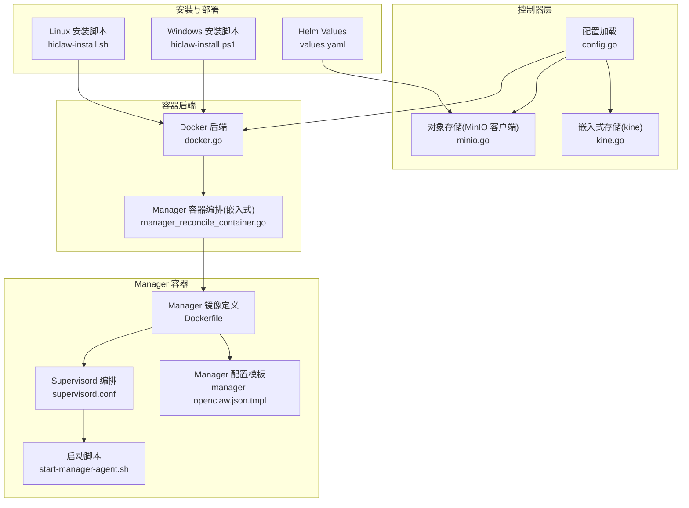
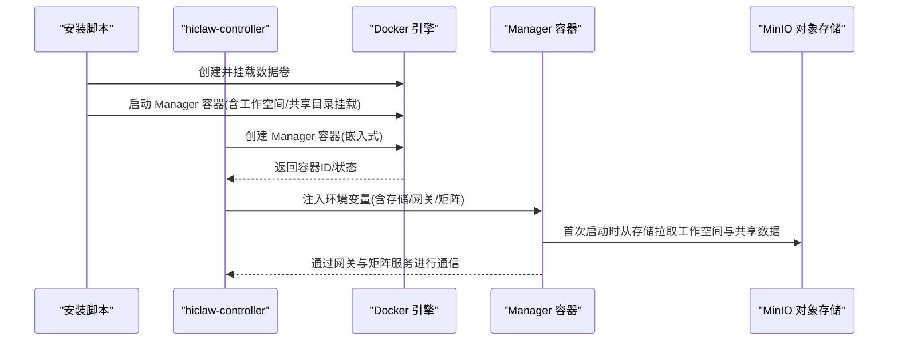
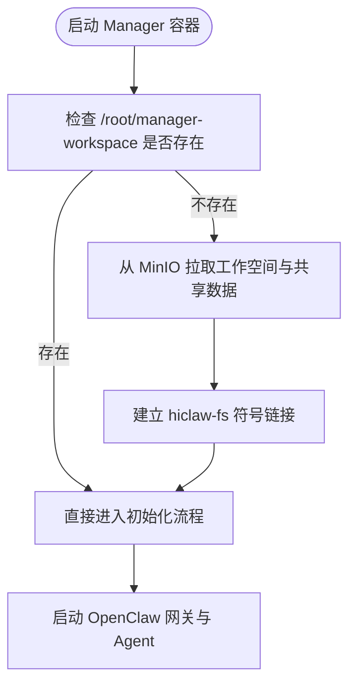
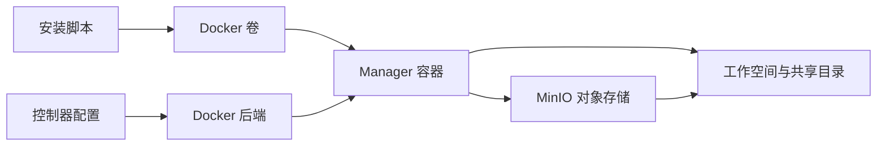

# 存储与工作空间

<cite>
**本文引用的文件**
- [hiclaw-controller/internal/store/kine.go](file://hiclaw-controller/internal/store/kine.go)
- [hiclaw-controller/internal/config/config.go](file://hiclaw-controller/internal/config/config.go)
- [hiclaw-controller/internal/backend/docker.go](file://hiclaw-controller/internal/backend/docker.go)
- [hiclaw-controller/internal/controller/manager_reconcile_container.go](file://hiclaw-controller/internal/controller/manager_reconcile_container.go)
- [hiclaw-controller/internal/oss/minio.go](file://hiclaw-controller/internal/oss/minio.go)
- [manager/configs/manager-openclaw.json.tmpl](file://manager/configs/manager-openclaw.json.tmpl)
- [manager/Dockerfile](file://manager/Dockerfile)
- [manager/scripts/init/start-manager-agent.sh](file://manager/scripts/init/start-manager-agent.sh)
- [manager/supervisord.conf](file://manager/supervisord.conf)
- [install/hiclaw-install.sh](file://install/hiclaw-install.sh)
- [install/hiclaw-install.ps1](file://install/hiclaw-install.ps1)
- [helm/hiclaw/values.yaml](file://helm/hiclaw/values.yaml)
</cite>

## 目录
1. [简介](#简介)
2. [项目结构](#项目结构)
3. [核心组件](#核心组件)
4. [架构总览](#架构总览)
5. [详细组件分析](#详细组件分析)
6. [依赖分析](#依赖分析)
7. [性能考虑](#性能考虑)
8. [故障排查指南](#故障排查指南)
9. [结论](#结论)
10. [附录](#附录)

## 简介
本章节面向 HiClaw 的存储与工作空间配置，系统性说明以下主题：
- Docker 卷名称与默认值
- Manager 工作空间目录与挂载
- 主机目录共享机制
- 数据持久化策略（嵌入式与集群模式）
- 存储卷管理与迁移
- 目录权限与安全
- 性能优化建议
- 备份与恢复方案

## 项目结构
围绕存储与工作空间的关键文件分布如下：
- 控制器与配置：控制器配置加载、嵌入式存储、对象存储客户端
- 容器后端：Docker 后端对卷挂载与端口映射的支持
- Manager 容器：工作空间目录、挂载点、启动脚本与服务编排
- 安装脚本：Docker 卷创建、挂载参数、主机目录共享
- Helm：对象存储（MinIO）持久化配置

**图表来源**
- [hiclaw-controller/internal/config/config.go:207-356](file://hiclaw-controller/internal/config/config.go#L207-L356)
- [hiclaw-controller/internal/store/kine.go:30-55](file://hiclaw-controller/internal/store/kine.go#L30-L55)
- [hiclaw-controller/internal/oss/minio.go:31-67](file://hiclaw-controller/internal/oss/minio.go#L31-L67)
- [hiclaw-controller/internal/backend/docker.go:36-61](file://hiclaw-controller/internal/backend/docker.go#L36-L61)
- [hiclaw-controller/internal/controller/manager_reconcile_container.go:197-234](file://hiclaw-controller/internal/controller/manager_reconcile_container.go#L197-L234)
- [manager/Dockerfile:69-87](file://manager/Dockerfile#L69-L87)
- [manager/configs/manager-openclaw.json.tmpl:74-108](file://manager/configs/manager-openclaw.json.tmpl#L74-L108)
- [manager/supervisord.conf:11-143](file://manager/supervisord.conf#L11-L143)
- [manager/scripts/init/start-manager-agent.sh:1-120](file://manager/scripts/init/start-manager-agent.sh#L1-L120)
- [install/hiclaw-install.sh:2555-2561](file://install/hiclaw-install.sh#L2555-L2561)
- [install/hiclaw-install.ps1:2537-2544](file://install/hiclaw-install.ps1#L2537-L2544)
- [helm/hiclaw/values.yaml:104-111](file://helm/hiclaw/values.yaml#L104-L111)

**章节来源**
- [hiclaw-controller/internal/config/config.go:207-356](file://hiclaw-controller/internal/config/config.go#L207-L356)
- [hiclaw-controller/internal/store/kine.go:30-55](file://hiclaw-controller/internal/store/kine.go#L30-L55)
- [hiclaw-controller/internal/oss/minio.go:31-67](file://hiclaw-controller/internal/oss/minio.go#L31-L67)
- [hiclaw-controller/internal/backend/docker.go:36-61](file://hiclaw-controller/internal/backend/docker.go#L36-L61)
- [hiclaw-controller/internal/controller/manager_reconcile_container.go:197-234](file://hiclaw-controller/internal/controller/manager_reconcile_container.go#L197-L234)
- [manager/Dockerfile:69-87](file://manager/Dockerfile#L69-L87)
- [manager/configs/manager-openclaw.json.tmpl:74-108](file://manager/configs/manager-openclaw.json.tmpl#L74-L108)
- [manager/supervisord.conf:11-143](file://manager/supervisord.conf#L11-L143)
- [manager/scripts/init/start-manager-agent.sh:1-120](file://manager/scripts/init/start-manager-agent.sh#L1-L120)
- [install/hiclaw-install.sh:2555-2561](file://install/hiclaw-install.sh#L2555-L2561)
- [install/hiclaw-install.ps1:2537-2544](file://install/hiclaw-install.ps1#L2537-L2544)
- [helm/hiclaw/values.yaml:104-111](file://helm/hiclaw/values.yaml#L104-L111)

## 核心组件
- 嵌入式存储（kine/SQLite）
  - 默认数据目录：/data/hiclaw-controller
  - 使用 WAL 日志模式与共享缓存提升并发读写稳定性
- 对象存储（MinIO 客户端 mc）
  - 支持静态与动态凭据模式；提供桶、镜像同步、列举、删除等操作
- Docker 后端
  - 支持卷挂载（工作空间、主机共享目录）、端口映射、重启策略
- Manager 容器
  - 工作空间目录：/root/manager-workspace
  - 共享目录挂载：/host-share
  - 启动脚本负责初始化、注册、Higress 初始化、工作空间同步
- 安装脚本
  - Linux/Windows 安装脚本均创建并挂载 Docker 卷，支持主机目录共享
- Helm（可选）
  - MinIO StatefulSet 持久化配置（启用持久化、容量、存储类）

**章节来源**
- [hiclaw-controller/internal/store/kine.go:30-55](file://hiclaw-controller/internal/store/kine.go#L30-L55)
- [hiclaw-controller/internal/oss/minio.go:73-201](file://hiclaw-controller/internal/oss/minio.go#L73-L201)
- [hiclaw-controller/internal/backend/docker.go:506-562](file://hiclaw-controller/internal/backend/docker.go#L506-L562)
- [manager/Dockerfile:71-75](file://manager/Dockerfile#L71-L75)
- [manager/scripts/init/start-manager-agent.sh:158-182](file://manager/scripts/init/start-manager-agent.sh#L158-L182)
- [install/hiclaw-install.sh:2555-2561](file://install/hiclaw-install.sh#L2555-L2561)
- [install/hiclaw-install.ps1:2537-2544](file://install/hiclaw-install.ps1#L2537-L2544)
- [helm/hiclaw/values.yaml:104-111](file://helm/hiclaw/values.yaml#L104-L111)

## 架构总览
下图展示嵌入式模式下，控制器如何通过 Docker 后端为 Manager 容器注入工作空间与共享目录挂载，并通过 MinIO 进行工作空间与共享数据的同步。

**图表来源**
- [hiclaw-controller/internal/controller/manager_reconcile_container.go:197-234](file://hiclaw-controller/internal/controller/manager_reconcile_container.go#L197-L234)
- [hiclaw-controller/internal/backend/docker.go:506-562](file://hiclaw-controller/internal/backend/docker.go#L506-L562)
- [manager/scripts/init/start-manager-agent.sh:158-182](file://manager/scripts/init/start-manager-agent.sh#L158-L182)
- [install/hiclaw-install.sh:2555-2561](file://install/hiclaw-install.sh#L2555-L2561)
- [install/hiclaw-install.ps1:2537-2544](file://install/hiclaw-install.ps1#L2537-L2544)

## 详细组件分析

### Docker 卷名称与默认值
- 默认卷名
  - Linux/Windows 安装脚本在创建数据卷时使用统一的卷名作为数据根目录，该卷挂载到容器内的 /data 路径，用于控制器嵌入式存储与 Manager 工作空间持久化。
- 卷创建与挂载
  - 若卷不存在则创建；若已存在则复用，避免重复初始化。
  - 安装脚本同时支持将主机目录以只读或读写方式挂载到 /host-share，实现主机与容器间的数据共享。

**章节来源**
- [install/hiclaw-install.sh:2555-2561](file://install/hiclaw-install.sh#L2555-L2561)
- [install/hiclaw-install.ps1:2537-2544](file://install/hiclaw-install.ps1#L2537-L2544)

### Manager 工作空间目录与挂载
- 工作空间目录
  - 容器内默认工作空间路径为 /root/manager-workspace，由 Manager 镜像在构建阶段声明并创建。
- 嵌入式模式下的挂载
  - 控制器在创建 Manager 容器时，会根据配置将宿主机的工作空间目录挂载到 /root/manager-workspace，并将主机共享目录挂载到 /host-share。
- 启动脚本中的工作空间处理
  - 首次启动时，启动脚本会根据运行模式（本地/云/K8s）从 MinIO 或集群内部 MinIO 拉取工作空间与共享数据，确保容器内具备完整的初始状态。

**图表来源**
- [manager/Dockerfile:71-75](file://manager/Dockerfile#L71-L75)
- [manager/scripts/init/start-manager-agent.sh:158-182](file://manager/scripts/init/start-manager-agent.sh#L158-L182)

**章节来源**
- [manager/Dockerfile:71-75](file://manager/Dockerfile#L71-L75)
- [manager/scripts/init/start-manager-agent.sh:158-182](file://manager/scripts/init/start-manager-agent.sh#L158-L182)
- [hiclaw-controller/internal/controller/manager_reconcile_container.go:204-215](file://hiclaw-controller/internal/controller/manager_reconcile_container.go#L204-L215)

### 主机目录共享设置
- 挂载点
  - /host-share：用于将宿主机目录映射到容器中，便于访问宿主机上的文件与资源。
- 自动符号链接
  - 在本地模式下，启动脚本会尝试在 /root 下创建指向 /host-share 的符号链接，以便用户在容器内以熟悉的路径访问宿主机内容。
- 端口与网络
  - 嵌入式模式下，控制器会将 Manager 的控制台端口（默认 18799）映射到宿主机的回环地址，便于本地调试。

**章节来源**
- [manager/scripts/init/start-manager-agent.sh:86-97](file://manager/scripts/init/start-manager-agent.sh#L86-L97)
- [hiclaw-controller/internal/controller/manager_reconcile_container.go:219-227](file://hiclaw-controller/internal/controller/manager_reconcile_container.go#L219-L227)

### 数据持久化策略
- 嵌入式存储（kine/SQLite）
  - 数据目录默认位于 /data/hiclaw-controller，采用 WAL 日志模式与共享缓存，适合小规模单机部署。
- 对象存储（MinIO）
  - 通过 mc 客户端进行对象上传/下载/镜像同步，支持覆盖与排除策略，适用于工作空间与共享数据的持久化与跨环境迁移。
- MinIO 持久化（Helm）
  - Helm Chart 中 MinIO StatefulSet 可启用持久化存储，指定容量与存储类，满足生产级可靠性需求。

**章节来源**
- [hiclaw-controller/internal/store/kine.go:30-55](file://hiclaw-controller/internal/store/kine.go#L30-L55)
- [hiclaw-controller/internal/oss/minio.go:73-201](file://hiclaw-controller/internal/oss/minio.go#L73-L201)
- [helm/hiclaw/values.yaml:104-111](file://helm/hiclaw/values.yaml#L104-L111)

### 存储卷管理与迁移
- 卷生命周期
  - 安装脚本在创建卷后，后续重新安装会复用同一卷，避免重复初始化。
- 迁移步骤（示例）
  - 备份：使用 mc mirror 将 /root/manager-workspace 与共享目录镜像到对象存储。
  - 迁移到新环境：在新环境中先创建相同命名的卷，再通过启动脚本从对象存储拉取数据。
- 注意事项
  - 确保对象存储端点、凭据与前缀一致，避免路径不匹配导致数据缺失。

**章节来源**
- [install/hiclaw-install.sh:2555-2561](file://install/hiclaw-install.sh#L2555-L2561)
- [hiclaw-controller/internal/oss/minio.go:138-159](file://hiclaw-controller/internal/oss/minio.go#L138-L159)
- [manager/scripts/init/start-manager-agent.sh:158-182](file://manager/scripts/init/start-manager-agent.sh#L158-L182)

### 目录权限与安全
- 权限建议
  - 工作空间与共享目录的宿主机路径应仅授予受信用户访问权限，避免敏感数据泄露。
  - 容器内工作空间目录由 Manager 镜像创建，默认权限需结合宿主机策略统一管理。
- 安全提示
  - 本地模式下，控制台端口映射到 127.0.0.1，限制外网访问；生产环境建议通过反向代理或防火墙进一步加固。
  - MinIO 凭据通过环境变量或凭据提供器注入，避免硬编码在镜像中。

**章节来源**
- [hiclaw-controller/internal/controller/manager_reconcile_container.go:219-227](file://hiclaw-controller/internal/controller/manager_reconcile_container.go#L219-L227)
- [manager/Dockerfile:71-75](file://manager/Dockerfile#L71-L75)

## 依赖分析
- 组件耦合
  - 控制器配置决定对象存储端点、桶名与前缀；Docker 后端负责将宿主机路径挂载到容器；Manager 启动脚本负责从对象存储拉取数据并初始化。
- 关键依赖链
  - 安装脚本 → Docker 卷/挂载 → Manager 容器 → MinIO 对象存储
  - 控制器配置 → Docker 后端 → Manager 容器创建

**图表来源**
- [install/hiclaw-install.sh:2555-2561](file://install/hiclaw-install.sh#L2555-L2561)
- [hiclaw-controller/internal/backend/docker.go:506-562](file://hiclaw-controller/internal/backend/docker.go#L506-L562)
- [manager/scripts/init/start-manager-agent.sh:158-182](file://manager/scripts/init/start-manager-agent.sh#L158-L182)

**章节来源**
- [hiclaw-controller/internal/backend/docker.go:506-562](file://hiclaw-controller/internal/backend/docker.go#L506-L562)
- [hiclaw-controller/internal/config/config.go:207-356](file://hiclaw-controller/internal/config/config.go#L207-L356)
- [manager/scripts/init/start-manager-agent.sh:158-182](file://manager/scripts/init/start-manager-agent.sh#L158-L182)

## 性能考虑
- 嵌入式存储
  - 使用 WAL 日志与共享缓存可提升并发读写性能；建议在磁盘 IOPS 充足的环境中运行。
- 对象存储
  - 使用 mc mirror 的覆盖与排除策略减少传输量；合理设置并发与带宽上限，避免影响业务流量。
- 端口与网络
  - 本地模式仅映射到 127.0.0.1，避免外部网络压力；如需远程访问，建议通过安全隧道或反向代理。

[本节为通用指导，无需列出具体文件来源]

## 故障排查指南
- 无法连接 MinIO
  - 检查对象存储端点与凭据是否正确；确认端点未误配为 8080（S3 端口应为 9000）。
- 工作空间未同步
  - 确认启动脚本已完成从 MinIO 的镜像同步；检查存储前缀与桶名一致性。
- 端口冲突
  - Docker 后端在启动容器时会检测端口占用并重试；如持续失败，检查宿主机端口占用情况。
- 权限问题
  - 确认宿主机目录权限与容器内用户 UID/GID 匹配；必要时调整挂载选项（读写/只读）。

**章节来源**
- [hiclaw-controller/internal/oss/minio.go:203-226](file://hiclaw-controller/internal/oss/minio.go#L203-L226)
- [manager/scripts/init/start-manager-agent.sh:158-182](file://manager/scripts/init/start-manager-agent.sh#L158-L182)
- [hiclaw-controller/internal/backend/docker.go:193-208](file://hiclaw-controller/internal/backend/docker.go#L193-L208)

## 结论
HiClaw 的存储与工作空间设计以“嵌入式 + 对象存储”为核心，结合 Docker 卷与挂载机制，实现了灵活的本地开发与生产迁移能力。通过统一的安装脚本与启动流程，用户可在不同环境下快速完成工作空间初始化与数据同步。建议在生产环境中配合 Helm 的 MinIO 持久化配置与严格的权限策略，确保数据安全与高可用。

[本节为总结性内容，无需列出具体文件来源]

## 附录
- 关键配置项速览
  - 控制器数据目录：HICLAW_DATA_DIR（默认 /data/hiclaw-controller）
  - 工作空间目录：/root/manager-workspace（容器内）
  - 主机共享目录：/host-share（容器内）
  - MinIO 端点：HICLAW_FS_ENDPOINT（S3 端口应为 9000）
  - MinIO 桶：HICLAW_FS_BUCKET（默认 hiclaw-storage）
  - 存储前缀：HICLAW_STORAGE_PREFIX（默认 hiclaw/hiclaw-storage）

**章节来源**
- [hiclaw-controller/internal/config/config.go:207-356](file://hiclaw-controller/internal/config/config.go#L207-L356)
- [manager/Dockerfile:71-75](file://manager/Dockerfile#L71-L75)
- [hiclaw-controller/internal/oss/minio.go:585-596](file://hiclaw-controller/internal/oss/minio.go#L585-L596)