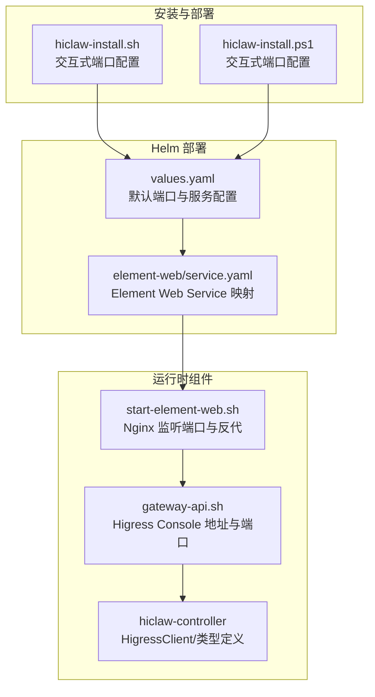
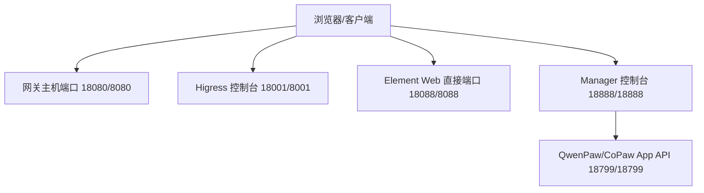
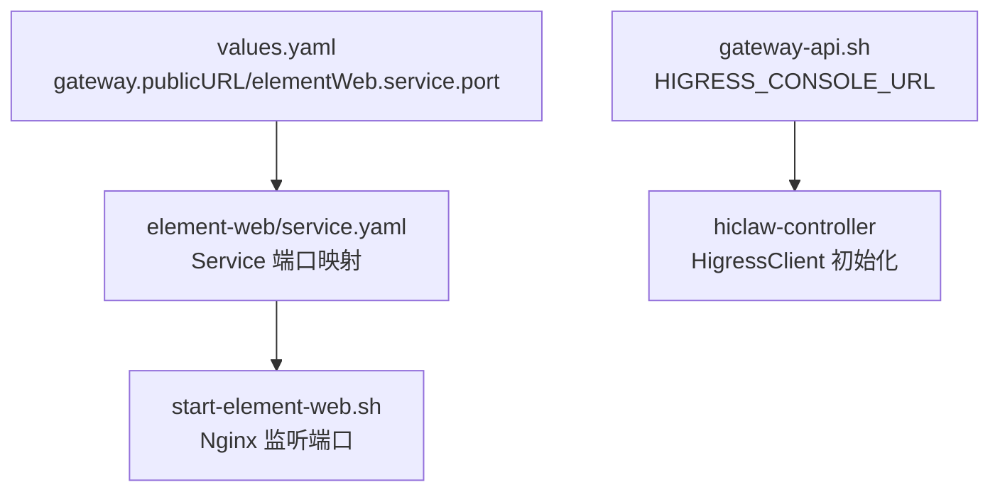

# 端口配置

<cite>
**本文引用的文件**
- [values.yaml](file://helm/hiclaw/values.yaml)
- [service.yaml](file://helm/hiclaw/templates/element-web/service.yaml)
- [start-element-web.sh](file://manager/scripts/init/start-element-web.sh)
- [gateway-api.sh](file://manager/scripts/lib/gateway-api.sh)
- [higress.go](file://hiclaw-controller/internal/gateway/higress.go)
- [types.go](file://hiclaw-controller/internal/gateway/types.go)
- [hiclaw-install.sh](file://install/hiclaw-install.sh)
- [hiclaw-install.ps1](file://install/hiclaw-install.ps1)
- [quickstart.md](file://docs/quickstart.md)
- [windows-deploy.md](file://docs/windows-deploy.md)
</cite>

## 目录
1. [简介](#简介)
2. [项目结构](#项目结构)
3. [核心组件](#核心组件)
4. [架构总览](#架构总览)
5. [详细组件分析](#详细组件分析)
6. [依赖关系分析](#依赖关系分析)
7. [性能考量](#性能考量)
8. [故障排查指南](#故障排查指南)
9. [结论](#结论)

## 简介
本章节面向 HiClaw 的端口配置，系统性说明以下端口的用途、绑定模式、安全建议与常见问题排查方法：
- 网关主机端口：用于 Element Web 与 Matrix 客户端访问，默认 18080（容器内 8080）
- Higress 控制台端口：用于 AI 网关管理，默认 18001（容器内 8001）
- Element Web 直接访问端口：用于直接访问 Element Web，默认 18088（容器内 8088）
- Manager 控制台端口：用于 OpenClaw 控制界面，默认 18888（容器内 18888）
- QwenPaw App API 端口：用于 CoPaw 运行时应用 API，默认 18799（容器内 18799）

同时覆盖端口绑定模式（本地访问 vs 外部访问）、网络安全考虑、端口冲突处理、HTTPS 配置建议与故障排查方法。

## 项目结构
下图展示与端口配置直接相关的组件与文件映射关系：

**图表来源**
- [hiclaw-install.sh:2016-2023](file://install/hiclaw-install.sh#L2016-L2023)
- [hiclaw-install.ps1:1949-1959](file://install/hiclaw-install.ps1#L1949-L1959)
- [values.yaml:62-62](file://helm/hiclaw/values.yaml#L62-L62)
- [service.yaml:14-18](file://helm/hiclaw/templates/element-web/service.yaml#L14-L18)
- [start-element-web.sh:39-56](file://manager/scripts/init/start-element-web.sh#L39-L56)
- [gateway-api.sh:19-19](file://manager/scripts/lib/gateway-api.sh#L19-L19)
- [higress.go:44-48](file://hiclaw-controller/internal/gateway/higress.go#L44-L48)

**章节来源**
- [hiclaw-install.sh:2016-2023](file://install/hiclaw-install.sh#L2016-L2023)
- [hiclaw-install.ps1:1949-1959](file://install/hiclaw-install.ps1#L1949-L1959)
- [values.yaml:62-62](file://helm/hiclaw/values.yaml#L62-L62)
- [service.yaml:14-18](file://helm/hiclaw/templates/element-web/service.yaml#L14-L18)
- [start-element-web.sh:39-56](file://manager/scripts/init/start-element-web.sh#L39-L56)
- [gateway-api.sh:19-19](file://manager/scripts/lib/gateway-api.sh#L19-L19)
- [higress.go:44-48](file://hiclaw-controller/internal/gateway/higress.go#L44-L48)

## 核心组件
- 网关主机端口（Element Web/Matirx）：默认 18080（容器内 8080），用于浏览器通过 Element Web 登录与聊天；可通过 Helm 的 gateway.publicURL 或安装脚本的端口配置进行自定义。
- Higress 控制台端口：默认 18001（容器内 8001），用于网关路由、消费者与 AI 提供商管理；安装脚本支持交互式选择是否仅本地绑定或对外暴露。
- Element Web 直接访问端口：默认 18088（容器内 8088），通过 Nginx 直接提供静态页面服务；可作为不走网关的快速入口。
- Manager 控制台端口：默认 18888（容器内 18888），通过 Nginx 反向代理至本地 18799（OpenClaw/CoPaw 应用），并注入令牌实现免密登录。
- QwenPaw App API 端口：默认 18799（容器内 18799），CoPaw 运行时的应用 API；Manager 控制台通过反向代理访问该端口。

**章节来源**
- [values.yaml:62-62](file://helm/hiclaw/values.yaml#L62-L62)
- [service.yaml:14-18](file://helm/hiclaw/templates/element-web/service.yaml#L14-L18)
- [start-element-web.sh:72-92](file://manager/scripts/init/start-element-web.sh#L72-L92)
- [gateway-api.sh:19-19](file://manager/scripts/lib/gateway-api.sh#L19-L19)
- [hiclaw-install.sh:2016-2023](file://install/hiclaw-install.sh#L2016-L2023)
- [hiclaw-install.ps1:1949-1959](file://install/hiclaw-install.ps1#L1949-L1959)

## 架构总览
下图展示端口在整体系统中的作用与流向：

**图表来源**
- [quickstart.md:64-76](file://docs/quickstart.md#L64-L76)
- [windows-deploy.md:521-523](file://docs/windows-deploy.md#L521-L523)
- [start-element-web.sh:72-92](file://manager/scripts/init/start-element-web.sh#L72-L92)

**章节来源**
- [quickstart.md:64-76](file://docs/quickstart.md#L64-L76)
- [windows-deploy.md:521-523](file://docs/windows-deploy.md#L521-L523)
- [start-element-web.sh:72-92](file://manager/scripts/init/start-element-web.sh#L72-L92)

## 详细组件分析

### 网关主机端口（Element Web/Matirx）
- 默认值与来源
  - Helm 中 gateway.publicURL 指定对外访问 URL（如 http://localhost:18080），用于浏览器访问 Element Web。
  - Element Web Service 将容器内 8080 暴露为集群内部服务端口。
- 绑定模式
  - 本地访问：安装脚本可选择仅绑定到 127.0.0.1，避免外部暴露。
  - 外部访问：绑定到 0.0.0.0，允许局域网/公网访问。
- 端口冲突处理
  - 若 18080 已被占用，安装脚本会提示用户修改端口；Helm 可通过 gateway.publicURL 与 Service NodePort/LoadBalancer 配置规避冲突。
- 安全建议
  - 强烈建议在 Higress 控制台配置 TLS 证书并启用 HTTPS，避免明文传输。
- 故障排查
  - 使用浏览器打开 http://localhost:18080 或 http://127.0.0.1:18088 验证 Element Web 是否可达。
  - 如需通过网关访问，确认 /etc/hosts 中已添加对应域名映射。

**章节来源**
- [values.yaml:62-62](file://helm/hiclaw/values.yaml#L62-L62)
- [service.yaml:14-18](file://helm/hiclaw/templates/element-web/service.yaml#L14-L18)
- [hiclaw-install.sh:2016-2023](file://install/hiclaw-install.sh#L2016-L2023)
- [hiclaw-install.ps1:1949-1959](file://install/hiclaw-install.ps1#L1949-L1959)
- [quickstart.md:64-76](file://docs/quickstart.md#L64-L76)

### Higress 控制台端口（18001/8001）
- 默认值与来源
  - 控制台监听端口为 8001（容器内），安装脚本默认主机端口为 18001。
- 绑定模式
  - 本地访问优先：默认仅绑定到 127.0.0.1，避免外部暴露。
  - 外部访问：可切换为 0.0.0.0，但建议配合 HTTPS 与访问控制。
- 端口冲突处理
  - 若 18001 已被占用，安装脚本会提示修改；也可通过反向代理或容器编排工具调整。
- 安全建议
  - 在 Higress 控制台配置 TLS 证书与基本认证，限制访问范围。
- 故障排查
  - 通过 http://localhost:18001 验证控制台可用性；若失败，检查控制器日志与会话初始化流程。

**章节来源**
- [hiclaw-install.sh:2016-2023](file://install/hiclaw-install.sh#L2016-L2023)
- [hiclaw-install.ps1:1949-1959](file://install/hiclaw-install.ps1#L1949-L1959)
- [gateway-api.sh:19-19](file://manager/scripts/lib/gateway-api.sh#L19-L19)
- [higress.go:44-48](file://hiclaw-controller/internal/gateway/higress.go#L44-L48)

### Element Web 直接访问端口（18088/8088）
- 默认值与来源
  - Nginx 在容器内监听 8088，提供 Element Web 静态页面服务。
- 绑定模式
  - 本地访问：默认仅监听 127.0.0.1，适合本机调试。
  - 外部访问：可改为 0.0.0.0，但需谨慎。
- 端口冲突处理
  - 若 18088 已被占用，安装脚本会提示修改；或通过反代/容器端口映射规避。
- 安全建议
  - 仅在受控网络内暴露；结合 Higress 控制台的路由与鉴权策略。
- 故障排查
  - 打开 http://127.0.0.1:18088 验证页面加载；若失败，检查 Nginx 配置与日志。

**章节来源**
- [start-element-web.sh:39-56](file://manager/scripts/init/start-element-web.sh#L39-L56)
- [hiclaw-install.sh:2016-2023](file://install/hiclaw-install.sh#L2016-L2023)
- [hiclaw-install.ps1:1949-1959](file://install/hiclaw-install.ps1#L1949-L1959)

### Manager 控制台端口（18888/18888）
- 默认值与来源
  - Nginx 在容器内监听 18888，反向代理至本地 18799（OpenClaw/CoPaw 应用）。
  - 支持自动注入令牌，实现免密登录。
- 绑定模式
  - 本地访问：默认仅监听 127.0.0.1，适合本机使用。
  - 外部访问：可切换为 0.0.0.0，但需 HTTPS 与访问控制。
- 端口冲突处理
  - 若 18888 已被占用，安装脚本会提示修改；或通过容器编排调整。
- 安全建议
  - 强制启用 HTTPS；限制来源 IP；定期轮换令牌。
- 故障排查
  - 打开 http://127.0.0.1:18888 验证控制台；若无响应，检查 Nginx 反代与 18799 服务状态。

**章节来源**
- [start-element-web.sh:72-92](file://manager/scripts/init/start-element-web.sh#L72-L92)
- [hiclaw-install.sh:2016-2023](file://install/hiclaw-install.sh#L2016-L2023)
- [hiclaw-install.ps1:1949-1959](file://install/hiclaw-install.ps1#L1949-L1959)

### QwenPaw App API 端口（18799/18799）
- 默认值与来源
  - CoPaw 运行时的应用 API 监听端口为 18799（容器内）。
  - Manager 控制台通过 Nginx 反向代理访问该端口。
- 绑定模式
  - 本地访问：默认仅监听 127.0.0.1。
  - 外部访问：可切换为 0.0.0.0，但需 HTTPS 与访问控制。
- 端口冲突处理
  - 若 18799 已被占用，安装脚本会提示修改；或通过容器编排调整。
- 安全建议
  - 仅在受信网络内暴露；结合 Higress 控制台的路由与鉴权策略。
- 故障排查
  - 通过 http://127.0.0.1:18888 验证反代是否成功；若失败，检查 18799 服务状态与 Nginx 日志。

**章节来源**
- [start-element-web.sh:96-109](file://manager/scripts/init/start-element-web.sh#L96-L109)
- [hiclaw-install.sh:2016-2023](file://install/hiclaw-install.sh#L2016-L2023)
- [hiclaw-install.ps1:1949-1959](file://install/hiclaw-install.ps1#L1949-L1959)

## 依赖关系分析
下图展示端口配置与组件之间的依赖关系：

**图表来源**
- [values.yaml:62-62](file://helm/hiclaw/values.yaml#L62-L62)
- [service.yaml:14-18](file://helm/hiclaw/templates/element-web/service.yaml#L14-L18)
- [start-element-web.sh:39-56](file://manager/scripts/init/start-element-web.sh#L39-L56)
- [gateway-api.sh:19-19](file://manager/scripts/lib/gateway-api.sh#L19-L19)
- [higress.go:44-48](file://hiclaw-controller/internal/gateway/higress.go#L44-L48)

**章节来源**
- [values.yaml:62-62](file://helm/hiclaw/values.yaml#L62-L62)
- [service.yaml:14-18](file://helm/hiclaw/templates/element-web/service.yaml#L14-L18)
- [start-element-web.sh:39-56](file://manager/scripts/init/start-element-web.sh#L39-L56)
- [gateway-api.sh:19-19](file://manager/scripts/lib/gateway-api.sh#L19-L19)
- [higress.go:44-48](file://hiclaw-controller/internal/gateway/higress.go#L44-L48)

## 性能考量
- 端口数量与资源占用：端口越多，Nginx/反向代理的连接与并发处理压力越大。建议仅暴露必要端口，并通过 Higress 控制台集中管理路由与限流。
- 反向代理链路：Manager 控制台通过 Nginx 访问 18799，注意代理超时与压缩设置，避免长连接中断。
- 证书与加密：启用 HTTPS 后，CPU 开销增加，建议使用硬件加速或优化证书链长度。

## 故障排查指南
- 端口冲突
  - 症状：安装脚本报错或服务无法启动。
  - 处理：修改安装脚本中的端口配置，或通过 Helm 的 Service/Ingress 配置规避冲突。
- 无法访问 Element Web
  - 症状：浏览器打开 http://127.0.0.1:18088 或 http://localhost:18080 无响应。
  - 处理：检查 Nginx 配置与日志；确认端口绑定模式；验证 /etc/hosts 映射。
- Higress 控制台不可用
  - 症状：http://localhost:18001 返回错误。
  - 处理：检查控制器日志与会话初始化流程；确认 TLS 证书配置与访问权限。
- Manager 控制台登录异常
  - 症状：打开 http://127.0.0.1:18888 后无响应或需要手动输入令牌。
  - 处理：检查 Nginx 反代与 18799 服务；确认令牌注入逻辑与 CSP 设置。
- 端口绑定模式问题
  - 症状：外部网络无法访问或本地访问受限。
  - 处理：根据需求切换本地/外部绑定模式；确保防火墙与安全组放行相应端口。

**章节来源**
- [hiclaw-install.sh:2016-2023](file://install/hiclaw-install.sh#L2016-L2023)
- [hiclaw-install.ps1:1949-1959](file://install/hiclaw-install.ps1#L1949-L1959)
- [start-element-web.sh:72-92](file://manager/scripts/init/start-element-web.sh#L72-L92)
- [gateway-api.sh:19-19](file://manager/scripts/lib/gateway-api.sh#L19-L19)
- [higress.go:44-48](file://hiclaw-controller/internal/gateway/higress.go#L44-L48)

## 结论
HiClaw 的端口配置围绕“最小暴露、强安全”原则设计：默认仅本地绑定，支持交互式切换；通过 Higress 控制台集中管理路由与鉴权；Element Web 与 Manager 控制台提供直观入口。建议在生产环境中强制启用 HTTPS、限制访问来源、定期轮换凭证，并通过 Helm/安装脚本统一管理端口与绑定模式，以降低冲突与安全风险。