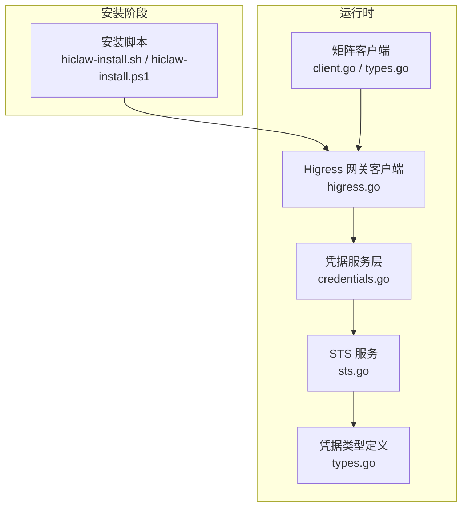
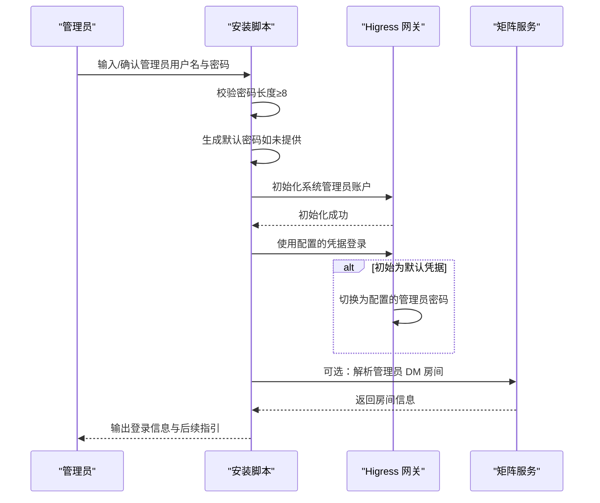
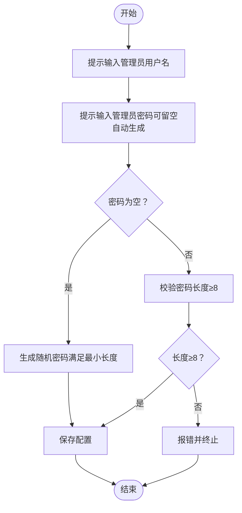
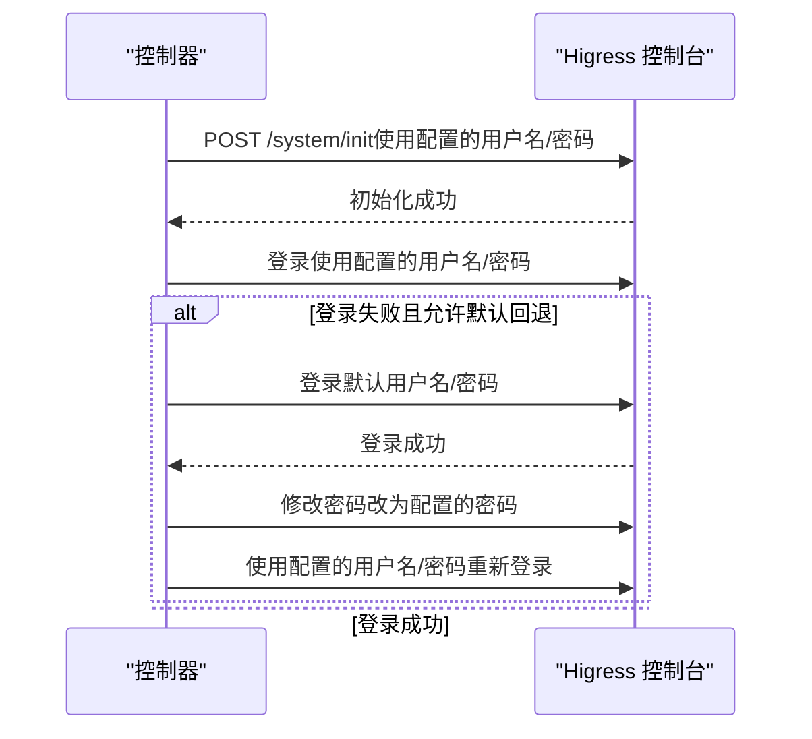
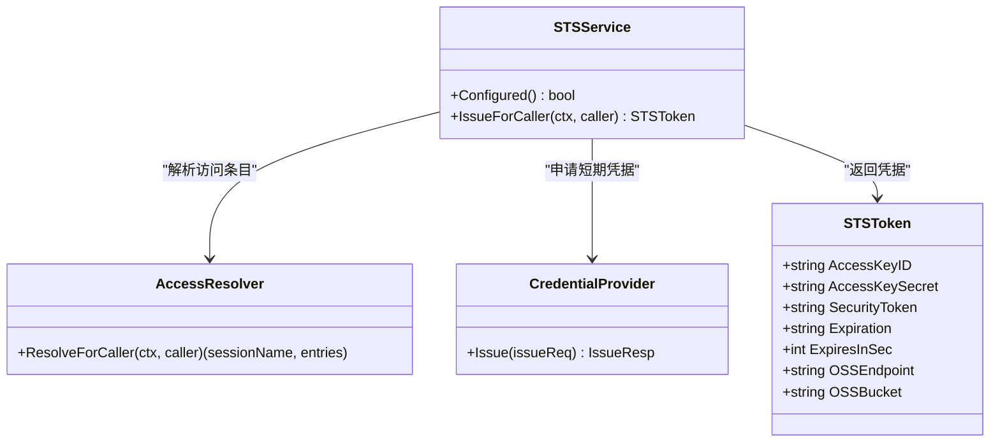
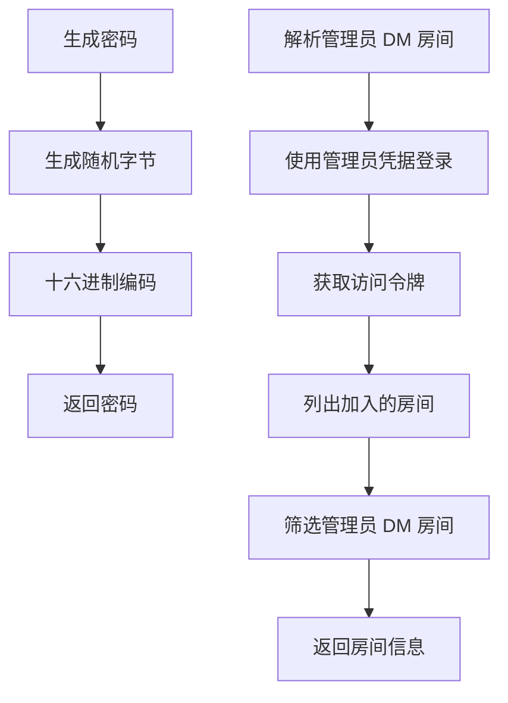
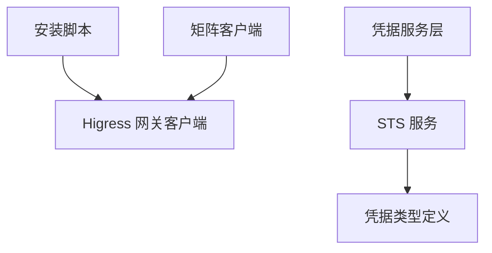

# 管理员凭据设置

<cite>
**本文档引用的文件**
- [hiclaw-install.sh](file://install/hiclaw-install.sh)
- [hiclaw-install.ps1](file://install/hiclaw-install.ps1)
- [higress.go](file://hiclaw-controller/internal/gateway/higress.go)
- [client_test.go](file://hiclaw-controller/internal/gateway/client_test.go)
- [credentials_handler.go](file://hiclaw-controller/internal/server/credentials_handler.go)
- [credentials.go](file://hiclaw-controller/internal/service/credentials.go)
- [sts.go](file://hiclaw-controller/internal/credentials/sts.go)
- [types.go](file://hiclaw-controller/internal/credentials/types.go)
- [types.go](file://hiclaw-controller/internal/matrix/types.go)
- [client.go](file://hiclaw-controller/internal/matrix/client.go)
</cite>

## 目录
1. [简介](#简介)
2. [项目结构](#项目结构)
3. [核心组件](#核心组件)
4. [架构概览](#架构概览)
5. [详细组件分析](#详细组件分析)
6. [依赖分析](#依赖分析)
7. [性能考虑](#性能考虑)
8. [故障排除指南](#故障排除指南)
9. [结论](#结论)

## 简介
本文件面向 HiClaw 管理员，提供管理员凭据（用户名与密码）的完整配置与管理指南。内容涵盖默认值、最小长度要求（8 位）、自动生成机制、密码强度建议、安全考虑、凭据修改与重置流程、最佳实践以及常见问题排查。

## 项目结构
围绕管理员凭据的关键实现分布在以下模块：
- 安装脚本：负责交互式收集管理员用户名与密码，支持自动生成与长度校验
- 网关客户端：负责初始化 Higress 控制台管理员账户、登录与密码收敛
- 凭据服务：提供 STS 临时凭证能力（用于 Worker/Manager 访问控制）
- 矩阵客户端：提供密码生成工具与管理员 DM 房间解析能力

**图表来源**
- [hiclaw-install.sh:1970-1986](file://install/hiclaw-install.sh#L1970-L1986)
- [hiclaw-install.ps1:1900-1918](file://install/hiclaw-install.ps1#L1900-L1918)
- [higress.go:35-84](file://hiclaw-controller/internal/gateway/higress.go#L35-L84)
- [credentials.go:115-142](file://hiclaw-controller/internal/service/credentials.go#L115-L142)
- [sts.go:29-89](file://hiclaw-controller/internal/credentials/sts.go#L29-L89)
- [types.go:3-12](file://hiclaw-controller/internal/credentials/types.go#L3-L12)
- [client.go:646-692](file://hiclaw-controller/internal/matrix/client.go#L646-L692)

**章节来源**
- [hiclaw-install.sh:1970-1986](file://install/hiclaw-install.sh#L1970-L1986)
- [hiclaw-install.ps1:1900-1918](file://install/hiclaw-install.ps1#L1900-L1918)
- [higress.go:35-84](file://hiclaw-controller/internal/gateway/higress.go#L35-L84)
- [credentials.go:115-142](file://hiclaw-controller/internal/service/credentials.go#L115-L142)
- [sts.go:29-89](file://hiclaw-controller/internal/credentials/sts.go#L29-L89)
- [types.go:3-12](file://hiclaw-controller/internal/credentials/types.go#L3-L12)
- [client.go:646-692](file://hiclaw-controller/internal/matrix/client.go#L646-L692)

## 核心组件
- 管理员凭据来源与默认值
  - 默认用户名：admin
  - 默认密码：若未显式提供，安装脚本会自动生成（长度满足最小要求）
- 最小长度要求
  - 安装脚本对管理员密码进行长度校验，要求至少 8 个字符
- 自动生成机制
  - Bash 脚本使用随机十六进制字符串拼接前缀生成密码
  - PowerShell 脚本使用安全随机数生成器生成随机密钥
- 网关密码收敛
  - 首次初始化时，Higress 控制台会使用配置的管理员凭据
  - 若初始状态为默认凭据，系统会自动切换为配置的管理员密码
- STS 凭证服务
  - 提供基于访问条目的短期凭据颁发能力，用于 Worker/Manager 的受限访问
- 矩阵密码生成
  - 提供加密安全的随机密码生成工具，用于 Worker/Manager 的矩阵登录

**章节来源**
- [hiclaw-install.sh:1970-1986](file://install/hiclaw-install.sh#L1970-L1986)
- [hiclaw-install.ps1:1900-1918](file://install/hiclaw-install.ps1#L1900-L1918)
- [higress.go:43-84](file://hiclaw-controller/internal/gateway/higress.go#L43-L84)
- [sts.go:29-89](file://hiclaw-controller/internal/credentials/sts.go#L29-L89)
- [types.go:65-79](file://hiclaw-controller/internal/matrix/types.go#L65-L79)

## 架构概览
管理员凭据在安装与运行时的关键交互如下：

**图表来源**
- [hiclaw-install.sh:1970-1986](file://install/hiclaw-install.sh#L1970-L1986)
- [hiclaw-install.ps1:925-945](file://install/hiclaw-install.ps1#L925-L945)
- [higress.go:43-84](file://hiclaw-controller/internal/gateway/higress.go#L43-L84)

## 详细组件分析

### 安装阶段的管理员凭据收集与校验
- 支持交互式输入管理员用户名与密码
- 若密码为空，安装脚本会自动生成符合最小长度要求的密码
- 对密码长度进行严格校验（至少 8 个字符）

**图表来源**
- [hiclaw-install.sh:1970-1986](file://install/hiclaw-install.sh#L1970-L1986)
- [hiclaw-install.ps1:1900-1918](file://install/hiclaw-install.ps1#L1900-L1918)

**章节来源**
- [hiclaw-install.sh:1970-1986](file://install/hiclaw-install.sh#L1970-L1986)
- [hiclaw-install.ps1:1900-1918](file://install/hiclaw-install.ps1#L1900-L1918)

### 网关管理员账户初始化与密码收敛
- 首次初始化时，调用系统初始化接口创建管理员账户
- 使用配置的管理员凭据进行登录
- 若初始状态为默认凭据，系统会自动切换为配置的管理员密码，确保稳态一致性

**图表来源**
- [higress.go:43-84](file://hiclaw-controller/internal/gateway/higress.go#L43-L84)
- [client_test.go:211-275](file://hiclaw-controller/internal/gateway/client_test.go#L211-L275)

**章节来源**
- [higress.go:43-84](file://hiclaw-controller/internal/gateway/higress.go#L43-L84)
- [client_test.go:211-275](file://hiclaw-controller/internal/gateway/client_test.go#L211-L275)

### STS 临时凭证服务
- STS 服务根据调用方身份与访问条目解析结果，向凭据提供方申请短期凭据
- 返回包含访问密钥、安全令牌与过期时间等字段的凭据对象
- 适用于 Worker/Manager 的受限访问场景

**图表来源**
- [sts.go:29-89](file://hiclaw-controller/internal/credentials/sts.go#L29-L89)
- [types.go:3-12](file://hiclaw-controller/internal/credentials/types.go#L3-L12)

**章节来源**
- [sts.go:29-89](file://hiclaw-controller/internal/credentials/sts.go#L29-L89)
- [types.go:3-12](file://hiclaw-controller/internal/credentials/types.go#L3-L12)

### 矩阵密码生成与管理员 DM 房间解析
- 提供加密安全的随机密码生成函数，用于 Worker/Manager 的矩阵登录
- 支持通过 Matrix 客户端 API 解析管理员 DM 房间，便于自动化运维

**图表来源**
- [types.go:65-79](file://hiclaw-controller/internal/matrix/types.go#L65-L79)
- [client.go:646-692](file://hiclaw-controller/internal/matrix/client.go#L646-L692)

**章节来源**
- [types.go:65-79](file://hiclaw-controller/internal/matrix/types.go#L65-L79)
- [client.go:646-692](file://hiclaw-controller/internal/matrix/client.go#L646-L692)

## 依赖分析
- 安装脚本与网关客户端的耦合
  - 安装脚本负责生成并校验管理员凭据，网关客户端负责在首次初始化时使用这些凭据
- STS 服务与凭据提供方的解耦
  - STS 服务通过访问解析器与凭据提供方交互，具体实现可替换
- 矩阵客户端与网关客户端的协作
  - 矩阵客户端可用于自动化运维（如解析管理员 DM 房间），与网关客户端共同保障系统可用性

**图表来源**
- [hiclaw-install.sh:1970-1986](file://install/hiclaw-install.sh#L1970-L1986)
- [higress.go:35-84](file://hiclaw-controller/internal/gateway/higress.go#L35-L84)
- [credentials.go:115-142](file://hiclaw-controller/internal/service/credentials.go#L115-L142)
- [sts.go:29-89](file://hiclaw-controller/internal/credentials/sts.go#L29-L89)
- [types.go:3-12](file://hiclaw-controller/internal/credentials/types.go#L3-L12)
- [client.go:646-692](file://hiclaw-controller/internal/matrix/client.go#L646-L692)

**章节来源**
- [hiclaw-install.sh:1970-1986](file://install/hiclaw-install.sh#L1970-L1986)
- [higress.go:35-84](file://hiclaw-controller/internal/gateway/higress.go#L35-L84)
- [credentials.go:115-142](file://hiclaw-controller/internal/service/credentials.go#L115-L142)
- [sts.go:29-89](file://hiclaw-controller/internal/credentials/sts.go#L29-L89)
- [types.go:3-12](file://hiclaw-controller/internal/credentials/types.go#L3-L12)
- [client.go:646-692](file://hiclaw-controller/internal/matrix/client.go#L646-L692)

## 性能考虑
- 登录与密码收敛流程为一次性初始化过程，对整体性能影响有限
- STS 凭据颁发为按需调用，建议合理设置过期时间与缓存策略
- 矩阵客户端的房间解析与成员查询应避免频繁轮询，建议结合事件驱动或增量更新

## 故障排除指南
- 安装时密码长度不足
  - 现象：安装脚本报错，提示密码长度不足
  - 处理：确保密码长度至少 8 个字符；若留空，脚本会自动生成满足要求的密码
- 网关登录失败或 401/403
  - 现象：网关返回认证失败
  - 处理：确认管理员凭据正确；若系统处于默认凭据状态，等待自动收敛为配置的管理员密码后再试
- 矩阵 DM 房间解析失败
  - 现象：无法解析管理员 DM 房间
  - 处理：确认管理员凭据有效；检查 Matrix 服务状态与网络连通性

**章节来源**
- [hiclaw-install.sh:1970-1986](file://install/hiclaw-install.sh#L1970-L1986)
- [hiclaw-install.ps1:1900-1918](file://install/hiclaw-install.ps1#L1900-L1918)
- [higress.go:547-590](file://hiclaw-controller/internal/gateway/higress.go#L547-L590)
- [client.go:646-692](file://hiclaw-controller/internal/matrix/client.go#L646-L692)

## 结论
管理员凭据的配置与管理涉及安装阶段的收集与校验、运行时的网关初始化与密码收敛、STS 凭据服务以及矩阵客户端的辅助能力。遵循最小长度要求、使用自动生成机制、及时更新默认凭据并采用安全最佳实践，可有效提升系统的安全性与可用性。