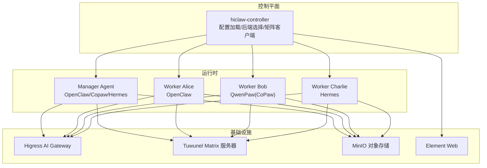
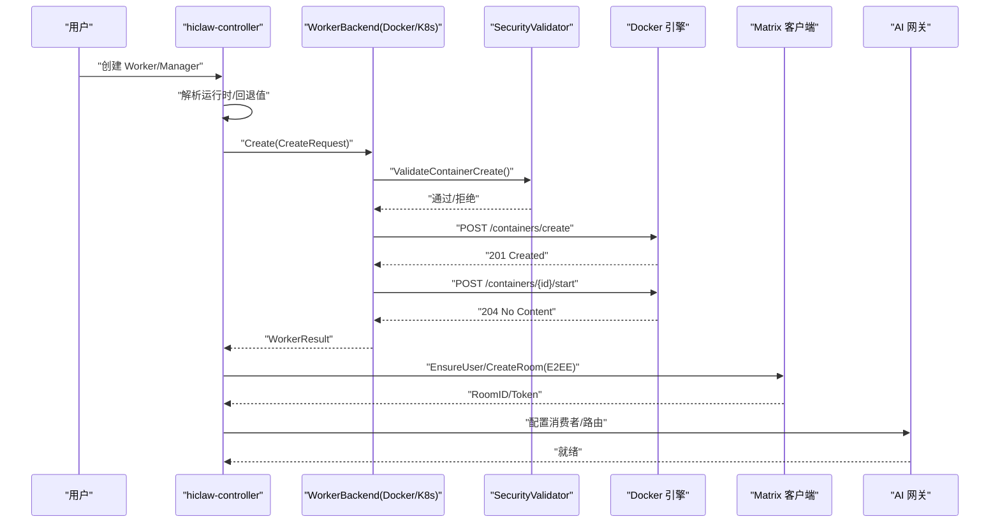
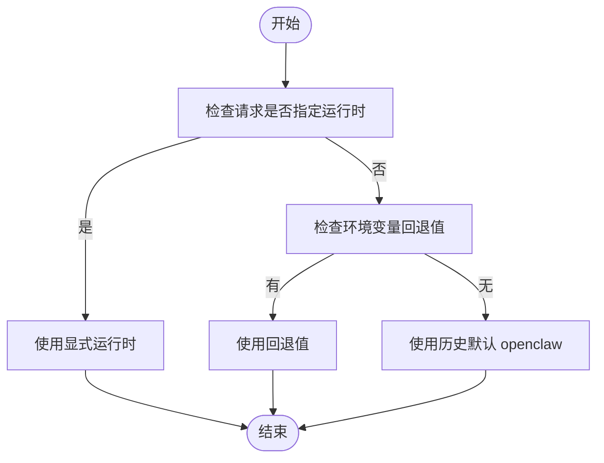
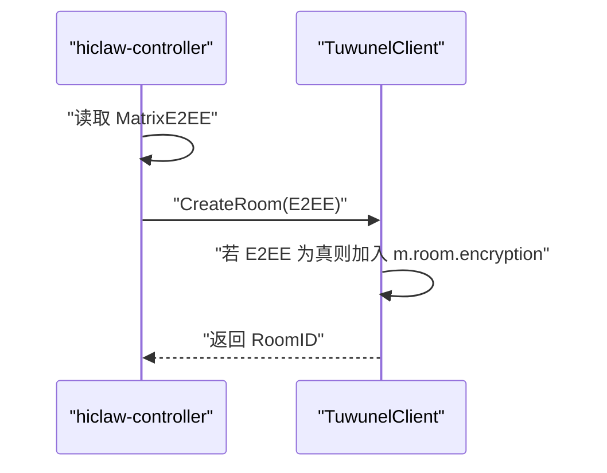
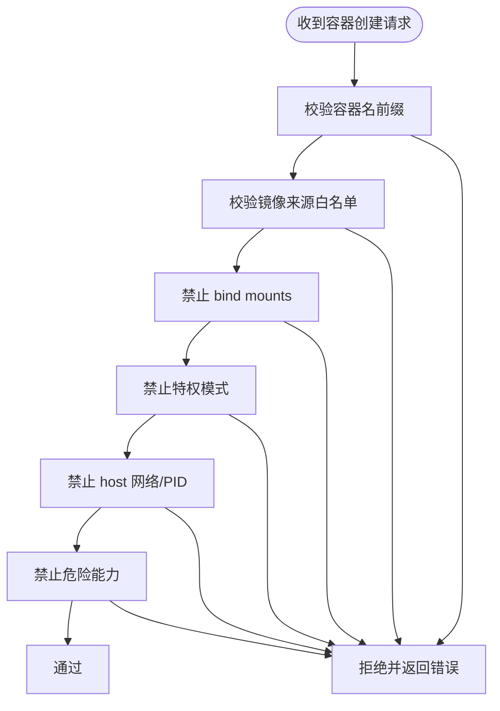
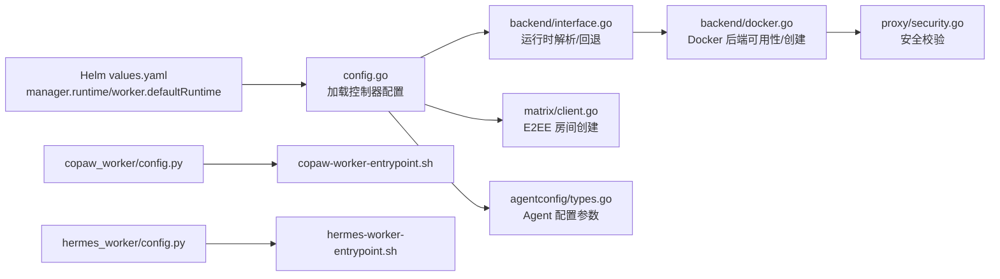

# 运行时与安全配置

<cite>
**本文引用的文件**
- [README.md](file://README.md)
- [values.yaml](file://helm/hiclaw/values.yaml)
- [config.go](file://hiclaw-controller/internal/config/config.go)
- [interface.go](file://hiclaw-controller/internal/backend/interface.go)
- [docker.go](file://hiclaw-controller/internal/backend/docker.go)
- [security.go](file://hiclaw-controller/internal/proxy/security.go)
- [client.go](file://hiclaw-controller/internal/matrix/client.go)
- [types.go](file://hiclaw-controller/internal/matrix/types.go)
- [types.go](file://hiclaw-controller/internal/agentconfig/types.go)
- [config.py](file://copaw/src/copaw_worker/config.py)
- [config.py](file://copaw/src/matrix/config.py)
- [README.md](file://copaw/src/matrix/README.md)
- [config.py](file://hermes/src/hermes_worker/config.py)
- [policies.py](file://hermes/src/hermes_matrix/policies.py)
- [copaw-worker-entrypoint.sh](file://copaw/scripts/copaw-worker-entrypoint.sh)
- [hermes-worker-entrypoint.sh](file://hermes/scripts/hermes-worker-entrypoint.sh)
</cite>

## 目录
1. [简介](#简介)
2. [项目结构](#项目结构)
3. [核心组件](#核心组件)
4. [架构总览](#架构总览)
5. [详细组件分析](#详细组件分析)
6. [依赖关系分析](#依赖关系分析)
7. [性能考量](#性能考量)
8. [故障排查指南](#故障排查指南)
9. [结论](#结论)
10. [附录](#附录)

## 简介
本文件聚焦 HiClaw 的运行时与安全配置，覆盖以下主题：
- 默认 Worker 运行时选择：OpenClaw、QwenPaw（CoPaw）、Hermes 的特点、适用场景与差异
- Manager 运行时配置：如何在 Helm 中选择 Manager 运行时与模型
- Matrix 端到端加密（E2EE）设置：启用方式、策略与兼容性
- Docker API 安全代理配置：镜像来源白名单、容器创建策略校验
- 容器运行时 Socket 检测：Docker 可用性检查与健康状态
- 镜像来源白名单：允许的镜像仓库与本地镜像策略
- 配置建议与故障排查方法：针对不同运行模式的最佳实践与常见问题定位

## 项目结构
HiClaw 采用 Manager-Workers 架构，控制器负责资源编排与生命周期管理，Worker 以容器形式运行，支持多种运行时并可共存于同一 Matrix 房间。

图表来源
- [config.go:19-188](file://hiclaw-controller/internal/config/config.go#L19-L188)
- [client.go:16-87](file://hiclaw-controller/internal/matrix/client.go#L16-L87)
- [values.yaml:193-211](file://helm/hiclaw/values.yaml#L193-L211)

章节来源
- [README.md:290-333](file://README.md#L290-L333)
- [values.yaml:193-211](file://helm/hiclaw/values.yaml#L193-L211)

## 核心组件
- 运行时选择与回退机制：后端通过解析请求中的显式运行时或环境变量回退值，最终统一到 OpenClaw、CoPaw 或 Hermes 之一。
- 管理员运行时配置：Helm values 中提供 manager.runtime 与 worker.defaultRuntime，分别用于 Manager 与 Worker 默认运行时。
- Matrix E2EE：通过配置项开启房间级端到端加密，并在创建房间时注入初始状态。
- Docker 安全代理：对容器创建请求进行镜像来源白名单、挂载限制、特权模式与危险能力等安全策略校验。
- Socket 检测：Docker 后端在可用性检查中验证 socket 文件存在与引擎 ping 成功。
- 镜像来源白名单：允许 Higress 注册表、本地镜像、localhost 前缀镜像以及自定义注册表前缀。

章节来源
- [interface.go:41-65](file://hiclaw-controller/internal/backend/interface.go#L41-L65)
- [values.yaml:197-200](file://helm/hiclaw/values.yaml#L197-L200)
- [config.go:116-123](file://hiclaw-controller/internal/config/config.go#L116-L123)
- [client.go:282-292](file://hiclaw-controller/internal/matrix/client.go#L282-L292)
- [security.go:107-159](file://hiclaw-controller/internal/proxy/security.go#L107-L159)
- [docker.go:67-85](file://hiclaw-controller/internal/backend/docker.go#L67-L85)

## 架构总览
下图展示运行时与安全配置在系统中的交互路径：控制器加载配置、选择后端、生成 Worker/Manager 配置、创建容器并应用安全策略，同时通过 Matrix 客户端启用 E2EE。

图表来源
- [docker.go:87-209](file://hiclaw-controller/internal/backend/docker.go#L87-L209)
- [security.go:107-159](file://hiclaw-controller/internal/proxy/security.go#L107-L159)
- [client.go:254-332](file://hiclaw-controller/internal/matrix/client.go#L254-L332)
- [config.go:565-583](file://hiclaw-controller/internal/config/config.go#L565-L583)

## 详细组件分析

### 默认 Worker 运行时选择
- 运行时枚举：openclaw、copaw、hermes
- 解析顺序：显式请求运行时 > 环境变量回退值 > 历史默认 openclaw
- Helm 默认：worker.defaultRuntime 与 manager.runtime 分别控制 Worker 与 Manager 的默认运行时

图表来源
- [interface.go:41-65](file://hiclaw-controller/internal/backend/interface.go#L41-L65)
- [values.yaml:244-255](file://helm/hiclaw/values.yaml#L244-L255)
- [values.yaml:197-200](file://helm/hiclaw/values.yaml#L197-L200)

章节来源
- [interface.go:28-65](file://hiclaw-controller/internal/backend/interface.go#L28-L65)
- [values.yaml:244-255](file://helm/hiclaw/values.yaml#L244-L255)
- [values.yaml:197-200](file://helm/hiclaw/values.yaml#L197-L200)

### Manager 运行时配置
- Helm values 提供 manager.runtime 与 manager.model，支持 openclaw、copaw、hermes
- 控制器根据该值生成 Manager 的配置与 Pod 规格
- 支持通过 HICLAW_MANAGER_RUNTIME 环境变量回退

章节来源
- [values.yaml:197-211](file://helm/hiclaw/values.yaml#L197-L211)
- [config.go:264-272](file://hiclaw-controller/internal/config/config.go#L264-L272)

### Matrix 端到端加密（E2EE）设置
- 控制器配置项 MatrixE2EE 决定是否在创建房间时注入 m.room.encryption 初始状态
- Matrix 客户端在创建房间时根据 E2EEEnabled 将算法写入 initial_state
- CoPaw 与 Hermes 的 Matrix 适配层均支持 E2EE 与历史缓冲等增强功能

图表来源
- [config.go:122-122](file://hiclaw-controller/internal/config/config.go#L122-L122)
- [client.go:282-292](file://hiclaw-controller/internal/matrix/client.go#L282-L292)
- [README.md:14-19](file://copaw/src/matrix/README.md#L14-L19)

章节来源
- [config.go:122-122](file://hiclaw-controller/internal/config/config.go#L122-L122)
- [client.go:282-292](file://hiclaw-controller/internal/matrix/client.go#L282-L292)
- [README.md:14-19](file://copaw/src/matrix/README.md#L14-L19)

### Docker API 安全代理配置
- 验证内容包括：容器名前缀、镜像来源白名单、禁止 bind mounts、禁止特权模式、禁止 host 网络/PID、禁止危险能力
- 允许的镜像来源：Higress 注册表、本地镜像（无点号前缀）、localhost/127.0.0.1 前缀、自定义注册表前缀
- 容器前缀：优先使用 HICLAW_PROXY_CONTAINER_PREFIX，否则基于 HICLAW_RESOURCE_PREFIX 推导

图表来源
- [security.go:107-159](file://hiclaw-controller/internal/proxy/security.go#L107-L159)
- [security.go:161-181](file://hiclaw-controller/internal/proxy/security.go#L161-L181)
- [security.go:66-105](file://hiclaw-controller/internal/proxy/security.go#L66-L105)

章节来源
- [security.go:107-159](file://hiclaw-controller/internal/proxy/security.go#L107-L159)
- [security.go:161-181](file://hiclaw-controller/internal/proxy/security.go#L161-L181)
- [security.go:66-105](file://hiclaw-controller/internal/proxy/security.go#L66-L105)

### 容器运行时 Socket 检测
- Docker 后端在 Available() 中检查 socket 文件是否存在并执行引擎 ping
- 若失败则判定后端不可用，避免后续创建操作

章节来源
- [docker.go:67-85](file://hiclaw-controller/internal/backend/docker.go#L67-L85)

### 镜像来源白名单
- Higress 注册表：匹配特定后缀与前缀
- 本地镜像：无点号前缀（如 hiclaw/worker-agent）
- localhost/127.0.0.1：允许 localhost 或 127.0.0.1 开头的镜像
- 自定义注册表：通过环境变量 HICLAW_PROXY_ALLOWED_REGISTRIES 指定多个前缀

章节来源
- [security.go:12-37](file://hiclaw-controller/internal/proxy/security.go#L12-L37)
- [security.go:68-78](file://hiclaw-controller/internal/proxy/security.go#L68-L78)

### 运行时特性与安全考虑

#### OpenClaw
- 特点：通用 Agent，工具生态丰富，适合任务编排与工具调用
- 安全：Worker 仅持有消费级令牌；真实密钥由网关管理
- 性能：适合复杂多步骤任务与跨工具协作

章节来源
- [README.md:294-296](file://README.md#L294-L296)

#### QwenPaw（CoPaw）
- 特点：轻量运行时，适合浏览器自动化与快速任务
- 安全：与 OpenClaw 相同的凭据隔离模型
- 性能：启动快、资源占用低

章节来源
- [README.md:294-296](file://README.md#L294-L296)

#### Hermes
- 特点：自主编码 Agent，带终端沙箱、自学习技能与持久记忆
- 安全：容器即边界；通过 YOLO 模式绕过危险命令确认，避免协作死锁
- 性能：适合需要持续执行与自我优化的代码任务

章节来源
- [README.md:294-296](file://README.md#L294-L296)
- [hermes-worker-entrypoint.sh:120-123](file://hermes/scripts/hermes-worker-entrypoint.sh#L120-L123)

### Worker 配置数据结构

#### CoPaw Worker 配置
- 关键字段：worker_name、minio_endpoint、minio_access_key、minio_secret_key、minio_bucket、minio_secure、sync_interval、install_dir、console_port
- 默认工作目录与安装目录布局遵循 CoPaw 约定

章节来源
- [config.py:7-29](file://copaw/src/copaw_worker/config.py#L7-L29)

#### Hermes Worker 配置
- 关键字段：worker_name、minio_endpoint、minio_access_key、minio_secret_key、minio_bucket、minio_secure、sync_interval、install_dir
- 工作空间与 Hermes Home 路径约定与 OpenClaw 对齐，便于统一管理

章节来源
- [config.py:7-40](file://hermes/src/hermes_worker/config.py#L7-L40)

### Matrix 策略与增强

#### CoPaw Overlay（增强）
- 支持 E2EE、历史缓冲、智能提及处理、Markdown 渲染、DM 检测、打字指示等
- 通过替换内置模块实现，Helm 构建阶段完成覆盖

章节来源
- [README.md:11-28](file://copaw/src/matrix/README.md#L11-L28)
- [README.md:53-78](file://copaw/src/matrix/README.md#L53-L78)

#### Hermes Matrix 策略
- 双策略允许列表（DM 与群组）
- 出站提及增强：从正文提取 MXID 并填充 m.mentions
- 历史缓冲：记录非提及消息上下文，提升对话连贯性

章节来源
- [policies.py:126-174](file://hermes/src/hermes_matrix/policies.py#L126-L174)
- [policies.py:182-223](file://hermes/src/hermes_matrix/policies.py#L182-L223)

### Worker 启动脚本与可观测性

#### CoPaw Worker 启动脚本
- 云模式：通过 RRSA/STS 获取 OSS 凭证，使用 MC_HOST_hiclaw
- 本地模式：直接使用传入的 FS 端点与密钥
- 技能目录与工作区符号链接对齐 OpenClaw 布局
- 可选开启 CMS 插件（LoongSuite），通过环境变量配置 OTel 导出

章节来源
- [copaw-worker-entrypoint.sh:36-50](file://copaw/scripts/copaw-worker-entrypoint.sh#L36-L50)
- [copaw-worker-entrypoint.sh:53-62](file://copaw/scripts/copaw-worker-entrypoint.sh#L53-L62)
- [copaw-worker-entrypoint.sh:102-123](file://copaw/scripts/copaw-worker-entrypoint.sh#L102-L123)

#### Hermes Worker 启动脚本
- 云模式：RRSA/STS 凭证注入，FS 端点占位
- 工作区与技能目录对齐 OpenClaw 布局
- YOLO 模式与禁用 Home Channel 提示，适配容器内自治运行
- 可选开启 CMS 插件（OTel 环境变量）

章节来源
- [hermes-worker-entrypoint.sh:42-55](file://hermes/scripts/hermes-worker-entrypoint.sh#L42-L55)
- [hermes-worker-entrypoint.sh:58-64](file://hermes/scripts/hermes-worker-entrypoint.sh#L58-L64)
- [hermes-worker-entrypoint.sh:120-123](file://hermes/scripts/hermes-worker-entrypoint.sh#L120-L123)
- [hermes-worker-entrypoint.sh:132-143](file://hermes/scripts/hermes-worker-entrypoint.sh#L132-L143)

## 依赖关系分析

图表来源
- [values.yaml:197-200](file://helm/hiclaw/values.yaml#L197-L200)
- [values.yaml:244-255](file://helm/hiclaw/values.yaml#L244-L255)
- [config.go:207-356](file://hiclaw-controller/internal/config/config.go#L207-L356)
- [interface.go:41-65](file://hiclaw-controller/internal/backend/interface.go#L41-L65)
- [docker.go:67-85](file://hiclaw-controller/internal/backend/docker.go#L67-L85)
- [security.go:107-159](file://hiclaw-controller/internal/proxy/security.go#L107-L159)
- [client.go:282-292](file://hiclaw-controller/internal/matrix/client.go#L282-L292)
- [types.go:4-28](file://hiclaw-controller/internal/agentconfig/types.go#L4-L28)
- [config.py:7-29](file://copaw/src/copaw_worker/config.py#L7-L29)
- [config.py:7-40](file://hermes/src/hermes_worker/config.py#L7-L40)
- [copaw-worker-entrypoint.sh:1-144](file://copaw/scripts/copaw-worker-entrypoint.sh#L1-L144)
- [hermes-worker-entrypoint.sh:1-157](file://hermes/scripts/hermes-worker-entrypoint.sh#L1-L157)

章节来源
- [values.yaml:197-200](file://helm/hiclaw/values.yaml#L197-L200)
- [values.yaml:244-255](file://helm/hiclaw/values.yaml#L244-L255)
- [config.go:207-356](file://hiclaw-controller/internal/config/config.go#L207-L356)
- [interface.go:41-65](file://hiclaw-controller/internal/backend/interface.go#L41-L65)
- [docker.go:67-85](file://hiclaw-controller/internal/backend/docker.go#L67-L85)
- [security.go:107-159](file://hiclaw-controller/internal/proxy/security.go#L107-L159)
- [client.go:282-292](file://hiclaw-controller/internal/matrix/client.go#L282-L292)
- [types.go:4-28](file://hiclaw-controller/internal/agentconfig/types.go#L4-L28)
- [config.py:7-29](file://copaw/src/copaw_worker/config.py#L7-L29)
- [config.py:7-40](file://hermes/src/hermes_worker/config.py#L7-L40)
- [copaw-worker-entrypoint.sh:1-144](file://copaw/scripts/copaw-worker-entrypoint.sh#L1-L144)
- [hermes-worker-entrypoint.sh:1-157](file://hermes/scripts/hermes-worker-entrypoint.sh#L1-L157)

## 性能考量
- 运行时选择：OpenClaw 适合复杂编排；CoPaw 适合轻量任务；Hermes 适合需要持续执行的代码任务
- 资源规格：Helm values 中为 Manager 与 Worker 提供默认 CPU/内存请求与限制，可根据负载调整
- 网络与存储：MinIO 使用对象存储，减少 Token 消耗；Docker 网络默认隔离，避免主机网络暴露
- 日志与可观测性：可通过环境变量启用 CMS 插件，导出 OTel 指标与追踪，辅助性能分析

章节来源
- [values.yaml:204-210](file://helm/hiclaw/values.yaml#L204-L210)
- [values.yaml:256-262](file://helm/hiclaw/values.yaml#L256-L262)
- [copaw-worker-entrypoint.sh:102-123](file://copaw/scripts/copaw-worker-entrypoint.sh#L102-L123)
- [hermes-worker-entrypoint.sh:132-143](file://hermes/scripts/hermes-worker-entrypoint.sh#L132-L143)

## 故障排查指南
- Docker 可用性检查失败
  - 症状：后端不可用，无法创建容器
  - 排查：确认 socket 文件存在且 Docker 引擎响应正常
  - 参考：[docker.go:67-85](file://hiclaw-controller/internal/backend/docker.go#L67-L85)

- 容器创建被拒绝
  - 症状：返回“镜像未被允许”、“禁止 bind mounts”、“禁止特权模式”等错误
  - 排查：核对镜像来源白名单、移除 bind mounts、关闭特权模式、避免危险能力
  - 参考：[security.go:107-159](file://hiclaw-controller/internal/proxy/security.go#L107-L159)

- Matrix E2EE 未生效
  - 症状：房间未启用端到端加密
  - 排查：确认 MatrixE2EE 已开启，创建房间时已注入 m.room.encryption
  - 参考：[config.go:122-122](file://hiclaw-controller/internal/config/config.go#L122-L122)、[client.go:282-292](file://hiclaw-controller/internal/matrix/client.go#L282-L292)

- Worker 启动后未就绪
  - 症状：控制器未收到就绪信号
  - 排查：检查 Worker 启动脚本中的就绪上报逻辑与配置文件生成情况
  - 参考：[copaw-worker-entrypoint.sh:64-88](file://copaw/scripts/copaw-worker-entrypoint.sh#L64-L88)、[hermes-worker-entrypoint.sh:66-89](file://hermes/scripts/hermes-worker-entrypoint.sh#L66-L89)

- CoPaw/Heremes Matrix 功能异常
  - 症状：提及处理、历史缓冲、E2EE 不按预期
  - 排查：确认 overlay 模块已正确替换，策略配置（如 allow_from/group_allow_from）正确
  - 参考：[README.md:11-28](file://copaw/src/matrix/README.md#L11-L28)、[policies.py:126-174](file://hermes/src/hermes_matrix/policies.py#L126-L174)

章节来源
- [docker.go:67-85](file://hiclaw-controller/internal/backend/docker.go#L67-L85)
- [security.go:107-159](file://hiclaw-controller/internal/proxy/security.go#L107-L159)
- [config.go:122-122](file://hiclaw-controller/internal/config/config.go#L122-L122)
- [client.go:282-292](file://hiclaw-controller/internal/matrix/client.go#L282-L292)
- [copaw-worker-entrypoint.sh:64-88](file://copaw/scripts/copaw-worker-entrypoint.sh#L64-L88)
- [hermes-worker-entrypoint.sh:66-89](file://hermes/scripts/hermes-worker-entrypoint.sh#L66-L89)
- [README.md:11-28](file://copaw/src/matrix/README.md#L11-L28)
- [policies.py:126-174](file://hermes/src/hermes_matrix/policies.py#L126-L174)

## 结论
HiClaw 在运行时与安全方面提供了灵活而稳健的配置体系：
- 多运行时共存：OpenClaw、CoPaw、Hermes 各司其职，协同完成复杂任务
- 安全优先：凭据隔离、容器安全策略、E2EE、最小权限原则贯穿始终
- 可观测性：通过 CMS 插件与日志级别控制，便于性能与行为分析
- 易于部署：Helm values 提供清晰的默认值与可覆盖项，满足本地与生产环境需求

## 附录
- 配置建议
  - 生产环境：启用 E2EE、严格镜像白名单、避免特权模式与 host 网络
  - 调试环境：开启 Matrix 调试日志与 CMS 插件，便于问题定位
  - 资源规划：根据任务类型选择合适的 Manager/Worker 资源规格
- 常见问题
  - 运行时切换：通过 hiclaw CLI 或 Helm values 更新 runtime
  - 镜像拉取：确保镜像来源在白名单内，或使用 Higress 注册表
  - 网络访问：通过 Element Web 或任意 Matrix 客户端接入