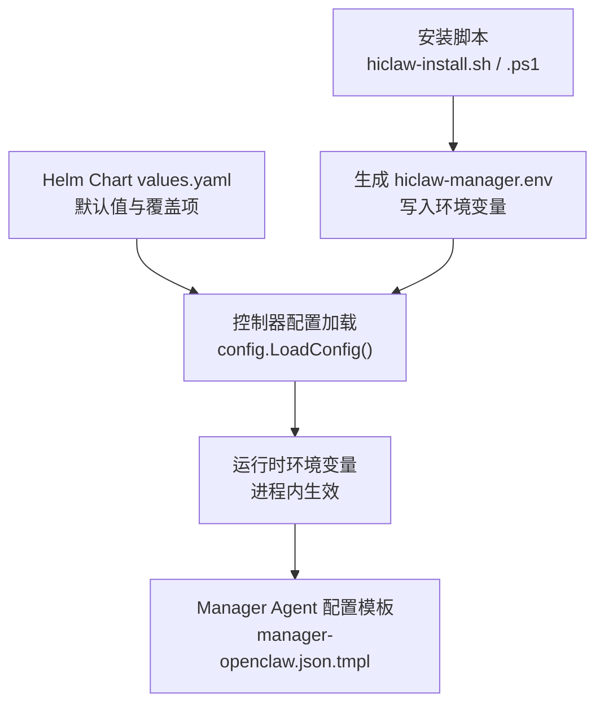
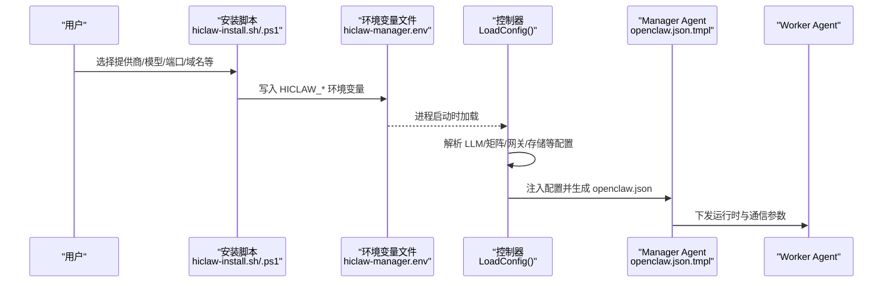
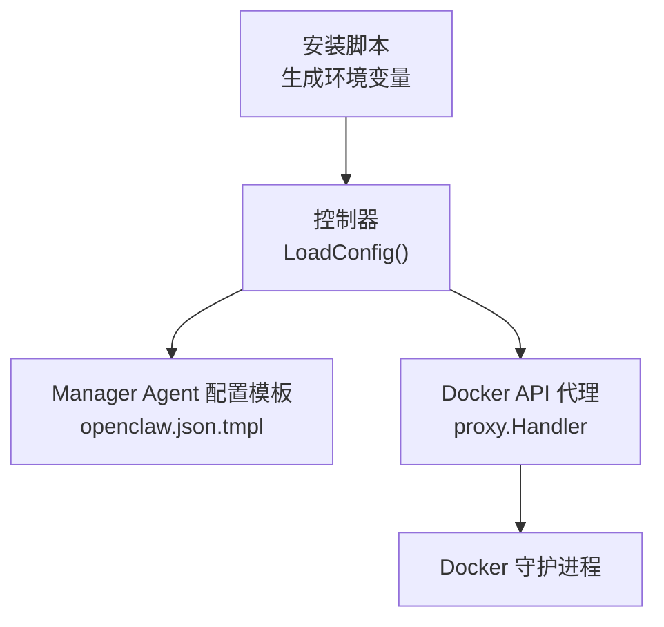

# 配置选项详解

<cite>
**本文档引用的文件**
- [values.yaml](file://helm/hiclaw/values.yaml)
- [config.go](file://hiclaw-controller/internal/config/config.go)
- [types.go](file://hiclaw-controller/internal/agentconfig/types.go)
- [manager-openclaw.json.tmpl](file://manager/configs/manager-openclaw.json.tmpl)
- [hiclaw-install.sh](file://install/hiclaw-install.sh)
- [hiclaw-install.ps1](file://install/hiclaw-install.ps1)
- [proxy.go](file://hiclaw-controller/internal/proxy/proxy.go)
- [lifecycle-worker.sh](file://manager/agent/skills/worker-management/scripts/lifecycle-worker.sh)
- [lifecycle.md](file://manager/agent/skills/worker-management/references/lifecycle.md)
- [start-manager-agent.sh](file://manager/scripts/init/start-manager-agent.sh)
- [setup-host-symlinks.sh](file://manager/scripts/setup-host-symlinks.sh)
</cite>

## 目录
1. [简介](#简介)
2. [项目结构](#项目结构)
3. [核心组件](#核心组件)
4. [架构总览](#架构总览)
5. [详细组件分析](#详细组件分析)
6. [依赖分析](#依赖分析)
7. [性能考虑](#性能考虑)
8. [故障排除指南](#故障排除指南)
9. [结论](#结论)

## 简介
本文件面向 HiClaw 本地安装场景，系统性梳理所有可配置项，覆盖 LLM 提供商配置（阿里云百炼、通义 Token 套餐、OpenAI 兼容 API）、管理员凭据、端口配置（网关、Higress 控制台、Element Web、Manager 控制台）、域名配置、GitHub 集成、Skills 注册中心、数据持久化、Manager 工作空间、主机目录共享、默认 Worker 运行时选择、Matrix E2EE 设置、Docker API 代理配置、Worker 空闲超时等。每个配置项均给出作用说明、默认值、可选值范围与配置建议，并提供可视化图示帮助理解。

## 项目结构
HiClaw 的配置体系由三层构成：
- Helm Chart values：用于 Kubernetes 部署的默认值与覆盖项
- 控制器配置（环境变量）：运行时注入的控制器参数
- 安装脚本交互式配置：本地安装时的用户交互与环境变量生成

**图表来源**
- [values.yaml:1-263](file://helm/hiclaw/values.yaml#L1-L263)
- [config.go:207-356](file://hiclaw-controller/internal/config/config.go#L207-L356)
- [manager-openclaw.json.tmpl:1-145](file://manager/configs/manager-openclaw.json.tmpl#L1-L145)

**章节来源**
- [values.yaml:1-263](file://helm/hiclaw/values.yaml#L1-L263)
- [config.go:207-356](file://hiclaw-controller/internal/config/config.go#L207-L356)
- [manager-openclaw.json.tmpl:1-145](file://manager/configs/manager-openclaw.json.tmpl#L1-L145)

## 核心组件
- LLM 提供商与模型配置：支持阿里云百炼、通义 Token 套餐、OpenAI 兼容 API，包含默认模型、上下文窗口、最大输出等参数
- 管理员凭据：Matrix 管理员用户名/密码、注册令牌、Element Web URL
- 网关与控制台：Higress 网关与控制台端口映射、本地绑定策略
- 存储：MinIO 对象存储（本地部署）或 OSS 外部存储
- Matrix 服务：Tuwunel 或 Synapse，支持 E2EE
- Manager 与 Worker：运行时选择（openclaw/copaw/hermes）、资源限制、生命周期管理
- Docker API 代理：安全代理层，限制容器操作范围
- Worker 空闲超时：基于状态文件的自动停止/启动机制

**章节来源**
- [config.go:19-162](file://hiclaw-controller/internal/config/config.go#L19-L162)
- [hiclaw-install.sh:14-48](file://install/hiclaw-install.sh#L14-L48)
- [hiclaw-install.ps1:14-36](file://install/hiclaw-install.ps1#L14-L36)

## 架构总览
下图展示本地安装的关键配置流：安装脚本收集用户输入并生成环境变量，控制器加载这些变量，最终驱动 Manager Agent 与 Worker 的运行。

**图表来源**
- [hiclaw-install.sh:980-1013](file://install/hiclaw-install.sh#L980-L1013)
- [hiclaw-install.ps1:980-1013](file://install/hiclaw-install.ps1#L980-L1013)
- [config.go:207-356](file://hiclaw-controller/internal/config/config.go#L207-L356)
- [manager-openclaw.json.tmpl:1-145](file://manager/configs/manager-openclaw.json.tmpl#L1-L145)

## 详细组件分析

### LLM 提供商与模型配置
- 配置键：HICLAW_LLM_PROVIDER、HICLAW_DEFAULT_MODEL、HICLAW_LLM_API_KEY、HICLAW_OPENAI_BASE_URL、HICLAW_MODEL_CONTEXT_WINDOW、HICLAW_MODEL_MAX_TOKENS、HICLAW_MODEL_REASONING、HICLAW_MODEL_VISION
- 作用说明：选择 LLM 提供商（qwen、openai-compat 等），设置默认模型与 API Key；当使用 OpenAI 兼容 API 时，需提供 Base URL；可选自定义模型参数（上下文窗口、最大输出、推理/视觉支持）
- 默认值：非交互模式下，中文环境默认 openai-compat（通义 Token 套餐），英文环境默认 qwen；默认模型通常为 qwen3.6-plus 或 gpt-5.4
- 可选值范围：提供商包括 qwen（阿里云百炼）、openai-compat（自定义 Base URL）；模型 ID 视提供商而定
- 配置建议：若使用通义 Token 套餐，保持 openai-compat 并设置正确的 Base URL；若使用国际站 Qwen Cloud，设置 DASHSCOPE_API_KEY；自定义模型需同时设置上下文窗口与最大输出

**章节来源**
- [hiclaw-install.sh:14-48](file://install/hiclaw-install.sh#L14-L48)
- [hiclaw-install.ps1:14-36](file://install/hiclaw-install.ps1#L14-L36)
- [config.go:298-301](file://hiclaw-controller/internal/config/config.go#L298-L301)
- [manager-openclaw.json.tmpl:46-72](file://manager/configs/manager-openclaw.json.tmpl#L46-L72)

### 管理员凭据
- 配置键：HICLAW_ADMIN_USER、HICLAW_ADMIN_PASSWORD、HICLAW_REGISTRATION_TOKEN、HICLAW_ELEMENT_WEB_URL
- 作用说明：Matrix 管理员账户、注册令牌、Element Web 访问地址
- 默认值：管理员用户名默认 admin；密码自动生成（最小 8 位）；注册令牌自动生成
- 可选值范围：用户名任意字符串；密码至少 8 位；令牌任意字符串
- 配置建议：生产环境务必设置强密码；注册令牌用于 Matrix 服务初始化

**章节来源**
- [hiclaw-install.sh:20-22](file://install/hiclaw-install.sh#L20-L22)
- [hiclaw-install.ps1:20-22](file://install/hiclaw-install.ps1#L20-L22)
- [config.go:283-301](file://hiclaw-controller/internal/config/config.go#L283-L301)

### 端口配置
- 网关端口：HICLAW_PORT_GATEWAY（默认 18080），对应容器内 8080
- Higress 控制台端口：HICLAW_PORT_CONSOLE（默认 18001），对应容器内 8001
- Element Web 端口：HICLAW_PORT_ELEMENT_WEB（默认 18088），对应容器内 8088
- Manager 控制台端口：HICLAW_PORT_MANAGER_CONSOLE（默认 18888），对应容器内 18888
- 本地绑定：HICLAW_LOCAL_ONLY（默认 0，即绑定到 0.0.0.0），可选 1 绑定到 127.0.0.1
- 配置建议：仅本机使用时开启本地绑定；公网暴露需配合 TLS 证书与防火墙策略

**章节来源**
- [hiclaw-install.sh:44-48](file://install/hiclaw-install.sh#L44-L48)
- [hiclaw-install.ps1:33-36](file://install/hiclaw-install.ps1#L33-L36)
- [config.go:224-225](file://hiclaw-controller/internal/config/config.go#L224-L225)

### 域名配置
- Matrix 域名：HICLAW_MATRIX_DOMAIN（默认 matrix-local.hiclaw.io:8080）
- Element Web 域名：HICLAW_ELEMENT_WEB_URL（来自安装脚本环境变量）
- AI 网关域名：HICLAW_AI_GATEWAY_DOMAIN（默认 aigw-local.hiclaw.io）
- 文件系统域名：HICLAW_FS_DOMAIN（默认 fs-local.hiclaw.io）
- Manager 控制台域名：HICLAW_CONSOLE_DOMAIN（默认 console-local.hiclaw.io）
- 配置建议：单机 ECS 部署时无需修改 aigw、fs 等域名；Element Web 与 Matrix Server 可通过 IP 直接访问

**章节来源**
- [hiclaw-install.sh:492-505](file://install/hiclaw-install.sh#L492-L505)
- [hiclaw-install.ps1:2419-2424](file://install/hiclaw-install.ps1#L2419-L2424)
- [start-manager-agent.sh:99-104](file://manager/scripts/init/start-manager-agent.sh#L99-L104)

### GitHub 集成
- 配置键：HICLAW_GITHUB_TOKEN（可选）
- 作用说明：GitHub 个人访问令牌，用于技能市场与协作功能
- 默认值：可为空（禁用 GitHub 集成）
- 配置建议：如需使用 GitHub 相关能力，建议配置只读令牌

**章节来源**
- [hiclaw-install.sh:507-511](file://install/hiclaw-install.sh#L507-L511)
- [hiclaw-install.ps1:369-372](file://install/hiclaw-install.ps1#L369-L372)

### Skills 注册中心
- 配置键：HICLAW_SKILLS_REGISTRY_URL（可选，默认 nacos://market.hiclaw.io:80/public）
- 作用说明：Skills 注册中心 URL，用于 Worker 技能发现与导入
- 默认值：默认注册中心地址
- 配置建议：企业内网可替换为内部注册中心地址

**章节来源**
- [hiclaw-install.sh:511-516](file://install/hiclaw-install.sh#L511-L516)
- [hiclaw-install.ps1:373-376](file://install/hiclaw-install.ps1#L373-L376)

### 数据持久化
- Docker 卷名称：HICLAW_DATA_DIR（默认 hiclaw-data）
- 作用说明：Manager 与 Worker 的持久化数据存储
- 默认值：hiclaw-data
- 配置建议：生产环境建议使用独立存储与快照策略

**章节来源**
- [hiclaw-install.sh:24-25](file://install/hiclaw-install.sh#L24-L25)
- [hiclaw-install.ps1:25-26](file://install/hiclaw-install.ps1#L25-L26)

### Manager 工作空间
- 配置键：HICLAW_WORKSPACE_DIR（默认 ~/hiclaw-manager）
- 作用说明：Manager 工作空间目录，容器内挂载为 /root/manager-workspace
- 默认值：~/hiclaw-manager
- 配置建议：建议使用绝对路径，便于跨会话一致性

**章节来源**
- [hiclaw-install.sh:25-26](file://install/hiclaw-install.sh#L25-L26)
- [hiclaw-install.ps1:26-27](file://install/hiclaw-install.ps1#L26-L27)

### 主机目录共享
- 配置键：HICLAW_HOST_SHARE_DIR（默认 $HOME）
- 作用说明：与 Agent 共享的主机目录，容器内挂载为 /host-share；安装时会创建从原始主机路径到 /host-share 的符号链接
- 默认值：$HOME
- 配置建议：启用后可实现路径一致性，便于文件读写；注意权限与路径有效性

**章节来源**
- [hiclaw-install.sh:530-537](file://install/hiclaw-install.sh#L530-L537)
- [hiclaw-install.ps1:387-391](file://install/hiclaw-install.ps1#L387-L391)
- [setup-host-symlinks.sh:1-22](file://manager/scripts/setup-host-symlinks.sh#L1-L22)
- [start-manager-agent.sh:85-97](file://manager/scripts/init/start-manager-agent.sh#L85-L97)

### 默认 Worker 运行时
- 配置键：HICLAW_DEFAULT_WORKER_RUNTIME（默认 openclaw）
- 可选值：openclaw、copaw、hermes
- 作用说明：Worker 默认运行时类型，影响 Worker 镜像与工具链
- 默认值：openclaw
- 配置建议：根据团队技术栈选择；OpenClaw 适合通用场景，QwenPaw/Hermes 适合特定生态

**章节来源**
- [hiclaw-install.sh:537-551](file://install/hiclaw-install.sh#L537-L551)
- [hiclaw-install.ps1:392-408](file://install/hiclaw-install.ps1#L392-L408)
- [config.go:90-96](file://hiclaw-controller/internal/config/config.go#L90-L96)

### Manager 运行时
- 配置键：HICLAW_MANAGER_RUNTIME（默认 openclaw）
- 可选值：openclaw、copaw、hermes
- 作用说明：Manager 自身运行时类型
- 默认值：openclaw
- 配置建议：与默认 Worker 运行时保持一致可简化运维

**章节来源**
- [hiclaw-install.sh:552-563](file://install/hiclaw-install.sh#L552-L563)
- [hiclaw-install.ps1:401-423](file://install/hiclaw-install.ps1#L401-L423)
- [config.go:81-89](file://hiclaw-controller/internal/config/config.go#L81-L89)

### Matrix E2EE 设置
- 配置键：HICLAW_MATRIX_E2EE（默认 0，禁用）
- 作用说明：启用后对 Manager 与 Worker 之间的 Matrix 消息进行端到端加密
- 默认值：0（禁用）
- 配置建议：若不确定 Agent 支持情况，建议保持禁用；禁用时不要在 Element 上创建默认加密的 Private 房间

**章节来源**
- [hiclaw-install.sh:585-601](file://install/hiclaw-install.sh#L585-L601)
- [hiclaw-install.ps1:409-423](file://install/hiclaw-install.ps1#L409-L423)
- [config.go:288-289](file://hiclaw-controller/internal/config/config.go#L288-L289)

### Docker API 代理配置
- 配置键：HICLAW_DOCKER_PROXY（默认 1，启用）
- 可选值：1（启用）、0（禁用）
- 作用说明：启用代理可防止 AI Agent 通过 Docker API 越狱访问宿主机；禁用时直接挂载 Docker socket
- 默认值：1（启用）
- 配置建议：生产环境强烈建议启用；可配置 HICLAW_PROXY_ALLOWED_REGISTRIES 放行特定镜像仓库

**章节来源**
- [hiclaw-install.sh:606-633](file://install/hiclaw-install.sh#L606-L633)
- [hiclaw-install.ps1:424-443](file://install/hiclaw-install.ps1#L424-L443)
- [proxy.go:16-24](file://hiclaw-controller/internal/proxy/proxy.go#L16-L24)

### Worker 空闲超时
- 配置键：HICLAW_WORKER_IDLE_TIMEOUT（默认 720 分钟，即 12 小时）
- 作用说明：Worker 空闲自动停止超时；Manager 通过 ~/worker-lifecycle.json 管理状态
- 默认值：720
- 配置建议：根据任务频率调整；可通过修改 JSON 文件动态调整

**章节来源**
- [hiclaw-install.sh:633-640](file://install/hiclaw-install.sh#L633-L640)
- [hiclaw-install.ps1:439-443](file://install/hiclaw-install.ps1#L439-L443)
- [lifecycle-worker.sh:26-30](file://manager/agent/skills/worker-management/scripts/lifecycle-worker.sh#L26-L30)
- [lifecycle.md:35-40](file://manager/agent/skills/worker-management/references/lifecycle.md#L35-L40)

### 控制器与服务配置（环境变量）
- 控制器核心：HICLAW_KUBE_MODE、HICLAW_HTTP_ADDR、HICLAW_DATA_DIR、HICLAW_CONFIG_DIR、HICLAW_CRD_DIR、HICLAW_SKILLS_DIR
- 资源前缀：HICLAW_RESOURCE_PREFIX（默认 hiclaw-）
- 网关与存储：HICLAW_GATEWAY_PROVIDER（默认 higress）、HICLAW_STORAGE_PROVIDER（默认 minio）
- 区域：HICLAW_REGION（默认 cn-hangzhou）
- OSS/MinIO：HICLAW_FS_BUCKET、HICLAW_FS_ENDPOINT、HICLAW_MINIO_USER、HICLAW_MINIO_PASSWORD
- Matrix：HICLAW_MATRIX_URL、HICLAW_MATRIX_DOMAIN、HICLAW_MATRIX_REGISTRATION_TOKEN、HICLAW_ADMIN_USER、HICLAW_ADMIN_PASSWORD、HICLAW_MATRIX_E2EE
- LLM：HICLAW_LLM_PROVIDER、HICLAW_LLM_API_KEY、HICLAW_OPENAI_BASE_URL、HICLAW_DEFAULT_MODEL、HICLAW_EMBEDDING_MODEL
- Element Web：HICLAW_ELEMENT_WEB_URL
- 语言与时区：HICLAW_LANGUAGE、TZ
- CMS：HICLAW_CMS_TRACES_ENABLED、HICLAW_CMS_METRICS_ENABLED、HICLAW_CMS_ENDPOINT、HICLAW_CMS_LICENSE_KEY、HICLAW_CMS_PROJECT、HICLAW_CMS_WORKSPACE、HICLAW_CMS_SERVICE_NAME
- Worker 环境默认值：HICLAW_MATRIX_DOMAIN、HICLAW_FS_ENDPOINT、HICLAW_FS_BUCKET、HICLAW_STORAGE_PREFIX、HICLAW_CONTROLLER_URL、HICLAW_AI_GATEWAY_URL、HICLAW_MATRIX_URL、HICLAW_ADMIN_USER、HICLAW_YOLO、HICLAW_MATRIX_DEBUG

**章节来源**
- [config.go:19-188](file://hiclaw-controller/internal/config/config.go#L19-L188)

### Helm Chart 默认值（values.yaml）
- 全局与凭证：namespace、imageRegistry、imageTag、registrationToken、adminUser、adminPassword、llmApiKey、llmProvider、defaultModel、llmBaseUrl
- Matrix：provider（tuwunel/synapse）、mode（managed/existing）、internalURL、serverName、tuwunel 镜像与资源、持久化、extraEnv
- 网关：provider（higress/ai-gateway）、mode（managed/existing）、publicURL、higress.enabled、ai-gateway.region、gatewayId、modelApiId、envId
- 存储：provider（minio/oss）、mode（managed/existing）、bucket、oss.endpoint、minio 镜像与资源、持久化、auth.rootUser、auth.rootPassword
- Higress 子图表：global.local（默认 true）、gateway 与 controller replicas、service 类型与端口
- 凭证提供者：enabled、image.repository/tag/pullPolicy、port、resources、env/envFrom
- 控制器：replicaCount、image.repository/tag/pullPolicy、service.type/port/targetPort、resources、workerBackend、resourcePrefix、serviceAccount、env、timezone
- Manager：enabled、model、runtime、image.repository/tag、resources
- Element Web：enabled、image.repository/tag/pullPolicy、replicaCount、resources、service.type/port
- CMS：enabled、endpoint、licenseKey、project、workspace、serviceName、metricsEnabled
- Worker 默认值：defaultImage.openclaw/copaw/hermes、defaultRuntime、resources

**章节来源**
- [values.yaml:8-263](file://helm/hiclaw/values.yaml#L8-L263)

### Manager Agent 配置模板（openclaw.json.tmpl）
- 网关：mode（local）、port（18799）、bind（lan）、auth.token（来自 MANAGER_GATEWAY_KEY）、remote.token、controlUi.allowInsecureAuth、allowedOrigins
- Matrix：enabled、homeserver、userId（@manager:domain）、accessToken（来自 MANAGER_MATRIX_TOKEN）、encryption（来自 MATRIX_E2EE_ENABLED）、network.dangerouslyAllowPrivateNetwork、autoJoin、dm.policy/groupPolicy、groups.*、streaming/blockStreaming
- 模型：mode（merge）、providers.hiclaw-gateway.baseUrl（来自 HICLAW_AI_GATEWAY_URL/v1）、apiKey（来自 MANAGER_GATEWAY_KEY）、api（openai-completions）、models（内置多模型）
- 代理：defaults.timeoutSeconds（1800）、workspace（~）、model.primary（hiclaw-gateway/defaultModel）、models.*、maxConcurrent、subagents.maxConcurrent、elevatedDefault、heartbeat（每小时）
- 工具：exec.host（gateway）、security（full）、ask（off）、elevated.enabled、allowFrom.matrix
- 会话：dmScope、resetByType（每日 4 点重置）
- 插件：load.paths（/opt/openclaw/extensions/matrix）、entries.matrix.enabled
- 命令：restart（true）

**章节来源**
- [manager-openclaw.json.tmpl:1-145](file://manager/configs/manager-openclaw.json.tmpl#L1-L145)

## 依赖分析
- 安装脚本与控制器配置的耦合：安装脚本生成的环境变量由控制器加载，决定 Manager Agent 与 Worker 的行为
- Manager Agent 模板与控制器配置的耦合：模板中的 URL、令牌、模型等字段由控制器注入的环境变量驱动
- Docker API 代理与控制器的关系：代理启用时，Manager 通过控制器转发 Docker API 请求，否则直接挂载 socket

**图表来源**
- [hiclaw-install.sh:980-1013](file://install/hiclaw-install.sh#L980-L1013)
- [hiclaw-install.ps1:980-1013](file://install/hiclaw-install.ps1#L980-L1013)
- [config.go:207-356](file://hiclaw-controller/internal/config/config.go#L207-L356)
- [proxy.go:26-52](file://hiclaw-controller/internal/proxy/proxy.go#L26-L52)

**章节来源**
- [config.go:207-356](file://hiclaw-controller/internal/config/config.go#L207-L356)
- [proxy.go:16-52](file://hiclaw-controller/internal/proxy/proxy.go#L16-L52)

## 性能考虑
- Worker 空闲超时：合理设置可节省资源；过短会影响交互体验
- Docker API 代理：启用后增加一层转发开销，但显著提升安全性
- 模型参数：上下文窗口与最大输出过大可能影响响应时间，需结合业务场景权衡
- 端口与本地绑定：仅本机访问可减少网络暴露面，但限制了远程访问

## 故障排除指南
- LLM API 连通性测试失败：检查 API Key、Base URL、网络连通性；参考安装脚本提示信息
- Element Web 无法访问：确认端口映射与本地绑定设置；检查浏览器访问地址
- Docker API 代理问题：确认代理容器运行状态与允许的镜像仓库白名单
- Worker 自动停止频繁：检查空闲超时设置与任务分配频率
- Matrix E2EE 导致消息不可读：确认 Element 房间加密设置与 Agent 支持情况

**章节来源**
- [hiclaw-install.sh:673-690](file://install/hiclaw-install.sh#L673-L690)
- [hiclaw-install.ps1:483-514](file://install/hiclaw-install.ps1#L483-L514)
- [lifecycle-worker.sh:297-301](file://manager/agent/skills/worker-management/scripts/lifecycle-worker.sh#L297-L301)

## 结论
本文档系统梳理了 HiClaw 本地安装的所有配置选项，从安装脚本到控制器配置再到模板渲染，形成完整的配置闭环。建议在生产环境中优先启用 Docker API 代理与本地绑定，合理设置 Worker 空闲超时与模型参数，并根据团队技术栈选择合适的 Manager/Worker 运行时。