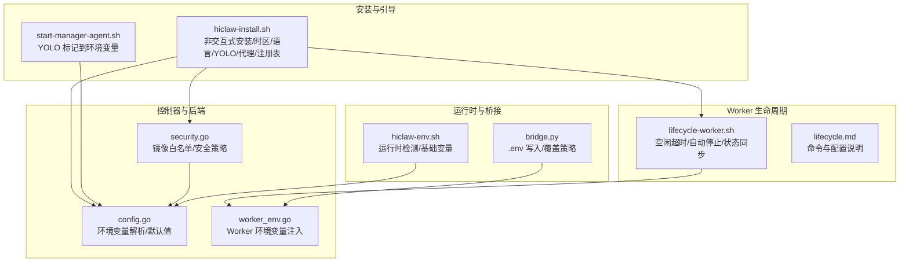
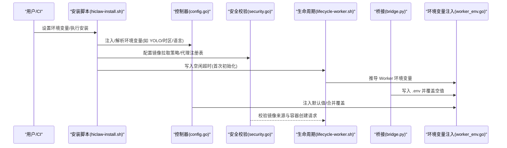
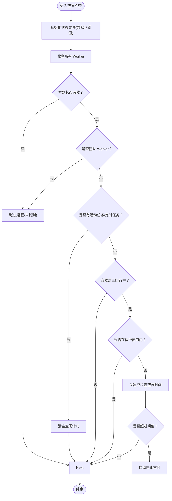
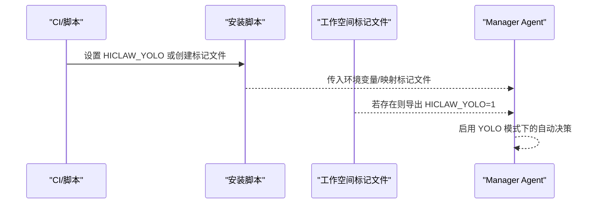
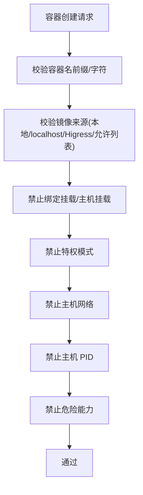
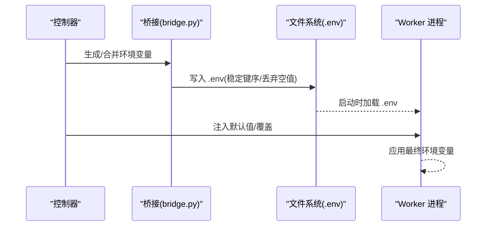
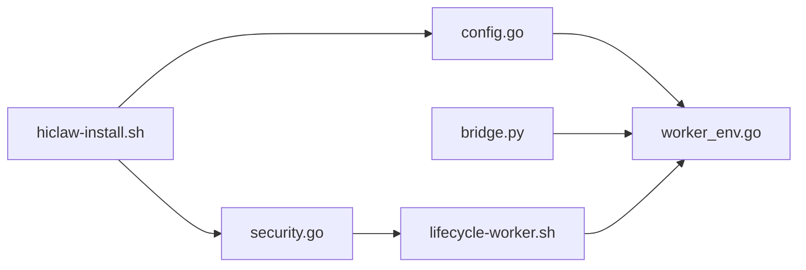

# 高级设置

<cite>
**本文引用的文件**
- [hiclaw-install.sh](file://install/hiclaw-install.sh)
- [lifecycle-worker.sh](file://manager/agent/skills/worker-management/scripts/lifecycle-worker.sh)
- [lifecycle.md](file://manager/agent/skills/worker-management/references/lifecycle.md)
- [security.go](file://hiclaw-controller/internal/proxy/security.go)
- [config.go](file://hiclaw-controller/internal/config/config.go)
- [start-manager-agent.sh](file://manager/scripts/init/start-manager-agent.sh)
- [hiclaw-env.sh](file://shared/lib/hiclaw-env.sh)
- [worker_env.go](file://hiclaw-controller/internal/service/worker_env.go)
- [bridge.py](file://hermes/src/hermes_worker/bridge.py)
- [mirror-images.sh](file://hack/mirror-images.sh)
</cite>

## 目录
1. [简介](#简介)
2. [项目结构](#项目结构)
3. [核心组件](#核心组件)
4. [架构总览](#架构总览)
5. [详细组件分析](#详细组件分析)
6. [依赖关系分析](#依赖关系分析)
7. [性能考量](#性能考量)
8. [故障排查指南](#故障排查指南)
9. [结论](#结论)

## 简介
本篇“高级设置”文档聚焦 HiClaw 的高级可配置项与行为，帮助用户在生产与自动化场景中更精细地控制 Worker 空闲超时、YOLO 模式、镜像拉取策略、容器管理、环境变量覆盖、非交互式安装、时区与语言偏好等关键能力。文档逐项说明作用、适用场景、潜在风险与使用建议，并提供可视化流程图与参考来源，便于快速定位实现位置。

## 项目结构
围绕高级设置的相关代码分布在以下模块：
- 安装与引导：安装脚本负责非交互式安装、时区/语言检测、镜像仓库选择、代理与注册表策略、YOLO 模式传播等
- Worker 生命周期：基于状态文件的空闲超时判定与自动停止逻辑
- 控制器与后端：容器创建安全校验、镜像来源白名单、环境变量注入与覆盖
- 运行时与桥接：容器运行时检测、Worker 环境文件生成与覆盖

图表来源
- [hiclaw-install.sh:14-80](file://install/hiclaw-install.sh#L14-L80)
- [lifecycle-worker.sh:50-88](file://manager/agent/skills/worker-management/scripts/lifecycle-worker.sh#L50-L88)
- [security.go:66-105](file://hiclaw-controller/internal/proxy/security.go#L66-L105)
- [config.go:320-356](file://hiclaw-controller/internal/config/config.go#L320-L356)
- [start-manager-agent.sh:41-51](file://manager/scripts/init/start-manager-agent.sh#L41-L51)
- [hiclaw-env.sh:23-40](file://shared/lib/hiclaw-env.sh#L23-L40)
- [worker_env.go:110-135](file://hiclaw-controller/internal/service/worker_env.go#L110-L135)
- [bridge.py:185-223](file://hermes/src/hermes_worker/bridge.py#L185-L223)

章节来源
- [hiclaw-install.sh:14-80](file://install/hiclaw-install.sh#L14-L80)
- [lifecycle-worker.sh:50-88](file://manager/agent/skills/worker-management/scripts/lifecycle-worker.sh#L50-L88)
- [security.go:66-105](file://hiclaw-controller/internal/proxy/security.go#L66-L105)
- [config.go:320-356](file://hiclaw-controller/internal/config/config.go#L320-L356)
- [start-manager-agent.sh:41-51](file://manager/scripts/init/start-manager-agent.sh#L41-L51)
- [hiclaw-env.sh:23-40](file://shared/lib/hiclaw-env.sh#L23-L40)
- [worker_env.go:110-135](file://hiclaw-controller/internal/service/worker_env.go#L110-L135)
- [bridge.py:185-223](file://hermes/src/hermes_worker/bridge.py#L185-L223)

## 核心组件
- Worker 空闲超时配置（默认720分钟）
  - 作用：当 Worker 处于空闲且无任务/定时任务时，超过阈值自动停止以节省资源
  - 默认值与来源：首次初始化写入状态文件；后续仅在文件存在时尊重手动修改
  - 参考路径：[lifecycle-worker.sh:55-72](file://manager/agent/skills/worker-management/scripts/lifecycle-worker.sh#L55-L72)、[lifecycle.md:35-40](file://manager/agent/skills/worker-management/references/lifecycle.md#L35-L40)
- YOLO 模式
  - 作用：在测试/自动化场景下自动决策，不阻塞流程
  - 传播机制：安装脚本与嵌入式模式下通过环境变量或标记文件传递
  - 参考路径：[hiclaw-install.sh:3079-3087](file://install/hiclaw-install.sh#L3079-L3087)、[start-manager-agent.sh:41-51](file://manager/scripts/init/start-manager-agent.sh#L41-L51)、[config.go](file://hiclaw-controller/internal/config/config.go#L323)
- 镜像拉取策略
  - 作用：限制 Worker 镜像来源，提升安全性与合规性
  - 策略：允许本地镜像、localhost、Higress 注册表及显式允许的注册表前缀
  - 参考路径：[security.go:161-181](file://hiclaw-controller/internal/proxy/security.go#L161-L181)、[mirror-images.sh:1-30](file://hack/mirror-images.sh#L1-L30)
- 容器管理
  - 作用：统一容器创建请求的安全校验与命名规范
  - 策略：名称前缀、禁止绑定挂载/特权/主机网络/PID、危险能力过滤
  - 参考路径：[security.go:107-159](file://hiclaw-controller/internal/proxy/security.go#L107-L159)
- 环境变量覆盖
  - 作用：按需覆盖 Worker/Manager 的运行时参数，避免重建镜像
  - 策略：桥接层写入 .env 并按键排序稳定输出；控制器注入默认值；进程内合并
  - 参考路径：[bridge.py:185-223](file://hermes/src/hermes_worker/bridge.py#L185-L223)、[worker_env.go:110-135](file://hiclaw-controller/internal/service/worker_env.go#L110-L135)、[config.go:459-478](file://hiclaw-controller/internal/config/config.go#L459-L478)
- 非交互式安装
  - 作用：CI/CD 自动化部署，按环境变量直接生成配置
  - 关键点：时区/语言自动推断；必要参数缺失时的行为；步骤跳过逻辑
  - 参考路径：[hiclaw-install.sh:14-50](file://install/hiclaw-install.sh#L14-L50)、[hiclaw-install.sh:1243-1275](file://install/hiclaw-install.sh#L1243-L1275)、[hiclaw-install.sh:1422-1458](file://install/hiclaw-install.sh#L1422-L1458)
- 时区检测与语言偏好
  - 作用：根据系统时区推断语言，支持用户覆盖与升级迁移
  - 参考路径：[hiclaw-install.sh:97-131](file://install/hiclaw-install.sh#L97-L131)、[hiclaw-install.sh:140-173](file://install/hiclaw-install.sh#L140-L173)、[hiclaw-install.sh:2229-2249](file://install/hiclaw-install.sh#L2229-L2249)

章节来源
- [lifecycle-worker.sh:55-72](file://manager/agent/skills/worker-management/scripts/lifecycle-worker.sh#L55-L72)
- [lifecycle.md:35-40](file://manager/agent/skills/worker-management/references/lifecycle.md#L35-L40)
- [hiclaw-install.sh:14-50](file://install/hiclaw-install.sh#L14-L50)
- [hiclaw-install.sh:97-131](file://install/hiclaw-install.sh#L97-L131)
- [hiclaw-install.sh:140-173](file://install/hiclaw-install.sh#L140-L173)
- [hiclaw-install.sh:1243-1275](file://install/hiclaw-install.sh#L1243-L1275)
- [hiclaw-install.sh:1422-1458](file://install/hiclaw-install.sh#L1422-L1458)
- [hiclaw-install.sh:2229-2249](file://install/hiclaw-install.sh#L2229-L2249)
- [hiclaw-install.sh:3079-3087](file://install/hiclaw-install.sh#L3079-L3087)
- [start-manager-agent.sh:41-51](file://manager/scripts/init/start-manager-agent.sh#L41-L51)
- [config.go](file://hiclaw-controller/internal/config/config.go#L323)
- [security.go:161-181](file://hiclaw-controller/internal/proxy/security.go#L161-L181)
- [security.go:107-159](file://hiclaw-controller/internal/proxy/security.go#L107-L159)
- [worker_env.go:110-135](file://hiclaw-controller/internal/service/worker_env.go#L110-L135)
- [bridge.py:185-223](file://hermes/src/hermes_worker/bridge.py#L185-L223)

## 架构总览
下图展示高级设置在安装、生命周期与运行时之间的交互路径：

图表来源
- [hiclaw-install.sh:14-50](file://install/hiclaw-install.sh#L14-L50)
- [config.go:320-356](file://hiclaw-controller/internal/config/config.go#L320-L356)
- [security.go:107-159](file://hiclaw-controller/internal/proxy/security.go#L107-L159)
- [lifecycle-worker.sh:55-72](file://manager/agent/skills/worker-management/scripts/lifecycle-worker.sh#L55-L72)
- [bridge.py:185-223](file://hermes/src/hermes_worker/bridge.py#L185-L223)
- [worker_env.go:110-135](file://hiclaw-controller/internal/service/worker_env.go#L110-L135)

## 详细组件分析

### Worker 空闲超时配置
- 作用
  - 在无任务/定时任务且处于空闲状态时，超过阈值自动停止 Worker，降低资源占用
- 实现要点
  - 首次初始化时从环境变量读取默认值并写入状态文件；后续若文件已存在则尊重手动修改
  - 检查逻辑包含：远程/未找到容器跳过、团队 Worker 不停止、刚启动的保护窗口、活跃任务清空空闲计时
- 适用场景
  - 开发/测试环境：缩短空闲 Worker 生命周期，释放资源
  - 生产环境：结合业务峰值调整阈值，避免频繁启停影响响应
- 潜在风险
  - 过短阈值导致频繁启停，增加延迟与开销
  - 误判活跃任务导致提前停止，影响任务连续性
- 使用建议
  - 通过状态文件直接调整阈值，避免每次安装重置
  - 结合任务类型与并发策略评估，建议从保守值起步

图表来源
- [lifecycle-worker.sh:55-72](file://manager/agent/skills/worker-management/scripts/lifecycle-worker.sh#L55-L72)
- [lifecycle-worker.sh:201-304](file://manager/agent/skills/worker-management/scripts/lifecycle-worker.sh#L201-L304)

章节来源
- [lifecycle-worker.sh:55-72](file://manager/agent/skills/worker-management/scripts/lifecycle-worker.sh#L55-L72)
- [lifecycle-worker.sh:201-304](file://manager/agent/skills/worker-management/scripts/lifecycle-worker.sh#L201-L304)
- [lifecycle.md:35-40](file://manager/agent/skills/worker-management/references/lifecycle.md#L35-L40)

### YOLO 模式
- 作用
  - 在测试/自动化场景下自动决策，减少人工干预，不影响安全规则与凭据隔离
- 传播机制
  - 安装脚本支持通过环境变量或工作空间中的标记文件启用
  - 嵌入式模式下，控制器不直接传递该变量，脚本会将标记文件转换为环境变量
- 适用场景
  - CI/CD 流水线、无人值守部署、快速验证
- 潜在风险
  - 自动决策可能忽略某些需要人工确认的边界条件
- 使用建议
  - 仅在受控环境中启用，配合日志与审计确保可追溯

图表来源
- [hiclaw-install.sh:3079-3087](file://install/hiclaw-install.sh#L3079-L3087)
- [start-manager-agent.sh:41-51](file://manager/scripts/init/start-manager-agent.sh#L41-L51)
- [config.go](file://hiclaw-controller/internal/config/config.go#L323)

章节来源
- [hiclaw-install.sh:3079-3087](file://install/hiclaw-install.sh#L3079-L3087)
- [start-manager-agent.sh:41-51](file://manager/scripts/init/start-manager-agent.sh#L41-L51)
- [config.go](file://hiclaw-controller/internal/config/config.go#L323)

### 镜像拉取策略
- 作用
  - 限制 Worker 镜像来源，提升安全性与合规性，避免不受信任的镜像被拉取
- 策略
  - 允许：本地镜像、localhost、Higress 注册表（多区域）、显式允许的注册表前缀
  - 禁止：绑定挂载、特权模式、主机网络/PID、危险能力
- 适用场景
  - 企业内网/合规要求严格的环境
  - 需要集中镜像缓存与加速的场景（配合镜像镜像脚本）
- 潜在风险
  - 过度限制导致无法使用外部镜像，影响灵活性
- 使用建议
  - 通过代理允许列表明确白名单，优先使用内部/镜像缓存源

图表来源
- [security.go:107-159](file://hiclaw-controller/internal/proxy/security.go#L107-L159)
- [security.go:161-181](file://hiclaw-controller/internal/proxy/security.go#L161-L181)

章节来源
- [security.go:66-105](file://hiclaw-controller/internal/proxy/security.go#L66-L105)
- [security.go:107-159](file://hiclaw-controller/internal/proxy/security.go#L107-L159)
- [security.go:161-181](file://hiclaw-controller/internal/proxy/security.go#L161-L181)
- [mirror-images.sh:1-30](file://hack/mirror-images.sh#L1-L30)

### 容器管理
- 作用
  - 统一容器创建请求的安全校验与命名规范，保障运行时安全
- 关键点
  - 名称前缀与非法字符限制
  - 禁止绑定挂载、特权、主机网络/PID
  - 危险能力白名单严格控制
- 适用场景
  - 多租户/多团队共享宿主机的容器环境
- 潜在风险
  - 过严策略导致合法需求无法满足
- 使用建议
  - 与镜像策略联动，确保来源可信与权限最小化

章节来源
- [security.go:107-159](file://hiclaw-controller/internal/proxy/security.go#L107-L159)

### 环境变量覆盖
- 作用
  - 在不重建镜像的前提下覆盖 Worker/Manager 的运行时参数，提高运维效率
- 策略
  - 桥接层写入 .env 并按键排序稳定输出；空值桥接侧丢弃，避免静默覆盖
  - 控制器注入默认值；进程内合并时后者覆盖前者
- 适用场景
  - 动态调整模型、调试开关、可观测性参数
- 潜在风险
  - 覆盖顺序不当可能导致预期外行为
- 使用建议
  - 明确覆盖层级与优先级，结合日志与监控验证效果

图表来源
- [bridge.py:185-223](file://hermes/src/hermes_worker/bridge.py#L185-L223)
- [worker_env.go:110-135](file://hiclaw-controller/internal/service/worker_env.go#L110-L135)
- [config.go:459-478](file://hiclaw-controller/internal/config/config.go#L459-L478)

章节来源
- [bridge.py:185-223](file://hermes/src/hermes_worker/bridge.py#L185-L223)
- [worker_env.go:110-135](file://hiclaw-controller/internal/service/worker_env.go#L110-L135)
- [config.go:459-478](file://hiclaw-controller/internal/config/config.go#L459-L478)

### 非交互式安装
- 作用
  - 支持 CI/CD 环境自动化部署，按环境变量直接生成配置
- 关键点
  - 时区/语言自动推断；必要参数缺失时的行为；步骤跳过逻辑
  - 支持快速开始/手动模式；支持升级时保留或更新关键配置
- 适用场景
  - 无人值守部署、批量安装、版本回滚与升级
- 潜在风险
  - 缺失关键参数导致默认值不符合预期
- 使用建议
  - 在流水线中显式设置关键变量，结合日志与校验脚本

章节来源
- [hiclaw-install.sh:14-50](file://install/hiclaw-install.sh#L14-L50)
- [hiclaw-install.sh:1243-1275](file://install/hiclaw-install.sh#L1243-L1275)
- [hiclaw-install.sh:1422-1458](file://install/hiclaw-install.sh#L1422-L1458)
- [hiclaw-install.sh:2251-2267](file://install/hiclaw-install.sh#L2251-L2267)

### 时区检测与语言偏好
- 作用
  - 根据系统时区推断语言，支持用户覆盖与升级迁移
- 实现要点
  - 优先级：环境变量 > 已保存的语言偏好 > 时区推断
  - 安装脚本与 PowerShell 版本分别处理
- 适用场景
  - 多地区部署、国际化界面与提示语
- 潜在风险
  - 时区检测失败导致语言默认值不符合预期
- 使用建议
  - 在容器/CI 环境中显式设置时区与语言，确保一致性

章节来源
- [hiclaw-install.sh:97-131](file://install/hiclaw-install.sh#L97-L131)
- [hiclaw-install.sh:140-173](file://install/hiclaw-install.sh#L140-L173)
- [hiclaw-install.sh:2229-2249](file://install/hiclaw-install.sh#L2229-L2249)

## 依赖关系分析
- 安装脚本与控制器
  - 安装脚本解析并注入环境变量，控制器读取并应用到 Worker/Manager
- 安全校验与镜像策略
  - 安全校验依赖镜像来源白名单，镜像脚本用于集中缓存与加速
- 生命周期与环境变量
  - 生命周期脚本读取状态文件并影响 Worker 环境变量；桥接与控制器共同决定最终运行时参数

图表来源
- [hiclaw-install.sh:14-50](file://install/hiclaw-install.sh#L14-L50)
- [config.go:320-356](file://hiclaw-controller/internal/config/config.go#L320-L356)
- [security.go:161-181](file://hiclaw-controller/internal/proxy/security.go#L161-L181)
- [worker_env.go:110-135](file://hiclaw-controller/internal/service/worker_env.go#L110-L135)
- [bridge.py:185-223](file://hermes/src/hermes_worker/bridge.py#L185-L223)
- [lifecycle-worker.sh:55-72](file://manager/agent/skills/worker-management/scripts/lifecycle-worker.sh#L55-L72)

章节来源
- [hiclaw-install.sh:14-50](file://install/hiclaw-install.sh#L14-L50)
- [config.go:320-356](file://hiclaw-controller/internal/config/config.go#L320-L356)
- [security.go:161-181](file://hiclaw-controller/internal/proxy/security.go#L161-L181)
- [worker_env.go:110-135](file://hiclaw-controller/internal/service/worker_env.go#L110-L135)
- [bridge.py:185-223](file://hermes/src/hermes_worker/bridge.py#L185-L223)
- [lifecycle-worker.sh:55-72](file://manager/agent/skills/worker-management/scripts/lifecycle-worker.sh#L55-L72)

## 性能考量
- Worker 空闲超时
  - 合理设置阈值可显著降低闲置 Worker 的资源占用；过短会导致频繁启停，增加延迟
- 镜像拉取策略
  - 使用内部/镜像缓存可减少网络抖动与带宽占用；白名单过大可能影响灵活性
- 环境变量覆盖
  - 避免在热路径上频繁变更，建议批量化更新并配合缓存/预热

## 故障排查指南
- Worker 未按预期停止/启动
  - 检查空闲超时阈值与状态文件；确认是否存在活动任务/定时任务；查看保护窗口设置
  - 参考：[lifecycle-worker.sh:201-304](file://manager/agent/skills/worker-management/scripts/lifecycle-worker.sh#L201-L304)
- YOLO 模式未生效
  - 确认安装脚本是否正确导出环境变量或标记文件是否存在；嵌入式模式下由脚本进行标记到环境变量的转换
  - 参考：[hiclaw-install.sh:3079-3087](file://install/hiclaw-install.sh#L3079-L3087)、[start-manager-agent.sh:41-51](file://manager/scripts/init/start-manager-agent.sh#L41-L51)
- 镜像拉取失败
  - 校验镜像来源是否在白名单内；确认代理允许列表与注册表配置；检查是否使用 localhost/本地镜像
  - 参考：[security.go:161-181](file://hiclaw-controller/internal/proxy/security.go#L161-L181)
- 环境变量覆盖无效
  - 检查 .env 写入与加载顺序；确认桥接层是否丢弃了空值；核对控制器注入的默认值
  - 参考：[bridge.py:185-223](file://hermes/src/hermes_worker/bridge.py#L185-L223)、[worker_env.go:110-135](file://hiclaw-controller/internal/service/worker_env.go#L110-L135)
- 时区/语言异常
  - 确认环境变量与现有配置文件中的语言设置；必要时重新检测时区
  - 参考：[hiclaw-install.sh:97-131](file://install/hiclaw-install.sh#L97-L131)、[hiclaw-install.sh:140-173](file://install/hiclaw-install.sh#L140-L173)

章节来源
- [lifecycle-worker.sh:201-304](file://manager/agent/skills/worker-management/scripts/lifecycle-worker.sh#L201-L304)
- [hiclaw-install.sh:3079-3087](file://install/hiclaw-install.sh#L3079-L3087)
- [start-manager-agent.sh:41-51](file://manager/scripts/init/start-manager-agent.sh#L41-L51)
- [security.go:161-181](file://hiclaw-controller/internal/proxy/security.go#L161-L181)
- [bridge.py:185-223](file://hermes/src/hermes_worker/bridge.py#L185-L223)
- [worker_env.go:110-135](file://hiclaw-controller/internal/service/worker_env.go#L110-L135)
- [hiclaw-install.sh:97-131](file://install/hiclaw-install.sh#L97-L131)
- [hiclaw-install.sh:140-173](file://install/hiclaw-install.sh#L140-L173)

## 结论
通过合理配置 Worker 空闲超时、YOLO 模式、镜像拉取策略、容器安全与环境变量覆盖，以及非交互式安装、时区与语言偏好，可在保证安全与合规的前提下，显著提升 HiClaw 在开发、测试与生产环境中的可用性与运维效率。建议在不同阶段采用差异化的策略组合，并持续通过日志与监控进行验证与优化。