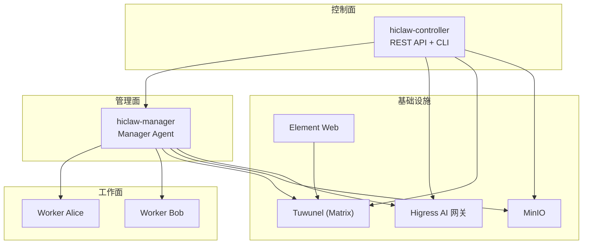
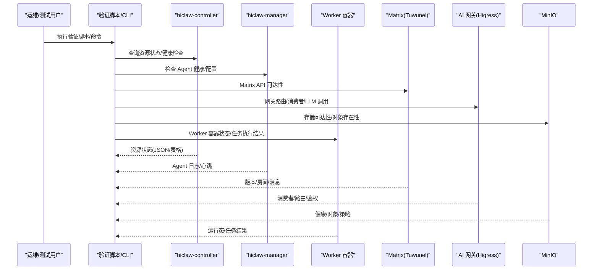
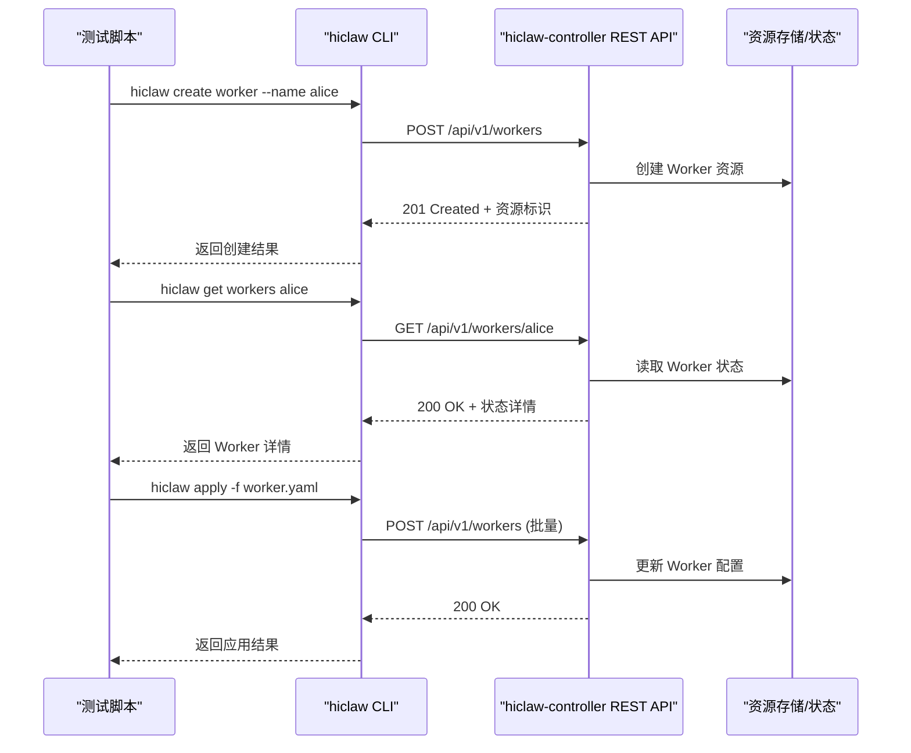
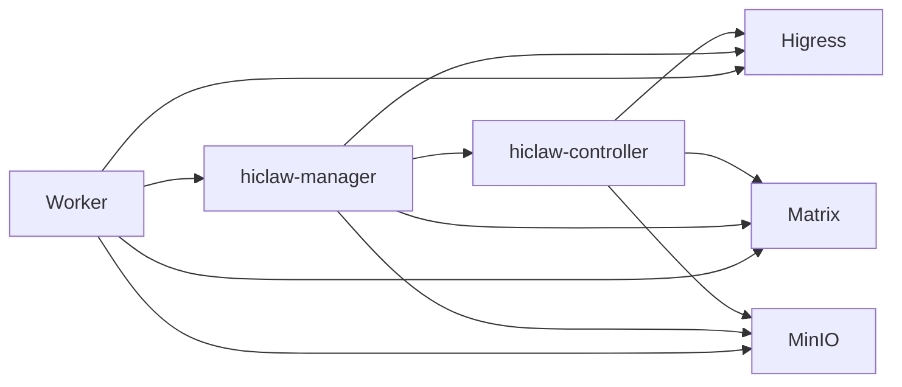

# 部署验证与测试

<cite>
**本文档引用的文件**
- [hiclaw-verify.sh](file://install/hiclaw-verify.sh)
- [hiclaw-install.sh](file://install/hiclaw-install.sh)
- [hiclaw-apply.sh](file://install/hiclaw-apply.sh)
- [README.md](file://README.md)
- [quickstart.md](file://docs/quickstart.md)
- [manager-guide.md](file://docs/manager-guide.md)
- [worker-guide.md](file://docs/worker-guide.md)
- [main.go](file://hiclaw-controller/cmd/hiclaw/main.go)
- [apply.go](file://hiclaw-controller/cmd/hiclaw/apply.go)
- [create.go](file://hiclaw-controller/cmd/hiclaw/create.go)
- [get.go](file://hiclaw-controller/cmd/hiclaw/get.go)
- [update.go](file://hiclaw-controller/cmd/hiclaw/update.go)
- [run-all-tests.sh](file://tests/run-all-tests.sh)
- [test-01-manager-boot.sh](file://tests/test-01-manager-boot.sh)
- [test-02-create-worker.sh](file://tests/test-02-create-worker.sh)
- [test-03-assign-task.sh](file://tests/test-03-assign-task.sh)
</cite>

## 目录
1. [简介](#简介)
2. [项目结构](#项目结构)
3. [核心组件](#核心组件)
4. [架构总览](#架构总览)
5. [详细组件分析](#详细组件分析)
6. [依赖关系分析](#依赖关系分析)
7. [性能考虑](#性能考虑)
8. [故障排除指南](#故障排除指南)
9. [结论](#结论)
10. [附录](#附录)

## 简介
本指南面向 HiClaw 部署后的验证与测试，覆盖服务健康检查、API 接口测试、功能完整性验证、核心组件状态检查（Manager、Worker、Matrix 服务器、AI 网关）、自动化测试脚本使用与自定义测试用例编写，以及常见部署问题的诊断与解决方案，并提供性能基准与压力测试的执行步骤。

## 项目结构
HiClaw 采用多容器分布式架构，核心组件包括：
- hiclaw-controller：控制平面，提供 REST API 与 CLI（hiclaw），负责 Worker/Team/Manager/Human 资源的声明式管理
- hiclaw-manager：Manager Agent（OpenClaw 或 CoPaw）
- Higress AI Gateway：统一流量入口与凭证管理
- Tuwunel（Matrix）：自托管即时通讯服务器
- MinIO：集中式文件存储
- Element Web：浏览器客户端

图表来源
- [README.md:305-333](file://README.md#L305-L333)
- [manager-guide.md:158-206](file://docs/manager-guide.md#L158-L206)

章节来源
- [README.md:1-404](file://README.md#L1-L404)
- [manager-guide.md:1-298](file://docs/manager-guide.md#L1-L298)

## 核心组件
- Manager（控制面协调者）：负责任务编排、权限控制、与 Worker/Team/Matrix 的交互
- Worker（执行面代理）：轻量无状态容器，连接 Manager，同步配置，调用 AI/GitHub 等工具
- Matrix（通信层）：基于 Matrix 协议的即时通讯，支持端到端加密与跨渠道接入
- AI 网关（Higress）：统一路由、消费者鉴权、凭证隔离与 MCP 服务器托管
- MinIO（存储层）：共享文件系统，用于 Agent 配置、任务数据与日志

章节来源
- [manager-guide.md:1-298](file://docs/manager-guide.md#L1-L298)
- [worker-guide.md:1-185](file://docs/worker-guide.md#L1-L185)

## 架构总览
下图展示部署后各组件间的交互关系与验证要点：

图表来源
- [main.go:9-34](file://hiclaw-controller/cmd/hiclaw/main.go#L9-L34)
- [apply.go:16-39](file://hiclaw-controller/cmd/hiclaw/apply.go#L16-L39)
- [create.go:14-24](file://hiclaw-controller/cmd/hiclaw/create.go#L14-L24)
- [get.go:11-21](file://hiclaw-controller/cmd/hiclaw/get.go#L11-L21)
- [update.go:9-18](file://hiclaw-controller/cmd/hiclaw/update.go#L9-L18)

## 详细组件分析

### 1) 部署后健康检查（Post-Install Verification）
- 功能概述：对 Manager 容器、MinIO、Matrix、Higress 网关/控制台、Manager Agent 健康进行只读探测
- 支持场景：Docker/Podman/Kubernetes（脚本预留扩展注释）
- 关键检查项
  - Manager 容器运行状态
  - MinIO 健康检查（内部地址）
  - Matrix API 可达性（内部地址）
  - Higress 网关对外可达性（主机端口）
  - Higress 控制台 HTTP 200
  - Manager Agent 健康（OpenClaw: CLI 健康；CoPaw: 应用健康端点）

使用方法
- 一键执行：bash install/hiclaw-verify.sh [容器名]
- 输出 PASS/FAIL 并统计总数，失败时退出码 1

章节来源
- [hiclaw-verify.sh:1-176](file://install/hiclaw-verify.sh#L1-L176)

### 2) Manager 组件验证
- 端口与域名
  - Higress 控制台：http://localhost:18001
  - Element Web：http://127.0.0.1:18088
  - Matrix 域名：matrix-local.hiclaw.io:18080
- 健康检查
  - Matrix 内部健康：docker exec <controller> curl -sf http://127.0.0.1:6167/_matrix/client/versions
  - MinIO 内部健康：docker exec <controller> curl -sf http://127.0.0.1:9000/minio/health/live
  - Higress 控制台：curl -s http://127.0.0.1:18001/
- 日志与会话
  - Manager Agent 日志：docker logs hiclaw-manager -f
  - OpenClaw 运行时日志：docker exec hiclaw-manager bash -c 'cat /tmp/openclaw/openclaw-*.log'

章节来源
- [manager-guide.md:158-206](file://docs/manager-guide.md#L158-L206)

### 3) Worker 组件验证
- 生命周期
  - 自动停止/启动：空闲超时、任务分配触发
  - 自动重建：Manager 重启后恢复 Worker
- 连接性测试
  - Matrix 可达性：docker exec <worker> curl -sf http://matrix-local.hiclaw.io:18080/_matrix/client/versions
  - AI 网关可达性：docker exec <worker> curl -sf -H "Authorization: Bearer $(jq -r '.models.providers.hiclaw-gateway.apiKey' /root/hiclaw-fs/agents/<name>/openclaw.json)" http://aigw-local.hiclaw.io:8080/v1/models
  - MCP 工具调用：docker exec <worker> mcporter --transport http --server-url "http://aigw-local.hiclaw.io:8080/mcp-servers/mcp-github/mcp" --header "Authorization=Bearer <KEY>" call list_repos '{"owner":"test"}'
- 配置热更新
  - MinIO 配置推送后，mc mirror 同步，OpenClaw 检测变更并热加载

章节来源
- [worker-guide.md:61-185](file://docs/worker-guide.md#L61-L185)

### 4) Matrix 服务器验证
- 服务健康
  - 内部版本接口：docker exec <controller> curl -sf http://127.0.0.1:6167/_matrix/client/versions
- 客户端访问
  - Element Web：http://127.0.0.1:18088
  - 通过网关域名访问：http://matrix-client-local.hiclaw.io:18080
- 端到端加密（E2EE）
  - 可选启用，Manager 与 Worker 之间消息加密
  - 若禁用 E2EE，Element 上不要创建默认加密的私有房间

章节来源
- [manager-guide.md:585-606](file://docs/manager-guide.md#L585-L606)
- [quickstart.md:62-77](file://docs/quickstart.md#L62-L77)

### 5) AI 网关（Higress）验证
- 控制台登录与消费者列表
  - 登录：docker exec hiclaw-controller curl -s -X POST http://127.0.0.1:8001/session/login -H 'Content-Type: application/json' -d '{"username":"admin","password":"<password>"}'
  - 消费者：docker exec hiclaw-controller curl -s http://127.0.0.1:8001/v1/consumers
- LLM 路由连通性
  - 使用 Manager 消费者密钥发起最小聊天请求，验证鉴权与路由生效
- MCP 服务器
  - 通过 Higress Console 配置 MCP Server，授权消费者后，Worker 可调用

章节来源
- [run-all-tests.sh:224-270](file://tests/run-all-tests.sh#L224-L270)
- [manager-guide.md:189-206](file://docs/manager-guide.md#L189-L206)

### 6) MinIO 存储验证
- 健康检查
  - docker exec <controller> curl -sf http://127.0.0.1:9000/minio/health/live
- 对象存在性
  - Manager 配置：agents/manager/SOUL.md、AGENTS.md、HEARTBEAT.md
  - Worker 配置：agents/<name>/openclaw.json、SOUL.md
  - 任务数据：shared/tasks/<task-id>/meta.json、spec.md、result.md
- 备份与恢复
  - 备份：docker run -v hiclaw-data:/data -v $(pwd):/backup ubuntu tar czf /backup/hiclaw-backup-$(date +%Y%m%d).tar.gz /data
  - 恢复：docker run -v hiclaw-data:/data -v $(pwd):/backup ubuntu tar xzf /backup/hiclaw-backup-YYYYMMDD.tar.gz -C /

章节来源
- [manager-guide.md:207-271](file://docs/manager-guide.md#L207-L271)

### 7) 声明式资源管理（Declarative Resource Management）
- CLI 入口：hiclaw（在 hiclaw-controller 或 hiclaw-manager 容器内）
- 资源类型：Worker、Team、Human、Manager
- 操作模式：apply（增量/全量同步）、create（创建）、get（查询）、update（更新）
- 文件导入：install/hiclaw-apply.sh 将 YAML 文件复制到容器并转发至 hiclaw apply

章节来源
- [main.go:9-34](file://hiclaw-controller/cmd/hiclaw/main.go#L9-L34)
- [apply.go:16-39](file://hiclaw-controller/cmd/hiclaw/apply.go#L16-L39)
- [create.go:14-24](file://hiclaw-controller/cmd/hiclaw/create.go#L14-L24)
- [get.go:11-21](file://hiclaw-controller/cmd/hiclaw/get.go#L11-L21)
- [update.go:9-18](file://hiclaw-controller/cmd/hiclaw/update.go#L9-L18)
- [hiclaw-apply.sh:1-85](file://install/hiclaw-apply.sh#L1-L85)

### 8) 自动化测试套件与自定义用例
- 运行测试
  - ./tests/run-all-tests.sh：构建镜像、启动 Manager、运行全部测试用例并汇总结果
  - 参数：--skip-build、--use-existing、--test-filter
- 测试用例
  - test-01-manager-boot.sh：Manager 启动、服务健康、Matrix 登录、Higress 控制台、MinIO 存储、Manager Agent 响应
  - test-02-create-worker.sh：通过 Matrix 请求创建 Worker，验证矩阵用户、Higress 消费者、MinIO 配置、容器启动
  - test-03-assign-task.sh：分配任务、MinIO 任务目录创建、Worker 执行与结果写入
- 自定义测试用例
  - 基于 tests/lib 下的客户端工具（Matrix、Higress、MinIO）封装断言
  - 使用 wait_for_manager_agent_ready、wait_for_session_stable 等辅助函数保证时序

章节来源
- [run-all-tests.sh:1-388](file://tests/run-all-tests.sh#L1-L388)
- [test-01-manager-boot.sh:1-153](file://tests/test-01-manager-boot.sh#L1-L153)
- [test-02-create-worker.sh:1-149](file://tests/test-02-create-worker.sh#L1-L149)
- [test-03-assign-task.sh:1-83](file://tests/test-03-assign-task.sh#L1-L83)

### 9) API 接口测试流程（序列图）

图表来源
- [create.go:59-128](file://hiclaw-controller/cmd/hiclaw/create.go#L59-L128)
- [get.go:41-86](file://hiclaw-controller/cmd/hiclaw/get.go#L41-L86)
- [apply.go:56-126](file://hiclaw-controller/cmd/hiclaw/apply.go#L56-L126)

## 依赖关系分析
- 控制面依赖
  - hiclaw-controller 依赖 Higress（路由/鉴权）、Matrix（通信）、MinIO（存储）
  - Manager 作为控制面与工作面的桥梁，依赖控制器提供的资源状态与配置
- 工作面依赖
  - Worker 依赖 Manager（配置同步）、Matrix（任务通信）、AI 网关（LLM/MCP）、MinIO（共享文件）
- 外部集成
  - GitHub MCP 通过 Higress 托管，Worker 以消费者密钥调用，避免直接暴露真实凭证

图表来源
- [README.md:305-333](file://README.md#L305-L333)
- [manager-guide.md:158-206](file://docs/manager-guide.md#L158-L206)

章节来源
- [README.md:268-277](file://README.md#L268-L277)
- [manager-guide.md:158-206](file://docs/manager-guide.md#L158-L206)

## 性能考虑
- 资源规划
  - 至少 2 核 CPU、4 GB 内存；多 Worker 场景建议 4 核 8 GB
- 网络与存储
  - MinIO 与 Matrix 通过容器网络内部访问，减少外网暴露风险
  - Element Web 可直连主机端口或经网关域名访问
- 日志与监控
  - 使用 docker logs 与容器内日志文件定位性能瓶颈
  - 利用 hiclaw CLI 的 get workers/teams/managers 获取资源状态，辅助容量评估

章节来源
- [README.md:56-58](file://README.md#L56-L58)
- [manager-guide.md:158-206](file://docs/manager-guide.md#L158-L206)

## 故障排除指南
- 常见问题定位
  - Manager Agent 未就绪：检查 hiclaw-manager 容器日志，确认 Matrix 与 Higress 初始化完成
  - Worker 无法连接：核对 openclaw.json 中 Matrix/AI 网关配置与消费者密钥
  - MCP 工具 403：确认 Higress 控制台中已授权该消费者访问对应 MCP Server
  - MinIO 401/403：核对消费者密钥与路由授权
- 诊断工具
  - 导出调试日志：python scripts/export-debug-log.py --range 1h
  - 使用 hiclaw CLI 查询资源状态：hiclaw get workers -o json
  - 通过 Element Web 与 Matrix 房间交互验证通信链路

章节来源
- [README.md:355-378](file://README.md#L355-L378)
- [worker-guide.md:61-123](file://docs/worker-guide.md#L61-L123)
- [manager-guide.md:158-206](file://docs/manager-guide.md#L158-L206)

## 结论
通过部署后健康检查、核心组件状态验证、API 接口测试与自动化测试套件，可以全面评估 HiClaw 的可用性与稳定性。结合声明式资源管理与日志导出能力，能够快速定位问题并进行修复。建议在生产环境持续运行健康检查与自动化测试，配合性能监控与备份策略，保障系统的长期稳定运行。

## 附录

### A. 部署后验证清单
- 服务健康
  - [ ] Manager 容器运行
  - [ ] MinIO 健康：http://127.0.0.1:9000/minio/health/live
  - [ ] Matrix API：http://127.0.0.1:6167/_matrix/client/versions
  - [ ] Higress 网关：http://127.0.0.1:18080
  - [ ] Higress 控制台：http://127.0.0.1:18001
  - [ ] Manager Agent 健康（OpenClaw/CoPaw）
- 功能验证
  - [ ] Element Web 登录
  - [ ] Manager 配置文件存在（SOUL/AGENTS/HEARTBEAT）
  - [ ] Worker 创建与任务执行
  - [ ] MCP 工具调用（GitHub 等）
- 资源管理
  - [ ] hiclaw CLI 可用（get/create/apply/update）
  - [ ] 声明式 YAML 应用成功

章节来源
- [hiclaw-verify.sh:80-176](file://install/hiclaw-verify.sh#L80-L176)
- [quickstart.md:68-172](file://docs/quickstart.md#L68-L172)

### B. 自动化测试执行步骤
- 运行全部测试
  - ./tests/run-all-tests.sh
- 仅运行特定用例
  - ./tests/run-all-tests.sh --test-filter "01 02 03"
- 使用现有安装
  - ./tests/run-all-tests.sh --use-existing

章节来源
- [run-all-tests.sh:1-388](file://tests/run-all-tests.sh#L1-L388)

### C. 声明式资源管理示例
- 创建 Worker
  - hiclaw create worker --name alice --model qwen3.6-plus
- 查询 Worker
  - hiclaw get workers alice -o json
- 应用 YAML
  - install/hiclaw-apply.sh -f worker.yaml
  - 或在容器内：hiclaw apply -f /tmp/import/worker.yaml

章节来源
- [create.go:59-128](file://hiclaw-controller/cmd/hiclaw/create.go#L59-L128)
- [get.go:41-86](file://hiclaw-controller/cmd/hiclaw/get.go#L41-L86)
- [apply.go:56-126](file://hiclaw-controller/cmd/hiclaw/apply.go#L56-L126)
- [hiclaw-apply.sh:1-85](file://install/hiclaw-apply.sh#L1-L85)