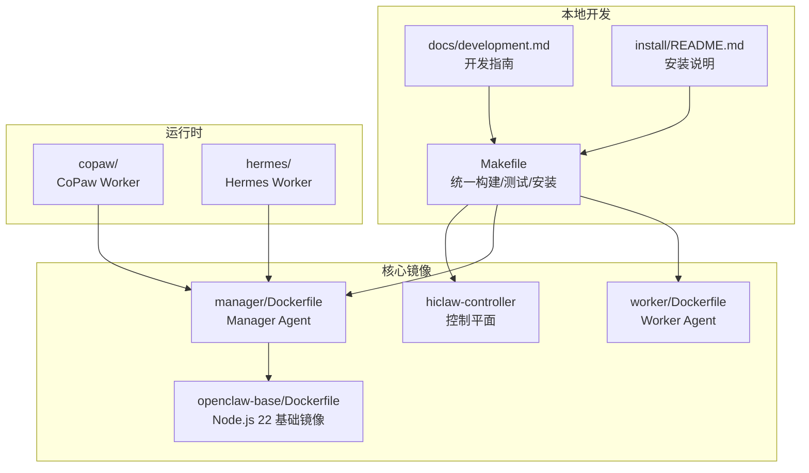
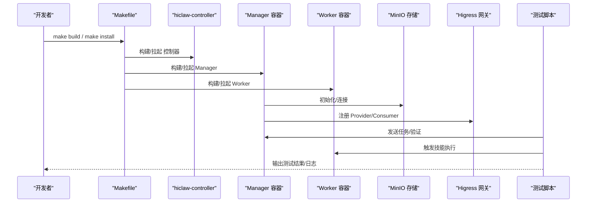
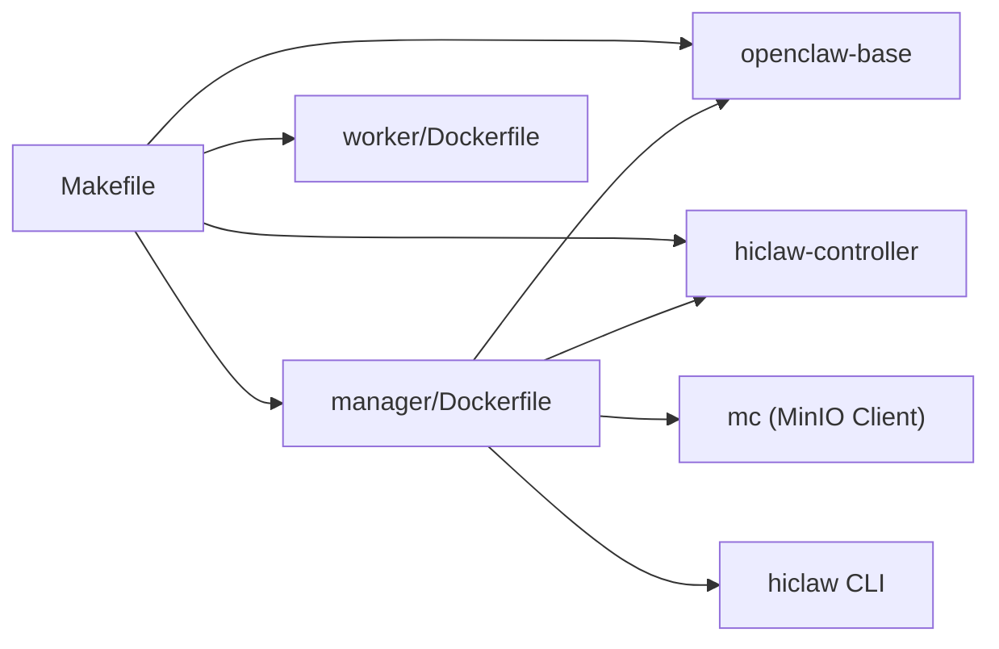

# 开发环境搭建

<cite>
**本文引用的文件**
- [README.md](file://README.md)
- [docs/development.md](file://docs/development.md)
- [docs/zh-cn/development.md](file://docs/zh-cn/development.md)
- [Makefile](file://Makefile)
- [install/README.md](file://install/README.md)
- [hack/local-k8s-up.sh](file://hack/local-k8s-up.sh)
- [hack/local-k8s-down.sh](file://hack/local-k8s-down.sh)
- [hack/mirror-images.sh](file://hack/mirror-images.sh)
- [openclaw-base/Dockerfile](file://openclaw-base/Dockerfile)
- [manager/Dockerfile](file://manager/Dockerfile)
- [copaw/README.md](file://copaw/README.md)
- [copaw/pyproject.toml](file://copaw/pyproject.toml)
- [hermes/README.md](file://hermes/README.md)
- [hermes/pyproject.toml](file://hermes/pyproject.toml)
</cite>

## 目录
1. [简介](#简介)
2. [项目结构](#项目结构)
3. [核心组件](#核心组件)
4. [架构总览](#架构总览)
5. [详细组件分析](#详细组件分析)
6. [依赖关系分析](#依赖关系分析)
7. [性能考量](#性能考量)
8. [故障排查指南](#故障排查指南)
9. [结论](#结论)
10. [附录](#附录)

## 简介
本指南面向希望在本地参与 HiClaw 开发的工程师，提供从零开始的开发环境准备、工具安装、镜像构建、测试运行与问题排查的完整路径。重点覆盖以下方面：
- 前置条件与工具安装（Docker、Git、MinIO Client、jq 等）
- 项目依赖（Go、Python 环境配置说明）
- 中国内地网络代理配置（宿主机与 Docker 构建代理）
- 开发环境初始化（代码克隆、依赖安装、环境验证）
- 不同操作系统（Linux、macOS、Windows）下的特殊配置
- 常见环境问题的定位与解决

## 项目结构
HiClaw 采用多模块协作的组织方式，核心模块与职责如下：
- hiclaw-controller：Kubernetes 控制平面与嵌入式控制器
- manager：Manager Agent 容器（OpenClaw/CoPaw/Hermes 运行时）
- worker：Worker Agent 容器（OpenClaw 运行时）
- copaw：CoPaw Worker 运行时（Python）
- hermes：Hermes Worker 运行时（Python）
- install：一键安装脚本与说明
- docs：开发与使用文档
- tests：集成测试套件
- helm/hiclaw：Helm Chart（Kubernetes 部署）
- hack：本地 K8s(kind) 部署与镜像镜像脚本

图表来源
- [Makefile:104-121](file://Makefile#L104-L121)
- [manager/Dockerfile:13-24](file://manager/Dockerfile#L13-L24)
- [openclaw-base/Dockerfile:19-31](file://openclaw-base/Dockerfile#L19-L31)
- [copaw/README.md:1-18](file://copaw/README.md#L1-L18)
- [hermes/README.md:1-82](file://hermes/README.md#L1-L82)

章节来源
- [Makefile:104-121](file://Makefile#L104-L121)
- [docs/development.md:12-14](file://docs/development.md#L12-L14)
- [docs/zh-cn/development.md:12-14](file://docs/zh-cn/development.md#L12-L14)

## 核心组件
- 构建与测试入口：通过根目录 Makefile 统一管理镜像构建、测试运行、安装卸载、日志查看等。
- 基础镜像：openclaw-base 提供 Node.js 22 与 OpenClaw 运行时，确保 Manager/Worker 的一致性。
- Manager/Worker 镜像：分别基于 openclaw-base 与各自运行时（OpenClaw/CoPaw/Hermes）构建。
- 安装脚本：install 目录提供一键安装 Manager/Worker 的脚本与说明。

章节来源
- [Makefile:121-185](file://Makefile#L121-L185)
- [openclaw-base/Dockerfile:57-62](file://openclaw-base/Dockerfile#L57-L62)
- [manager/Dockerfile:24-58](file://manager/Dockerfile#L24-L58)
- [install/README.md:1-186](file://install/README.md#L1-L186)

## 架构总览
下图展示本地开发与测试的关键流程：开发者通过 Makefile 触发构建，安装脚本启动 Manager 与基础设施，测试脚本验证功能，日志与调试工具辅助定位问题。

图表来源
- [Makefile:538-550](file://Makefile#L538-L550)
- [Makefile:517-528](file://Makefile#L517-L528)
- [Makefile:669-686](file://Makefile#L669-L686)
- [docs/development.md:165-194](file://docs/development.md#L165-L194)

章节来源
- [Makefile:538-550](file://Makefile#L538-L550)
- [Makefile:517-528](file://Makefile#L517-L528)
- [Makefile:669-686](file://Makefile#L669-L686)

## 详细组件分析

### 前置条件与工具安装
- Docker：用于构建与测试（Docker Desktop（Windows/macOS）或 Docker Engine（Linux））。
- Git：用于代码克隆与版本管理。
- MinIO Client（mc）：用于集成测试与对象存储状态检查。
- jq：用于测试脚本中的 JSON 处理。
- PowerShell 7+（Windows 专用）：用于执行安装脚本。

章节来源
- [docs/development.md:5-11](file://docs/development.md#L5-L11)
- [docs/zh-cn/development.md:5-11](file://docs/zh-cn/development.md#L5-L11)
- [install/README.md:5-9](file://install/README.md#L5-L9)

### 项目依赖与环境配置
- Node.js（Manager/Worker 运行时）：openclaw-base 已内置 Node.js 22，满足 OpenClaw 的最低版本要求。
- Python（CoPaw/Hermes Worker 运行时）：运行时要求 Python ≥ 3.10（CoPaw）与 ≥ 3.11（Hermes），并在各自 pyproject.toml 中声明依赖。
- Go：用于 hiclaw-controller 的构建与测试（Makefile 中包含 go.mod/go.sum）。

章节来源
- [openclaw-base/Dockerfile:57-62](file://openclaw-base/Dockerfile#L57-L62)
- [copaw/pyproject.toml:11-17](file://copaw/pyproject.toml#L11-L17)
- [hermes/pyproject.toml:11-25](file://hermes/pyproject.toml#L11-L25)
- [hiclaw-controller/go.mod](file://hiclaw-controller/go.mod)
- [hiclaw-controller/go.sum](file://hiclaw-controller/go.sum)

### 网络代理配置（中国内地）
- 宿主机代理：在 shell 中设置 http_proxy/https_proxy/ALL_PROXY，并通过 no_proxy 排除 localhost。
- Docker 构建代理：通过 DOCKER_BUILD_ARGS 传递代理参数，使构建阶段可访问 GitHub 与 npm。
- 运行测试代理：测试时同样需要 no_proxy，避免对 127.0.0.1 的健康检查被代理拦截。

章节来源
- [docs/development.md:264-299](file://docs/development.md#L264-L299)
- [docs/zh-cn/development.md:264-299](file://docs/zh-cn/development.md#L264-L299)

### 开发环境初始化步骤
- 代码克隆：使用 Git 克隆仓库。
- 依赖安装：
  - Manager/Worker 构建：通过 Makefile 的 build 目标完成。
  - 可选：CoPaw/Hermes Worker 的 Python 依赖在各自镜像中安装。
- 环境验证：
  - 一键安装 Manager：make install（非交互模式需设置 HICLAW_LLM_API_KEY 等变量）。
  - 验证安装：make verify。
  - 发送任务：make replay 或 ./scripts/replay-task.sh。
  - 运行测试：make test 或 make test-quick。

章节来源
- [docs/development.md:93-164](file://docs/development.md#L93-L164)
- [docs/zh-cn/development.md:93-164](file://docs/zh-cn/development.md#L93-L164)
- [Makefile:538-550](file://Makefile#L538-L550)
- [Makefile:669-686](file://Makefile#L669-L686)
- [Makefile:517-528](file://Makefile#L517-L528)

### 不同操作系统（Linux、macOS、Windows）下的特殊配置
- Windows：
  - 需要 PowerShell 7+。
  - Docker Desktop 必须使用 WSL2 后端。
  - 安装脚本通过命名管道访问 Docker socket。
- macOS：
  - 支持 amd64 与 arm64。
  - Docker Desktop 需运行。
- Linux：
  - 支持 amd64 与 arm64。
  - 需要 Docker Engine 或 Docker Desktop。

章节来源
- [install/README.md:153-169](file://install/README.md#L153-L169)

### 本地 K8s（kind）部署（可选）
- 通过 hack/local-k8s-up.sh 创建 kind 集群并部署 HiClaw（Helm Chart）。
- 支持跳过本地镜像构建、预加载上游镜像、设置注册令牌与管理员密码等。
- 通过 hack/local-k8s-down.sh 清理集群。

章节来源
- [hack/local-k8s-up.sh:1-260](file://hack/local-k8s-up.sh#L1-L260)
- [hack/local-k8s-down.sh:1-28](file://hack/local-k8s-down.sh#L1-L28)

### 镜像镜像（加速中国内地拉取）
- 通过 hack/mirror-images.sh 将上游镜像批量复制到 Higress 主镜像仓，并由区域镜像自动同步。
- 支持容器模式（USE_CONTAINER=1）与干跑（DRY_RUN=1）。

章节来源
- [hack/mirror-images.sh:1-245](file://hack/mirror-images.sh#L1-L245)

## 依赖关系分析
- 构建链路：Makefile → openclaw-base（Node.js 22）→ manager/Dockerfile（拷贝 Agent/脚本/CLI）→ hiclaw-controller（提供 CLI 与 mc）。
- 运行链路：Manager 容器启动后连接 MinIO/Higress/Tuwunel，Worker 容器通过 Manager 创建并接入 Matrix。

图表来源
- [Makefile:121-185](file://Makefile#L121-L185)
- [manager/Dockerfile:17-31](file://manager/Dockerfile#L17-L31)
- [openclaw-base/Dockerfile:19-31](file://openclaw-base/Dockerfile#L19-L31)

章节来源
- [Makefile:121-185](file://Makefile#L121-L185)
- [manager/Dockerfile:17-31](file://manager/Dockerfile#L17-L31)

## 性能考量
- 多架构构建：默认使用 docker buildx 构建 amd64 + arm64 并生成清单，避免单架构覆盖多架构镜像。
- 基础镜像优化：openclaw-base 仅包含必要组件，显著减少镜像体积与拉取时间。
- 本地 K8s 预加载：在 kind 中预加载上游镜像，降低 GFW 或 Docker Hub 不稳定带来的影响。

章节来源
- [Makefile:82-86](file://Makefile#L82-L86)
- [Makefile:226-252](file://Makefile#L226-L252)
- [hack/local-k8s-up.sh:133-156](file://hack/local-k8s-up.sh#L133-L156)

## 故障排查指南
- 构建期 git clone 卡住：通过 DOCKER_BUILD_ARGS 传递 http_proxy/https_proxy。
- 健康检查 503：确保 no_proxy 排除 localhost。
- Node.js 版本问题：确保使用 openclaw-base（Node.js 22）或 Worker 构建阶段复制的 Node.js 22。
- OpenClaw 网关配置缺失：openclaw.json 必须包含 gateway.mode 与 auth.token。
- Higress Provider 配置缺失：qwen 类型需包含 rawConfigs 字段。
- 技能未加载：SKILL.md 必须包含 YAML front matter。
- setup-higress.sh 重启崩溃：使用 higress_api() helper 优雅处理“已存在”错误。
- Higress 重复设置 Consumer：检查 /data/.higress-setup-done 标记文件。

章节来源
- [docs/development.md:483-497](file://docs/development.md#L483-L497)
- [docs/zh-cn/development.md:483-497](file://docs/zh-cn/development.md#L483-L497)

## 结论
通过上述步骤，您可以在本地完成 HiClaw 的开发环境搭建与验证。建议优先使用 Makefile 的统一入口，结合安装脚本与测试套件，快速完成从构建到验证的闭环。遇到网络与 Node.js 版本问题时，按本指南的代理与版本要求进行修正即可。

## 附录

### 常用命令速查
- 构建镜像：make build / make build-manager / make build-worker
- 测试：make test / make test-quick / make test-installed
- 安装：make install / make install-interactive
- 卸载：make uninstall
- 发送任务：make replay / make replay-log
- 日志：make logs / make status
- K8s 本地部署：./hack/local-k8s-up.sh / ./hack/local-k8s-down.sh
- 镜像镜像：./hack/mirror-images.sh

章节来源
- [Makefile:117-185](file://Makefile#L117-L185)
- [Makefile:517-535](file://Makefile#L517-L535)
- [Makefile:538-562](file://Makefile#L538-L562)
- [Makefile:669-686](file://Makefile#L669-L686)
- [Makefile:695-708](file://Makefile#L695-L708)
- [hack/local-k8s-up.sh:21-22](file://hack/local-k8s-up.sh#L21-L22)
- [hack/local-k8s-down.sh:4-5](file://hack/local-k8s-down.sh#L4-L5)
- [hack/mirror-images.sh:15-27](file://hack/mirror-images.sh#L15-L27)