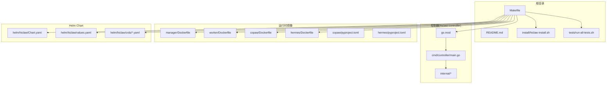
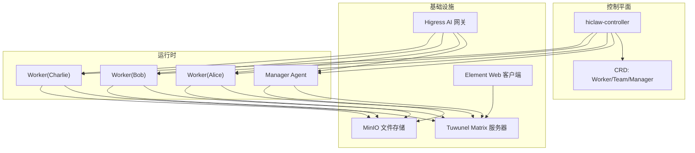
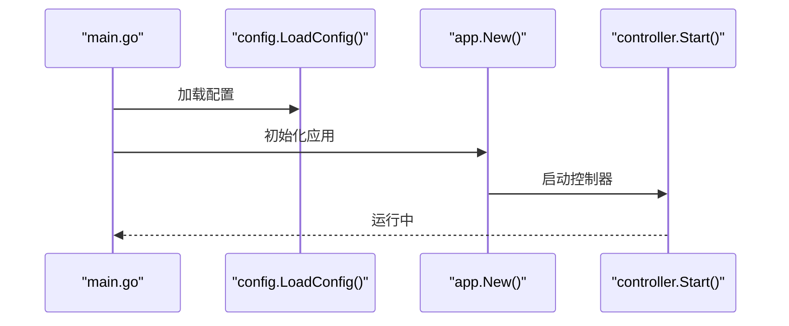
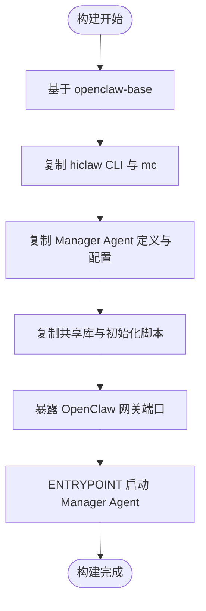
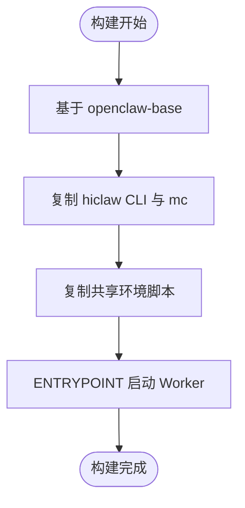
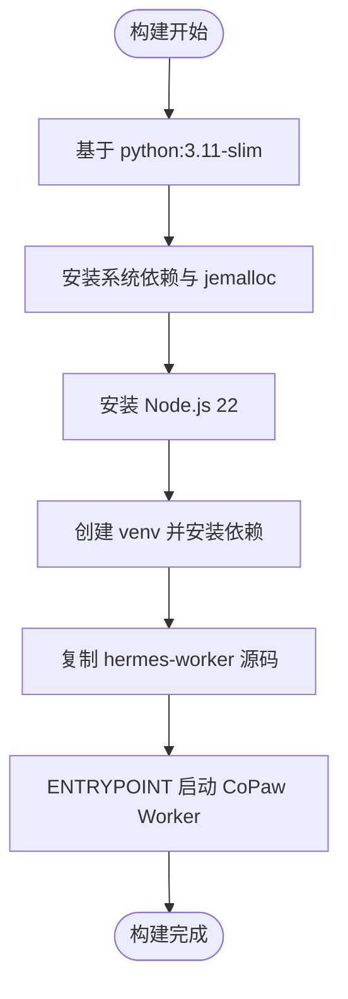
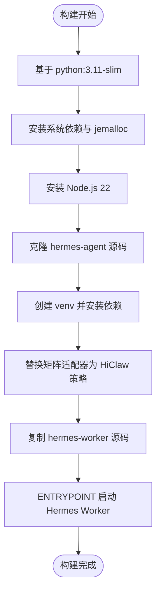
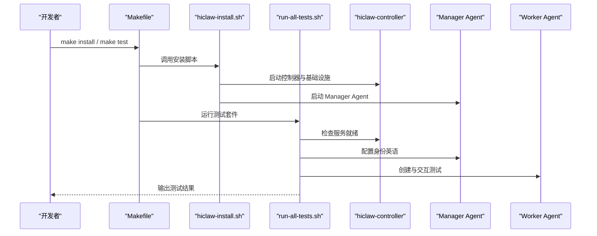
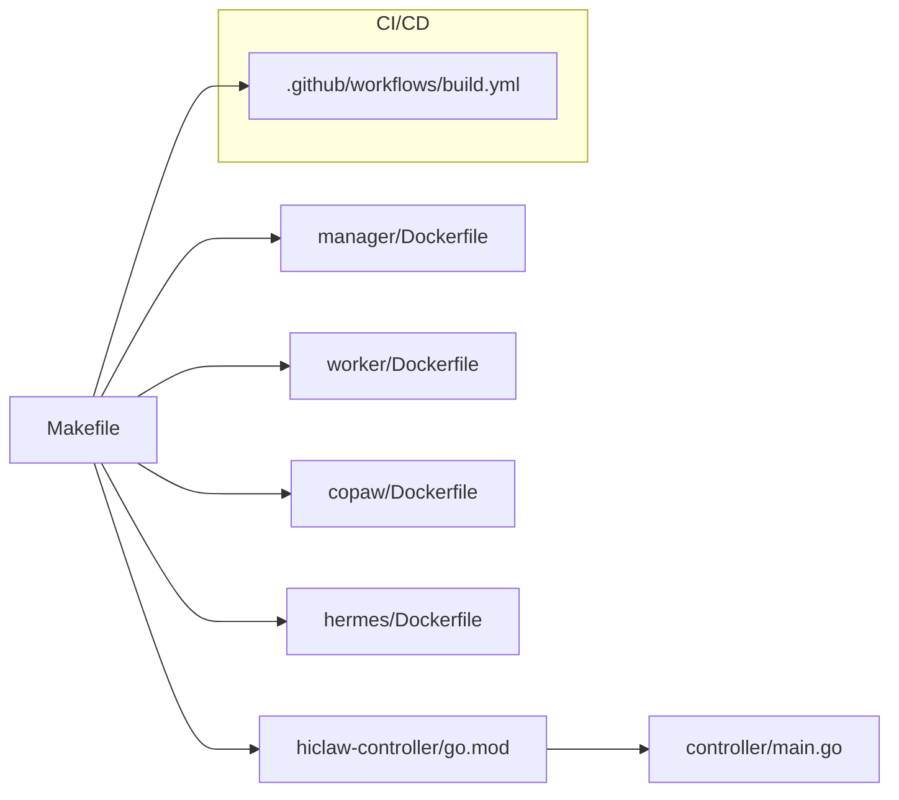

# 开发者指南

<cite>
**本文档引用的文件**
- [README.md](file://README.md)
- [docs/zh-cn/development.md](file://docs/zh-cn/development.md)
- [Makefile](file://Makefile)
- [hiclaw-controller/go.mod](file://hiclaw-controller/go.mod)
- [hiclaw-controller/cmd/controller/main.go](file://hiclaw-controller/cmd/controller/main.go)
- [manager/Dockerfile](file://manager/Dockerfile)
- [worker/Dockerfile](file://worker/Dockerfile)
- [copaw/Dockerfile](file://copaw/Dockerfile)
- [hermes/Dockerfile](file://hermes/Dockerfile)
- [copaw/pyproject.toml](file://copaw/pyproject.toml)
- [hermes/pyproject.toml](file://hermes/pyproject.toml)
- [install/hiclaw-install.sh](file://install/hiclaw-install.sh)
- [.github/workflows/build.yml](file://.github/workflows/build.yml)
- [tests/run-all-tests.sh](file://tests/run-all-tests.sh)
- [manager/agent/AGENTS.md](file://manager/agent/AGENTS.md)
</cite>

## 目录
1. [简介](#简介)
2. [项目结构](#项目结构)
3. [核心组件](#核心组件)
4. [架构总览](#架构总览)
5. [详细组件分析](#详细组件分析)
6. [依赖关系分析](#依赖关系分析)
7. [性能考量](#性能考量)
8. [故障排除指南](#故障排除指南)
9. [结论](#结论)
10. [附录](#附录)

## 简介
HiClaw 是一个开源的协作式多智能体运行时平台，采用 Manager-Workers 架构，在受控且可审计的聊天室中协调多个 Agent，全程保持人类可见与干预能力。项目提供多种 Worker 运行时（OpenClaw/QwenPaw/Hermes），统一通过 Matrix 协议通信，并结合 Higress AI 网关与 MinIO 文件系统实现安全、可观测与低 Token 消耗的协作。

本开发者指南面向希望参与 HiClaw 开发与维护的工程师，涵盖本地开发环境搭建、代码结构与组织方式、调试与测试方法、贡献流程、构建系统与 CI/CD、常见问题与最佳实践，以及性能分析与优化建议。

## 项目结构
HiClaw 仓库采用模块化与多语言混合架构：
- 根目录提供统一的构建与测试入口（Makefile）、安装脚本与测试套件
- Go 语言实现的控制器（hiclaw-controller）负责 Kubernetes 控制平面与资源编排
- 多个 Worker 运行时分别以不同语言实现（Node.js、Python、Hermes）
- Manager Agent 与 Worker Agent 的技能与配置通过 Markdown 与脚本驱动
- Helm Chart 提供 Kubernetes 部署定义
- 文档与博客位于 docs 与 blog 目录，提供中文与英文版本

**图表来源**
- [Makefile:1-823](file://Makefile#L1-L823)
- [hiclaw-controller/go.mod:1-143](file://hiclaw-controller/go.mod#L1-L143)
- [hiclaw-controller/cmd/controller/main.go:1-37](file://hiclaw-controller/cmd/controller/main.go#L1-L37)
- [manager/Dockerfile:1-87](file://manager/Dockerfile#L1-L87)
- [worker/Dockerfile:1-81](file://worker/Dockerfile#L1-L81)
- [copaw/Dockerfile:1-132](file://copaw/Dockerfile#L1-L132)
- [hermes/Dockerfile:1-175](file://hermes/Dockerfile#L1-L175)

**章节来源**
- [README.md:1-404](file://README.md#L1-L404)
- [Makefile:1-823](file://Makefile#L1-L823)

## 核心组件
- 控制器（hiclaw-controller）
  - 基于 controller-runtime，负责 Worker/Team/Manager 等资源的 Reconcile 与状态管理
  - 提供 HTTP 服务与资源处理器，支撑 Manager Agent 的生命周期与配置下发
- Manager Agent
  - 基于 OpenClaw 的 Manager 容器，提供技能生态与任务编排能力
  - 通过 MinIO 同步共享状态与文件，支持多 Worker 并行协作
- Worker 运行时
  - OpenClaw Worker：Node.js 实现，适合通用任务与工具调用
  - QwenPaw Worker（CoPaw）：Python 实现，轻量级浏览器自动化与快速任务
  - Hermes Worker：Hermes Agent 的适配版本，具备终端沙箱与自学习能力
- 安装与测试
  - 一键安装脚本支持交互与非交互两种模式，自动配置 Higress、Matrix、MinIO 等组件
  - 集成测试套件覆盖端到端场景，支持过滤与复用已安装实例

**章节来源**
- [hiclaw-controller/go.mod:1-143](file://hiclaw-controller/go.mod#L1-L143)
- [hiclaw-controller/cmd/controller/main.go:1-37](file://hiclaw-controller/cmd/controller/main.go#L1-L37)
- [manager/Dockerfile:1-87](file://manager/Dockerfile#L1-L87)
- [worker/Dockerfile:1-81](file://worker/Dockerfile#L1-L81)
- [copaw/Dockerfile:1-132](file://copaw/Dockerfile#L1-L132)
- [hermes/Dockerfile:1-175](file://hermes/Dockerfile#L1-L175)
- [install/hiclaw-install.sh:1-3532](file://install/hiclaw-install.sh#L1-L3532)
- [tests/run-all-tests.sh:1-388](file://tests/run-all-tests.sh#L1-L388)

## 架构总览
HiClaw 的整体架构围绕“控制器 + 网关 + IM + 存储”的基础设施展开，Manager 作为中枢协调 Worker，所有通信通过 Matrix 协议，凭证与真实密钥由 Higress 网关统一管理，文件与状态通过 MinIO 共享。

**图表来源**
- [README.md:305-333](file://README.md#L305-L333)
- [hiclaw-controller/cmd/controller/main.go:1-37](file://hiclaw-controller/cmd/controller/main.go#L1-L37)
- [manager/Dockerfile:1-87](file://manager/Dockerfile#L1-L87)
- [worker/Dockerfile:1-81](file://worker/Dockerfile#L1-L81)

## 详细组件分析

### 控制器（hiclaw-controller）
- 语言与框架
  - Go 1.25，使用 controller-runtime 与 Kubernetes API 生态
- 启动流程
  - 初始化日志、加载配置、创建应用实例并启动
- 关键职责
  - 资源 Reconcile（Worker/Team/Manager）
  - HTTP 服务与资源处理器
  - 凭证与网关配置下发
- 依赖要点
  - k8s.io、sigs.k8s.io/controller-runtime、第三方凭据与客户端库

**图表来源**
- [hiclaw-controller/cmd/controller/main.go:1-37](file://hiclaw-controller/cmd/controller/main.go#L1-L37)
- [hiclaw-controller/go.mod:1-143](file://hiclaw-controller/go.mod#L1-L143)

**章节来源**
- [hiclaw-controller/cmd/controller/main.go:1-37](file://hiclaw-controller/cmd/controller/main.go#L1-L37)
- [hiclaw-controller/go.mod:1-143](file://hiclaw-controller/go.mod#L1-L143)

### Manager 容器镜像
- 基础镜像：openclaw-base（包含 Node.js 22 与 OpenClaw）
- 功能特性
  - 集成 MinIO 客户端与 hiclaw CLI
  - 内置可观测性插件（CMS）
  - 支持多运行时切换（OpenClaw/QwenPaw/Copaw）
  - 通过环境变量注入运行模式与配置
- 入口与工作目录
  - 入口脚本：start-manager-agent.sh
  - 工作目录：/root/manager-workspace

**图表来源**
- [manager/Dockerfile:1-87](file://manager/Dockerfile#L1-L87)

**章节来源**
- [manager/Dockerfile:1-87](file://manager/Dockerfile#L1-L87)

### Worker 容器镜像
- 统一策略
  - 基于 openclaw-base，Worker 无状态，配置与状态集中存储于 MinIO
  - 集成 MinIO 客户端与 hiclaw CLI
  - 内置可观测性插件
- 入口与同步
  - 入口脚本：worker-entrypoint.sh
  - 文件同步通过 hiclaw-sync 链接至具体 Worker 技能脚本

**图表来源**
- [worker/Dockerfile:1-81](file://worker/Dockerfile#L1-L81)

**章节来源**
- [worker/Dockerfile:1-81](file://worker/Dockerfile#L1-L81)

### CoPaw Worker 容器镜像
- 语言与运行时：Python 3.11
- 依赖安装
  - 使用 venv 安装 copaw 与 hermes-worker 依赖
  - jemalloc 降低内存碎片
  - Node.js 22 用于共享 CLI 工具
- 入口与同步
  - 入口脚本：copaw-worker-entrypoint.sh
  - 文件同步通过 copaw-sync 链接

**图表来源**
- [copaw/Dockerfile:1-132](file://copaw/Dockerfile#L1-L132)
- [copaw/pyproject.toml:1-31](file://copaw/pyproject.toml#L1-L31)

**章节来源**
- [copaw/Dockerfile:1-132](file://copaw/Dockerfile#L1-L132)
- [copaw/pyproject.toml:1-31](file://copaw/pyproject.toml#L1-L31)

### Hermes Worker 容器镜像
- 语言与运行时：Python 3.11
- 依赖安装
  - 从上游仓库克隆 hermes-agent 并安装
  - 安装 mautrix、matrix-nio、markdown-it 等依赖
  - 通过 venv 安装 hermes-worker 源码
- 策略适配
  - 重命名原生矩阵适配器，注入 HiClaw 策略钩子（提及、白名单、历史、视觉限制）

**图表来源**
- [hermes/Dockerfile:1-175](file://hermes/Dockerfile#L1-L175)
- [hermes/pyproject.toml:1-37](file://hermes/pyproject.toml#L1-L37)

**章节来源**
- [hermes/Dockerfile:1-175](file://hermes/Dockerfile#L1-L175)
- [hermes/pyproject.toml:1-37](file://hermes/pyproject.toml#L1-L37)

### 安装与测试流程
- 一键安装
  - 支持交互与非交互模式，自动配置 LLM 提供商、管理员凭据、端口与域名
  - 可选择是否挂载容器运行时 socket 以支持直接创建 Worker
- 集成测试
  - 自动构建镜像、安装 Manager、等待就绪、配置 Manager 身份（英语）
  - 运行测试用例，支持过滤与复用已安装实例
  - 输出汇总结果并按失败数退出

**图表来源**
- [Makefile:538-686](file://Makefile#L538-L686)
- [install/hiclaw-install.sh:1-3532](file://install/hiclaw-install.sh#L1-L3532)
- [tests/run-all-tests.sh:1-388](file://tests/run-all-tests.sh#L1-L388)

**章节来源**
- [install/hiclaw-install.sh:1-3532](file://install/hiclaw-install.sh#L1-L3532)
- [tests/run-all-tests.sh:1-388](file://tests/run-all-tests.sh#L1-L388)
- [Makefile:517-535](file://Makefile#L517-L535)

## 依赖关系分析
- 构建系统
  - Makefile 提供统一的构建、推送、测试、安装与清理目标
  - 支持多架构构建（amd64/arm64/arm/v7），默认使用 docker buildx 或 podman
- 控制器依赖
  - controller-runtime、k8s.io API、client-go、sigs.k8s.io/yaml 等
- 运行时依赖
  - OpenClaw（Node.js 22）、Python 依赖（copaw/hermes）、Matrix SDK、MinIO 客户端
- CI/CD
  - GitHub Actions 工作流负责镜像构建与推送，支持多架构与按标签触发

**图表来源**
- [Makefile:1-823](file://Makefile#L1-L823)
- [hiclaw-controller/go.mod:1-143](file://hiclaw-controller/go.mod#L1-L143)
- [hiclaw-controller/cmd/controller/main.go:1-37](file://hiclaw-controller/cmd/controller/main.go#L1-L37)
- [.github/workflows/build.yml:1-161](file://.github/workflows/build.yml#L1-L161)

**章节来源**
- [Makefile:1-823](file://Makefile#L1-L823)
- [hiclaw-controller/go.mod:1-143](file://hiclaw-controller/go.mod#L1-L143)
- [.github/workflows/build.yml:1-161](file://.github/workflows/build.yml#L1-L161)

## 性能考量
- 镜像与运行时
  - 使用 jemalloc 降低 Python Worker 的内存碎片，减少 RSS
  - Node.js 22 保证 OpenClaw 与相关工具的稳定性与性能
- 构建与缓存
  - Docker 多阶段构建与层缓存策略，避免重复下载大型依赖
  - venv 分层安装，仅在 pyproject.toml 变更时重建重型层
- 网络与代理
  - 构建阶段通过 DOCKER_BUILD_ARGS 传递代理，避免 git clone 卡顿
  - 运行测试时设置 no_proxy，避免健康检查被代理拦截导致 503
- 资源与并发
  - Worker 并发创建与文件同步顺序，遵循“先上传 MinIO，再 @mention Worker”的原则，避免空同步与无限循环

**章节来源**
- [docs/zh-cn/development.md:264-300](file://docs/zh-cn/development.md#L264-L300)
- [copaw/Dockerfile:44-48](file://copaw/Dockerfile#L44-L48)
- [hermes/Dockerfile:62-66](file://hermes/Dockerfile#L62-L66)
- [manager/Dockerfile:77-80](file://manager/Dockerfile#L77-L80)

## 故障排除指南
- 常见问题定位
  - 查看控制器与 Manager 日志：/var/log/hiclaw/ 下的日志文件
  - 检查 Higress 控制台、MinIO 与 Matrix 服务状态
  - 使用 hiclaw CLI 与 Matrix 客户端脚本辅助诊断
- 代理与网络
  - 构建阶段：通过 DOCKER_BUILD_ARGS 传递 http_proxy/https_proxy
  - 运行阶段：设置 no_proxy=localhost,127.0.0.1,::1
- Node.js 版本
  - 确保使用 Node.js >= 22（Manager 使用 openclaw-base，Worker 通过构建阶段复制 Node.js 22）
- 技能加载
  - SKILL.md 必须包含 YAML front matter，否则无法被 OpenClaw 发现
- Higress 配置
  - Qwen Provider 需要 rawConfigs 字段；OpenAI 兼容 Provider 需要正确的 rawConfigs.apiUrl

**章节来源**
- [docs/zh-cn/development.md:412-498](file://docs/zh-cn/development.md#L412-L498)

## 结论
HiClaw 通过清晰的模块化设计与多语言运行时组合，实现了企业级的多智能体协作平台。开发者可通过统一的 Makefile 与安装脚本快速搭建本地开发环境，利用集成测试套件验证端到端行为，并借助 CI/CD 工作流保障镜像构建与发布质量。遵循本文档提供的最佳实践与故障排除指南，可显著提升开发效率与系统稳定性。

## 附录

### 本地开发环境搭建步骤
- 前置条件
  - Docker、Git、mc（MinIO 客户端）、jq
- 构建镜像
  - make build（构建 Manager、Worker 与控制器）
  - make build-manager / make build-worker / make build-hiclaw-controller
- 安装与测试
  - make install（非交互安装）
  - make test（完整集成测试）
  - make test-quick（冒烟测试）
- 卸载与清理
  - make uninstall / make clean

**章节来源**
- [docs/zh-cn/development.md:16-93](file://docs/zh-cn/development.md#L16-L93)
- [Makefile:517-535](file://Makefile#L517-L535)

### 贡献流程与代码风格
- 提交规范
  - 使用清晰的提交信息描述变更内容
  - 遵循项目既定的分支与 PR 流程
- 代码风格
  - Shell 脚本：使用 ${VAR} 语法，逻辑可复用
  - 配置模板：使用 ${VAR} 占位符，添加注释说明
  - SKILL.md：包含 YAML front matter，自包含并含完整 API 参考
  - 测试：每个验收用例一个文件，引用共享 helper，使用断言函数

**章节来源**
- [docs/zh-cn/development.md:405-411](file://docs/zh-cn/development.md#L405-L411)

### 构建系统与 CI/CD
- Makefile 目标
  - build、push、push-native、test、install、uninstall、logs、status 等
- GitHub Actions
  - build.yml：镜像构建与推送（多架构），按标签触发或手动触发
- Helm Chart
  - 同步 CRD、lint 与模板渲染

**章节来源**
- [Makefile:764-800](file://Makefile#L764-L800)
- [.github/workflows/build.yml:1-161](file://.github/workflows/build.yml#L1-L161)

### 调试与测试方法
- 单元测试
  - 通过 Makefile 的 test 目标运行完整测试套件
- 集成测试
  - run-all-tests.sh 自动构建、安装、等待就绪、配置 Manager 身份并运行测试
- 端到端测试
  - 使用 hiclaw CLI 与 Matrix 客户端脚本进行交互验证
- 日志与可观测性
  - 查看控制器与 Manager 日志，检查 Higress、MinIO 与 Matrix 状态

**章节来源**
- [tests/run-all-tests.sh:1-388](file://tests/run-all-tests.sh#L1-L388)
- [docs/zh-cn/development.md:412-474](file://docs/zh-cn/development.md#L412-L474)

### 代码结构与组织方式
- Manager Agent 工作区
  - 本地工作区（~/）：SOUL.md、openclaw.json、memory/、skills/、state.json、workers-registry.json
  - 共享空间（/root/hiclaw-fs/shared/）：通过 MinIO 同步
  - Worker 文件（/root/hiclaw-fs/agents/<worker-name>/）：通过 MinIO 可见
- 管理与规则
  - YOLO 模式、MinIO 存储约定、@mention 协议、心跳与安全规则

**章节来源**
- [manager/agent/AGENTS.md:1-220](file://manager/agent/AGENTS.md#L1-L220)