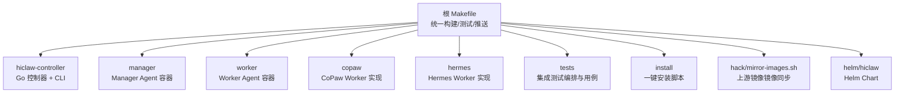
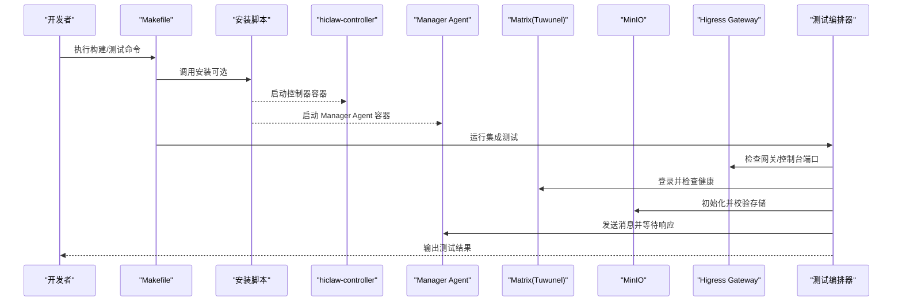
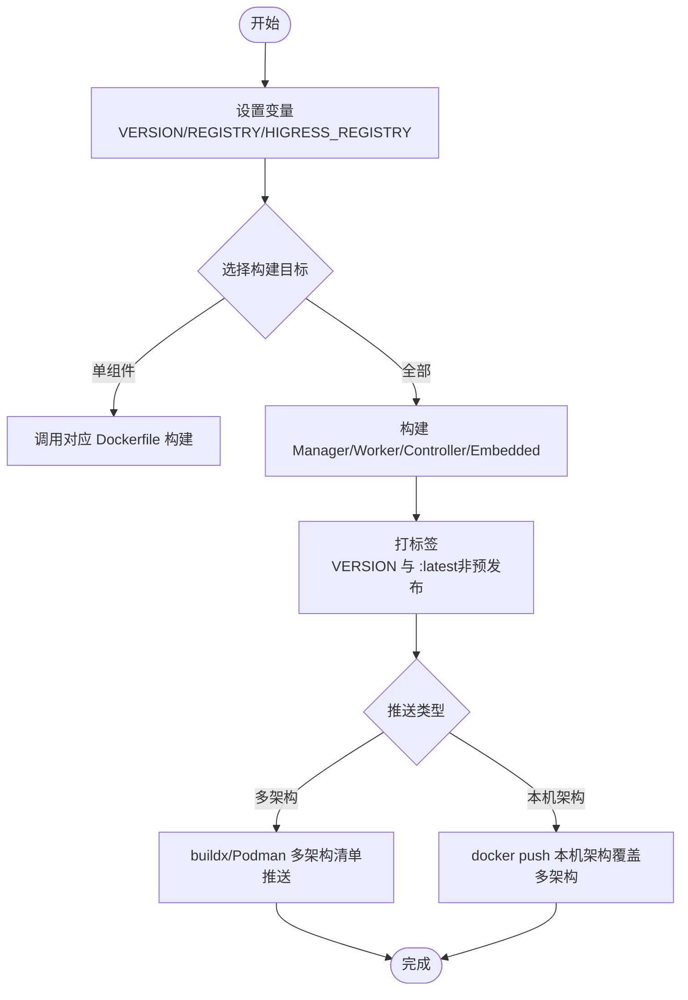
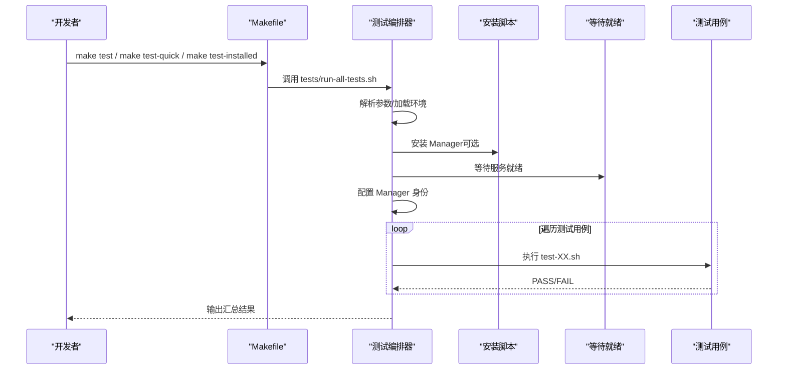
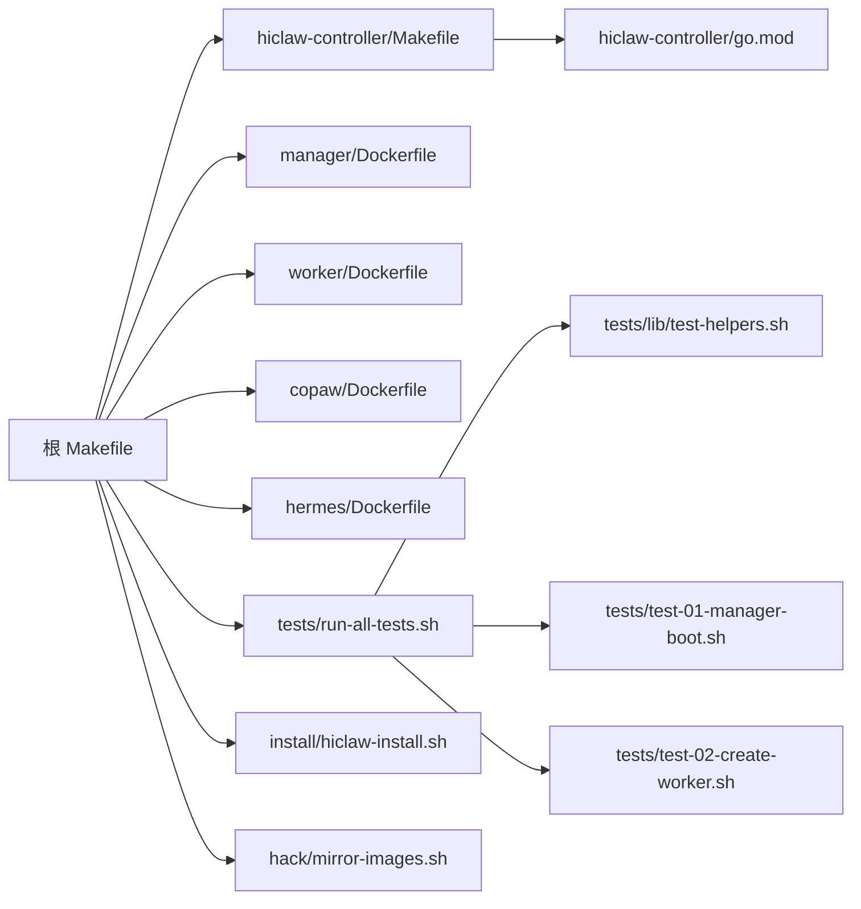

# 构建与测试

<cite>
**本文引用的文件**
- [Makefile](file://Makefile)
- [README.md](file://README.md)
- [hiclaw-controller/Makefile](file://hiclaw-controller/Makefile)
- [hiclaw-controller/go.mod](file://hiclaw-controller/go.mod)
- [hiclaw-controller/cmd/controller/main.go](file://hiclaw-controller/cmd/controller/main.go)
- [tests/run-all-tests.sh](file://tests/run-all-tests.sh)
- [tests/test-01-manager-boot.sh](file://tests/test-01-manager-boot.sh)
- [tests/test-02-create-worker.sh](file://tests/test-02-create-worker.sh)
- [tests/lib/test-helpers.sh](file://tests/lib/test-helpers.sh)
- [install/hiclaw-install.sh](file://install/hiclaw-install.sh)
- [hack/mirror-images.sh](file://hack/mirror-images.sh)
- [manager/Dockerfile](file://manager/Dockerfile)
</cite>

## 目录
1. [简介](#简介)
2. [项目结构](#项目结构)
3. [核心组件](#核心组件)
4. [架构总览](#架构总览)
5. [详细组件分析](#详细组件分析)
6. [依赖关系分析](#依赖关系分析)
7. [性能考虑](#性能考虑)
8. [故障排查指南](#故障排查指南)
9. [结论](#结论)
10. [附录](#附录)

## 简介
本指南面向 HiClaw 项目的开发者与维护者，系统讲解本地构建与镜像推送流程、测试体系与运行方式，并提供测试环境准备、用例执行与结果解读、失败调试与常见问题处理方法。内容覆盖：
- 使用 Makefile 构建 Manager、Worker、控制器等组件
- 多架构镜像构建与推送（含 Podman 与 Docker 差异）
- 测试系统：全量测试、选择性测试、快速测试
- 测试环境准备与配置
- 如何运行特定测试用例与解读结果
- 测试失败时的调试方法与常见问题

## 项目结构
HiClaw 采用多模块协作的工程组织方式，核心目录与职责概览：
- 根 Makefile：统一构建、测试、安装、清理、镜像推送等入口
- hiclaw-controller：Kubernetes 原生控制平面（Go），包含控制器与 CLI
- manager：Manager Agent 容器（OpenClaw/CoPaw/Hermes 可选运行时）
- worker：Worker Agent 容器
- copaw/hermes：第三方运行时 Worker 的实现与测试
- tests：集成测试编排与用例
- install：一键安装脚本
- hack：镜像镜像同步工具
- helm/hiclaw：官方 Helm Chart（Kubernetes 部署）

图示来源
- [Makefile:104-113](file://Makefile#L104-L113)
- [hiclaw-controller/Makefile:1-49](file://hiclaw-controller/Makefile#L1-L49)
- [manager/Dockerfile:1-87](file://manager/Dockerfile#L1-L87)

章节来源
- [Makefile:104-113](file://Makefile#L104-L113)
- [README.md:380-394](file://README.md#L380-L394)

## 核心组件
- Manager（控制器）：负责协调 Worker、管理资源与状态，支持嵌入式模式与 Kubernetes 原生模式
- Worker：执行具体任务的代理容器，支持多种运行时（OpenClaw/QwenPaw/Hermes）
- 控制器（hiclaw-controller）：Kubernetes 原生控制平面，提供 CRD 与控制器逻辑
- 镜像与运行时：通过 Higress Registry 提供基础镜像与多区域镜像加速

章节来源
- [hiclaw-controller/cmd/controller/main.go:16-36](file://hiclaw-controller/cmd/controller/main.go#L16-L36)
- [hiclaw-controller/Makefile:1-49](file://hiclaw-controller/Makefile#L1-L49)
- [manager/Dockerfile:1-87](file://manager/Dockerfile#L1-L87)

## 架构总览
下图展示本地开发与测试的关键交互：Makefile 触发构建与测试；安装脚本启动 Manager 与基础设施；测试编排器驱动各测试用例，验证服务健康、矩阵登录、Higress 控制台、MinIO 存储与 Manager Agent 响应。

图示来源
- [Makefile:517-528](file://Makefile#L517-L528)
- [install/hiclaw-install.sh:1-200](file://install/hiclaw-install.sh#L1-L200)
- [tests/run-all-tests.sh:117-178](file://tests/run-all-tests.sh#L117-L178)

章节来源
- [Makefile:517-528](file://Makefile#L517-L528)
- [tests/run-all-tests.sh:117-178](file://tests/run-all-tests.sh#L117-L178)

## 详细组件分析

### 本地构建与镜像推送
- 统一入口：根 Makefile 提供 build、build-manager、build-worker、build-hiclaw-controller、build-embedded 等目标
- 多架构支持：默认使用 buildx 或 Podman manifest 工作流，按 MULTIARCH_PLATFORMS 指定平台列表
- 区域镜像配置：通过 HIGRESS_REGISTRY 指定基础镜像仓库（默认中国区），支持北美与东南亚镜像
- 版本与标签：VERSION 控制镜像标签；预发布版本不推送 :latest，稳定版本推送 latest
- 推送策略：push 默认构建多架构清单；push-native 仅推送本机架构（会覆盖多架构清单，仅用于开发）

图示来源
- [Makefile:121-226](file://Makefile#L121-L226)
- [Makefile:228-446](file://Makefile#L228-L446)
- [Makefile:452-487](file://Makefile#L452-L487)

章节来源
- [Makefile:121-226](file://Makefile#L121-L226)
- [Makefile:228-446](file://Makefile#L228-L446)
- [Makefile:452-487](file://Makefile#L452-L487)

### 测试系统与运行方式
- 全量测试：make test（或 tests/run-all-tests.sh，默认运行所有 test-*.sh）
- 快速测试：make test-quick（仅运行 test-01）
- 选择性测试：make test TEST_FILTER="01 02" 或 tests/run-all-tests.sh --test-filter "01 02"
- 已有安装测试：make test-installed 或 tests/run-all-tests.sh --use-existing（针对已安装的 Manager）
- 嵌入式模式测试：make test-embedded（embedded 模式安装后运行测试）

测试编排器负责：
- 解析参数（跳过构建、使用现有安装、过滤测试编号）
- 加载环境变量（从 hiclaw-manager.env）
- 安装/等待 Manager 就绪（wait-ready/wait-ready-embedded）
- 配置 Manager 身份（发送身份信息，等待 soul-configured）
- 逐条运行测试用例，统计通过/失败并输出报告

图示来源
- [Makefile:517-534](file://Makefile#L517-L534)
- [tests/run-all-tests.sh:117-178](file://tests/run-all-tests.sh#L117-L178)
- [tests/run-all-tests.sh:319-387](file://tests/run-all-tests.sh#L319-L387)

章节来源
- [Makefile:517-534](file://Makefile#L517-L534)
- [tests/run-all-tests.sh:117-178](file://tests/run-all-tests.sh#L117-L178)
- [tests/run-all-tests.sh:319-387](file://tests/run-all-tests.sh#L319-L387)

### 测试环境准备与配置
- 环境变量来源：hiclaw-manager.env（安装脚本生成），测试编排器会读取其中的管理员账号、MinIO 凭证、注册令牌、Matrix 域名、LLM API Key 等
- 端口映射：Higress 网关、控制台、Element Web 端口由安装脚本注入到环境变量中，测试脚本据此访问
- YOLO 模式：在测试期间自动启用，避免交互提示影响自动化
- 语言与身份：测试前向 Manager 发送身份配置消息，确保后续测试一致性

章节来源
- [tests/run-all-tests.sh:46-68](file://tests/run-all-tests.sh#L46-L68)
- [tests/run-all-tests.sh:155-177](file://tests/run-all-tests.sh#L155-L177)
- [tests/run-all-tests.sh:189-311](file://tests/run-all-tests.sh#L189-L311)

### 如何运行特定测试用例与结果解读
- 运行单个用例：直接执行对应 test-XX.sh（需先安装 Manager 并等待就绪）
- 结果解读：每个用例以 PASS/FAIL 记录；测试编排器最终输出总数、通过数、失败数与失败列表
- 关键断言：测试脚本使用 assert_* 系列函数进行断言（如 HTTP 状态码、内容包含、文件存在等）

章节来源
- [tests/test-01-manager-boot.sh:12-153](file://tests/test-01-manager-boot.sh#L12-L153)
- [tests/test-02-create-worker.sh:13-149](file://tests/test-02-create-worker.sh#L13-L149)
- [tests/run-all-tests.sh:361-387](file://tests/run-all-tests.sh#L361-L387)

### 控制器（hiclaw-controller）构建与测试
- Go 版本与依赖：go.mod 指定 Go 版本与依赖，控制器使用 controller-runtime
- 构建目标：build-controller 与 build-cli，分别输出二进制至 bin/
- 单元测试：test-unit（内部包与命令包）
- 集成测试：test-integration（需要 setup-envtest 自动下载 K8s 测试资产）

章节来源
- [hiclaw-controller/go.mod:1-143](file://hiclaw-controller/go.mod#L1-L143)
- [hiclaw-controller/Makefile:1-49](file://hiclaw-controller/Makefile#L1-L49)
- [hiclaw-controller/cmd/controller/main.go:16-36](file://hiclaw-controller/cmd/controller/main.go#L16-L36)

### 上游镜像镜像同步
- 功能：使用 skopeo 将上游镜像复制到 Higress 主镜像仓库（cn-hangzhou），其他区域镜像自动同步
- 支持：多架构清单复制、容器模式（USE_CONTAINER）、干跑（DRY_RUN）、指定目标仓库与命名空间
- 使用：./hack/mirror-images.sh 或按名称筛选镜像

章节来源
- [hack/mirror-images.sh:1-245](file://hack/mirror-images.sh#L1-L245)

## 依赖关系分析
- 构建链路：根 Makefile 依赖各组件 Dockerfile 与控制器二进制；控制器 Makefile 依赖 go.mod
- 测试链路：测试编排器依赖安装脚本、测试助手库与各测试用例；测试用例依赖 Matrix/MinIO/Higress 等服务
- 外部依赖：Higress Registry、Matrix/Tuwunel、MinIO、Element Web、Higress Gateway

图示来源
- [Makefile:104-113](file://Makefile#L104-L113)
- [hiclaw-controller/Makefile:1-49](file://hiclaw-controller/Makefile#L1-L49)
- [hiclaw-controller/go.mod:1-143](file://hiclaw-controller/go.mod#L1-L143)
- [manager/Dockerfile:1-87](file://manager/Dockerfile#L1-L87)
- [tests/run-all-tests.sh:1-388](file://tests/run-all-tests.sh#L1-L388)
- [tests/lib/test-helpers.sh:1-200](file://tests/lib/test-helpers.sh#L1-L200)
- [tests/test-01-manager-boot.sh:1-153](file://tests/test-01-manager-boot.sh#L1-L153)
- [tests/test-02-create-worker.sh:1-149](file://tests/test-02-create-worker.sh#L1-L149)
- [install/hiclaw-install.sh:1-200](file://install/hiclaw-install.sh#L1-L200)
- [hack/mirror-images.sh:1-245](file://hack/mirror-images.sh#L1-L245)

章节来源
- [Makefile:104-113](file://Makefile#L104-L113)
- [hiclaw-controller/Makefile:1-49](file://hiclaw-controller/Makefile#L1-L49)
- [hiclaw-controller/go.mod:1-143](file://hiclaw-controller/go.mod#L1-L143)
- [manager/Dockerfile:1-87](file://manager/Dockerfile#L1-L87)
- [tests/run-all-tests.sh:1-388](file://tests/run-all-tests.sh#L1-L388)
- [tests/lib/test-helpers.sh:1-200](file://tests/lib/test-helpers.sh#L1-L200)
- [tests/test-01-manager-boot.sh:1-153](file://tests/test-01-manager-boot.sh#L1-L153)
- [tests/test-02-create-worker.sh:1-149](file://tests/test-02-create-worker.sh#L1-L149)
- [install/hiclaw-install.sh:1-200](file://install/hiclaw-install.sh#L1-L200)
- [hack/mirror-images.sh:1-245](file://hack/mirror-images.sh#L1-L245)

## 性能考虑
- 多架构构建：buildx/Podman 多架构清单构建耗时较长，建议在 CI 中缓存构建上下文与中间层
- 镜像体积：Manager/Worker 基于 openclaw-base，注意减少不必要的层与文件拷贝
- 测试并发：测试编排器逐条执行测试，避免并发对服务状态造成干扰
- 端口占用：测试前确保宿主机端口未被占用，避免 lsof 在 Kind/Docker-in-Docker 场景下的阻塞

## 故障排查指南
- 服务未就绪：使用 make wait-ready 或 make wait-ready-embedded 检查 Matrix/MinIO/Gateway 健康状态
- 日志查看：make logs 查看控制器与 Worker 最近日志；必要时进入容器查看 /var/log/hiclaw/manager-agent-error.log
- 环境变量缺失：确认 hiclaw-manager.env 是否存在且包含 TEST_ADMIN_USER/TEST_ADMIN_PASSWORD/TEST_REGISTRATION_TOKEN/TEST_MATRIX_DOMAIN/HICLAW_LLM_API_KEY 等
- 网络与端口：确认 HICLAW_PORT_GATEWAY/HICLAW_PORT_CONSOLE/HICLAW_PORT_ELEMENT_WEB 映射正确
- 预发布版本标签：预发布版本不会推送 :latest，若期望使用 latest，请改用稳定版本号
- 多架构覆盖风险：使用 make push-native 会覆盖多架构清单，仅限开发场景

章节来源
- [Makefile:495-515](file://Makefile#L495-L515)
- [Makefile:700-708](file://Makefile#L700-L708)
- [tests/run-all-tests.sh:46-68](file://tests/run-all-tests.sh#L46-L68)
- [tests/test-02-create-worker.sh:84-88](file://tests/test-02-create-worker.sh#L84-L88)

## 结论
通过根 Makefile 的统一入口与测试编排器，HiClaw 提供了从本地构建、镜像推送、安装到测试的完整闭环。结合多架构支持与区域镜像配置，可在不同环境下高效迭代与验证。建议在本地开发中优先使用快速测试与选择性测试，在 CI 中执行全量测试以保障质量。

## 附录
- 常用命令
  - 构建：make build / make build-manager / make build-worker / make build-hiclaw-controller / make build-embedded
  - 测试：make test / make test-quick / make test-installed / make test-embedded
  - 推送：make push / make push-native / make push-manager / make push-worker
  - 辅助：make status / make logs / make clean / make mirror-images

章节来源
- [Makefile:766-800](file://Makefile#L766-L800)
- [README.md:380-394](file://README.md#L380-L394)