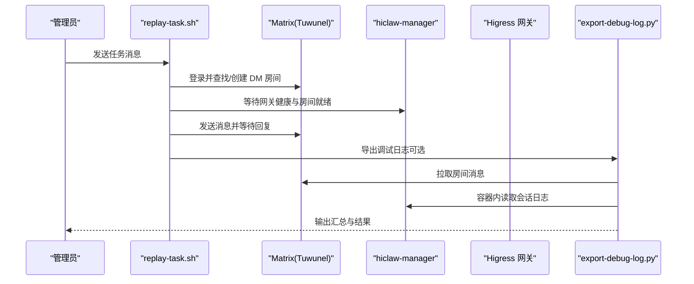
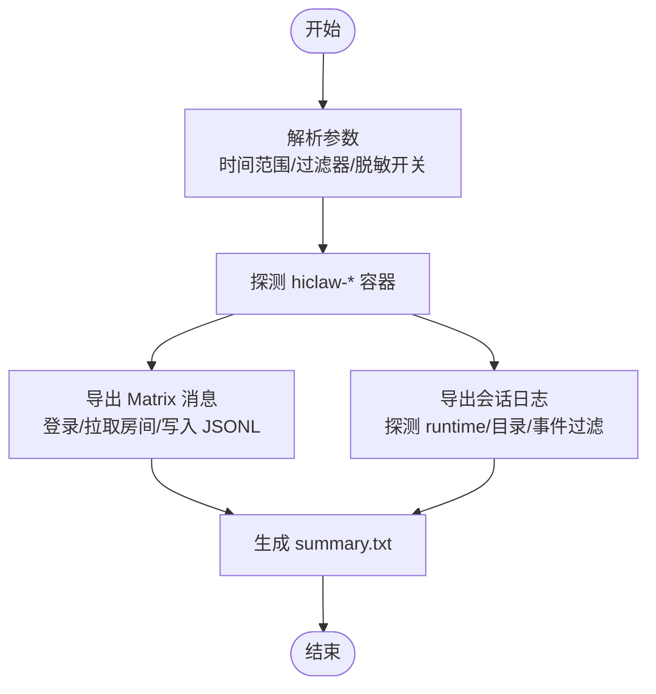
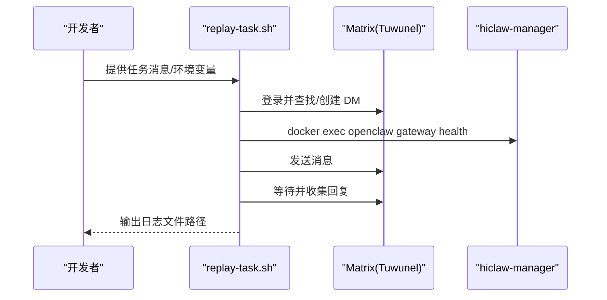
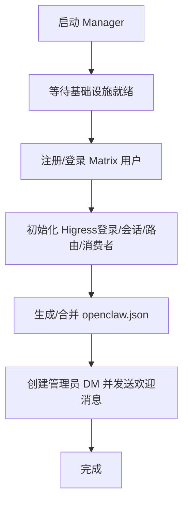
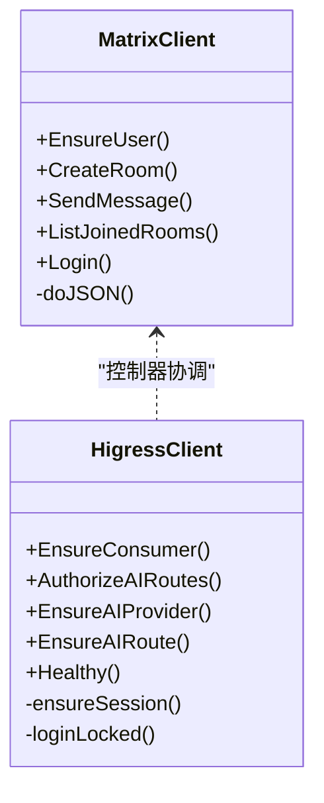
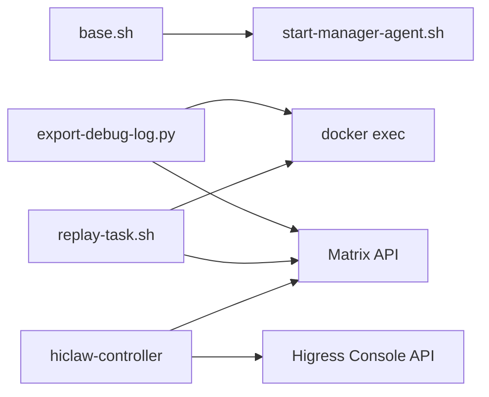

# 调试与故障排除

<cite>
**本文引用的文件**
- [export-debug-log.py](file://scripts/export-debug-log.py)
- [replay-task.sh](file://scripts/replay-task.sh)
- [hiclaw-debug.sh](file://tests/skills/hiclaw-test/scripts/hiclaw-debug.sh)
- [start-manager-agent.sh](file://manager/scripts/init/start-manager-agent.sh)
- [base.sh](file://manager/scripts/lib/base.sh)
- [higress.go](file://hiclaw-controller/internal/gateway/higress.go)
- [client.go](file://hiclaw-controller/internal/matrix/client.go)
- [main.go](file://hiclaw-controller/cmd/hiclaw/main.go)
- [Dockerfile（Manager）](file://manager/Dockerfile)
- [FAQ（中文）](file://docs/zh-cn/faq.md)
</cite>

## 目录
1. [简介](#简介)
2. [项目结构](#项目结构)
3. [核心组件](#核心组件)
4. [架构总览](#架构总览)
5. [详细组件分析](#详细组件分析)
6. [依赖分析](#依赖分析)
7. [性能考虑](#性能考虑)
8. [故障排除指南](#故障排除指南)
9. [结论](#结论)
10. [附录](#附录)

## 简介
本指南面向 HiClaw 用户与维护者，提供系统化的调试与故障排除方法，涵盖以下方面：
- 如何查看各组件日志（Manager、Controller、Higress、Matrix 服务器等）
- 日志采集与分析（导出调试日志、分析挂起问题）
- 常见错误诊断（Node.js 版本、OpenClaw 配置、Higress 设置等）
- 交互式调试技巧（容器内 shell 访问、状态检查、会话重置）
- 使用 replay 功能进行任务调试
- 性能问题排查与优化建议

## 项目结构
HiClaw 采用多容器架构，核心组件包括：
- hiclaw-controller：控制器与基础设施（Higress、Tuwunel、MinIO、Element Web）
- hiclaw-manager：Manager Agent 容器（轻量级，仅运行 Agent）
- Worker 容器：可选 OpenClaw、CoPaw（QwenPaw）、Hermes 运行时
- Matrix（Tuwunel）与 AI 网关（Higress）通过控制器统一管理

```mermaid
graph TB
subgraph "控制器与基础设施"
Controller["hiclaw-controller<br/>REST API + 管理器"]
Higress["Higress 网关"]
Tuwunel["Matrix(Homeserver)<br/>Tuwunel"]
MinIO["对象存储<br/>MinIO"]
Element["Web 客户端<br/>Element Web"]
end
subgraph "Manager"
Manager["hiclaw-manager<br/>Manager Agent"]
end
subgraph "Workers"
WorkerOC["Worker OpenClaw"]
WorkerCP["Worker CoPaw/QwenPaw"]
WorkerHM["Worker Hermes"]
end
Controller --> Higress
Controller --> Tuwunel
Controller --> MinIO
Controller --> Element
Manager --> Tuwunel
WorkerOC --> Tuwunel
WorkerCP --> Tuwunel
WorkerHM --> Tuwunel
Manager --> Higress
WorkerOC --> Higress
WorkerCP --> Higress
WorkerHM --> Higress
```

图示来源
- [start-manager-agent.sh:106-129](file://manager/scripts/init/start-manager-agent.sh#L106-L129)
- [Dockerfile（Manager）:24-87](file://manager/Dockerfile#L24-L87)

章节来源
- [start-manager-agent.sh:106-129](file://manager/scripts/init/start-manager-agent.sh#L106-L129)
- [Dockerfile（Manager）:24-87](file://manager/Dockerfile#L24-L87)

## 核心组件
- 导出调试日志工具：用于采集 Matrix 消息与 Agent 会话日志，支持时间范围过滤、容器/房间筛选、PII 脱敏与辅助文件导出。
- Replay 任务脚本：以管理员身份向 Manager 发送任务消息并可等待回复，内置健康检查与日志记录。
- Manager 启动脚本：负责等待基础设施就绪、注册 Matrix 用户、初始化 Higress、生成 Agent 配置等。
- 控制器与矩阵客户端：提供 Matrix 操作封装与错误处理，Higress 客户端负责网关配置与健康检查。
- FAQ 文档：提供常见问题定位与修复路径。

章节来源
- [export-debug-log.py:1-756](file://scripts/export-debug-log.py#L1-L756)
- [replay-task.sh:1-416](file://scripts/replay-task.sh#L1-L416)
- [start-manager-agent.sh:106-129](file://manager/scripts/init/start-manager-agent.sh#L106-L129)
- [client.go:1-724](file://hiclaw-controller/internal/matrix/client.go#L1-L724)
- [higress.go:1-631](file://hiclaw-controller/internal/gateway/higress.go#L1-L631)
- [FAQ（中文）:606-633](file://docs/zh-cn/faq.md#L606-L633)

## 架构总览
下图展示调试相关的组件交互与数据流：



图示来源
- [replay-task.sh:298-362](file://scripts/replay-task.sh#L298-L362)
- [export-debug-log.py:242-326](file://scripts/export-debug-log.py#L242-L326)
- [client.go:131-225](file://hiclaw-controller/internal/matrix/client.go#L131-L225)

## 详细组件分析

### 组件 A：导出调试日志工具（export-debug-log.py）
- 功能要点
  - 支持按时间范围导出（分钟/小时/天）
  - 支持容器与房间过滤
  - 自动脱敏（PII 规则覆盖身份证、电话、邮箱、银行卡、IP、AK/SK、密钥、令牌等）
  - 导出结构：summary.txt、matrix-messages/*.jsonl、agent-sessions/<container>/<runtime>.jsonl
  - 自动探测容器内的会话目录，兼容 OpenClaw、CoPaw、Hermes
  - 支持 Matrix 登录与 API 调用，抓取消息与会话事件
- 使用建议
  - 优先使用 --range 指定最近 1 小时或 1 天
  - 使用 --container/--room 精确到目标容器/房间
  - 使用 --no-redact 仅在需要人工审阅时开启
  - 结合 hiclaw-debug.sh 的分析功能，快速定位“PHASE DONE”遗漏 @manager 的问题



图示来源
- [export-debug-log.py:677-756](file://scripts/export-debug-log.py#L677-L756)
- [export-debug-log.py:242-326](file://scripts/export-debug-log.py#L242-L326)
- [export-debug-log.py:329-671](file://scripts/export-debug-log.py#L329-L671)

章节来源
- [export-debug-log.py:1-756](file://scripts/export-debug-log.py#L1-L756)

### 组件 B：Replay 任务调试（replay-task.sh）
- 功能要点
  - 以管理员身份登录 Matrix，查找或创建与 Manager 的 DM 房间
  - 等待 Manager OpenClaw 网关健康与房间就绪
  - 发送任务消息并可等待回复，支持超时与进度提示
  - 将对话历史写入 logs/replay/replay-<ts>.log，便于复盘
- 使用建议
  - 通过环境变量 HICLAW_ADMIN_PASSWORD、HICLAW_MATRIX_DOMAIN、REPLAY_WAIT/REPLAY_TIMEOUT 控制行为
  - 使用 REPLAY_USE_DOCKER_EXEC=1 强制通过容器内 Matrix API 调用，避免主机代理干扰
  - 若 Manager 未就绪，先检查容器日志与 Higress 健康状态



图示来源
- [replay-task.sh:298-362](file://scripts/replay-task.sh#L298-L362)
- [replay-task.sh:380-410](file://scripts/replay-task.sh#L380-L410)

章节来源
- [replay-task.sh:1-416](file://scripts/replay-task.sh#L1-L416)

### 组件 C：Manager 启动与基础设施初始化（start-manager-agent.sh）
- 关键职责
  - 等待 Higress、Tuwunel、MinIO 等基础设施就绪
  - 注册 Matrix 用户（admin、manager），获取访问令牌
  - 初始化 Higress（登录、会话校验、路由/消费者配置）
  - 生成 Manager 的 openclaw.json（模型、令牌、E2EE、网关端口等）
  - 创建管理员 DM 房间并发送欢迎消息（非 K8s 模式）
- 故障排查要点
  - 健康检查失败：检查 waitForService/waitForHTTP 的超时与返回码
  - Matrix 登录失败：核对 HICLAW_ADMIN_USER/HICLAW_ADMIN_PASSWORD 与注册令牌
  - Higress 初始化失败：检查 Console 登录与 Cookie 有效性
  - openclaw.json 缺失或字段缺失：确认生成逻辑与覆盖策略



图示来源
- [start-manager-agent.sh:106-129](file://manager/scripts/init/start-manager-agent.sh#L106-L129)
- [start-manager-agent.sh:226-290](file://manager/scripts/init/start-manager-agent.sh#L226-L290)
- [start-manager-agent.sh:298-464](file://manager/scripts/init/start-manager-agent.sh#L298-L464)
- [start-manager-agent.sh:620-790](file://manager/scripts/init/start-manager-agent.sh#L620-L790)

章节来源
- [start-manager-agent.sh:1-800](file://manager/scripts/init/start-manager-agent.sh#L1-L800)
- [base.sh:7-47](file://manager/scripts/lib/base.sh#L7-L47)

### 组件 D：控制器与矩阵/Higress 客户端（client.go、higress.go）
- Matrix 客户端
  - 提供 EnsureUser、CreateRoom、SendMessage、ListJoinedRooms 等接口
  - 错误处理包含状态码解析、响应体截断、认证失效清理等
- Higress 客户端
  - 负责 Console 登录、会话缓存、AI 路由/消费者授权、域/服务源/静态服务源/路由管理
  - 健康检查与幂等创建（409 忽略）



图示来源
- [client.go:16-87](file://hiclaw-controller/internal/matrix/client.go#L16-L87)
- [higress.go:17-32](file://hiclaw-controller/internal/gateway/higress.go#L17-L32)

章节来源
- [client.go:1-724](file://hiclaw-controller/internal/matrix/client.go#L1-L724)
- [higress.go:1-631](file://hiclaw-controller/internal/gateway/higress.go#L1-L631)

### 组件 E：CLI 入口与控制器（hiclaw main.go）
- hiclaw CLI 提供资源管理能力（create/get/update/delete/worker/status/version），通过环境变量 HICLAW_CONTROLLER_URL/HICLAW_AUTH_TOKEN/HICLAW_AUTH_TOKEN_FILE 配置
- 建议在容器内或通过安装脚本注入凭据，避免明文泄露

章节来源
- [main.go:9-34](file://hiclaw-controller/cmd/hiclaw/main.go#L9-L34)

## 依赖分析
- Manager 启动脚本依赖基础库（等待服务、生成密钥、日志函数）
- 导出调试日志工具依赖 Docker exec、Matrix API、容器内会话目录布局
- Replay 任务脚本依赖 Matrix API、容器内 openclaw 健康检查
- 控制器组件依赖 Higress Console API、Matrix 客户端



图示来源
- [base.sh:1-61](file://manager/scripts/lib/base.sh#L1-L61)
- [export-debug-log.py:126-139](file://scripts/export-debug-log.py#L126-L139)
- [replay-task.sh:59-69](file://scripts/replay-task.sh#L59-L69)
- [higress.go:463-544](file://hiclaw-controller/internal/gateway/higress.go#L463-L544)
- [client.go:645-692](file://hiclaw-controller/internal/matrix/client.go#L645-L692)

章节来源
- [base.sh:1-61](file://manager/scripts/lib/base.sh#L1-L61)
- [export-debug-log.py:126-139](file://scripts/export-debug-log.py#L126-L139)
- [replay-task.sh:59-69](file://scripts/replay-task.sh#L59-L69)
- [higress.go:463-544](file://hiclaw-controller/internal/gateway/higress.go#L463-L544)
- [client.go:645-692](file://hiclaw-controller/internal/matrix/client.go#L645-L692)

## 性能考虑
- 会话日志体量大：导出时建议限定时间范围与容器/房间，避免一次性处理过多数据
- 网关延迟：Higress 路由与消费者授权可能成为瓶颈，关注路由数量与冲突（409）
- 磁盘与 IO：MinIO 初始化与 mc 同步可能占用 IO，首次启动时注意磁盘空间
- 模型上下文窗口：模型切换需同步更新 contextWindow/maxTokens，避免频繁压缩导致延迟

## 故障排除指南

### 一、日志查看与导出
- 查看 Manager Agent 日志
  - 容器日志：docker logs hiclaw-manager
  - Session 日志：docker exec -it hiclaw-manager ls .openclaw/agents/main/sessions/
  - 控制器/基础设施日志：docker logs hiclaw-controller
  - Higress 网关/控制台日志：docker exec -it hiclaw-controller cat /var/log/hiclaw/higress-gateway.log /var/log/hiclaw/higress-console.log
- 使用导出工具
  - python scripts/export-debug-log.py --range 1h
  - 指定容器/房间过滤：--container/--room
  - 禁用脱敏：--no-redact
- 使用 hiclaw-debug.sh
  - 导出并分析挂起问题：hiclaw-debug.sh all 1h

章节来源
- [FAQ（中文）:606-633](file://docs/zh-cn/faq.md#L606-L633)
- [export-debug-log.py:677-756](file://scripts/export-debug-log.py#L677-L756)
- [hiclaw-debug.sh:45-176](file://tests/skills/hiclaw-test/scripts/hiclaw-debug.sh#L45-L176)

### 二、交互式调试技巧
- 容器内 shell 访问
  - docker exec -it hiclaw-manager sh
  - docker exec -it hiclaw-controller sh
- 状态检查
  - Manager 网关健康：docker exec hiclaw-manager openclaw gateway health --json
  - 基础设施就绪：start-manager-agent.sh 中的 waitForService/waitForHTTP
- 会话重置
  - 在 Element Web 对应会话输入 /new 重置
  - 使用 OpenClaw TUI 查看 sessions 并切换 session

章节来源
- [replay-task.sh:329-362](file://scripts/replay-task.sh#L329-L362)
- [start-manager-agent.sh:106-129](file://manager/scripts/init/start-manager-agent.sh#L106-L129)
- [FAQ（中文）:518-535](file://docs/zh-cn/faq.md#L518-L535)

### 三、常见错误诊断

- Node.js 版本问题
  - 现象：OpenClaw 启动时报语法错误或 require Node >=22
  - 原因：旧版 Node.js 或系统安装的 Node 版本过低
  - 解决：确保 Manager 使用 openclaw-base 镜像；Worker 使用构建阶段的 Node.js 22
  - 参考：docs/zh-cn/development.md 中的常见问题表

- OpenClaw 配置问题
  - 现象：缺少网关配置或认证 token
  - 原因：openclaw.json 中缺少 gateway 或 accessToken
  - 解决：检查 start-manager-agent.sh 生成逻辑与覆盖策略，确认 token 写入

- Higress 设置问题
  - 现象：Higress 控制台初始化失败、登录失败、409 冲突
  - 原因：会话 Cookie 失效、路由已存在、消费者未创建
  - 解决：重试登录、使用幂等 API、检查 Console 状态与 Cookie 文件

- Matrix 通道问题
  - 现象：Manager 不回复、404/503 状态码
  - 原因：会话损坏、Higress 路由异常、上游服务不可达
  - 解决：重置会话、查看 Higress 日志、确认模型名称与路由配置

- 网络代理问题
  - 现象：健康检查返回 503、localhost 被代理拦截
  - 原因：http_proxy 拦截 localhost
  - 解决：设置 no_proxy=localhost,127.0.0.1,::1

章节来源
- [FAQ（中文）:483-590](file://docs/zh-cn/faq.md#L483-L590)
- [start-manager-agent.sh:298-464](file://manager/scripts/init/start-manager-agent.sh#L298-L464)
- [higress.go:34-135](file://hiclaw-controller/internal/gateway/higress.go#L34-L135)
- [client.go:131-225](file://hiclaw-controller/internal/matrix/client.go#L131-L225)

### 四、使用 replay 功能进行任务调试
- 步骤
  - 设置 HICLAW_ADMIN_PASSWORD、HICLAW_MATRIX_DOMAIN
  - 运行 ./scripts/replay-task.sh "你的任务描述"
  - 查看 logs/replay/replay-<ts>.log 获取完整对话历史
- 注意事项
  - 使用 REPLAY_USE_DOCKER_EXEC=1 强制容器内 Matrix API 调用
  - 调整 REPLAY_WAIT/REPLAY_TIMEOUT 控制等待行为

章节来源
- [replay-task.sh:12-20](file://scripts/replay-task.sh#L12-L20)
- [replay-task.sh:298-362](file://scripts/replay-task.sh#L298-L362)
- [replay-task.sh:380-410](file://scripts/replay-task.sh#L380-L410)

### 五、性能问题排查与优化
- 指标与报告
  - 使用 tests/lib/agent-metrics.sh 的指标报告与阈值断言，对比基线评估性能变化
- 优化建议
  - 合理设置模型上下文窗口与 maxTokens，减少压缩频率
  - 优化 Higress 路由数量与消费者授权策略，避免冲突
  - 控制导出时间范围与过滤器，降低日志处理开销

章节来源
- [agent-metrics.sh:929-1224](file://tests/lib/agent-metrics.sh#L929-L1224)

## 结论
通过结合导出调试日志工具、replay 任务脚本与交互式容器调试，能够快速定位并解决 HiClaw 在 Manager、Controller、Higress、Matrix 等组件中的常见问题。建议在日常运维中定期导出日志、建立基线指标，并在变更后进行回归验证，以保持系统的稳定性与可观测性。

## 附录

### A. 常用命令速查
- 查看版本与状态
  - docker exec hiclaw-manager cat /opt/hiclaw/agent/.builtin-version
  - docker logs hiclaw-controller
  - docker logs hiclaw-manager
- 生成调试日志
  - python scripts/export-debug-log.py --range 1h
  - python scripts/export-debug-log.py --range 1h --container hiclaw-manager --room Worker
- 使用 replay 调试
  - HICLAW_ADMIN_PASSWORD=... ./scripts/replay-task.sh "创建一个 Worker alice"
- 会话重置
  - 在 Element Web 会话输入 /new
  - docker exec -it hiclaw-manager openclaw tui 查看 sessions

章节来源
- [FAQ（中文）:29-42](file://docs/zh-cn/faq.md#L29-L42)
- [FAQ（中文）:606-633](file://docs/zh-cn/faq.md#L606-L633)
- [export-debug-log.py:677-756](file://scripts/export-debug-log.py#L677-L756)
- [replay-task.sh:12-20](file://scripts/replay-task.sh#L12-L20)
- [FAQ（中文）:518-535](file://docs/zh-cn/faq.md#L518-L535)