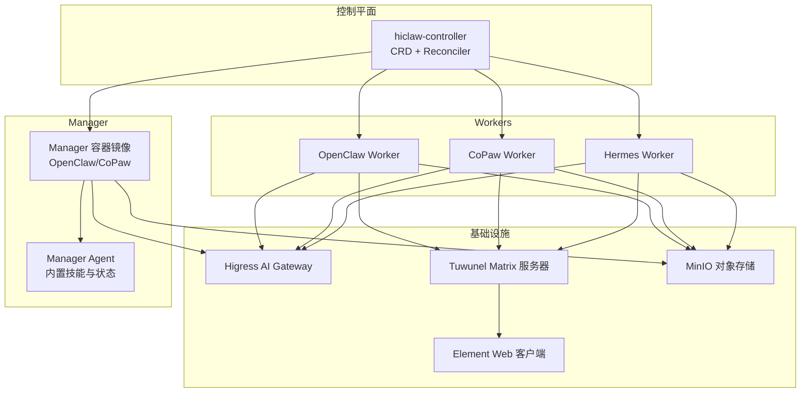
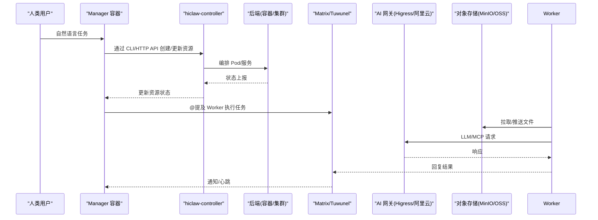
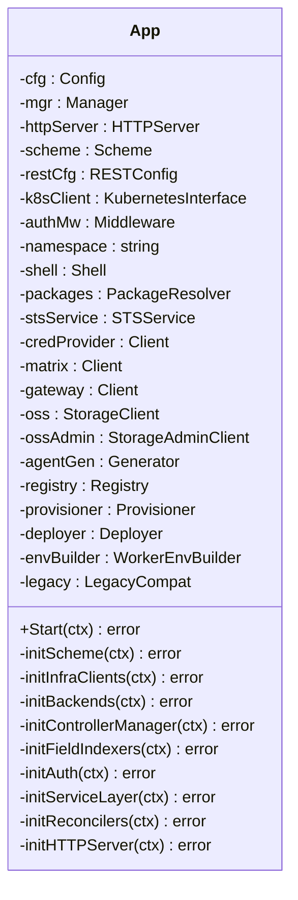
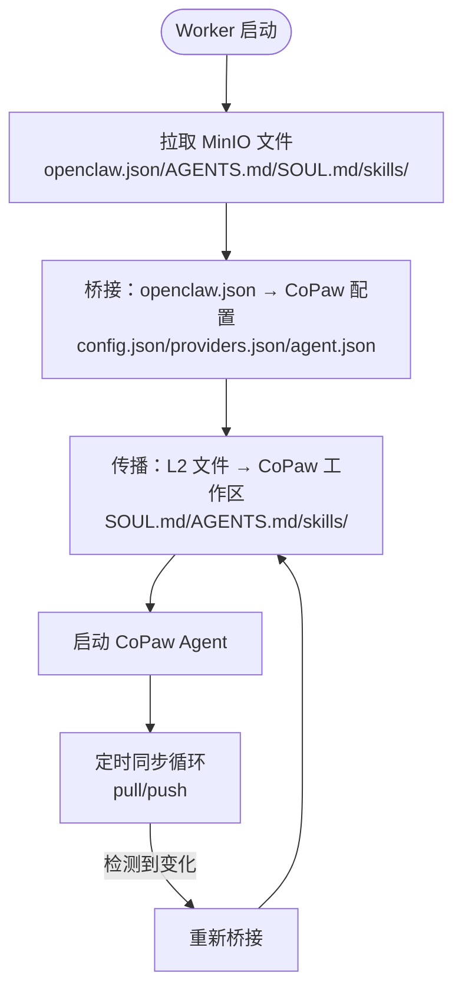
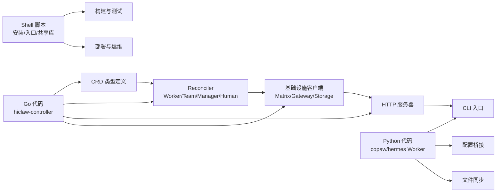

# 项目结构说明

<cite>
**本文档引用的文件**
- [README.md](file://README.md)
- [Makefile](file://Makefile)
- [hiclaw-controller/go.mod](file://hiclaw-controller/go.mod)
- [hiclaw-controller/cmd/controller/main.go](file://hiclaw-controller/cmd/controller/main.go)
- [hiclaw-controller/internal/app/app.go](file://hiclaw-controller/internal/app/app.go)
- [hiclaw-controller/api/v1beta1/types.go](file://hiclaw-controller/api/v1beta1/types.go)
- [copaw/pyproject.toml](file://copaw/pyproject.toml)
- [copaw/Dockerfile](file://copaw/Dockerfile)
- [copaw/src/copaw_worker/cli.py](file://copaw/src/copaw_worker/cli.py)
- [hermes/pyproject.toml](file://hermes/pyproject.toml)
- [manager/Dockerfile](file://manager/Dockerfile)
- [manager/agent/AGENTS.md](file://manager/agent/AGENTS.md)
- [copaw/AGENTS.md](file://copaw/AGENTS.md)
</cite>

## 目录
1. [简介](#简介)
2. [项目结构概览](#项目结构概览)
3. [核心组件与职责](#核心组件与职责)
4. [架构总览](#架构总览)
5. [详细组件分析](#详细组件分析)
6. [依赖关系与数据流](#依赖关系与数据流)
7. [配置文件与构建系统](#配置文件与构建系统)
8. [开发与部署指南](#开发与部署指南)
9. [故障排查](#故障排查)
10. [结论](#结论)

## 简介

HiClaw 是一个开源的企业级多智能体协作运行时平台，采用“Manager-Workers 架构”，通过 Kubernetes 原生控制平面（CRD + Controller）与多种 Worker 运行时（OpenClaw、CoPaw、Hermes）协同工作，实现人类与智能体在受控、可审计的聊天室中进行协作。

- 核心特性：Manager-Workers 架构、多运行时协作、MinIO 共享文件系统、Higress AI 网关、Element + Tuwunel Matrix 协议通信、声明式资源管理（Worker/Team/Human YAML）、零配置 IM、一键安装等。
- 项目目标：消除人类对单个 Worker 的直接运维负担，让智能体管理其他智能体；在企业环境中实现安全可控的多智能体协作。

**章节来源**
- [README.md:13-30](file://README.md#L13-L30)
- [README.md:305-333](file://README.md#L305-L333)

## 项目结构概览

项目采用分层与按功能域划分的组织方式：
- hiclaw-controller：Kubernetes 原生控制平面，负责 Worker/Team/Manager 资源的声明式管理与生命周期编排。
- manager：Manager 容器镜像与内置 Agent 内容，支持 OpenClaw 与 CoPaw 两种运行时。
- worker：通用 Worker 容器镜像（默认 OpenClaw），配合控制器进行编排。
- copaw：CoPaw Worker 运行时的 Python 实现及其容器镜像。
- hermes：基于 hermes-agent 的 Worker 运行时（Python）及其容器镜像。
- shared：跨组件共享的脚本与工具库。
- install：安装与卸载脚本。
- tests：集成测试套件。
- docs/blog/changelog：文档、博客与变更日志。
- helm/hiclaw：官方 Helm 图表，用于在 Kubernetes 上一键部署。

**图表来源**
- [README.md:305-333](file://README.md#L305-L333)
- [hiclaw-controller/cmd/controller/main.go:16-36](file://hiclaw-controller/cmd/controller/main.go#L16-L36)
- [manager/Dockerfile:13-86](file://manager/Dockerfile#L13-L86)

**章节来源**
- [README.md:15-30](file://README.md#L15-L30)
- [README.md:305-333](file://README.md#L305-L333)

## 核心组件与职责

- hiclaw-controller
  - Kubernetes 控制器，负责 Worker/Team/Manager CRD 的创建、更新、删除与状态同步。
  - 提供 HTTP API 以支持 CLI 与自动化工具。
  - 集成网关（Higress 或阿里云 AI Gateway）、对象存储（MinIO 或 OSS）、Matrix 客户端与凭据提供方。
  - 支持嵌入式（embedded）与集群内（incluster）两种模式。

- Manager（Manager 容器）
  - 承载 Manager Agent，负责接收自然语言指令并协调 Worker/Team。
  - 支持 OpenClaw 与 CoPaw 两种运行时，通过环境变量切换。
  - 内置大量技能（技能生态来自 skills.sh），覆盖任务管理、团队协作、文件同步、模型切换等。

- Worker（Worker 容器）
  - 承载具体执行任务的智能体，支持 OpenClaw、CoPaw、Hermes 三种运行时。
  - 通过 MinIO 同步 Agent 规范与技能，确保无状态化与可审计性。
  - 通过 Matrix 与 Manager/人类进行可见、可干预的协作。

- Copaw 子系统
  - CoPaw Worker 的 Python 实现，包含 CLI、配置桥接、文件同步与容器入口脚本。
  - 将 HiClaw 的 OpenClaw 风格规范转换为 CoPaw 原生配置布局。

- Hermes 子系统
  - 基于 hermes-agent 的 Worker 运行时，适合自主编码与自适应技能。
  - 提供 CLI、适配器与容器镜像。

- 共享库与脚本
  - 提供跨组件的共享脚本（如 mc 包装器、环境初始化、技能合并等）。

**章节来源**
- [hiclaw-controller/internal/app/app.go:41-79](file://hiclaw-controller/internal/app/app.go#L41-L79)
- [manager/Dockerfile:24-86](file://manager/Dockerfile#L24-L86)
- [copaw/Dockerfile:24-131](file://copaw/Dockerfile#L24-L131)
- [hermes/pyproject.toml:5-37](file://hermes/pyproject.toml#L5-L37)

## 架构总览

HiClaw 的架构围绕“声明式资源 + 控制器 + 多运行时 Worker”的组合展开。控制器负责将用户 YAML（Worker/Team/Manager）转换为实际的 Pod/服务，并维护其生命周期与状态；Manager 作为“首席助理”协调任务；Worker 在 Matrix 中与 Manager/人类交互，通过 MinIO 共享状态与文件。

**图表来源**
- [hiclaw-controller/internal/app/app.go:111-175](file://hiclaw-controller/internal/app/app.go#L111-L175)
- [hiclaw-controller/api/v1beta1/types.go:63-153](file://hiclaw-controller/api/v1beta1/types.go#L63-L153)

**章节来源**
- [README.md:240-299](file://README.md#L240-L299)
- [hiclaw-controller/internal/app/app.go:111-175](file://hiclaw-controller/internal/app/app.go#L111-L175)

## 详细组件分析

### hiclaw-controller 组件

- 初始化流程
  - 构建 Scheme、注册 CRD。
  - 初始化基础设施客户端（Matrix、网关、对象存储）。
  - 构建后端注册表（Docker/Kubernetes）。
  - 初始化认证中间件（TokenReview、权限增强、授权）。
  - 初始化服务层（资源供应、部署器、环境构建器）。
  - 注册 Reconciler（Worker/Team/Human/Manager）。
  - 启动 HTTP 服务器。

- 关键职责
  - 将 CRD 规范转换为后端 Pod/服务。
  - 通过凭据提供方与 STS 获取临时凭证，避免 Worker 直接持有真实密钥。
  - 通过文件观察器与 HTTP API 支持本地嵌入式模式。

**图表来源**
- [hiclaw-controller/internal/app/app.go:41-79](file://hiclaw-controller/internal/app/app.go#L41-L79)

**章节来源**
- [hiclaw-controller/internal/app/app.go:81-175](file://hiclaw-controller/internal/app/app.go#L81-L175)
- [hiclaw-controller/cmd/controller/main.go:16-36](file://hiclaw-controller/cmd/controller/main.go#L16-L36)

### Manager 容器与 Agent

- 容器镜像
  - 基于 openclaw-base，包含 hiclaw CLI、MinIO 客户端 mc、内置可观测性插件。
  - 通过环境变量 HICLAW_RUNTIME 切换运行时（openclaw/copaw）。
  - 工作区位于 /root/manager-workspace，包含 SOUL/AGENTS/memory/state 等。

- Agent 行为
  - Manager Agent 通过技能生态完成任务编排、团队管理、文件同步、模型切换等。
  - 支持 YOLO 模式（管理员不可达时自动决策）。
  - 严格遵守隐私与权限规则，禁止未授权访问主机文件。

**章节来源**
- [manager/Dockerfile:13-86](file://manager/Dockerfile#L13-L86)
- [manager/agent/AGENTS.md:1-220](file://manager/agent/AGENTS.md#L1-L220)

### CoPaw Worker 子系统

- 容器镜像
  - 基于 Python 3.11，安装 copaw 与 copaw-worker，提供 mc、Node.js、NPM 工具链。
  - 通过入口脚本启动 Worker，使用 jemalloc 降低内存碎片。

- 运行时桥接
  - 将 HiClaw 的 openclaw.json 转换为 CoPaw 原生配置（config.json/providers.json/agent.json）。
  - 文件同步通过 mc mirror/cp 实现 MinIO ↔ 本地工作区的双向同步。
  - 支持热更新：当 MinIO 中的 openclaw.json 发生变化时，触发重新桥接与传播。

**图表来源**
- [copaw/Dockerfile:24-131](file://copaw/Dockerfile#L24-L131)
- [copaw/src/copaw_worker/cli.py:21-68](file://copaw/src/copaw_worker/cli.py#L21-L68)
- [copaw/AGENTS.md:55-139](file://copaw/AGENTS.md#L55-L139)

**章节来源**
- [copaw/Dockerfile:24-131](file://copaw/Dockerfile#L24-L131)
- [copaw/src/copaw_worker/cli.py:21-68](file://copaw/src/copaw_worker/cli.py#L21-L68)
- [copaw/AGENTS.md:140-173](file://copaw/AGENTS.md#L140-L173)

### Hermes Worker 子系统

- 容器镜像
  - 基于 Python 环境，安装 mautrix、matrix-nio、Markdown 等依赖。
  - 通过 hermes-worker CLI 启动，连接 Matrix 并与 Manager/人类交互。

- 运行时特性
  - 适合自主编码与自适应技能，具备终端沙箱与持久记忆能力。
  - 通过 MCP 服务器与外部工具交互，统一由网关进行路由与鉴权。

**章节来源**
- [hermes/pyproject.toml:5-37](file://hermes/pyproject.toml#L5-L37)

## 依赖关系与数据流

- 语言与模块分工
  - Go：hiclaw-controller（Kubernetes 控制器、HTTP 服务、基础设施客户端、服务层、Reconciler）。
  - Python：Copaw Worker（CLI、桥接、文件同步、容器入口）、Hermes Worker（CLI、适配器）。
  - Shell：安装脚本、容器入口脚本、共享库脚本。

- 关键依赖
  - Go 依赖：controller-runtime、k8s API、spf13/cobra、sigs.k8s.io/yaml 等。
  - Python 依赖：copaw、matrix-nio、typer、rich、httpx、pyyaml 等。
  - 构建与测试：Makefile 提供统一构建、测试、推送、清理、本地 K8s 部署等目标。

**图表来源**
- [hiclaw-controller/go.mod:5-19](file://hiclaw-controller/go.mod#L5-L19)
- [copaw/pyproject.toml:12-25](file://copaw/pyproject.toml#L12-L25)
- [hermes/pyproject.toml:12-25](file://hermes/pyproject.toml#L12-L25)
- [Makefile:104-113](file://Makefile#L104-L113)

**章节来源**
- [hiclaw-controller/go.mod:1-143](file://hiclaw-controller/go.mod#L1-L143)
- [copaw/pyproject.toml:1-31](file://copaw/pyproject.toml#L1-L31)
- [hermes/pyproject.toml:1-37](file://hermes/pyproject.toml#L1-L37)
- [Makefile:1-800](file://Makefile#L1-L800)

## 配置文件与构建系统

- go.mod（hiclaw-controller）
  - 定义 Go 版本与依赖，包含 controller-runtime、k8s API、yaml、spf13/cobra 等。
  - 用于构建控制器二进制与生成 CRD。

- pyproject.toml（copaw/hermes）
  - 定义 Python 包元数据、依赖与入口脚本。
  - copaw：依赖 copaw、matrix-nio、markdown-it-py 等。
  - hermes：依赖 mautrix、matrix-nio、typer、rich、httpx、pyyaml 等。

- Makefile
  - 统一构建、测试、推送、清理、本地 K8s 部署、镜像推送等。
  - 支持多架构镜像构建与推送（amd64/arm64）。
  - 提供安装/卸载、等待就绪、日志查看、回放任务等辅助目标。

- Dockerfile
  - hiclaw-controller：复制控制器二进制与 Manager Agent，暴露 HTTP 端口。
  - manager：基于 openclaw-base，拷贝 Agent 内容与脚本，设置工作区。
  - copaw：基于 python:3.11-slim，安装依赖与 copaw-worker，提供入口脚本。
  - hermes：基于 python 环境，安装 hermes 依赖与 CLI。

**章节来源**
- [hiclaw-controller/go.mod:1-143](file://hiclaw-controller/go.mod#L1-L143)
- [copaw/pyproject.toml:1-31](file://copaw/pyproject.toml#L1-L31)
- [hermes/pyproject.toml:1-37](file://hermes/pyproject.toml#L1-L37)
- [Makefile:1-800](file://Makefile#L1-L800)
- [manager/Dockerfile:13-86](file://manager/Dockerfile#L13-L86)
- [copaw/Dockerfile:14-131](file://copaw/Dockerfile#L14-L131)

## 开发与部署指南

- 本地开发
  - 使用 Makefile 目标进行构建与测试，支持跳过构建、过滤测试用例、查看日志等。
  - 支持嵌入式（embedded）与集群内（incluster）两种部署形态，便于调试与验证。

- 安装与升级
  - 提供一键安装脚本，支持 macOS/Linux/Windows。
  - 支持 Helm 在 Kubernetes 上部署，包含 Higress、Tuwunel、MinIO、Element Web 等组件。
  - 支持多区域镜像仓库，加速拉取。

- 镜像构建与推送
  - Makefile 提供多架构镜像构建与推送目标，支持 Docker/Podman。
  - 支持本地镜像与多架构清单推送，避免覆盖现有多架构镜像。

- 代码导航建议
  - 控制器入口：hiclaw-controller/cmd/controller/main.go
  - 应用装配：hiclaw-controller/internal/app/app.go
  - CRD 类型：hiclaw-controller/api/v1beta1/types.go
  - Manager 容器：manager/Dockerfile
  - CoPaw Worker：copaw/Dockerfile、copaw/src/copaw_worker/cli.py
  - Hermes Worker：hermes/pyproject.toml
  - 构建与测试：Makefile

**章节来源**
- [README.md:54-238](file://README.md#L54-L238)
- [Makefile:117-800](file://Makefile#L117-L800)

## 故障排查

- 日志定位
  - Manager 容器：/var/log/hiclaw/manager-agent.log、/var/log/hiclaw/hiclaw-controller.log、/var/log/hiclaw/tuwunel.log、/var/log/hiclaw/higress-gateway.log。
  - Worker 容器：stdout（INFO/WARNING/ERROR）、/root/.hiclaw-worker/<name>/.copaw/workspaces/default/sessions/。

- 常见问题
  - Agent 不回复：检查 Matrix 是否收到消息、通道策略是否允许、会话文件是否有新条目、LLM 请求是否成功。
  - 文件不同步：检查 mc mirror 输出、MinIO bucket 权限、同步间隔与白名单。
  - 凭据问题：确认凭据提供方与 STS 配置、令牌是否过期或被拒绝。

- 调试技巧
  - 使用 hiclaw-debug 技能进行热同步与会话查看。
  - 在嵌入式模式下，可通过 make wait-ready 快速确认服务就绪。
  - 清理缓存与重建镜像，确保容器内环境一致。

**章节来源**
- [copaw/AGENTS.md:295-480](file://copaw/AGENTS.md#L295-L480)

## 结论

HiClaw 通过清晰的组件边界与多语言混合架构，实现了从声明式资源到实际执行的完整闭环。hiclaw-controller 作为控制中枢，结合多种 Worker 运行时与共享基础设施，为企业提供了安全、可控、可观测的多智能体协作平台。开发者可依据本文档的结构说明与导航指南，快速定位相关代码与配置，高效开展二次开发与运维。