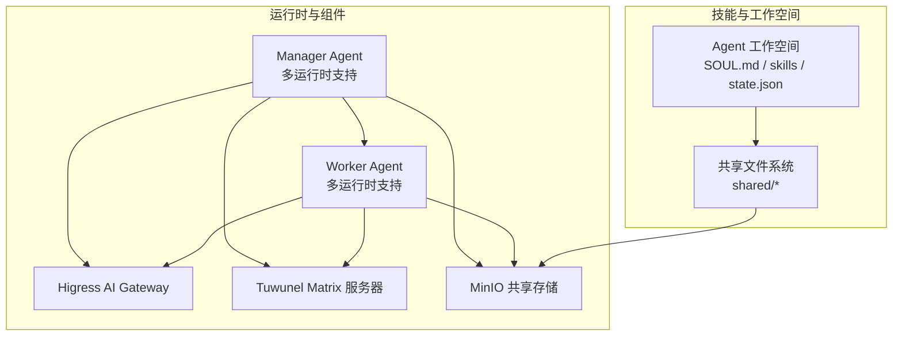
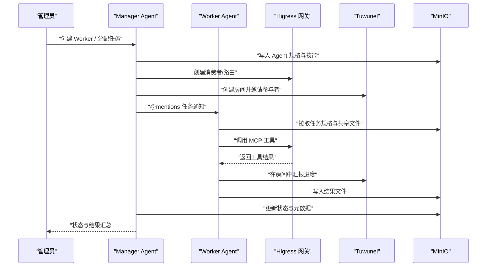
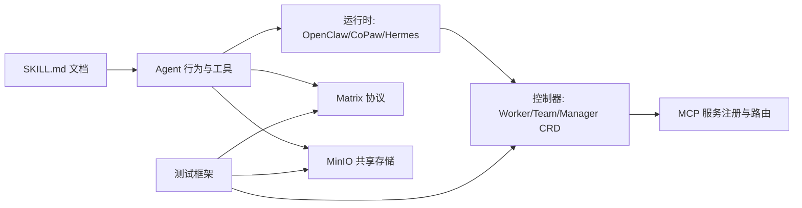

# 开发工作流程

<cite>
**本文档引用的文件**
- [README.md](file://README.md)
- [docs/development.md](file://docs/development.md)
- [docs/zh-cn/development.md](file://docs/zh-cn/development.md)
- [docs/zh-cn/quickstart.md](file://docs/zh-cn/quickstart.md)
- [Makefile](file://Makefile)
- [tests/README.md](file://tests/README.md)
- [tests/skills/hiclaw-test/SKILL.md](file://tests/skills/hiclaw-test/SKILL.md)
- [manager/agent/AGENTS.md](file://manager/agent/AGENTS.md)
- [manager/agent/HEARTBEAT.md](file://manager/agent/HEARTBEAT.md)
- [manager/agent/skills/project-management/SKILL.md](file://manager/agent/skills/project-management/SKILL.md)
- [manager/agent/skills/task-management/SKILL.md](file://manager/agent/skills/task-management/SKILL.md)
- [manager/agent/skills/worker-management/SKILL.md](file://manager/agent/skills/worker-management/SKILL.md)
- [copaw/AGENTS.md](file://copaw/AGENTS.md)
- [changelog/current.md](file://changelog/current.md)
- [changelog/v1.0.1.md](file://changelog/v1.0.1.md)
- [changelog/v1.0.2.md](file://changelog/v1.0.2.md)
</cite>

## 目录
1. [引言](#引言)
2. [项目结构](#项目结构)
3. [核心组件](#核心组件)
4. [架构总览](#架构总览)
5. [详细组件分析](#详细组件分析)
6. [依赖关系分析](#依赖关系分析)
7. [性能考量](#性能考量)
8. [故障排查指南](#故障排查指南)
9. [结论](#结论)
10. [附录](#附录)

## 引言
本指南面向 HiClaw 技能开发者，系统阐述从需求分析到技能发布的完整开发流程，涵盖设计、编码、测试与发布各环节。文档结合仓库内的开发指南、技能文档与测试框架，给出可落地的步骤、最佳实践与排障要点，帮助团队建立标准化的技能开发与版本管理流程。

## 项目结构
HiClaw 采用多容器与多运行时协同的架构：Manager 负责编排与人类可见性，Worker 负责具体任务执行，Higress 网关统一接入与凭证管理，Tuwunel 提供 Matrix 协议通信，MinIO 提供共享文件系统。技能以 SKILL.md 与配套脚本的形式注入到 Manager/Worker Agent 的工作空间，通过文件系统与 MCP 服务实现可发现、可调用的能力。

图示来源
- [docs/development.md:305-333](file://docs/development.md#L305-L333)
- [docs/zh-cn/development.md:305-333](file://docs/zh-cn/development.md#L305-L333)

章节来源
- [README.md:240-333](file://README.md#L240-L333)
- [docs/development.md:12-14](file://docs/development.md#L12-L14)
- [docs/zh-cn/development.md:12-14](file://docs/zh-cn/development.md#L12-L14)

## 核心组件
- Manager Agent：负责任务委派、项目管理、Worker 生命周期与权限控制，提供心跳机制与状态管理。
- Worker Agent：按任务规格执行具体工作，通过文件系统与 MCP 服务协作。
- Higress 网关：统一路由、消费者与 MCP 服务注册，保障凭证安全。
- Tuwunel：Matrix 协议服务，提供人类与 Agent 的可见沟通通道。
- MinIO：集中式共享存储，支撑跨 Agent 的信息交换与持久化。

章节来源
- [docs/development.md:305-333](file://docs/development.md#L305-L333)
- [docs/zh-cn/development.md:305-333](file://docs/zh-cn/development.md#L305-L333)

## 架构总览
下图展示 Manager 与 Worker 的交互路径，以及技能如何通过文件系统与 MCP 服务被发现与调用。

图示来源
- [docs/development.md:129-151](file://docs/development.md#L129-L151)
- [docs/zh-cn/quickstart.md:78-166](file://docs/zh-cn/quickstart.md#L78-L166)

章节来源
- [docs/zh-cn/quickstart.md:1-338](file://docs/zh-cn/quickstart.md#L1-L338)

## 详细组件分析

### 设计阶段：需求分析与技能规划
- 明确技能边界与输入输出：参考 SKILL.md 的 front matter 与参考文档，确保技能职责清晰、接口完整。
- 设计工作流与状态：利用 state.json 与任务/项目元数据，明确状态流转与里程碑。
- 权限与安全：遵循凭证最小暴露原则，通过网关与共享存储实现安全隔离。

章节来源
- [manager/agent/skills/project-management/SKILL.md:1-37](file://manager/agent/skills/project-management/SKILL.md#L1-L37)
- [manager/agent/skills/task-management/SKILL.md:1-30](file://manager/agent/skills/task-management/SKILL.md#L1-L30)
- [manager/agent/skills/worker-management/SKILL.md:1-83](file://manager/agent/skills/worker-management/SKILL.md#L1-L83)

### 编码实现：技能开发与脚本编写
- 技能文档规范：SKILL.md 必须包含 YAML front matter（name/description），并提供参考文档与操作指引。
- 脚本与工具：使用脚本目录下的工具（如 manage-state.sh、lifecycle-worker.sh）保证原子性与一致性。
- 文件系统约定：遵循 shared/* 与 agents/<name>/* 的布局，确保 MinIO 同步与 MCP 工具发现。

章节来源
- [docs/development.md:373-387](file://docs/development.md#L373-L387)
- [docs/zh-cn/development.md:373-387](file://docs/zh-cn/development.md#L373-L387)
- [manager/agent/skills/task-management/SKILL.md:10-18](file://manager/agent/skills/task-management/SKILL.md#L10-L18)

### 测试验证：单元与集成测试
- 测试框架：通过 tests/README.md 描述的矩阵 API 驱动测试，验证 Manager/Worker 行为与系统副作用。
- 测试用例：覆盖 Manager 启动、Worker 创建、任务委派、协作与权限动态控制等场景。
- 调试与日志：使用 hiclaw-debug.sh 导出调试日志，定位挂起、无响应与 LLM 调用失败等问题。

章节来源
- [tests/README.md:1-87](file://tests/README.md#L1-L87)
- [tests/skills/hiclaw-test/SKILL.md:1-196](file://tests/skills/hiclaw-test/SKILL.md#L1-L196)

### 部署发布：构建与版本管理
- 构建与推送：通过 Makefile 的 build/push 目标构建多架构镜像并推送至镜像仓库，支持本地与 CI 场景。
- 版本策略：遵循 changelog/current.md 记录影响镜像的变更，配合 CI 的 release 工作流进行版本发布。
- 发布流程：使用 workflow_dispatch 触发手动发布，确保变更可追溯与可回滚。

章节来源
- [Makefile:121-446](file://Makefile#L121-L446)
- [changelog/current.md:1-12](file://changelog/current.md#L1-L12)
- [changelog/v1.0.1.md:1-57](file://changelog/v1.0.1.md#L1-L57)
- [changelog/v1.0.2.md:1-10](file://changelog/v1.0.2.md#L1-L10)

### 项目管理：任务分解与质量保证
- 任务分解：将复杂技能拆分为多个 SKILL.md 与脚本，明确前置条件与依赖。
- 进度跟踪：通过 state.json 与项目计划文件（plan.md）跟踪任务进展，结合心跳机制主动巡检。
- 质量保证：在本地安装与测试（make install + make test）后，再进入 CI 流程；必要时使用 make test-installed 针对已安装实例快速回归。

章节来源
- [docs/development.md:152-163](file://docs/development.md#L152-L163)
- [docs/zh-cn/development.md:152-163](file://docs/zh-cn/development.md#L152-L163)
- [manager/agent/HEARTBEAT.md:1-192](file://manager/agent/HEARTBEAT.md#L1-L192)

### 实际开发示例与最佳实践
- 快速入门：参考快速入门文档完成安装、创建 Worker 与分配任务，验证端到端流程。
- 技能示例：项目管理、任务管理与 Worker 管理等 SKILL.md 提供了可复用的模板与参考文档。
- 最佳实践：优先使用 hiclaw CLI 管理资源，避免直接调用控制器 API；在 DM 中与 Admin 对话时遵循 @mentions 规则与 NO_REPLY 使用规范。

章节来源
- [docs/zh-cn/quickstart.md:1-338](file://docs/zh-cn/quickstart.md#L1-L338)
- [manager/agent/AGENTS.md:119-220](file://manager/agent/AGENTS.md#L119-L220)

## 依赖关系分析
技能开发涉及多层依赖：Agent 行为由 SKILL.md 与脚本定义；运行时（OpenClaw/CoPaw/Hermes）决定 Agent 的实现；控制器负责资源编排与 MCP 注册；测试框架通过矩阵 API 驱动验证。

图示来源
- [docs/development.md:221-231](file://docs/development.md#L221-L231)
- [docs/zh-cn/development.md:221-231](file://docs/zh-cn/development.md#L221-L231)

章节来源
- [docs/development.md:221-231](file://docs/development.md#L221-L231)
- [docs/zh-cn/development.md:221-231](file://docs/zh-cn/development.md#L221-L231)

## 性能考量
- 多架构构建：默认构建 amd64 + arm64 清单，避免单架构覆盖多架构镜像；CI 使用 QEMU 模拟跨平台。
- 代理与网络：在中国大陆环境下，通过 DOCKER_BUILD_ARGS 与 no_proxy 配置代理，减少构建与测试失败。
- 日志与可观测：通过 hiclaw-debug.sh 与日志导出工具定位性能瓶颈与异常路径。

章节来源
- [docs/development.md:264-300](file://docs/development.md#L264-L300)
- [docs/zh-cn/development.md:264-300](file://docs/zh-cn/development.md#L264-L300)
- [tests/skills/hiclaw-test/SKILL.md:67-98](file://tests/skills/hiclaw-test/SKILL.md#L67-L98)

## 故障排查指南
- 常见症状与修复：包括 Node.js 版本不匹配、网关配置缺失、MinIO 代理拦截 localhost、CoPaw 通道静默日志等问题的诊断与修复路径。
- 调试工具：使用 replay 日志、矩阵 API、Higress 控制台与 MinIO 列表核验系统状态。
- 会话与状态：通过 session 文件与 state.json 核对任务状态与容器生命周期。

章节来源
- [docs/development.md:483-498](file://docs/development.md#L483-L498)
- [docs/zh-cn/development.md:483-498](file://docs/zh-cn/development.md#L483-L498)
- [tests/skills/hiclaw-test/SKILL.md:100-146](file://tests/skills/hiclaw-test/SKILL.md#L100-L146)

## 结论
HiClaw 的技能开发遵循“文档驱动行为、文件系统驱动协作、MCP 服务驱动工具调用”的范式。通过标准化的 SKILL.md、脚本与测试流程，结合多架构构建与版本变更记录，能够高效地交付高质量技能并保障线上稳定性。建议在团队内固化“设计-编码-测试-发布”闭环，持续优化心智模型与工具链。

## 附录
- 快速开始：参考快速入门文档完成安装与首次任务验证。
- 开发指南：参考开发文档了解构建、测试与调试流程。
- 技能参考：项目管理、任务管理与 Worker 管理等 SKILL.md 提供了可直接复用的模板。

章节来源
- [docs/zh-cn/quickstart.md:1-338](file://docs/zh-cn/quickstart.md#L1-L338)
- [docs/development.md:1-498](file://docs/development.md#L1-L498)
- [docs/zh-cn/development.md:1-498](file://docs/zh-cn/development.md#L1-L498)