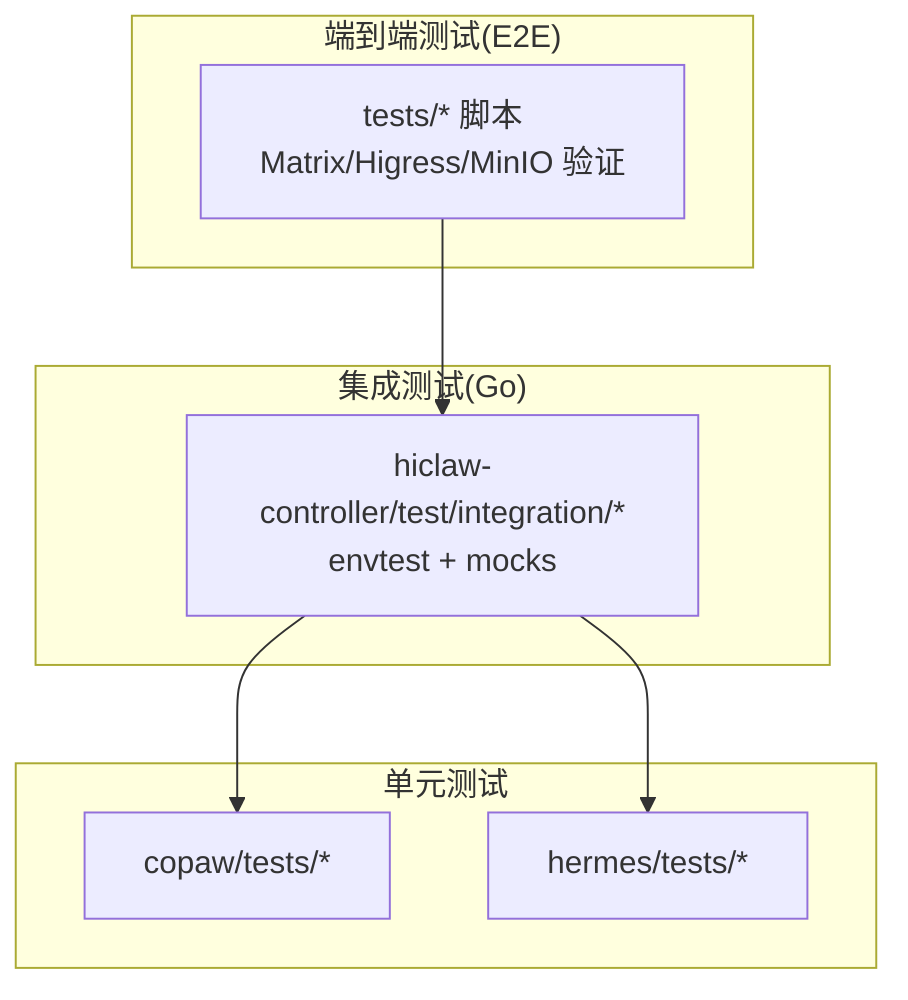
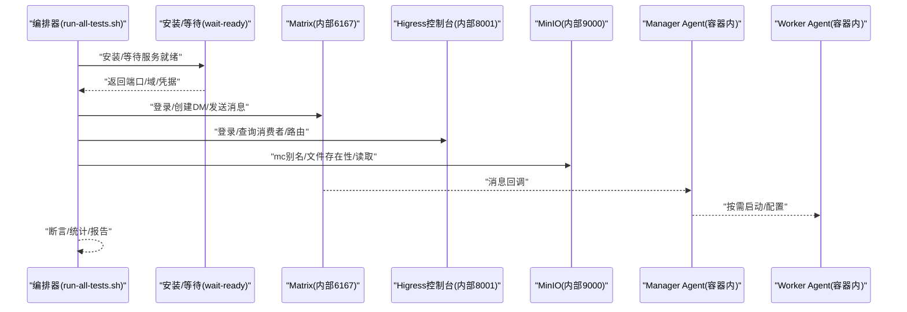
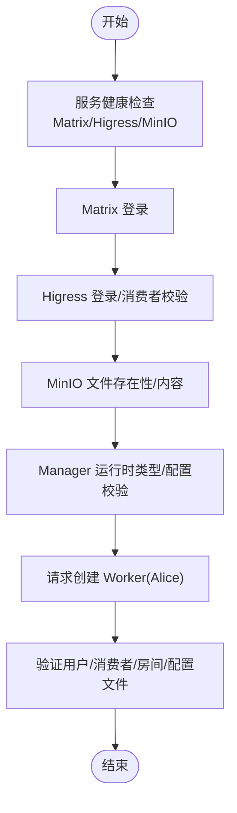
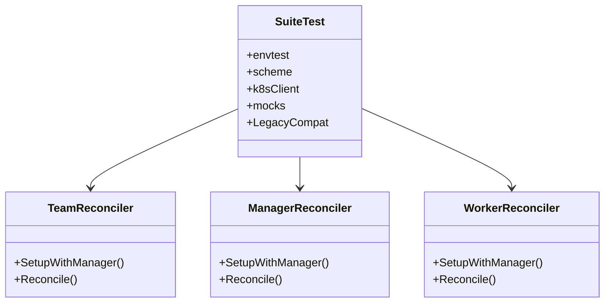
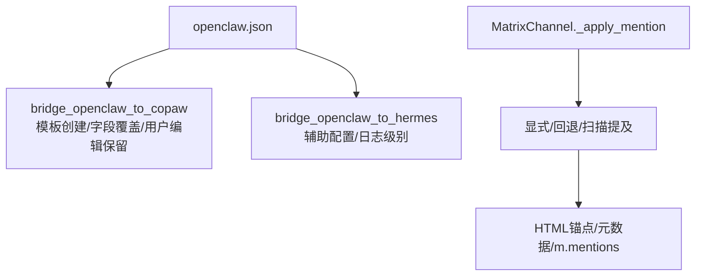
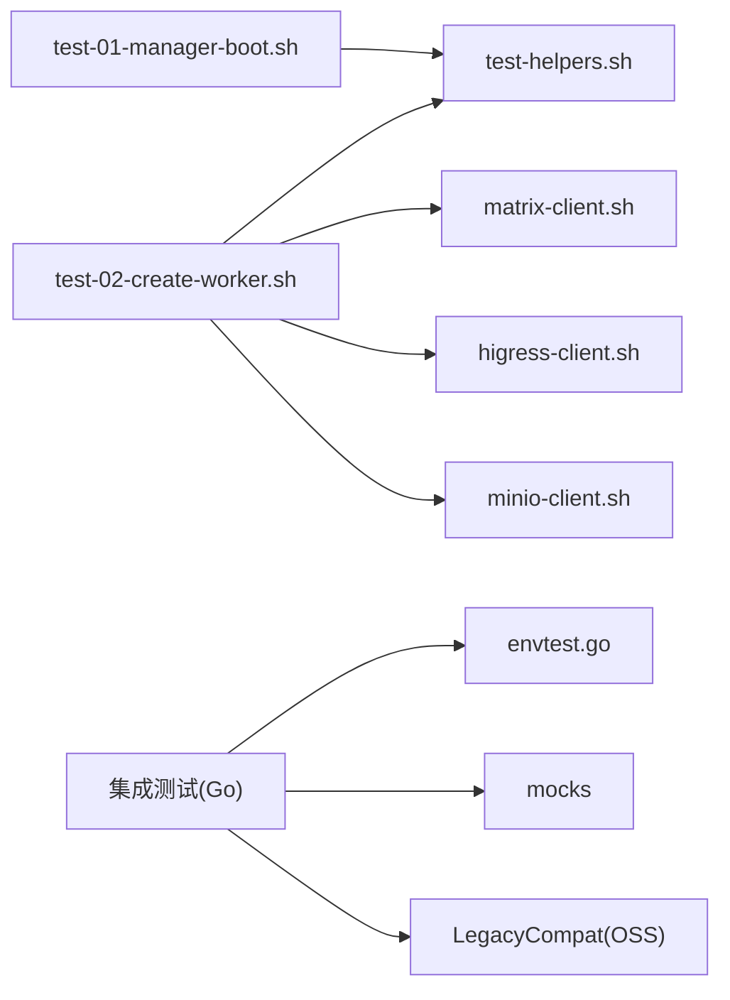

# 测试验证

<cite>
**本文引用的文件**
- [tests/README.md](file://tests/README.md)
- [tests/run-all-tests.sh](file://tests/run-all-tests.sh)
- [tests/test-01-manager-boot.sh](file://tests/test-01-manager-boot.sh)
- [tests/test-02-create-worker.sh](file://tests/test-02-create-worker.sh)
- [tests/lib/test-helpers.sh](file://tests/lib/test-helpers.sh)
- [tests/lib/matrix-client.sh](file://tests/lib/matrix-client.sh)
- [tests/lib/higress-client.sh](file://tests/lib/higress-client.sh)
- [tests/lib/minio-client.sh](file://tests/lib/minio-client.sh)
- [hiclaw-controller/test/integration/controller/suite_test.go](file://hiclaw-controller/test/integration/controller/suite_test.go)
- [hiclaw-controller/test/integration/controller/team_test.go](file://hiclaw-controller/test/integration/controller/team_test.go)
- [hiclaw-controller/test/integration/controller/manager_test.go](file://hiclaw-controller/test/integration/controller/manager_test.go)
- [hiclaw-controller/test/integration/controller/worker_test.go](file://hiclaw-controller/test/integration/controller/worker_test.go)
- [hiclaw-controller/test/testutil/envtest.go](file://hiclaw-controller/test/testutil/envtest.go)
- [copaw/tests/test_bridge.py](file://copaw/tests/test_bridge.py)
- [copaw/tests/test_channel_mention.py](file://copaw/tests/test_channel_mention.py)
- [hermes/tests/test_bridge.py](file://hermes/tests/test_bridge.py)
- [Makefile](file://Makefile)
</cite>

## 目录
1. [引言](#引言)
2. [项目结构](#项目结构)
3. [核心组件](#核心组件)
4. [架构总览](#架构总览)
5. [详细组件分析](#详细组件分析)
6. [依赖分析](#依赖分析)
7. [性能考虑](#性能考虑)
8. [故障排查指南](#故障排查指南)
9. [结论](#结论)
10. [附录](#附录)

## 引言
本指南面向 HiClaw 技能测试与验证，系统化阐述技能测试策略、测试用例设计与验证流程，覆盖单元测试、集成测试与端到端测试（E2E）。内容包括：测试环境搭建、测试数据准备、自动化测试脚本编写、测试用例模板与规范（功能、性能、安全）、测试结果分析、缺陷跟踪与回归测试策略。文档以仓库现有测试实现为依据，结合代码级分析与可视化图示，帮助读者快速落地高质量验证。

## 项目结构
HiClaw 的测试体系由三层构成：
- 端到端测试（E2E）：通过 Matrix API 模拟人类交互，验证系统响应与副作用（Higress 控制台、MinIO 存储、Manager Agent 行为等）。
- 集成测试（Go）：基于 envtest 在 Kubernetes 环境中对控制器进行集成验证，断言 CR 生命周期、状态收敛与错误路径。
- 单元测试（Python/Go）：针对桥接逻辑、通道可见提及、配置生成等模块进行细粒度断言。

图表来源
- [tests/README.md:1-87](file://tests/README.md#L1-L87)
- [hiclaw-controller/test/integration/controller/suite_test.go:1-234](file://hiclaw-controller/test/integration/controller/suite_test.go#L1-L234)
- [copaw/tests/test_bridge.py:1-405](file://copaw/tests/test_bridge.py#L1-L405)
- [hermes/tests/test_bridge.py:1-110](file://hermes/tests/test_bridge.py#L1-L110)

章节来源
- [tests/README.md:1-87](file://tests/README.md#L1-L87)
- [Makefile:517-528](file://Makefile#L517-L528)

## 核心组件
- 端到端测试编排器：tests/run-all-tests.sh，负责镜像构建、安装 Manager、身份初始化、逐条执行测试用例、聚合结果。
- 测试助手库：tests/lib/test-helpers.sh 提供断言、等待、容器间通信、配置检测、指标采集等通用能力。
- Matrix 客户端：tests/lib/matrix-client.sh 封装注册、登录、房间管理、消息收发、等待回复等。
- Higress 客户端：tests/lib/higress-client.sh 封装登录、消费者/路由/MCP 查询。
- MinIO 客户端：tests/lib/minio-client.sh 封装 mc 别名设置、文件存在性/读取/等待。
- 控制器集成测试：hiclaw-controller/test/integration/controller/* 基于 envtest + mocks 验证 Team/Manager/Worker CR 生命周期与状态收敛。
- 桥接与通道单元测试：copaw/tests/test_bridge.py、copaw/tests/test_channel_mention.py、hermes/tests/test_bridge.py 验证配置桥接、可见提及规则、辅助配置生成。

章节来源
- [tests/run-all-tests.sh:1-388](file://tests/run-all-tests.sh#L1-L388)
- [tests/lib/test-helpers.sh:1-549](file://tests/lib/test-helpers.sh#L1-L549)
- [tests/lib/matrix-client.sh:1-552](file://tests/lib/matrix-client.sh#L1-L552)
- [tests/lib/higress-client.sh:1-85](file://tests/lib/higress-client.sh#L1-L85)
- [tests/lib/minio-client.sh:1-59](file://tests/lib/minio-client.sh#L1-L59)
- [hiclaw-controller/test/integration/controller/suite_test.go:1-234](file://hiclaw-controller/test/integration/controller/suite_test.go#L1-L234)
- [hiclaw-controller/test/integration/controller/team_test.go:1-800](file://hiclaw-controller/test/integration/controller/team_test.go#L1-L800)
- [hiclaw-controller/test/integration/controller/manager_test.go:1-800](file://hiclaw-controller/test/integration/controller/manager_test.go#L1-L800)
- [hiclaw-controller/test/integration/controller/worker_test.go:1-800](file://hiclaw-controller/test/integration/controller/worker_test.go#L1-L800)
- [copaw/tests/test_bridge.py:1-405](file://copaw/tests/test_bridge.py#L1-L405)
- [copaw/tests/test_channel_mention.py:1-202](file://copaw/tests/test_channel_mention.py#L1-L202)
- [hermes/tests/test_bridge.py:1-110](file://hermes/tests/test_bridge.py#L1-L110)

## 架构总览
下图展示 E2E 测试从编排器到被测系统的调用链路与断言点。

图表来源
- [tests/run-all-tests.sh:117-178](file://tests/run-all-tests.sh#L117-L178)
- [tests/lib/matrix-client.sh:15-49](file://tests/lib/matrix-client.sh#L15-L49)
- [tests/lib/higress-client.sh:13-23](file://tests/lib/higress-client.sh#L13-L23)
- [tests/lib/minio-client.sh:10-15](file://tests/lib/minio-client.sh#L10-L15)
- [Makefile:495-515](file://Makefile#L495-L515)

章节来源
- [tests/README.md:7-19](file://tests/README.md#L7-L19)
- [tests/run-all-tests.sh:117-178](file://tests/run-all-tests.sh#L117-L178)

## 详细组件分析

### 端到端测试策略与用例设计
- 策略要点
  - 以人类交互为输入，验证系统行为与外部资源状态一致性。
  - 使用稳定的等待与轮询机制，避免脆弱的时序假设。
  - 通过“YOLO 模式”减少人工干预，提升自动化程度。
  - 对关键路径（服务健康、认证、存储落盘、运行时配置）分别断言。
- 典型用例
  - test-01：Manager 启动、服务健康、IM 登录、Higress 控制台会话、MinIO 存储、Manager 运行时类型与配置。
  - test-02：创建 Worker（Alice），验证 Manager 创建 Matrix 用户/消费者/房间/配置文件，并返回安装参数。

图表来源
- [tests/test-01-manager-boot.sh:14-134](file://tests/test-01-manager-boot.sh#L14-L134)
- [tests/test-02-create-worker.sh:28-121](file://tests/test-02-create-worker.sh#L28-L121)

章节来源
- [tests/test-01-manager-boot.sh:1-153](file://tests/test-01-manager-boot.sh#L1-L153)
- [tests/test-02-create-worker.sh:1-149](file://tests/test-02-create-worker.sh#L1-L149)

### 集成测试（Kubernetes 控制器）
- 测试框架
  - envtest：在内存中启动 etcd/apiserver，加载 CRD，提供缓存同步。
  - mocks：隔离后端（Provisioner/Deployer/Backend/EnvBuilder），专注控制器逻辑。
  - Legacy 兼容层：通过内存 OSS 断言 workers-registry.json 等侧效。
- 关键断言
  - Team/Manager/Worker CR 生命周期：创建/更新/删除、Finalizer、状态收敛、失败路径。
  - 成员清理、并发更新、标签传播、Pod 容错与重建。
  - MCP 服务器配置变更触发配置重写。
- 并发与稳定性
  - 使用 assertEventually 替代脆弱日志匹配，确保跨版本稳定。

图表来源
- [hiclaw-controller/test/integration/controller/suite_test.go:67-214](file://hiclaw-controller/test/integration/controller/suite_test.go#L67-L214)
- [hiclaw-controller/test/integration/controller/team_test.go:63-144](file://hiclaw-controller/test/integration/controller/team_test.go#L63-L144)
- [hiclaw-controller/test/integration/controller/manager_test.go:23-69](file://hiclaw-controller/test/integration/controller/manager_test.go#L23-L69)
- [hiclaw-controller/test/integration/controller/worker_test.go:22-68](file://hiclaw-controller/test/integration/controller/worker_test.go#L22-L68)

章节来源
- [hiclaw-controller/test/integration/controller/suite_test.go:1-234](file://hiclaw-controller/test/integration/controller/suite_test.go#L1-L234)
- [hiclaw-controller/test/integration/controller/team_test.go:1-800](file://hiclaw-controller/test/integration/controller/team_test.go#L1-L800)
- [hiclaw-controller/test/integration/controller/manager_test.go:1-800](file://hiclaw-controller/test/integration/controller/manager_test.go#L1-L800)
- [hiclaw-controller/test/integration/controller/worker_test.go:1-800](file://hiclaw-controller/test/integration/controller/worker_test.go#L1-L800)
- [hiclaw-controller/test/testutil/envtest.go:1-35](file://hiclaw-controller/test/testutil/envtest.go#L1-L35)

### 单元测试（桥接与通道）
- CoPaw 桥接测试：验证 openclaw → copaw 配置桥接策略（模板创建、字段覆盖策略、用户编辑保留、嵌入模型配置、心跳字段等）。
- Hermes 桥接测试：验证 openclaw → hermes 配置桥接（辅助视觉配置、调试日志级别）。
- 通道可见提及：验证 _apply_mention 规则（显式用户 ID、回退发送者、正则扫描、自提及屏蔽、媒体事件格式化、多目标锚点）。

图表来源
- [copaw/tests/test_bridge.py:91-383](file://copaw/tests/test_bridge.py#L91-L383)
- [hermes/tests/test_bridge.py:14-109](file://hermes/tests/test_bridge.py#L14-L109)
- [copaw/tests/test_channel_mention.py:29-202](file://copaw/tests/test_channel_mention.py#L29-L202)

章节来源
- [copaw/tests/test_bridge.py:1-405](file://copaw/tests/test_bridge.py#L1-L405)
- [copaw/tests/test_channel_mention.py:1-202](file://copaw/tests/test_channel_mention.py#L1-L202)
- [hermes/tests/test_bridge.py:1-110](file://hermes/tests/test_bridge.py#L1-L110)

## 依赖分析
- 端到端测试依赖
  - Docker 容器：hiclaw-controller、hiclaw-manager、hiclaw-worker-*。
  - 网络端口：Matrix(6167)、Higress Console(8001)、MinIO(9000)。
  - 环境变量：LLM API Key、GitHub Token（可选）、注册令牌、管理员凭据。
- 集成测试依赖
  - envtest：CRD 目录、scheme 注册。
  - mocks：Provisioner/Deployer/Backend/EnvBuilder。
  - 内存 OSS：用于断言 workers-registry.json 等侧效。
- 单元测试依赖
  - Python/pytest 运行时。
  - 临时目录与 JSON/YAML 解析。

图表来源
- [tests/test-01-manager-boot.sh:1-153](file://tests/test-01-manager-boot.sh#L1-L153)
- [tests/test-02-create-worker.sh:1-149](file://tests/test-02-create-worker.sh#L1-L149)
- [tests/lib/test-helpers.sh:1-549](file://tests/lib/test-helpers.sh#L1-L549)
- [tests/lib/matrix-client.sh:1-552](file://tests/lib/matrix-client.sh#L1-L552)
- [tests/lib/higress-client.sh:1-85](file://tests/lib/higress-client.sh#L1-L85)
- [tests/lib/minio-client.sh:1-59](file://tests/lib/minio-client.sh#L1-L59)
- [hiclaw-controller/test/integration/controller/suite_test.go:67-214](file://hiclaw-controller/test/integration/controller/suite_test.go#L67-L214)
- [hiclaw-controller/test/testutil/envtest.go:22-34](file://hiclaw-controller/test/testutil/envtest.go#L22-L34)

章节来源
- [tests/lib/test-helpers.sh:13-434](file://tests/lib/test-helpers.sh#L13-L434)
- [hiclaw-controller/test/integration/controller/suite_test.go:33-56](file://hiclaw-controller/test/integration/controller/suite_test.go#L33-L56)

## 性能考虑
- 端到端测试
  - 使用 wait_until/matrix_wait_for_reply_matching 等等待函数，避免忙轮询。
  - 通过 wait_for_session_stable 避免竞态，减少误报。
  - 通过 metrics 基线差分收集增量指标，定位异常波动。
- 集成测试
  - 使用 cacheless client 与索引字段，保证读取最新状态。
  - 通过 assertEventually 替代固定 sleep，缩短失败收敛时间。
- 单元测试
  - 通过临时目录与最小化 fixture，降低 IO 开销。
  - 保持断言粒度，避免过度耦合。

[本节为通用指导，不直接分析具体文件]

## 故障排查指南
- 环境与安装
  - 使用 make wait-ready/wait-ready-embedded 等目标确认服务就绪。
  - 若已有安装，使用 --use-existing 参数跳过安装步骤。
- 常见问题
  - LLM API Key 缺失：部分测试需要 HICLAW_LLM_API_KEY；可通过 require_llm_key 提前退出。
  - 管理员凭据/注册令牌：通过 hiclaw-manager.env 或环境变量注入。
  - 端口映射/域名：通过 detect_manager_config 自动检测并重建 URL。
- 日志与诊断
  - 使用 make logs 查看控制器与 Worker 最新日志。
  - E2E 失败时查看 Manager Agent 错误日志（/var/log/hiclaw/manager-agent-error.log）。
  - 使用 replay-task.sh 快速复现任务对话，定位问题。

章节来源
- [tests/lib/test-helpers.sh:481-549](file://tests/lib/test-helpers.sh#L481-L549)
- [Makefile:495-515](file://Makefile#L495-L515)
- [Makefile:700-708](file://Makefile#L700-L708)
- [tests/test-02-create-worker.sh:84-88](file://tests/test-02-create-worker.sh#L84-L88)

## 结论
HiClaw 的测试体系以 E2E 为入口，以集成测试为骨干，以单元测试为补充，形成从端到端行为到控制器收敛再到模块细节的完整验证闭环。通过稳定的等待与断言策略、清晰的测试数据与环境准备、完善的指标与日志支持，能够高效发现缺陷并保障回归质量。建议在持续集成中固定运行顺序与超时，结合覆盖率与性能基线，进一步完善测试体系。

[本节为总结性内容，不直接分析具体文件]

## 附录

### 测试环境搭建与运行
- 本地一键测试
  - make test：构建镜像并运行全部 E2E 测试。
  - make test TEST_FILTER="01 02"：仅运行指定编号用例。
  - make test SKIP_INSTALL=1：在已安装的 Manager 上运行测试。
- 集成测试（Go）
  - go test -tags=integration ./hiclaw-controller/test/integration/controller/...
- 单元测试（Python）
  - pytest copaw/tests/
  - pytest hermes/tests/

章节来源
- [Makefile:517-528](file://Makefile#L517-L528)
- [Makefile:104-113](file://Makefile#L104-L113)
- [tests/README.md:37-72](file://tests/README.md#L37-L72)

### 测试用例模板与规范
- 功能测试
  - 输入：Matrix 消息/命令、Higress 控制台操作、MinIO 文件写入。
  - 输出：Manager 回复、消费者/房间/文件落盘、运行时配置。
  - 断言：HTTP 状态码、JSON 字段、文件存在性、容器状态。
- 性能测试
  - 指标：消息往返延迟、Worker 启动时间、配置部署耗时。
  - 方法：对比基线（snapshot_baseline）与增量（collect_delta_metrics）。
- 安全测试
  - 认证：Higress 登录、Matrix 登录、注册令牌。
  - 授权：MCP 权限动态撤销/恢复、路由授权有效性。
  - 数据：MinIO 文件权限、敏感信息不泄露。

章节来源
- [tests/lib/test-helpers.sh:172-384](file://tests/lib/test-helpers.sh#L172-L384)
- [tests/lib/higress-client.sh:13-84](file://tests/lib/higress-client.sh#L13-L84)
- [tests/lib/minio-client.sh:10-59](file://tests/lib/minio-client.sh#L10-L59)

### 缺陷跟踪与回归策略
- 缺陷跟踪
  - 使用测试失败列表（TEST_FAILURES）与断言失败信息定位根因。
  - 通过矩阵等待函数的日志输出捕获中间态，便于复盘。
- 回归策略
  - 以 envtest 为核心，针对 CR 生命周期与错误路径建立回归用例。
  - 对关键桥接逻辑（openclaw → copaw/hermes）增加单元测试覆盖。
  - 对可见提及规则（_apply_mention）建立边界条件用例。

章节来源
- [tests/lib/test-helpers.sh:454-475](file://tests/lib/test-helpers.sh#L454-L475)
- [tests/lib/matrix-client.sh:153-300](file://tests/lib/matrix-client.sh#L153-L300)
- [hiclaw-controller/test/integration/controller/team_test.go:146-227](file://hiclaw-controller/test/integration/controller/team_test.go#L146-L227)
- [copaw/tests/test_channel_mention.py:29-202](file://copaw/tests/test_channel_mention.py#L29-L202)